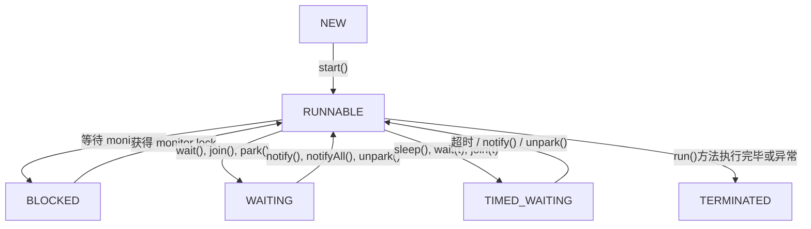
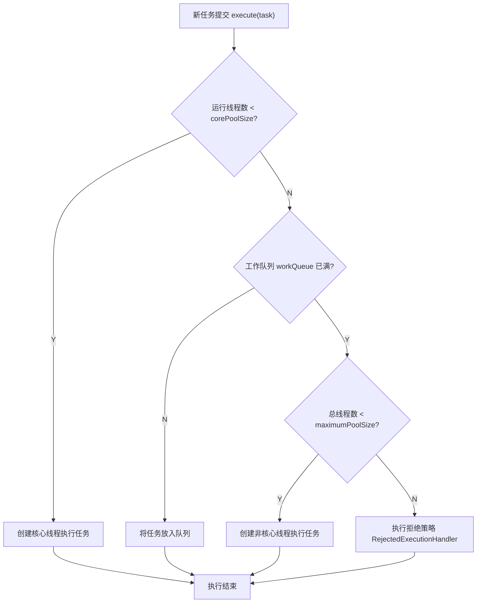
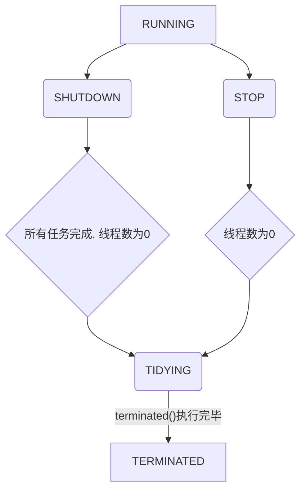

## 并行跟并发有什么区别？

最核心的区别在于**任务是否在同一时刻被同时执行**。

- **并发 (Concurrency)** 是指在**同一个时间段内**，有多个任务都在运行，但对于单核处理器来说，任意一个时间点上其实只有一个任务在执行。 操作系统通过快速地在不同任务之间切换（这个过程也叫上下文切换），使得宏观上看起来这些任务像是在同时执行。 这是一种逻辑上的“同时”。

- **并行 (Parallelism)** 则是指在**同一时刻**，有多个任务在**物理上被同时执行**。 这需要硬件的支持，比如多核处理器或者多个处理器。

这个区别与计算机的 CPU 核心数量密切相关：

- **单核 CPU**：在只有一个 CPU 核心的情况下，我们只能实现**并发**。计算机通过将 CPU 的时间划分成极短的时间片，轮流分配给不同的任务，从而营造出任务在同时运行的假象。
- **多核 CPU**：当计算机拥有多个 CPU 核心时，**并行**才成为可能。 不同的核心可以在同一时刻执行不同的任务，实现真正的同时处理。当然，多核 CPU 也可以同时运行并发任务。例如，每个核心都在并发地处理多个任务。

### 总结

| 特性         | 并发 (Concurrency)                       | 并行 (Parallelism)                   |
| :----------- | :--------------------------------------- | :----------------------------------- |
| **时间点**   | 在同一时刻，只有一个任务在执行           | 在同一时刻，有多个任务在同时执行     |
| **时间段**   | 在同一时间段内，处理多个任务             | 在同一时间段内，处理多个任务         |
| **物理实质** | 逻辑上的同时，通过任务快速切换实现       | 物理上的同时                         |
| **硬件要求** | 单核或多核 CPU 均可                      | 必须是多核 CPU 或多处理器            |
| **核心目的** | 提高处理多任务的**响应能力**和资源利用率 | 提高单个任务的**执行速度**和计算能力 |

---

## 说说进程和线程的区别？

### 1. 核心定义：资源分配与 CPU 调度的基本单位

- **进程 (Process)**：是操作系统进行**资源分配和调度的基本单位**。可以理解为一个正在执行的程序实例。 当一个程序运行时，操作系统会为其创建一个进程，并分配独立的内存空间、文件句柄等系统资源。
- **线程 (Thread)**：是**CPU 调度和执行的基本单位**，也被称为轻量级进程。 它依存于进程存在，一个进程可以包含一个或多个线程。

可以这样理解：**进程是资源（例如：钱）的拥有者，而线程是真正干活的（花钱的）**。一家公司（进程）拥有资金、办公场地等资源，而公司里的员工（线程）利用这些资源去完成具体的工作任务。

### 2. 资源拥有与共享

- **进程**：进程之间是相互独立的，拥有各自独立的内存地址空间和其他资源（如文件描述符）。 这种独立性保证了一个进程的崩溃通常不会影响到其他进程。
- **线程**：同一进程内的所有线程**共享**该进程的资源，包括内存空间（代码段、数据段、堆）、打开的文件和信号处理器等。 但每个线程也拥有自己**独占**的资源，主要是：
  - **线程 ID**：唯一标识线程。
  - **程序计数器 (PC)**：记录下一条要执行的指令地址。
  - **寄存器集合**：保存线程运行时的状态。
  - **栈 (Stack)**：用于存储函数调用和局部变量。

### 3. 开销与效率

- **创建与销毁**：由于创建进程需要分配独立的资源，其开销远大于创建线程。 同样，销毁进程也需要回收所有资源，开销也很大。
- **切换**：进程切换时，需要切换整个页表和内核态堆栈，开销非常大。而线程切换只需要保存和恢复少量寄存器和栈的状态，发生在同一个地址空间内，因此开销小得多，效率更高。

### 4. 通信方式

- **进程间通信 (IPC - Inter-Process Communication)**：由于进程间资源隔离，通信相对复杂，需要借助操作系统提供的特定机制，例如：
  - **管道 (Pipe)**：包括匿名管道和有名管道，通常用于有亲缘关系的进程间。
  - **消息队列 (Message Queue)**：内核中的消息链表，克服了管道只能单向通信的缺点。
  - **共享内存 (Shared Memory)**：最高效的方式，但需要自行处理同步问题。
  - **信号量 (Semaphore)**：主要作为同步机制。
  - **套接字 (Socket)**：最通用，可用于不同主机之间的进程通信。
- **线程间通信**：由于线程共享内存，通信变得非常直接和方便。 它们可以直接读写进程的全局变量和数据结构。 不过，这也带来了数据同步和互斥的问题，因此需要使用锁机制（如互斥锁、读写锁）、条件变量、信号量等来进行同步控制，避免数据竞争。

### 5. 健壮性（鲁棒性）

- **多进程**：一个进程的崩溃不会影响其他进程，因此多进程的程序更加健壮。
- **多线程**：由于资源共享，一个线程的崩溃（例如非法内存访问）可能会导致整个进程的所有线程都终止。

### 总结表格

| 特性         | 进程 (Process)                        | 线程 (Thread)                            |
| ------------ | ------------------------------------- | ---------------------------------------- |
| **根本区别** | 操作系统**资源分配**的基本单位        | CPU**调度和执行**的基本单位              |
| **资源共享** | 进程间相互独立，不共享资源            | 同一进程的线程共享进程资源               |
| **系统开销** | 创建、销毁、切换的开销都很大          | 创建、销毁、切换的开销都很小             |
| **通信方式** | 需要通过 IPC 机制（管道、共享内存等） | 直接读写共享内存，通信方便               |
| **健壮性**   | 一个进程崩溃不影响其他进程，健壮性高  | 一个线程崩溃会导致整个进程退出，健壮性差 |
| **关系**     | 进程至少包含一个线程                  | 线程是进程的一部分，不能独立存在         |

综上所述，选择多进程还是多线程取决于具体的应用场景。如果任务需要频繁创建和销毁，并且需要大量数据共享，那么多线程是更好的选择。如果需要保证程序的稳定性和安全性，或者需要利用多核 CPU 进行密集计算（避免 Python 中 GIL 那样的限制），那么多进程则更为合适。

---

## 说说线程有几种创建方式？

总体来说，创建线程主要有以下四种方式：

### 1. 继承 `Thread` 类

这是最直观的一种方式。开发者可以创建一个类，继承自 `java.lang.Thread` 类，并重写其 `run()` 方法。`run()` 方法中包含了线程需要执行的任务代码。

**实现步骤：**

1.  定义一个类继承 `Thread`。
2.  重写父类的 `run()` 方法，将线程要执行的逻辑写在其中。
3.  创建该子类的实例。
4.  调用实例的 `start()` 方法来启动线程（注意不是直接调用 `run()` 方法）。

**示例代码：**

```java
class MyThread extends Thread {
    @Override
    public void run() {
        System.out.println("通过继承Thread类创建线程，当前线程：" + Thread.currentThread().getName());
    }
}

// 启动线程
MyThread thread = new MyThread();
thread.start();
```

**优点**：实现简单，代码直观。
**缺点**：Java 是单继承的，如果类已经继承了其他类，就无法再继承 `Thread` 类，扩展性较差。

### 2. 实现 `Runnable` 接口

这是更常用、更推荐的一种基础方式。开发者可以创建一个类实现 `java.lang.Runnable` 接口，并实现其 `run()` 方法。

**实现步骤：**

1.  定义一个类实现 `Runnable` 接口。
2.  实现接口中的 `run()` 方法。
3.  创建该实现类的实例。
4.  将此实例作为参数，创建一个 `Thread` 对象。
5.  调用 `Thread` 对象的 `start()` 方法。

**示例代码：**

```java
class MyRunnable implements Runnable {
    @Override
    public void run() {
        System.out.println("通过实现Runnable接口创建线程，当前线程：" + Thread.currentThread().getName());
    }
}

// 启动线程
MyRunnable myRunnable = new MyRunnable();
Thread thread = new Thread(myRunnable);
thread.start();
```

**优点**：

- 避免了单继承的局限性，类可以继承其他类的同时实现 `Runnable` 接口。
- 实现了任务逻辑（`run`方法）与线程对象（`Thread`）的解耦，更符合面向对象的思想。
- 多个线程可以共享同一个 `Runnable` 实例，方便实现资源共享。

### 3. 实现 `Callable` 接口（配合 `FutureTask`）

前两种方式的 `run()` 方法是没有返回值的。如果我们需要线程执行完任务后能返回一个结果，或者能抛出异常，那么就可以使用 `Callable` 接口。

**实现步骤：**

1.  创建一个类实现 `java.util.concurrent.Callable` 接口，并指定泛型返回值类型。
2.  实现接口的 `call()` 方法，这个方法有返回值，并且可以抛出异常。
3.  创建一个 `FutureTask` 对象，用 `Callable` 实例作为构造函数参数。
4.  将 `FutureTask` 对象作为参数，创建一个 `Thread` 对象。
5.  启动线程。
6.  通过 `FutureTask` 对象的 `get()` 方法获取线程执行的返回值（这个方法会阻塞，直到任务执行完毕）。

**示例代码：**

```java
import java.util.concurrent.Callable;
import java.util.concurrent.FutureTask;

class MyCallable implements Callable<String> {
    @Override
    public String call() throws Exception {
        System.out.println("通过实现Callable接口创建线程...");
        Thread.sleep(2000); // 模拟耗时操作
        return "任务执行完毕";
    }
}

// 启动线程并获取结果
MyCallable myCallable = new MyCallable();
FutureTask<String> futureTask = new FutureTask<>(myCallable);
Thread thread = new Thread(futureTask);
thread.start();

// 获取返回值（会阻塞当前主线程）
String result = futureTask.get();
System.out.println("线程执行结果: " + result);
```

**优点**：

- 可以获取线程的执行结果。
- 可以在任务执行中抛出异常，并在主线程中捕获。

### 4. 使用线程池 (Executor Framework)

在实际的生产环境中，我们通常不建议直接创建 `Thread` 对象，因为频繁地创建和销毁线程会带来很大的性能开销。更专业的做法是使用**线程池**来管理线程。线程池可以复用已创建的线程，避免了频繁创建销毁的开销，并提供了更强大的线程管理功能（如定时执行、并发数控制等）。

**实现步骤：**

1.  使用 `Executors` 工厂类创建一种线程池（如 `FixedThreadPool`, `CachedThreadPool`等）。
2.  创建一个实现了 `Runnable` 或 `Callable` 接口的任务。
3.  使用线程池的 `submit()` 或 `execute()` 方法提交任务。
4.  任务会被线程池中的某个线程执行。
5.  （可选）如果提交的是 `Callable` 任务，`submit()` 方法会返回一个 `Future` 对象，可以通过它来获取结果。
6.  当不再需要线程池时，调用 `shutdown()` 方法关闭。

**示例代码：**

```java
import java.util.concurrent.ExecutorService;
import java.util.concurrent.Executors;

// 使用 Runnable
ExecutorService pool = Executors.newFixedThreadPool(5);
pool.execute(new MyRunnable());

// 使用 Callable
Future<String> future = pool.submit(new MyCallable());
String result = future.get();
System.out.println("线程池执行结果: " + result);

// 关闭线程池
pool.shutdown();
```

**优点**：

- **降低资源消耗**：通过复用线程减少了创建和销毁线程的开销。
- **提高响应速度**：任务到达时，可以立即使用池中的线程执行，无需等待线程创建。
- **提高线程的可管理性**：线程是稀缺资源，使用线程池可以统一进行分配、调优和监控。

### 总结

虽然有多种创建方式，但它们的核心离不开 `Thread` 类和 `Runnable` 接口。实现 `Runnable` 和 `Callable` 接口是更推荐的做法，因为它将任务和线程进行了分离。而在现代企业级开发中，**使用线程池是创建和管理线程的最佳实践**。

---

## 调用 start 方法时会执行 run 方法，那怎么不直接调用 run 方法？

调用 `start()` 方法和直接调用 `run()` 方法，最本质的区别在于**是否创建了新的线程来执行任务**。

- **调用 `start()` 方法**：这是启动一个新线程的**唯一正确方式**。当调用 `start()` 方法时，它会向 Java 虚拟机（JVM）发出一个请求。JVM 会继而请求操作系统创建一个全新的线程。这个新创建的线程会获得自己的程序计数器、虚拟机栈和本地方法栈等资源，并进入**就绪（Runnable）状态**。一旦它获得了 CPU 时间片，这个新线程就会开始执行它的任务，也就是自动调用我们重写的 `run()` 方法。这个过程是**异步**的，调用 `start()` 的线程（比如主线程）不会等待 `run()` 方法执行完毕，而是会立即返回并继续执行自己的后续代码。

- **直接调用 `run()` 方法**：如果直接调用 `run()` 方法，那就**根本没有创建新的线程**。它就等同于调用一个普通的成员方法。`run()` 方法中的所有代码都会在**当前调用它的线程**中执行（比如在 `main` 今天的 `main` 线程中执行）。整个过程是**同步**的，调用线程必须等待 `run()` 方法完全执行结束后，才能继续执行下面的代码。这完全违背了我们使用多线程的初衷。

### 代码演示区别

下面的代码可以非常清晰地展示出二者的不同：

```java
public class StartVsRun {

    public static void main(String[] args) {
        // 创建一个线程任务
        Thread myThread = new Thread(() -> {
            System.out.println("进入 run 方法... 当前线程是: " + Thread.currentThread().getName());
            try {
                Thread.sleep(1000);
            } catch (InterruptedException e) {
                e.printStackTrace();
            }
            System.out.println("run 方法执行完毕。");
        }, "MyWorkerThread");

        System.out.println("--- 演示调用 start() 方法 ---");
        System.out.println("准备调用 start()。当前线程是: " + Thread.currentThread().getName());
        myThread.start();
        System.out.println("调用 start() 之后。当前线程是: " + Thread.currentThread().getName());

        // 为了防止主线程提前结束，让它也睡一会儿
        try {
            Thread.sleep(2000);
        } catch (InterruptedException e) {
            e.printStackTrace();
        }

        System.out.println("\n--- 演示直接调用 run() 方法 ---");
        // 注意：严格来说，一个线程对象start后不能再次start，这里为了演示，我们再创建一个实例
        Thread anotherThread = new Thread(() -> {
            System.out.println("进入 run 方法... 当前线程是: " + Thread.currentThread().getName());
            try {
                Thread.sleep(1000);
            } catch (InterruptedException e) {
                e.printStackTrace();
            }
            System.out.println("run 方法执行完毕。");
        }, "AnotherWorker");

        System.out.println("准备调用 run()。当前线程是: " + Thread.currentThread().getName());
        anotherThread.run();
        System.out.println("调用 run() 之后。当前线程是: " + Thread.currentThread().getName());
    }
}
```

**预期的输出结果会是：**

```
--- 演示调用 start() 方法 ---
准备调用 start()。当前线程是: main
调用 start() 之后。当前线程是: main
进入 run 方法... 当前线程是: MyWorkerThread  // <-- 注意这里，是新线程在执行
run 方法执行完毕。
--- 演示直接调用 run() 方法 ---
准备调用 run()。当前线程是: main
进入 run 方法... 当前线程是: main          // <-- 注意这里，还是main线程在执行
run 方法执行完毕。
调用 run() 之后。当前线程是: main
```

从输出可以明确看到：

1.  调用 `start()` 后，`run()` 方法是在一个名为 `MyWorkerThread` 的新线程中执行的，并且主线程 `main` 没有等待它结束，而是立刻打印了 "调用 start() 之后"。
2.  调用 `run()` 时，`run()` 方法是在 `main` 线程中执行的，主线程必须等待它内部的 `sleep` 和打印语句都完成后，才能打印 "调用 run() 之后"。

### 总结

| 特性           | 调用 `start()`                            | 直接调用 `run()`                                  |
| :------------- | :---------------------------------------- | :------------------------------------------------ |
| **线程创建**   | **创建**并启动一个新的线程                | **不创建**新线程                                  |
| **执行上下文** | `run()`方法由**新创建的线程**来执行       | `run()`方法由**调用者线程**（如 main 线程）来执行 |
| **执行流程**   | **异步执行**，调用者不等待`run()`方法完成 | **同步执行**，调用者需等待`run()`方法完成         |
| **核心目的**   | 实现真正的**多线程并发/并行**             | 仅作为普通方法调用，实现**单线程顺序**执行        |

---

## 线程有哪些调度方法？

Java 提供了多种方法来影响线程的调度，但需要强调的是，程序员通常只能对调度器进行**建议**或**施加影响**，而不能精确地控制它。最终的调度决策是由操作系统的线程调度器根据其调度算法来决定的。

以下是 Java 中常用的线程调度相关方法：

### 1. 线程休眠: `Thread.sleep()`

这是让线程暂停执行的最直接方式。

- **方法签名**: `public static native void sleep(long millis) throws InterruptedException;`
- **功能**: `sleep()` 是一个**静态方法**，它会使**当前正在执行的线程**暂停指定的毫秒数。线程会从**运行中 (Running)** 状态进入**计时等待 (Timed Waiting)** 状态。
- **核心特点**:
  - **不释放锁**: 如果当前线程在 `synchronized` 代码块或方法中调用 `sleep()`，它**不会释放**已经持有的对象锁（监视器锁）。这意味着其他线程在此期间仍然无法进入该 `synchronized` 区域。
  - **响应中断**: `sleep()` 方法会响应中断。如果一个正在休眠的线程被其他线程调用了 `interrupt()` 方法，`sleep()` 会抛出 `InterruptedException` 并清除线程的中断状态。

### 2. 线程让步: `Thread.yield()`

这个方法用于向调度器发出一个**暗示**。

- **方法签名**: `public static native void yield();`
- **功能**: `yield()` 也是一个**静态方法**，它会建议线程调度器，当前线程愿意放弃其对 CPU 的占用，从而给其他具有相同或更高优先级的线程一个执行的机会。
- **核心特点**:
  - **不保证生效**: 这仅仅是一个**建议**，调度器完全可以忽略这个请求。
  - **不释放锁**: 和 `sleep()` 一样，`yield()` 也**不会释放**任何锁。
  - **状态转换**: 调用 `yield()` 后，线程会从**运行中 (Running)** 状态转换回**就绪 (Runnable)** 状态，等待调度器再次选择它。它可能立即就再次被选中执行。

### 3. 线程加入/插队: `thread.join()`

这个方法用于协调线程间的执行顺序，实现等待。

- **方法签名**: `public final void join() throws InterruptedException;` (以及带超时的重载版本)
- **功能**: `join()` 是一个**实例方法**。假设在线程 A 中调用了 `threadB.join()`，那么线程 A 会进入**等待 (Waiting)** 状态，直到 `threadB` 执行完毕（终止）后，线程 A 才会从阻塞中恢复，继续执行。
- **核心特点**:
  - **线程同步**: `join()` 是一种非常有效的线程同步方式，常用于“等待某个前置任务完成”的场景。
  - **不释放锁**: 如果线程 A 在持有锁的情况下调用 `threadB.join()`，它**不会释放**自己持有的锁。
  - **响应中断**: `join()` 同样会响应中断并抛出 `InterruptedException`。

### 4. 线程等待与唤醒: `wait()`, `notify()`, `notifyAll()`

这是一组用于实现精细化线程间协作的底层机制，它们是 `Object` 类的方法，而不是 `Thread` 类的方法。

- **方法签名**: `public final void wait()`, `public final void notify()`, `public final void notifyAll()`
- **功能**:
  - `wait()`: 使当前线程进入**等待 (Waiting)** 状态，并**释放**它所持有的该对象的锁。线程会一直等待，直到其他线程在该对象上调用 `notify()` 或 `notifyAll()`。
  - `notify()`: 随机唤醒一个在该对象上等待的线程。被唤醒的线程不会立即执行，而是进入**就绪**状态，需要重新竞争锁。
  - `notifyAll()`: 唤醒所有在该对象上等待的线程，让它们一起去竞争锁。
- **核心特点**:
  - **必须在同步块中使用**: 这三个方法都必须在 `synchronized` 代码块或方法中调用，并且是针对当前持有的锁对象进行操作，否则会抛出 `IllegalMonitorStateException`。
  - **释放锁**: `wait()` 方法是本文提到的方法中**唯一一个会释放锁**的。这是它与 `sleep()` 和 `join()` 的一个关键区别。

### 5. 线程优先级: `thread.setPriority()`

- **方法签名**: `public final void setPriority(int newPriority);`
- **功能**: 设置线程的优先级，范围是 1 到 10，默认是 5。理论上，优先级越高的线程越有可能被调度器选中。
- **核心特点**:
  - **高度依赖操作系统**: Java 的线程优先级会映射到操作系统的原生线程优先级，但不同操作系统的优先级级别和调度策略差异很大，所以这个设置**不保证在所有平台上都有效**，其行为是不可预测的。
  - **避免滥用**: 在实际开发中，不应依赖线程优先级来控制程序的逻辑正确性，它只能作为一种性能优化的**尝试**。

### 6. 已废弃的方法: `stop()`, `suspend()`, `resume()`

这些方法在早期的 Java 版本中存在，但现在已被明确**废弃**，强烈不推荐使用。

- `stop()`: 强制终止线程，会立即释放该线程持有的所有锁，可能导致对象状态不一致，非常危险。
- `suspend()` 和 `resume()`: `suspend()` 会暂停一个线程但**不释放锁**，这极易导致**死锁**。

### 总结表格

| 方法                           | 所属类   | 主要作用                       | 是否释放锁 | 状态变化                       |
| :----------------------------- | :------- | :----------------------------- | :--------- | :----------------------------- |
| **`sleep(long)`**              | `Thread` | 使当前线程休眠指定时间         | **否**     | Running -> Timed Waiting       |
| **`yield()`**                  | `Thread` | 建议当前线程让出 CPU（不保证） | **否**     | Running -> Runnable            |
| **`join()`**                   | `Thread` | 等待该线程执行完毕             | **否**     | 调用者线程进入 Waiting         |
| **`wait()`**                   | `Object` | 使当前线程在对象上等待         | **是**     | Running -> Waiting             |
| **`notify()` / `notifyAll()`** | `Object` | 唤醒在对象上等待的线程         | **否**     | Waiting -> Runnable (需重获锁) |
| **`setPriority(int)`**         | `Thread` | 设置线程优先级（仅为建议）     | **否**     | -                              |

在现代 Java 开发中，我们更倾向于使用 `java.util.concurrent` 包中提供的高级并发工具，如 `Lock`, `Condition`, `Semaphore`, `CountDownLatch` 等，它们提供了比底层 `wait/notify` 更强大、更灵活的线程调度和协作功能。

---

## 线程有几种状态？

好的，面试官。关于 Java 中线程的状态，根据官方的 `java.lang.Thread.State` 枚举类的定义，一个线程在其生命周期中，总共可以划分为**六种状态**。

这六种状态分别是：

1.  **NEW (新建)**
2.  **RUNNABLE (可运行)**
3.  **BLOCKED (阻塞)**
4.  **WAITING (无限期等待)**
5.  **TIMED_WAITING (限期等待)**
6.  **TERMINATED (终止)**

下面我将对每一种状态进行详细的解释，并说明它们之间是如何转换的。

### 1. NEW (新建)

- **定义**：当一个线程对象被创建（例如 `new Thread()`)，但 `start()` 方法还未被调用时，该线程就处于新建状态。
- **特征**：此时的线程仅仅是一个 Java 对象，操作系统内部还没有为其创建真正的原生线程，因此它不占用任何 CPU 资源。
- **状态转换**：
  - 调用线程的 `start()` 方法后，状态会从 `NEW` 转换到 `RUNNABLE`。

### 2. RUNNABLE (可运行)

这是一个复合状态，它包含了传统操作系统概念中的**就绪 (Ready)** 和**运行中 (Running)** 两种状态。

- **定义**：当线程的 `start()` 方法被调用后，线程就进入了可运行状态。处于此状态的线程位于可运行线程池中，等待被线程调度器选中，以获取 CPU 的使用权。
- **特征**：
  - **就绪 (Ready)**：线程已经准备好运行，具备了运行所需的一切条件，正在等待调度器分配 CPU 时间片。
  - **运行中 (Running)**：线程已经获得了 CPU 时间片，正在执行其 `run()` 方法中的代码。
- **状态转换**：
  - `NEW -> RUNNABLE`: 调用 `start()` 方法。
  - `RUNNABLE -> BLOCKED`: 线程试图进入一个 `synchronized` 同步块，但该对象的锁被其他线程持有。
  - `RUNNABLE -> WAITING`: 线程调用了 `Object.wait()`、`Thread.join()` 或 `LockSupport.park()`。
  - `RUNNABLE -> TIMED_WAITING`: 线程调用了带超时参数的方法，如 `Thread.sleep(long)`, `Object.wait(long)`, `Thread.join(long)` 等。
  - `RUNNABLE -> TERMINATED`: 线程的 `run()` 方法执行完毕或因未捕获的异常而退出。

### 3. BLOCKED (阻塞)

- **定义**：线程因为等待获取一个**监视器锁 (monitor lock)** 而被暂停。这特指线程在进入 `synchronized` 修饰的方法或代码块时，由于锁被其他线程占用而导致的状态。
- **特征**：线程会暂时停止活动，直到它获得了它所等待的锁。
- **状态转换**：
  - `RUNNABLE -> BLOCKED`: 尝试进入 `synchronized` 区域失败。
  - `BLOCKED -> RUNNABLE`: 持有锁的线程释放了该锁，并且当前线程成功获得了这个锁。

### 4. WAITING (无限期等待)

- **定义**：处于此状态的线程正在等待另一个线程执行某个特定的动作（例如通知或中断）。它不会自己醒来，必须被外部显式地唤醒。
- **导致此状态的操作**：
  - 调用 `Object.wait()` 并没有设置超时。
  - 调用 `Thread.join()` 并没有设置超时。
  - 调用 `LockSupport.park()`。
- **状态转换**：
  - `RUNNABLE -> WAITING`: 调用上述任意方法。
  - `WAITING -> RUNNABLE`:
    - 另一个线程调用了该对象上的 `Object.notify()` 或 `Object.notifyAll()`。
    - `join()` 的目标线程执行完毕。
    - 另一个线程调用了 `LockSupport.unpark(Thread)`。
    - 另一个线程调用了该线程的 `interrupt()` 方法。

### 5. TIMED_WAITING (限期等待)

- **定义**：与 `WAITING` 类似，但它不会无限期地等待。它会在指定的时间过后，由系统自动唤醒。
- **导致此状态的操作**：
  - `Thread.sleep(long millis)`
  - `Object.wait(long timeout)`
  - `Thread.join(long millis)`
  - `LockSupport.parkNanos(long nanos)`
  - `LockSupport.parkUntil(long deadline)`
- **状态转换**：
  - `RUNNABLE -> TIMED_WAITING`: 调用上述任意方法。
  - `TIMED_WAITING -> RUNNABLE`:
    - 等待时间结束。
    - 在等待时间内被 `notify()`/`notifyAll()`/`unpark()` 唤醒，或被 `interrupt()` 中断。

### 6. TERMINATED (终止)

- **定义**：线程的 `run()` 方法已经正常执行完毕，或者因为一个未被捕获的异常而提前结束。
- **特征**：线程的生命周期已经结束，它不再消耗任何 CPU 资源，并且不能再次通过 `start()` 方法来启动。

### 线程状态转换图

下面是一个简化的线程状态转换图，可以更直观地理解这些状态间的关系：



---

## 什么是线程上下文切换？

### 1. 核心定义

线程上下文切换（Thread Context Switch）指的是，CPU 从一个正在执行的线程的指令，转而去执行另一个线程的指令的过程。

更具体地说，由于现代操作系统都是多任务的，而单个 CPU 核心在同一时刻只能执行一个任务。为了实现“看起来像是同时运行多个任务”的效果（即并发），CPU 需要通过极快地在不同线程之间轮换执行来实现。这个“轮换”的动作，就叫做上下文切换。

### 2. 什么是“上下文” (Context)？

“上下文”可以理解为线程执行时所依赖的**环境状态**。当一个线程被暂停时，操作系统必须完整地保存它当前的所有状态，以便将来它能无缝地从被暂停的地方继续执行，就好像从未被打断过一样。

这个“上下文”主要包括：

- **寄存器集合 (Register Set)**：这是最核心的部分。
  - **程序计数器 (Program Counter, PC)**：记录了线程当前执行到了哪一条指令的地址。这是下次恢复时首先要加载的，以确保程序能继续执行。
  - **通用寄存器 (General-Purpose Registers)**：存储了线程运行过程中的各种变量和中间计算结果。
  - **栈指针 (Stack Pointer)**：指向线程私有栈的顶端，用于管理函数调用和局部变量。
- **线程的状态 (Thread State)**：例如 `RUNNING`, `BLOCKED`, `WAITING` 等，这些状态信息也需要被保存。
- **线程的私有栈 (Stack)**：栈中存储了局部变量、方法参数、返回地址等。在切换时，栈指针的保存至关重要。

### 3. 为什么要进行上下文切换？（触发时机）

上下文切换的发生通常有以下几种情况：

1.  **线程的时间片用完（抢占式）**：操作系统为了公平，会给每个线程分配一个固定的执行时间，称为“时间片”。当一个线程的时间片用完后，即使它还在运行，操作系统也会强制剥夺其 CPU 使用权，切换到另一个线程。
2.  **线程主动阻塞**：当线程执行到某些操作，导致它无法继续下去时，它会主动放弃 CPU，进入阻塞状态。
    - **I/O 操作**：如读写文件、网络请求等，这些操作非常耗时，线程会进入阻塞等待 I/O 完成。
    - **等待锁**：线程尝试进入一个 `synchronized` 代码块，但锁被其他线程持有。
    - **主动休眠**：线程调用 `Thread.sleep()`。
    - **等待通知**：线程调用 `Object.wait()` 或 `thread.join()`。
3.  **线程主动让出 CPU**：线程调用 `Thread.yield()` 方法，建议调度器可以切换到其他线程，但这只是一个建议，不一定会发生切换。
4.  **硬件中断**：当发生硬件中断时（如键盘输入、时钟中断），CPU 会中断当前线程，去执行操作系统的中断服务程序。处理完毕后，可能会返回原来的线程，也可能切换到其他线程。

### 4. 上下文切换的开销

上下文切换**不是免费的**，它会带来显著的性能开销：

- **直接开销**：CPU 需要花费时间来执行保存和加载上下文的操作。这部分时间是纯粹的系统开销，没有执行任何有用的业务逻辑。
- **间接开销**：这是影响性能的关键。当一个新线程被加载到 CPU 上时，它所需要的数据很可能不在 CPU 的高速缓存（L1, L2, L3 Cache）中。CPU 需要从速度慢得多的主内存中去加载数据，这个过程会导致大量的 **Cache Miss（缓存未命中）**，从而严重影响新线程的执行效率。只有当新线程运行一段时间后，将自己的“热点数据”加载进缓存，其运行速度才会恢复正常。

因此，在并发编程中，一个重要的优化方向就是**减少不必要的上下文切换**。例如，使用无锁并发数据结构、减少锁的竞争、根据业务场景合理设置线程池大小等，都是为了降低上下文切换带来的性能损耗。

---

## 守护线程了解吗？

守护线程（Daemon Thread）在 Java 中是一种特殊的、低优先级的线程。它的核心使命是**为其他非守护线程（即用户线程）提供服务**。

### 核心特征：JVM 的“生死相随”

守护线程最重要、最独特的特征在于它**不会阻止 Java 虚拟机（JVM）的退出**。

- **用户线程 (User Thread)**：只要有任何一个用户线程还在运行，JVM 就不会退出。可以把它理解为程序的主要任务，是“主角”。
- **守护线程 (Daemon Thread)**：当程序中**所有**的用户线程都已经执行完毕并终止后，无论守护线程是否还在工作，JVM 都会立即退出。守护线程的生命周期依附于用户线程，是“配角”或“服务员”。

### 一个生动的比喻

您可以把整个 Java 应用程序（JVM）想象成一场晚会。

- **用户线程**是晚会上的**宾客**。
- **守护线程**是晚会上的**服务员**（比如倒酒的、播放背景音乐的）。

只要还有任何一位宾客没有离开，晚会就必须继续下去，服务员也必须继续提供服务。但是，一旦所有的宾客都走光了，晚会就立刻结束，此时会直接“关灯走人”，而不会特意去等服务员是否收拾完了桌子或关掉了音乐。

### 如何设置守护线程

在 Java 中，通过 `thread.setDaemon(boolean isDaemon)` 方法可以将一个线程设置为守护线程。

- **关键规则**：这个方法**必须在调用 `thread.start()` 方法之前**设置。如果线程已经启动，再尝试设置它会抛出 `IllegalThreadStateException`。

**示例代码：**

```java
public class DaemonThreadDemo {
    public static void main(String[] args) {
        Thread daemonThread = new Thread(() -> {
            // 这个守护线程模拟一个无限循环的后台任务
            while (true) {
                try {
                    System.out.println("我是守护线程，正在后台运行...");
                    Thread.sleep(500);
                } catch (InterruptedException e) {
                    // 异常处理
                }
            }
        });

        // 将该线程设置为守护线程
        daemonThread.setDaemon(true);

        // 启动守护线程
        daemonThread.start();

        // 主线程（是一个用户线程）只执行2秒
        System.out.println("主线程（用户线程）开始执行...");
        try {
            Thread.sleep(2000);
        } catch (InterruptedException e) {
            // 异常处理
        }
        System.out.println("主线程执行完毕，即将退出。");
    }
}
```

**运行结果分析：**
当主线程（用户线程）打印 "主线程执行完毕，即将退出。" 并结束后，程序中就没有其他用户线程了。因此，JVM 会立即退出，那个还在无限循环中运行的守护线程也会被强制终止，你不会再看到 "我是守护线程..." 的输出了。

### 重要的注意事项（使用陷阱）

由于守护线程会被 JVM“粗暴地”终止，而不是等待它优雅地执行完毕，因此：

1.  **`finally` 块不一定执行**：守护线程中的 `finally` 代码块不保证一定会被执行。因为 JVM 退出时是直接终止线程，不会给它机会去完成收尾工作。
2.  **不应用于资源操作**：绝对不能在守护线程中执行任何关键的资源操作，比如文件的读写、数据库的连接关闭等。因为这些操作需要确保被完整执行，否则可能导致数据损坏或资源泄露。

### 典型的应用场景

守护线程非常适合执行那些“有它在更好，没它在也无所谓”的后台任务。

- **垃圾回收器 (Garbage Collector)**：这是最经典、最典型的守护线程。它在后台默默地为所有线程回收不再使用的内存。当所有用户线程都结束后，内存回收的意义也就不存在了，GC 线程会随之终止。
- **监控线程**：例如在后台定时记录应用的健康状况、内存使用情况、日志等。
- **缓存管理**：例如后台有一个线程负责定时清理缓存中过期的对象。
- **JMX (Java Management Extensions)**：JMX 相关的很多线程也是守护线程，用于提供管理和监控功能。

### 总结

| 特性            | 用户线程 (User Thread)   | 守护线程 (Daemon Thread)               |
| :-------------- | :----------------------- | :------------------------------------- |
| **JVM 退出**    | JVM 会等待其执行完毕     | 不会阻止 JVM 退出，随 JVM 一起终止     |
| **主要用途**    | 执行程序的核心业务逻辑   | 为用户线程提供后台服务、支持性任务     |
| **`finally`块** | 正常情况下保证执行       | **不保证**执行                         |
| **设置方式**    | 默认创建的都是用户线程   | 必须在`start()`前调用`setDaemon(true)` |
| **典型例子**    | `main`线程、业务处理线程 | 垃圾回收（GC）线程、监控线程           |

总而言之，守护线程是 Java 并发模型中一个重要的组成部分，正确地使用它可以处理很多后台服务性任务，但必须清楚地认识到它的生命周期特性，避免在其中执行需要保证完整性的关键操作。

---

## 线程间有哪些通信方式？

线程间的通信是并发编程中的核心问题，其目的是为了让不同的线程能够协同工作、同步执行并安全地交换信息。

### 1. 基于共享内存和关键字的隐式通信

这是最基础的通信方式，线程通过读写同一个共享变量来隐式地交换信息。为了保证通信的正确性，需要使用关键字来确保内存可见性和原子性。

- **`volatile` 关键字**：

  - **核心作用**：保证了共享变量的**可见性**。当一个线程修改了被 `volatile` 修饰的变量值，这个新值对其他线程是立即可见的。
  - **通信方式**：常用于一个线程写入、多个线程读取的“状态标记”场景。例如，一个线程通过改变一个 `volatile boolean` 标志来通知其他线程停止运行。
  - **局限性**：它只保证可见性和禁止指令重排，**不保证原子性**。对于 `i++` 这样的复合操作，`volatile` 是无能为力的。

- **`synchronized` 关键字**：
  - **核心作用**：它提供了**原子性**和**可见性**的双重保障。当线程进入 `synchronized` 代码块时，会获取锁；退出时，会释放锁。
  - **通信方式**：JVM 规定，在释放锁之前，必须将该线程在本地内存中对共享变量的修改刷新到主内存；在获取锁之后，会清空本地内存，从主内存加载共享变量的最新值。通过这种方式，`synchronized` 隐式地实现了线程间的通信。

### 2. `wait() / notify() / notifyAll()` 机制

这是 Java 提供的经典、底层的线程协作机制，它们是 `Object` 类的方法，用于实现“等待-唤醒”模式。

- **核心流程**：

  1.  一个线程获取到对象的锁后，发现继续执行的条件不满足（例如，缓冲区是空的，消费者无法消费）。
  2.  该线程调用对象的 `wait()` 方法，它会**释放该对象的锁**并进入**等待 (WAITING)** 状态。
  3.  另一个线程获取到同一个对象的锁后，执行了某个操作，使得前一个线程的等待条件满足了（例如，生产者向缓冲区放入了数据）。
  4.  该线程调用对象的 `notify()` 或 `notifyAll()` 方法，唤醒正在该对象上等待的线程。
  5.  被唤醒的线程从 `WAITING` 状态变为 `BLOCKED` 或 `RUNNABLE` 状态，并重新尝试获取锁。获取锁成功后，从当初 `wait()` 的地方继续执行。

- **关键点**：
  - 必须在 `synchronized` 代码块或方法中使用。
  - 为了防止“虚假唤醒”（Spurious Wakeup），对 `wait()` 的调用通常需要放在一个 `while` 循环中进行条件判断。

### 3. JUC (java.util.concurrent) 并发包中的高级工具

这是现代 Java 开发中**首选**的线程通信方式，它提供了更安全、更高效、更灵活的工具。

- **`Lock` 和 `Condition`**：

  - `Lock`（如 `ReentrantLock`）是 `synchronized` 的一个更强大的替代品。
  - `Condition` 接口与 `Lock` 配合使用，提供了对 `wait/notify` 机制的增强。一个 `Lock` 对象可以创建多个 `Condition` 实例，从而可以实现更精细的线程分组等待和唤醒（例如，实现一个有界的缓冲区，可以精确地唤醒生产者或消费者线程，而不是像 `notifyAll` 一样唤醒所有线程）。`await()`、`signal()`、`signalAll()` 方法分别对应 `wait()`、`notify()` 和 `notifyAll()`。

- **阻塞队列 (`BlockingQueue`)**：

  - 这是实现“生产者-消费者”模式的**最佳工具**。它是一个线程安全的队列，当队列为空时，尝试获取元素的线程会被阻塞；当队列已满时，尝试添加元素的线程会被阻塞。
  - 它将底层的 `wait/notify` 或 `Lock/Condition` 细节完美地封装了起来，开发者只需要调用 `put()` (添加) 和 `take()` (获取) 方法即可，极大地简化了编程模型。常见的实现有 `ArrayBlockingQueue`、`LinkedBlockingQueue` 等。

- **同步辅助类 (Synchronization Aids)**：
  - **`CountDownLatch` (倒数门闩)**：允许一个或多个线程等待其他一组线程完成操作。它像一个倒数计数器，一个线程调用 `await()` 方法等待，其他线程完成任务后调用 `countDown()` 方法使计数器减一，当计数器减到零时，等待的线程被唤醒。
  - **`CyclicBarrier` (循环栅栏)**：让一组线程到达一个屏障点时被阻塞，直到最后一个线程到达屏障点，屏障才会打开，所有被屏障拦截的线程才会继续执行。它还可以循环使用。
  - **`Semaphore` (信号量)**：用于控制同时访问某个特定资源的线程数量，常用于实现资源池或流量控制。

### 4. 其他方式

- **`Thread.join()`**：一个简单但有效的通信方式。如果线程 A 中调用了 `threadB.join()`，那么线程 A 会一直等待，直到线程 B 执行完毕。这是一种单向的、等待完成的通信。

- **管道流 (`PipedInputStream` / `PipedOutputStream`)**：这是一种基于字节流的通信方式，允许两个线程直接通过管道进行数据传输。一个线程通过 `PipedOutputStream` 写入数据，另一个线程通过 `PipedInputStream` 读取数据。它在线程间传递大量数据时比较有用，但在一般应用中不如 JUC 工具常用。

### 总结表格

| 通信方式             | 核心思想                                  | 主要应用场景                      |
| :------------------- | :---------------------------------------- | :-------------------------------- |
| **`volatile`**       | 保证共享变量的内存可见性                  | 状态标记、一次性写入              |
| **`synchronized`**   | 保证原子性和可见性，隐式通信              | 保护临界区，实现互斥              |
| **`wait/notify`**    | 底层的等待/唤醒机制，需配合`synchronized` | 复杂的线程协作，但易出错          |
| **`Lock/Condition`** | 更灵活的等待/唤醒机制                     | `wait/notify`的替代品，可分组唤醒 |
| **`BlockingQueue`**  | 封装了等待/唤醒的线程安全队列             | **生产者-消费者模式**             |
| **`CountDownLatch`** | 等待多个任务完成                          | 一个主任务等待多个子任务完成      |
| **`CyclicBarrier`**  | 一组线程互相等待到达同步点                | 多线程分阶段计算、并行任务同步    |
| **`Semaphore`**      | 控制并发线程数                            | 资源池、限流                      |
| **`Thread.join()`**  | 等待目标线程终止                          | 一个线程依赖另一个线程的结果      |

在实际开发中，我们应当优先选择 `java.util.concurrent` 包提供的高级工具，因为它们功能更强大、使用更安全、性能也更好。只有在非常特殊的情况下，才需要考虑使用底层的 `wait/notify` 机制。

---

## 请说说 sleep 和 wait 的区别？

`sleep()` 和 `wait()`最核心、最本质的区别在于：**调用 `wait()` 方法会释放锁，而调用 `sleep()` 方法不会释放锁**。

下面我将从多个维度对它们进行详细的对比：

### 1. 所属的类不同

- **`sleep()`**：是 `java.lang.Thread` 类的一个**静态方法** (`static`)。这意味着它可以直接通过 `Thread.sleep()` 来调用，它控制的是**当前正在执行的线程**。
- **`wait()`**：是 `java.lang.Object` 类的一个**实例方法**。这意味着它必须由一个**对象实例**来调用（例如 `lockObject.wait()`)。它作用于调用该方法的对象锁。

### 2. 对锁（Monitor）的处理机制不同

这是它们之间最根本的区别。

- **`sleep()`**：当线程调用 `sleep()` 方法时，它仅仅是让出了 CPU 的执行时间，但它**不会释放**已经持有的任何对象锁。如果它在一个 `synchronized` 代码块中调用 `sleep()`，那么其他线程在这段休眠时间内**仍然无法**进入这个同步代码块。
- **`wait()`**：当线程调用 `wait()` 方法时，它会做两件事：
  1.  让出 CPU 执行时间。
  2.  **立即释放它所持有的该对象的锁**。
      这使得其他线程有机会获得该对象的锁，并进入同步代码块去修改条件。当该线程被唤醒时，它必须重新竞争并获取该对象的锁，才能继续执行。

### 3. 使用的前提和场景不同

- **`sleep()`**：可以在任何地方使用，没有特殊要求。它的主要作用就是让线程**暂停执行**一段时间，通常用于模拟耗时操作、轮询任务或者简单的延时。它与线程间的协作无关。
- **`wait()`**：**必须在 `synchronized` 代码块或 `synchronized` 方法中使用**。因为它必须在持有对象锁的情况下才能调用，否则会抛出 `IllegalMonitorStateException`。它的设计初衷就是为了实现**线程间的协作与通信**，即经典的“等待-唤醒”机制。

### 4. 唤醒的方式不同

- **`sleep()`**：唤醒方式比较“被动”和固定。有两种情况会醒来：
  1.  指定的休眠时间到达。
  2.  被其他线程调用了 `interrupt()` 方法中断。
- **`wait()`**：唤醒方式更“主动”和灵活。有三种情况会醒来：
  1.  其他线程在**同一个对象**上调用了 `notify()` 方法。
  2.  其他线程在**同一个对象**上调用了 `notifyAll()` 方法。
  3.  被其他线程调用了 `interrupt()` 方法中断。
      （对于 `wait(long timeout)` 版本，超时也是一种唤醒方式）。

### 总结表格

为了更清晰地展示区别，我总结了一个表格：

| 特性         | `Thread.sleep(long millis)`          | `Object.wait()`                                           |
| :----------- | :----------------------------------- | :-------------------------------------------------------- |
| **所属类**   | `Thread` 类 (静态方法)               | `Object` 类 (实例方法)                                    |
| **释放锁**   | **不释放锁**                         | **释放锁**                                                |
| **使用前提** | 可以在任何地方调用                   | 必须在 `synchronized` 代码块或方法中调用                  |
| **主要作用** | 让当前线程暂停执行，与协作无关       | 实现线程间的等待与唤醒，用于协作                          |
| **唤醒方式** | 时间到期 或 被 `interrupt()` 中断    | 被 `notify()`/`notifyAll()` 唤醒 或 被 `interrupt()` 中断 |
| **状态转换** | Running -> Timed Waiting -> Runnable | Running -> Waiting -> Runnable (或 Blocked)               |

总而言之，`sleep` 是让线程“睡一会”，自己醒来后继续干活，期间一直霸占着资源（锁）；而 `wait` 是线程在发现条件不满足时，主动“让位”（释放锁）并进入休息室等待，直到别人把它叫醒，它才出来重新排队（竞争锁）干活。它们的设计目的和应用场景是完全不同的。

---

## 如何保证线程安全？

产生线程安全问题根本原因有三个：

1.  **原子性（Atomicity）**：一个或多个操作，在 CPU 执行的过程中不被中断。典型的反例就是 `count++`，它至少包含“读取-修改-写入”三个步骤，任何一步都可能被其他线程打断。
2.  **可见性（Visibility）**：当一个线程修改了共享变量的值，其他线程能够立即得知这个修改。由于 CPU 缓存和主内存的存在，一个线程的修改可能滞留在自己的缓存中，对其他线程不可见。
3.  **有序性（Ordering）**：程序执行的顺序按照代码的先后顺序执行。但编译器和处理器为了优化性能，可能会对指令进行重排序。

因此，保证线程安全的核心思想就是围绕这三个特性，采用合适的策略来避免数据竞争和不一致。以下是我总结的保证线程安全的几种主要方法，从推荐程度和实现思路上可以分为几个层次：

### 层次一：根本上避免问题 —— 不共享或不可变

这是最优雅、也是最推荐的方式，因为它从设计上就根除了线程安全问题。

1.  **不共享状态（Avoid Sharing State）**：

    - **方法**：如果数据不被多个线程共享，那么它天然就是线程安全的。最典型的实现就是使用 `ThreadLocal`。
    - **`ThreadLocal`**：它为每个使用该变量的线程都提供一个独立的变量副本，从而做到了线程间的隔离。每个线程都操作自己的副本，互不影响。它常用于保存数据库连接、Session 信息等与特定线程绑定的资源。

2.  **使用不可变对象（Immutable Objects）**：
    - **方法**：如果一个对象的状态在创建后就不能被修改，那么它就是不可变的，因此也是线程安全的。多个线程可以自由地读取它，而不用担心数据被篡改。
    - **实践**：
      - 将类声明为 `final`，防止被继承。
      - 所有成员变量都声明为 `private` 和 `final`。
      - 不提供任何修改对象状态的 `setter` 方法。
      - 如果成员变量是可变对象（如 `List` 或 `Date`），在构造函数和 `getter` 中要进行防御性拷贝。
    - **例子**：Java 中的 `String`、`Integer` 等包装类都是不可变的。

### 层次二：拥抱并发 —— 使用 JUC 线程安全类

如果必须共享状态，那么第二推荐的方式是使用 `java.util.concurrent` (JUC) 包下由大师们设计好的线程安全工具，而不是自己去造轮子。

1.  **使用原子类（Atomic Classes）**：

    - **方法**：对于像 `i++` 这样的简单计数操作，`java.util.concurrent.atomic` 包提供了一系列的原子类，如 `AtomicInteger`, `AtomicLong`, `AtomicBoolean` 等。
    - **原理**：它们内部使用了**CAS（Compare-And-Swap）** 这种无锁操作，相比于加锁，性能通常更高。它能保证单个变量操作的原子性。

2.  **使用并发集合（Concurrent Collections）**：
    - **方法**：在需要共享集合时，优先使用 JUC 提供的并发集合，而不是使用 `Collections.synchronizedXxx()` 包装的同步集合。
    - **例子**：
      - **`ConcurrentHashMap`**：替代 `Hashtable` 或 `Collections.synchronizedMap`，它使用了分段锁或 CAS，提供了更高的并发性能。
      - **`CopyOnWriteArrayList`**：适用于“读多写少”的场景。写入时，它会复制一份新的底层数组进行修改，写完再将引用指向新数组，整个过程读操作不受影响。
      - **`BlockingQueue`**：阻塞队列，是实现生产者-消费者模式的利器，本身就是线程安全的。

### 层次三：最后的防线 —— 同步和锁

如果上述方法都不适用，或者是在维护旧代码时，我们就需要使用显式的同步机制来保护临界区（访问共享资源的代码块）。

1.  **`synchronized` 关键字**：

    - **方法**：这是 Java 提供的最基础的内置锁。它可以修饰方法或代码块。
    - **原理**：它能保证在同一时刻，只有一个线程能进入被它保护的代码区域，从而保证了**原子性**和**可见性**。JVM 层面的实现保证了它的健壮性。

2.  **`Lock` 接口（显式锁）**：

    - **方法**：JUC 包提供了 `Lock` 接口及其实现（如 `ReentrantLock`）。
    - **优势**：相比 `synchronized`，`Lock` 提供了更高级的功能：
      - **可中断的等待**：`lockInterruptibly()`。
      - **可超时的等待**：`tryLock(long, TimeUnit)`。
      - **非阻塞地获取锁**：`tryLock()`。
      - 可与 `Condition` 配合，实现更灵活的线程等待/唤醒机制。
    - **注意**：使用 `Lock` 必须在 `finally` 块中调用 `unlock()` 来确保锁一定被释放。

3.  **`volatile` 关键字**：
    - **方法**：这是 Java 提供的最轻量级的同步机制。
    - **作用**：它只能保证共享变量的**可见性**和**有序性**，但**不能保证原子性**。
    - **场景**：它非常适合用于“一个线程写，多个线程读”的状态标记场景，或者在双重检查锁定（DCL）中防止指令重排。

### 总结与指导原则

在实际开发中，保证线程安全的指导原则应该是：

1.  **优先考虑不可变对象和`ThreadLocal`，从根本上避免共享。**
2.  **如果必须共享，优先选择 JUC 包提供的并发容器和原子类。**
3.  **万不得已时，再使用`synchronized`或`Lock`来保护临界区。**
4.  **`volatile`是处理可见性问题的特定工具，不能替代锁来保证原子性。**

---

## ThreadLocal 了解吗？⭐⭐⭐⭐⭐

### 1. 核心作用：提供线程内的局部变量

`ThreadLocal` 的核心作用是**提供一个线程内部的局部变量**，也叫线程本地变量。

换句话说，如果你创建了一个 `ThreadLocal` 变量，那么访问这个变量的每个线程都会有它自己独立初始化的一个副本。当线程 A 向这个 `ThreadLocal` 存入一个值时，线程 B 是无法读取到的，线程 B 读取到的是它自己存入的值，或者是一个初始值。

### 2. 实现原理：一个“高端”的 `Map`

`ThreadLocal` 的实现原理非常巧妙。在 `Thread` 类中，有一个成员变量 `threadLocals`，它的类型是 `ThreadLocal.ThreadLocalMap`。

- **`ThreadLocalMap`**：这是 `ThreadLocal` 的一个静态内部类，它才是真正存储数据的地方。它的结构类似于一个 `HashMap`。
- **Key-Value 结构**：
  - **Key**：是当前的 `ThreadLocal` 对象实例本身。
  - **Value**：就是我们要为该线程存储的那个副本值（比如，用户的 Session 信息、数据库连接对象等）。

所以，当我们调用 `threadLocal.set(value)` 时，实际上是：

1.  获取当前正在执行的线程 `Thread.currentThread()`。
2.  通过当前线程获取到它内部的 `ThreadLocalMap` 对象。
3.  以当前的 `threadLocal` 对象作为 Key，以 `value` 作为 Value，存入这个 Map 中。

当我们调用 `threadLocal.get()` 时，过程正好相反：

1.  获取当前线程。
2.  获取线程内部的 `ThreadLocalMap`。
3.  以 `threadLocal` 对象为 Key，从 Map 中查找对应的 Value 并返回。

这样一来，数据就自然地与线程绑定在了一起，因为数据是存储在线程自己的 `Map` 里的。

### 3. 应用场景

`ThreadLocal` 在很多框架和应用中都有广泛使用，主要用于以下场景：

1.  **保存线程上下文信息**：在一个请求处理的调用链中，很多方法可能都需要同一个参数（比如用户信息、请求 ID）。如果层层传递会非常繁琐。这时可以在调用链的入口处，将这些信息存入 `ThreadLocal`，在调用链的任何地方，都可以方便地从中获取，实现了“隐式传参”。
2.  **管理数据库连接、Session 等**：在多线程环境下，为每个线程分配一个独立的数据库连接，可以避免频繁地创建和关闭连接，也避免了连接被多个线程共享而引发的问题。很多 ORM 框架（如 Hibernate）就是用 `ThreadLocal` 来管理 Session 的。
3.  **解决 SimpleDateFormat 的线程安全问题**：`SimpleDateFormat` 是一个非线程安全的类。为了避免每次使用都创建一个新对象，可以通过 `ThreadLocal` 为每个线程缓存一个 `SimpleDateFormat` 实例，既保证了线程安全，又提升了性能。

### 4. 关键注意事项：内存泄漏问题

这是使用 `ThreadLocal` 时**必须关注**的一个重点。`ThreadLocal` 存在内存泄漏的风险，但这通常是在**线程池**环境下才会显现。

**泄漏原因**：

- `ThreadLocalMap` 中的 Key，也就是 `ThreadLocal` 对象，是被设计成**弱引用 (WeakReference)** 的。这意味着，当外部没有强引用指向 `ThreadLocal` 对象时，下一次垃圾回收（GC）时，这个 Key 就会被回收。
- 但是，`ThreadLocalMap` 中的 Value 却是被**强引用**的。
- **问题来了**：当 Key (ThreadLocal) 被回收后，`ThreadLocalMap` 中就出现了 `key` 为 `null` 的 `Entry`。然而，它的 `value` 依然被这个 `Entry` 强引用着，只要当前线程不销毁，这个 Value 就永远不会被回收，从而造成了**内存泄漏**。

**如何避免内存泄漏？**
Java 的设计者已经考虑到了这个问题，`ThreadLocalMap` 在其 `get()`, `set()`, `remove()` 等方法中，会检查并清理那些 Key 为 `null` 的 `Entry`。但这是一种“补偿”机制，不是万无一失的。

因此，最佳实践是：
**在使用完 `ThreadLocal` 后，务必在 `finally` 块中手动调用 `threadLocal.remove()` 方法来清除数据。**

**示例代码：**

```java
ThreadLocal<User> userHolder = new ThreadLocal<>();

try {
    // 1. 在业务逻辑开始前，设置值
    userHolder.set(new User("..."));

    // 2. 执行业务逻辑...
    // service.doSomething();
    // controller.process();

} finally {
    // 3. 在业务逻辑结束后，务必清除，防止内存泄漏
    userHolder.remove();
}
```

这个 `remove()` 操作会把当前线程的 `ThreadLocalMap` 中对应的 `Entry` 整个移除，从而保证 Key 和 Value 都能被正常回收。

总而言之，`ThreadLocal` 是一个强大的工具，它通过空间换时间的方式优雅地解决了线程数据隔离的问题，但使用者必须清楚其原理和潜在的内存泄漏风险，并养成用完即删的好习惯。

---

## 你在工作中用到过 ThreadLocal 吗？

面试官您好，是的，我在之前的工作中多次使用过 `ThreadLocal`，它在解决一些特定的并发场景问题时非常有效。下面我分享两个我亲身经历过的典型应用场景。

### 场景一：在 Web 应用中传递用户身份信息

**背景问题：**
在我之前参与开发的一个电商平台的项目中，系统需要在一个完整的 HTTP 请求处理链中获取当前登录用户的信息。这个请求会经过多个组件，比如 `Filter` (过滤器)、`Interceptor` (拦截器)、`Controller` (控制器) 以及多个 `Service` (服务层) 和 `DAO` (数据访问层) 的方法调用。

最开始，有些代码采用了**方法参数层层传递**的方式来传递 `User` 对象。例如：
`serviceA.doSomething(user, ...)` -> `serviceB.doAnotherThing(user, ...)`。

这种方式的缺点非常明显：

1.  **代码侵入性强**：很多方法本身并不关心 `User` 对象，但为了把它传递给下游方法，不得不加上这个参数，造成了方法签名冗余和代码污染。
2.  **维护困难**：如果将来某个中间环节的方法不再需要传递 `User` 对象，或者需要增加新的上下文信息（比如追踪 ID），修改起来会涉及大量的代码，非常繁琐。

**我的解决方案：**
为了解决这个问题，我引入了 `ThreadLocal` 来构建一个**用户上下文持有器 (UserContextHolder)**。

1.  **创建 `UserContextHolder`**：
    我创建了一个工具类，内部使用一个 `private static final ThreadLocal<User>` 来存储用户信息。

    ```java
    public class UserContextHolder {
        private static final ThreadLocal<User> userThreadLocal = new ThreadLocal<>();

        public static void setUser(User user) {
            userThreadLocal.set(user);
        }

        public static User getUser() {
            return userThreadLocal.get();
        }

        public static void clear() {
            userThreadLocal.remove();
        }
    }
    ```

2.  **在请求入口处设置信息**：
    我实现了一个自定义的 `Filter` 或 `Interceptor`，它在请求处理链的最前端执行。在这个组件中，我会从 `Session` 或 `Token` 中解析出用户信息，然后调用 `UserContextHolder.setUser()` 将其存入 `ThreadLocal`。

3.  **在业务代码中直接使用**：
    在 `Service` 层或 `Controller` 层的任何地方，当需要用户信息时，不再需要通过方法参数传递，而是直接通过调用 `UserContextHolder.getUser()` 来获取。这使得代码非常简洁，业务逻辑也更清晰。

4.  **在请求结束时清理资源**：
    这是最关键的一步。为了防止内存泄漏（尤其是在使用 Tomcat 这类线程池的 Web 服务器时），我在 `Filter` 的 `finally` 块中或者在 `Interceptor` 的 `afterCompletion` 方法中，**坚决执行 `UserContextHolder.clear()`**，确保与该请求线程绑定的用户信息被清除掉，避免下一个请求复用该线程时读到脏数据。

**带来的效果：**
通过这种方式，我们成功地将用户身份信息与业务代码进行了解耦，大大提升了代码的可读性和可维护性。任何需要用户信息的地方都可以“凭空”获取，而不用关心它是从哪里来的。

---

### 场景二：SimpleDateFormat 的线程安全复用

**背景问题：**
在一个需要进行大量日期格式化操作的报表生成模块中，`SimpleDateFormat` 被频繁使用。我们知道 `SimpleDateFormat` 是非线程安全的，如果把它定义为静态变量供多线程共享，就会在高并发下抛出异常或得到错误的格式化结果。

最初的解决方案是每次需要格式化时都在方法内部 `new SimpleDateFormat()`。
`new SimpleDateFormat("yyyy-MM-dd HH:mm:ss").format(date);`

这种方式虽然保证了线程安全，但在高并发的报表生成场景下，频繁地创建和销毁 `SimpleDateFormat` 对象带来了不小的性能开销和 GC 压力。

**我的解决方案：**
我同样利用 `ThreadLocal` 对 `SimpleDateFormat` 对象进行了优化。

1.  **创建日期格式化工具类**：
    我创建了一个 `DateFormatUtil` 类，内部为每种常用的日期格式都定义了一个 `ThreadLocal<SimpleDateFormat>`。

    ```java
    public class DateFormatUtil {
        private static final ThreadLocal<SimpleDateFormat> ymdSdf = ThreadLocal.withInitial(
            () -> new SimpleDateFormat("yyyy-MM-dd")
        );

        private static final ThreadLocal<SimpleDateFormat> ymdHmsSdf = ThreadLocal.withInitial(
            () -> new SimpleDateFormat("yyyy-MM-dd HH:mm:ss")
        );

        public static String formatYmd(Date date) {
            return ymdSdf.get().format(date);
        }

        public static String formatYmdHms(Date date) {
            return ymdHmsSdf.get().format(date);
        }
    }
    ```

    这里我使用了 `ThreadLocal.withInitial()` 这个更方便的 API，它可以在第一次调用 `get()` 方法时为当前线程自动初始化一个值。

2.  **在业务代码中使用**：
    在报表生成的业务逻辑中，所有需要日期格式化的地方都统一调用 `DateFormatUtil` 的静态方法。

**带来的效果：**

- **线程安全**：每个线程都从自己的 `ThreadLocal` 中获取 `SimpleDateFormat` 实例，不存在共享问题。
- **性能提升**：避免了在方法内反复创建对象，实现了对象的复用，显著降低了性能开销和 GC 压力。
- **无需手动 remove**：在这个场景下，`ThreadLocal` 变量是 `static final` 的，它的生命周期和 JVM 一样长。只要线程池中的线程不销毁，`SimpleDateFormat` 对象就可以一直被复用。由于 `SimpleDateFormat` 对象本身占用的内存很小，而且数量与线程数相当，所以在这里不手动 `remove` 通常是可以接受的。当然，如果是在对内存极度敏感的应用中，或者线程池会动态伸缩，那么在线程销 ulf's*own*`finally`块里清理也是更严谨的做法。

---

## ThreadLocal 怎么实现的呢？

`ThreadLocal` 的实现原理非常精巧，它的核心思想可以总结为：**每个 `Thread` 对象内部都有一个专门用来存储 `ThreadLocal` 变量的 `Map`，`ThreadLocal` 实例本身则作为这个 `Map` 的 `Key`**。

下面来详细拆解它的实现细节：

### 1. 核心的两个类：`Thread` 和 `ThreadLocalMap`

`ThreadLocal` 的实现并非在 `ThreadLocal` 类自身内部维护一个 `Map<Thread, Object>`，如果那样做，就需要全局的锁来保证并发安全，性能会很差。

它的实际实现依赖于 `Thread` 类的一个成员变量：

```java
// 在 java.lang.Thread 类中
ThreadLocal.ThreadLocalMap threadLocals = null;
```

- `threadLocals`：这是 `Thread` 类的一个实例变量（非静态），这意味着**每个线程对象都有自己独立的一个 `threadLocals` 引用**。
- `ThreadLocal.ThreadLocalMap`：这是 `ThreadLocal` 的一个**静态内部类**，它才是真正存储数据的地方。它的设计类似于一个 `HashMap`，但为 `ThreadLocal` 的场景做了特殊优化。

所以，数据不是存在 `ThreadLocal` 里的，而是存在**线程自己**的 `Map` 里的。

### 2. `ThreadLocalMap` 的内部结构

`ThreadLocalMap` 内部维护了一个数组，用于存储 `Entry` 对象。

```java
// 在 java.lang.ThreadLocal.ThreadLocalMap 类中
private Entry[] table;

static class Entry extends WeakReference<ThreadLocal<?>> {
    /** The value associated with this ThreadLocal. */
    Object value;

    Entry(ThreadLocal<?> k, Object v) {
        super(k); // Key是弱引用
        value = v;  // Value是强引用
    }
}
```

这里有几个关键点：

- **`Entry` 数组**：这就是 `Map` 的底层存储结构，一个 `Entry` 就是一个键值对。
- **`Entry` 继承了 `WeakReference`**：这是为了防止内存泄漏而做的关键设计。`Entry` 的 `Key`（也就是 `ThreadLocal` 实例）被包装成一个**弱引用**。当外部没有强引用指向这个 `ThreadLocal` 实例时，即使 `ThreadLocalMap` 还持有对它的弱引用，GC 依然可以回收这个 `ThreadLocal` 实例。
- **Value 是强引用**：`Entry` 中的 `value` 是一个普通的 `Object` 强引用。

### 3. `set(T value)` 方法的执行流程

当我们调用 `threadLocal.set(someValue)` 时，内部的执行逻辑是这样的：

1.  **获取当前线程**：首先，通过 `Thread.currentThread()` 获取到正在执行此代码的线程对象。
2.  **获取该线程的 `ThreadLocalMap`**：从当前线程对象中获取它的 `threadLocals` 成员变量（即那个 `Map`）。
3.  **判断 `Map` 是否存在**：
    - 如果 `Map` **不为 null**，就直接向这个 `Map` 中存入数据。存入的键值对是 `(this, value)`，其中 `this` 就是当前调用的 `threadLocal` 对象实例，`value` 就是我们要存入的值。
    - 如果 `Map` **为 null**（说明这是该线程第一次使用 `ThreadLocal`），就会为该线程创建一个新的 `ThreadLocalMap`，并存入第一个键值对。这个新创建的 `Map` 会被赋值给当前线程的 `threadLocals` 变量。

### 4. `get()` 方法的执行流程

当我们调用 `threadLocal.get()` 时，逻辑类似：

1.  **获取当前线程**。
2.  **获取该线程的 `ThreadLocalMap`**。
3.  **判断 `Map` 是否存在**：
    - 如果 `Map` **不为 null**，就以 `this`（当前 `threadLocal` 实例）为 `Key`，去 `Map` 中查找对应的 `Entry`。如果找到了，就返回 `Entry` 中的 `value`。
    - 如果 `Map` **为 null**，或者在 `Map` 中没有找到对应的 `Entry`，说明是第一次调用 `get`，需要进行初始化。
    - **初始化**：此时会调用 `setInitialValue()` 方法。该方法会调用我们通过 `ThreadLocal.withInitial()` 提供的 `Supplier`，或者 `ThreadLocal` 默认的 `initialValue()` 方法（返回 `null`），来获取初始值。然后将这个初始值 `set` 进去，并返回。

### 5. `remove()` 方法的执行流程

调用 `threadLocal.remove()` 时：

1.  获取当前线程的 `ThreadLocalMap`。
2.  如果 `Map` 存在，就以 `this` 为 `Key`，从 `Map` 中移除对应的 `Entry`。

### 总结与核心设计思想

- **巧妙的归属关系**：`ThreadLocal` 本身不存储任何数据。它像一个“通行证”或“钥匙”，数据是存储在每个线程自己的“保险箱”（`ThreadLocalMap`）里的。
- **空间换时间**：通过为每个线程创建数据副本，避免了多线程之间为访问共享数据而进行的同步和加锁，从而提高了并发性能。
- **弱引用键（WeakReference Key）**：这是为了在 `ThreadLocal` 实例本身被回收后，`ThreadLocalMap` 能有机会发现并清理掉对应的“过期”`Entry`，以减轻内存泄漏问题。
- **强引用值（StrongReference Value）**：这导致了即使 `Key` 被回收，`Value` 依然可能存在的内存泄漏风险，因此**强烈推荐使用 `remove()` 方法**来手动清理，这才是最可靠的防止内存泄漏的手段。

以上就是我对 `ThreadLocal` 实现原理的理解，它通过将数据存储在线程自身，并利用弱引用来辅助回收，非常优雅地实现了线程数据的隔离。

---

## ThreadLocal 内存泄露是怎么回事？

这个问题的核心是：**当一个 `ThreadLocal` 变量不再被使用时，它在每个线程中对应的副本值（Value）可能无法被垃圾回收，从而导致内存泄漏。**

这种情况通常发生在**线程池**的环境下。

### 1. 关键的内存结构回顾

我们再看一下 `Thread`、`ThreadLocal` 和 `ThreadLocalMap` 的关系：

1.  每个 `Thread` 对象都有一个 `ThreadLocal.ThreadLocalMap` 类型的成员变量 `threadLocals`。
2.  `ThreadLocalMap` 内部有一个 `Entry[]` 数组，每个 `Entry` 包含一个键值对。
3.  这个 `Entry` 的设计非常关键：
    - **Key**：是 `ThreadLocal` 实例，被包装在 `WeakReference`（弱引用）中。
    - **Value**：是我们存入的对象（比如 `User` 对象），是**强引用**。

### 2. 内存泄漏的发生过程（生命周期不一致导致）

让我们一步步来看内存泄漏是如何发生的，假设我们是在一个 Web 服务器（如 Tomcat）的线程池环境下：

1.  **请求进入**：线程池分配一个工作线程来处理一个 Web 请求。
2.  **创建 `ThreadLocal` 并使用**：在业务代码中，我们创建了一个 `ThreadLocal` 实例，并调用了 `set()` 方法存入了一个比较大的对象（比如一个包含很多信息的 `User` 对象）。

    - `ThreadLocal<User> userHolder = new ThreadLocal<>();`
    - `userHolder.set(new User("..."));`
    - 此时，工作线程的 `threadLocals` 这个 `Map` 中，就增加了一个 `Entry`：`Key` 是对 `userHolder` 对象的弱引用，`Value` 是对 `new User(...)` 对象的强引用。

3.  **`ThreadLocal` 实例被回收**：假设这个 `ThreadLocal` 是在某个方法中定义的局部变量。当方法执行完毕，栈帧销毁，`userHolder` 这个强引用就消失了。现在，没有任何强引用指向这个 `ThreadLocal` 实例了。

4.  **GC 发生，Key 被回收**：下一次垃圾回收（GC）发生时，由于 `ThreadLocalMap` 中的 `Key` 是弱引用，GC 会发现这个 `ThreadLocal` 对象已经没有强引用指向它了，于是**回收了这个 `Key`**。这导致 `ThreadLocalMap` 中出现了一个 `Key` 为 `null` 的 `Entry`。

5.  **内存泄漏点出现！**：虽然 `Key` 变成了 `null`，但是 `Entry` 中的 **`Value` 仍然是强引用**！这个 `Value`（也就是那个 `User` 对象）被 `Entry` 对象强引用着，而 `Entry` 对象又被 `ThreadLocalMap` 强引用着，`ThreadLocalMap` 又被线程对象强引用着。

    **引用链是这样的：** `工作线程 -> ThreadLocalMap -> Entry -> Value`

6.  **线程被归还线程池**：请求处理完毕。但由于是线程池，**这个工作线程不会被销毁**，而是被归还到池中等待下一个请求。只要这个线程不死，这条引用链就一直存在，那么那个 `Value` 对象就永远无法被 GC 回收。

7.  **积少成多，OOM**：如果后续的请求不断地重复这个过程（可能使用不同的 `ThreadLocal` 实例），线程的 `Map` 中就会堆积越来越多 `Key` 为 `null` 但 `Value` 依然存在的“幽灵”`Entry`。最终，当这些无法被回收的 `Value` 对象占用了大量内存后，就可能导致**内存溢出（OutOfMemoryError）**。

### 3. 为什么要有弱引用？

这是一个常见的问题：既然弱引用 `Key` 配合强引用 `Value` 会导致内存泄漏，为什么还要这样设计？

这是一个权衡。如果没有弱引用，`Key` 也是强引用。那么即使 `userHolder` 强引用消失了，`ThreadLocalMap` 依然强引用着 `ThreadLocal` 实例（Key），那么 `Key` 和 `Value` 都不会被回收，内存泄漏会更严重。

设计成弱引用，至少给了 GC 回收`Key`的机会。并且 `ThreadLocalMap` 在其 `get()`, `set()`, `remove()` 等方法中，都包含了一些**启发式的清理逻辑**：当它发现某个 `Entry` 的 `Key` 为 `null` 时，它会顺便把这个 `Entry` 从 `Map` 中清除掉。但这只是一种“尽力而为”的补救措施，并不能保证一定能清理干净。

### 4. 如何根治内存泄漏？

最可靠、最简单的解决方案就是养成良好的编程习惯：

**在使用完 `ThreadLocal` 后，必须在 `finally` 块中调用其 `remove()` 方法。**

```java
ThreadLocal<User> userHolder = new ThreadLocal<>();
try {
    userHolder.set(new User("..."));
    // ... 业务逻辑 ...
} finally {
    userHolder.remove(); // 关键一步！
}
```

`remove()` 方法会直接将当前线程的 `ThreadLocalMap` 中对应的整个 `Entry`（包括 Key 和 Value）都移除。这样，`Value` 对象就不再被引用链束缚，可以被 GC 正常回收了，内存泄漏的根源就被切断了。

**总结**：`ThreadLocal` 的内存泄漏本质上是由于**线程池中线程的生命周期**远长于 **`ThreadLocal` 变量在业务逻辑中的使用周期**，再加上 `ThreadLocalMap` 中 `Value` 的强引用特性，共同导致的。根治的方法就是遵循“谁创建，谁清理”的原则，确保在线程归还线程池之前，调用 `remove()` 方法清理掉 `ThreadLocal` 的数据。

---

## ThreadLocalMap 的源码看过吗？

`ThreadLocalMap` 的设计完全是为了服务于 `ThreadLocal` 这个特定场景，它的核心目标是高效、低冲突地在线程内部存储数据。

### 1. 内部结构：Entry 数组与弱引用 Key

`ThreadLocalMap` 内部没有像 `HashMap` 那样实现 `java.util.Map` 接口。它是一个独立的、定制化的 `Map` 实现。

- **底层存储**：它的底层是一个 `Entry` 类型的数组。
  ```java
  private Entry[] table;
  ```
- **`Entry` 类的定义**：这是最关键的设计点。

  ```java
  static class Entry extends WeakReference<ThreadLocal<?>> {
      /** The value associated with this ThreadLocal. */
      Object value;

      Entry(ThreadLocal<?> k, Object v) {
          super(k); // Key是ThreadLocal实例，用WeakReference包装
          value = v;  // Value是强引用
      }
  }
  ```

  - `Entry` 继承了 `WeakReference`，并且这个弱引用指向的是 `ThreadLocal` 实例（Key）。
  - `value` 成员变量则是一个强引用，指向我们通过 `set()` 方法存入的对象。
  - **这个“Key 弱 Value 强”的设计，正是内存泄漏问题的根源。**

### 2. Hash 计算与寻址

`ThreadLocalMap` 的寻址方式也比较特别。

- **Hash Code 来源**：`ThreadLocal` 对象有一个 `private final int threadLocalHashCode` 字段。这个哈希值是在 `ThreadLocal` 实例被创建时，通过一个静态的、原子递增的 `nextHashCode` 变量计算出来的。它保证了每个 `ThreadLocal` 实例都有一个唯一的、固定的哈希码。

  ```java
  // In ThreadLocal.java
  private final int threadLocalHashCode = nextHashCode();
  private static AtomicInteger nextHashCode = new AtomicInteger();
  private static final int HASH_INCREMENT = 0x61c88647;

  private static int nextHashCode() {
      return nextHashCode.addAndGet(HASH_INCREMENT);
  }
  ```

  - `0x61c88647` 这个“魔法数字”是斐波那契散列法（Fibonacci Hashing）的一部分，它可以让哈希码更均匀地分布在 2 的幂次长度的数组中，从而减少哈希冲突。

- **计算索引**：计算 `Entry` 在 `table` 数组中的索引位置非常简单，就是用 `threadLocalHashCode` 和数组长度减一进行按位与操作。
  ```java
  int i = key.threadLocalHashCode & (table.length - 1);
  ```
  这是一种高效的取模运算，前提是 `table.length` 必须是 2 的幂。

### 3. 冲突解决方式：线性探测法

`HashMap` 在 JDK 1.8 后解决哈希冲突用的是“链地址法 + 红黑树”。而 `ThreadLocalMap` 使用的是一种更简单的方式：**线性探测法 (Linear Probing)**。

- **工作方式**：当计算出的索引位置 `i` 已经被其他 `Entry` 占用了，它不会在这个位置形成链表，而是简单地**探测下一个位置 `i+1`**。如果 `i+1` 也被占用了，就继续探测 `i+2`，直到找到一个空闲的槽位为止。如果到了数组末尾，就从头开始继续探测。

### 4. 核心方法源码解读

#### `set(ThreadLocal<?> key, Object value)` 方法

`set` 方法的逻辑完美体现了线性探测和“顺手”清理过期`Entry`的思想。

1.  获取 `table` 和 `len`，计算初始索引 `i`。
2.  进入一个循环，从位置 `i` 开始向后线性探测。
3.  在循环中，获取当前位置的 `Entry e = table[i]`。
4.  **情况一：`e` 不为 `null`**
    - 获取 `e` 中的弱引用 `Key k = e.get()`。
    - 如果 `k == key`（找到了完全相同的 `ThreadLocal` 对象），直接更新这个 `Entry` 的 `value` 并返回。
    - 如果 `k == null`（**关键点**），这说明 `Key`（即`ThreadLocal`实例）已经被 GC 回收了，但 `Entry` 还在。这个 `Entry` 成了一个**“陈旧”或“过期”的条目 (Stale Entry)**。此时，`set` 方法不会视而不见，而是会调用 `replaceStaleEntry()` 方法。这个方法会接管当前的 `set` 操作，并在此过程中清理掉这个过期的 `Entry` 和它附近其他可能过期的 `Entry`。
5.  **情况二：`e` 为 `null`**
    - 说明找到了一个空槽位，直接在这里创建一个新的 `Entry` 并放入 `table` 中。
    - 增加 `Map` 的大小 `size`，然后检查是否需要扩容（通过 `cleanSomeSlots` 和 `rehash`）。
    - 操作完成，返回。
6.  探测的步进是 `i = nextIndex(i, len)`，即 `(i + 1 < len) ? i + 1 : 0`。

#### `getEntry(ThreadLocal<?> key)` 方法

`get` 的过程也是一个线性探测的查找过程。

1.  计算初始索引 `i`。
2.  进入循环进行线性探测。
3.  获取 `Entry e = table[i]`。
4.  **情况一：`e` 不为 `null` 且 `e.get() == key`**
    - 完全匹配，找到了！返回这个 `Entry`。
5.  **情况二：`e` 为 `null`**
    - 探测到了空槽位，说明这个 `key` 不存在于 `Map` 中，直接返回 `null`。
6.  **情况三：`e` 不为 `null` 但 `e.get() != key`**
    - 这是一个哈希冲突，或者是一个过期的 `Entry`。
    - 如果 `e.get() == null`（过期），会调用 `expungeStaleEntry()` 方法来执行一次更彻底的清理。
    - 继续向后探测。

### 5. 自愈与清理机制 (`expungeStaleEntry`)

`ThreadLocalMap` 源码中最体现其设计精巧的地方，就是它的**自愈能力**。它不是被动地等待内存泄漏，而是在每次 `get`, `set`, `remove` 操作时，都有可能触发对过期 `Entry` 的清理。

核心的清理方法是 `expungeStaleEntry(int staleSlot)`：

- 它会从 `staleSlot` 这个位置开始，清除该位置的 `Entry`。
- 然后，它会向后继续线性探测，直到遇到一个 `null` 槽位。
- 在这个过程中，它会做两件事：
  1.  如果遇到其他过期的 `Entry`（`key == null`），也会一并清除。
  2.  如果遇到未过期的 `Entry`，会用它的 `key` 重新计算哈希位置。如果它当前的位置不是它应该在的“原生”位置，就会把它移动到正确的位置上。这个过程叫**“再哈希”（Rehashing）**，目的是为了缩短因为清理而留下的“空洞”，保持探测链的紧凑。

### 总结

`ThreadLocalMap` 的源码展现了以下几个关键的设计哲学：

- **专场景，高性能**：不实现通用 `Map` 接口，所有设计都为 `ThreadLocal` 服务，哈希计算和冲突解决策略都追求简单高效。
- **线性探测**：实现简单，且利用了 CPU 缓存的局部性原理，在低冲突率下性能很好。
- **弱引用与自愈**：通过弱引用 `Key` 配合 GC，以及在操作中“顺手”清理过期`Entry`的机制，在一定程度上缓解了内存泄漏问题。
- **不完美的防御**：尽管有自愈机制，但它依赖于 `get/set` 等方法的调用，如果一个线程长期空闲，这些清理逻辑就得不到执行。所以，**`remove()` 方法才是程序员保证不内存泄漏的最后、也是最可靠的一道防线**。

---

## ThreadLocalMap 怎么解决 Hash 冲突的？

`ThreadLocalMap` 解决哈希冲突的方式非常直接和经典，它使用的是**开放地址法（Open Addressing）**中的**线性探测（Linear Probing）**。

这与我们更熟悉的 `HashMap` 使用的**链地址法（Chaining）**完全不同。

下面我来详细解释一下线性探测法在 `ThreadLocalMap` 中是如何工作的：

### 1. 核心思想：依次向后找空位

当 `ThreadLocalMap` 尝试插入一个新的 `Entry`（键值对）时，它会执行以下步骤：

1.  **计算初始位置**：首先，根据 `ThreadLocal` 对象的 `threadLocalHashCode` 计算出一个在 `Entry` 数组中的初始索引位置 `i`。

    ```java
    int i = key.threadLocalHashCode & (table.length - 1);
    ```

2.  **检查该位置**：它会检查 `table[i]` 这个槽位：

    - **如果槽位为空**：太棒了，没有发生冲突。直接将新的 `Entry` 放在这个位置。
    - **如果槽位已被占用**：哈希冲突发生了。此时，`ThreadLocalMap` 不会像 `HashMap` 那样在 `table[i]` 位置上挂一个链表或红黑树。

3.  **线性探测**：它会简单地**探测下一个相邻的位置**，也就是 `table[i+1]`。

    - 如果 `table[i+1]` 为空，就把 `Entry` 放在这里。
    - 如果 `table[i+1]` 仍然被占用，就继续探测 `table[i+2]`。
    - 这个过程会一直持续下去，直到找到一个空的槽位为止。

4.  **循环探测**：如果探测到了数组的末尾（`table.length - 1`），它会“绕”回到数组的开头，从 `table[0]` 开始继续探测。这个过程就像在一个环形数组上寻找空位。

### 2. 一个形象的比喻

您可以把 `ThreadLocalMap` 的 `Entry` 数组想象成一排**电影院的座位**。

- **计算初始位置**：每个 `ThreadLocal` 对象（顾客）都有一张票，票上写着它的“理想座位号”（计算出的哈希索引）。
- **发生冲突**：当一个顾客 A 到达时，发现他的理想座位已经被顾客 B 占了。
- **线性探测**：顾客 A 不会和顾客 B 挤在一起（没有链表），他会很有礼貌地去看旁边的下一个座位。如果下一个座位也被人占了，他就再看下下个，直到找到一个空座位坐下为止。

### 3. `get` 操作如何处理冲突

当需要根据一个 `ThreadLocal` 对象（Key）来获取值时，`get` 操作也会遵循同样的线性探测逻辑：

1.  计算出 `Key` 的初始索引 `i`。
2.  检查 `table[i]` 里的 `Entry` 的 `Key` 是否与要查找的 `Key` 匹配。
3.  如果不匹配，就继续向后探测 `table[i+1]`, `table[i+2]`... 直到：
    - **找到匹配的 `Key`**：成功找到，返回对应的 `Value`。
    - **遇到一个空的槽位**：如果探测过程中遇到了一个 `null` 的槽位，那就意味着这个 `Key` 肯定不存在于 `Map` 中（因为如果存在，当初 `set` 的时候就会被放在这个空位或它之前的某个位置）。查找失败，返回 `null`。

### 4. 为什么选择线性探测？

`ThreadLocalMap` 的作者选择线性探测而不是链地址法，可能基于以下考虑：

- **数据结构简单**：`Entry` 数组的结构比“数组+链表/红黑树”的结构更简单，`Entry` 对象本身也不需要额外的 `next` 指针，节省了内存空间。
- **CPU 缓存友好**：线性探测具有更好的空间局部性。当探测相邻的槽位时，这些连续的内存地址很可能已经被加载到 CPU 缓存中了，这会比在内存中跳跃访问链表节点要快。
- **冲突率低**：`ThreadLocal` 的哈希码是通过一个特殊的“魔法数字”(`0x61c88647`)生成的，这种斐波那契散列法能让哈希码非常均匀地分布，从而使得哈希冲突的概率本身就比较低。在低冲突率的情况下，线性探测的性能是非常出色的。

### 5. 缺点：聚集现象（Clustering）

线性探测法有一个众所周知的缺点，那就是**聚集现象**。连续被占用的槽位会形成一个“区块”，后续发生冲突的元素会使得这个区块变得越来越长，导致查找和插入的效率下降。不过，鉴于 `ThreadLocal` 的使用场景（一个线程中的 `ThreadLocal` 数量通常不会特别巨大）和其优秀的哈希算法，这个问题在 `ThreadLocalMap` 中通常不会成为性能瓶颈。

**总结**：`ThreadLocalMap` 通过**线性探测**这种简单而高效的方式来解决哈希冲突。当发生冲突时，它会依次检查当前槽位的下一个位置，直到找到一个空闲的槽位来存放元素。这种设计充分利用了 `ThreadLocal` 场景下哈希分布均匀、数据量可控的特点。

---

## ThreadLocalMap 扩容机制了解吗？

`ThreadLocalMap` 的扩容机制与 `HashMap` 有着显著的不同，更加“被动”和“机会主义”，并且与它的垃圾清理机制紧密地耦合在一起。

### 1. 扩容的阈值（Threshold）

`ThreadLocalMap` 确实有一个扩容阈值，但它的计算方式很简单。它被硬编码为**容量的三分之二**。

- **定义**：`threshold` 是一个实例变量，表示当 `Map` 中的元素数量 (`size`) 达到这个值时，就应该考虑扩容了。
- **计算**：在创建 `ThreadLocalMap` 或扩容后，会调用 `setThreshold(len)` 方法来设置这个值。
  ```java
  // 在 ThreadLocalMap.java 中
  private void setThreshold(int len) {
      threshold = len * 2 / 3;
  }
  ```
  例如，如果 `table` 的容量（`len`）是 16，那么阈值 `threshold` 就是 `16 * 2 / 3 = 10`。

### 2. 扩容的触发时机（When）

这是 `ThreadLocalMap` 与 `HashMap` 最大的不同之处。`HashMap` 是在每次 `put` 操作时，如果 `size` 超过阈值就**立即触发**扩容。而 `ThreadLocalMap` 的扩容触发时机则更加复杂和间接，它通常发生在**清理过期 `Entry` 的过程中**。

扩容的主要触发点在 `rehash()` 方法中，而 `rehash()` 方法又主要由 `cleanSomeSlots()` 方法调用。

让我们来梳理一下这个调用链：

1.  当调用 `threadLocal.set(value)` 时，如果是在一个空槽位上插入了新的 `Entry`（而不是替换已有的），`set` 方法在返回前会尝试进行一次清理操作：`cleanSomeSlots()`。
2.  `cleanSomeSlots()` 方法会做一些启发式的清理，尝试扫描并清理一部分过期的 `Entry`。
3.  在 `cleanSomeSlots()` 方法的末尾，会进行一次关键的判断：

    ```java
    // 在 cleanSomeSlots() 方法的结尾处
    if (size >= threshold)
        rehash();
    ```

    **这里的判断是触发扩容的核心**：如果在清理后，`Map` 中的元素数量 `size` 仍然大于或等于阈值 `threshold`，就会调用 `rehash()`。

4.  `rehash()` 方法会先进行一次**全量的清理**（调用 `expungeStaleEntries()`），把所有过期的 `Entry` 都清理掉。
5.  在全量清理之后，`rehash()` 会再次检查 `size` 和 `threshold` 的关系。如果 `size >= threshold * 3/4` (注意，这里用的是阈值的 3/4，是为了避免刚扩容又马上达到阈值的情况)，**此时才会真正调用 `resize()` 方法进行扩容**。

**总结触发时机**：扩容并不是在 `set` 的时候立即触发的，而是在 `set` 之后的一次“顺手”清理操作中，发现清理后元素数量依然很多，才决定进行扩容。这是一个**延迟的、机会主义的**扩容策略。

### 3. 扩容的过程（How）：`resize()` 方法

一旦决定扩容，`resize()` 方法就会被调用，它的执行过程如下：

1.  **保存旧表**：保存对当前 `table` 的引用。
2.  **容量翻倍**：创建一个新的 `Entry` 数组，其容量是旧容量的两倍 (`newLen = oldLen * 2`)。
3.  **重新计算阈值**：为新的容量计算并设置新的阈值 (`setThreshold(newLen)`)。
4.  **迁移数据**：这是最核心的一步。它会遍历**旧的 `table`** 中的每一个 `Entry`。
    - **跳过过期 `Entry`**：如果一个 `Entry` 是过期的（`e.get() == null`），它会被直接忽略。这个 `Entry` 和它引用的 `Value` 就不会被迁移到新表中，等待下一次 GC 回收。**所以，扩容过程本身也是一次彻底的深度清理过程**。
    - **重新计算哈希**：对于每一个有效的 `Entry`，会用它的 `Key`（`ThreadLocal`实例）重新计算它在新表中的位置 (`h = k.threadLocalHashCode & (newLen - 1)`)。
    - **解决冲突并放入新表**：将这个 `Entry` 放入新表的 `h` 位置。如果该位置已经有值了，就使用**线性探测法**向后寻找空位，然后放入。
5.  **替换为新表**：最后，将 `ThreadLocalMap` 的 `table` 引用指向这个填充好的新表。

### 与 `HashMap` 扩容机制的对比

| 特性         | `ThreadLocalMap`                                  | `HashMap` (JDK 1.8+)                             |
| :----------- | :------------------------------------------------ | :----------------------------------------------- |
| **触发时机** | `set` 后清理过程中发现 `size` 超过阈值，延迟触发  | `put` 时若 `size` 超过阈值，立即触发             |
| **阈值**     | 固定为 `容量 * 2/3`                               | `容量 * loadFactor` (默认为 0.75)                |
| **扩容过程** | 容量翻倍，**只迁移有效`Entry`**，顺便完成深度清理 | 容量翻倍，所有节点（包括链表和红黑树）都需要迁移 |
| **核心策略** | 机会主义，与垃圾清理紧密耦合                      | 积极主动，严格基于负载因子                       |

**总结**：`ThreadLocalMap` 的扩容机制是一个集**扩容**与**深度清理**于一体的过程。它不像 `HashMap` 那样积极，而是选择在清理无效空间后，如果发现有效数据依然很多，才进行扩容。这个设计非常符合 `ThreadLocal` 的使用场景，即在保证性能的同时，尽力回收不再需要的内存，防止内存泄漏。

---

## 父线程能用 ThreadLocal 给子线程传值吗？

直接回答是：**默认情况下，父线程无法通过 `ThreadLocal` 将值传递给子线程。**

### 1. 为什么默认情况下不行？

我们回顾一下 `ThreadLocal` 的核心原理：**数据是存储在每个线程对象自身的 `threadLocals` (一个 `ThreadLocalMap`) 成员变量中的**。

1.  当父线程调用 `threadLocal.set(value)` 时，这个 `value` 被存储在了**父线程对象**的 `threadLocals` Map 中。
2.  当在父线程中创建一个新的子线程 (`new Thread(...)`) 并启动 (`start()`) 时，子线程是一个全新的 `Thread` 对象。
3.  根据 `Thread` 类的构造函数源码，**子线程的 `threadLocals` 成员变量在初始化时是 `null`**。它并不会去复制或继承父线程的 `threadLocals` Map。
4.  因此，当子线程启动后，它在自己的上下文中去调用 `threadLocal.get()` 时，它访问的是**它自己内部那个空空如也的 `threadLocals` Map**。结果自然是 `null`（或者 `ThreadLocal` 的初始值）。

**简单来说，父子线程是两个独立的 `Thread` 对象，它们的 `threadLocals` Map 互不相干，井水不犯河水。**

### 2. 如何实现父子线程间的值传递？

尽管默认不行，但 Java 的设计者也考虑到了这种“线程变量继承”的需求，并提供了一个解决方案：**`InheritableThreadLocal`**。

`InheritableThreadLocal` 是 `ThreadLocal` 的一个子类。它的工作机制与 `ThreadLocal` 类似，但增加了一个关键的特性：**在创建子线程时，它可以将父线程中存储的值复制一份给子线程。**

### `InheritableThreadLocal` 的实现原理

它的实现魔力在于 `Thread` 类的构造函数。让我们看一下 `Thread` 类的 `init` 方法（构造函数会调用它）中的相关逻辑：

```java
// 在 Thread.java 的 init(...) 方法中
if (parent.inheritableThreadLocals != null)
    this.inheritableThreadLocals =
        ThreadLocal.createInheritedMap(parent.inheritableThreadLocals);
```

1.  `Thread` 类除了有 `threadLocals` 成员变量，还有一个 `inheritableThreadLocals` 成员变量，它同样是一个 `ThreadLocalMap`。`InheritableThreadLocal` 就是使用这个 `Map` 来存储数据的。

2.  在创建子线程（`this`）时，构造函数会检查其父线程（`parent`）的 `inheritableThreadLocals` Map 是否存在。

3.  如果父线程的 `inheritableThreadLocals` 不为 `null`，子线程就会调用 `ThreadLocal.createInheritedMap()` 方法，以父线程的 `Map` 为蓝本，为自己**创建一个新的 `inheritableThreadLocals` Map**。

4.  `createInheritedMap` 方法会遍历父线程 `Map` 中的所有 `Entry`，并将它们的键值对**原封不动地复制**到为子线程新创建的 `Map` 中。

**所以，`InheritableThreadLocal` 的核心在于：子线程在初始化时，会把父线程的 `inheritableThreadLocals` Map 里的内容“克隆”一份作为自己的初始值。**

### 示例代码

```java
public class InheritableThreadLocalDemo {
    public static void main(String[] args) {
        // 使用普通的 ThreadLocal
        final ThreadLocal<String> threadLocal = new ThreadLocal<>();
        threadLocal.set("父线程的值 - 普通ThreadLocal");

        // 使用 InheritableThreadLocal
        final InheritableThreadLocal<String> inheritableThreadLocal = new InheritableThreadLocal<>();
        inheritableThreadLocal.set("父线程的值 - InheritableThreadLocal");

        System.out.println("父线程读取普通 TL: " + threadLocal.get());
        System.out.println("父线程读取可继承 TL: " + inheritableThreadLocal.get());

        // 创建子线程
        Thread childThread = new Thread(() -> {
            System.out.println("--- 子线程 ---");
            System.out.println("子线程读取普通 TL: " + threadLocal.get()); // 预期为 null
            System.out.println("子线程读取可继承 TL: " + inheritableThreadLocal.get()); // 预期能读到父线程的值
        });

        childThread.start();
    }
}
```

**预期输出：**

```
父线程读取普通 TL: 父线程的值 - 普通ThreadLocal
父线程读取可继承 TL: 父线程的值 - InheritableThreadLocal
--- 子线程 ---
子线程读取普通 TL: null
子线程读取可继承 TL: 父线程的值 - InheritableThreadLocal
```

### `InheritableThreadLocal` 的一个重要限制

需要特别注意的是，`InheritableThreadLocal` 的值传递是**单向的、一次性的**，发生在**子线程创建的那一刻**。

- 子线程创建后，如果父线程再修改 `InheritableThreadLocal` 的值，子线程的值**不会**跟着变。
- 反之，子线程修改了值，也**不会**影响到父线程。
- **在线程池环境下，这个特性可能会导致问题**。因为线程池会复用线程。如果一个父线程使用 `InheritableThreadLocal` 后，一个被复用的线程（它可能之前是另一个父线程的子线程，继承了老的值）来执行任务，就可能会读到过期的、错误的数据。所以在使用线程池时，如果用了 `InheritableThreadLocal`，最好在任务开始前和结束后手动清理或重置值。阿里巴巴的 `TransmittableThreadLocal` 就是为了解决这个问题而生的。

**总结**：

- 标准的 `ThreadLocal` **不能**在父子线程间传递值。
- 使用 `InheritableThreadLocal` **可以**实现值从父线程到子线程的传递。
- 这种传递是在子线程**创建时**发生的一次性浅拷贝，之后父子线程的 `InheritableThreadLocal` 值就各自独立了。
- 在线程池等需要线程复用的复杂场景下，使用 `InheritableThreadLocal` 需要特别小心数据污染问题。

---

## 说一下你对 Java 内存模型的理解？

Java 内存模型（Java Memory Model, JMM）是一个非常核心但又偏理论的概念，它对于理解 Java 的并发编程至关重要。

### 1. 什么是 Java 内存模型？（What is it?）

首先，最重要的一点是：**Java 内存模型是一个抽象的规范，而不是物理硬件的内存布局。**

它的核心目标是定义一套规则，来屏蔽掉各种硬件和操作系统的内存访问差异，以实现让 Java 程序在各种平台下都能达到**一致的内存访问效果**。JMM 规范了 Java 虚拟机（JVM）与计算机内存是如何协同工作的，主要围绕在多线程环境下如何处理**原子性、可见性和有序性**这三个问题。

### 2. 为什么需要 Java 内存模型？（Why do we need it?）

在现代计算机体系结构中，CPU 的运算速度和内存的读写速度之间存在巨大的差距。为了弥补这个鸿沟，引入了多级高速缓存（CPU Cache）。这带来了新的问题：

1.  **缓存不一致性**：在多核 CPU 中，每个核心都有自己的高速缓存。当多个线程分别在不同核心上运行时，它们对共享变量的修改可能只存在于各自的缓存中，没有及时写回主内存，导致其他线程看不到这个修改。这就是**可见性**问题的根源。
2.  **指令重排序**：为了提升性能，编译器和处理器可能会对输入的代码进行优化，改变指令的执行顺序，只要不改变单线程环境下的最终结果。但在多线程环境下，这种重排序可能会破坏程序原有的逻辑。这就是**有序性**问题的根源。

JMM 的出现，就是为了解决这些问题，它提供了一套保证，让程序员在编写并发程序时，有一个统一的、可预测的“行为准则”。

### 3. JMM 的核心抽象模型：主内存与工作内存

为了方便理解，JMM 定义了一个抽象的结构：

- **主内存 (Main Memory)**：是所有线程共享的区域，存储了所有的实例字段、静态字段和构成数组对象的元素。可以粗略地理解为物理内存。
- **工作内存 (Working Memory)**：是每个线程私有的数据区域。线程对变量的所有操作（读取、赋值等）都必须在工作内存中进行。它存储了主内存中变量的副本。可以粗略地理解为 CPU 的高速缓存和寄存器。

**线程间变量的交互流程**：

1.  **`lock`**: 锁定主内存中的变量，标识为线程独占。
2.  **`read`**: 从主内存读取一个变量的值。
3.  **`load`**: 将`read`到的值加载到工作内存的副本中。
4.  **`use`**: 线程使用工作内存中的变量副本。
5.  **`assign`**: 线程将一个值赋给工作内存中的变量副本。
6.  **`store`**: 将工作内存中的变量副本的值传送到主内存。
7.  **`write`**: 将`store`过来的值写入主内存的变量中。
8.  **`unlock`**: 解锁主内存中的变量。

JMM 规定，从主内存`load`到工作内存，再从工作内存`store`回主内存，这些操作都是原子的。但是，`load`和`store`之间的操作不是。这就解释了为什么会产生可见性问题：一个线程可能`assign`了新值，但迟迟没有`store`和`write`回主内存。

### 4. JMM 如何保证三大特性

JMM 是通过一系列的关键字和规则来向程序员提供原子性、可见性和有序性的保证的。

- **原子性 (Atomicity)**：JMM 保证了基本数据类型的读写操作是原子的（如`long`和`double`在某些 32 位系统上除外）。对于更大范围的原子性，JMM 通过 `synchronized` 和 `Lock` 来保证。它们可以确保一个代码块在同一时间只被一个线程执行。
- **可见性 (Visibility)**：JMM 提供了 `volatile`、`synchronized` 和 `final` 关键字来保证可见性。
  - **`volatile`**：当一个变量被声明为 `volatile`，对它的写操作会立即刷新到主内存，并且会导致其他线程工作内存中的缓存副本失效，强制从主内存重新读取。
  - **`synchronized`**：一个线程在解锁前，必须把共享变量的修改刷新到主内存；一个线程在加锁后，会清空工作内存，从主内存加载最新的值。
- **有序性 (Ordering)**：
  - **`volatile`**：它包含“内存屏障”的作用，可以禁止指令重排序。
  - **`synchronized`**：它保证了“一个变量在同一个锁中只被一个线程持有”，从而也保证了持有锁的线程对变量的操作是相对于其他线程的“串行”的，间接保证了有序性。
  - **Happens-Before 原则**：这是 JMM 中有序性的核心。

### 5. 核心灵魂：Happens-Before 原则

JMM 提出了 **Happens-Before (先行发生)** 原则，它是判断数据是否存在竞争、线程是否安全的主要依据。如果两个操作之间存在 happens-before 关系，那么前一个操作的结果就对后一个操作可见，且前一个操作的执行顺序排在后一个操作之前。

主要的 Happens-Before 规则有：

1.  **程序次序规则**：在一个线程内，按照代码书写的顺序，前面的操作 happens-before 于后面的操作。
2.  **监视器锁规则**：对一个锁的 `unlock` 操作 happens-before 于后续对这个**同一个锁**的 `lock` 操作。
3.  **volatile 变量规则**：对一个 `volatile` 变量的**写**操作 happens-before 于后续对这个**同一个变量**的**读**操作。
4.  **线程启动规则**：`Thread` 对象的 `start()` 方法 happens-before 于此线程的任何动作。
5.  **线程终止规则**：线程中的所有操作都 happens-before 于对此线程的终止检测，例如 `thread.join()` 的返回。
6.  **传递性**：如果操作 A happens-before 操作 B，操作 B happens-before 操作 C，那么操作 A happens-before 操作 C。

**总结**：Java 内存模型（JMM）通过定义一套抽象的内存模型和 `happens-before` 规则，为 Java 开发者提供了一个强大的、跨平台的并发编程工具箱。它让我们不必关心底层硬件的复杂细节，只需要正确使用 `synchronized`, `volatile`, `Lock` 等同步工具，就能编写出可预期的、线程安全的程序。理解 JMM 是成为一名优秀 Java 并发程序员的必经之路。

---

## i++ 是原子操作吗？

**`i++` 不是原子操作。**

这是一个在并发编程中非常基础但又极其重要的概念。一个操作是否是原子的，决定了它在多线程环境下是否需要额外的同步措施来保护。

### 为什么 `i++` 不是原子的？

看似简单的一行 `i++` 代码，在被编译成字节码指令，并最终由 CPU 执行时，至少包含了以下三个独立的步骤：

1.  **读取（Read）**: 从主内存中读取变量 `i` 的当前值，并加载到当前线程的工作内存（或 CPU 寄存器）中。
2.  **修改（Modify）**: 在工作内存中，将这个值加 1。
3.  **写入（Write）**: 将加 1 后的新值写回到主内存中。

### 多线程环境下的问题演示

正是因为这三个步骤不是一个不可分割的整体，所以在多线程环境下会产生严重的数据竞争问题。

让我们假设 `i` 的初始值是 0，现在有两个线程（线程 A 和线程 B）同时对 `i` 执行 `i++` 操作。理想情况下，我们期望最终结果是 2。但实际可能发生以下情况：

1.  **线程 A** 执行第一步，从主内存读取到 `i` 的值是 **0**。
2.  此时，操作系统发生了一次线程上下文切换，线程 A 被挂起，**线程 B** 开始执行。
3.  **线程 B** 也执行第一步，它从主内存读取到的 `i` 的值**仍然是 0**（因为线程 A 还没有把新值写回去）。
4.  **线程 B** 执行第二步，将 0 加 1，得到 1。
5.  **线程 B** 执行第三步，将结果 **1** 写回到主内存。此时主内存中 `i` 的值变成了 1。
6.  线程 B 执行完毕，线程 A 恢复执行。
7.  **线程 A** 从它被挂起的地方继续，执行第二步。注意，它操作的数值是它在步骤 1 中读到的 **0**，而不是主内存中最新的 1。它将 0 加 1，得到 1。
8.  **线程 A** 执行第三步，将结果 **1** 写回到主内存。主内存中的值仍然是 1。

**最终结果**：两个线程都执行了 `i++`，但 `i` 的最终结果是 1，而不是我们期望的 2。这就发生了**数据丢失**，也就是典型的线程安全问题。

### 即使使用 `volatile` 也不行

有人可能会想，如果给变量 `i` 加上 `volatile` 关键字，能不能解决问题？

答案是：**不能。**

`volatile` 关键字能保证的是**可见性**和**有序性**。

- **可见性**：能确保一个线程对 `i` 的修改，能被另一个线程立刻看到。也就是说，在上面的例子中，当线程 B 把 1 写回主内存后，线程 A 如果再去读取，能保证读到的是 1。
- **但是**，`volatile` **无法保证原子性**。它无法阻止在“读取-修改-写入”这三个步骤的中间发生线程切换。在上面的例子中，线程 A 在执行加法操作时，是基于它**已经读取**的旧值 `0`，`volatile` 无法强迫它重新去读一次最新的值。

### 如何保证 `i++` 的原子性？

要让 `i++` 这样的复合操作在多线程环境下安全，必须使用同步机制来保证其原子性。主要有以下几种方式：

1.  **使用 `synchronized` 关键字**：

    ```java
    public synchronized void increment() {
        i++;
    }
    ```

    通过加锁，可以确保同一时刻只有一个线程能进入 `increment` 方法，从而保证“读取-修改-写入”这三个步骤作为一个不可分割的整体来执行。

2.  **使用 `Lock`（显式锁）**：

    ```java
    private Lock lock = new ReentrantLock();

    public void increment() {
        lock.lock();
        try {
            i++;
        } finally {
            lock.unlock();
        }
    }
    ```

    效果与 `synchronized` 类似，但提供了更灵活的控制。

3.  **使用 `AtomicInteger` (推荐)**：
    这是针对这种简单计数场景**性能最好、也最推荐**的方式。

    ```java
    private AtomicInteger atomicI = new AtomicInteger(0);

    public void increment() {
        atomicI.incrementAndGet(); // 这是一个原子操作
    }
    ```

    `AtomicInteger` 内部使用了 **CAS（Compare-And-Swap）** 这种无锁（Lock-Free）的乐观锁机制。它在硬件层面（通常是一条 CPU 指令）保证了“比较并替换”这个操作的原子性，避免了 `synchronized` 和 `Lock` 带来的线程挂起和恢复的开销，性能通常更高。

**总结**：`i++` 不是一个原子操作，它是一个典型的复合操作。在多线程环境下直接使用它会导致数据竞争和不一致。要保证其线程安全，必须使用 `synchronized`、`Lock` 或 `AtomicInteger` 等同步工具。

---

## 说说什么是指令重排？

指令重排是并发编程领域一个非常重要且底层的话题，它也是 Java 内存模型（JMM）中“有序性”问题的直接根源。

### 1. 什么是指令重排？

指令重排（Instruction Reordering）指的是，**为了提高性能，编译器和处理器在不影响单线程程序最终执行结果的前提下，对原始的指令执行顺序进行优化的重新排序**。

也就是说，我们写的代码顺序，和它最终在 CPU 上被执行的顺序，可能是不一样的。

### 2. 为什么需要指令重排？

根本原因就是为了**提升性能**。现代 CPU 都是高度流水线化、多发射、乱序执行的。

- **提高 CPU 利用率**：如果一条指令需要等待从主内存加载数据（这是一个非常慢的操作），CPU 不必空闲等待，它可以去执行后面其他不依赖这个数据的指令。
- **利用指令级并行**：CPU 内部有多个执行单元（如加法器、乘法器等），通过重排，可以将不同类型的、无依赖的指令交给不同的单元去并行处理。

### 3. 指令重排的来源有哪些？

指令重排主要发生在三个层面：

1.  **编译器重排**：`javac` 编译器在生成字节码时，或者 JIT（Just-In-Time）编译器在将字节码转换为本地机器码时，可能会进行重排序优化。
2.  **处理器重排**：这是最主要的重排来源。现代的 CPU（如 x86, ARM）都支持乱序执行（Out-of-Order Execution），它们会根据内部的调度算法，动态地改变指令的执行顺序。
3.  **内存系统重排**：由于 CPU 高速缓存和写缓冲区的存在，一个核心的写操作对其他核心的可见顺序，可能与该核心实际的执行顺序不一致。

### 4. 指令重排的保证：“as-if-serial”语义

指令重排并不是随心所欲的。它必须遵守一个基本原则，叫做 **as-if-serial（如同串行）**。

这个原则保证：**不管怎么重排，（在单线程环境下）程序的执行结果都不能改变**。编译器和处理器必须保证这一点。

这就是为什么我们在编写单线程程序时，完全感觉不到指令重排的存在，因为最终结果总是一致的。

### 5. 指令重排的危险：多线程下的“失序”

**“as-if-serial”原则只对单线程有效**。在多线程环境下，一个线程的重排序，可能会被另一个线程“观察”到，从而导致意想不到的严重后果。

最经典的例子就是**双重检查锁定（Double-Checked Locking, DCL）实现的单例模式**：

```java
public class Singleton {
    // 未使用volatile
    private static Singleton instance;

    private Singleton() {}

    public static Singleton getInstance() {
        if (instance == null) { // 第一次检查
            synchronized (Singleton.class) {
                if (instance == null) { // 第二次检查
                    instance = new Singleton(); // 问题出在这里！
                }
            }
        }
        return instance;
    }
}
```

这行代码 `instance = new Singleton();` 看起来是原子性的，但实际上它至少包含三个步骤：

1.  **allocate**: 分配对象的内存空间。
2.  **ctorInstance**: 调用构造函数，初始化对象。
3.  **assign**: 将 `instance` 引用指向分配的内存地址。

正常的执行顺序是 `1 -> 2 -> 3`。但是，由于指令重排，它的执行顺序**可能变成 `1 -> 3 -> 2`**。

现在我们来看多线程下会发生什么：

1.  **线程 A** 进入同步块，执行 `instance = new Singleton()`。
2.  发生了重排序，CPU 执行了顺序 `1 -> 3`。即，**分配了内存，并让 `instance` 指向了这块内存**。此时 `instance` 已经**不为 `null`**了，但对象还**没有被初始化**（步骤 2 还没执行）。
3.  这时，**线程 B** 调用 `getInstance()` 方法。它执行第一次检查 `if (instance == null)`。
4.  由于线程 A 已经执行了步骤 3，`instance` 现在不为 `null`，所以线程 B 的检查结果为 `false`。
5.  线程 B 直接 `return instance;` 并开始使用这个 `Singleton` 对象。
6.  **灾难发生**：由于线程 A 的步骤 2（初始化）还没来得及执行，线程 B 拿到的实际上是一个**未完全构造的、半成品的对象**，此时调用它的方法或访问其成员变量，就可能导致空指针异常或其他不可预知的错误。

### 6. 如何禁止指令重排？

Java 内存模型提供了两种主要的方式来让程序员控制指令重排，从而保证有序性：

1.  **`volatile` 关键字**：

    - `volatile` 是禁止指令重排的“利器”。当一个变量被声明为 `volatile` 时，JMM 会为它插入**内存屏障（Memory Barrier）**。
    - 内存屏障可以确保：
      - 所有在 `volatile` 写操作之前的操作，都不会被重排到写操作之后。
      - 所有在 `volatile` 读操作之后的操作，都不会被重排到读操作之前。
    - 在上面的 DCL 例子中，只要给 `instance` 加上 `volatile` 关键字，就能解决问题。
      `private static volatile Singleton instance;`

2.  **`synchronized` 和 `Lock`**：
    - 锁也能保证有序性。JMM 规定，一个 `unlock` 操作 happens-before 于后续对同一个锁的 `lock` 操作。
    - 这意味着，当一个线程在同步块中执行完并释放锁后，它在同步块内所做的所有修改（包括重排后的最终状态），对于下一个获得该锁的线程来说都是可见的，并且看起来是有序的。锁通过强制“串行化”访问临界区，间接实现了有序性。

**总结**：指令重排是为性能而生的一种优化，它在单线程下通过 `as-if-serial` 语义保证结果正确。但在多线程环境下，它可能破坏代码的逻辑有序性。`volatile` 和锁机制是 Java 提供给我们的、用来在必要时禁止指令重排、确保并发程序正确性的强大工具。

---

## happens-before 了解吗？

Happens-Before 原则是 Java 内存模型（JMM）中**最核心、最重要**的概念，没有之一。它是我们判断并发程序是否线程安全、是否存在数据竞争的**根本依据**。

### 1. 什么是 Happens-Before？它解决了什么问题？

Happens-Before，官方翻译为 **“先行发生原则”**。它听起来像是在描述时间的先后，但它的本质是关于**可见性（Visibility）**和**有序性（Ordering）**的一个**承诺**或**保证**。

**核心定义**：如果操作 A **happens-before** 操作 B，那么 JMM 就向我们保证，操作 A 的执行结果将对操作 B 可见，并且操作 A 的执行顺序在操作 B 之前。

**解决的问题**：它解决了我们程序员的一个巨大痛点——我们无需再去关心底层复杂的 CPU 缓存、指令重排等硬件细节。我们只需要根据 Happens-Before 规则来分析我们的代码，就能推断出在多线程环境下，一个线程的修改对另一个线程是否可见，从而判断程序的正确性。它为我们提供了一个**上层的、统一的、可预测的并发编程视图**。

### 2. Happens-Before 的具体规则

JMM 内置了以下几条关键的 Happens-Before 规则，它们是“天然”成立的，无需我们做任何事：

1.  **程序次序规则 (Program Order Rule)**

    - **内容**：在一个线程内，按照代码书写的顺序，前面的操作 happens-before 于后面的操作。
    - **解读**：这符合我们单线程编程的直觉，但要注意，这只是逻辑上的先后，实际仍可能发生指令重排。

2.  **监视器锁规则 (Monitor Lock Rule)**

    - **内容**：对一个锁的 **unlock（解锁）** 操作 happens-before 于后续对 **同一个锁** 的 **lock（加锁）** 操作。
    - **解读**：这是 `synchronized` 和 `Lock` 能够保证可见性的核心。如果你用锁保护了一个变量，那么当一个线程释放锁后，它对变量的所有修改，对于下一个获得该锁的线程来说都是可见的。

3.  **volatile 变量规则 (Volatile Variable Rule)**

    - **内容**：对一个 `volatile` 变量的 **写** 操作 happens-before 于后续对 **同一个 `volatile` 变量** 的 **读** 操作。
    - **解读**：这是 `volatile` 保证可见性的关键。只要你读到了一个 `volatile` 变量的最新值，那么在写入这个值之前发生的所有普通变量的修改，对你来说都是可见的。

4.  **线程启动规则 (Thread Start Rule)**

    - **内容**：`Thread` 对象的 `start()` 方法 happens-before 于此线程的任何动作。
    - **解读**：在父线程中调用 `thread.start()` 之后，父线程在 `start()` 之前对共享变量的修改，对新启动的子线程都是可见的。

5.  **线程终止规则 (Thread Termination Rule)**

    - **内容**：线程中的所有操作都 happens-before 于对此线程的终止检测。例如，`thread.join()` 的成功返回，或者 `thread.isAlive()` 返回 `false`。
    - **解读**：当你在主线程中调用 `child.join()` 并成功返回后，子线程 `child` 内部的所有操作结果，对主线程都是可见的。

6.  **传递性 (Transitivity)**
    - **内容**：如果操作 A happens-before 操作 B，且操作 B happens-before 操作 C，那么操作 A happens-before 操作 C。
    - **解读**：这是将上述规则串联起来的“胶水”，让我们可以构建出更长的、跨线程的 Happens-Before 关系链。

### 3. 如何运用 Happens-Before？

Happens-Before 最大的用处在于**推导线程安全性**。

**判断一个读操作是否能安全地读到另一个线程的写操作，我们的核心任务就是在这两个操作之间建立一条 Happens-Before 关系链。**

**一个简单的例子：**

```java
public class VisibilityTest {
    // 如果没有 volatile，就无法保证可见性
    private volatile boolean ready = false;
    private int data = 0;

    public void writer() {
        data = 42;         // 操作A
        ready = true;      // 操作B (volatile 写)
    }

    public void reader() {
        if (ready) {       // 操作C (volatile 读)
            int result = data; // 操作D
            System.out.println(result);
        }
    }
}
```

假设线程 1 调用 `writer()`，线程 2 调用 `reader()`。我们来分析一下：

1.  根据**程序次序规则**，操作 A (`data = 42`) happens-before 操作 B (`ready = true`)。
2.  假设线程 2 的 `if(ready)` 判断为 `true`，根据**volatile 变量规则**，操作 B (`ready = true`的写) happens-before 操作 C (`ready`的读)。
3.  根据**程序次序规则**，操作 C (`ready`的读) happens-before 操作 D (`int result = data`)。
4.  现在我们利用**传递性**将它们串起来：
    `A happens-before B`
    `B happens-before C`
    `C happens-before D`
    所以，我们得出结论：**`A happens-before D`**。

这个结论意味着什么？它意味着，只要线程 2 在操作 C 读到 `ready` 为 `true`，那么 JMM 就保证操作 A (`data = 42`) 的结果对操作 D (`int result = data`) 是可见的。所以，线程 2 打印出的 `result` 一定是 `42`，而不会是 `0`。

如果 `ready` 变量没有 `volatile` 关键字，那么第二步的规则就不成立，整个推导链就断了，我们就无法保证线程 2 能看到 `data` 的变化。

**总结**：Happens-Before 是 JMM 的灵魂，它将复杂的底层同步细节抽象成了一套简单、清晰的规则。作为开发者，我们不需要去想内存屏障、指令重排这些东西，我们只需要像侦探一样，利用 Happens-Before 的规则，在不同线程的操作之间寻找或建立关系链。如果关系链能建立起来，程序就是线程安全的；如果不能，就需要使用 `synchronized`、`volatile` 等工具来主动创建这条关系链。

---

## as-if-serial 了解吗？

`as-if-serial` 语义是理解指令重排和 Java 内存模型有序性的一个基础性概念。

### 1. 什么是 `as-if-serial`？

`as-if-serial` 语义的中文意思是 **“如同串行”**。

它的核心定义是：**无论编译器和处理器为了优化性能，如何对指令进行重排序，都必须保证在单线程环境下，程序的执行结果不能被改变。**

换句话说，它给程序员创造了一个“幻觉”：**在单线程程序中，所有操作都是严格按照代码的书写顺序（Program Order）一步一步执行的**。

### 2. `as-if-serial` 的作用和保证

- **对谁的保证？**：这个保证是针对**单线程**环境的。
- **保证了什么？**：它只保证**最终的执行结果**与串行执行的结果一致，并不保证实际的执行过程是串行的。
- **它允许什么？**：它允许所有不会影响到单线程程序最终结果的重排序。

**一个简单的例子：**

````java
int a = 1; // 操作1
int b = 2; // 操作2
int c = a + b; // 操作3
```对于一个单线程程序来说：
*   **我们程序员看到的（逻辑上的）顺序**：一定是 `1 -> 2 -> 3`。
*   **CPU实际执行的顺序**：可能是 `2 -> 1 -> 3`。因为操作1和操作2之间没有任何数据依赖关系，交换它们的顺序完全不影响操作3的计算结果。CPU这样做可能是为了优化流水线或者利用不同的执行单元。
*   **`as-if-serial` 的承诺**：尽管发生了重排（`2 -> 1 -> 3`），但最终 `c` 的值仍然是 `3`，和严格按 `1 -> 2 -> 3` 顺序执行的结果完全一样。这个承诺是成立的。

**一个不允许重排的例子：**
```java
int a = 1; // 操作1
int b = a * 2; // 操作2
````

在这里，操作 2 对操作 1 有**数据依赖性**（`b` 的计算依赖于 `a` 的值）。因此，`as-if-serial` 语义会禁止将操作 1 和操作 2 进行重排。`1 -> 2` 的顺序必须被保持。

### 3. `as-if-serial` 与多线程的关系

**`as-if-serial` 的保证在多线程环境下就会“失效”**。

它只关心本线程内的执行结果，完全不考虑其他线程的感受。一个在本线程内看起来“无伤大雅”的重排序，可能会被另一个线程观察到，从而引发严重问题。

我们再回到那个经典的 **DCL（双重检查锁定）** 的例子：
`instance = new Singleton();`

这行代码被重排成 `1. 分配内存 -> 3. 引用指向内存 -> 2. 初始化对象` 的顺序。

- **对于执行这个操作的线程 A 来说**：`as-if-serial` 语义是得到满足的。因为在线程 A 看来，无论顺序是 `1->2->3` 还是 `1->3->2`，它最终都得到了一个正确初始化了的、可用的 `instance` 对象。单线程的最终结果没有变。
- **对于观察者线程 B 来说**：这个重排序是致命的。因为它可能在步骤 3 完成之后、步骤 2 完成之前，观察到 `instance` 已经不为 `null`，从而拿走了一个半成品的、未初始化的对象。

### 总结

| 特性           | 描述                                                               |
| :------------- | :----------------------------------------------------------------- |
| **核心定义**   | 无论怎么重排，单线程程序的执行结果不能改变。                       |
| **作用域**     | **仅限于单线程环境**。                                             |
| **程序员感受** | 在单线程中，代码就像是严格按顺序执行的。                           |
| **与重排关系** | 它允许所有不影响单线程最终结果的重排。                             |
| **多线程启示** | 多线程编程中**不能依赖** `as-if-serial` 语义来保证跨线程的正确性。 |

**`as-if-serial`** 和 **`happens-before`** 是理解 JMM 有序性的两个关键视角：

- **`as-if-serial`** 描述的是**单线程**内的有序性“幻觉”。
- **`happens-before`** 描述的是**跨线程**间的可见性和有序性**规则**。

`happens-before` 的一部分作用，就是告诉我们哪些情况下，`as-if-serial` 允许的重排序会被禁止，从而为多线程程序的正确性提供保障。

---

## volatile 了解吗？

好的，面试官。`volatile` 是 Java 并发编程中一个非常关键的关键字，它被誉为 **“最轻量级的同步机制”**。我对它的理解主要围绕它的两大核心作用、一个重要限制以及其实现原理。

### 1. `volatile` 的两大核心作用

`volatile` 关键字主要提供了两种关键的保证，直接对应了并发编程中的两大难题：**可见性**和**有序性**。

#### A. 保证可见性 (Visibility)

这是 `volatile` 最广为人知的作用。

- **问题背景**：在 JMM（Java 内存模型）中，每个线程都有自己的工作内存（通常是 CPU 高速缓存的抽象）。当线程操作一个共享变量时，它会先把变量从主内存读到自己的工作内存，操作完后再写回主内存。这个过程不是实时的，导致一个线程对变量的修改，其他线程可能无法立即看到。
- **`volatile` 的保证**：
  - **写操作**：当一个线程向 `volatile` 变量写入新值时，JMM 会强制该线程立即将这个新值刷新到主内存中。
  - **读操作**：当一个线程读取 `volatile` 变量时，JMM 会强制该线程使其工作内存中关于该变量的缓存副本失效，然后直接从主内存中重新读取最新值。

通过这一写一读的机制，`volatile` 确保了任何一个线程对 `volatile` 变量的修改，总是对其他线程立即可见。

#### B. 保证有序性 (Ordering) - 禁止指令重排

这是 `volatile` 一个同样重要但有时被忽视的作用。

- **问题背景**：为了性能优化，编译器和处理器可能会对指令进行重排序。这种重排序在单线程下不会有问题，但在多线程下可能会破坏程序的逻辑。
- **`volatile` 的保证**：`volatile` 关键字能起到**内存屏障（Memory Barrier）** 的作用，从而禁止指令重排序。具体来说：
  - 在对 `volatile` 变量进行**写操作**时，它会确保在此操作之前的所有普通写操作都已经完成，并且结果对其他线程可见。同时，它会阻止它前面的指令被重排到它后面。
  - 在对 `volatile` 变量进行**读操作**时，它会阻止它后面的指令被重排到它前面。

这个特性最经典的应用就是解决**双重检查锁定（DCL）单例模式**的失效问题。

### 2. `volatile` 的一个重要限制：不保证原子性

这是使用 `volatile` 时最大的一个“坑”，也是它和 `synchronized` 的根本区别之一。

- **原子性定义**：指一个或多个操作，要么全部执行且执行过程不被任何因素打断，要么就都不执行。
- **`volatile` 的限制**：`volatile` **无法保证复合操作的原子性**。

最典型的例子就是 `i++` 操作。假设 `volatile int i = 0;`。`i++` 这个操作至少包含三个步骤：

1.  读取 `i` 的值 (值为 0)。
2.  将值加 1 (得到 1)。
3.  将新值写回 `i`。

`volatile` 只能保证每次读取到的都是主内存最新的值，并且每次写入都会立刻刷新到主内存。但是，它无法阻止在步骤 1 和步骤 3 之间发生线程切换。如果两个线程同时执行 `i++`，它们可能都读取到 `i` 为 0 的值，各自加 1，然后先后写回 1，最终结果是 1 而不是期望的 2。

**因此，对于需要保证原子性的复合操作（如`i++`，`a=a+b`等），必须使用 `synchronized`、`Lock` 或者 `java.util.concurrent.atomic` 包下的原子类（如 `AtomicInteger`）。**

### 3. `volatile` 的实现原理

`volatile` 的底层实现依赖于 **内存屏障（Memory Barrier）**，也叫内存栅栏（Memory Fence）。

内存屏障是 CPU 层面的一组指令，它有两个主要作用：

1.  **禁止屏障两侧的指令重排序**。
2.  **强制将对缓存的修改操作立即写入主内存，并使其他 CPU 里缓存的对应数据失效**。

当 JVM 遇到 `volatile` 关键字时，它会在编译生成的字节码中，围绕 `volatile` 变量的读写操作，插入相应的内存屏障指令，从而在硬件层面实现了 JMM 定义的可见性和有序性保证。

### 4. 应用场景

根据其特性，`volatile` 特别适用于以下场景：

1.  **状态标记**：当一个变量只作为状态标志，被一个线程修改，被多个线程读取时。例如，一个 `volatile boolean running = true;` 变量，由一个线程控制循环的启动和停止。
2.  **双重检查锁定（DCL）**：在实现线程安全的单例模式时，必须给单例实例加上 `volatile`，以防止因指令重排导致其他线程获取到未完全初始化的对象。
    `private static volatile Singleton instance;`

### 总结：`volatile` vs. `synchronized`

| 特性     | `volatile`         | `synchronized`                           |
| :------- | :----------------- | :--------------------------------------- |
| **保证** | 可见性、有序性     | **原子性**、可见性、有序性               |
| **粒度** | 作用于**变量**级别 | 作用于**代码块**或**方法**级别           |
| **阻塞** | **不阻塞**线程     | 会**阻塞**其他试图获取锁的线程           |
| **本质** | JMM 层面的内存屏障 | JVM 层面的监视器锁（Monitor）            |
| **性能** | 轻量级，性能较高   | 重量级，涉及线程上下文切换，性能相对较低 |

总而言之，`volatile` 是一个非常高效但功能有限的同步工具，它像是 `synchronized` 的一个“轻量版”，只能处理可见性和有序性问题。在需要保证原子性时，我们必须求助于更重量级的锁或者 CAS 操作的原子类。

---

## synchronized 用过吗？

### 1. `synchronized` 的核心作用

`synchronized` 的核心作用是提供一个**内置的、排他性的锁（也叫监视器锁或互斥锁）**，来保护一段代码（临界区）。它能同时保证并发编程中的三大特性：

1.  **原子性（Atomicity）**：这是它最主要的作用。被 `synchronized` 修饰的代码块，在同一时刻只能被一个线程执行，从而保证了这个代码块内的所有操作是一个不可分割的原子单元。
2.  **可见性（Visibility）**：JMM 规定，线程在释放锁（退出同步块）之前，必须将它在工作内存中对共享变量的修改刷新到主内存中。而线程在获取锁（进入同步块）之后，会清空其工作内存，强制从主内存加载最新的共享变量值。这一出一进的操作，确保了线程间的可见性。
3.  **有序性（Ordering）**：`synchronized` 通过其“一个时刻只有一个线程执行”的特性，天然地阻止了多个线程之间指令执行的交错。从效果上看，它也保证了线程安全的有序性。

### 2. `synchronized` 的三种使用方式

在工作中，我主要通过以下三种方式来使用 `synchronized`：

#### A. 修饰实例方法

- **语法**：`public synchronized void method() { ... }`
- **锁对象**：锁住的是**当前类的实例对象**，也就是 `this`。
- **作用范围**：如果多个线程访问的是**同一个实例**的这个同步方法，它们会互斥。如果访问的是**不同实例**的这个同步方法，它们之间不会互斥，因为它们获取的是不同的锁。
- **适用场景**：保护与特定对象实例状态相关的操作。比如，银行账户的取款方法，锁住的就是具体的某个账户对象。

#### B. 修饰静态方法

- **语法**：`public static synchronized void method() { ... }`
- **锁对象**：锁住的是**当前类的 `Class` 对象**。因为静态方法属于类而不是实例，所以锁也必须是类级别的。
- **作用范围**：这是一个**全局锁**。无论有多少个该类的实例，或者哪个线程来访问，只要它们访问的是这个静态同步方法，就必须竞争同一把锁（即 `ClassName.class` 对象锁）。
- **适用场景**：保护与类本身相关的、全局唯一的资源。比如，一个全局计数器的更新。

#### C. 修饰代码块

这是我用得最多、也是最灵活的方式。

- **语法**：
  ```java
  synchronized (lockObject) {
      // ... 需要同步的代码 ...
  }
  ```
- **锁对象**：可以**显式指定任何对象**作为锁。这提供了极大的灵活性。
  - **锁 `this`**：`synchronized(this)` 的效果和修饰实例方法一样。
  - **锁 `ClassName.class`**：`synchronized(ClassName.class)` 的效果和修饰静态方法一样。
  - **锁其他对象**：可以创建一个专门的 `private final Object lock = new Object();` 作为锁对象。这是非常推荐的做法，因为它可以减小锁的粒度，避免锁定整个 `this` 对象导致不必要的竞争。
- **优点**：
  - **减小锁的粒度**：只锁定真正需要同步的关键代码，而不是整个方法，可以显著提高并发性能。
  - **锁对象选择灵活**：可以根据业务逻辑，选择最合适的锁对象，实现更精细的同步控制。

### 3. 我在工作中的一个实际应用案例

在我之前的一个项目中，有一个**本地缓存模块**，用一个 `HashMap` 来存储热点数据。这个缓存在多线程环境下会被并发地读写，如果不加同步，`HashMap` 在并发写时可能会导致数据丢失甚至死循环。

最初，为了快速解决问题，有同事直接在所有读写方法上加了 `synchronized`。

```java
// 最初的版本
public class LocalCache {
    private Map<String, Object> cache = new HashMap<>();

    public synchronized Object get(String key) {
        return cache.get(key);
    }

    public synchronized void put(String key, Object value) {
        cache.put(key, value);
    }
}
```

这个版本虽然线程安全，但在高并发的压力测试下，性能瓶颈非常明显。因为 `get` 和 `put` 方法都锁住了整个 `LocalCache` 实例 (`this`)，导致读操作和写操作之间、甚至读和读之间都无法并行，并发度极低。

**我的优化过程：**

1.  **第一步：使用 `ConcurrentHashMap` 替代 `HashMap`**
    这是最直接有效的优化。`ConcurrentHashMap` 本身就是线程安全的，并且内部使用了分段锁（JDK 1.7）或 CAS+Node（JDK 1.8+）等更高效的并发技术，允许高并发的读写。替换后，就不再需要 `synchronized` 了。

    ```java
    // 优化版本 1
    private Map<String, Object> cache = new ConcurrentHashMap<>();

    public Object get(String key) { ... }
    public void put(String key, Object value) { ... }
    ```

2.  **第二步：处理复合操作**
    后来有一个新需求：如果缓存中没有某个 `key`，则调用一个耗时的 `loadDataFromDB()` 方法加载数据，并放入缓存。这个“检查-如果不存在-则加载并放入”是一个典型的**复合操作**，`ConcurrentHashMap` 无法保证其原子性。

    此时，`synchronized` 再次派上了用场，但我采用了**更小粒度的锁**。

    ```java
    // 优化版本 2
    public class LocalCache {
        private ConcurrentHashMap<String, Object> cache = new ConcurrentHashMap<>();
        // 专门用于保护复合操作的锁
        private final Object lock = new Object();

        public Object get(String key) {
            Object value = cache.get(key);
            if (value == null) {
                // 双重检查锁定 (DCL)
                synchronized (lock) {
                    value = cache.get(key); // 再次检查
                    if (value == null) {
                        value = loadDataFromDB(key); // 耗时操作
                        cache.put(key, value);
                    }
                }
            }
            return value;
        }
    }
    ```

    在这个版本中，我只在 `value` 为 `null` 的情况下才进入同步块，并且锁的是一个专门的 `lock` 对象，而不是整个 `this`。这样既保证了复合操作的原子性，又最大限度地保留了并发性能。大部分情况下，缓存命中时，`get` 操作是完全无锁的。

---

## synchronized 的实现原理了解吗？

`synchronized` 的实现涉及到多个层面，包括**Java 对象头、Monitor（监视器锁）、以及锁的优化升级过程**。

`synchronized` 的实现可以分为两个主要部分来看：

1.  **基于代码块的同步**：使用 `monitorenter` 和 `monitorexit` 字节码指令。
2.  **基于方法的同步**：使用方法标志位 `ACC_SYNCHRONIZED`。

但无论哪种方式，其核心都依赖于一个叫做 **Monitor** 的概念。

### 1. Monitor（监视器锁）是什么？

Monitor 是 `synchronized` 实现的**核心和基石**。它可以理解为一个**同步工具**，或者说是一种**同步机制**。

- **与对象的关系**：在 Java 中，**任何一个对象（Object）天生就关联着一个唯一的 Monitor**。这个 Monitor 作为一个内部数据结构存在，我们通常无法直接访问它。
- **Monitor 的内部结构**：一个典型的 Monitor 包含几个关键部分：
  - **`_owner`**：一个指针，指向当前持有该 Monitor 的线程。如果为 `null`，表示锁未被占用。
  - **`_count`**：一个计数器，记录同一个线程重入该锁的次数。当线程获取锁时，`_count` 加 1；释放锁时，`_count` 减 1。当 `_count` 为 0 时，锁才被完全释放。这就是 `synchronized` 是**可重入锁**的实现基础。
  - **`_EntryList`**：一个等待队列，用于存放所有尝试获取该 Monitor 但失败而被**阻塞（Blocked）** 的线程。
  - **`_WaitSet`**：另一个等待队列，用于存放在持有锁的情况下，调用了锁对象的 `wait()` 方法而被挂起的线程。

**获取锁的过程**：当一个线程尝试获取一个对象的锁时（即进入 `synchronized` 保护的区域），它会去检查该对象关联的 Monitor 的 `_owner`。

- 如果 `_owner` 为 `null`，线程成功获取锁，将 `_owner` 指向自己，`_count` 设为 1。
- 如果 `_owner` 是自己，说明是重入，只需将 `_count` 加 1。
- 如果 `_owner` 是其他线程，该线程获取锁失败，会被放入 `_EntryList` 中阻塞等待。

### 2. 字节码层面的实现

我们可以通过 `javap -c` 命令查看字节码，来观察 `synchronized` 是如何实现的。

#### A. 同步代码块

对于 `synchronized(obj) { ... }` 这样的代码块：

```java
// Java 代码
public void syncBlock() {
    synchronized (lockObject) {
        // ...
    }
}
```

其字节码会包含：

```
...
monitorenter  // 获取锁
// ... 同步代码块内的指令 ...
monitorexit   // 正常退出时释放锁
...
// 还有一个隐藏的异常处理块，保证异常退出时也能释放锁
...
monitorexit   // 异常退出时释放锁
```

- `monitorenter`：当执行到这条指令时，当前线程会尝试获取 `lockObject` 对象关联的 Monitor 的所有权。
- `monitorexit`：释放 `lockObject` 对象关联的 Monitor 的所有权。
- **关键点**：JVM 规范要求，编译器必须生成一个**额外的 `monitorexit`**。这是为了保证即使同步代码块中发生了异常，锁也一定能被释放，避免死锁。这是通过编译器的异常处理表来实现的。

#### B. 同步方法

对于 `public synchronized void method() { ... }` 这样的方法：

它的字节码中**没有** `monitorenter` 和 `monitorexit` 指令。取而代之的是，方法的标志位（access flags）中会增加一个 `ACC_SYNCHRONIZED` 标志。

当 JVM 在方法调用时，检查到这个 `ACC_SYNCHRONIZED` 标志，它就会在进入该方法前，自动替我们执行获取锁的操作（类似于 `monitorenter`），在方法正常返回或异常退出时，自动执行释放锁的操作（类似于 `monitorexit`）。这是一种隐式的实现方式。

### 3. JDK 1.6 之后的锁优化（锁升级过程）

在早期的 JDK 版本中，`synchronized` 是一个不折不扣的“重量级锁”，因为它直接依赖于操作系统底层的互斥量（Mutex）来实现，线程的阻塞和唤醒都需要从用户态切换到内核态，开销巨大。

从 JDK 1.6 开始，HotSpot 虚拟机团队对 `synchronized` 进行了大量的优化，引入了**偏向锁、轻量级锁、重量级锁**这几种状态，以及锁的**升级**和**降级**机制。

这个过程存储在 **Java 对象头（Object Header）** 的 **Mark Word** 区域中。Mark Word 用来存储对象的哈希码、GC 分代年龄，以及**锁状态信息**。

锁的升级过程是单向的，目的是为了在不同竞争情况下，采用最合适的锁策略，减少不必要的性能开销。

1.  **无锁状态**：对象创建时，没有任何锁。

2.  **偏向锁 (Biased Locking)**

    - **目标**：优化**只有一个线程**反复获取同一个锁的情况。
    - **原理**：当一个线程第一次获取锁时，JVM 会把对象头的 Mark Word 中的锁标志位设为“偏向锁”，并用 CAS 操作记录下获取该锁的**线程 ID**。当这个线程**再次**进入同步块时，它只需检查线程 ID 是否是自己，如果是，就直接进入，无需任何同步操作，开销极低。
    - **撤销**：当有**另一个线程**尝试竞争这个锁时，偏向模式就会被撤销，锁会**升级**为轻量级锁。

3.  **轻量级锁 (Lightweight Locking)**

    - **目标**：优化**多个线程交替执行，但不存在激烈竞争**（即同一时刻只有一个线程尝试获取锁）的情况。它是一种**自旋锁**的实现。
    - **原理**：当锁是偏向锁时，另一个线程来竞争，锁会升级为轻量级锁。尝试获取锁的线程不会立即阻塞，而是通过**自旋（Spinning）** 的方式（即执行一个忙等待的循环），尝试获取锁。它假设锁很快就会被释放。
    - **优点**：避免了线程阻塞和唤醒带来的内核态与用户态的切换开销。
    - **缺点**：如果自旋很久锁还没被释放，会白白浪费 CPU 资源。

4.  **重量级锁 (Heavyweight Locking)**
    - **目标**：处理**激烈的锁竞争**情况（多个线程同时等待锁）。
    - **原理**：当自旋达到一定次数（或 JVM 根据历史信息判断自旋不划算时），轻量级锁就会**膨胀（Inflate）**为重量级锁。此时，锁会依赖于操作系统层面的 Monitor 实现，所有等待的线程都会被放入等待队列并**阻塞**，等待操作系统的调度来唤醒。这就是最原始、最传统的 `synchronized` 实现方式。

**总结**：`synchronized` 的实现原理是一个从底层 Monitor 机制到上层锁优化策略的复杂体系。它通过在对象头中记录锁状态，实现了从**偏向锁 -> 轻量级锁 -> 重量级锁**的动态升级过程，从而在不同的并发场景下，自适应地选择最高效的同步方案，既保证了线程安全，又兼顾了性能。

---

## synchronized 怎么保证可见性？

`synchronized` 保证可见性，其原理根植于 Java 内存模型（JMM）对 `synchronized` 操作所制定的两条严格规则，这两条规则是通过 `unlock` 和 `lock` 操作来强制实现的。

这个过程可以概括为：**`synchronized` 在释放锁时强制刷新缓存到主内存，在获取锁时强制从主内存加载最新值。**

### 1. JMM 对 `synchronized` 的规定

Java 内存模型（JMM）明确规定了关于 `synchronized` 的 `unlock`（解锁）和 `lock`（加锁）操作必须满足的 `happens-before` 关系：

**监视器锁规则 (Monitor Lock Rule):** 对一个锁的 **`unlock`** 操作 **happens-before** 于后续对 **同一个锁** 的 **`lock`** 操作。

这个 `happens-before` 关系是 `synchronized` 保证可见性的理论基石。它不仅仅是一个时间上的先后顺序，更是一个**内存可见性的承诺**。它意味着，前一个操作（`unlock`）的结果，对于后一个操作（`lock`）来说，必须是完全可见的。

### 2. `unlock` 和 `lock` 的内存语义

为了实现上述的 `happens-before` 承诺，JVM 在执行 `synchronized` 的 `unlock` 和 `lock` 操作时，会执行特定的内存操作，也称为**内存语义**或**内存屏障**。

#### A. 释放锁 (`unlock`) 时的操作

当一个线程退出一个 `synchronized` 代码块或方法，准备释放锁时，JVM 必须强制它执行以下操作：

1.  **将当前线程工作内存中的所有共享变量的修改，刷新（`store` 和 `write`）到主内存中。**

这就像一个“存档”或“提交”的过程。线程在离开临界区前，必须把自己在“小黑屋”（工作内存）里对共享文件（共享变量）所做的所有修改，全部更新到公共的档案室（主内存）中。

#### B. 获取锁 (`lock`) 时的操作

当一个线程准备进入一个 `synchronized` 代码块或方法，尝试获取锁时，JVM 必须强制它执行以下操作：

1.  **清空当前线程工作内存中关于共享变量的缓存。**
2.  **在执行临界区代码时，需要用到的共享变量，都必须直接从主内存中重新加载（`read` 和 `load`）。**

这就像一个“刷新”或“同步”的过程。线程在进入“小黑屋”前，必须把自己手头所有关于共享文件的旧副本全部扔掉，然后去公共的档案室拿一份最新的版本。

### 3. 可见性如何被保证（一个例子）

假设有两个线程，线程 A 和 线程 B，以及一个共享变量 `int x = 0;` 被同一个锁 `lock` 保护。

1.  **线程 A 获取锁 `lock`**。

    - 此时，它会从主内存加载 `x` 的值为 `0` 到自己的工作内存。

2.  **线程 A 在同步块中修改 `x`**。

    - `x = 1;`
    - 这个修改发生在线程 A 的工作内存中，此时 `x` 的副本值为 `1`。

3.  **线程 A 释放锁 `lock` (`unlock`)**。

    - 根据内存语义，JVM 强制将线程 A 工作内存中 `x` 的新值 `1` **刷新到主内存**。现在主内存中的 `x` 变成了 `1`。

4.  **一段时间后，线程 B 尝试获取同一个锁 `lock` (`lock`)**。
    - 线程 B 成功获取锁。
    - 根据内存语义，JVM 强制**清空线程 B 的工作内存**。
    - 当线程 B 在同步块中需要使用 `x` 时，它必须**从主内存重新加载**。它会加载到 `x` 的最新值 `1`。

**结论**：通过这一“写回主内存”和“从主内存读取”的强制规定，线程 A 对 `x` 的修改，对于后续获取同一个锁的线程 B 来说，就变得完全可见了。`synchronized` 就像在两个线程之间建立了一条可靠的内存通信管道。

**总结**：`synchronized` 的可见性保证，不是一个魔法，而是基于 JMM 对 `unlock` 和 `lock` 操作的严格内存语义规定。**解锁前的“强制刷出”和加锁前的“强制清空再加载”**，这两个动作共同构成了 `synchronized` 可见性保证的完整闭环，从而确保了线程间数据同步的正确性。

---

## synchronized 锁升级了解吗？⭐⭐⭐⭐⭐

`synchronized` 的锁升级机制是从 JDK 1.6 开始引入的一项关键性能优化，它使得 `synchronized` 在很多场景下不再是“重量级”的代名词。

锁升级的核心思想是：**根据锁的竞争激烈程度，动态地采用不同级别的锁策略，以最小的性能开销来解决同步问题。**

这个升级过程是**单向的**，通常路径是：**无锁 -> 偏向锁 -> 轻量级锁 -> 重量级锁**。

下面我来详细阐述每一种锁状态以及它们之间的升级过程。这个过程的状态信息主要记录在 **Java 对象头（Object Header）** 的 **Mark Word** 部分。

### 1. 锁的状态与对象头（Mark Word）

一个 Java 对象在内存中由三部分组成：对象头、实例数据和对齐填充。对象头中的 Mark Word 是实现锁升级的关键，它会根据锁的状态存储不同的信息。

| 锁状态       | Mark Word 存储内容                                        |
| :----------- | :-------------------------------------------------------- |
| **无锁**     | 对象的 HashCode、分代年龄、是否为偏向锁标志(0)            |
| **偏向锁**   | **持有锁的线程 ID**、Epoch、分代年龄、是否为偏向锁标志(1) |
| **轻量级锁** | **指向栈帧中锁记录（Lock Record）的指针**                 |
| **重量级锁** | **指向重量级锁（Monitor）的指针**                         |

### 2. 锁升级的详细过程

#### A. 初始状态：无锁 (Unlocked)

一个对象刚被创建时，它处于无锁状态。此时 Mark Word 中的锁标志位为 `01`，并且“是否为偏向锁”标志为 `0`。

#### B. 第一级：偏向锁 (Biased Locking)

- **设计目标**：为了解决在**绝大多数情况下，锁不仅不存在多线程竞争，而且总是由同一个线程多次获得**的场景。这种场景下，每次都进行 CAS（比较并交换）操作或者加锁解锁都是一种浪费。
- **升级过程**：
  1.  当**第一个线程**（比如线程 A）尝试获取这个对象的锁时，JVM 会通过 CAS 操作，尝试将**线程 A 的 ID**记录到该对象的 Mark Word 中，并将锁标志位设为**偏向锁**状态。
  2.  如果 CAS 成功，线程 A 就获得了这个偏向锁。
- **持有锁后的操作**：
  - 之后，只要线程 A**再次**进入与此锁相关的同步块，它就不再需要执行任何同步操作（如 CAS）。它只需简单地检查一下 Mark Word 中记录的线程 ID 是否是自己的 ID。
  - 如果是，就直接进入同步块，性能开销几乎为零。这大大降低了无竞争锁定带来的性能损耗。
- **偏向锁的撤销与升级**：
  - 偏向锁的“幸福时光”会一直持续，直到**有另一个线程**（比如线程 B）也来尝试获取这个锁。
  - 此时，JVM 会检查持有偏向锁的线程 A 是否仍然存活。
    - 如果不存活，直接将对象头设为无锁状态，然后线程 B 可以尝试将其设置为自己的偏向锁。
    - 如果存活，偏向锁会立即**撤销（revoke）**。这个撤销过程需要等待一个**全局安全点（Global Safepoint）**，暂停持有偏向锁的线程 A，然后检查它是否还在同步块内。
    - 检查后，将线程 A 的锁**升级为轻量级锁**。之后，线程 A 和线程 B 会一起在轻量级锁的规则下进行竞争。

#### C. 第二级：轻量级锁 (Lightweight Locking)

- **设计目标**：适用于**多个线程交替执行同步块，但几乎没有同时竞争**的场景。它避免了重量级锁使用操作系统互斥量所带来的性能开销。
- **升级过程**：
  1.  当偏向锁被撤销，或者一个对象在无锁状态下被两个线程交替访问时，锁会进入轻量级锁状态。
- **获取锁的过程（CAS 自旋）**：
  1.  线程在自己的栈帧中创建一个**锁记录（Lock Record）** 空间，用于拷贝对象头中的 Mark Word（这个拷贝被称为 Displaced Mark Word）。
  2.  线程使用 CAS 操作，尝试将对象头的 Mark Word **更新为指向这个锁记录的指针**。
  3.  如果 CAS**成功**，该线程就获得了轻量级锁。
  4.  如果 CAS**失败**，说明锁已经被其他线程持有了。此时，该线程并**不会立即阻塞**，而是会进行**自旋（Spinning）**——执行一个空的循环，不断地重试 CAS 操作，期望在短时间内锁会被释放。
- **升级为重量级锁**：
  - 自旋是一种消耗 CPU 的操作。如果自旋了一定次数（默认 10 次，也可以自适应调整）后，锁仍然没有被获取到，或者在自旋过程中又有新的线程也来竞争这个锁（即等待锁的线程超过一个），JVM 就会认为这里的锁竞争已经很激烈了。
  - 此时，轻量级锁就会**膨胀（Inflate）**为**重量级锁**。

#### D. 最终状态：重量级锁 (Heavyweight Locking)

- **设计目标**：处理**激烈的锁竞争**情况，即多个线程同时等待同一个锁。
- **膨胀过程**：
  1.  当锁膨胀为重量级锁时，对象头的 Mark Word 会被修改为**指向一个重量级锁（Monitor）的指针**。
  2.  那个自旋失败的线程，以及所有后续来竞争该锁的线程，都会被**阻塞**，并放入 Monitor 的 `_EntryList` 等待队列中。
- **工作方式**：
  - 此时的锁完全依赖于操作系统提供的**互斥量（Mutex Lock）** 来实现。
  - 线程的阻塞和唤醒都需要操作系统介入，涉及到**用户态到内核态的切换**，这是性能开销最大的地方。
  - 当持有锁的线程释放锁时，它会唤醒等待队列中的一个或多个线程，被唤醒的线程会重新参与锁的竞争。

### 总结

`synchronized` 的锁升级机制是一个非常智能的自适应系统：

- **偏向锁**：处理“无竞争，单线程重复使用”场景，开销最低。
- **轻量级锁**：处理“有交替，但无同时竞争”场景，通过自旋避免线程阻塞。
- **重量级锁**：处理“激烈竞争”场景，通过阻塞线程避免 CPU 空转。

这个机制使得 `synchronized` 在大多数情况下都能表现出非常好的性能，只有在真正发生激烈竞争时，才会退化为传统的、性能开销较大的重量级锁。在现代 JVM 中，我们完全可以信任并优先使用 `synchronized`，除非需要 `Lock` 接口提供的更高级功能（如可中断、可超时、公平锁等）。

---

## synchronized 和 ReentrantLock 的区别了解吗？

`synchronized` 和 `ReentrantLock` 是 Java 中两种最常用的同步工具，虽然都能实现线程同步和互斥，但在功能、性能和使用方式上存在显著的差异：

### 1. 来源和本质

- **`synchronized`**：是 Java 语言的一个**关键字**，是 JVM 层面实现的**内置锁**。它的使用和释放都是由 JVM 隐式管理的，非常方便。
- **`ReentrantLock`**：是 `java.util.concurrent.locks` 包下的一个**API 类**，是 JDK 层面实现的。它是一个纯粹的 Java 类，提供了更丰富的面向对象的功能。

### 2. 使用方式和灵活性

- **`synchronized`**：使用非常简单。可以直接修饰方法或代码块，JVM 会自动在同步区域的开始获取锁，在结束时（无论是正常返回还是抛出异常）**自动释放锁**。这使得它不容易出错。
- **`ReentrantLock`**：使用起来相对复杂。它需要**手动获取锁（`lock()`）**和**手动释放锁（`unlock()`）**。为了保证在任何情况下都能释放锁，必须将 `unlock()` 操作放在 `finally` 代码块中。如果忘记释放锁，将会导致非常严重的死锁问题。

  ```java
  lock.lock();
  try {
      // ... 临界区代码 ...
  } finally {
      lock.unlock(); // 必须在finally中释放
  }
  ```

### 3. 功能特性（`ReentrantLock` 的优势所在）

`ReentrantLock` 提供了 `synchronized` 所不具备的、更高级和更丰富的功能，这也是在某些场景下我们选择 `ReentrantLock` 的主要原因。

#### A. 可中断的等待 (`lockInterruptibly()`)

- **`synchronized`**：如果一个线程在等待获取 `synchronized` 锁时被阻塞，它是**不可中断**的。它会一直傻等下去，直到获取到锁为止。
- **`ReentrantLock`**：提供了 `lock.lockInterruptibly()` 方法。一个线程在调用此方法等待锁的过程中，如果被其他线程调用了 `interrupt()`，它会立即停止等待，并抛出 `InterruptedException`，从而可以执行一些后续的清理或替代逻辑。这对于处理可能发生的死锁或者需要及时响应中断的场景非常有用。

#### B. 可超时的等待 (`tryLock(long, TimeUnit)`)

- **`synchronized`**：没有超时机制。
- **`ReentrantLock`**：提供了 `lock.tryLock(long time, TimeUnit unit)` 方法。线程在尝试获取锁时，如果在指定的时间内没有获取到，它就会放弃等待并返回 `false`。这使得程序可以避免无限期的等待，提高了系统的健壮性。

#### C. 公平性选择 (Fairness)

- **`synchronized`**：始终是**非公平锁**。当锁被释放时，任何等待的线程都有机会获取锁，新来的线程甚至可能“插队”成功，这可能导致某些线程长时间“饥饿”。
- **`ReentrantLock`**：**默认是非公平锁**，但它提供了一个可以接受布尔值参数的构造函数 `new ReentrantLock(boolean fair)`。如果传入 `true`，`ReentrantLock` 就会成为一个**公平锁**。公平锁会按照线程请求锁的**时间顺序**（FIFO）来分配锁，先到先得，避免了饥饿问题。但公平锁通常会带来额外的性能开销，因为需要维护一个有序队列。

#### D. 条件变量 (`Condition`)

- **`synchronized`**：与 `Object` 类的 `wait()`, `notify()`, `notifyAll()` 方法配合使用来实现线程间的等待与唤醒。这种方式功能比较单一，`notify()` 是随机唤醒一个等待线程，`notifyAll()` 是唤醒所有等待线程，无法做到精确唤醒。
- **`ReentrantLock`**：与 `Condition` 接口配合使用。通过 `lock.newCondition()` 可以创建一个或多个 `Condition` 对象。每个 `Condition` 对象都可以看作一个独立的等待队列。这使得我们可以实现**选择性通知**，比如在一个“生产者-消费者”模型中，可以创建“生产者条件”和“消费者条件”，当缓冲区满时只唤醒消费者，当缓冲区空时只唤含生产者，大大提高了效率。`Condition` 的 `await()`, `signal()`, `signalAll()` 方法分别对应 `wait`, `notify`, `notifyAll`。

### 4. 性能

- **在 JDK 1.5 及之前**：`ReentrantLock` 的性能通常优于 `synchronized`。
- **从 JDK 1.6 开始**：JVM 对 `synchronized` 进行了大量的优化，引入了偏向锁、轻量级锁、自适应自旋等，使得 `synchronized` 的性能得到了极大的提升。在锁竞争不激烈的情况下，`synchronized` 的性能甚至可能反超 `ReanutrantLock`。
- **现在的结论**：两者的性能差距已经非常小。性能不再是选择它们的主要依据。

### 总结与选择建议

| 特性         | `synchronized` 关键字 | `ReentrantLock` 类                |
| :----------- | :-------------------- | :-------------------------------- |
| **本质**     | JVM 内置锁            | JDK 实现的 API 类                 |
| **使用**     | 简单，自动释放锁      | 复杂，需手动释放锁（`finally`块） |
| **公平性**   | 仅非公平              | **可选**公平/非公平               |
| **中断**     | 不可中断等待          | **可中断**等待                    |
| **超时**     | 无超时机制            | **可超时**等待                    |
| **条件变量** | `wait/notify` (单一)  | `Condition` (可创建多个)          |
| **性能**     | 经过优化，性能很高    | 性能与`synchronized`相当          |

**我的选择建议是：**

1.  **首选 `synchronized`**：在绝大多数情况下，如果同步需求很简单，没有 `ReentrantLock` 那些高级特性的需要，就应该优先使用 `synchronized`。因为它语法更简单，代码更清晰，且由 JVM 保证锁的释放，不易出错。
2.  **按需选择 `ReentrantLock`**：只有在确实需要以下这些高级功能时，才使用 `ReentrantLock`：
    - 需要使用**公平锁**来避免线程饥饿。
    - 需要实现**可中断**或**可超时**的锁获取。
    - 需要使用多个**条件变量（Condition）** 来实现复杂的线程间通信。

---

## 什么是 AQS?

`AQS` 是 Java 并发编程中一个极为核心和基础的组件，`AQS` 是 `AbstractQueuedSynchronizer` 的缩写，它位于 `java.util.concurrent.locks` 包下。

**AQS 不是一个给普通用户直接使用的工具，而是一个用来构建锁和同步器的“半成品”框架。**

几乎所有 `java.util.concurrent` (JUC) 包下的锁和同步器（如 `ReentrantLock`, `Semaphore`, `CountDownLatch`）都是基于 AQS 来实现的。可以说，理解了 AQS，就理解了 JUC 中一半以上并发工具的实现原理。

### 1. AQS 的核心设计思想：模板方法模式

AQS 的设计精髓在于它采用了**模板方法模式（Template Method Pattern）**。

- **它做了什么（模板）**：AQS 负责并封装了所有关于线程排队、阻塞、唤醒以及状态管理等通用的、复杂的底层操作。这部分逻辑是固定的，就像一个预先定义好的“算法骨架”。
- **它留给我们做什么（方法）**：AQS 将同步器最核心的、与业务逻辑相关的部分——**“如何判断资源是否可以被获取”以及“如何释放资源”**——抽象成了几个受保护的（`protected`）方法，交由子类去实现。

这种设计极大地降低了构建一个自定义同步器的难度。开发者只需要关注最核心的“资源获取/释放”逻辑，而无需关心复杂的线程管理和调度问题。

### 2. AQS 的内部核心组件

AQS 内部主要由两个核心部分组成，来支撑它的整个同步框架：

#### A. `state` 变量：同步状态的抽象

```java
private volatile int state;
```

- **定义**：`state` 是一个被 `volatile` 修饰的 `int` 类型的变量，它代表了同步资源的状态。
- **意义**：`state` 的具体含义由子类决定。
  - 在 `ReentrantLock` 中，`state` 表示锁的重入次数。0 表示未被锁定，大于 0 表示已被某个线程锁定，其值就是该线程重入的深度。
  - 在 `Semaphore`（信号量）中，`state` 表示当前可用的许可证数量。
  - 在 `CountDownLatch` 中，`state` 表示计数器还需倒数的次数。
- **操作**：AQS 提供了 `getState()`, `setState()` 和 `compareAndSetState()` (CAS 操作) 这三个 `protected` 方法，让子类可以安全地、原子地读写 `state` 变量。

#### B. FIFO 双向队列：等待线程的“休息室”

- **定义**：AQS 内部维护了一个**CLH（Craig, Landin, and Hagersten）队列**的变体，这是一个非阻塞的、先进先出（FIFO）的双向链表队列。
- **作用**：当一个线程尝试获取同步状态（例如，获取锁）失败时，AQS 会将这个线程以及其等待状态等信息包装成一个 `Node` 对象，并将其加入到这个等待队列的尾部。然后，通过 `LockSupport.park()` 方法将该线程**挂起（阻塞）**。
- **唤醒**：当持有锁的线程释放同步状态时，它会唤醒队列头部的下一个节点（`Node`）中包装的线程，使其重新尝试获取锁。

### 3. AQS 的两种工作模式

AQS 支持两种不同的资源共享模式：

- **独占模式 (Exclusive Mode)**：资源在同一时刻只能被一个线程持有。例如 `ReentrantLock`。
- **共享模式 (Shared Mode)**：资源在同一时刻可以被多个线程持有。例如 `Semaphore` 和 `CountDownLatch`。

子类通过实现不同模式下的 `try...` 方法来决定其工作模式。

### 4. 子类需要实现的关键方法

要基于 AQS 构建一个同步器，开发者通常需要根据模式选择性地重写以下方法：

- **独占模式**：
  - `protected boolean tryAcquire(int arg)`：尝试获取独占资源。如果成功，返回 `true`。
  - `protected boolean tryRelease(int arg)`：尝试释放独占资源。如果成功，返回 `true`。
- **共享模式**：
  - `protected int tryAcquireShared(int arg)`：尝试获取共享资源。返回一个负数表示失败；0 表示成功但后续无法再获取；正数表示成功且后续线程也可能成功获取。
  - `protected boolean tryReleaseShared(int arg)`：尝试释放共享资源。
- **通用**：
  - `protected boolean isHeldExclusively()`：判断当前线程是否是独占持有者。

### 5. 一个完整的流程（以`ReentrantLock.lock()`为例）

1.  一个线程调用 `lock.lock()`。
2.  `lock()` 方法内部会调用 AQS 的 `acquire()` 方法。
3.  AQS 的 `acquire()` 方法会首先调用子类 `ReentrantLock` 实现的 `tryAcquire()` 方法。
4.  `tryAcquire()` 尝试用 CAS 将 `state` 从 0 变为 1。
    - **如果成功**：代表获取锁成功，`acquire()` 方法直接返回。
    - **如果失败**：说明锁已被其他线程持有。此时，AQS 的**模板方法**开始发挥作用。
5.  AQS 会将当前线程包装成一个 `Node`，并将其加入到等待队列的末尾。
6.  AQS 使用 `LockSupport.park()` 将当前线程挂起，使其进入休眠状态。
7.  当持有锁的线程调用 `unlock()` 时，`unlock()` 内部会调用 AQS 的 `release()` 方法。
8.  `release()` 方法会调用 `ReentrantLock` 实现的 `tryRelease()` 方法，将 `state` 减 1。
9.  当 `state` 减为 0 时，`tryRelease()` 返回 `true`，表示锁已完全释放。
10. AQS 发现锁已释放，就会去等待队列的头部，使用 `LockSupport.unpark()` 唤醒下一个等待的线程。
11. 被唤醒的线程会再次尝试调用 `tryAcquire()` 来获取锁。

**总结**：AQS 是一个功能强大且设计优雅的并发基础框架。它通过模板方法模式，将通用的线程排队、阻塞、唤醒逻辑与具体的资源获取、释放逻辑进行了解耦。这使得上层的并发工具（如 `ReentrantLock`）的实现变得异常简洁，开发者只需要专注于 `state` 变量的同步语义即可。理解 AQS 是深入 Java 并发编程的必经之路。

---

## 说说 ReentrantLock 的实现原理？

`ReentrantLock` 的实现原理可以一言以蔽之：**它内部的核心同步机制是委托给一个基于 AQS（AbstractQueuedSynchronizer）框架实现的同步器来完成的。**

`ReentrantLock` 本身更像是一个“门面”或者“API 封装层”，它提供了我们熟悉的 `lock()`, `unlock()`, `tryLock()` 等方法，但真正的线程排队、状态管理、加锁解锁逻辑，都在其内部的一个帮助类（`Sync`）中，而这个 `Sync` 类正是继承自 AQS。

下面详细拆解 `ReentrantLock` 的实现：

### 1. 核心结构：`Sync`, `FairSync`, `NonfairSync`

`ReentrantLock` 内部定义了一个抽象的静态内部类 `Sync`，它继承了 `AQS`。

```java
abstract static class Sync extends AbstractQueuedSynchronizer { ... }
```

`Sync` 还有两个具体的实现子类：

- **`NonfairSync` (非公平锁实现)**：这是 `ReentrantLock` 的**默认**实现。
- **`FairSync` (公平锁实现)**：当调用 `new ReentrantLock(true)` 时，会使用这个实现。

当我们创建一个 `ReentrantLock` 实例时，实际上是在其构造函数中创建了一个 `NonfairSync` 或 `FairSync` 的实例。

```java
// ReentrantLock.java
public ReentrantLock() {
    sync = new NonfairSync();
}

public ReentrantLock(boolean fair) {
    sync = fair ? new FairSync() : new NonfairSync();
}
```

所有的加锁、解锁操作，最终都会代理给这个 `sync` 对象来处理。

### 2. AQS `state` 变量的语义

在 `ReentrantLock` 的 AQS 实现中，`state` 变量的含义非常明确：

- **`state` 表示锁的持有状态和重入次数**。
- `state == 0`：表示锁当前未被任何线程持有（即“空闲”状态）。
- `state > 0`：表示锁已被某个线程持有。`state` 的值就是该线程对这把锁的**重入次数**。

### 3. 加锁过程 (`lock()` 方法)

以默认的**非公平锁 `NonfairSync`** 为例，当我们调用 `lock.lock()` 时，其执行流程如下：

1.  `lock()` 方法直接调用 `sync.lock()`。
2.  `NonfairSync` 的 `lock()` 方法会首先尝试用 **CAS（Compare-And-Set）** 操作，将 `state` 从 0 修改为 1。
    - **“非公平”的体现**：这一步是“抢占式”的。不管等待队列中是否有其他线程在排队，新来的线程都会先尝试“插队”抢一下锁。如果抢成功了，它就直接获得了锁，而不需要排队。这提高了吞吐量，但也可能导致线程饥饿。
3.  **如果 CAS 成功**：表示该线程成功获取了锁。此时，它还会调用 `setExclusiveOwnerThread(currentThread())` 方法，将当前线程记录为锁的独占持有者。`lock()` 方法执行完毕。
4.  **如果 CAS 失败**：说明锁已经被其他线程持有了（`state` 不为 0）。此时，`lock()` 方法会转而调用 AQS 提供的模板方法 `acquire(1)`。
5.  `acquire(1)` 的流程（这是 AQS 的经典流程）：
    a. 首先调用 `tryAcquire(1)`。`NonfairSync` 重写了 `tryAcquire` 方法。
    b. 在 `tryAcquire` 中，会检查当前锁的持有者是不是自己。
    _ **如果是自己**：说明是**重入**。它会简单地将 `state` 的值加 1，然后返回 `true`。这就是“可重入”的实现。
    _ **如果不是自己**：说明无法获取锁，返回 `false`。
    c. 如果 `tryAcquire` 返回 `true`（重入成功），`acquire` 方法结束。
    d. 如果 `tryAcquire` 返回 `false`，AQS 框架就会接管，将当前线程包装成一个 `Node` 放入**等待队列**的尾部，并调用 `LockSupport.park()` **挂起**当前线程。

**公平锁 `FairSync` 的区别**：
公平锁的 `lock()` 方法在开始时**不会**去尝试 CAS 抢占。它会先检查等待队列中是否已经有线程在排队（通过 `hasQueuedPredecessors()` 方法）。如果有，它就会乖乖地去排队，而不会插队。只有在队列为空时，它才会去尝试获取锁。

### 4. 解锁过程 (`unlock()` 方法)

解锁过程相对简单，并且公平锁和非公平锁的逻辑是一样的：

1.  `unlock()` 方法调用 `sync.release(1)`。这是 AQS 的模板方法。
2.  `release(1)` 方法会调用 `Sync` 类实现的 `tryRelease(1)` 方法。
3.  `tryRelease` 的逻辑是：
    a. 检查当前线程是否是锁的持有者，如果不是，会抛出 `IllegalMonitorStateException`。
    b. 将 `state` 的值减 1。
    c. 判断减完后 `state` 是否为 0。
    _ **如果不为 0**：说明只是减少了一层重入，锁还未被完全释放。`tryRelease` 返回 `false`。
    _ **如果为 0**：说明锁已被**完全释放**。此时，会将独占持有者线程设为 `null`，并返回 `true`。
4.  如果 `tryRelease` 返回 `true`，AQS 框架就会去检查等待队列的头部，并使用 `LockSupport.unpark()` **唤醒**下一个等待的线程，让它重新开始尝试获取锁。

**总结**：
`ReentrantLock` 的实现原理是高度依赖 AQS 的。

- 它通过内部类 `Sync` 继承 `AQS`，并利用 `AQS` 的 `state` 变量来表示锁的重入计数。
- **加锁**：本质是尝试通过 CAS 和 `tryAcquire` 修改 `state`，失败则进入 AQS 的等待队列。非公平锁会先尝试抢占。
- **解锁**：本质是修改 `state`，当 `state` 归零时，通过 AQS 唤醒等待队列中的下一个线程。
- **可重入性**：通过判断当前线程是否为锁的持有者，并在 `state` 上进行加减计数来实现。
- **公平性**：通过在尝试获取锁之前，检查等待队列中是否有“前辈”线程来实现。

---

## ReentrantLock 怎么创建公平锁？

在 Java 中，`ReentrantLock` 提供了非常直接和简单的方式来创建公平锁。这需要使用它提供的一个**带布尔值参数的构造函数**。

**具体方法是：`new ReentrantLock(true)`**

当我们在创建 `ReentrantLock` 实例时，如果给这个构造函数传入 `true`，那么创建出来的就是一个**公平锁 (Fair Lock)**。

### 1. 构造函数与源码实现

`ReentrantLock` 有两个构造函数：

1.  **`public ReentrantLock()`**

    - 这是无参构造函数，创建的是**默认的非公平锁 (Non-fair Lock)**。
    - 其内部实现是：`sync = new NonfairSync();`

2.  **`public ReentrantLock(boolean fair)`**
    - 这是带参数的构造函数。
    - 如果 `fair` 参数为 `true`，创建的就是**公平锁**。其内部实现是：`sync = new FairSync();`
    - 如果 `fair` 参数为 `false`，创建的就是**非公平锁**。其内部实现是：`sync = new NonfairSync();`

所以，创建公平锁和非公平锁的区别，就在于内部 `sync` 这个 AQS 同步器引用，到底指向的是 `FairSync` 实例还是 `NonfairSync` 实例。

### 示例代码

```java
import java.util.concurrent.locks.ReentrantLock;

public class FairLockDemo {
    public static void main(String[] args) {
        // 创建一个公平锁
        final ReentrantLock fairLock = new ReentrantLock(true);

        // 创建一个非公平锁（默认）
        final ReentrantLock nonFairLock = new ReentrantLock();

        Runnable task = () -> {
            System.out.println(Thread.currentThread().getName() + " 尝试获取锁");
            fairLock.lock();
            try {
                System.out.println(Thread.currentThread().getName() + " 获取到了锁");
            } finally {
                fairLock.unlock();
                System.out.println(Thread.currentThread().getName() + " 释放了锁");
            }
        };

        // 启动多个线程来演示公平性
        for (int i = 0; i < 5; i++) {
            new Thread(task, "线程-" + i).start();
        }
    }
}
```

如果运行上述使用 `fairLock` 的代码，你会大概率观察到线程是按照启动的顺序（线程-0, 线程-1, 线程-2 ...）来获取和释放锁的，表现出“先到先得”的特性。而如果换成 `nonFairLock`，获取锁的顺序就是随机的、不可预测的，新来的线程完全有可能“插队”成功。

### 2. 公平锁与非公平锁的核心实现差异

公平与否的关键区别，体现在它们各自重写的 `lock()` 方法（或者说 `tryAcquire()` 方法）的逻辑上。

- **非公平锁 (`NonfairSync`)**：

  - 它的 `lock()` 方法一上来就直接尝试用 CAS 去抢锁 (`compareAndSetState(0, 1)`)。
  - 这种“不管三七二十一，先抢了再说”的行为，就是非公平的体现。只有抢失败了，才会去检查是否可以重入，或者去排队。

- **公平锁 (`FairSync`)**：
  - 它的 `tryAcquire()` 方法在尝试获取锁之前，会多一个**判断步骤**。
  - 它会调用 `hasQueuedPredecessors()` 方法，这个方法的作用是**检查 AQS 的等待队列中，当前线程前面是否还有其他正在排队的线程**。
  - **如果有“前辈”在排队**：即使锁当前是空闲的，它也**不会**去尝试获取锁，而是直接返回 `false`，然后自己乖乖去队尾排队。
  - **如果没有“前辈”在排队**：它才会去尝试用 CAS 获取锁。

### 3. 公平锁的优缺点

- **优点**：
  - **公平**：所有线程都能按照请求的顺序获取到锁，避免了**饥饿（Starvation）** 问题，即某个线程长时间得不到执行机会。
- **缺点**：
  - **性能开销较大**：维护线程顺序和进行额外的队列检查，会带来一定的性能损耗。
  - **吞吐量较低**：因为严格的排队机制，使得线程的唤醒和上下文切换次数可能会增多，导致系统的总吞吐量下降。而非公平锁则有机会减少上下文切换（比如锁刚被释放，一个新来的线程正好抢到，就无需唤醒队列中的线程了），从而获得更高的吞吐量。

**总结**：通过调用 `new ReentrantLock(true)` 构造函数即可创建一个公平锁。它的实现核心在于获取锁时会检查等待队列，确保遵循“先到先得”的原则。在实际应用中，除非有明确的业务需求需要保证公平性以防止线程饥饿，否则**通常推荐使用默认的非公平锁**，因为它能提供更高的系统吞吐量。

---

## 介绍一下公平锁与非公平锁

### 1. 核心定义

- **公平锁 (Fair Lock)**：

  - **定义**：遵循“先来后到”的原则。多个线程在等待同一个锁时，必须按照它们发出请求的时间顺序来排队，最先请求锁的线程将最先获得锁。
  - **行为**：就像在银行排队办业务，先取号的先办理，杜绝“插队”现象。

- **非公平锁 (Non-fair Lock)**：
  - **定义**：不保证先来后到的顺序。当锁被释放时，任何一个正在等待的线程（包括刚来的新线程）都有机会获取到锁。
  - **行为**：就像抢公交车的座位，谁手快、运气好谁就先坐下，不管别人已经等了多久。新来的线程有可能“插队”成功，抢在已经等待很久的线程之前获得锁。

### 2. 实现原理上的区别（以`ReentrantLock`为例）

`ReentrantLock` 提供了这两种锁的经典实现，其原理差异主要体现在**获取锁（`lock()`或`tryAcquire()`）**的逻辑上。

- **公平锁 (`FairSync`)**：

  1.  线程尝试获取锁时，会先调用 `hasQueuedPredecessors()` 方法检查 AQS 等待队列。
  2.  **关键判断**：如果发现队列中已经有其他线程在排队，它就会**放弃本次获取**，然后自己也到队尾去排队。
  3.  只有在队列为空（或者队列头就是自己）的情况下，它才会去尝试获取锁。

- **非公平锁 (`NonfairSync`)**：
  1.  线程尝试获取锁时，**不管队列情况，直接就尝试用 CAS 进行一次“抢占”**。
  2.  如果抢占成功，它就直接获得了锁，跳过了排队过程。
  3.  如果抢占失败（锁已被占用），它才会退而求其次，走正常的排队流程。

**总结原理差异**：**公平锁在获取锁前多了一个“排队检查”的环节，而非公平锁则多了一个“抢占”的环节。**

### 3. 优缺点对比

这个对比是面试中非常关键的部分。

| 特性     | 公平锁 (Fair Lock)                                                             | 非公平锁 (Non-fair Lock)                                                       |
| :------- | :----------------------------------------------------------------------------- | :----------------------------------------------------------------------------- |
| **优点** | **避免线程饥饿**：所有等待的线程最终都能获取到锁，不会有线程一直等待。         | **吞吐量更高**：减少了线程挂起和唤醒的次数，降低了上下文切换的开销。           |
| **缺点** | **吞吐量较低**，性能相对差。因为严格的排队和唤醒机制导致上下文切换可能更频繁。 | **可能导致线程饥饿**：某些线程可能运气不好，一直抢不到锁，长时间处于等待状态。 |

**为什么非公平锁的吞吐量更高？**
这是一个核心的性能问题。设想一个场景：线程 A 持有锁，线程 B 在等待队列中。

- 当线程 A 释放锁时，它需要去唤醒线程 B。这个“唤醒”操作是有开销的，线程 B 被唤醒后也需要时间去获取锁。
- 如果在线程 A 释放锁的**瞬间**，恰好有一个新的线程 C 也来请求锁。
  - 对于**非公平锁**，线程 C 可以直接抢占成功，然后开始执行。这个过程**完全没有发生线程上下文切换**。
  - 对于**公平锁**，即使锁是空闲的，线程 C 也必须先去排队，然后线程 A 去唤醒队列头部的线程 B，这个过程至少包含了一次线程挂起和一次线程唤醒。
- 非公平锁正是通过这种“减少上下文切换”的机会，获得了更高的系统整体吞吐量。

### 4. 应用场景与选择

- **`synchronized`**：Java 中的 `synchronized` 关键字实现的锁是**非公平锁**。
- **`ReentrantLock`**：
  - **默认是非公平锁** (`new ReentrantLock()`)。
  - 可以通过 `new ReentrantLock(true)` 创建**公平锁**。

**选择建议：**

- **绝大多数情况下，使用非公平锁**。因为更高的吞吐量和性能是通常追求的目标。线程饥饿在大多数应用场景下并不是一个频繁发生的问题。
- **只有在需要严格保证“先到先得”的业务逻辑，或者在测试中明确发现存在严重线程饥 aproblem starvation 时，才需要考虑使用公平锁。**

**总结**：公平锁与非公平锁的核心区别在于是否尊重线程的排队顺序。公平锁保证了公平性但牺牲了性能，非公平锁提高了性能但可能导致饥饿。在实际开发中，我们应该优先考虑使用性能更好的非公平锁，这也是 `ReentrantLock` 和 `synchronized` 的默认策略。

---

## CAS 了解吗？⭐⭐⭐⭐⭐

CAS 是现代并发编程中一个极其重要的**无锁（Lock-Free）** 算法，也是很多高性能并发工具的基石。

### 1. 什么是 CAS？（Compare-And-Swap）

CAS，全称是**比较并交换（Compare-And-Swap）**，它是一种**乐观锁**思想的体现。

- **定义**：它是一个**原子操作**，通常由 CPU 的一条特殊指令直接支持（如 x86 的 `CMPXCHG` 指令）。这个操作包含三个操作数：

  1.  **内存位置 V** (要更新的变量的内存地址)
  2.  **预期旧值 A** (我们认为这个变量现在应该是什么值)
  3.  **新值 B** (如果预期正确，我们要把它更新成什么值)

- **工作流程**：
  当执行 CAS 操作时，它会原子性地完成以下判断和操作：
  **“我认为内存位置 V 的值应该是 A，如果是，那你就把它更新为 B，否则你什么都别做，并告诉我更新失败了。”**

  也就是说，仅当内存位置 `V` 的实际值与预期旧值 `A` 相匹配时，处理器才会用新值 `B` 更新 `V` 的值，并返回 `true`。否则，处理器不做任何操作，并返回 `false`。

### 2. CAS 的原理：乐观锁与自旋

CAS 体现了典型的**乐观锁**思想。它总是乐观地认为，在我操作共享变量的这段时间内，**不会有其他线程来修改它**。

- **不上锁**：它不会像 `synchronized` 或 `Lock` 那样，在操作前对资源进行加锁，阻塞其他线程。
- **操作前先比较**：它在尝试更新前，会先比较一下内存中的值是否还是它之前读取的那个值（预期旧值 A）。
- **失败后重试（自旋）**：如果比较后发现值已经被其他线程改了，说明它的“乐观”假设失败了。但它不会放弃，通常的做法是进入一个**循环**，重新读取最新的值，然后再次尝试 CAS 操作，直到成功为止。这个不断重试的过程，就叫做**自旋 (Spinning)**。

**一个通俗的比喻**：
你去商店买一个限量版商品（共享变量），货架上只剩最后一个了。

- **悲观锁 (`synchronized`)**：你冲过去，把整个货架锁起来，不让任何人碰。然后你慢慢挑选，付钱，拿走商品，最后再把货架解锁。期间别人只能干等着。
- **乐观锁 (CAS)**：你先看了一眼商品的价格（读取旧值 A）。然后你拿出钱包准备付钱。在你付钱的**一瞬间**（原子操作），你再看一眼价格标签，如果价格没变（V == A），你就把钱放下，拿走商品（更新为新值 B）。如果发现价格被人换了（V != A），你就把钱包收回来（操作失败），然后重新看新价格，再重复上述过程（自旋）。

### 3. CAS 的应用

CAS 是 JUC（`java.util.concurrent`）包中众多原子类的实现基础。

- **`AtomicInteger`, `AtomicLong`, `AtomicBoolean` 等原子类**：它们所有的方法，如 `incrementAndGet()`, `compareAndSet()`, `getAndAdd()` 等，底层都是通过 CAS 操作来实现的。
  例如 `incrementAndGet()` 的伪代码就是：
  ```java
  do {
      oldValue = get(); // 1. 读取当前值
      newValue = oldValue + 1; // 2. 计算新值
  } while (!compareAndSet(oldValue, newValue)); // 3. CAS操作，失败就循环重试
  return newValue;
  ```
- **`ConcurrentHashMap`** (JDK 1.8+) 的一些操作。
- **AQS (`AbstractQueuedSynchronizer`)** 框架中，对 `state` 状态的修改也大量使用了 CAS。

### 4. CAS 的三大问题及解决方案

尽管 CAS 非常高效，但它并非万能的，它存在几个经典的问题：

#### A. ABA 问题

- **问题描述**：这是 CAS 最著名的问题。如果一个变量 V 的值，从 A 变成了 B，然后又变回了 A。当另一个线程执行 CAS 时，它会检查发现 V 的值仍然是 A（它的预期旧值），于是 CAS 操作成功。但实际上，这个变量**已经被其他线程修改过了**。在大多数情况下，这可能没问题，但在某些需要关心“过程”而不是“结果”的场景下，这会是致命的。例如，一个链表的头结点被替换又换了回来，但中间的节点可能已经全变了。
- **解决方案**：**版本号机制**。给变量附带一个版本号。每次变量更新时，都把版本号加 1。这样，`A -> B -> A` 的过程就变成了 `1A -> 2B -> 3A`。CAS 操作时，不仅要比较值，还要比较版本号。如果值和版本号都匹配，才能更新。JUC 包提供了 `AtomicStampedReference` 类来解决这个问题，它内部就维护了一个“时间戳”（stamp），起到了版本号的作用。

#### B. 循环时间长，开销大

- **问题描述**：如果自旋 CAS 长时间不成功，会给 CPU 带来非常大的执行开销。因为在自旋过程中，CPU 是一直在满负荷“空转”的。
- **解决方案**：这个问题通常由 JVM 来优化。例如，通过**自适应自旋**，如果一个锁的自旋很少成功，JVM 后续可能会减少自旋次数甚至直接放弃自旋，进入阻塞状态。或者使用**PAUSE 指令**来降低 CPU 的消耗。

#### C. 只能保证一个共享变量的原子操作

- **问题描述**：当对一个共享变量执行操作时，CAS 能够保证原子性。但是，如果要同时对多个共享变量进行原子操作，CAS 就无能为力了。
- **解决方案**：
  1.  **封装成对象**：把多个共享变量封装成一个对象，然后使用 `AtomicReference` 来对这个对象进行整体的 CAS 操作。
  2.  **使用锁**：如果逻辑确实复杂，最直接的办法还是回归使用传统的锁机制，如 `synchronized` 或 `ReentrantLock`。

**总结**：CAS 是一种基于 CPU 原子指令实现的、高效的乐观锁技术。它通过“比较并交换”和自旋重试，避免了传统锁机制带来的线程阻塞和上下文切换的开销，是实现高性能并发数据结构的基础。但使用时，也必须清楚地了解并处理其可能带来的 ABA 问题、高 CPU 开销和操作范围受限等问题。

---

## Java 有哪些保证原子性的方法？

在 Java 中，保证操作的原子性是实现线程安全的核心手段之一。Java 提供了从底层关键字到高级并发工具等多种方法来保证原子性。

可以将这些方法归纳为以下三大类：

### 1. 使用锁（Locking）

锁是实现原子性的最经典、也是最通用的机制。它的核心思想是“互斥”，即通过锁来保护一段代码（临界区），确保在同一时刻，只有一个线程能够执行这段代码，从而使得这段代码中的所有操作构成一个不可分割的原子单元。

#### A. `synchronized` 关键字

- **描述**：这是 Java 语言内置的、最基础的同步机制。它可以修饰方法或代码块。
- **如何保证原子性**：被 `synchronized` 包围的代码块，在执行前必须获取锁，执行完毕后释放锁。JVM 保证了持有锁的线程可以独占地执行该代码块，期间不会被其他线程打断。这就从逻辑上保证了整个代码块的原子性。
- **示例**：
  ```java
  public class Counter {
      private int count = 0;
      public synchronized void increment() {
          // 这整个方法体内的操作都是原子的
          count++;
      }
  }
  ```

#### B. `java.util.concurrent.locks.Lock` 接口

- **描述**：这是 JUC 包提供的更灵活、更强大的显式锁机制，最常用的实现是 `ReentrantLock`。
- **如何保证原子性**：与 `synchronized` 类似，通过调用 `lock.lock()` 获取锁，在 `finally` 块中调用 `lock.unlock()` 释放锁。在 `lock()` 和 `unlock()` 之间的代码区域就是原子性的。
- **示例**：

  ```java
  public class Counter {
      private int count = 0;
      private final Lock lock = new ReentrantLock();

      public void increment() {
          lock.lock();
          try {
              // 这部分代码是原子的
              count++;
          } finally {
              lock.unlock();
          }
      }
  }
  ```

### 2. 使用 CAS（Compare-And-Swap）无锁机制

这是现代 Java 并发编程中非常重要的一种高性能技术，它基于 CPU 的原子指令，以一种“乐观锁”的方式来实现原子性，避免了传统锁机制的线程阻塞和上下文切换开销。

#### A. `java.util.concurrent.atomic` 包下的原子类

- **描述**：Java 专门提供了一系列原子类来处理基本数据类型、数组和引用的原子操作。例如：
  - **基本类型**：`AtomicInteger`, `AtomicLong`, `AtomicBoolean`
  - **数组类型**：`AtomicIntegerArray`, `AtomicLongArray`
  - **引用类型**：`AtomicReference`
  - **解决 ABA 问题**：`AtomicStampedReference`, `AtomicMarkableReference`
  - **字段更新器**：`AtomicIntegerFieldUpdater` 等
- **如何保证原子性**：这些类的核心方法（如 `incrementAndGet`, `compareAndSet`, `getAndAdd` 等）的底层实现都依赖于 **CAS (比较并交换)** 原子指令。CAS 操作本身是硬件级别的原子操作，Java 通过它来模拟出更上层的、无锁的原子方法。
- **示例 (解决 `i++` 问题)**：

  ```java
  public class AtomicCounter {
      private AtomicInteger count = new AtomicInteger(0);

      public void increment() {
          // incrementAndGet() 是一个原子操作
          count.incrementAndGet();
      }
  }
  ```

  这是处理简单计数场景时，**性能最好、最推荐**的方式。

### 3. JMM 对基本数据类型的保证

Java 内存模型（JMM）自身也提供了一些最基础的原子性保证。

- **基本数据类型读写的原子性**：JMM 保证了对于**除 `long` 和 `double` 之外**的所有基本数据类型（`byte`, `boolean`, `short`, `char`, `int`, `float`）以及引用类型（`reference`）的**读和写操作本身是原子的**。
  - 这意味着，当你执行 `int i = 10;` 或者读取 `int i;` 时，这个赋值或读取动作是不可分割的。
- **`long` 和 `double` 的特殊性**：在 32 位 JVM 中，`long` 和 `double` 是 64 位的数据类型，它们的读写操作可能会被拆分成两个 32 位的操作来执行。这意味着，在没有额外同步的情况下，一个线程可能只看到了一个 `long` 值被修改了一半。
- **`volatile` 关键字的补充**：为了解决 `long` 和 `double` 的非原子性写问题，JMM 规定，只要给 `long` 或 `double` 变量加上 `volatile` 关键字，它们的读写操作就也变成原子的了。
- **重要提醒**：这种原子性保证仅仅是针对**单个的读或写操作**。像 `i++` 这样的**复合操作**，即使 `i` 是 `int` 类型，也**不是原子的**。

### 总结

| 方法类别             | 具体实现                    | 优点               | 缺点                                  |
| :------------------- | :-------------------------- | :----------------- | :------------------------------------ |
| **锁 (Locking)**     | `synchronized`              | 使用简单，不易出错 | 性能相对较低（重量级）                |
|                      | `Lock` (如 `ReentrantLock`) | 功能强大，灵活     | 使用复杂，需手动释放锁                |
| **无锁 (Lock-Free)** | `atomic` 原子类 (CAS)       | 性能高，无线程阻塞 | 可能有 ABA 问题，只能保证单变量原子性 |
| **JMM 保证**         | 基本类型读写, `volatile`    | 无额外开销         | 仅限单个读/写，功能非常有限           |

在实际开发中，选择哪种方式取决于具体的业务场景：

- 对于简单的计数或状态标记，**原子类是首选**。
- 对于需要保护复杂逻辑或多个变量的复合操作，**`synchronized` 是最常用、最稳妥的选择**。
- 当需要锁提供更高级的功能（如公平性、可中断、超时等）时，才会考虑使用 **`ReentranLock`**。

---

## 原子操作类了解多少？

Java 中的原子操作类是 `java.util.concurrent.atomic` (J.U.C.A) 包下的核心组件，是实现高性能、无锁并发编程的关键工具。

### 1. 原子类的分类

J.U.C.A 包下的原子类设计得非常体系化，可以清晰地分为五大类：

#### A. 基本类型原子类

这是最常用的一类，用于对单个基本数据类型进行原子操作。

- `AtomicInteger`：原子更新 `int` 类型。
- `AtomicLong`：原子更新 `long` 类型。
- `AtomicBoolean`：原子更新 `boolean` 类型。

**核心方法**：`get()`, `set()`, `getAndSet()`, `compareAndSet()`, `incrementAndGet()`, `getAndIncrement()` 等。

#### B. 数组类型原子类

用于对数组中的某个元素进行原子操作。

- `AtomicIntegerArray`：原子更新 `int` 数组里的元素。
- `AtomicLongArray`：原子更新 `long` 数组里的元素。
- `AtomicReferenceArray`：原子更新引用类型数组里的元素。

**核心方法**：构造时需要传入一个原始数组，然后可以通过 `get(index)`, `set(index, newValue)`, `compareAndSet(index, expect, update)` 等方法对指定索引的元素进行原子操作。

#### C. 引用类型原子类

用于对单个对象引用进行原子操作。

- `AtomicReference`：原子更新引用类型。
- `AtomicStampedReference`：原子更新带有**版本戳（stamp）**的引用类型。它的 `compareAndSet` 方法除了要比较当前值，还要比较当前的版本戳。这是**解决 CAS 中 ABA 问题**的“标准答案”。
- `AtomicMarkableReference`：原子更新带有**标记位（mark）** 的引用类型。它不关心引用被修改了多少次，只关心“它是否被修改过”。版本戳像一个计数器，而标记位只是一个 `boolean` 值。

#### D. 字段更新器原子类 (Field Updater)

这是一个比较特殊的类别。它可以在**不改变原有类定义**（即不把字段直接定义为 `AtomicXxx` 类型）的情况下，让普通的 `volatile` 字段也享受到原子操作。

- `AtomicIntegerFieldUpdater`：原子更新 `int` 类型的字段。
- `AtomicLongFieldUpdater`：原子更新 `long` 类型的字段。
- `AtomicReferenceFieldUpdater`：原子更新引用类型的字段。

**使用前提**：

- 被更新的字段**必须是 `volatile` 类型**。
- 被更新的字段不能是 `private` 的（因为需要通过反射访问）。
- 必须通过 `Updater.newUpdater(Class, "fieldName")` 静态工厂方法创建更新器实例。

**应用场景**：当你想为一个已有的、无法修改源码的第三方库的类，或者为了节省内存（`AtomicInteger` 本身是一个对象，有额外开销）而需要对某个字段进行原子更新时，这个工具非常有用。

#### E. 累加器 (Accumulator)

这是在 JDK 1.8 中新增的，专门用于**高并发、高吞吐量的统计和累加场景**。

- `LongAdder`：功能类似于 `AtomicLong`，但在高并发下的性能远超 `AtomicLong`。
- `DoubleAdder`：功能类似于 `AtomicDouble` (Guava 库中才有)。
- `LongAccumulator` / `DoubleAccumulator`：更通用的累加器，可以自定义累加规则（不仅仅是加法）。

**`LongAdder` 的高性能原理**：
`AtomicLong` 在高并发下，所有线程都对同一个 `value` 字段进行 CAS 操作，竞争非常激烈，导致大量自旋失败。而 `LongAdder` 内部维护了一个**基准值（base）**和一个**`Cell[]` 数组**。

- 在低并发时，它直接在 `base` 上进行 CAS 累加，和 `AtomicLong` 没区别。
- 当并发变高，对 `base` 的 CAS 失败时，它不会自旋，而是会将累加值分散到 `Cell` 数组的不同槽位上。每个线程通过哈希被映射到一个 `Cell` 上，只对自己槽位上的 `Cell` 进行 CAS，**将竞争压力分散开来**。
- 最后，当调用 `sum()` 获取总和时，再将 `base` 和所有 `Cell` 的值相加返回。这是一种**“空间换时间”**的思想。

### 2. 核心原理：CAS + `volatile`

所有原子类的实现都离不开两个核心技术：

1.  **CAS (Compare-And-Swap)**：这是原子性的保证。底层依赖于 CPU 的原子指令，实现了无锁的、乐观的更新操作。
2.  **`volatile`**：这是可见性的保证。原子类中存储值的字段（如 `AtomicInteger` 的 `value` 字段）都用 `volatile` 修饰，确保任何线程对它的修改都能立即对其他线程可见。

**`volatile` + CAS = 无锁并发编程的基石**。

### 3. 应用场景

- **高性能计数器**：使用 `AtomicLong` 或 `LongAdder`。例如，网站的实时访问量统计。
- **状态标记的原子更新**：使用 `AtomicBoolean`。例如，控制一个任务只被初始化一次。
- **实现无锁数据结构**：`AtomicReference` 是实现无锁栈、无锁队列等数据结构的基础。通过 CAS 操作来原子性地更新链表的头尾节点。
- **解决 ABA 问题**：明确需要关心数据变更过程时，使用 `AtomicStampedReference`。

### 4. 与锁的对比

| 特性     | 原子类 (CAS)                               | 锁 (`synchronized`, `Lock`)                |
| :------- | :----------------------------------------- | :----------------------------------------- |
| **思想** | **乐观锁**：假设没冲突，冲突了再重试。     | **悲观锁**：假设有冲突，先加锁再说。       |
| **实现** | CPU 原子指令，无锁。                       | 操作系统互斥量，有锁。                     |
| **开销** | **低竞争下性能极高**，无线程上下文切换。   | **低竞争下开销大**，涉及锁的获取和释放。   |
| **阻塞** | **不阻塞**线程（通过自旋等待）。           | 会**阻塞**未获取到锁的线程。               |
| **竞争** | **高竞争下性能下降**，因为自旋会消耗 CPU。 | **高竞争下表现稳定**，线程阻塞不消耗 CPU。 |

**选择建议**：

- 对于**简单、单一变量**的原子性需求，**原子类是绝对的首选**。
- 对于需要保护**一段代码逻辑（多个操作）**或**多个变量**的场景，必须使用**锁**。

总而言之，原子操作类是 Java 并发工具箱中非常锋利的一把“瑞士军刀”，它为我们提供了一套在不使用传统锁的情况下，实现线程安全的高性能解决方案。

---

## AtomicInteger 的源码了解吗？

`AtomicInteger` 的实现核心可以概括为：**一个 `volatile` 修饰的 `value` 字段 + 一个提供了 `Unsafe` 类 CAS 操作的静态内部类。**

### 1. 核心字段与 `Unsafe`

`AtomicInteger` 的内部结构非常简单。

```java
public class AtomicInteger extends Number implements java.io.Serializable {
    private static final long serialVersionUID = 6214790243416807050L;

    // 1. 获取 Unsafe 实例
    private static final Unsafe unsafe = Unsafe.getUnsafe();

    // 2. 获取 value 字段在内存中的偏移量
    private static final long valueOffset;

    static {
        try {
            valueOffset = unsafe.objectFieldOffset
                (AtomicInteger.class.getDeclaredField("value"));
        } catch (Exception ex) { throw new Error(ex); }
    }

    // 3. 真正存储 int 值的地方，必须用 volatile 修饰
    private volatile int value;

    // ... 构造函数和方法 ...
}
```

这段代码揭示了几个关键点：

- **`private static final Unsafe unsafe`**：`Unsafe` 类是 Java 提供的一个“后门”，它允许我们像 C 语言一样直接操作内存。`AtomicInteger` 的所有原子操作，最终都是委托给 `Unsafe` 类的方法来完成的。`Unsafe` 提供了硬件级别的原子性保证。
- **`private static final long valueOffset`**：这是一个非常重要的字段。它存储的是 `value` 字段相对于 `AtomicInteger` 对象实例内存地址的**偏移量**。`Unsafe` 类进行内存操作时，需要的就是这个偏移量，而不是字段名。这个值在类加载时通过静态代码块计算并缓存起来，提高了后续操作的效率。
- **`private volatile int value`**：这是实际存储 `int` 值的地方。它被 `volatile` 关键字修饰，这是至关重要的。`volatile` 在这里起到了两个作用：
  1.  **保证可见性**：确保任何线程对 `value` 的修改都能被其他线程立即看到。
  2.  **禁止指令重排**：与 CAS 操作结合，保证了操作的逻辑正确性。

### 2. 构造函数

构造函数非常简单，就是对 `value` 字段进行初始化。

```java
public AtomicInteger(int initialValue) {
    value = initialValue;
}

public AtomicInteger() {
    // 默认构造函数，value 默认为 0
}
```

### 3. 关键方法源码分析

`AtomicInteger` 的所有公开方法，内部几乎都是对 `unsafe` 方法的一层简单封装。

#### A. `get()` 和 `set()`

这两个方法直接利用了 `volatile` 的特性。

```java
public final int get() {
    return value; // volatile 的读，保证能读到主内存最新值
}

public final void set(int newValue) {
    value = newValue; // volatile 的写，保证立即刷新到主内存
}
```

#### B. `compareAndSet(int expect, int update)` (CAS 核心)

这是所有原子操作的基础。

```java
public final boolean compareAndSet(int expect, int update) {
    return unsafe.compareAndSwapInt(this, valueOffset, expect, update);
}
```

- 它直接调用了 `unsafe.compareAndSwapInt()` 方法。
- **`this`**：要操作的对象实例。
- **`valueOffset`**：要操作的字段（`value`）在该对象中的内存偏移量。
- **`expect`**：预期的旧值。
- **`update`**：要更新的新值。
- 这个 `unsafe` 方法是一个**本地（native）方法**，它会最终映射到 CPU 的一条原子指令（如 `CMPXCHG`），从而在硬件层面保证了“比较并交换”这个复合操作的原子性。

#### C. `getAndIncrement()` (获取并自增)

这是 `i++` 的原子版本，非常具有代表性。

```java
public final int getAndIncrement() {
    return unsafe.getAndAddInt(this, valueOffset, 1);
}
```

它调用了 `unsafe.getAndAddInt()`。这个 `unsafe` 方法的内部实现，就是一个典型的**CAS 自旋循环**。我们可以看一下 HotSpot VM 中它的大致实现逻辑（用 Java 伪代码表示）：

```java
// unsafe.getAndAddInt 的伪代码实现
public final int getAndAddInt(Object o, long offset, int delta) {
    int v;
    do {
        // 1. 读取当前内存中的值 (volatile 读)
        v = getIntVolatile(o, offset);
    } while (!compareAndSwapInt(o, offset, v, v + delta)); // 2. CAS操作，如果失败就循环重试
    return v; // 3. 返回的是修改前的旧值
}
```

- 它在一个 `do-while` 循环中不断地尝试。
- **第一步**：读取 `value` 字段的当前值 `v`。
- **第二步**：尝试使用 CAS，将 `value` 字段的值从 `v` 更新为 `v + delta`（这里 `delta` 是 1）。
  - 如果 CAS 成功，说明在“读取-修改-写入”的瞬间，没有其他线程修改 `value`，操作完成，跳出循环。
  - 如果 CAS 失败，说明 `value` 已经被其他线程抢先修改了。循环继续，重新读取最新的 `value`，然后再次尝试 CAS。
- `getAndIncrement()` 返回的是**增加前的旧值**，而 `incrementAndGet()` 返回的是**增加后的新值**，它们的实现逻辑类似，只是返回值不同。

### 总结

`AtomicInteger` 的源码揭示了 Java 中无锁并发编程的经典范式：

1.  **使用 `volatile` 保证核心共享变量的可见性。**
2.  **通过 `Unsafe` 类和字段的内存偏移量，来获得直接操作内存的能力。**
3.  **利用 `Unsafe` 提供的 `compareAndSwap` 等硬件级别的原子操作，作为构建上层原子方法的基础。**
4.  **对于 `getAndAdd` 这类需要返回结果的复合操作，采用“CAS + 自旋循环”的方式，不断重试直到成功为止。**

这种实现方式相比于使用锁，避免了线程的阻塞和上下文切换，因此在低到中等程度的锁竞争下，能够提供非常高的性能。

---

## 线程死锁了解吗？

### 1. 什么是死锁？

死锁是指**两个或多个线程在执行过程中，因争夺共享资源而造成的一种互相等待的僵局，若无外力干涉，它们都将无法继续向前推进**。

**一个最经典的“哲学家就餐”式比喻：**
想象一下，线程 A 和线程 B 都需要两把锁（锁 1 和锁 2）才能完成工作。

1.  **线程 A** 成功获取了 **锁 1**。
2.  与此同时，**线程 B** 成功获取了 **锁 2**。
3.  接下来，**线程 A** 尝试去获取 **锁 2**，但发现锁 2 被线程 B 持有，于是线程 A **阻塞等待**。
4.  同时，**线程 B** 也尝试去获取 **锁 1**，但发现锁 1 被线程 A 持有，于是线程 B 也**阻塞等待**。

此时，就形成了死锁：

- 线程 A 等着线程 B 释放锁 2。
- 线程 B 等着线程 A 释放锁 1。
- 它们彼此等待对方先释放资源，但谁也无法释放自己已经持有的资源，于是两个线程就永远地挂起，程序无法继续执行。

### 2. 死锁的四个必要条件

一个死锁的发生，必须**同时满足**以下四个条件。只要破坏了其中任何一个，死锁就不会发生。这四个条件也被称为“Coffman 条件”。

1.  **互斥条件 (Mutual Exclusion)**

    - **定义**：一个资源在同一时刻只能被一个线程占用。如果其他线程请求该资源，请求者只能等待，直到资源被释放。
    - **解读**：这是锁的基本特性，无法被破坏。

2.  **请求与保持条件 (Hold and Wait)**

    - **定义**：一个线程在已经**保持**了至少一个资源的情况下，又**请求**新的、当前正被其他线程占用的资源，并且它在等待新资源时，并**不释放**自己已经持有的资源。
    - **解读**：就是我们比喻中的“线程 A 拿着锁 1，又去要锁 2”。

3.  **不可剥夺条件 (No Preemption)**

    - **定义**：线程已获得的资源，在未使用完毕之前，不能被其他线程强行剥夺，只能由持有者自愿释放。
    - **解读**：就是“线程 B 不能从线程 A 手里把锁 1 抢过来”。

4.  **循环等待条件 (Circular Wait)**
    - **定义**：存在一个线程资源的循环等待链。即线程集合 {T0, T1, ..., Tn} 中，T0 在等待 T1 占用的资源，T1 在等待 T2 占用的资源，...，Tn 在等待 T0 占用的资源。
    - **解读**：这是死锁最终形成的结果，形成了一个“你等我，我等你”的闭环。

### 3. 如何排查死锁

在实际工作中，如果怀疑或发生了死锁，我通常会使用 Java 自带的工具进行排查。

#### A. 使用 `jstack` 命令

这是最常用、最直接的工具。

1.  **获取进程 ID (PID)**：通过 `ps -ef | grep java` 或者 `jps` 命令找到发生死锁的 Java 进程的 ID。
2.  **执行 `jstack`**：运行 `jstack -l <PID>` 命令。`-l` 选项会提供更详细的锁信息。
3.  **分析输出**：`jstack` 会打印出该 Java 进程所有线程的堆栈信息。如果存在死锁，在输出的末尾，`jstack` 会**非常明确地**检测出来，并打印出类似下面的信息：

    ```
    Found one Java-level deadlock:
    =============================
    "Thread-1":
      waiting to lock monitor 0x... (a java.lang.Object),
      which is held by "Thread-0"
    "Thread-0":
      waiting to lock monitor 0x... (a java.lang.Object),
      which is held by "Thread-1"

    Java stack information for the threads listed above:
    ... (详细的堆栈信息) ...
    ```

    这份报告会清晰地指出哪个线程在等待哪个锁，而这个锁又被哪个线程持有，从而形成了一个完整的死锁环路。根据堆栈信息，我们就可以定位到发生死 lock 的具体代码行。

#### B. 使用图形化工具 `JConsole` 或 `VisualVM`

1.  连接到目标 Java 进程。
2.  在“线程”选项卡中，通常会有一个“检测死锁”的按钮。
3.  点击后，工具会自动分析并以图形化的方式展示出死锁的线程和它们之间的等待关系，非常直观。

### 4. 如何预防死锁

理解了死锁的四个必要条件后，预防死锁的方法就是去**破坏**其中至少一个条件（通常是后三个）。

1.  **破坏“请求与保持”条件**

    - **方法**：实行**一次性申请**策略。即线程在运行前，一次性地申请所有它需要用到的资源。如果不能同时获得所有资源，就一个都不要申请，或者释放已有的再等待。
    - **缺点**：实现起来比较困难，且会降低资源的利用率，可能导致线程长时间等待，降低并发性。

2.  **破坏“不可剥夺”条件**

    - **方法**：允许资源剥夺。当一个线程请求的资源被占用而无法获得时，它可以主动释放自己已经持有的资源。或者操作系统可以强行剥夺已分配给其他线程的资源。
    - **实践**：在 Java 中，`synchronized` 是不可剥夺的。但 `java.util.concurrent.locks.Lock` 接口提供了 `tryLock(long, TimeUnit)` 方法。这个方法允许线程在指定时间内尝试获取锁，如果超时未获取到，它就不会再等待，而是可以执行其他逻辑，比如释放自己已经持有的其他锁。这就在一定程度上实现了“可剥夺”的效果。

3.  **破坏“循环等待”条件（最常用、最实用的方法）**
    - **方法**：**按序加锁**。规定所有线程都必须按照一个固定的、全局的顺序来请求资源。例如，系统中有锁 A、锁 B、锁 C，就规定所有线程必须先获取 A，再获取 B，再获取 C。
    - **原理**：这样就建立了一个资源的线性序，破坏了形成环路的可能性。比如，线程 1 拿了 A 想拿 B，线程 2 绝不可能拿着 B 还想拿 A，因为它必须先拿 A 才能拿 B。
    - **实践**：这是预防死锁最常用、最有效的策略。在编码时，要特别注意多个锁的加锁顺序，并确保在整个项目中都遵循这个顺序。

**总结**：死锁是由于多个线程对资源的互斥性、占有等待、不可剥夺和循环等待共同作用的结果。在开发中，我们应该以预防为主，最有效的预防手段就是**按序加锁**。如果线上系统不幸发生死锁，我们可以利用 `jstack` 或 `JConsole` 等工具快速定位问题根源。

---

## 聊聊线程同步和互斥？

线程同步和互斥是并发编程中最基础也是最重要的两个概念，它们紧密相关，但侧重点完全不同。可以这样概括它们的关系：**互斥是手段，同步是目的。**

### 1. 什么是互斥 (Mutual Exclusion)？

互斥，顾名思义，就是**互相排斥**。

- **核心定义**：它是一种机制，用于保证在同一时刻，**只有一个线程**能够访问某一个特定的共享资源或执行某一段特定的代码（这段代码被称为 **“临界区” (Critical Section)**）。
- **要解决的问题**：互斥主要解决的是**原子性**问题，防止因多个线程同时读写同一个共享资源而导致的数据混乱和状态不一致，即**数据竞争（Data Race）**。
- **一个简单的比喻**：互斥就像一个公共卫生间的**门锁**。当一个人（线程）进入卫生间后，他会把门锁上（获取锁）。此时，其他人（其他线程）就只能在门外等待，无法进入。直到里面的人出来并把门锁打开（释放锁），下一个人才能进去。这个卫生间就是临界区，门锁就是互斥锁。

**在 Java 中的实现方式：**
实现互斥最核心的工具就是**锁**。

- **`synchronized`** 关键字
- **`java.util.concurrent.locks.Lock`** 接口（如 `ReentrantLock`）

当一个线程进入 `synchronized` 或 `lock()` 保护的代码块时，它就实现了对该代码块的独占访问，其他线程必须等待，这就是互斥。

### 2. 什么是同步 (Synchronization)？

同步的范畴比互斥要**更广泛**。

- **核心定义**：它是一种机制，用于**协调多个线程之间的执行次序和协同工作**，以确保它们能够在一个预期的、正确的顺序下访问和修改共享资源，最终得到正确的结果。
- **要解决的问题**：同步不仅要解决**原子性**问题，它还要解决**可见性**和**有序性**问题。一个线程的修改需要对其他线程可见，并且指令的执行顺序不能因为重排序而导致逻辑错误。
- **一个简单的比喻**：我们继续用卫生间的例子。
  - **互斥**只保证了同一时间只有一个人在里面。
  - **同步**则更关心整个流程的协调。比如，外面的人如何知道里面的人出来了？里面的人出来后，外面等待的一群人中，应该是谁进去？是随便抢还是按先来后到的顺序？这种为了协调大家有序使用卫生间而建立起来的一整套规则和通信机制（比如出来的人喊一声“里面没人了”，外面排在最前面的人再进去），就是同步。

**在 Java 中的实现方式：**
同步的实现手段更加多样化，它包含了互斥，但远不止于此。

1.  **使用互斥锁 (`synchronized`, `Lock`)**：通过加锁，强制线程串行访问临界区，这本身就是一种最基本的同步方式。
2.  **使用 `volatile` 关键字**：它主要用于保证变量的**可见性**和**禁止指令重排**，是一种轻量级的同步机制，但不保证原子性。
3.  **使用 `wait() / notify() / notifyAll()`**：这是经典的线程间通信和协作机制，用于实现“等待-唤醒”模式，是实现复杂同步逻辑的基础。
4.  **使用 JUC 并发工具**：
    - **`Condition`**：与 `Lock` 配合，提供更灵活的等待-唤醒。
    - **`CountDownLatch`**：允许一个或多个线程等待其他一组线程完成操作。
    - **`CyclicBarrier`**：让一组线程互相等待，直到所有线程都到达一个公共的屏障点。
    - **`Semaphore`**：控制同时访问特定资源的线程数量。
    - **原子类 (`AtomicInteger`等)**：通过 CAS 操作实现无锁的同步。

### 3. 核心关系与区别

- **关系**：

  - **同步包含了互斥**。互斥是实现同步的一种重要手段和前提。我们常常通过实现互斥来达到线程同步的目的。
  - 可以说，互斥是“战术”，同步是“战略”。

- **区别**：
  - **关注点不同**：互斥关注的是 **“保护资源，防止冲突”**；同步关注的是 **“线程协作，有序执行”**。
  - **范围不同**：互斥通常是针对一小段临界区代码；同步则可能涉及多个线程在整个生命周期中的交互和协作。

### 总结表格

| 特性         | 互斥 (Mutex)                    | 同步 (Synchronization)                               |
| :----------- | :------------------------------ | :--------------------------------------------------- |
| **核心目标** | 保证对共享资源的**独占访问**    | 协调多个线程的**执行次序**和**协同工作**             |
| **解决问题** | 主要解决**原子性**问题          | 解决**原子性、可见性、有序性**问题                   |
| **实现方式** | `synchronized`, `Lock` 等锁机制 | 包含锁，还包括 `volatile`, `wait/notify`, JUC 工具等 |
| **本质**     | 一种**机制/手段**               | 一个更广泛的**目标/目的**                            |

在实际开发中，我们通常说“给这段代码加个同步”，其背后的意思往往是“用锁（互斥）的方式来让这段代码的执行变得同步（有序且安全）”。理解它们的区别与联系，有助于我们更准确地选择合适的并发工具来解决问题。

---

## 聊聊悲观锁和乐观锁？

悲观锁和乐观锁并不是指具体的某种锁（像 `ReentrantLock` 那样），而是指两种**截然不同的并发设计思想或数据处理策略**。

它们的核心区别在于**对并发冲突（数据竞争）所持有的态度**。

### 1. 悲观锁 (Pessimistic Locking)

- **核心思想**：**非常悲观**。它总是假设最坏的情况会发生，即**每次去拿数据的时候，都认为别人会修改**。所以，为了安全起见，它会在整个数据处理过程中，将数据加锁，以防止其他线程的干扰。
- **行为模式**：**先加锁，再访问**。
- **在 Java 中的实现**：

  - **`synchronized` 关键字**：这是最典型的悲观锁实现。
  - **`java.util.concurrent.locks.Lock` 接口**的所有实现类，如 `ReentrantLock`。
  - **数据库中的行锁、表锁**等，也都是悲观锁的体现。比如 `SELECT ... FOR UPDATE` 语句。

- **优点**：
  - **实现简单**，逻辑清晰。
  - **可靠性高**，能严格保证数据的一致性。
- **缺点**：

  - **性能开销大**，因为无论是否真的会发生冲突，它都会进行加锁操作，导致线程阻塞和上下文切换。
  - **并发能力差**，在锁被持有的期间，其他所有需要访问该资源的线程都会被挂起。

- **适用场景**：
  - **写多读少**的场景。如果数据的写入操作非常频繁，那么并发冲突的概率就很高，使用悲观锁（先加锁）的策略是明智的，可以避免乐观锁不断重试带来的开销。
  - 对数据一致性要求非常高的场景。

### 2. 乐观锁 (Optimistic Locking)

- **核心思想**：**非常乐观**。它总是假设最好的情况会发生，即**每次去拿数据的时候，都认为别人不会修改**。所以，它不会上锁。
- **行为模式**：**直接操作，提交更新时再检查**。它在更新数据时，会去检查一下，在自己操作期间，数据有没有被其他线程修改过。
- **在 Java 中的实现**：
  乐观锁通常是通过两种机制来实现的：

  1.  **版本号机制 (Versioning)**：
      - 在数据表中增加一个 `version` 字段。每次读取数据时，把 `version` 值也读出来。
      - 当更新数据时，除了匹配主键，还要带上条件 `WHERE version = old_version`。
      - 如果更新成功（影响行数为 1），就把 `version` 值加 1。
      - 如果更新失败（影响行数为 0），说明数据已经被其他线程修改（`version` 已改变），本次更新失败，由上层业务逻辑决定是重试还是报错。
  2.  **CAS 算法 (Compare-And-Swap)**：
      - 这是 Java 中实现乐观锁的核心。它是一个原子操作，包含内存值 V、预期值 A、新值 B。只有当 V 等于 A 时，才将 V 更新为 B。
      - JUC 包下的**原子类**（如 `AtomicInteger`, `AtomicReference`）就是 CAS 的典型应用。

- **优点**：
  - **性能好**，在冲突不激烈的场景下，它避免了加锁、线程阻塞和上下文切换的开销，并发能力强。
- **缺点**：

  - **实现相对复杂**，需要自行实现重试逻辑。
  - **ABA 问题**：这是 CAS 特有的问题，即一个值从 A 变 B 又变回 A，CAS 会误认为它没变过。需要用 `AtomicStampedReference` 这样的版本号机制来解决。
  - **冲突严重时性能反而下降**：如果数据竞争非常激烈，会导致线程不断地重试，这会消耗大量的 CPU 资源，性能反而不如悲观锁。

- **适用场景**：
  - **读多写少**的场景。如果数据被读取的频率远高于被修改的频率，那么冲突的概率就很低，乐观锁可以获得巨大的性能优势。
  - 对实时性要求高的场景。

### 总结对比

| 特性         | 悲观锁 (Pessimistic)            | 乐观锁 (Optimistic)      |
| :----------- | :------------------------------ | :----------------------- |
| **核心思想** | 总是假设有冲突                  | 总是假设没冲突           |
| **实现方式** | `synchronized`, `ReentrantLock` | CAS 算法，版本号机制     |
| **数据操作** | **先加锁，再操作**              | **先操作，提交时再验证** |
| **性能开销** | 锁的开销（线程阻塞/切换）       | 重试的开销（CPU 空转）   |
| **并发能力** | 较差                            | 较好                     |
| **适用场景** | **写多读少**，冲突激烈          | **读多写少**，冲突较少   |

---

## CountDownLatch 了解吗？

`CountDownLatch` 是 JUC（`java.util.concurrent`）包中一个非常实用的同步辅助工具，我通常称它为 **“倒数门闩”**。

`CountDownLatch` 的核心作用是：**允许一个或多个线程等待，直到其他一组正在执行操作的线程全部完成为止。**

### 1. 核心工作原理

`CountDownLatch` 的工作原理非常直观，就像一个倒数计数器：

1.  **初始化**：在创建 `CountDownLatch` 实例时，需要指定一个**初始计数值**（一个正整数）。这个计数值代表了需要等待完成的事件或任务的数量。

    ```java
    // 创建一个计数值为3的CountDownLatch
    CountDownLatch latch = new CountDownLatch(3);
    ```

2.  **等待 (`await()`)**：一个或多个需要等待的线程，可以调用 `latch.await()` 方法。调用 `await()` 的线程会立即**被阻塞**，进入休眠状态，直到计数器的值减到 0。

3.  **倒数 (`countDown()`)**：每当一个被等待的事件或任务完成时，就调用 `latch.countDown()` 方法。这个方法会将内部的计数器减 1。这个方法是线程安全的，可以在多个线程中被调用。

4.  **唤醒**：当计数器的值因为不断调用 `countDown()` 而**减到 0**时，所有因为调用 `await()` 而被阻塞的线程都会被**立即唤醒**，并从 `await()` 方法处继续向下执行。

**关键特性**：

- **一次性**：`CountDownLatch` 的计数值**不能被重置**。一旦计数减到 0，这个 `CountDownLatch` 的使命就完成了，之后再调用 `await()` 会立即返回，调用 `countDown()` 也不会有任何效果。如果需要可重用的功能，应该考虑使用 `CyclicBarrier`。

### 2. 底层实现原理（基于 AQS）

`CountDownLatch` 的底层实现同样是委托给了**AQS（AbstractQueuedSynchronizer）**。

- 它内部有一个 `Sync` 类继承自 AQS。
- AQS 的 `state` 变量在这里的语义就是**倒数计数器的值**。
- **`await()` 方法**：内部调用的是 AQS 的 `acquireSharedInterruptibly(1)`。它会去检查 `state` 是否为 0。如果不为 0，当前线程就会被加入 AQS 的共享模式等待队列并被挂起。
- **`countDown()` 方法**：内部调用的是 AQS 的 `releaseShared(1)`。它会以 CAS 的方式将 `state` 的值减 1。当它发现减 1 后的 `state` 变成了 0，它就会去唤醒所有在等待队列中休眠的线程。

### 3. 我的实际应用场景

`CountDownLatch` 在实际工作中有两个非常经典的用法：

#### A. 场景一：主线程等待多个子任务完成

这是最常见的用法。比如，一个主任务需要分解成多个并行的子任务来处理，主任务必须等待所有子任务都执行完毕后，才能进行结果的汇总或下一步操作。

**一个具体的例子**：
在我的一个项目中，需要从多个不同的第三方 API（比如，获取天气、获取汇率、获取新闻）并行地拉取数据，然后将这些数据聚合起来展示给用户。如果串行调用，总耗时会是所有 API 耗时的总和，非常慢。

**我的解决方案**：

1.  创建一个 `CountDownLatch`，计数值等于 API 的数量（比如 3）。
    `CountDownLatch latch = new CountDownLatch(3);`
2.  为每个 API 调用创建一个独立的线程（或使用线程池），并在每个线程的任务逻辑中去调用对应的 API。
3.  在每个 API 调用完成的 `finally` 块中，调用 `latch.countDown()`。
4.  主线程在启动所有子线程后，立即调用 `latch.await()`。主线程会在此处阻塞。
5.  当所有三个 API 都调用完毕（无论成功或失败），`countDown()` 都会被调用三次，latch 的计数变为 0。
6.  此时，主线程从 `await()` 处被唤醒，然后它可以安全地去汇总所有子任务的结果。

**伪代码示例：**

```java
CountDownLatch latch = new CountDownLatch(3);
ExecutorService pool = Executors.newFixedThreadPool(3);

// 子任务1：获取天气
pool.submit(() -> {
    try {
        fetchWeather();
    } finally {
        latch.countDown();
    }
});
// 子任务2：获取汇率
pool.submit(() -> {
    try {
        fetchExchangeRate();
    } finally {
        latch.countDown();
    }
});
// 子任务3：获取新闻
pool.submit(() -> {
    try {
        fetchNews();
    } finally {
        latch.countDown();
    }
});

// 主线程等待所有子任务完成
System.out.println("主线程等待中...");
latch.await();
System.out.println("所有数据已拉取完毕，开始聚合...");
// ... 聚合操作 ...
pool.shutdown();
```

#### B. 场景二：模拟高并发，让多个线程同时开始

在进行性能压测或并发测试时，我们常常需要模拟“N 个线程在同一时刻同时发起请求”的场景。

**解决方案：**

1.  创建一个计数值为 1 的 `CountDownLatch`。
    `CountDownLatch startSignal = new CountDownLatch(1);`
2.  创建多个工作线程，每个线程在启动后，在其任务逻辑的开始处，都先调用 `startSignal.await()`。
3.  由于计数值不为 0，所有工作线程都会在 `await()` 处阻塞。
4.  主线程在创建并启动了所有工作线程后，调用一次 `startSignal.countDown()`。
5.  计数值变为 0，所有正在 `await()` 的线程会**同时被唤醒**，从而达到“同时开始”的效果。

### 4. `CountDownLatch` vs. `CyclicBarrier`

- **作用对象不同**：`CountDownLatch` 主要是一个或多个线程等待其他线程；`CyclicBarrier` 是一组线程互相等待。
- **可重用性**：`CountDownLatch` 是一次性的；`CyclicBarrier` 是可以重用的（通过 `reset()` 方法）。
- **功能**：`CyclicBarrier` 功能更强大，可以在所有线程到达屏障时，额外执行一个 `Runnable` 任务。

**总结**：`CountDownLatch` 是一个简单、高效且易于理解的同步工具，它非常适合处理“等待一组事件发生”的并发场景，无论是主线程等待子线程，还是多个线程等待一个“起跑”信号，它都能优雅地解决问题。

---

## CyclicBarrier 了解吗？

`CyclicBarrier` 也是 JUC 包中一个重要的同步辅助工具。我通常称它为 **“循环栅栏”** 或 **“同步屏障”**。

`CyclicBarrier` 的核心作用是：**让一组线程能够互相等待，直到所有线程都到达一个公共的屏障点（Barrier Point），然后这些线程才能继续同时向下执行。**

### 1. 核心工作原理

`CyclicBarrier` 的名字非常形象：

- **Cyclic (循环的)**：意味着这个屏障是可以被**重用**的。当一组线程打破屏障后，它可以被 `reset()` 或者自动重置，供下一组线程继续使用。
- **Barrier (栅栏、屏障)**：它就像一个栏杆，会拦住所有先到达的线程，直到最后一个线程也到达，栏杆才会抬起，所有线程一起通过。

**工作流程：**

1.  **初始化**：在创建 `CyclicBarrier` 实例时，需要指定一个**参与方数量（parties）**。这个数量代表了需要等待的线程总数。

    ```java
    // 创建一个需要3个线程到达才能打破的屏障
    CyclicBarrier barrier = new CyclicBarrier(3);
    ```

    还可以传入一个可选的 `Runnable` 任务（barrier action），这个任务会在屏障被打破时，由最后一个到达的线程来执行，然后再释放其他线程。

2.  **等待 (`await()`)**：每个参与的线程在完成了自己阶段性的工作后，调用 `barrier.await()` 方法。

    - 调用 `await()` 的线程会被**阻塞**。
    - 每有一个线程调用 `await()`，屏障内部的计数器就会减 1。

3.  **打破屏障**：当**最后一个**参与的线程也调用了 `await()` 方法时，屏障被“打破”。
    - 此时，所有因为调用 `await()` 而被阻塞的线程，都会被**立即唤醒**。
    - 屏障的计数器会**自动重置**为初始的 `parties` 值，以便下一轮使用。

### 2. 底层实现原理（基于`ReentrantLock`和`Condition`）

`CyclicBarrier` 的底层实现与 `CountDownLatch` 不同，它**不是基于 AQS**的，而是基于 **`ReentrantLock` 和 `Condition`** 这对更灵活的锁和条件变量组合。

- 内部有一个 `ReentrantLock` 用于保证计数器更新的原子性和线程等待的互斥性。
- 内部有一个 `Condition`（名为 `trip`）用于让线程在屏障前等待。
- 内部有一个 `count` 变量，记录还需要等待的线程数。

**`await()` 方法的大致逻辑：**

1.  获取 `ReentrantLock` 独占锁。
2.  将内部的 `count` 减 1。
3.  **判断 `count` 是否为 0**：
    - **如果不为 0**：说明自己不是最后一个到达的。于是，调用 `condition.await()`，线程会**释放锁**并进入`Condition`的等待队列中休眠。
    - **如果为 0**：说明自己是最后一个到达的，屏障被打破。
      a. （如果构造时有 barrier action）执行这个 `Runnable` 任务。
      b. 调用 `condition.signalAll()`，**唤醒所有**在该`Condition`上等待的线程。
      c. 重置计数器和状态，为下一轮做准备。
4.  最后，在 `finally` 块中释放 `ReentrantLock` 的锁。

### 3. 我的实际应用场景

`CyclicBarrier` 非常适合用于需要**分阶段并行计算**的场景。在这种场景中，所有线程必须完成当前阶段的计算，才能进入下一个阶段。

**一个具体的例子**：
假设我们需要处理一个大型的 Excel 表格，里面有海量数据。我们可以将这个任务分解：

1.  **阶段一**：启动多个线程，每个线程负责读取和计算 Excel 中不同区域的数据。
2.  **阶段二**：所有线程都必须完成各自区域的计算后，才能将结果进行汇总和合并。
3.  **阶段三**：合并完数据后，所有线程再根据汇总结果，进行下一步的写入或渲染操作。

**解决方案：**

1.  创建一个 `CyclicBarrier`，`parties` 数量等于工作线程的数量。比如，`new CyclicBarrier(4, () -> System.out.println("所有线程计算完毕，准备合并！"));`。我们还传入了一个 barrier action，用于在阶段一完成后打印一条日志。
2.  启动 4 个工作线程。
3.  每个线程在完成**阶段一**的计算后，调用 `barrier.await()`。
4.  当第 4 个线程也调用 `await()` 后，屏障被打破。最后一个到达的线程会先执行 `Runnable` 任务（打印日志），然后所有 4 个线程被唤醒，一起进入**阶段二**（数据合并）。
5.  在**阶段二**完成后，可以再次调用 `barrier.await()` 来同步，等待所有线程都完成合并后，再一起进入**阶段三**。

这个过程就像多名运动员参加接力赛，每一棒的选手都必须等队友完成后才能开始跑下一棒。

### 4. `CyclicBarrier` vs. `CountDownLatch` (关键区别)

这是面试中非常高频的对比问题。

| 特性         | `CyclicBarrier` (循环栅栏)           | `CountDownLatch` (倒数门闩)              |
| :----------- | :----------------------------------- | :--------------------------------------- |
| **作用关系** | 一组线程**互相等待**到达同一点       | 一个或多个线程**等待其他一组**线程完成   |
| **可重用性** | **可循环使用** (Cyclic)              | **一次性**，计数不能重置                 |
| **核心方法** | `await()`                            | `countDown()` (计数) 和 `await()` (等待) |
| **实现原理** | `ReentrantLock` + `Condition`        | AQS (`AbstractQueuedSynchronizer`)       |
| **附加功能** | 可在屏障打破时执行一个`Runnable`任务 | 无                                       |

**简单记忆**：

- `CountDownLatch` 像 **“火箭发射”**，主线程是总指挥，等待所有准备工作（子线程）完成，然后下令发射（主线程继续执行）。
- `CyclicBarrier` 像 **“组团旅游”**，所有团员（线程）约定在某个地点集合，必须等所有人都到齐了，才能一起出发去下一个景点。

**总结**：`CyclicBarrier` 是一个用于协调多个线程同步到达某个执行点的强大工具。它特别适用于分阶段的并行任务处理，并且其可循环使用的特性使其比 `CountDownLatch` 在某些场景下更为灵活。

---

## Semaphore 了解吗？

`Semaphore` 也是 JUC 包中的一个重要的同步工具，通常称它为 **“信号量”**。

`Semaphore` 的核心作用是：**控制在同一时间内，能够访问某个特定资源的线程数量。** 它是一种经典的、用来实现**流量控制**和**资源池管理**的并发工具。

### 1. 核心工作原理

`Semaphore` 的工作原理可以形象地理解为管理一定数量的 **“许可证” (Permits)**。

1.  **初始化**：在创建 `Semaphore` 实例时，需要指定一个**初始的许可证数量**。这个数量代表了最多允许多少个线程同时访问该资源。

    ```java
    // 创建一个拥有3个许可证的Semaphore
    Semaphore semaphore = new Semaphore(3);
    ```

    `Semaphore` 还有一个可选的构造参数，可以指定其为**公平模式**或**非公平模式**（默认为非公平）。

2.  **获取许可证 (`acquire()`)**：当一个线程想要访问被保护的资源时，它必须先调用 `semaphore.acquire()` 方法来尝试获取一个许可证。

    - 如果此时 `Semaphore` 中**有可用的许可证**，那么它会成功获取一个，内部的许可证计数器会减 1，然后该线程可以继续执行，访问资源。
    - 如果此时 `Semaphore` 中**没有可用的许可证**（计数器为 0），那么该线程就会被**阻塞**，进入休眠状态，直到有其他线程释放许可证。

3.  **释放许可证 (`release()`)**：当一个线程访问完资源，不再需要占用它时，**必须**调用 `semaphore.release()` 方法来归还许可证。
    - 调用 `release()` 会使内部的许可证计数器加 1。
    - 如果有其他线程因为没有许可证而被阻塞，`release()` 操作会唤醒其中一个等待的线程，让它去尝试获取刚刚被释放的这个许可证。

**关键特性**：

- **`acquire()` 和 `release()` 的调用线程可以不是同一个**。一个线程获取了许可证，完全可以由另一个线程来释放。这与 `ReentrantLock` 这种必须由同一个线程加锁和解锁的锁机制是完全不同的。
- `Semaphore` 可以被初始化为 0 个许可证，这样就可以实现“先释放再获取”的逻辑，用于一些特定的线程协作场景。

### 2. 底层实现原理（基于 AQS）

`Semaphore` 的底层实现同样是委托给了**AQS（AbstractQueuedSynchronizer）**，并且充分利用了 AQS 的**共享模式**。

- 它内部有一个 `Sync` 类继承自 AQS，`Sync` 又有 `FairSync` 和 `NonfairSync` 两个子类。
- AQS 的 `state` 变量在这里的语义就是**当前可用的许可证数量**。
- **`acquire()` 方法**：内部调用的是 AQS 的 `acquireSharedInterruptibly(1)`。它会调用子类重写的 `tryAcquireShared(1)` 方法。
  - `tryAcquireShared` 的核心逻辑就是一个**CAS 自旋循环**，尝试将 `state` 的值减 1。
  - 如果 `state` 大于 0，CAS 成功，表示获取许可证成功。
  - 如果 `state` 等于 0，获取失败，当前线程就会被加入 AQS 的共享模式等待队列并被挂起。
- **`release()` 方法**：内部调用的是 AQS 的 `releaseShared(1)`。它会以 CAS 的方式将 `state` 的值加 1，然后去唤醒等待队列中的下一个线程。

### 3. 我的实际应用场景

`Semaphore` 的主要应用场景就是**对并发访问进行限流**。

**一个具体的例子**：
假设我们有一个服务，它需要调用一个第三方的数据库连接池。这个数据库连接池非常脆弱，它最多只能同时处理 10 个连接请求，超过这个数量就会性能急剧下降甚至崩溃。我们的服务本身是高并发的，可能会有成百上千的线程同时尝试去访问数据库。

**我的解决方案**：

1.  在服务启动时，创建一个 `Semaphore`，并将其许可证数量初始化为 10。
    `Semaphore dbConnectionPoolLimiter = new Semaphore(10);`
2.  在所有需要访问数据库的代码逻辑外层，进行 `acquire` 和 `release` 操作。

    ```java
    public void accessDatabase() {
        try {
            // 1. 尝试获取一个许可证，如果获取不到，线程会在此阻塞
            dbConnectionPoolLimiter.acquire();

            // --- 获取到许可证后，才能执行数据库操作 ---
            Connection conn = getDbConnection();
            // ... 使用 conn 进行数据库读写 ...
            // ------------------------------------

        } catch (InterruptedException e) {
            // 处理中断异常
            Thread.currentThread().interrupt();
        } finally {
            // 2. 无论操作成功与否，都必须在 finally 块中释放许可证
            dbConnectionPoolLimiter.release();
        }
    }
    ```

**带来的效果**：
通过 `Semaphore` 的这层保护，我们有效地控制了同时访问数据库的线程数量。无论外部有多少个线程在调用 `accessDatabase()` 方法，最终能进入到实际数据库操作代码块的线程，在任何时刻都不会超过 10 个。这就像在数据库连接池的前面设置了一个只有 10 个闸机的入口，从而保护了下游脆弱的资源。

### 4. `Semaphore` vs. `Lock`

- **关注点不同**：`Lock`（如`ReentrantLock`）关注的是**互斥**，保证同一时间只有一个线程能访问资源。它的许可证数量永远是 1。`Semaphore` 关注的是**并发量控制**，允许多个线程同时访问资源，只是限制了“同时”的数量。
- **锁的持有者**：`Lock` 必须由加锁的线程来解锁。`Semaphore` 的 `acquire` 和 `release` 可以由不同线程执行。

**总结**：`Semaphore` 是一个非常强大的、用于控制并发访问数量的同步工具。当我们需要保护一个有限的资源池，或者需要对某个服务的并发请求进行限流时，`Semaphore` 是一个非常理想且易于使用的解决方案。

---

## Exchanger 了解吗？

`Exchanger` 的核心作用是：**提供一个同步点，在该同步点，成对的两个线程可以互相交换数据。**

可以把它想象成两个人约定在一个地点“一手交钱，一手交货”。

### 1. 核心工作原理

`Exchanger` 的工作流程非常独特：

1.  **初始化**：创建一个 `Exchanger` 实例。它通常用于泛型，指定可以交换的数据类型。

    ```java
    Exchanger<String> exchanger = new Exchanger<>();
    ```

2.  **交换 (`exchange(V x)`)**：
    - 当一个线程（比如线程 A）带着自己的数据（比如字符串 "Data from A"）调用 `exchanger.exchange("Data from A")` 方法时，它会**被阻塞**。
    - 它会一直等待，直到**另一个线程**（比如线程 B）也带着自己的数据（比如 "Data from B"）调用了同一个 `exchanger` 实例的 `exchange()` 方法。
    - 当两个线程都到达了这个“交换点”时，**交换发生**。
    - 线程 A 的 `exchange()` 方法会返回线程 B 传入的数据（"Data from B"）。
    - 线程 B 的 `exchange()` 方法会返回线程 A 传入的数据（"Data from A"）。
    - 交换完成后，两个线程都被唤醒，可以继续执行各自的后续逻辑。

**关键特性**：

- **成对工作**：`Exchanger` 必须是成对的线程来使用。如果一个线程调用了 `exchange()`，但迟迟没有第二个线程来配对，那么第一个线程会一直阻塞下去。
- **数据交换**：它不仅仅是一个同步点（像 `CyclicBarrier`），它还附带了**原子性的数据交换**功能。
- **超时等待**：`exchange()` 方法还有一个带超时的重载版本 `exchange(V x, long timeout, TimeUnit unit)`，如果在指定时间内没有其他线程来交换，它会抛出 `TimeoutException`，避免无限期等待。

### 2. 底层实现原理

`Exchanger` 的底层实现相对复杂，它没有直接使用 AQS，而是自己实现了一套类似于 AQS 的同步机制。其核心是**一个用于匹配的槽（slot）以及一个等待队列**。

- 内部有一个 `slot` 变量，用于存放第一个到达的线程带来的数据和它的线程实例。
- 当第一个线程调用 `exchange()` 时，它会尝试以 CAS 的方式将自己的数据和线程实例放入 `slot` 中。如果成功，它就会被 `LockSupport.park()` 挂起等待。
- 当第二个线程调用 `exchange()` 时，它会发现 `slot` 中已经有等待的线程了。
- 于是，第二个线程会取出 `slot` 中的数据（这是第一个线程的数据），然后将自己的数据放入 `slot`。
- 接着，它会使用 `LockSupport.unpark()` 唤醒第一个等待的线程。
- 被唤醒的第一个线程会从 `slot` 中取走第二个线程留下的数据，并返回。
- 第二个线程则直接返回它在前面取到的第一个线程的数据。

这个过程经过了大量的 CAS 操作和复杂的状体判断，以应对高并发下的竞争和线程中断等情况，但其核心思想就是“一个线程占住槽位等待，另一个线程来匹配并唤醒它”。

### 3. 我的实际应用场景

`Exchanger` 的应用场景相对专一，主要用于需要**两个线程协作，并交换中间结果**的场景。

**一个具体的例子**：
在遗传算法或某些流水线处理的设计中，可能会有两个核心任务：

- **任务 A（生产者）**：负责生成一批数据，并将其放入一个缓冲区。
- **任务 B（消费者）**：负责处理缓冲区中的数据。

为了提高效率，我们希望生产者在生成新一批数据的同时，消费者能够处理上一批数据。这就需要两个缓冲区。

**解决方案：**

1.  创建一个 `Exchanger<List<Data>>`。
2.  创建两个线程，一个生产者线程，一个消费者线程。它们共享这个 `exchanger`。
3.  生产者线程拥有一个缓冲区 `bufferA`，消费者线程拥有一个缓冲区 `bufferB`。
4.  **工作流程**：
    a. 生产者向 `bufferA` 中填充数据。
    b. 消费者处理 `bufferB` 中的数据（初始时 `bufferB` 是空的）。
    c. 当生产者填满了 `bufferA`，它调用 `bufferA = exchanger.exchange(bufferA)`。然后它会阻塞。
    d. 当消费者处理完了 `bufferB`，它也调用 `bufferB = exchanger.exchange(bufferB)`。
    e. **交换发生**：
    _ 生产者得到了一个空的 `bufferB`，它可以立即开始向这个新缓冲区填充下一批数据。
    _ 消费者得到了一个装满了数据的 `bufferA`，它可以立即开始处理这批新数据。
    f. 这个过程不断循环。

**带来的效果**：
通过 `Exchanger`，我们优雅地实现了两个缓冲区的安全交换。生产者和消费者可以高度并行地工作，总是在操作不同的缓冲区，避免了对同一个缓冲区进行复杂的加锁同步，大大提高了系统的吞-吐量。

### 4. `Exchanger` vs. `BlockingQueue`

在上面的例子中，我们也可以用两个 `BlockingQueue` 来实现类似的功能（一个队列放满的缓冲区，一个队列放空的缓冲区）。

- **`Exchanger` 的优势**在于它的实现更“轻”，更直接。它就是为了这种成对的、同步的交换而设计的。
- **`BlockingQueue` 的优势**在于它的解耦性更好。生产者和消费者之间是异步的，生产者不需要等待消费者来取，可以直接把数据放入队列。`BlockingQueue` 更通用，适用于更广泛的生产者-消费者场景。

**总结**：`Exchanger` 是一个用于实现两个线程间数据安全交换的“秘密武器”。它提供了一个同步点，并原子性地完成了数据的交换。虽然它的应用场景不如其他 JUC 工具广泛，但在适合它的地方（如双缓冲、校对工作等），它能提供一种非常简洁和高效的解决方案。

---

## 说一下 ConcurrentHashMap 的实现？⭐⭐⭐⭐⭐

`ConcurrentHashMap` 是 JUC 包中一个非常重要且高频使用的并发容器，它的实现原理也是面试中的重中之重。其实现经历了两个主要的里程碑版本：**JDK 1.7** 和 **JDK 1.8**，两个版本的实现思路有很大的不同。

### JDK 1.7 的实现原理：分段锁（Segment-based Locking）

JDK 1.7 的 `ConcurrentHashMap` 通过一种叫做 **“分段锁”** 的技术，来实现高效的并发。

- **核心思想**：它不像 `Hashtable` 那样，对整个 `Map` 使用一把大锁，而是将整个 `Map` 在逻辑上**分割成多个段（Segment）**。每个 `Segment` 本质上就是一个小型的、线程安全的 `HashMap`。
- **内部结构**：
  - `ConcurrentHashMap` 内部包含一个 `Segment[]` 数组。
  - 每个 `Segment` 都继承自 `ReentrantLock`，所以每个 `Segment` 自身就是一把锁。
  - 每个 `Segment` 内部又包含一个 `HashEntry[]` 数组，`HashEntry` 就是存储键值对的链表节点。

**工作流程：**

1.  **定位 `Segment`**：当需要对一个 `key` 进行 `put` 或 `get` 操作时，`ConcurrentHashMap` 会先根据 `key` 的哈希值，通过一次哈希运算，来定位到它应该属于哪个 `Segment`。
2.  **锁定 `Segment`**：
    - 对于**写操作**（如 `put`, `remove`）：线程会先获取该 `Segment` 的锁（调用 `lock()`）。
    - 对于**读操作**（如 `get`）：**大部分情况下不需要加锁**。因为 `Segment` 内部的 `HashEntry` 数组和 `value` 字段都是用 `volatile` 修饰的，这保证了基本的数据可见性。只有在需要读取的 `HashEntry` 正在被修改的极少数情况下，才可能需要加锁来保证获取最新数据。
3.  **在 `Segment` 内操作**：获取到锁之后，线程就在这个 `Segment` 内部进行操作，这个过程就跟操作一个普通的 `HashMap` 类似（哈希定位、链表遍历等）。
4.  **释放锁**：操作完成后，释放 `Segment` 的锁。

**优点**：

- **并发度高**：只要多个线程操作的 `key` 被定位到不同的 `Segment` 上，它们就可以**完全并行**地进行写操作，互不影响。并发度理论上就是 `Segment` 的数量（默认为 16）。

**缺点**：

- **哈希冲突在段内**：哈希冲突仍然在 `Segment` 的锁保护下，如果某个 `Segment` 的链表过长，仍然会影响该段的性能。
- **内存开销大**：每个 `Segment` 都是一个锁和表的组合，有一定的内存开销。
- **`size()` 操作复杂**：计算整个 `Map` 的大小时，不能简单地将各个 `Segment` 的 `size` 相加，因为在相加的过程中，其他线程可能还在修改。`ConcurrentHashMap` 采用了一种先不加锁尝试相加两次，如果两次结果一致就返回，不一致再对所有 `Segment` 加锁来计算的复杂策略。

### JDK 1.8 的实现原理：CAS + `synchronized` + Node

从 JDK 1.8 开始，`ConcurrentHashMap` 的实现被彻底重构了，它放弃了分段锁的设计，转而采用了与 `HashMap` (JDK 1.8) 类似的 **“数组 + 链表 / 红黑树”**的结构，并通过**CAS 和 `synchronized`** 来实现更细粒度的并发控制。

- **核心思想**：不再有 `Segment` 的概念。锁的粒度被进一步减小，从锁定一个“段”缩小为只锁定链表的**头节点**或红黑树的**根节点**。
- **内部结构**：
  - 一个大的 `Node[]` 数组，`Node` 是键值对的存储单位。
  - 当哈希冲突严重时，链表会转换成**红黑树**来提高查询效率。
  - `key`, `value` 和 `next` 指针都用 `volatile` 修饰，保证可见性。

**工作流程 (`put` 操作是精髓)：**

1.  **计算哈希和定位**：根据 `key` 的哈希值计算出在 `Node[]` 数组中的索引位置。
2.  **检查该位置的节点**：
    - **情况一：槽位为空**
      - 直接使用 **CAS 操作**，尝试将新的 `Node` 放入这个空槽位。如果 CAS 成功，`put` 操作完成。如果失败（说明有其他线程抢先放了），就进入自旋，重新执行后续逻辑。
    - **情况二：槽位不为空**
      - 获取该槽位的头节点。
      - **使用 `synchronized` 锁住这个头节点**。这是实现细粒度锁的关键。
      - 进入同步块后，再次判断该节点类型：
        - **如果是链表**：遍历链表，如果找到相同的 `key` 就更新 `value`，如果找不到就将新节点插入到链表末尾。
        - **如果是红黑树**：按照红黑树的方式进行插入或更新操作。
      - 操作完成后，`synchronized` 锁被释放。
3.  **链表转红黑树**：在 `put` 操作完成后，会检查链表的长度。如果长度超过了某个阈值（默认为 8），并且数组的长度也达到了一个阈值（默认为 64），就会将这条链表转换为红黑树。

**`get()` 操作的实现**：
`get()` 操作全程**不加锁**。因为 `Node` 的 `value` 和 `next` 指针都是 `volatile` 的，利用 `volatile` 的内存可见性保证，足以在多线程环境下读到最新的数据。

**`size()` 操作的优化**：
JDK 1.8 对 `size()` 进行了极大的优化。它引入了一个 `baseCount` 字段和一个 `CounterCell[]` 数组。

- 在没有竞争时，直接通过 CAS 累加 `baseCount`。
- 当有竞争时，会将计数的压力分散到不同的 `CounterCell` 中，每个线程操作自己对应的 `Cell`。
- 最后计算 `size` 时，将 `baseCount` 和所有 `CounterCell` 的值相加。这与 `LongAdder` 的思想完全一致。

### 总结对比

| 特性             | JDK 1.7 (分段锁)               | JDK 1.8 (CAS + `synchronized`)            |
| :--------------- | :----------------------------- | :---------------------------------------- |
| **锁粒度**       | **Segment** 级别（一个段）     | **Node** 级别（链表头节点或红黑树根节点） |
| **核心技术**     | `ReentrantLock` + `volatile`   | `synchronized` + CAS + `volatile`         |
| **数据结构**     | `Segment[]` + `HashEntry[]`    | `Node[]` (链表/红黑树)                    |
| **并发度**       | 取决于`Segment`数量（默认 16） | 取决于数组长度，理论上更高                |
| **`size()`实现** | 复杂，需要重试或全量加锁       | 高效，类似 `LongAdder` 的思想             |
| **内存占用**     | 相对较大                       | 相对较小                                  |

总而言之，JDK 1.8 的 `ConcurrentHashMap` 通过放弃分段锁，改为使用粒度更细的节点锁（`synchronized`）和无锁的 CAS 操作，极大地提升了并发性能和降低了实现的复杂度，是现代 Java 并发容器设计的典范。

---

## ConcurrentHashMap 怎么保证可见性？

`ConcurrentHashMap` 保证可见性的机制，在 JDK 1.7 和 JDK 1.8 两个版本中有所不同，但其核心都依赖于 Java 内存模型（JMM）提供的 `volatile` 和锁（`ReentrantLock` 或 `synchronized`）的内存语义。

### JDK 1.7 (分段锁) 中的可见性保证

在 JDK 1.7 版本中，可见性是通过 **`volatile` 和 `ReentrantLock`** 共同保证的。

1.  **`Segment` 内部 `HashEntry` 数组的可见性**：

    - `Segment` 类中，持有链表数组的那个成员变量 `table` 是被 `volatile` 修饰的。
      ```java
      // In Segment.java
      transient volatile HashEntry<K,V>[] table;
      ```
    - 这意味着，当 `table` 数组本身被修改时（比如在扩容时，整个数组被一个新的数组替换），这个变更对所有线程是立即可见的。

2.  **`HashEntry` 节点中 `value` 和 `next` 指针的可见性**：

    - `HashEntry` 是存储键值对的链表节点，它的 `value` 字段和 `next` 字段也都被 `volatile` 修饰。
      ```java
      // In HashEntry.java
      final K key;
      final int hash;
      volatile V value;
      final volatile HashEntry<K,V> next;
      ```
    - **`volatile V value`**：这保证了当一个线程通过 `put` 操作修改了某个 `key` 对应的 `value` 时，这个新 `value` 对其他线程的 `get` 操作是立即可见的。`get` 操作大部分时候不加锁，就是依赖这个 `volatile` 保证来读取到最新值的。
    - **`volatile HashEntry<K,V> next`**：这保证了当链表结构发生变化时（比如在链表头部插入一个新节点），这个新节点的链接关系对其他线程是可见的。

3.  **`ReentrantLock` 的内存语义**：
    - 对于 `put`、`remove` 等写操作，线程必须先获取对应 `Segment` 的 `ReentrantLock` 锁。
    - 根据 JMM 的 `happens-before` 规则，对一个锁的 `unlock` 操作先行发生于后续对同一个锁的 `lock` 操作。
    - 这意味着，一个线程在释放锁时，它在临界区内对所有变量（包括非 `volatile` 变量）的修改，都会被刷新到主内存。而下一个获取该锁的线程，会从主内存中加载最新的值。
    - 所以，即使 `key` 和 `hash` 字段不是 `volatile` 的，它们在写操作的锁保护下，其可见性也得到了保证。

**小结 JDK 1.7**：读操作主要依赖 `volatile` 实现无锁的可见性，写操作则通过 `ReentrantLock` 的内存语义来保证其内部所有操作的可见性。

### JDK 1.8 (CAS + `synchronized`) 中的可见性保证

JDK 1.8 的实现更加精巧，主要依赖 **`volatile`、CAS 和 `synchronized`**。

1.  **`Node` 节点中 `val` 和 `next` 指针的可见性**：

    - 与 JDK 1.7 类似，在 JDK 1.8 中，存储键值对的 `Node` 类的 `val` 和 `next` 字段也都被 `volatile` 修饰。
      ```java
      // In Node.java
      volatile V val;
      volatile Node<K,V> next;
      ```
    - 这同样是 `get` 操作能够无锁、快速、且能读到最新值的关键。当一个线程在读一个 `Node` 时，`volatile` 保证了它能看到最新的 `val` 和正确的 `next` 指针，从而可以安全地遍历链表。

2.  **CAS 操作的内存语义**：

    - 在向一个空的 table 槽位中放入第一个节点时，使用的是 CAS 操作（`Unsafe.compareAndSwapObject`）。
    - CAS 操作本身就包含了一个 `volatile` 读和 `volatile` 写的内存语义。这意味着，当 CAS 操作成功地将一个新 `Node` 放入数组时，这个写入动作具备了 `volatile` 写的特性，其结果对其他线程立即可见。

3.  **`synchronized` 的内存语义**：
    - 当发生哈希冲突，需要在链表或红黑树中进行插入、删除、修改等操作时，JDK 1.8 使用的是 `synchronized` 锁住**链表的头节点**或**红黑树的根节点**。
    - 与 `ReentrantLock` 一样，`synchronized` 也具有强大的内存语义。
    - 当一个线程退出 `synchronized` 块（释放锁）时，它在同步块内对所有变量的修改都会被刷新到主内存。
    - 当另一个线程进入同一个 `synchronized` 块（获取锁）时，它会从主内存重新加载共享变量。
    - 这保证了在哈希冲突的情况下，对链表或红黑树结构的复杂修改，其最终结果对其他需要获取同一个锁的线程来说是完全可见的。

**小结 JDK 1.8**：

- **对于读操作 (`get`)**：完全依赖 `volatile` 提供的可见性保证，实现无锁并发读。
- **对于写操作 (`put`)**：
  - 如果是写入空槽位，依赖 **CAS** 操作的内存语义保证可见性。
  - 如果是写入已存在的链表/红黑树，则依赖 **`synchronized`** 锁的内存语义来保证可见性。

**总结**：无论是哪个版本，`ConcurrentHashMap` 都巧妙地运用了 Java 内存模型提供的内存可见性保证机制。`volatile` 关键字是实现高性能无锁读操作的基石，而锁（`ReentrantLock` 或 `synchronized`）和 CAS 则为更复杂的写操作提供了原子性和可见性的双重保障。这种组合使得 `ConcurrentHashMap` 能够在保证线程安全的同时，最大化地提升并发性能。

---

## 为什么 ConcurrentHashMap 比 Hashtable 效率高？

`ConcurrentHashMap` 比 `Hashtable` 效率高，其根本原因在于它们采用了**截然不同的并发控制策略，导致了锁的粒度和并发度的巨大差异**。

`Hashtable` 是一种 **“粗粒度”**的、悲观的并发策略，而 `ConcurrentHashMap` 则是一种**“细粒度”** 的、更加乐观和智能的并发策略。

### 1. 锁的粒度 (Lock Granularity)

这是两者效率差异的**最核心、最根本**的原因。

- **`Hashtable`**：

  - 它实现线程安全的方式非常“简单粗暴”：它对**几乎所有**的公开方法（如 `put`, `get`, `remove`, `size` 等）都使用了 `synchronized` 关键字进行修饰。
  - 这个 `synchronized` 锁住的是 `Hashtable` 对象**自身**（即 `this`）。
  - 这意味着，在任何时刻，**只能有一个线程**能够访问 `Hashtable` 的任何方法。这就相当于在整个数据结构上加了一把**全局的大锁**。
  - **锁的粒度非常粗**。

- **`ConcurrentHashMap`**：
  - 它的设计目标就是减小锁的粒度，允许多个线程同时进行操作。
  - **在 JDK 1.7 中**，它采用了**分段锁（Segment）**技术。它将整个 `Map` 分割成多个段（默认为 16 个），每个段都是一把独立的锁。写操作只需要锁定自己所属的那个段即可。只要多个线程访问的不是同一个段，它们就可以**完全并行**地执行写操作。锁的粒度从“整个 Map”缩小为“一个 Segment”。
  - **在 JDK 1.8 中**，它进一步优化，放弃了分段锁，改为使用 **CAS + `synchronized` 锁住节点**。锁的粒度变得更细。写操作只在发生哈希冲突时，才用 `synchronized` 锁住链表的头节点或红黑树的根节点。如果多个线程访问的是数组的不同槽位，它们可以通过 CAS 操作**完全无锁**地并行执行。锁的粒度从“一个 Segment”进一步缩小为“一个哈希桶的头节点”。

### 2. 并发度 (Concurrency Level)

锁的粒度直接决定了并发度。

- **`Hashtable`**：并发度为 **1**。因为是全局锁，无论有多少个 CPU 核心，在同一时间点，只有一个线程能工作。
- **`ConcurrentHashMap`**：
  - **JDK 1.7**：并发度理论上等于 **Segment 的数量**（默认为 16）。可以同时有 16 个线程进行写操作（只要它们不在同一个段）。
  - **JDK 1.8**：并发度理论上等于 **数组的长度**。只要不发生哈希冲突，并发度可以非常高。

### 3. 对读操作的处理

- **`Hashtable`**：`get()` 方法也被 `synchronized` 修饰。这意味着**读操作和写操作之间是互斥的**，甚至**读和读之间也是互斥的**。当一个线程在进行写操作时，其他所有线程（包括读线程）都必须等待。这极大地限制了性能。
- **`ConcurrentHashMap`**：`get()` 操作**全程不加锁**。它巧妙地利用了 `volatile` 关键字的内存可见性保证。无论是 JDK 1.7 的 `HashEntry` 还是 JDK 1.8 的 `Node`，其 `value` 和 `next` 指针都用 `volatile` 修饰。这确保了读线程总能看到最新的数据和正确的链表结构，而无需加锁。**允许多个线程并发地进行读操作，并且读操作和写操作也可以在很大程度上并行**，这是其性能远超 `Hashtable` 的一个关键原因。

### 4. 迭代器的设计

- **`Hashtable`**：它的迭代器（`Iterator` 和 `Enumerator`）是**快速失败（fail-fast）**的。如果在迭代过程中，有其他线程修改了 `Map` 的结构（增加了或删除了元素），迭代器会立刻抛出 `ConcurrentModificationException`。
- **`ConcurrentHashMap`**：它的迭代器被设计为**弱一致性（weakly consistent）**或**故障安全（fail-safe）**的。
  - 在创建迭代器时，它基本上记录了当时的数据结构状态。
  - 在迭代过程中，如果 `Map` 发生了修改，迭代器**不会抛出异常**。
  - 它**能反映出**在迭代器创建后发生的一些修改（比如某个元素的 `value` 被更新了），但**不保证能反映出**所有的修改（比如新加入的节点可能看不到）。
  - 这种设计使得 `ConcurrentHashMap` 可以在被迭代的同时，安全地被其他线程修改，进一步提高了并发性。

### 总结

| 特性       | `Hashtable`          | `ConcurrentHashMap`            | 效率差异原因                       |
| :--------- | :------------------- | :----------------------------- | :--------------------------------- |
| **锁策略** | 全局锁，修饰整个方法 | 分段锁(1.7) / 节点锁(1.8)      | **锁的粒度**是核心区别             |
| **并发度** | 1 (串行)             | 16(1.7) / 数组长度(1.8) (并行) | 锁粒度细，允许多线程并行           |
| **读操作** | **加锁**，读写互斥   | **不加锁**，读写可并行         | 读操作无锁，性能极大提升           |
| **迭代器** | 快速失败 (Fail-fast) | 弱一致性 (Fail-safe)           | 迭代时无需加锁，不影响其他线程操作 |
| **扩展性** | 差，是历史遗留类     | 好，是现代并发编程首选         | 设计上为高并发而生                 |

综上所述，`ConcurrentHashMap` 通过一系列精巧的“化整为零”的设计（分段锁、节点锁、读写分离、CAS），将一个全局的大锁分解成许多小锁甚至无锁操作，从而实现了高并发环境下的优异性能，使其成为现代 Java 并发编程中处理键值对存储的**不二之选**。而 `Hashtable` 则因其过时的、低效的同步策略，基本已被废弃。

---

## 能说一下 CopyOnWriteArrayList 的实现原理吗？⭐⭐⭐⭐⭐

`CopyOnWriteArrayList` 是 JUC 包中一个非常有特色的线程安全 `List` 实现。它的名字就非常直观地揭示了其核心实现原理——**“写时复制”（Copy-On-Write）**。

`CopyOnWriteArrayList` 的核心思想是：**在进行任何写操作（如 `add`, `set`, `remove`）时，不直接在原始数据上修改，而是先将原始数据完整地复制一份，然后在新复制出来的数据上进行修改，修改完成后，再将指向数据的引用原子性地指向这个新的副本。**

这种机制使得**所有的读操作都可以无锁、并发地进行**，因为它们访问的永远是一个不可变的、旧的数据快照。

### 1. 内部核心结构

`CopyOnWriteArrayList` 内部最关键的成员变量是一个数组：

```java
// ReentrantLock 用于保证写操作的互斥性
final transient ReentrantLock lock = new ReentrantLock();

// 真正存储数据的数组，被 volatile 修饰
private volatile transient Object[] array;
```

- **`private volatile transient Object[] array`**：
  - 这是存储 `List` 中所有元素的地方。
  - **`volatile`** 关键字是实现可见性的关键。当写操作完成，`array` 引用被更新为指向新数组时，`volatile` 保证了这个引用的变更对所有读线程是立即可见的。
- **`final transient ReentrantLock lock`**：
  - 这是一个可重入锁，用于**保证写操作之间的互斥性**。在任何时刻，只能有一个线程在执行写操作（复制和修改）。

### 2. 写操作 (`add` 方法) 的源码分析

`add` 方法的实现完美地体现了“写时复制”的过程：

```java
public boolean add(E e) {
    final ReentrantLock lock = this.lock;
    lock.lock(); // 1. 加锁，保证只有一个线程在写
    try {
        Object[] elements = getArray(); // 2. 获取当前的底层数组（旧数组）
        int len = elements.length;

        // 3. 复制一份旧数组，长度为 len + 1
        Object[] newElements = Arrays.copyOf(elements, len + 1);

        // 4. 在新数组的末尾添加新元素
        newElements[len] = e;

        // 5. 将 array 引用指向这个全新的数组
        setArray(newElements);

        return true;
    } finally {
        lock.unlock(); // 6. 解锁
    }
}
```

**步骤分解**：

1.  **加锁**：获取 `ReentrantLock` 锁，确保并发写操作的原子性和互斥性。
2.  **获取旧数组**：拿到当前 `array` 引用指向的数组。
3.  **复制**：调用 `Arrays.copyOf()` 创建一个全新的数组 `newElements`，其内容是旧数组的完整拷贝，并且长度加 1。**这是最核心、也是开销最大的一步**。
4.  **修改**：在新数组 `newElements` 上进行修改，将新元素放入末尾。
5.  **切换引用**：调用 `setArray()` 方法，将 `this.array` 这个 `volatile` 引用指向刚刚创建并修改好的新数组。这是一个原子性的操作。从这一刻起，后续的所有读操作都将看到这个新数组。
6.  **解锁**：释放锁。

`set`, `remove` 等其他写操作的逻辑与此完全类似，都是“加锁 -> 复制 -> 修改副本 -> 切换引用 -> 解锁”。

### 3. 读操作 (`get` 方法) 的源码分析

读操作的实现非常简单，这也是 `CopyOnWriteArrayList` 高性能读的来源。

```java
public E get(int index) {
    // 直接在获取到的数组上操作，没有任何锁！
    return get(getArray(), index);
}

// 内部帮助方法
private E get(Object[] a, int index) {
    return (E) a[index];
}
```

**步骤分解**：

1.  `get()` 方法直接调用 `getArray()` 获取当前的底层数组。由于 `array` 引用是 `volatile` 的，所以它总能拿到一个相对较新的数组引用。
2.  然后直接在这个数组上通过索引取值。
3.  **全程没有任何锁的参与**。

### 4. 优缺点分析

#### 优点：

- **读操作性能极高**：所有的读操作都是无锁的，不会被写操作阻塞，也不会互相阻塞。这使得 `CopyOnWriteArrayList` 非常适合 **“读多写少”** 的并发场景。
- **线程安全**：实现简单且可靠，不会像 `ArrayList` 在并发修改时抛出 `ConcurrentModificationException`。
- **数据一致性**：读操作读取的是某个时间点的快照，数据不会在读取过程中发生变化。

#### 缺点：

- **内存占用问题**：写操作会频繁地创建新数组。如果 `List` 很大，或者写操作很频繁，会导致大量的内存开销和频繁的 GC。在某一瞬间，内存中可能存在两份数据（旧数组和新数组）。
- **写操作性能低**：每次写操作都伴随着一次数组的完整复制，时间复杂度是 $O(n)$。当数据量很大时，写操作会非常慢。
- **数据一致性是最终一致性，而非实时性**：读线程只能读取到在它访问那一刻之前的最新数据快照。在写操作（复制和修改）正在进行，但引用还未切换时，读线程是看不到这次修改的。它保证的是**最终一致性**。

### 5. 适用场景

根据其优缺点，`CopyOnWriteArrayList` 的适用场景非常明确：

- **读操作远多于写操作的场景**：这是它最理想的应用场景。例如：
  - **事件监听器（Listeners）列表**：一个组件的监听器列表通常在初始化时被添加，之后很少改变，但事件发生时会被频繁地遍历（读取）以通知所有监听器。
  - **配置信息列表**：系统的配置信息在启动时加载，运行时很少修改，但会被业务逻辑频繁读取。
  - **黑白名单**等。

**总结**：`CopyOnWriteArrayList` 是一种以空间换时间、读写分离的并发策略。它通过在写操作时复制整个底层数组，来换取读操作的无锁和高并发。在选择使用它时，必须清醒地认识到其“读多写少”的适用前提，避免在写操作频繁的场景下滥用，否则会导致严重的性能和内存问题。

---

## 说一下 BlockingQueue？

`BlockingQueue`（阻塞队列）是 JUC 包中一个非常核心的接口，它也是我在实际工作中解决线程间通信问题，特别是**实现“生产者-消费者”模式时的首选工具**。

`BlockingQueue` 的核心特性可以从它的名字中解读出来：

- **Queue**：它首先是一个**队列**，遵循先进先出（FIFO）的原则。
- **Blocking**：这是它的精髓所在，即 **“阻塞”**。它在两种情况下会阻塞当前操作的线程：
  1.  当队列**为空**时，尝试从队列中**获取**元素的线程会被阻塞，直到队列中有新元素加入。
  2.  当队列**已满**时，尝试向队列中**添加**元素的线程会被阻塞，直到队列中有空间被释放。

这种内置的阻塞机制，极大地简化了生产者和消费者之间的同步处理。我们不再需要手动去写 `wait() / notify()` 或者 `Lock / Condition` 等复杂的线程协作代码。

### 1. `BlockingQueue` 的核心方法

`BlockingQueue` 接口提供了四组处理方式不同的方法，来应对不同的场景需求：

| 操作         | 抛出异常    | 返回特殊值 | 阻塞         | 超时阻塞               |
| :----------- | :---------- | :--------- | :----------- | :--------------------- |
| **插入元素** | `add(e)`    | `offer(e)` | **`put(e)`** | `offer(e, time, unit)` |
| **移除元素** | `remove()`  | `poll()`   | **`take()`** | `poll(time, unit)`     |
| **检查队头** | `element()` | `peek()`   | N/A          | N/A                    |

**说明：**

- **抛出异常组** (`add`, `remove`, `element`)：如果操作不能立即执行（如队列满时 `add`），会直接抛出异常。这种方式用得比较少。
- **返回特殊值组** (`offer`, `poll`, `peek`)：如果操作不能立即执行，会返回一个特殊值（`false` 或 `null`）而不是抛异常。这种方式常用于非阻塞的场景。
- **阻塞组 (`put`, `take`)**：这是 `BlockingQueue` **最常用、最核心**的一组方法。它们提供了我们所需要的阻塞功能。
  - **`put(e)`**：将元素放入队列。如果队列已满，**阻塞**当前线程。
  - **`take()`**：从队列中取出元素。如果队列为空，**阻塞**当前线程。
- **超时阻塞组** (`offer`, `poll`)：这是阻塞组的增强版，如果在指定的时间内操作还未成功，就会放弃并返回一个特殊值，避免无限期等待。

### 2. `BlockingQueue` 的常见实现类

JUC 包提供了多种 `BlockingQueue` 的实现，以适应不同的需求：

#### A. `ArrayBlockingQueue`

- **结构**：一个由**数组**实现的、**有界的**阻塞队列。
- **特性**：
  - **有界**：在创建时必须指定容量，容量不可改变。
  - **公平/非公平**：可以选择创建为公平锁或非公平锁（默认非公平）。公平锁能保证等待时间最长的线程会优先得到处理，但通常会降低吞吐量。
- **内部实现**：使用一个 `ReentrantLock` 和两个 `Condition`（`notEmpty` 和 `notFull`）来实现生产者和消费者的精确唤醒。

#### B. `LinkedBlockingQueue`

- **结构**：一个由**链表**实现的、**可选有界的**阻塞队列。
- **特性**：
  - **可选有界**：如果创建时不指定容量，它的容量默认为 `Integer.MAX_VALUE`，相当于一个**无界队列**。
  - **高吞吐量**：它内部使用了两把锁（`putLock` 和 `takeLock`），分别控制入队和出队操作。这种**读写锁分离**的设计，使得生产者和消费者可以真正地并行操作，从而在高并发下获得比 `ArrayBlockingQueue` 更高的吞-吐量。
- **注意**：作为无界队列使用时，如果生产者的速度远快于消费者，可能会导致内存耗尽。

#### C. `PriorityBlockingQueue`

- **结构**：一个支持**优先级排序**的**无界**阻塞队列。
- **特性**：
  - 它不是 FIFO 的。存入队列的元素必须实现 `Comparable` 接口，或者在构造时传入一个 `Comparator`。队列会根据元素的优先级来进行排序，优先级最高的元素会最先被取出。

#### D. `DelayQueue`

- **结构**：一个支持**延时获取**元素的**无界**阻塞队列。
- **特性**：
  - 队列中的元素都必须实现 `Delayed` 接口。
  - 只有当元素的延迟时间到了，它才能从队列中被取出。
  - 非常适合用来实现**定时任务调度**、**缓存失效**等场景。

#### E. `SynchronousQueue`

- **结构**：一个**不存储任何元素**的阻塞队列。它也被称为“零容量队列”或“直接握手队列”。
- **特性**：
  - 它的每个 `put` 操作都必须**等待一个对应的 `take` 操作**，反之亦然。`put` 线程和 `take` 线程会在此直接“一手交钱，一手交货”。
  - 它非常适合传递性场景，其中一个线程必须把任务或信息直接、同步地交给另一个线程。
  - `Executors.newCachedThreadPool()` 线程池内部就使用了 `SynchronousQueue`。

### 3. 应用场景：生产者-消费者模式

这是 `BlockingQueue` 最经典的应用。

**一个具体的例子**：
一个日志处理系统。多个业务线程（生产者）会不断地产生日志消息，一个或多个专门的日志写入线程（消费者）负责将这些日志消息写入文件。

**解决方案**：

1.  创建一个 `BlockingQueue`（比如 `LinkedBlockingQueue`）作为生产者和消费者之间的“交易中心”或“缓冲区”。
2.  **生产者（业务线程）**：每当产生一条日志，就调用 `queue.put(logMessage)`。如果队列满了（虽然`LinkedBlockingQueue`默认无界，但也可以设置边界），生产者线程就会自动阻塞，从而对上游业务流量起到了**反压（Back Pressure）** 的作用，防止系统被突发流量冲垮。
3.  **消费者（日志写入线程）**：在一个无限循环中，不断地调用 `logMessage = queue.take()`。如果队列中没有日志，消费者线程就会自动阻塞，不会空转浪费 CPU。一旦有新日志被放入队列，它就会被唤醒。

**带来的效果**：

- **解耦**：生产者和消费者完全解耦，它们只与队列交互，互不关心对方的存在。
- **异步**：生产者的操作可以快速返回，不必等待日志写入完成。
- **削峰填谷**：在流量高峰期，队列可以作为缓冲区，平滑处理请求，避免压垮消费者。
- **简化编程**：开发者无需关心底层的线程同步和通信细节，代码变得非常简洁和健三壮。

**总结**：`BlockingQueue` 是 Java 并发编程的利器，它将复杂的生产者-消费者同步逻辑封装得极为优雅和易用。通过选择不同特性的实现类，我们可以轻松地应对各种线程间数据交换和协作的场景。

---

## 什么是线程池？⭐⭐⭐⭐⭐

线程池是一种在软件开发中广泛使用的并发设计模式，尤其是在服务器端编程中。

**线程池本质上是一个管理和复用线程的“池子”或“容器”。**

它的核心思想是：**预先创建好一定数量的线程，将它们存放在一个池中。当有任务需要执行时，不是为这个任务临时创建一个新线程，而是从池中取出一个空闲的线程来执行。任务执行完毕后，这个线程也不会被销毁，而是会被归还到池中，等待执行下一个任务。**

### 1. 为什么需要线程池？（核心优势）

在没有线程池的时代，如果我们需要异步执行一个任务，通常会 `new Thread(...).start()`。这种做法在任务量少的时候没问题，但在高并发场景下会带来几个致命的缺陷，而线程池正是为了解决这些问题而生的。

使用线程池主要有以下三大好处：

1.  **降低资源消耗**

    - **复用线程**：创建和销毁线程是需要消耗系统资源的，涉及到与操作系统的交互，开销较大。线程池通过复用已存在的线程，**避免了频繁创建和销毁线程所带来的性能开销**。
    - **减少内存占用**：每个线程都需要占用一定的内存（如线程栈），无限制地创建线程可能导致内存溢出（OOM）。

2.  **提高响应速度**

    - 当一个任务到达时，线程池中通常已经有处于等待状态的线程（核心线程）。这个任务**无需等待新线程的创建**，可以直接由池中的线程立即开始执行，从而缩短了任务的响应时间。

3.  **提高线程的可管理性**
    - 线程是稀缺的系统资源，如果不加限制地创建，不仅会消耗大量资源，还会因为线程间的频繁切换而降低系统性能。
    - 线程池提供了一套**统一的分配、调优和监控机制**。我们可以通过配置线程池的参数（如核心线程数、最大线程数、队列类型等），来精细地控制系统中的并发级别，防止资源耗尽，并可以对线程池的运行状态（如活动线程数、任务队列长度等）进行监控和告警。

### 2. Java 中线程池的核心实现：`ThreadPoolExecutor`

Java 中线程池的实现核心是 `java.util.concurrent.ThreadPoolExecutor` 类。理解它的构造函数中的**七大参数**，是理解线程池工作原理的关键。

```java
public ThreadPoolExecutor(
    int corePoolSize,      // 1. 核心线程数
    int maximumPoolSize,   // 2. 最大线程数
    long keepAliveTime,    // 3. 非核心线程存活时间
    TimeUnit unit,         // 4. 时间单位
    BlockingQueue<Runnable> workQueue, // 5. 任务队列
    ThreadFactory threadFactory,     // 6. 线程工厂
    RejectedExecutionHandler handler  // 7. 拒绝策略
)
```

### 3. 线程池的工作流程

当一个新任务通过 `execute()` 方法提交给线程池时，它会按照以下顺序进行处理：

1.  **检查核心线程**：判断当前运行的线程数是否**小于 `corePoolSize`**。

    - **是**：直接创建一个新的**核心线程**来执行这个任务，即使其他核心线程现在是空闲的。
    - **否**：进入下一步。

2.  **尝试加入任务队列**：判断任务队列 `workQueue` 是否**已满**。

    - **否**：将新任务放入任务队列中等待执行。
    - **是**：进入下一步。

3.  **创建非核心线程**：判断当前运行的线程数是否**小于 `maximumPoolSize`**。

    - **是**：创建一个新的**非核心线程**（也叫“救急线程”）来立即执行这个任务。
    - **否**：说明线程池已经达到了它的处理能力上限（线程数达到最大，队列也满了）。进入最后一步。

4.  **执行拒绝策略**：调用 `RejectedExecutionHandler` 来处理这个无法被接收的任务。Java 默认提供了四种拒绝策略：
    - `AbortPolicy` (默认)：直接抛出 `RejectedExecutionException` 异常。
    - `CallerRunsPolicy`：由提交任务的那个线程自己来执行这个任务。
    - `DiscardPolicy`：直接丢弃这个任务，不抛异常也不执行。
    - `DiscardOldestPolicy`：丢弃任务队列中最旧的那个任务，然后把当前任务加入队列。

### 4. `keepAliveTime` 的作用

当线程池中的线程数量**超过 `corePoolSize`** 时，`keepAliveTime` 就会生效。如果一个**非核心线程**在空闲了 `keepAliveTime` 这么长的时间后，仍然没有新的任务来执行，那么这个非核心线程就会被销毁，从而回收资源。

**一个重要的配置**：如果设置 `allowCoreThreadTimeOut(true)`，那么这个超时销毁策略也会同样作用于核心线程。

### 5. Java 提供的四种便捷线程池

`Executors` 工具类提供了几个静态工厂方法，用于快速创建几种预设配置的线程池：

- **`Executors.newFixedThreadPool(n)`**：**可重用固定线程数的线程池**。
  - `corePoolSize` 和 `maximumPoolSize` 相等，都为 `n`。
  - 使用 `LinkedBlockingQueue` (无界队列)。
  - 适用于需要限制并发线程数量的场景，负载相对平稳。
- **`Executors.newSingleThreadExecutor()`**：**单线程化的线程池**。
  - `corePoolSize` 和 `maximumPoolSize` 都为 1。
  - 使用 `LinkedBlockingQueue`。
  - 能保证所有任务按照提交的顺序（FIFO）串行执行。
- **`Executors.newCachedThreadPool()`**：**可缓存的线程池**。
  - `corePoolSize` 为 0，`maximumPoolSize` 为 `Integer.MAX_VALUE`。
  - 使用 `SynchronousQueue` (不存储元素的队列)。
  - 来一个任务，如果没有空闲线程就创建一个新线程。空闲线程会被保留 60 秒。
  - 适用于执行大量、耗时短的异步任务，服务器负载压力较小。但要小心任务过多导致无限创建线程，耗尽资源。
- **`Executors.newScheduledThreadPool(n)`**：**支持定时及周期性任务执行的线程池**。
  - 可以安排任务在给定延迟后执行，或者周期性地执行。

**阿里巴巴《Java 开发手册》中强调**：**不推荐**直接使用 `Executors` 的这几个方法，因为它们使用的队列（`LinkedBlockingQueue` 或 `SynchronousQueue`）可能会导致资源耗尽的风险（OOM）。**推荐**的做法是，根据业务场景，通过**直接使用 `ThreadPoolExecutor` 的构造函数**来手动创建线程池，这样可以更明确地控制线程池的行为，提高系统的稳定性。

---

## 你在项目中有用到线程池吗？

线程池是我在实际项目开发中必不可少的核心组件，几乎所有需要处理异步任务或者需要提升系统并发能力的场景，都用到了线程池。

### 案例一：异步处理用户操作日志，提升 API 响应速度

**业务背景：**
在我之前参与的一个电商项目中，用户的很多关键操作，比如用户下单、支付、修改收货地址等，都需要记录详细的操作日志到数据库中，以便后续审计和数据分析。

**最初的问题：**
最开始，日志记录的逻辑是**同步**嵌入在主业务流程中的。例如，在用户下单的 `createOrder()` 方法中，包含了创建订单和写入日志两个步骤。这种做法的缺点很明显：

1.  **API 响应慢**：写入数据库是一个 I/O 操作，有一定耗时。在高并发下，这个耗时会叠加在 API 的响应时间上，导致用户感觉下单操作很“卡顿”。
2.  **核心流程与非核心流程耦合**：日志记录失败（比如数据库抖动）不应该影响到用户下单这个核心功能的成功。同步处理会导致下单流程的健壮性变差。

**我的解决方案：使用线程池进行异步化改造**

为了解决上述问题，我引入了线程池来将日志写入操作**异步化**。

1.  **线程池的创建与配置**：
    我没有直接使用 `Executors` 的工厂方法，而是遵循了公司的开发规范，通过 `ThreadPoolExecutor` 的构造函数手动创建了一个专门用于处理日志的线程池。

    ```java
    // 线程池参数
    int corePoolSize = 5; // 核心线程数
    int maximumPoolSize = 10; // 最大线程数
    long keepAliveTime = 60L; // 非核心线程存活时间
    TimeUnit unit = TimeUnit.SECONDS;
    // 使用有界队列，防止OOM
    BlockingQueue<Runnable> workQueue = new ArrayBlockingQueue<>(1000);
    // 自定义线程工厂，方便命名线程，利于问题排查
    ThreadFactory threadFactory = new ThreadFactoryBuilder().setNameFormat("log-pool-%d").build();
    // 使用调用者运行策略，防止任务丢失
    RejectedExecutionHandler handler = new ThreadPoolExecutor.CallerRunsPolicy();

    ThreadPoolExecutor logThreadPool = new ThreadPoolExecutor(
        corePoolSize,
        maximumPoolSize,
        keepAliveTime,
        unit,
        workQueue,
        threadFactory,
        handler
    );
    ```

2.  **配置参数的考量**：

    - **核心与最大线程数**：日志写入是 I/O 密集型任务，CPU 占用不高。我将核心线程数设为 5，最大为 10，这个数量足以应对大部分情况下的日志写入需求，而不会占用过多系统资源。
    - **队列选择**：我选择了 `ArrayBlockingQueue` 这个**有界队列**，并设置了 1000 的容量。这是为了防止在日志量瞬间暴增的情况下，任务在内存中无限堆积，最终导致 OOM。这是一个非常重要的**自我保护**机制。
    - **拒绝策略**：我选择了 `CallerRunsPolicy`（调用者运行策略）。这意味着，如果线程池和队列都满了，新的日志任务不会被丢弃，而是会由提交这个任务的**业务线程（比如处理下单请求的那个线程）自己来同步执行**。这样做的好处是：
      - **保证日志不丢失**。
      - 可以对上游的业务线程起到一个**反压（Back Pressure）** 的作用。当日志系统处理不过来时，会让业务线程也变慢，从而间接减缓了新任务的提交速度，帮助系统恢复稳定。

3.  **业务代码改造**：
    在 `createOrder()` 方法中，将 `logService.writeLog(...)` 的调用，改为 `logThreadPool.execute(() -> logService.writeLog(...))`。

**带来的效果：**

- **API 响应速度显著提升**：主流程在提交了异步任务后就立刻返回了，日志写入的耗时从 API 响应时间中被剥离。
- **系统健壮性增强**：核心的下单流程与非核心的日志流程实现了解耦。
- **系统稳定性可控**：通过有界队列和合理的拒绝策略，保证了在高负载下系统的稳定性和数据的完整性。

### 案例二：并行处理数据，加快批量任务执行速度

**业务背景：**
我们有一个定时任务，每天凌晨需要对前一天新增的几十万条用户数据进行批量处理，比如数据清洗、计算用户标签、同步到其他系统等。最初的实现是单线程循环处理，非常耗时，需要好几个小时才能跑完。

**我的解决方案：使用线程池进行并行化处理**

为了缩短处理时间，我利用线程池将这个大的单体任务并行化。

1.  **任务拆分**：
    首先，我将这几十万条数据进行分片。比如，按照每 5000 条数据一片，将总任务拆分成多个小的子任务。

2.  **线程池的创建与配置**：
    这次的任务是**CPU 密集型和 I/O 密集型混合**的。我创建了一个专门用于数据处理的线程池。

    - **核心线程数**：我根据服务器的 CPU 核心数来设置，比如服务器是 8 核，我可能会设置 `corePoolSize` 为 `8` 到 `16` 之间。`maximumPoolSize` 也设置为相近的值，因为这类后台批量任务，我们希望它能稳定、持续地运行。
    - **队列选择**：同样使用 `ArrayBlockingQueue`，容量可以根据分片的数量来估算。
    - **结果获取**：由于主任务需要知道所有子任务是否都处理成功，我没有使用 `execute()`，而是使用了 `submit()` 方法，它会返回一个 `Future` 对象。

3.  **并行执行与结果同步**：

    ```java
    // 1. 数据分片
    List<List<UserData>> shardedData = shardData(allUserData, 5000);

    // 2. 创建一个 CountDownLatch 来同步
    CountDownLatch latch = new CountDownLatch(shardedData.size());
    List<Future<?>> futures = new ArrayList<>();

    // 3. 提交所有子任务
    for (List<UserData> subTaskData : shardedData) {
        Future<?> future = dataProcessThreadPool.submit(() -> {
            try {
                processSubTask(subTaskData);
            } finally {
                latch.countDown();
            }
        });
        futures.add(future);
    }

    // 4. 主线程等待所有任务完成
    latch.await();

    // 5. (可选) 检查每个任务的执行结果
    for (Future<?> future : futures) {
        future.get(); // 如果子任务有异常，会在这里抛出
    }
    System.out.println("所有数据处理完毕！");
    ```

    在这个实现中，我结合了 `Future` 和 `CountDownLatch`。`CountDownLatch` 用于高效地等待所有任务结束，而 `Future` 列表则用于在最后统一检查每个子任务是否在执行过程中抛出了异常。

**带来的效果：**

- **任务耗时大幅缩短**：通过并行处理，原本需要几小时的任务，缩短到了几十分钟内完成，极大地提高了处理效率。
- **资源利用率提升**：充分利用了服务器的多核 CPU 资源。

---

## 说一下线程池的工作流程？

线程池的工作流程可以用一个非常形象的比喻来描述：**线程池就像一个开了一家分店的银行。**

- **`corePoolSize`**：银行的**正式窗口**（核心柜员）数量。
- **`workQueue`**：大厅里的**等候区座位**。
- **`maximumPoolSize`**：银行能开设的**总窗口**数量（包括正式窗口和临时窗口）。
- **`RejectedExecutionHandler`**：银行的**大堂经理**，负责处理无法服务的客户。

下面，我将结合 `ThreadPoolExecutor` 的核心参数，来详细描述当一个新任务（客户）到来时，线程池（银行）是如何处理它的。

### 线程池处理新任务的完整流程

当一个新任务通过 `execute()` 方法提交给线程池时，它会严格按照以下**四步判断**来决定如何处理这个任务：

#### 第 1 步：检查核心线程池（正式窗口）是否已满

- 线程池会首先判断当前正在运行的线程数是否**小于** `corePoolSize`（核心线程数）。
- **如果是 (`< corePoolSize`)**：
  - **处理方式**：线程池会**立即创建一个新的核心线程**来执行这个新任务，即使池中可能还有其他核心线程正处于空闲状态。
  - **银行比喻**：一个客户来了，大堂经理看到 1 号正式窗口没人，就直接引导客户过去办理，哪怕 2 号窗口的柜员正在休息。这是为了保证核心线程能尽快被创建并投入工作。
- **如果否 (`>= corePoolSize`)**：
  - 说明核心线程池已经满了，所有正式窗口都已开启。进入下一步。

#### 第 2 步：尝试将任务放入工作队列（去等候区）

- 线程池接着会尝试调用 `workQueue.offer(task)`，将新任务放入工作队列。
- **如果成功放入队列**：
  - **处理方式**：任务会在队列中排队，等待池中的某个空闲线程（通常是核心线程）来领取并执行它。
  - **银行比喻**：所有正式窗口都有人了，大堂经理就引导新来的客户去等候区坐下，并发一个号码牌，等待叫号。
- **如果放入队列失败**：
  - 这通常意味着工作队列也**已满**（比如使用的是有界队列 `ArrayBlockingQueue`）。进入下一步。

#### 第 3.1 步：检查最大线程池（是否能开临时窗口）是否已满

- 此时，线程池会判断当前正在运行的总线程数是否**小于** `maximumPoolSize`（最大线程数）。
- **如果是 (`< maximumPoolSize`)**：
  - **处理方式**：线程池会再次**创建一个新的非核心线程**（也叫“救急线程”或“临时工”）来立即执行这个任务。这个新创建的线程不属于核心线程。
  - **银行比喻**：等候区也坐满了，客户没地方坐了。大堂经理一看，行长规定了今天最多能开 8 个窗口，现在只开了 5 个正式窗口，于是赶紧又开了一个**临时窗口**，让这个客户过去办理，以解燃眉之急。
- **如果否 (`>= maximumPoolSize`)**：
  - 说明银行已经开足了马力，总窗口数已经达到上限，实在无法再多接待一个客户了。进入最后一步。

#### 第 4 步：执行拒绝策略（大堂经理出面处理）

- 当核心线程全忙、工作队列全满、总线程数也达到最大的时候，线程池就认为自己已经**饱和（Saturated）**，无力再处理新任务了。
- **处理方式**：此时，线程池会调用 `RejectedExecutionHandler` 的 `rejectedExecution()` 方法来处理这个无法被接收的任务。
- **银行比喻**：大堂经理只好走出来，对新来的客户说：“不好意思，今天我们实在太忙了，您看看要不要...”
  - `AbortPolicy` (默认)：...“您改天再来吧！”（直接抛异常）
  - `CallerRunsPolicy`：...“您这事特别急是吧？那我亲自给您办！”（由提交任务的线程自己来执行）
  - `DiscardPolicy`：...（假装没看见这个客户，客户自己走了）（直接丢弃任务）
  - `DiscardOldestPolicy`：...“您稍等，我看看等候区谁等最久了，让他先走，您坐他的位置。”（丢弃队列里最老的任务，把新任务加进去）

### 图解流程



### `keepAliveTime` 的作用

这个流程中没有体现 `keepAliveTime`，它的作用是在事后。当线程池中的线程数量**超过 `corePoolSize`** 时，如果一个**非核心线程**空闲的时间超过了 `keepAliveTime`，这个线程就会被销-毁回收，以节省系统资源。这就像银行在不忙的时候，会把临时窗口关掉，让临时工先下班。

**总结**：线程池的工作流程是一个层次分明、逻辑严谨的决策过程。它优先使用核心线程，其次是任务队列，最后才是非核心线程，当所有资源都用尽时，则启动拒绝策略。理解这个流程对于我们诊断线程池问题、进行性能调优至关重要。

---

## 线程池的参数有哪些？

Java 中线程池的核心实现是 `ThreadPoolExecutor` 类，它的强大和灵活主要体现在其构造函数提供的**七大核心参数**上。

### 1. `corePoolSize` (核心线程数)

- **定义**：线程池中**长期保持存活**的线程数量，即使它们是空闲的。
- **作用**：这是线程池的基本大小。当新任务提交时，如果当前运行的线程数少于 `corePoolSize`，线程池会创建一个新的线程来处理任务，直到线程数达到 `corePoolSize`。
- **一个重要的配置**：默认情况下，核心线程不会被回收。但如果调用了 `allowCoreThreadTimeOut(true)` 方法，那么空闲的核心线程在达到 `keepAliveTime` 后也会被销毁。
- **设置建议**：
  - **CPU 密集型任务**（如复杂计算）：通常建议设置为 `CPU核心数 + 1`，以充分利用 CPU，同时保留一个线程来处理可能的页错误或其他中断。
  - **I/O 密集型任务**（如数据库操作、网络请求）：因为线程在等待 I/O 时会阻塞，CPU 处于空闲状态，所以可以设置更多的线程。一个常见的经验公式是 `CPU核心数 * 2` 或者 `CPU核心数 / (1 - 阻塞系数)`。

### 2. `maximumPoolSize` (最大线程数)

- **定义**：线程池能够容纳的**同时执行**的线程最大数量。
- **作用**：当任务队列已满，并且当前运行的线程数小于 `maximumPoolSize` 时，线程池会创建新的非核心线程（也叫“救急线程”）来处理任务。这个参数定义了线程池的扩展上限。
- **关系**：`maximumPoolSize` 必须大于或等于 `corePoolSize`。

### 3. `keepAliveTime` (非核心线程存活时间)

- **定义**：当线程池中的线程数量**超过 `corePoolSize`** 时，多余的空闲线程在被销毁前能够存活的最长时间。
- **作用**：这是一个资源回收机制。当线程池负载下降时，它可以自动缩减线程池的大小，回收多余的非核心线程，从而节约系统资源。

### 4. `unit` (时间单位)

- **定义**：用于指定 `keepAliveTime` 参数的时间单位。
- **作用**：是 `TimeUnit` 枚举类的一个实例，例如 `TimeUnit.SECONDS` (秒)、`TimeUnit.MILLISECONDS` (毫秒) 等。它提供了比 `Thread.sleep()` 更高级的时间控制。

### 5. `workQueue` (任务队列)

- **定义**：一个**阻塞队列（`BlockingQueue`）**，用于存储**等待执行**的任务。
- **作用**：当核心线程都在忙时，新提交的任务会被暂存在这个队列中。队列的选择对线程池的行为有至关重要的影响。
- **常见的队列类型**：
  - **`ArrayBlockingQueue`**：一个基于数组的、**有界的**阻塞队列。必须指定容量。遵循 FIFO（先进先出）原则。使用它可以有效防止资源耗尽。
  - **`LinkedBlockingQueue`**：一个基于链表的、**可选有界的**阻塞队列。如果不指定容量，默认容量是 `Integer.MAX_VALUE`，相当于无界队列。吞吐量通常高于 `ArrayBlockingQueue`。但使用无界队列时要特别小心内存溢出（OOM）的风险。
  - **`SynchronousQueue`**：一个**不存储元素**的阻塞队列。每个插入操作都必须等待一个移除操作，反之亦然。它相当于任务的“直接交接”，没有缓冲。
  - **`PriorityBlockingQueue`**：一个支持优先级排序的无界阻塞队列。任务可以根据其优先级被优先执行。

### 6. `threadFactory` (线程工厂)

- **定义**：一个用于**创建新线程**的工厂接口（`ThreadFactory`）。
- **作用**：它允许我们自定义线程的创建过程。比如，我们可以：
  - **给线程命名**：通过设置一个有意义的名字（如 `order-process-pool-%d`），可以极大地简化问题排查（如通过 `jstack` 查看线程堆栈时）。
  - **设置线程为守护线程**。
  - **设置线程的优先级**。
- **实践**：在生产环境中，**强烈推荐**自定义 `ThreadFactory`，而不是使用默认的。Google 的 Guava 库提供了一个非常好用的 `ThreadFactoryBuilder` 来帮助我们轻松创建自定义线程工厂。

### 7. `rejectedExecutionHandler` (拒绝策略)

- **定义**：当线程池和任务队列都达到饱和状态（线程数达到`maximumPoolSize`且队列已满）时，用于处理新提交的任务的策略。
- **作用**：这是线程池的“兜底”和“自我保护”机制。
- **内置的四种策略**：
  - **`ThreadPoolExecutor.AbortPolicy`** (默认)：抛出 `RejectedExecutionException` 异常，阻止系统正常工作。
  - **`ThreadPoolExecutor.CallerRunsPolicy`**：由提交任务的线程自己来执行这个任务。这是一种有效的**反压（Back Pressure）**机制，可以减缓任务提交的速度。
  - **`ThreadPoolExecutor.DiscardPolicy`**：悄悄地丢弃任务，不抛异常也不做任何处理。如果允许任务丢失，这是个选择。
  - **`ThreadPoolExecutor.DiscardOldestPolicy`**：丢弃队列中最旧的那个任务，然后尝试将当前任务重新加入队列。

**总结**：这七个参数共同决定了线程池的完整行为模式，从线程的创建、任务的排队，到线程的回收和任务的拒绝，每一个环节都可以通过这些参数进行精细化的配置。在实际项目中，深刻理解并根据业务场景合理配置这些参数，是保证系统高性能和高稳定性的关键。

---

## 线程池提交 execute 和 submit 有什么区别？

`execute()` 和 `submit()` 是向线程池提交任务的两种主要方法，它们之间存在非常关键的区别，主要体现在**返回值**和**异常处理**这两个方面。

选择使用哪个方法，取决于我们是否关心任务的执行结果，以及我们希望如何处理任务执行过程中可能出现的异常。

### 1. 核心区别：返回值

这是两者最直观、最根本的区别。

- **`execute(Runnable command)`**：

  - **没有返回值**。它的方法签名是 `void execute(Runnable command)`。
  - 它被设计用来执行那些“发射后不管”（fire-and-forget）的任务，即你只关心任务被执行，而不关心它的执行结果。
  - 因为没有返回值，所以你无法通过这个方法知道任务的执行状态，也无法获取其执行结果。

- **`submit(...)`**：
  - **有返回值**。它会返回一个 `Future<?>` 对象。`Future` 是一个异步计算的“凭证”或“句柄”。
  - 它有三个重载版本：
    - `Future<?> submit(Runnable task)`：提交一个 `Runnable` 任务。`Future` 对象的 `get()` 方法在任务成功完成后会返回 `null`。
    - `Future<T> submit(Runnable task, T result)`：提交一个 `Runnable` 任务，并额外提供一个 `result` 对象。`Future` 对象的 `get()` 方法在任务成功完成后会返回这个 `result` 对象。
    - `Future<T> submit(Callable<T> task)`：这是最常用的版本，用于提交一个 `Callable` 任务。`Callable` 与 `Runnable` 类似，但它的 `call()` 方法可以**返回一个结果**并可以**抛出受检异常**。`Future` 对象的 `get()` 方法会返回 `call()` 方法的执行结果。

**`Future` 对象的作用**：
通过返回的 `Future` 对象，我们可以：

- **获取结果**：调用 `future.get()` 方法，该方法会阻塞当前线程，直到任务执行完毕并返回结果。
- **取消任务**：调用 `future.cancel()` 尝试取消任务的执行。
- **判断任务状态**：调用 `future.isDone()` 判断任务是否完成，调用 `future.isCancelled()` 判断任务是否被取消。

### 2. 核心区别：异常处理机制

这是两者一个非常重要但有时容易被忽视的区别。

- **`execute(Runnable command)`**：

  - 如果任务在执行过程中**抛出了未受检异常（`RuntimeException`）**，这个异常会直接向上冒泡，最终导致执行该任务的工作线程**终止**。
  - 线程池会捕获到这个情况，并可能会创建一个新的线程来替代这个死掉的线程。
  - 更重要的是，这个异常通常会被默认的 `UncaughtExceptionHandler` 处理，它默认的行为是将异常的堆栈信息**打印到标准错误流 (`System.err`)**。我们**无法在提交任务的线程中直接通过 `try-catch` 来捕获**这个异常。

- **`submit(...)`**：
  - 如果任务在执行过程中抛出了任何异常（无论是受检异常还是未受检异常），这个异常**不会直接被抛出**。
  - 它会被**捕获并封装**在返回的 `Future` 对象内部。
  - 只有当你调用 `Future` 对象的 **`get()`** 方法时，这个被封装的异常才会被重新抛出，包装在 `ExecutionException` 中。
  - 这使得我们可以在提交任务的线程中，通过 `try-catch` 块来**显式地处理**任务执行中可能发生的异常。

### 示例代码对比

**使用 `execute()`：**

```java
ThreadPoolExecutor pool = ...;
try {
    pool.execute(() -> {
        System.out.println(10 / 0); // 抛出 ArithmeticException
    });
} catch (Exception e) {
    // 这里的 catch 块是捕获不到异常的！
    System.out.println("在外部捕获到异常: " + e.getMessage());
}
// 最终，异常堆栈信息会打印在控制台，并且执行此任务的线程会死亡。
```

**使用 `submit()`：**

```java
ThreadPoolExecutor pool = ...;
Future<?> future = pool.submit(() -> {
    System.out.println(10 / 0);
});

try {
    // 只有调用 get() 时，异常才会被抛出
    future.get();
} catch (ExecutionException e) {
    // 异常在这里被捕获
    System.out.println("通过 Future.get() 捕获到异常: " + e.getMessage());
    // 根本原因
    System.out.println("根本原因: " + e.getCause());
} catch (InterruptedException e) {
    // ...
}
```

### 总结与选择建议

| 特性         | `execute(Runnable)`            | `submit(...)`                                |
| :----------- | :----------------------------- | :------------------------------------------- |
| **返回值**   | `void` (无)                    | `Future<?>` (有)                             |
| **任务类型** | 仅 `Runnable`                  | `Runnable` 或 `Callable`                     |
| **结果获取** | 无法获取                       | 可通过 `Future.get()` 获取                   |
| **异常处理** | 无法直接捕获，导致工作线程终止 | 异常被封装在`Future`中，可通过`get()`捕获    |
| **用途**     | 执行不需要结果的简单异步任务   | 执行需要获取结果或需要健壮异常处理的异步任务 |

**我的选择建议是：**

- **优先使用 `submit()`**：在大多数情况下，即使你当前不关心返回值，使用 `submit` 也是一个更健壮的选择。因为它提供了对异常的控制能力，使得你的并发代码更加安全和可控。你可以预见并处理可能发生的错误，而不是让它们悄无声息地杀死工作线程。
- **在特定场景下使用 `execute()`**：只有在你非常确定任务不会抛出异常，并且你完全不关心其执行的任何后续状态时，为了代码的简洁性，可以使用 `execute()`。

总而言之，`submit()` 提供了比 `execute()` 更强大、更安全的功能，是向线程池提交任务的**首选方法**。

---

## 线程池怎么关闭知道吗？

`ThreadPoolExecutor` 提供了两种主要的方法来关闭线程池：`shutdown()` 和 `shutdownNow()`。

### 1. `shutdown()`：优雅地关闭

`shutdown()` 是最常用、最推荐的关闭方式。

- **核心行为**：

  1.  线程池的状态会立即变为 `SHUTDOWN`。
  2.  **不再接受任何新的任务**。如果此时再向线程池提交任务，会根据设置的拒绝策略进行处理（例如，默认会抛出 `RejectedExecutionException`）。
  3.  **但是，它会继续处理已经提交到任务队列中的所有任务**。
  4.  同时，池中已有的工作线程会继续执行，直到把队列中的所有任务都处理完毕。
  5.  当所有已提交的任务都执行完成后，线程池才会真正终止，所有工作线程被销毁。

- **特点**：
  - **平滑、有序**：它会给线程池一个“缓冲期”，让它完成手头的工作再关闭。
  - **不中断正在执行的线程**：它不会去打断任何正在执行任务的线程。
  - **非阻塞**：调用 `shutdown()` 方法会立即返回，它不会等待线程池完全终止。

### 2. `shutdownNow()`：立即关闭

`shutdownNow()` 是一种更“激进”的关闭方式。

- **核心行为**：

  1.  线程池的状态会立即变为 `STOP`。
  2.  **同样不再接受任何新的任务**。
  3.  **尝试停止所有正在执行的任务**：它会遍历池中所有的工作线程，并逐一调用它们的 `thread.interrupt()` 方法。这会尝试中断正在执行的任务。
  4.  **清空并返回等待队列中的任务**：它会将任务队列中所有尚未开始执行的任务全部移除，并作为一个 `List<Runnable>` 返回给调用者。

- **特点**：
  - **快速、强制**：力求最快地停止所有活动。
  - **中断线程**：它依赖于任务代码是否正确响应了中断信号。如果任务代码中没有处理 `InterruptedException` 或者检查中断标志位，那么即使调用了 `interrupt()`，任务也可能不会停止，会继续执行直到自然结束。
  - **非阻塞**：调用 `shutdownNow()` 方法也是立即返回的。

### 3. 如何等待线程池完全终止？`awaitTermination()`

无论是调用 `shutdown()` 还是 `shutdownNow()`，它们都是非阻塞的。如果我们想在主线程中等待线程池完全关闭后再执行后续逻辑（比如，确保所有日志都写入文件后才关闭程序），就需要使用 `awaitTermination()` 方法。

- **方法签名**：`boolean awaitTermination(long timeout, TimeUnit unit) throws InterruptedException`
- **作用**：
  - 它会**阻塞当前线程**，直到以下三个条件之一发生：
    1.  线程池**完全终止**（所有任务都执行完毕且所有线程都已销毁）。此时，方法返回 `true`。
    2.  等待**超时**。等待了指定的时间后，线程池还未终止。此时，方法返回 `false`。
    3.  当前线程在等待过程中被**中断**。此时，方法会抛出 `InterruptedException`。

### 4. 推荐的优雅关闭实践（组合拳）

在实际项目中，一个健壮的线程池关闭流程通常是这三个方法的组合，形成一个“组合拳”：

```java
public void shutdownAndAwaitTermination(ExecutorService pool) {
    // 1. 发出关闭指令，不再接受新任务，但会处理完队列中的任务
    pool.shutdown();
    try {
        // 2. 设置一个合理的超时时间，等待现有任务执行完毕
        if (!pool.awaitTermination(60, TimeUnit.SECONDS)) {
            // 3. 如果超时后任务还没执行完，就发出“最后通牒”，尝试立即停止
            pool.shutdownNow();
            // 4. 再给一点时间，等待响应中断的任务结束
            if (!pool.awaitTermination(60, TimeUnit.SECONDS)) {
                System.err.println("线程池未能正常终止");
            }
        }
    } catch (InterruptedException ie) {
        // 5. 如果当前线程在等待时被中断，也尝试立即关闭
        pool.shutdownNow();
        // 重新设置中断状态
        Thread.currentThread().interrupt();
    }
}
```

这个流程的逻辑是：

1.  **先礼后兵**：先调用 `shutdown()`，给线程池一个优雅关闭的机会。
2.  **耐心等待**：使用 `awaitTermination()` 等待一段时间。
3.  **最后通牒**：如果等待超时，说明有些任务执行时间过长或被阻塞，此时再调用 `shutdownNow()`，尝试强制中断它们。
4.  **处理中断**：在整个过程中，正确处理 `InterruptedException`。

**总结**：

- **`shutdown()`** 是**有序、平滑**的关闭，是首选。
- **`shutdownNow()`** 是**强制、立即**的关闭，是备用方案。
- **`awaitTermination()`** 用于**阻塞等待**线程池的完全终止。

在生产环境中，我们必须确保在应用程序退出时（例如，通过 `Spring` 的 `PreDestroy` 注解或 `JVM` 的 `Shutdown Hook`），能够调用这个优雅的关闭流程，以保证任务的完整执行和资源的正确释放。

---

## 线程池的线程数应该怎么配置？

线程池的线程数配置不是一个固定的公式，而是一个需要根据**任务特性、系统资源和业务目标**进行综合分析、估算和调优的过程。

配置思路通常会遵循 **“任务性质分类，理论估算，压测调优”** 的步骤。

### 1. 核心步骤一：分析任务性质

首先，必须明确线程池将要执行的任务属于哪种类型。这基本上可以分为两大类：

#### A. CPU 密集型任务 (CPU-bound)

- **特点**：这类任务需要进行大量的计算，消耗 CPU 资源。例如，复杂的算法、数据加解密、正则表达式匹配、压缩解压等。线程在执行过程中，CPU 会一直处于高速运转状态，很少有等待。
- **配置原则**：**线程数不宜过多**。因为 CPU 资源是有限的，创建过多的线程，只会导致线程之间频繁地进行上下文切换，而 CPU 并没有真正地并行执行更多任务，反而增加了系统的额外开销。
- **理论公式**：通常建议将线程数配置为 **`N` 或 `N+1`**，其中 `N` 是服务器的 **CPU 核心数**。
  - `N`：可以让每个核心都满负荷运行一个线程。
  - `+1`：这个额外的线程是为了防止当某个线程因为偶然的页错误或其他原因阻塞时，CPU 能够立刻有另一个线程顶上，保持 CPU 不被浪费。

#### B. I/O 密集型任务 (I/O-bound)

- **特点**：这类任务不怎么消耗 CPU，大部分时间都在等待 I/O 操作的完成。例如，数据库的增删改查、网络请求（调用其他微服务）、文件读写等。线程在发起 I/O 请求后，会进入`WAITING`或`BLOCKED`状态，此时 CPU 是空闲的。
- **配置原则**：**可以配置更多的线程**。因为线程在等待 I/O 时并不占用 CPU，所以可以创建更多的线程来“填补”CPU 的空闲时间。当一个线程在等待 I/O 时，调度器可以切换到另一个线程去使用 CPU。
- **理论公式**：一个被广泛引用的、比较经典的估算公式是：
  **线程数 = `N * (1 + W/C)`**
  或者
  **线程数 = `N / (1 - 阻塞系数)`**
  - `N`：CPU 核心数。
  - `W`：线程等待时间 (Wait time)。
  - `C`：线程计算时间 (Compute time)。
  - `W/C` 就是 **阻塞系数**，即一个任务中，等待时间占总时间的比例。这个系数在 0 到 1 之间。

**如何估算阻塞系数？**
这个系数需要通过压测或性能监控（如 APM 系统 SkyWalking, Pinpoint）来获得。

- 例如，如果一个任务总耗时 100ms，其中 20ms 是 CPU 计算，80ms 在等待数据库返回，那么阻塞系数就是 `80 / 100 = 0.8`。
- 假设服务器是 8 核，那么理论线程数就是 `8 / (1 - 0.8) = 8 / 0.2 = 40`。

**一个简化的实践**：
在无法精确测量阻塞系数的情况下，一个常见的、比较粗略的经验值是，将 I/O 密集型任务的线程数设置为 **`2N`**，即 CPU 核心数的两倍。这通常是一个不错的初始值。

### 2. 核心步骤二：考虑其他系统资源

除了任务性质，还需要考虑：

- **内存**：每个线程都会消耗一定的栈内存。如果线程数过多，可能会导致内存溢出（OOM）。
- **依赖的下游服务**：比如，你配置了 100 个线程去请求数据库，但数据库连接池最大只有 20 个连接，那么多余的线程也只能在应用层干等着，反而增加了无谓的竞争和开销。线程池的配置不能超过其依赖资源的瓶颈。

### 3. 核心步骤三：压测与动态调优

理论公式只是一个**初始估算值**，**不是最终答案**。最科学的方式是通过**性能压测**来找到最佳的线程数。

- **压测方法**：以理论估算值为基准，进行多组压力测试，例如 `N`, `1.5N`, `2N`, `2.5N`...
- **监控指标**：在压测过程中，密切关注以下几个关键指标：
  - **吞吐量 (TPS/QPS)**：这是最重要的指标，我们希望找到能使吞吐量达到峰值的那个线程数。
  - **响应时间 (RT)**：观察响应时间的变化曲线。
  - **CPU 利用率**：观察 CPU 是否被充分利用，或者是否因为线程过多而飙升。
  - **线程池监控**：监控线程池的活动线程数、队列任务数等，看是否符合预期。

通过分析这些指标，我们可以找到一个在吞吐量、响应时间和资源消耗之间的**最佳平衡点**。

### 4. 我的项目实践总结

- 在项目中，我会将**不同类型的任务用不同的线程池进行隔离**。比如，一个线程池专门处理下单 I/O 操作，另一个线程池专门处理数据计算任务。这样可以避免不同性质的任务互相影响。
- 对于核心业务，我会**优先保证其线程池配置的合理性**，并通过压测找到最优解。
- 对于非核心的辅助性任务（如案例中的日志记录），配置可以相对保守一些，以不影响主业务为前提。
- **`corePoolSize` 和 `maximumPoolSize` 的设置**：
  - 对于需要快速响应、负载相对稳定的任务，我倾向于将 `corePoolSize` 和 `maximumPoolSize` 设置为相等，避免线程的创建和销毁开销。
  - 对于负载波动较大的任务，可以将 `maximumPoolSize` 设置得比 `corePoolSize` 大一些，并配合有界队列，以提供一定的弹性。

**最终总结**：线程池的配置是一个**科学与艺术相结合**的过程。它始于对任务性质的科学分类和理论估算，最终依赖于严格的性能压測和持续的监控调优来达到最优状态。盲目地设置参数是不可取的。

---

## 有哪几种常见的线程池？

在 Java 中，我们通常说的“常见的线程池”主要指的是 `java.util.concurrent.Executors` 这个工具类提供的几种**预设配置**的线程池。

阿里巴巴的《Java 开发手册》中建议我们为了系统的稳定性，最好通过 `ThreadPoolExecutor` 的构造函数来手动创建线程池。

主要有以下四种常见的线程池：

### 1. `newFixedThreadPool` (可重用固定线程数的线程池)

- **创建方式**：`Executors.newFixedThreadPool(int nThreads)`
- **核心配置**：
  - `corePoolSize` 和 `maximumPoolSize` 的值是**相等**的，都等于创建时传入的 `nThreads`。
  - `keepAliveTime` 为 0L（因为没有非核心线程，所以这个参数无意义）。
  - 任务队列 `workQueue` 使用的是 **`LinkedBlockingQueue`**，这是一个**无界队列**（理论上容量是 `Integer.MAX_VALUE`）。
- **工作特点**：
  1.  线程池中始终保持 `nThreads` 个核心线程在工作。
  2.  当有新任务提交时，如果池中有空闲线程，就立即执行。
  3.  如果没有空闲线程，新任务就会被放入 `LinkedBlockingQueue` 中等待。
  4.  因为队列是无界的，所以线程数永远不会超过 `corePoolSize`，即 `maximumPoolSize` 参数实际上不起作用。
- **适用场景**：
  - 适用于需要**限制并发线程总数**的场景，因为它可以确保系统中的线程数不会无限增长。
  - 适用于服务器**负载相对平稳、可预测**的业务。
- **潜在风险**：
  - **OOM（内存溢出）风险**。因为使用了无界队列，如果任务的生产速度远快于处理速度，会导致任务在队列中无限堆积，最终耗尽内存。

### 2. `newSingleThreadExecutor` (单线程化的线程池)

- **创建方式**：`Executors.newSingleThreadExecutor()`
- **核心配置**：
  - `corePoolSize` 和 `maximumPoolSize` 都被设置为 **1**。
  - `keepAliveTime` 为 0L。
  - 任务队列 `workQueue` 同样使用的是 **`LinkedBlockingQueue`**（无界队列）。
- **工作特点**：
  1.  线程池中永远**只有一个工作线程**在执行任务。
  2.  所有提交的任务都会按照提交的**先后顺序（FIFO）**，进入队列排队，然后由这个唯一的线程串行执行。
- **适用场景**：
  - 适用于需要**保证所有任务按顺序执行**的场景。它提供了一种比自己手动实现 `while(true)` 循环加 `BlockingQueue` 更优雅、更健壮的单线程处理模型。
- **潜在风险**：
  - 与 `newFixedThreadPool` 一样，存在**OOM 风险**。

### 3. `newCachedThreadPool` (可缓存的线程池)

- **创建方式**：`Executors.newCachedThreadPool()`
- **核心配置**：
  - `corePoolSize` 被设置为 **0**。
  - `maximumPoolSize` 被设置为 **`Integer.MAX_VALUE`**，这相当于**无上限**。
  - `keepAliveTime` 被设置为 **60 秒**。
  - 任务队列 `workQueue` 使用的是 **`SynchronousQueue`**。这是一个**不存储任何元素**的“直接交接”队列。
- **工作特点**：
  1.  当有新任务提交时，`SynchronousQueue` 会尝试将任务直接交给一个可用的线程。
  2.  如果有空闲线程（之前执行完任务后被缓存了 60 秒），任务就直接由它执行。
  3.  如果没有空闲线程，因为 `maximumPoolSize` 是无限大，线程池会**立即创建一个新的线程**来执行任务。
  4.  执行完任务的线程会被缓存起来，如果在 60 秒内没有新任务，它就会被销毁。
- **适用场景**：
  - 适用于执行**大量、耗时短**的异步任务。
  - 适用于服务器**负载压力相对较小**，或者任务到达和处理速度匹配得比较好的情况。
- **潜在风险**：
  - **资源耗尽风险**。因为最大线程数是 `Integer.MAX_VALUE`，如果任务提交速度过快，或者任务执行时间变长，可能会在短时间内创建**大量线程**，从而耗尽 CPU 和内存资源，导致系统崩溃。这是这几种线程池中**风险最高**的一个。

### 4. `newScheduledThreadPool` (支持定时及周期性任务执行的线程池)

- **创建方式**：`Executors.newScheduledThreadPool(int corePoolSize)`
- **核心配置**：
  - `corePoolSize` 由用户指定。
  - `maximumPoolSize` 被设置为 `Integer.MAX_VALUE`。
  - `keepAliveTime` 为 0L。
  - 任务队列 `workQueue` 使用的是特制的 **`DelayedWorkQueue`**，这是一个支持延时和优先级排序的队列。
- **工作特点**：
  - 它是 `newFixedThreadPool` 的一个“特种版本”，专门用于执行定时任务。
  - 提供了 `schedule()` 方法，用于安排任务在指定的延迟后执行一次。
  - 提供了 `scheduleAtFixedRate()` 和 `scheduleWithFixedDelay()` 方法，用于周期性地执行任务。
- **适用场景**：
  - 适用于需要执行**定时或周期性**任务的场景，比如定时发送心跳、定时清理缓存、定时生成报表等。

### 总结

| 线程池类型                 | 核心线程数 | 最大线程数          | 任务队列                     | 主要特点和风险                      |
| :------------------------- | :--------- | :------------------ | :--------------------------- | :---------------------------------- |
| **`FixedThreadPool`**      | `n` (固定) | `n` (固定)          | `LinkedBlockingQueue` (无界) | 限制并发数，稳定。**有 OOM 风险**。 |
| **`SingleThreadExecutor`** | 1          | 1                   | `LinkedBlockingQueue` (无界) | 保证任务顺序执行。**有 OOM 风险**。 |
| **`CachedThreadPool`**     | 0          | `Integer.MAX_VALUE` | `SynchronousQueue` (无容量)  | 灵活，高吞吐。**有资源耗尽风险**。  |
| **`ScheduledThreadPool`**  | `n` (指定) | `Integer.MAX_VALUE` | `DelayedWorkQueue`           | 执行定时/周期性任务。               |

正是因为 `Executors` 提供的这几种线程池都存在一定的资源耗尽风险（特别是使用了无界队列或无界线程数），所以阿里巴巴的开发手册才会推荐我们**通过 `ThreadPoolExecutor` 的构造函数去手动创建**，这样可以让我们对线程池的每一个行为细节都有明确的掌控，从而构建出更稳定、更可靠的系统。

---

## 说一下四种常见线程池的原理？

这四种常见线程池的原理，本质上都是通过对 `ThreadPoolExecutor` 的**七大参数进行不同的预设组合**来实现的。理解了 `ThreadPoolExecutor` 的工作流程，就能很清晰地洞察这四种线程池的原理。

### 1. `newFixedThreadPool` (固定数量线程池) 的原理

- **构造函数调用**：
  ```java
  public static ExecutorService newFixedThreadPool(int nThreads) {
      return new ThreadPoolExecutor(nThreads, nThreads,
                                    0L, TimeUnit.MILLISECONDS,
                                    new LinkedBlockingQueue<Runnable>());
  }
  ```
- **参数解读**：

  - `corePoolSize = nThreads`
  - `maximumPoolSize = nThreads`
  - `keepAliveTime = 0L`
  - `workQueue = new LinkedBlockingQueue<Runnable>()` (无界队列)

- **原理分析**：
  1.  **核心与最大线程数相等**：这意味着线程池一旦创建，就会逐渐创建 `nThreads` 个核心线程，并且**永远不会创建更多的线程**。`maximumPoolSize` 在这里失去了“救急”的作用，只是作为一个硬性上限。
  2.  **使用无界队列**：这是其工作模式的关键。当所有 `nThreads` 个核心线程都在忙碌时，新提交的任务会**全部被放入 `LinkedBlockingQueue`** 中等待。因为这个队列理论上是无限大的，所以任务总能被成功放入队列。
  3.  **流程推演**：
      - 新任务提交 -> 核心线程数 < `nThreads`？-> 是 -> 创建核心线程执行。
      - 新任务提交 -> 核心线程数 == `nThreads` -> 放入 `LinkedBlockingQueue` (总能成功)。
      - 由于任务总能放入队列，所以永远不会触发第三步（创建非核心线程）和第四步（执行拒绝策略）的逻辑。
  4.  `keepAliveTime` 为 0，也因为池中只有核心线程，并且默认核心线程不超时，所以这个参数没有意义。

**一句话原理**：创建一个固定数量的线程池，超出的任务全部在无界队列中排队。

### 2. `newSingleThreadExecutor` (单线程池) 的原理

- **构造函数调用**：
  ```java
  public static ExecutorService newSingleThreadExecutor() {
      return new FinalizableDelegatedExecutorService
          (new ThreadPoolExecutor(1, 1,
                                  0L, TimeUnit.MILLISECONDS,
                                  new LinkedBlockingQueue<Runnable>()));
  }
  ```
- **参数解读**：

  - `corePoolSize = 1`
  - `maximumPoolSize = 1`
  - `keepAliveTime = 0L`
  - `workQueue = new LinkedBlockingQueue<Runnable>()` (无界队列)

- **原理分析**：
  - 它本质上就是 `newFixedThreadPool(1)`，一个**特殊版本的固定数量线程池**。
  - **只有一个核心线程**：保证了任何时候都只有一个线程在执行任务。
  - **无界队列与 FIFO**：所有提交的任务都会按照提交的顺序，进入 `LinkedBlockingQueue` 排队。然后由那个唯一的线程按照队列的先进先出（FIFO）顺序，一个一个地取出来执行。
  - 这就天然地保证了任务的**串行执行**。

**一句话原理**：创建一个只有一个线程的线程池，所有任务都在无界队列中排队并串行执行。

### 3. `newCachedThreadPool` (可缓存线程池) 的原理

- **构造函数调用**：
  ```java
  public static ExecutorService newCachedThreadPool() {
      return new ThreadPoolExecutor(0, Integer.MAX_VALUE,
                                    60L, TimeUnit.SECONDS,
                                    new SynchronousQueue<Runnable>());
  }
  ```
- **参数解读**：

  - `corePoolSize = 0`
  - `maximumPoolSize = Integer.MAX_VALUE` (近似无限大)
  - `keepAliveTime = 60L`
  - `workQueue = new SynchronousQueue<Runnable>()` (不存储元素的队列)

- **原理分析**：
  1.  **核心线程数为 0**：这意味着，它不会预先创建任何常驻线程。
  2.  **最大线程数无限大**：这是它能够灵活扩展的关键。
  3.  **使用 `SynchronousQueue`**：这是它工作模式的另一个关键。`SynchronousQueue` 是一个“直接交接”的队列，它不持有任何元素。一个 `put` 操作必须等待一个 `take` 操作。
  4.  **流程推演**：
      - 新任务提交 -> 检查核心线程（`0 < 0` 不成立）-> 尝试放入`SynchronousQueue`。
      - **情况 A：有空闲线程**。如果池中有空闲线程正在等待任务（即在 `SynchronousQueue` 上执行 `poll()`），那么任务就会被直接交给这个空闲线程执行。
      - **情况 B：没有空闲线程**。`SynchronousQueue` 的 `offer()` 操作会失败，因为没有线程在等待接收。
      - 任务入队失败 -> 检查最大线程数 (`当前线程数 < Integer.MAX_VALUE` 总成立) -> **立即创建一个新的线程**来执行这个任务。
  5.  **`keepAliveTime` 为 60 秒**：执行完任务的线程不会立即销毁，而是会空闲等待 60 秒。如果这 60 秒内有新任务来，它就会被复用（对应情况 A）。如果超过 60 秒还没有新任务，这个空闲线程就会被销毁。

**一句话原理**：没有核心线程，任务来了直接找空闲线程，没有空闲线程就立刻创建新线程。线程空闲 60 秒后被回收。

### 4. `newScheduledThreadPool` (可定时线程池) 的原理

- **构造函数调用**：
  ```java
  public ScheduledThreadPoolExecutor(int corePoolSize) {
      super(corePoolSize, Integer.MAX_VALUE, 0, NANOSECONDS,
            new DelayedWorkQueue());
  }
  ```
- **参数解读**：

  - `corePoolSize = corePoolSize` (用户指定)
  - `maximumPoolSize = Integer.MAX_VALUE`
  - `keepAliveTime = 0`
  - `workQueue = new DelayedWorkQueue()` (一个特制的、支持延迟的无界队列)

- **原理分析**：
  - `ScheduledThreadPoolExecutor` 继承自 `ThreadPoolExecutor` 并重写了一些方法。
  - **核心线程数固定**：它的核心线程数是固定的，由用户创建时指定。
  - **最大线程数无限大**：虽然 `maximumPoolSize` 是无限大，但因为使用了无界的 `DelayedWorkQueue`，所以实际上永远只会创建 `corePoolSize` 个线程。这个参数只是为了满足父类的构造函数要求。
  - **使用 `DelayedWorkQueue`**：这是实现定时功能的关键。`DelayedWorkQueue` 是一个无界的 `BlockingQueue`，它内部的元素会根据“可执行时间”进行排序。只有当任务的执行时间到了，它才能从队列中被取出。
  - **执行流程**：当调用 `schedule()` 等方法时，任务并不会立即执行，而是被包装成一个 `ScheduledFutureTask`（它实现了 `Delayed` 接口），然后被放入 `DelayedWorkQueue`。池中的工作线程会不断地从这个队列中尝试 `take()` 一个已到期的任务来执行。

**一句话原理**：使用固定数量的核心线程，从一个按时间排序的延迟队列中获取并执行任务。

通过对这四种线程池的参数进行分析，我们可以清晰地看到，`ThreadPoolExecutor` 的七大参数是如何通过不同的组合，创造出功能各异、适应不同场景的线程池的。这也反过来印证了为什么在生产环境中，我们更推荐直接使用 `ThreadPoolExecutor` 来进行精细化配置。

---

## 线程池异常怎么处理知道吗？

线程池的异常处理，主要取决于我们**使用哪种方式提交任务**，即 `execute()` 还是 `submit()`。

### 1. `execute()` 提交任务时的异常处理

- **异常行为**：

  - 当通过 `execute()` 提交一个 `Runnable` 任务时，如果任务在执行过程中抛出了一个**未捕获的运行时异常（`RuntimeException`）**，这个异常会**导致执行该任务的工作线程直接终止**。
  - 线程池会检测到工作线程的异常退出，并根据需要（比如当前线程数小于核心线程数）创建一个新的线程来替代它。
  - 最关键的是，这个异常我们**无法在提交任务的外部 `try-catch` 块中捕获到**。

- **如何处理？**
  在这种情况下，我们有两种主要的方式来捕获和处理异常：

  #### A. 在 `Runnable` 任务内部 `try-catch`

  这是最直接、最常用的方式。在任务的 `run()` 方法内部，用 `try-catch` 块把所有可能抛出异常的代码都包围起来。

  ```java
  threadPool.execute(() -> {
      try {
          // ... 可能会抛出异常的业务逻辑 ...
          int result = 10 / 0;
      } catch (Exception e) {
          // 在这里处理异常，比如记录日志、发送告警等
          System.err.println("任务执行异常：" + e.getMessage());
      }
  });
  ```

  **优点**：简单直观，可以将异常处理逻辑与任务逻辑紧密结合。
  **缺点**：如果有很多不同类型的任务，需要在每个任务中都重复写 `try-catch` 模板代码。

  #### B. 使用 `ThreadFactory` 和 `UncaughtExceptionHandler`

  这是一种更全局、更优雅的处理方式。

  1.  我们可以自定义一个 `ThreadFactory`。
  2.  在创建新线程时，为这个新线程设置一个 `UncaughtExceptionHandler`。这是一个函数式接口，当线程因为未捕获的异常而即将终止时，JVM 会回调这个处理器的 `uncaughtException` 方法。

  ```java
  // 1. 自定义线程工厂
  ThreadFactory factory = (r) -> {
      Thread t = new Thread(r);
      // 2. 设置未捕获异常处理器
      t.setUncaughtExceptionHandler((thread, throwable) -> {
          System.err.println("线程 " + thread.getName() + " 抛出了未捕获异常: " + throwable.getMessage());
          // 在这里可以进行全局的日志记录、资源清理、系统告警等
      });
      return t;
  };

  // 3. 创建线程池时使用这个工厂
  ThreadPoolExecutor threadPool = new ThreadPoolExecutor(..., factory);

  // 4. 提交一个会抛异常的任务
  threadPool.execute(() -> {
      int result = 10 / 0;
  });
  ```

  **优点**：将异常处理逻辑与业务逻辑解耦，可以对线程池中所有未捕获的异常进行统一处理，非常适合做通用的日志记录和监控。

### 2. `submit()` 提交任务时的异常处理

- **异常行为**：

  - 当通过 `submit()` 提交任务时（无论是 `Runnable` 还是 `Callable`），如果任务执行过程中抛出异常，这个异常**不会导致工作线程终止**。
  - 它会被**捕获并封装在返回的 `Future` 对象内部**。

- **如何处理？**
  处理方式非常明确：**通过 `Future.get()` 来触发和捕获异常**。

  ```java
  Future<?> future = threadPool.submit(() -> {
      int result = 10 / 0;
      return result; // 即使是Callable，异常也会被捕获
  });

  try {
      // 当调用 get() 方法时，如果任务执行时有异常，
      // 这个异常会被重新包装在 ExecutionException 中抛出
      Object result = future.get();
  } catch (InterruptedException e) {
      // 当前线程在等待结果时被中断
      Thread.currentThread().interrupt();
  } catch (ExecutionException e) {
      // 任务执行时抛出的异常在这里被捕获
      System.out.println("通过 Future.get() 捕获到任务执行异常");

      // 通过 getCause() 获取原始的异常
      Throwable originalException = e.getCause();
      System.err.println("原始异常是: " + originalException.getMessage());
  }
  ```

  **优点**：异常处理的主动权交还给了任务的提交者。提交者可以根据业务需要在合适的时机（调用`get()`时）来检查任务是否成功，并对异常进行精细化的处理。
  **缺点**：如果创建了 `Future` 对象，但**忘记调用 `get()` 方法**，那么任务中抛出的异常就会“石沉大海”，永远不会被发现。这是一种**“被吞没的异常” (Swallowed Exception)**，是编码中需要极力避免的。

### 总结与最佳实践

| 提交方式        | 异常行为                     | 推荐处理方式                                              | 注意事项                                |
| :-------------- | :--------------------------- | :-------------------------------------------------------- | :-------------------------------------- |
| **`execute()`** | 线程终止，异常打印到`stderr` | 1. 任务内部`try-catch` <br> 2. `UncaughtExceptionHandler` | 外部无法直接捕获，容易忽略。            |
| **`submit()`**  | 异常被封装在`Future`对象中   | 在调用`Future.get()`的地方`try-catch`                     | **必须调用`get()`**，否则异常会被吞没。 |

**我的实践建议：**

1.  **优先使用 `submit()`**：因为它提供了更健壮的异常处理机制，让异常可控。
2.  **对于 `submit()`，务必处理 `Future`**：要么调用 `get()` 并在 `try-catch` 中处理异常，要么至少在任务完成后检查 `isDone()` 和 `isCancelled()`。对于不关心结果的 `Future`，可以考虑将其放入一个集合中，最后统一遍历检查。
3.  **如果使用 `execute()`，强烈推荐配置一个全局的 `UncaughtExceptionHandler`**：这可以作为一道最后的防线，确保不会有异常被遗漏，并对所有异常进行统一的监控和告警。
4.  **在 `finally` 块中进行资源清理**：无论使用哪种方式，如果任务中使用了需要关闭的资源（如流、数据库连接等），都应该在 `finally` 块中确保它们被关闭，这与是否发生异常无关。

---

## 能说一下线程池有几种状态吗？

`ThreadPoolExecutor` 内部通过一个**原子变量 `ctl`** 来同时记录两种信息：

1.  **线程池的运行状态 (runState)**：占据 `ctl` 变量的高 3 位。
2.  **当前的工作线程数量 (workerCount)**：占据 `ctl` 变量的低 29 位。

这种将两个信息打包在一个原子变量中的设计，可以避免在更新状态和线程数时使用锁，提高了效率。

线程池总共有**五种状态**，它们被定义为 `private static final int` 常量，其值是严格递增的，这使得状态之间的比较和转换非常高效。

### 1. `RUNNING` (运行状态)

- **数值**：-1 (二进制 `111...` 开头)
- **含义**：这是线程池的**正常工作状态**。
  - 能够**接受新的任务**。
  - 能够**处理队列中已有的任务**。
- **进入条件**：线程池被创建后，就立刻进入 `RUNNING` 状态。

### 2. `SHUTDOWN` (关闭状态)

- **数值**：0 (二进制 `000...` 开头)
- **含义**：这是调用了 `shutdown()` 方法后进入的状态，我称之为**“优雅关闭”**模式。
  - **不再接受新的任务**。任何新提交的任务都会被拒绝策略处理。
  - 但是，它会**继续处理任务队列中已有的任务**。
  - 池中的工作线程会继续执行，直到把队列清空。
- **进入条件**：
  - 显式调用 `shutdown()` 方法。
  - （隐式）在 `finalize()` 方法中，如果线程池未关闭，也可能会调用 `shutdown()`。

### 3. `STOP` (停止状态)

- **数值**：1 (二进制 `001...` 开头)
- **含义**：这是调用了 `shutdownNow()` 方法后进入的状态，我称之为**“暴力关闭”**模式。
  - **不再接受新的任务**。
  - **不再处理队列中的任务**。它会清空队列，并返回所有未执行的任务。
  - **尝试中断所有正在执行任务的工作线程**。
- **进入条件**：
  - 显式调用 `shutdownNow()` 方法。

### 4. `TIDYING` (整理状态)

- **数值**：2 (二进制 `010...` 开头)
- **含义**：这是一个**过渡状态**，表示线程池即将寿终正寝。
  - 在这个状态下，所有的任务都已经终止，工作线程数量 (`workerCount`) 也已经为 0。
  - 线程池在进入 `TERMINATED` 状态之前，会执行一个**钩子方法 `terminated()`**。
- **进入条件**：
  - 当线程池处于 `SHUTDOWN` 状态，并且工作线程数量和任务队列都为空时。
  - 当线程池处于 `STOP` 状态，并且工作线程数量为空时。

### 5. `TERMINATED` (终止状态)

- **数值**：3 (二进制 `011...` 开头)
- **含义**：这是线程池的**最终状态**，表示已完全停止。
  - `terminated()` 钩子方法执行完毕后，线程池就进入此状态。
- **进入条件**：
  - 线程池处于 `TIDYING` 状态，并且 `terminated()` 方法执行完成。

### 状态转换图

这个状态转换路径是单向的，非常清晰：



**总结**：

- **`RUNNING`**: 正常工作，接受新任务，处理队列任务。
- **`SHUTDOWN`**: 不接受新任务，但处理队列任务。由 `shutdown()` 触发。
- **`STOP`**: 不接受新任务，不处理队列任务，并中断现有任务。由 `shutdownNow()` 触发。
- **`TIDYING`**: 所有任务已终止，工作线程为 0，准备执行 `terminated()` 钩子方法。
- **`TERMINATED`**: `terminated()` 执行完毕，线程池彻底终结。

理解这五种状态，对于我们分析 `shutdown()`, `shutdownNow()`, `isShutdown()`, `isTerminated()` 等方法的行为，以及在扩展 `ThreadPoolExecutor` 并重写 `terminated()` 方法时，都非常有帮助。

---

## 线程池如何实现参数的动态修改？

`ThreadPoolExecutor` 确实提供了一些**公开的 `setter` 方法**，允许我们在运行时动态地修改其部分核心参数。

### 1. 可以动态修改哪些参数？

`ThreadPoolExecutor` 主要提供了以下几个关键参数的 `setter` 方法：

#### A. `setCorePoolSize(int corePoolSize)`

- **作用**：动态修改**核心线程数**。
- **行为**：
  - **如果新值大于旧值**：线程池会立即创建一些新的工作线程来补足数量，以应对可能增加的负载。但这些新线程只会在有新任务提交时才会被创建。
  - **如果新值小于旧值**：多余的核心线程**不会**立即被销毁。它们会像非核心线程一样，在空闲时间超过 `keepAliveTime` 后，才会被回收。为了让这个回收机制对核心线程生效，你需要预先或同时调用 `allowCoreThreadTimeOut(true)`。

#### B. `setMaximumPoolSize(int maximumPoolSize)`

- **作用**：动态修改**最大线程数**。
- **行为**：
  - **如果新值大于旧值**：增加了线程池处理突发任务的能力上限。当核心线程和队列都饱和时，可以创建更多的“救急线程”。
  - **如果新值小于旧值**：如果当前线程数已经超过了新的最大值，那么多余的线程（包括核心和非核心）会在空闲时被回收，直到线程数降到新的 `maximumPoolSize` 以下。

#### C. `setKeepAliveTime(long time, TimeUnit unit)`

- **作用**：动态修改**非核心线程（以及开启了超时选项的核心线程）的存活时间**。
- **行为**：这个修改会立即对所有空闲的、符合条件的线程生效。例如，如果将存活时间改短，那么一些原本还能存活的空闲线程可能会被更快地回收。

#### D. `setThreadFactory(ThreadFactory threadFactory)`

- **作用**：动态修改**线程工厂**。
- **行为**：这个修改**只对之后新创建的线程有效**，对已经存在的线程没有任何影响。

#### E. `setRejectedExecutionHandler(RejectedExecutionHandler handler)`

- **作用**：动态修改**拒绝策略**。
- **行为**：这个修改会立即生效。之后所有被拒绝的新任务，都会按照新的拒绝策略来处理。

### 2. 不可以动态修改的参数

- **`workQueue` (任务队列)**：`ThreadPoolExecutor` **没有提供**公开的方法来直接修改构造时传入的任务队列。这是一个设计上的决定，因为在运行时安全地替换一个正在被多个线程并发读写的队列，是一个极其复杂且危险的操作，可能会导致任务丢失或状态不一致。如果确实需要更换队列，唯一的办法是创建一个新的线程池，并想办法将旧池中的任务迁移过去。

### 3. 如何实现动态修改？（实践方案）

在实际项目中，我们通常不会手动去代码里调用这些 `setter` 方法，而是会结合**配置中心**和**监控系统**，来搭建一套自动化的线程池动态调优平台。

**一个常见的实现方案：**

1.  **参数配置化**：

    - 将线程池的核心参数（`corePoolSize`, `maximumPoolSize` 等）全部配置在配置中心里（如 Nacos, Apollo, Spring Cloud Config 等）。
    - 应用程序在启动时，从配置中心拉取这些参数来初始化线程池。

2.  **监听配置变更**：

    - 利用配置中心提供的**配置变更监听器**机制。
    - 当我们在配置中心的管理界面上修改了某个线程池的参数时，配置中心会推送一个变更事件给应用程序。

3.  **实现监听器并调用 `setter`**：

    - 应用程序中的监听器在收到变更事件后，会解析出新的参数值。
    - 然后，它会找到对应的线程池 Bean（通常通过一个 Map 来管理项目中的所有线程池），并调用相应的 `setter` 方法（如 `threadPool.setCorePoolSize(newSize)`），将新的配置值动态地应用到正在运行的线程池上。

4.  **配合监控系统**：
    - 为了做出科学的调优决策，我们需要对线程池的运行状态进行**实时监控**。
    - 通过暴露线程池的监控指标（如 `getActiveCount`, `getPoolSize`, `getQueue.size`, `getCompletedTaskCount` 等）给监控系统（如 Prometheus + Grafana）。
    - 运维或开发人员可以观察监控图表，分析线程池的负载情况（比如，队列是否经常处于高水位、活动线程数是否频繁触及最大值等）。
    - 根据这些监控数据，我们就可以判断出当前配置是否合理，并决定是否需要去配置中心调整参数。

**一个具体的应用场景**：
在电商大促期间，我们预见到某个处理订单的线程池负载会急剧升高。我们可以在大促开始前，通过配置中心，**动态地调高**其 `corePoolSize` 和 `maximumPoolSize`。当大促结束后，再**动态地将其调回**平时的水平。这个过程完全不需要重启服务，实现了资源的弹性伸缩。

**总结**：`ThreadPoolExecutor` 提供了动态修改其核心参数的能力，这为我们实现线程池的运行时调优提供了可能。结合配置中心和监控系统，我们可以构建一套强大的、自动化的线程池管理平台，使我们的应用能够更好地适应变化的负载，提升系统的整体性能和稳定性。

---

## 线程池调优了解吗？

线程池调优的核心目标是：**在保证系统稳定性的前提下，最大限度地利用系统资源（主要是 CPU 和内存），以达到最高的吞吐量和最低的响应时间。**

### 1. 调优的前提：隔离与监控

在开始调优之前，必须做好两件基础工作：

#### A. 线程池隔离

- **原则**：**不同类型的业务任务，必须使用不同的线程池进行隔离。**
- **原因**：
  - **避免互相影响**：如果一个耗时长的 I/O 密集型任务和一个需要快速响应的 CPU 密集型任务共享同一个线程池，那么大量的 I/O 任务可能会占满所有线程，导致 CPU 任务得不到及时执行。
  - **便于独立调优**：隔离后，我们可以根据每种任务的独有特性，为其量身定制最合适的线程池参数，而不会“牵一发而动全身”。
- **实践**：在项目中，我会为核心业务、次要业务、定时任务、异步 RPC 调用等，分别创建和命名不同的线程池。

#### B. 建立有效的监控体系

- **原则**：**没有监控，就没有调优。** 调优必须基于真实的数据，而不是凭感觉猜测。
- **核心监控指标**：`ThreadPoolExecutor` 本身就提供了丰富的监控方法，我们需要将这些指标暴露给监控系统（如 Prometheus + Grafana）。
  - **`getPoolSize()`**：当前池中的线程总数。
  - **`getActiveCount()`**：当前正在执行任务的线程数。这是衡量**线程池繁忙程度**的关键指标。
  - **`getCorePoolSize()` / `getMaximumPoolSize()`**：配置的参数值，用于在图表上作为参考线。
  - **`getQueue().size()`**：任务队列中等待的任务数量。这是衡量**任务堆积程度**的关键指标。
  - **`getTaskCount()`**：已提交的任务总数（已完成 + 正在执行 + 队列中）。
  - **`getCompletedTaskCount()`**：已完成的任务数。通过 `getTaskCount() - getCompletedTaskCount()` 可以大致了解堆积情况。
  - **拒绝策略触发次数**：通过自定义 `RejectedExecutionHandler` 来进行计数和上报。

### 2. 调优的执行：分析与调整

有了监控数据后，我们就可以像医生看病一样，通过分析图表来诊断线程池的“健康状况”，并对症下药。

#### 场景一：系统负载高，响应慢，CPU 利用率却不高

- **症状**：任务队列（`queue.size()`）持续处于高水位，活动线程数（`activeCount`）经常达到 `corePoolSize`，但 CPU 利用率却上不去。
- **病因分析**：这通常是**I/O 密集型任务**的典型表现。线程数不足，大量线程都在等待 I/O，导致 CPU 空闲。
- **调优策略**：
  1.  **逐步调高 `corePoolSize`**：增加核心线程数，让更多的线程可以并发地发起 I/O 请求，从而“填满”CPU 的空闲时间。
  2.  可以考虑适当**增大 `maximumPoolSize`** 并配合一个合理的 `keepAliveTime`，以应对突发流量。

#### 场景二：系统负载高，CPU 利用率飙升至 100%

- **症状**：任务响应时间变长，CPU 使用率接近或达到 100%，系统整体性能下降。
- **病因分析**：这通常是**CPU 密集型任务**的线程数配置**过多**导致的。过多的线程导致 CPU 在它们之间频繁地进行上下文切换，大部分时间都浪费在了线程调度上，而不是真正地执行任务。
- **调优策略**：
  1.  **逐步降低 `corePoolSize`**，向 `CPU核心数 + 1` 这个理论值靠拢。
  2.  通过压测，找到那个能使 CPU 利用率在 90%-95%左右，且吞吐量达到峰值的线程数。

#### 场景三：频繁触发拒绝策略

- **症状**：监控到大量的拒绝策略触发告警，或者发现业务处理有丢失（如果用的是`DiscardPolicy`）。
- **病因分析**：这表明线程池的处理能力已经完全跟不上任务的提交速度。根本原因是 `maximumPoolSize` 和 `workQueue` 的容量都已达到上限。
- **调优策略**：
  1.  **分析根本原因**：首先要判断是业务流量真的过大，还是下游服务（如数据库）变慢导致的连锁反应。不能盲目扩容。
  2.  **增加处理能力**：如果确认是流量正常增长，可以考虑：
      - **增大队列容量**：提高缓冲能力。
      - **增大 `maximumPoolSize`**：增加“救急线程”的数量。
      - **服务扩容**：如果单机已达瓶颈，最根本的解决方法是增加服务实例（横向扩展）。
  3.  **优化拒绝策略**：考虑使用 `CallerRunsPolicy`，通过反压机制来保护系统不被冲垮。

#### 场景四：`poolSize` 波动频繁

- **症状**：监控图表上，`poolSize` 在 `corePoolSize` 和 `maximumPoolSize` 之间频繁地来回震荡。
- **病因分析**：这说明 `keepAliveTime` 设置得可能过短，或者 `corePoolSize` 相对于平均负载来说设置得过低。导致非核心线程被频繁地创建和销毁。
- **调优策略**：
  1.  **适当增大 `keepAliveTime`**：让救急线程能存活更长时间，以应对短时间的流量高峰，避免重复创建。
  2.  **适当调高 `corePoolSize`**：如果发现系统大部分时间都维持在较高的负载，不如直接将 `corePoolSize` 设置得高一些，减少弹性伸缩带来的开销。

### 3. 使用动态调优

最高级的调优方式，就是我上一个问题提到的**参数动态化**。通过配置中心，我们可以实时地、无重启地调整线程池参数，以应对各种可预见的（如大促活动）或不可预见的负载变化，实现真正的弹性资源管理。

**总结**：线程池调优是一个系统的、数据驱动的闭环过程：**“隔离监控 -> 分析诊断 -> 参数调整 -> 效果验证”**。它要求我们不仅要理解线程池的工作原理，还要熟悉任务的业务特性，并具备数据分析和问题排查的能力。没有一劳永逸的配置，只有持续不断的优化。

---

## 线程池在使用的时候需要注意什么？

### 1. 【强制】避免使用 `Executors` 的预设方法

这是阿里巴巴《Java 开发手册》中明确强调的规约，也是生产实践中的金科玉律。

- **问题所在**：`Executors.newFixedThreadPool()` 和 `Executors.newSingleThreadExecutor()` 使用的都是**无界的 `LinkedBlockingQueue`**。如果任务生产速度远超处理速度，会导致任务在队列中无限堆积，最终可能耗尽内存，导致**OOM (OutOfMemoryError)**。
- `Executors.newCachedThreadPool()` 使用的**最大线程数是 `Integer.MAX_VALUE`**，也近似于无界。如果任务提交速度过快，可能会在短时间内创建大量线程，耗尽 CPU 和内存资源，同样有**OOM 风险**。
- **正确做法**：必须通过 `new ThreadPoolExecutor(...)` 的构造函数**手动创建线程池**。这样可以明确指定所有核心参数，特别是**有界队列**和**合理的拒绝策略**，从而对线程池的行为有完全的掌控，防止资源耗尽。

### 2. 【强制】为线程池中的线程命名

- **问题所在**：默认的线程工厂创建的线程名字都是 `pool-x-thread-y` 这样的格式，没有任何业务含义。当线上出现问题，我们通过 `jstack` 打印线程堆栈，或者通过监控工具查看线程信息时，很难快速定位到是哪个业务的线程池出了问题。
- **正确做法**：在创建线程池时，必须传入一个**自定义的 `ThreadFactory`**，并为线程设置有意义的名字。例如，`order-service-pool-%d`。Google Guava 库的 `ThreadFactoryBuilder` 是一个非常好用的工具，可以轻松实现这一点。

  ```java
  ThreadFactory threadFactory = new ThreadFactoryBuilder()
                                  .setNameFormat("order-service-pool-%d")
                                  .build();
  ThreadPoolExecutor pool = new ThreadPoolExecutor(..., threadFactory);
  ```

### 3. 【强制】在应用关闭时优雅地关闭线程池

- **问题所在**：如果应用程序关闭时，没有主动去关闭线程池，那么池中的线程（尤其是核心线程）可能会阻止 JVM 的正常退出。更严重的是，任务队列中等待的任务会全部丢失，正在执行的任务也可能被粗暴地中断，导致数据不一致。
- **正确做法**：必须在应用生命周期的关闭钩子中（例如，Spring 的 `@PreDestroy` 注解方法，或者 `JVM` 的 `Shutdown Hook`），调用线程池的关闭方法。推荐使用我之前提到的**“优雅关闭”组合拳**：
  1.  先调用 `shutdown()`，不再接受新任务，并等待现有任务执行完毕。
  2.  接着调用 `awaitTermination()` 并设置一个合理的超时时间。
  3.  如果在超时后还未关闭，再调用 `shutdownNow()` 尝试强制关闭。

### 4. 【推荐】选择合适的拒绝策略

- **问题所在**：默认的拒绝策略 `AbortPolicy` 会直接抛出异常，这可能会中断正常的业务流程。而 `DiscardPolicy` 和 `DiscardOldestPolicy` 会导致任务丢失，这在很多业务场景下是不可接受的。
- **正确做法**：根据业务容忍度来选择。
  - 对于非常重要的业务，推荐使用 **`CallerRunsPolicy`**。它不会丢弃任务，而是通过将任务的执行压力反推给调用者线程，实现了**反压（Back Pressure）**机制，能有效保护系统不被冲垮。
  - 如果可以接受任务丢失，再考虑 `Discard` 相关的策略。
  - 也可以**自定义拒绝策略**，比如将拒绝的任务持久化到数据库或消息队列中，以便后续进行补偿处理。

### 5. 【推荐】对不同类型的任务进行线程池隔离

- **问题所在**：将耗时长的 I/O 任务和耗时短的 CPU 任务混用同一个线程池，会导致任务间的互相影响。一个任务的阻塞可能会占满所有线程，导致其他类型的任务得不到执行。
- **正确做法**：为不同性质、不同重要等级的业务，创建**隔离的、独立的线程池**。例如，“订单核心处理池”、“日志异步记录池”、“定时任务池”等。这样可以避免“一颗老鼠屎坏了一锅汤”，并且便于对每个池进行独立的监控和调优。

### 6. 【注意】处理任务执行中的异常

- **问题所在**：
  - 使用 `execute()` 提交任务时，如果任务内部不 `try-catch` 异常，异常会导致工作线程死亡，而我们可能对此一无所知。
  - 使用 `submit()` 提交任务时，如果忘记调用返回的 `Future` 对象的 `get()` 方法，任务中抛出的异常就会被“吞没”，导致问题难以排查。
- **正确做法**：
  - **在任务内部做好充分的异常捕获和处理**。
  - 优先使用 `submit()`，并对 `Future` 对象进行处理，通过 `try-catch(ExecutionException)` 来获取任务的异常。
  - 为线程池设置一个全局的 `UncaughtExceptionHandler` 作为最后的“兜底”防线。

### 7. 【注意】`ThreadLocal` 的内存泄漏问题

- **问题所在**：线程池会复用线程。如果在一个任务中使用了 `ThreadLocal` 存储了数据，但在任务结束时没有手动调用 `remove()` 方法清理，那么这个数据就会一直与这个被复用的线程绑定，导致**内存泄漏**，并且可能在下一个任务中被错误地读取到（数据污染）。
- **正确做法**：任何时候，只要在线程池环境下的任务中使用了 `ThreadLocal`，都必须在 `finally` 块中确保调用其 `remove()` 方法。

**总结**：使用线程池是一个系统性的工程，需要我们像维护一个“微型系统”一样去对待它。从创建、命名、任务提交、异常处理，到最后的关闭，每一个环节都需要我们深思熟虑，遵循最佳实践，才能真正发挥出线程池的威力，构建出稳定、高效的并发应用。

---

## 线程池执行中断电了应该怎么处理？

线程池执行任务时突然断电，这是一个**进程级的、非正常的终止**。在这种情况下，我们无法依赖 Java 程序内部的任何机制（如`finally`块、`Shutdown Hook`、优雅关闭等）来做任何补救，因为整个 JVM 进程已经瞬间消失了。

这意味着，**内存中的所有状态都会丢失**。具体来说：

1.  **正在执行的任务**：这些任务会被粗暴地中断，执行到一半的状态会全部丢失。
2.  **在任务队列中等待的任务**：这些存储在内存队列（如`ArrayBlockingQueue`）中的任务会全部丢失。

因此，处理这个问题的核心思路，必须从“**事后恢复**”和“**事前预防**”两个维度来设计，而不能指望在断电的瞬间做什么。

### 第一部分：事后恢复（如何让系统在重启后继续执行未完成的任务）

这是解决问题的关键。我们需要一种**持久化机制**，来追踪和恢复任务的状态。

**核心方案：任务状态持久化 + 幂等性设计**

1.  **任务状态持久化**：

    - 在任务被**提交到线程池之前**，我们必须先将这个任务的**关键信息和初始状态**（例如，“待处理”）持久化到可靠的存储中。这个存储可以是：
      - **关系型数据库**（如 MySQL）：最常用，事务支持好。
      - **NoSQL 数据库**（如 MongoDB）。
      - **消息队列（MQ）**（如 RabbitMQ, RocketMQ, Kafka）：这是非常理想的方案，MQ 本身就提供了持久化、重试和确认机制。

2.  **更新任务状态**：

    - 在任务的整个生命周期中，关键的状态变更点都需要更新数据库或 MQ 中的状态。
      - **开始执行时**：更新状态为“处理中”。
      - **执行成功后**：更新状态为“已完成”。
      - **执行失败后**：更新状态为“失败”，并记录失败原因。

3.  **幂等性设计**：

    - 这是至关重要的一点。因为断电后恢复，我们可能会重新执行一个**已经完成了一部分**的任务。因此，任务的执行逻辑**必须被设计成幂等的**。
    - **幂等性（Idempotence）**：指一个操作执行一次和执行多次，对系统的最终影响都是相同的。
    - **实现方法**：
      - 在执行核心操作前，先查询最终结果是否已经存在。
      - 使用唯一 ID 或 Token 来防止重复创建。
      - 在数据库层面使用唯一索引或乐观锁。
      - 例如，一个“给用户 A 账户加 10 元”的操作，就不是幂等的。应该设计成“将用户 A 的账户设置为目标金额 X”，或者“检查交易流水号 Y 是否存在，不存在才加 10 元”。

4.  **系统重启后的恢复机制**：
    - 应用程序在**启动时**，需要有一个**自动化的扫描和恢复逻辑**。
    - 它会去扫描持久化存储中所有处于“待处理”或“处理中”状态的任务。
    - 将这些任务**重新加载**，并再次提交到线程池中去执行。
    - 由于我们的任务是幂等设计的，所以即使是“处理中”的任务（可能断电前已经做了一半），重新执行一遍也是安全的。

**一个使用数据库的例子：**

```java
// 1. 提交任务前的伪代码
Task task = createTask(...);
task.setStatus("PENDING");
taskDao.save(task); // <-- 先持久化
threadPool.execute(() -> processTask(task.getId()));

// 2. 任务处理的伪代码
public void processTask(Long taskId) {
    // a. 将任务状态更新为“处理中”
    taskDao.updateStatus(taskId, "PROCESSING");

    try {
        // b. 执行幂等的业务逻辑...
        doBusinessLogic(taskId);

        // c. 成功后，将任务状态更新为“已完成”
        taskDao.updateStatus(taskId, "COMPLETED");
    } catch (Exception e) {
        // d. 失败后，更新状态为“失败”
        taskDao.updateStatus(taskId, "FAILED", e.getMessage());
    }
}
```

### 第二部分：事前预防（如何尽量减少损失）

虽然无法防止断电，但我们可以通过一些设计来尽量减小损失的范围。

1.  **任务拆分与缩短事务边界**：

    - 将一个大的、长时间运行的任务，拆分成多个小的、可以独立执行的子任务。
    - 每个子任务都是一个独立的、可持久化的单元。
    - 这样，即使断电，我们也只需要从上一个完成的子任务处开始恢复，而不是从头开始。这大大减小了重试的成本。

2.  **选择合适的队列和拒绝策略**：

    - 当任务提交非常频繁时，如果内存队列过大，一旦断电，丢失的任务就会非常多。
    - 可以考虑使用一个**较小的内存队列**，并配合一个能够将任务**转储到持久化存储的自定义拒绝策略**。当线程池处理不过来时，新任务不会在内存里堆积，而是直接被写入数据库或 MQ，等待后续处理。

3.  **使用支持持久化的消息队列**：
    - 这是最专业的解决方案。将线程池与消息队列结合。业务方只负责将任务作为消息发送到 MQ。MQ 负责消息的持久化。线程池作为消费者，从 MQ 拉取消息来处理。
    - MQ 的确认机制（ACK）可以保证：只有当消费者（线程池）明确告知 MQ“这个消息我已经处理完了”，MQ 才会将该消息标记为已消费。如果在处理过程中断电，由于没有发送 ACK，这条消息在系统重启后，会被 MQ 重新投递给消费者，实现了任务的自动恢复。

**总结**：
处理线程池执行时断电的问题，核心不在于 Java 语言本身，而在于**系统架构的容错设计**。

- **根本解法**：通过**引入持久化层（数据库或 MQ）**，并确保**任务处理的幂等性**，来建立一套可靠的**事后恢复机制**。
- **辅助手段**：通过**任务拆分**和**合理的架构设计**（如 MQ），来**事前减小**单次故障可能造成的损失范围。

---

## Fork/Join 框架了解吗？⭐⭐⭐⭐⭐

Fork/Join 框架是 JDK 1.7 引入的一个强大的并行计算框架，是 `java.util.concurrent` 包的重要组成部分。

Fork/Join 框架的核心思想是 **“分而治之”（Divide and Conquer）**。它特别适合处理那些可以被**递归地分解成若干个相似子任务**的计算密集型问题。

### 1. 核心思想：分而治之

Fork/Join 框架的工作模式可以概括为两个核心步骤：

1.  **Fork（分解）**：如果一个任务足够大，需要花费很长时间来处理，框架就会将这个大任务 **“分解”** 成若干个规模更小的、可以独立执行的子任务。这个分解过程可以一直持续下去，直到子任务的规模小到可以直接计算，不再需要进一步分解为止。
2.  **Join（合并）**：当所有的子任务都执行完毕后，框架会再将这些子任务的执行结果 **“合并”** 起来，最终形成原始大任务的结果。

这个过程就像一个大的工程项目，项目经理（主任务）不会自己做所有事，而是把工程分解成多个部分，分包给不同的小组（子任务）。然后他等待所有小组都完成自己的部分后，再把成果汇总起来，形成最终的工程交付。

### 2. Fork/Join 框架的核心组件

Fork/Join 框架主要由两个核心类组成：

#### A. `ForkJoinPool` (工作窃取线程池)

- **定义**：它是专门用于执行 `ForkJoinTask` 的一种特殊线程池。
- **核心特性：工作窃取（Work-Stealing）**
  - `ForkJoinPool` 内部的每个工作线程都维护着一个**自己的、双端的工作队列（Double-Ended Queue, Deque）**。
  - 当一个线程自己的工作队列中的任务都执行完毕，变得**空闲**时，它不会就此罢休。
  - 它会随机地从**其他忙碌线程的工作队列的“尾部”**，偷偷地“窃取”一个任务过来执行。
- **为什么是双端队列和从尾部窃取？**
  - **LIFO（后进先出）**：工作线程总是从自己队列的**头部**获取任务来执行（后提交的子任务，依赖关系更近，数据更可能在 CPU 缓存中，所以优先执行）。
  - **FIFO（先进先出）**：窃取者总是从别人队列的**尾部**窃取任务。这是为了**减少竞争**。因为头部是队列所有者线程唯一会操作的地方，而尾部则相对空闲。这样设计可以最大化地避免线程间的冲突。
- **工作窃取的好处**：这种机制使得 `ForkJoinPool` 能够让所有线程都保持高度的忙碌状态，极大地提高了 CPU 的利用率和整个框架的执行效率。

#### B. `ForkJoinTask` (可分解的任务)

- **定义**：这是一个抽象类，代表了一个可以在 `ForkJoinPool` 中执行的任务。我们通常不会直接继承它，而是继承它的两个常用子类：
  1.  **`RecursiveTask<V>`**：一个**有返回值**的子任务。在 `compute()` 方法中，需要返回一个计算结果。
  2.  **`RecursiveAction`**：一个**没有返回值**的子任务。主要用于执行某些动作，`compute()` 方法的返回类型是 `void`。

### 3. 如何使用 Fork/Join 框架（以 `RecursiveTask` 为例）

使用 Fork/Join 框架通常遵循以下步骤：

1.  **创建任务类**：创建一个类，继承自 `RecursiveTask` 或 `RecursiveAction`。
2.  **重写 `compute()` 方法**：在这个方法中实现“分而治之”的核心逻辑。

    ```java
    @Override
    protected ReturnType compute() {
        // 1. 判断任务是否小到可以直接计算
        if (任务规模 <= 阈值) {
            // 直接计算并返回结果
            return computeDirectly();
        } else {
            // 2. Fork：将任务分解成两个或多个子任务
            SubTask subTask1 = new SubTask(...);
            SubTask subTask2 = new SubTask(...);

            // 3. 异步执行子任务
            subTask1.fork();
            subTask2.fork();

            // 4. Join：等待子任务执行完毕，并获取结果
            ResultType result1 = subTask1.join();
            ResultType result2 = subTask2.join();

            // 5. 合并结果
            return mergeResults(result1, result2);
        }
    }
    ```

    - **关键点**：`fork()` 方法是**异步**的，它会把子任务提交到线程池的队列中，然后立即返回。`join()` 方法是**同步**的，它会阻塞当前线程，直到对应的子任务执行完成并返回结果。

3.  **创建 `ForkJoinPool`**：

    - `ForkJoinPool pool = new ForkJoinPool();` (默认会根据 CPU 核心数创建线程)
    - `ForkJoinPool pool = new ForkJoinPool(parallelism);` (指定并行度)

4.  **提交任务并获取最终结果**：
    - `ResultType finalResult = pool.invoke(mainTask);`
    - `invoke()` 方法会启动整个计算过程，并阻塞等待，直到 `mainTask` 执行完成并返回最终结果。

### 4. 经典应用场景

- **大数据计算**：例如，计算一个巨大数组中所有元素的和。可以将数组不断地对半切分，直到每一小段可以直接用循环求和，最后再将所有小段的和相加。
- **大规模数据排序**：例如，实现一个并行的归并排序。
- **图像处理**：对一张大图的不同区域应用滤镜。
- **树的遍历**：如搜索一个巨大文件目录下的所有文件。

Java 8 的 `Stream` API 中的**并行流（Parallel Stream）**，其底层就是基于 Fork/Join 框架来实现的。当我们调用 `.parallel()` 时，实际上就是将流操作转换成了一个 `ForkJoinTask`，并在一个公共的 `ForkJoinPool` 中执行。

### 5. 注意事项

- **任务粒度**：`compute()` 方法中设置的“阈值”非常关键。阈值太小，会导致过多的任务分解和线程调度开销；阈值太大，则无法发挥并行的优势。需要通过测试来找到一个合适的粒度。
- **避免在 `ForkJoinTask` 中执行阻塞性 I/O 操作**：Fork/Join 框架是为计算密集型任务设计的。如果工作线程因为 I/O 而阻塞，那么“工作窃取”机制的效果就会大打折扣，甚至可能导致线程池中所有线程都被阻塞。

**总结**：Fork/Join 框架是一个专为并行计算设计的、基于“分而治之”思想的高性能并发框架。其核心是 `ForkJoinPool` 的“工作窃取”机制和 `ForkJoinTask` 的递归分解能力。它是 Java 中实现并行计算，特别是处理可递归分解问题时的首选工具。

---

## JUC 工具类了解吗？⭐⭐⭐⭐⭐

`JUC` 是 `java.util.concurrent` 包的缩写，它是 Java 并发编程的**核心工具箱**。自 JDK 1.5 发布以来，`JUC` 极大地丰富和简化了 Java 的并发编程，提供了比传统的 `synchronized` 和 `wait/notify` 更高级、更强大、性能更好的解决方案。

### 1. 锁 (Locks)

这是对内置锁 `synchronized` 的一个重要补充和增强，提供了更精细化的锁控制。

- **`Lock` 接口**：定义了锁的基本操作，如 `lock()`, `unlock()`, `tryLock()`。
- **`ReentrantLock` (可重入锁)**：这是 `Lock` 接口最常用的实现。相比 `synchronized`，它提供了**公平性选择、可中断等待、可超时等待**等高级功能。
- **`ReentrantReadWriteLock` (可重入读写锁)**：实现了**读写分离**的锁。允许多个线程**同时读**，但只允许一个线程**写**。在“读多写少”的场景下，可以极大地提高并发性能。
- **`StampedLock` (戳锁/票据锁)**：JDK 1.8 新增的，是对读写锁的进一步优化。它提供了一种**乐观读**模式。在读的时候不加锁，而是获取一个“戳”（版本号），读完后再验证一下“戳”有没有被写操作修改过。如果没变，就避免了加读锁的开销。它比 `ReentrantReadWriteLock` 更快，但使用更复杂，且不是可重入的。

### 2. 原子类 (Atomic)

位于 `java.util.concurrent.atomic` 子包下，提供了一整套**无锁（Lock-Free）** 的、基于 **CAS（Compare-And-Swap）** 算法的原子操作类。它们在低到中等程度的并发竞争下，性能通常远超使用锁的方式。

- **基本类型**：`AtomicInteger`, `AtomicLong`, `AtomicBoolean`。
- **数组类型**：`AtomicIntegerArray`, `AtomicLongArray`, `AtomicReferenceArray`。
- **引用类型**：`AtomicReference`, `AtomicStampedReference` (解决 ABA 问题), `AtomicMarkableReference`。
- **字段更新器**：`AtomicIntegerFieldUpdater` 等，可以对普通 `volatile` 字段进行原子更新。
- **累加器** (JDK 1.8+)：`LongAdder`, `DoubleAdder`, `LongAccumulator`。在高并发累加场景下，通过分散竞争，性能远超 `AtomicLong`。

### 3. 同步辅助工具 (Synchronizers)

这些工具用于协调和同步多个线程的执行。

- **`CountDownLatch` (倒数门闩)**：让一个或多个线程等待其他一组线程完成操作。它是一次性的，计数值不能重置。
- **`CyclicBarrier` (循环栅栏)**：让一组线程互相等待，直到所有线程都到达一个公共的屏障点，然后才能一起继续执行。它是可循环使用的。
- **`Semaphore` (信号量)**：控制同时访问某个特定资源的线程数量，常用于实现**流量控制**和**资源池管理**。
- **`Exchanger` (交换器)**：允许成对的两个线程在一个同步点互相交换数据。

### 4. 并发集合 (Concurrent Collections)

`JUC` 提供了一整套线程安全的集合类，它们的性能和并发能力远超使用 `Collections.synchronizedXxx()` 包装的传统集合。

- **`ConcurrentHashMap`**：线程安全的 `HashMap`。是面试的绝对重点，其分段锁（1.7）和 CAS+`synchronized`（1.8）的实现是并发容器的典范。
- **`CopyOnWriteArrayList`**：线程安全的 `ArrayList`。通过“写时复制”机制，实现**读写分离**，保证了读操作的无锁和高并发。非常适合“读多写少”的场景。
- **`CopyOnWriteArraySet`**：基于 `CopyOnWriteArrayList` 实现的线程安全的 `Set`。
- **`BlockingQueue` 接口及其实现**：阻塞队列，是实现“生产者-消费者”模式的利器。
  - `ArrayBlockingQueue`：基于数组的有界队列。
  - `LinkedBlockingQueue`：基于链表的可选有界队列，读写锁分离，吞吐量高。
  - `SynchronousQueue`：不存储元素的“直接交接”队列。
  - `PriorityBlockingQueue`：支持优先级排序的无界队列。
  - `DelayQueue`：支持延迟获取元素的无界队列。
- **`ConcurrentLinkedQueue` / `ConcurrentLinkedDeque`**：基于 CAS 实现的、高性能的无界非阻塞队列/双端队列。

### 5. 线程池 (Executors)

`JUC` 提供了完整的线程池框架，用于高效地管理和调度线程。

- **`Executor` 接口**：顶层接口，只定义了 `execute(Runnable)` 方法。
- **`ExecutorService` 接口**：扩展了 `Executor`，提供了线程池的生命周期管理（`shutdown()`, `isTerminated()` 等），并支持通过 `submit()` 提交任务并返回 `Future`。
- **`ThreadPoolExecutor`**：线程池的核心实现类。其七大参数、工作流程、拒绝策略等是面试的重中之重。
- **`ScheduledThreadPoolExecutor`**：继承自 `ThreadPoolExecutor`，专门用于执行定时和周期性任务。
- **`Executors` 工具类**：提供了创建各种预设线程池的静态工厂方法（`newFixedThreadPool` 等），但因其潜在的 OOM 风险，在生产环境中**不推荐**直接使用。
- **`Future` 接口**：代表一个异步计算的结果。
- **`Callable` 接口**：类似于 `Runnable`，但可以有返回值并能抛出异常。

### 6. Fork/Join 框架

这是 JDK 1.7 引入的并行计算框架，基于“分而治之”的思想。

- **`ForkJoinPool`**：一种特殊的线程池，其核心是 **“工作窃取”** 机制，能最大限度地利用 CPU 资源。
- **`ForkJoinTask`**：代表可在 `ForkJoinPool` 中执行的任务，通常使用其子类 `RecursiveTask` (有返回值) 或 `RecursiveAction` (无返回值)。
