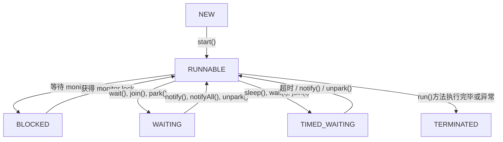

## 并行跟并发有什么区别？

最核心的区别在于**任务是否在同一时刻被同时执行**。

- **并发 (Concurrency)** 是指在**同一个时间段内**，有多个任务都在运行，但对于单核处理器来说，任意一个时间点上其实只有一个任务在执行。 操作系统通过快速地在不同任务之间切换（这个过程也叫上下文切换），使得宏观上看起来这些任务像是在同时执行。 这是一种逻辑上的“同时”。

- **并行 (Parallelism)** 则是指在**同一时刻**，有多个任务在**物理上被同时执行**。 这需要硬件的支持，比如多核处理器或者多个处理器。

### 一个通俗的比喻

为了让这个概念更清晰，我们可以用一个很经典的例子来说明：

- **并发**就像是一个人同时吃三个馒头，他不能同时把三个馒头都放进嘴里，而是快速地交替吃这三个馒头，在一段时间内把它们都吃完。
- **并行**则像是三个人同时一人吃一个馒头，他们是在同一时刻各自独立地吃自己的馒头。

### 从硬件层面看区别

这个区别与计算机的 CPU 核心数量密切相关：

- **单核 CPU**：在只有一个 CPU 核心的情况下，我们只能实现**并发**。计算机通过将 CPU 的时间划分成极短的时间片，轮流分配给不同的任务，从而营造出任务在同时运行的假象。
- **多核 CPU**：当计算机拥有多个 CPU 核心时，**并行**才成为可能。 不同的核心可以在同一时刻执行不同的任务，实现真正的同时处理。当然，多核 CPU 也可以同时运行并发任务。例如，每个核心都在并发地处理多个任务。

### 总结

| 特性         | 并发 (Concurrency)                       | 并行 (Parallelism)                   |
| :----------- | :--------------------------------------- | :----------------------------------- |
| **时间点**   | 在同一时刻，只有一个任务在执行           | 在同一时刻，有多个任务在同时执行     |
| **时间段**   | 在同一时间段内，处理多个任务             | 在同一时间段内，处理多个任务         |
| **物理实质** | 逻辑上的同时，通过任务快速切换实现       | 物理上的同时                         |
| **硬件要求** | 单核或多核 CPU 均可                      | 必须是多核 CPU 或多处理器            |
| **核心目的** | 提高处理多任务的**响应能力**和资源利用率 | 提高单个任务的**执行速度**和计算能力 |

总而言之，并发和并行是两个既有联系又有区别的概念。并发强调的是在一个时间段内处理多个任务的能力，而并行则强调的是在同一时刻真正地同时执行多个任务的能力。在现代的多核处理器架构下，我们往往会将并发和并行结合起来，以实现更高效、响应更快的应用程序。

---

## 说说进程和线程的区别？

### 1. 核心定义：资源分配与 CPU 调度的基本单位

- **进程 (Process)**：是操作系统进行**资源分配和调度的基本单位**。可以理解为一个正在执行的程序实例。 当一个程序运行时，操作系统会为其创建一个进程，并分配独立的内存空间、文件句柄等系统资源。
- **线程 (Thread)**：是**CPU 调度和执行的基本单位**，也被称为轻量级进程。 它依存于进程存在，一个进程可以包含一个或多个线程。

可以这样理解：**进程是资源（例如：钱）的拥有者，而线程是真正干活的（花钱的）**。一家公司（进程）拥有资金、办公场地等资源，而公司里的员工（线程）利用这些资源去完成具体的工作任务。

### 2. 资源拥有与共享

- **进程**：进程之间是相互独立的，拥有各自独立的内存地址空间和其他资源（如文件描述符）。 这种独立性保证了一个进程的崩溃通常不会影响到其他进程。
- **线程**：同一进程内的所有线程**共享**该进程的资源，包括内存空间（代码段、数据段、堆）、打开的文件和信号处理器等。 但每个线程也拥有自己**独占**的资源，主要是：
  - **线程 ID**：唯一标识线程。
  - **程序计数器 (PC)**：记录下一条要执行的指令地址。
  - **寄存器集合**：保存线程运行时的状态。
  - **栈 (Stack)**：用于存储函数调用和局部变量。

### 3. 开销与效率

- **创建与销毁**：由于创建进程需要分配独立的资源，其开销远大于创建线程。 同样，销毁进程也需要回收所有资源，开销也很大。
- **切换**：进程切换时，需要切换整个页表和内核态堆栈，开销非常大。而线程切换只需要保存和恢复少量寄存器和栈的状态，发生在同一个地址空间内，因此开销小得多，效率更高。

### 4. 通信方式

- **进程间通信 (IPC - Inter-Process Communication)**：由于进程间资源隔离，通信相对复杂，需要借助操作系统提供的特定机制，例如：
  - **管道 (Pipe)**：包括匿名管道和有名管道，通常用于有亲缘关系的进程间。
  - **消息队列 (Message Queue)**：内核中的消息链表，克服了管道只能单向通信的缺点。
  - **共享内存 (Shared Memory)**：最高效的方式，但需要自行处理同步问题。
  - **信号量 (Semaphore)**：主要作为同步机制。
  - **套接字 (Socket)**：最通用，可用于不同主机之间的进程通信。
- **线程间通信**：由于线程共享内存，通信变得非常直接和方便。 它们可以直接读写进程的全局变量和数据结构。 不过，这也带来了数据同步和互斥的问题，因此需要使用锁机制（如互斥锁、读写锁）、条件变量、信号量等来进行同步控制，避免数据竞争。

### 5. 健壮性（鲁棒性）

- **多进程**：一个进程的崩溃不会影响其他进程，因此多进程的程序更加健壮。
- **多线程**：由于资源共享，一个线程的崩溃（例如非法内存访问）可能会导致整个进程的所有线程都终止。

### 总结表格

| 特性         | 进程 (Process)                        | 线程 (Thread)                            |
| ------------ | ------------------------------------- | ---------------------------------------- |
| **根本区别** | 操作系统**资源分配**的基本单位        | CPU**调度和执行**的基本单位              |
| **资源共享** | 进程间相互独立，不共享资源            | 同一进程的线程共享进程资源               |
| **系统开销** | 创建、销毁、切换的开销都很大          | 创建、销毁、切换的开销都很小             |
| **通信方式** | 需要通过 IPC 机制（管道、共享内存等） | 直接读写共享内存，通信方便               |
| **健壮性**   | 一个进程崩溃不影响其他进程，健壮性高  | 一个线程崩溃会导致整个进程退出，健壮性差 |
| **关系**     | 进程至少包含一个线程                  | 线程是进程的一部分，不能独立存在         |

综上所述，选择多进程还是多线程取决于具体的应用场景。如果任务需要频繁创建和销毁，并且需要大量数据共享，那么多线程是更好的选择。如果需要保证程序的稳定性和安全性，或者需要利用多核 CPU 进行密集计算（避免 Python 中 GIL 那样的限制），那么多进程则更为合适。

---

## 说说线程有几种创建方式？

总体来说，创建线程主要有以下四种方式：

### 1. 继承 `Thread` 类

这是最直观的一种方式。开发者可以创建一个类，继承自 `java.lang.Thread` 类，并重写其 `run()` 方法。`run()` 方法中包含了线程需要执行的任务代码。

**实现步骤：**

1.  定义一个类继承 `Thread`。
2.  重写父类的 `run()` 方法，将线程要执行的逻辑写在其中。
3.  创建该子类的实例。
4.  调用实例的 `start()` 方法来启动线程（注意不是直接调用 `run()` 方法）。

**示例代码：**

```java
class MyThread extends Thread {
    @Override
    public void run() {
        System.out.println("通过继承Thread类创建线程，当前线程：" + Thread.currentThread().getName());
    }
}

// 启动线程
MyThread thread = new MyThread();
thread.start();
```

**优点**：实现简单，代码直观。
**缺点**：Java 是单继承的，如果类已经继承了其他类，就无法再继承 `Thread` 类，扩展性较差。

### 2. 实现 `Runnable` 接口

这是更常用、更推荐的一种基础方式。开发者可以创建一个类实现 `java.lang.Runnable` 接口，并实现其 `run()` 方法。

**实现步骤：**

1.  定义一个类实现 `Runnable` 接口。
2.  实现接口中的 `run()` 方法。
3.  创建该实现类的实例。
4.  将此实例作为参数，创建一个 `Thread` 对象。
5.  调用 `Thread` 对象的 `start()` 方法。

**示例代码：**

```java
class MyRunnable implements Runnable {
    @Override
    public void run() {
        System.out.println("通过实现Runnable接口创建线程，当前线程：" + Thread.currentThread().getName());
    }
}

// 启动线程
MyRunnable myRunnable = new MyRunnable();
Thread thread = new Thread(myRunnable);
thread.start();
```

**优点**：

- 避免了单继承的局限性，类可以继承其他类的同时实现 `Runnable` 接口。
- 实现了任务逻辑（`run`方法）与线程对象（`Thread`）的解耦，更符合面向对象的思想。
- 多个线程可以共享同一个 `Runnable` 实例，方便实现资源共享。

### 3. 实现 `Callable` 接口（配合 `FutureTask`）

前两种方式的 `run()` 方法是没有返回值的。如果我们需要线程执行完任务后能返回一个结果，或者能抛出异常，那么就可以使用 `Callable` 接口。

**实现步骤：**

1.  创建一个类实现 `java.util.concurrent.Callable` 接口，并指定泛型返回值类型。
2.  实现接口的 `call()` 方法，这个方法有返回值，并且可以抛出异常。
3.  创建一个 `FutureTask` 对象，用 `Callable` 实例作为构造函数参数。
4.  将 `FutureTask` 对象作为参数，创建一个 `Thread` 对象。
5.  启动线程。
6.  通过 `FutureTask` 对象的 `get()` 方法获取线程执行的返回值（这个方法会阻塞，直到任务执行完毕）。

**示例代码：**

```java
import java.util.concurrent.Callable;
import java.util.concurrent.FutureTask;

class MyCallable implements Callable<String> {
    @Override
    public String call() throws Exception {
        System.out.println("通过实现Callable接口创建线程...");
        Thread.sleep(2000); // 模拟耗时操作
        return "任务执行完毕";
    }
}

// 启动线程并获取结果
MyCallable myCallable = new MyCallable();
FutureTask<String> futureTask = new FutureTask<>(myCallable);
Thread thread = new Thread(futureTask);
thread.start();

// 获取返回值（会阻塞当前主线程）
String result = futureTask.get();
System.out.println("线程执行结果: " + result);
```

**优点**：

- 可以获取线程的执行结果。
- 可以在任务执行中抛出异常，并在主线程中捕获。

### 4. 使用线程池 (Executor Framework)

在实际的生产环境中，我们通常不建议直接创建 `Thread` 对象，因为频繁地创建和销毁线程会带来很大的性能开销。更专业的做法是使用**线程池**来管理线程。线程池可以复用已创建的线程，避免了频繁创建销毁的开销，并提供了更强大的线程管理功能（如定时执行、并发数控制等）。

**实现步骤：**

1.  使用 `Executors` 工厂类创建一种线程池（如 `FixedThreadPool`, `CachedThreadPool`等）。
2.  创建一个实现了 `Runnable` 或 `Callable` 接口的任务。
3.  使用线程池的 `submit()` 或 `execute()` 方法提交任务。
4.  任务会被线程池中的某个线程执行。
5.  （可选）如果提交的是 `Callable` 任务，`submit()` 方法会返回一个 `Future` 对象，可以通过它来获取结果。
6.  当不再需要线程池时，调用 `shutdown()` 方法关闭。

**示例代码：**

```java
import java.util.concurrent.ExecutorService;
import java.util.concurrent.Executors;

// 使用 Runnable
ExecutorService pool = Executors.newFixedThreadPool(5);
pool.execute(new MyRunnable());

// 使用 Callable
Future<String> future = pool.submit(new MyCallable());
String result = future.get();
System.out.println("线程池执行结果: " + result);

// 关闭线程池
pool.shutdown();
```

**优点**：

- **降低资源消耗**：通过复用线程减少了创建和销毁线程的开销。
- **提高响应速度**：任务到达时，可以立即使用池中的线程执行，无需等待线程创建。
- **提高线程的可管理性**：线程是稀缺资源，使用线程池可以统一进行分配、调优和监控。

### 总结

虽然有多种创建方式，但它们的核心离不开 `Thread` 类和 `Runnable` 接口。实现 `Runnable` 和 `Callable` 接口是更推荐的做法，因为它将任务和线程进行了分离。而在现代企业级开发中，**使用线程池是创建和管理线程的最佳实践**。

---

## 调用 start 方法时会执行 run 方法，那怎么不直接调用 run 方法？

调用 `start()` 方法和直接调用 `run()` 方法，最本质的区别在于**是否创建了新的线程来执行任务**。

- **调用 `start()` 方法**：这是启动一个新线程的**唯一正确方式**。当调用 `start()` 方法时，它会向 Java 虚拟机（JVM）发出一个请求。JVM 会继而请求操作系统创建一个全新的线程。这个新创建的线程会获得自己的程序计数器、虚拟机栈和本地方法栈等资源，并进入**就绪（Runnable）状态**。一旦它获得了 CPU 时间片，这个新线程就会开始执行它的任务，也就是自动调用我们重写的 `run()` 方法。这个过程是**异步**的，调用 `start()` 的线程（比如主线程）不会等待 `run()` 方法执行完毕，而是会立即返回并继续执行自己的后续代码。

- **直接调用 `run()` 方法**：如果直接调用 `run()` 方法，那就**根本没有创建新的线程**。它就等同于调用一个普通的成员方法。`run()` 方法中的所有代码都会在**当前调用它的线程**中执行（比如在 `main` 今天的 `main` 线程中执行）。整个过程是**同步**的，调用线程必须等待 `run()` 方法完全执行结束后，才能继续执行下面的代码。这完全违背了我们使用多线程的初衷。

### 一个生动的比喻

为了更形象地理解这个区别，我们可以打个比方：

- **调用 `start()`** 就像你（主线程）对你的助理（新线程）说：“这个任务（`run`方法里的代码）你去做吧”。然后你就去忙别的事情了，你的助理会独立地开始执行这个任务。你们俩是**并行**工作的。
- **直接调用 `run()`** 就像你（主线程）拿到一份本该是助理做的任务清单，然后自己亲自一项一项地把它做完。在你做完之前，你无法分身去做任何其他事情。这只是一个普通的**顺序**执行过程。

### 代码演示区别

下面的代码可以非常清晰地展示出二者的不同：

```java
public class StartVsRun {

    public static void main(String[] args) {
        // 创建一个线程任务
        Thread myThread = new Thread(() -> {
            System.out.println("进入 run 方法... 当前线程是: " + Thread.currentThread().getName());
            try {
                Thread.sleep(1000);
            } catch (InterruptedException e) {
                e.printStackTrace();
            }
            System.out.println("run 方法执行完毕。");
        }, "MyWorkerThread");

        System.out.println("--- 演示调用 start() 方法 ---");
        System.out.println("准备调用 start()。当前线程是: " + Thread.currentThread().getName());
        myThread.start();
        System.out.println("调用 start() 之后。当前线程是: " + Thread.currentThread().getName());

        // 为了防止主线程提前结束，让它也睡一会儿
        try {
            Thread.sleep(2000);
        } catch (InterruptedException e) {
            e.printStackTrace();
        }

        System.out.println("\n--- 演示直接调用 run() 方法 ---");
        // 注意：严格来说，一个线程对象start后不能再次start，这里为了演示，我们再创建一个实例
        Thread anotherThread = new Thread(() -> {
            System.out.println("进入 run 方法... 当前线程是: " + Thread.currentThread().getName());
            try {
                Thread.sleep(1000);
            } catch (InterruptedException e) {
                e.printStackTrace();
            }
            System.out.println("run 方法执行完毕。");
        }, "AnotherWorker");

        System.out.println("准备调用 run()。当前线程是: " + Thread.currentThread().getName());
        anotherThread.run();
        System.out.println("调用 run() 之后。当前线程是: " + Thread.currentThread().getName());
    }
}
```

**预期的输出结果会是：**

```
--- 演示调用 start() 方法 ---
准备调用 start()。当前线程是: main
调用 start() 之后。当前线程是: main
进入 run 方法... 当前线程是: MyWorkerThread  // <-- 注意这里，是新线程在执行
run 方法执行完毕。
--- 演示直接调用 run() 方法 ---
准备调用 run()。当前线程是: main
进入 run 方法... 当前线程是: main          // <-- 注意这里，还是main线程在执行
run 方法执行完毕。
调用 run() 之后。当前线程是: main
```

从输出可以明确看到：

1.  调用 `start()` 后，`run()` 方法是在一个名为 `MyWorkerThread` 的新线程中执行的，并且主线程 `main` 没有等待它结束，而是立刻打印了 "调用 start() 之后"。
2.  调用 `run()` 时，`run()` 方法是在 `main` 线程中执行的，主线程必须等待它内部的 `sleep` 和打印语句都完成后，才能打印 "调用 run() 之后"。

### 总结

| 特性           | 调用 `start()`                            | 直接调用 `run()`                                  |
| :------------- | :---------------------------------------- | :------------------------------------------------ |
| **线程创建**   | **创建**并启动一个新的线程                | **不创建**新线程                                  |
| **执行上下文** | `run()`方法由**新创建的线程**来执行       | `run()`方法由**调用者线程**（如 main 线程）来执行 |
| **执行流程**   | **异步执行**，调用者不等待`run()`方法完成 | **同步执行**，调用者需等待`run()`方法完成         |
| **核心目的**   | 实现真正的**多线程并发/并行**             | 仅作为普通方法调用，实现**单线程顺序**执行        |

因此，结论非常明确：要想实现多线程，我们必须调用 `start()` 方法。直接调用 `run()` 方法是无法达到多线程目的的，它只是一个普通的、在当前线程中执行的方法而已。

---

## 线程有哪些调度方法？

Java 提供了多种方法来影响线程的调度，但需要强调的是，程序员通常只能对调度器进行**建议**或**施加影响**，而不能精确地控制它。最终的调度决策是由操作系统的线程调度器根据其调度算法来决定的。

以下是 Java 中常用的线程调度相关方法：

### 1. 线程休眠: `Thread.sleep()`

这是让线程暂停执行的最直接方式。

- **方法签名**: `public static native void sleep(long millis) throws InterruptedException;`
- **功能**: `sleep()` 是一个**静态方法**，它会使**当前正在执行的线程**暂停指定的毫秒数。线程会从**运行中 (Running)** 状态进入**计时等待 (Timed Waiting)** 状态。
- **核心特点**:
  - **不释放锁**: 如果当前线程在 `synchronized` 代码块或方法中调用 `sleep()`，它**不会释放**已经持有的对象锁（监视器锁）。这意味着其他线程在此期间仍然无法进入该 `synchronized` 区域。
  - **响应中断**: `sleep()` 方法会响应中断。如果一个正在休眠的线程被其他线程调用了 `interrupt()` 方法，`sleep()` 会抛出 `InterruptedException` 并清除线程的中断状态。

### 2. 线程让步: `Thread.yield()`

这个方法用于向调度器发出一个**暗示**。

- **方法签名**: `public static native void yield();`
- **功能**: `yield()` 也是一个**静态方法**，它会建议线程调度器，当前线程愿意放弃其对 CPU 的占用，从而给其他具有相同或更高优先级的线程一个执行的机会。
- **核心特点**:
  - **不保证生效**: 这仅仅是一个**建议**，调度器完全可以忽略这个请求。
  - **不释放锁**: 和 `sleep()` 一样，`yield()` 也**不会释放**任何锁。
  - **状态转换**: 调用 `yield()` 后，线程会从**运行中 (Running)** 状态转换回**就绪 (Runnable)** 状态，等待调度器再次选择它。它可能立即就再次被选中执行。

### 3. 线程加入/插队: `thread.join()`

这个方法用于协调线程间的执行顺序，实现等待。

- **方法签名**: `public final void join() throws InterruptedException;` (以及带超时的重载版本)
- **功能**: `join()` 是一个**实例方法**。假设在线程 A 中调用了 `threadB.join()`，那么线程 A 会进入**等待 (Waiting)** 状态，直到 `threadB` 执行完毕（终止）后，线程 A 才会从阻塞中恢复，继续执行。
- **核心特点**:
  - **线程同步**: `join()` 是一种非常有效的线程同步方式，常用于“等待某个前置任务完成”的场景。
  - **不释放锁**: 如果线程 A 在持有锁的情况下调用 `threadB.join()`，它**不会释放**自己持有的锁。
  - **响应中断**: `join()` 同样会响应中断并抛出 `InterruptedException`。

### 4. 线程等待与唤醒: `wait()`, `notify()`, `notifyAll()`

这是一组用于实现精细化线程间协作的底层机制，它们是 `Object` 类的方法，而不是 `Thread` 类的方法。

- **方法签名**: `public final void wait()`, `public final void notify()`, `public final void notifyAll()`
- **功能**:
  - `wait()`: 使当前线程进入**等待 (Waiting)** 状态，并**释放**它所持有的该对象的锁。线程会一直等待，直到其他线程在该对象上调用 `notify()` 或 `notifyAll()`。
  - `notify()`: 随机唤醒一个在该对象上等待的线程。被唤醒的线程不会立即执行，而是进入**就绪**状态，需要重新竞争锁。
  - `notifyAll()`: 唤醒所有在该对象上等待的线程，让它们一起去竞争锁。
- **核心特点**:
  - **必须在同步块中使用**: 这三个方法都必须在 `synchronized` 代码块或方法中调用，并且是针对当前持有的锁对象进行操作，否则会抛出 `IllegalMonitorStateException`。
  - **释放锁**: `wait()` 方法是本文提到的方法中**唯一一个会释放锁**的。这是它与 `sleep()` 和 `join()` 的一个关键区别。

### 5. 线程优先级: `thread.setPriority()`

- **方法签名**: `public final void setPriority(int newPriority);`
- **功能**: 设置线程的优先级，范围是 1 到 10，默认是 5。理论上，优先级越高的线程越有可能被调度器选中。
- **核心特点**:
  - **高度依赖操作系统**: Java 的线程优先级会映射到操作系统的原生线程优先级，但不同操作系统的优先级级别和调度策略差异很大，所以这个设置**不保证在所有平台上都有效**，其行为是不可预测的。
  - **避免滥用**: 在实际开发中，不应依赖线程优先级来控制程序的逻辑正确性，它只能作为一种性能优化的**尝试**。

### 6. 已废弃的方法: `stop()`, `suspend()`, `resume()`

这些方法在早期的 Java 版本中存在，但现在已被明确**废弃**，强烈不推荐使用。

- `stop()`: 强制终止线程，会立即释放该线程持有的所有锁，可能导致对象状态不一致，非常危险。
- `suspend()` 和 `resume()`: `suspend()` 会暂停一个线程但**不释放锁**，这极易导致**死锁**。

### 总结表格

| 方法                           | 所属类   | 主要作用                       | 是否释放锁 | 状态变化                       |
| :----------------------------- | :------- | :----------------------------- | :--------- | :----------------------------- |
| **`sleep(long)`**              | `Thread` | 使当前线程休眠指定时间         | **否**     | Running -> Timed Waiting       |
| **`yield()`**                  | `Thread` | 建议当前线程让出 CPU（不保证） | **否**     | Running -> Runnable            |
| **`join()`**                   | `Thread` | 等待该线程执行完毕             | **否**     | 调用者线程进入 Waiting         |
| **`wait()`**                   | `Object` | 使当前线程在对象上等待         | **是**     | Running -> Waiting             |
| **`notify()` / `notifyAll()`** | `Object` | 唤醒在对象上等待的线程         | **否**     | Waiting -> Runnable (需重获锁) |
| **`setPriority(int)`**         | `Thread` | 设置线程优先级（仅为建议）     | **否**     | -                              |

在现代 Java 开发中，我们更倾向于使用 `java.util.concurrent` 包中提供的高级并发工具，如 `Lock`, `Condition`, `Semaphore`, `CountDownLatch` 等，它们提供了比底层 `wait/notify` 更强大、更灵活的线程调度和协作功能。

---

## 线程有几种状态？

好的，面试官。关于 Java 中线程的状态，根据官方的 `java.lang.Thread.State` 枚举类的定义，一个线程在其生命周期中，总共可以划分为**六种状态**。

这六种状态分别是：

1.  **NEW (新建)**
2.  **RUNNABLE (可运行)**
3.  **BLOCKED (阻塞)**
4.  **WAITING (无限期等待)**
5.  **TIMED_WAITING (限期等待)**
6.  **TERMINATED (终止)**

下面我将对每一种状态进行详细的解释，并说明它们之间是如何转换的。

### 1. NEW (新建)

- **定义**：当一个线程对象被创建（例如 `new Thread()`)，但 `start()` 方法还未被调用时，该线程就处于新建状态。
- **特征**：此时的线程仅仅是一个 Java 对象，操作系统内部还没有为其创建真正的原生线程，因此它不占用任何 CPU 资源。
- **状态转换**：
  - 调用线程的 `start()` 方法后，状态会从 `NEW` 转换到 `RUNNABLE`。

### 2. RUNNABLE (可运行)

这是一个复合状态，它包含了传统操作系统概念中的**就绪 (Ready)** 和**运行中 (Running)** 两种状态。

- **定义**：当线程的 `start()` 方法被调用后，线程就进入了可运行状态。处于此状态的线程位于可运行线程池中，等待被线程调度器选中，以获取 CPU 的使用权。
- **特征**：
  - **就绪 (Ready)**：线程已经准备好运行，具备了运行所需的一切条件，正在等待调度器分配 CPU 时间片。
  - **运行中 (Running)**：线程已经获得了 CPU 时间片，正在执行其 `run()` 方法中的代码。
- **状态转换**：
  - `NEW -> RUNNABLE`: 调用 `start()` 方法。
  - `RUNNABLE -> BLOCKED`: 线程试图进入一个 `synchronized` 同步块，但该对象的锁被其他线程持有。
  - `RUNNABLE -> WAITING`: 线程调用了 `Object.wait()`、`Thread.join()` 或 `LockSupport.park()`。
  - `RUNNABLE -> TIMED_WAITING`: 线程调用了带超时参数的方法，如 `Thread.sleep(long)`, `Object.wait(long)`, `Thread.join(long)` 等。
  - `RUNNABLE -> TERMINATED`: 线程的 `run()` 方法执行完毕或因未捕获的异常而退出。

### 3. BLOCKED (阻塞)

- **定义**：线程因为等待获取一个**监视器锁 (monitor lock)** 而被暂停。这特指线程在进入 `synchronized` 修饰的方法或代码块时，由于锁被其他线程占用而导致的状态。
- **特征**：线程会暂时停止活动，直到它获得了它所等待的锁。
- **状态转换**：
  - `RUNNABLE -> BLOCKED`: 尝试进入 `synchronized` 区域失败。
  - `BLOCKED -> RUNNABLE`: 持有锁的线程释放了该锁，并且当前线程成功获得了这个锁。

### 4. WAITING (无限期等待)

- **定义**：处于此状态的线程正在等待另一个线程执行某个特定的动作（例如通知或中断）。它不会自己醒来，必须被外部显式地唤醒。
- **导致此状态的操作**：
  - 调用 `Object.wait()` 并没有设置超时。
  - 调用 `Thread.join()` 并没有设置超时。
  - 调用 `LockSupport.park()`。
- **状态转换**：
  - `RUNNABLE -> WAITING`: 调用上述任意方法。
  - `WAITING -> RUNNABLE`:
    - 另一个线程调用了该对象上的 `Object.notify()` 或 `Object.notifyAll()`。
    - `join()` 的目标线程执行完毕。
    - 另一个线程调用了 `LockSupport.unpark(Thread)`。
    - 另一个线程调用了该线程的 `interrupt()` 方法。

### 5. TIMED_WAITING (限期等待)

- **定义**：与 `WAITING` 类似，但它不会无限期地等待。它会在指定的时间过后，由系统自动唤醒。
- **导致此状态的操作**：
  - `Thread.sleep(long millis)`
  - `Object.wait(long timeout)`
  - `Thread.join(long millis)`
  - `LockSupport.parkNanos(long nanos)`
  - `LockSupport.parkUntil(long deadline)`
- **状态转换**：
  - `RUNNABLE -> TIMED_WAITING`: 调用上述任意方法。
  - `TIMED_WAITING -> RUNNABLE`:
    - 等待时间结束。
    - 在等待时间内被 `notify()`/`notifyAll()`/`unpark()` 唤醒，或被 `interrupt()` 中断。

### 6. TERMINATED (终止)

- **定义**：线程的 `run()` 方法已经正常执行完毕，或者因为一个未被捕获的异常而提前结束。
- **特征**：线程的生命周期已经结束，它不再消耗任何 CPU 资源，并且不能再次通过 `start()` 方法来启动。

### 线程状态转换图

下面是一个简化的线程状态转换图，可以更直观地理解这些状态间的关系：



总结来说，理解这六种状态以及它们之间的转换路径，对于我们编写正确、高效的多线程程序，以及排查并发问题（如死锁、性能瓶颈）都至关重要。

---

## 什么是线程上下文切换？

### 1. 核心定义

线程上下文切换（Thread Context Switch）指的是，CPU 从一个正在执行的线程的指令，转而去执行另一个线程的指令的过程。

更具体地说，由于现代操作系统都是多任务的，而单个 CPU 核心在同一时刻只能执行一个任务。为了实现“看起来像是同时运行多个任务”的效果（即并发），CPU 需要通过极快地在不同线程之间轮换执行来实现。这个“轮换”的动作，就叫做上下文切换。

### 2. 什么是“上下文” (Context)？

“上下文”可以理解为线程执行时所依赖的**环境状态**。当一个线程被暂停时，操作系统必须完整地保存它当前的所有状态，以便将来它能无缝地从被暂停的地方继续执行，就好像从未被打断过一样。

这个“上下文”主要包括：

- **寄存器集合 (Register Set)**：这是最核心的部分。
  - **程序计数器 (Program Counter, PC)**：记录了线程当前执行到了哪一条指令的地址。这是下次恢复时首先要加载的，以确保程序能继续执行。
  - **通用寄存器 (General-Purpose Registers)**：存储了线程运行过程中的各种变量和中间计算结果。
  - **栈指针 (Stack Pointer)**：指向线程私有栈的顶端，用于管理函数调用和局部变量。
- **线程的状态 (Thread State)**：例如 `RUNNING`, `BLOCKED`, `WAITING` 等，这些状态信息也需要被保存。
- **线程的私有栈 (Stack)**：栈中存储了局部变量、方法参数、返回地址等。在切换时，栈指针的保存至关重要。

### 3. 一个形象的比喻

您可以把 CPU 想象成一个**全神贯注的工匠**，他只有一个**工作台**（CPU 的寄存器和高速缓存）。

- **任务 A**（线程 A）正在被处理，工作台上摆满了处理任务 A 所需的图纸（程序计数器）、工具和零件（寄存器中的数据）。
- 现在需要切换到**任务 B**（线程 B）。工匠不能直接把任务 B 的东西堆上来，否则就全乱了。
- 他必须先进行**上下文切换**：
  1.  **保存上下文**：把工作台上所有属于任务 A 的图纸、工具、零件小心翼翼地收拾好，放进任务 A 专属的箱子（内存中的一块区域，通常是 TCB - Thread Control Block）里，并记住做到哪一步了。
  2.  **加载上下文**：从任务 B 的箱子里，拿出上次处理任务 B 时保存好的图纸、工具和零件，在工作台上重新摆好。
- 完成这两步后，工匠就可以继续处理任务 B 了。这个收拾和重新布置的过程，就是上下文切换。

### 4. 为什么要进行上下文切换？（触发时机）

上下文切换的发生通常有以下几种情况：

1.  **线程的时间片用完（抢占式）**：操作系统为了公平，会给每个线程分配一个固定的执行时间，称为“时间片”。当一个线程的时间片用完后，即使它还在运行，操作系统也会强制剥夺其 CPU 使用权，切换到另一个线程。
2.  **线程主动阻塞**：当线程执行到某些操作，导致它无法继续下去时，它会主动放弃 CPU，进入阻塞状态。
    - **I/O 操作**：如读写文件、网络请求等，这些操作非常耗时，线程会进入阻塞等待 I/O 完成。
    - **等待锁**：线程尝试进入一个 `synchronized` 代码块，但锁被其他线程持有。
    - **主动休眠**：线程调用 `Thread.sleep()`。
    - **等待通知**：线程调用 `Object.wait()` 或 `thread.join()`。
3.  **线程主动让出 CPU**：线程调用 `Thread.yield()` 方法，建议调度器可以切换到其他线程，但这只是一个建议，不一定会发生切换。
4.  **硬件中断**：当发生硬件中断时（如键盘输入、时钟中断），CPU 会中断当前线程，去执行操作系统的中断服务程序。处理完毕后，可能会返回原来的线程，也可能切换到其他线程。

### 5. 上下文切换的开销

上下文切换**不是免费的**，它会带来显著的性能开销：

- **直接开销**：CPU 需要花费时间来执行保存和加载上下文的操作。这部分时间是纯粹的系统开销，没有执行任何有用的业务逻辑。
- **间接开销**：这是影响性能的关键。当一个新线程被加载到 CPU 上时，它所需要的数据很可能不在 CPU 的高速缓存（L1, L2, L3 Cache）中。CPU 需要从速度慢得多的主内存中去加载数据，这个过程会导致大量的 **Cache Miss（缓存未命中）**，从而严重影响新线程的执行效率。只有当新线程运行一段时间后，将自己的“热点数据”加载进缓存，其运行速度才会恢复正常。

因此，在并发编程中，一个重要的优化方向就是**减少不必要的上下文切换**。例如，使用无锁并发数据结构、减少锁的竞争、根据业务场景合理设置线程池大小等，都是为了降低上下文切换带来的性能损耗。

---

## 守护线程了解吗？

守护线程（Daemon Thread）在 Java 中是一种特殊的、低优先级的线程。它的核心使命是**为其他非守护线程（即用户线程）提供服务**。

### 核心特征：JVM 的“生死相随”

守护线程最重要、最独特的特征在于它**不会阻止 Java 虚拟机（JVM）的退出**。

- **用户线程 (User Thread)**：只要有任何一个用户线程还在运行，JVM 就不会退出。可以把它理解为程序的主要任务，是“主角”。
- **守护线程 (Daemon Thread)**：当程序中**所有**的用户线程都已经执行完毕并终止后，无论守护线程是否还在工作，JVM 都会立即退出。守护线程的生命周期依附于用户线程，是“配角”或“服务员”。

### 一个生动的比喻

您可以把整个 Java 应用程序（JVM）想象成一场晚会。

- **用户线程**是晚会上的**宾客**。
- **守护线程**是晚会上的**服务员**（比如倒酒的、播放背景音乐的）。

只要还有任何一位宾客没有离开，晚会就必须继续下去，服务员也必须继续提供服务。但是，一旦所有的宾客都走光了，晚会就立刻结束，此时会直接“关灯走人”，而不会特意去等服务员是否收拾完了桌子或关掉了音乐。

### 如何设置守护线程

在 Java 中，通过 `thread.setDaemon(boolean isDaemon)` 方法可以将一个线程设置为守护线程。

- **关键规则**：这个方法**必须在调用 `thread.start()` 方法之前**设置。如果线程已经启动，再尝试设置它会抛出 `IllegalThreadStateException`。

**示例代码：**

```java
public class DaemonThreadDemo {
    public static void main(String[] args) {
        Thread daemonThread = new Thread(() -> {
            // 这个守护线程模拟一个无限循环的后台任务
            while (true) {
                try {
                    System.out.println("我是守护线程，正在后台运行...");
                    Thread.sleep(500);
                } catch (InterruptedException e) {
                    // 异常处理
                }
            }
        });

        // 将该线程设置为守护线程
        daemonThread.setDaemon(true);

        // 启动守护线程
        daemonThread.start();

        // 主线程（是一个用户线程）只执行2秒
        System.out.println("主线程（用户线程）开始执行...");
        try {
            Thread.sleep(2000);
        } catch (InterruptedException e) {
            // 异常处理
        }
        System.out.println("主线程执行完毕，即将退出。");
    }
}
```

**运行结果分析：**
当主线程（用户线程）打印 "主线程执行完毕，即将退出。" 并结束后，程序中就没有其他用户线程了。因此，JVM 会立即退出，那个还在无限循环中运行的守护线程也会被强制终止，你不会再看到 "我是守护线程..." 的输出了。

### 重要的注意事项（使用陷阱）

由于守护线程会被 JVM“粗暴地”终止，而不是等待它优雅地执行完毕，因此：

1.  **`finally` 块不一定执行**：守护线程中的 `finally` 代码块不保证一定会被执行。因为 JVM 退出时是直接终止线程，不会给它机会去完成收尾工作。
2.  **不应用于资源操作**：绝对不能在守护线程中执行任何关键的资源操作，比如文件的读写、数据库的连接关闭等。因为这些操作需要确保被完整执行，否则可能导致数据损坏或资源泄露。

### 典型的应用场景

守护线程非常适合执行那些“有它在更好，没它在也无所谓”的后台任务。

- **垃圾回收器 (Garbage Collector)**：这是最经典、最典型的守护线程。它在后台默默地为所有线程回收不再使用的内存。当所有用户线程都结束后，内存回收的意义也就不存在了，GC 线程会随之终止。
- **监控线程**：例如在后台定时记录应用的健康状况、内存使用情况、日志等。
- **缓存管理**：例如后台有一个线程负责定时清理缓存中过期的对象。
- **JMX (Java Management Extensions)**：JMX 相关的很多线程也是守护线程，用于提供管理和监控功能。

### 总结

| 特性            | 用户线程 (User Thread)   | 守护线程 (Daemon Thread)               |
| :-------------- | :----------------------- | :------------------------------------- |
| **JVM 退出**    | JVM 会等待其执行完毕     | 不会阻止 JVM 退出，随 JVM 一起终止     |
| **主要用途**    | 执行程序的核心业务逻辑   | 为用户线程提供后台服务、支持性任务     |
| **`finally`块** | 正常情况下保证执行       | **不保证**执行                         |
| **设置方式**    | 默认创建的都是用户线程   | 必须在`start()`前调用`setDaemon(true)` |
| **典型例子**    | `main`线程、业务处理线程 | 垃圾回收（GC）线程、监控线程           |

总而言之，守护线程是 Java 并发模型中一个重要的组成部分，正确地使用它可以处理很多后台服务性任务，但必须清楚地认识到它的生命周期特性，避免在其中执行需要保证完整性的关键操作。

---

## 线程间有哪些通信方式？

线程间的通信是并发编程中的核心问题，其目的是为了让不同的线程能够协同工作、同步执行并安全地交换信息。

### 1. 基于共享内存和关键字的隐式通信

这是最基础的通信方式，线程通过读写同一个共享变量来隐式地交换信息。为了保证通信的正确性，需要使用关键字来确保内存可见性和原子性。

- **`volatile` 关键字**：

  - **核心作用**：保证了共享变量的**可见性**。当一个线程修改了被 `volatile` 修饰的变量值，这个新值对其他线程是立即可见的。
  - **通信方式**：常用于一个线程写入、多个线程读取的“状态标记”场景。例如，一个线程通过改变一个 `volatile boolean` 标志来通知其他线程停止运行。
  - **局限性**：它只保证可见性和禁止指令重排，**不保证原子性**。对于 `i++` 这样的复合操作，`volatile` 是无能为力的。

- **`synchronized` 关键字**：
  - **核心作用**：它提供了**原子性**和**可见性**的双重保障。当线程进入 `synchronized` 代码块时，会获取锁；退出时，会释放锁。
  - **通信方式**：JVM 规定，在释放锁之前，必须将该线程在本地内存中对共享变量的修改刷新到主内存；在获取锁之后，会清空本地内存，从主内存加载共享变量的最新值。通过这种方式，`synchronized` 隐式地实现了线程间的通信。

### 2. `wait() / notify() / notifyAll()` 机制

这是 Java 提供的经典、底层的线程协作机制，它们是 `Object` 类的方法，用于实现“等待-唤醒”模式。

- **核心流程**：

  1.  一个线程获取到对象的锁后，发现继续执行的条件不满足（例如，缓冲区是空的，消费者无法消费）。
  2.  该线程调用对象的 `wait()` 方法，它会**释放该对象的锁**并进入**等待 (WAITING)** 状态。
  3.  另一个线程获取到同一个对象的锁后，执行了某个操作，使得前一个线程的等待条件满足了（例如，生产者向缓冲区放入了数据）。
  4.  该线程调用对象的 `notify()` 或 `notifyAll()` 方法，唤醒正在该对象上等待的线程。
  5.  被唤醒的线程从 `WAITING` 状态变为 `BLOCKED` 或 `RUNNABLE` 状态，并重新尝试获取锁。获取锁成功后，从当初 `wait()` 的地方继续执行。

- **关键点**：
  - 必须在 `synchronized` 代码块或方法中使用。
  - 为了防止“虚假唤醒”（Spurious Wakeup），对 `wait()` 的调用通常需要放在一个 `while` 循环中进行条件判断。

### 3. JUC (java.util.concurrent) 并发包中的高级工具

这是现代 Java 开发中**首选**的线程通信方式，它提供了更安全、更高效、更灵活的工具。

- **`Lock` 和 `Condition`**：

  - `Lock`（如 `ReentrantLock`）是 `synchronized` 的一个更强大的替代品。
  - `Condition` 接口与 `Lock` 配合使用，提供了对 `wait/notify` 机制的增强。一个 `Lock` 对象可以创建多个 `Condition` 实例，从而可以实现更精细的线程分组等待和唤醒（例如，实现一个有界的缓冲区，可以精确地唤醒生产者或消费者线程，而不是像 `notifyAll` 一样唤醒所有线程）。`await()`、`signal()`、`signalAll()` 方法分别对应 `wait()`、`notify()` 和 `notifyAll()`。

- **阻塞队列 (`BlockingQueue`)**：

  - 这是实现“生产者-消费者”模式的**最佳工具**。它是一个线程安全的队列，当队列为空时，尝试获取元素的线程会被阻塞；当队列已满时，尝试添加元素的线程会被阻塞。
  - 它将底层的 `wait/notify` 或 `Lock/Condition` 细节完美地封装了起来，开发者只需要调用 `put()` (添加) 和 `take()` (获取) 方法即可，极大地简化了编程模型。常见的实现有 `ArrayBlockingQueue`、`LinkedBlockingQueue` 等。

- **同步辅助类 (Synchronization Aids)**：
  - **`CountDownLatch` (倒数门闩)**：允许一个或多个线程等待其他一组线程完成操作。它像一个倒数计数器，一个线程调用 `await()` 方法等待，其他线程完成任务后调用 `countDown()` 方法使计数器减一，当计数器减到零时，等待的线程被唤醒。
  - **`CyclicBarrier` (循环栅栏)**：让一组线程到达一个屏障点时被阻塞，直到最后一个线程到达屏障点，屏障才会打开，所有被屏障拦截的线程才会继续执行。它还可以循环使用。
  - **`Semaphore` (信号量)**：用于控制同时访问某个特定资源的线程数量，常用于实现资源池或流量控制。

### 4. 其他方式

- **`Thread.join()`**：一个简单但有效的通信方式。如果线程 A 中调用了 `threadB.join()`，那么线程 A 会一直等待，直到线程 B 执行完毕。这是一种单向的、等待完成的通信。

- **管道流 (`PipedInputStream` / `PipedOutputStream`)**：这是一种基于字节流的通信方式，允许两个线程直接通过管道进行数据传输。一个线程通过 `PipedOutputStream` 写入数据，另一个线程通过 `PipedInputStream` 读取数据。它在线程间传递大量数据时比较有用，但在一般应用中不如 JUC 工具常用。

### 总结表格

| 通信方式             | 核心思想                                  | 主要应用场景                      |
| :------------------- | :---------------------------------------- | :-------------------------------- |
| **`volatile`**       | 保证共享变量的内存可见性                  | 状态标记、一次性写入              |
| **`synchronized`**   | 保证原子性和可见性，隐式通信              | 保护临界区，实现互斥              |
| **`wait/notify`**    | 底层的等待/唤醒机制，需配合`synchronized` | 复杂的线程协作，但易出错          |
| **`Lock/Condition`** | 更灵活的等待/唤醒机制                     | `wait/notify`的替代品，可分组唤醒 |
| **`BlockingQueue`**  | 封装了等待/唤醒的线程安全队列             | **生产者-消费者模式**             |
| **`CountDownLatch`** | 等待多个任务完成                          | 一个主任务等待多个子任务完成      |
| **`CyclicBarrier`**  | 一组线程互相等待到达同步点                | 多线程分阶段计算、并行任务同步    |
| **`Semaphore`**      | 控制并发线程数                            | 资源池、限流                      |
| **`Thread.join()`**  | 等待目标线程终止                          | 一个线程依赖另一个线程的结果      |

在实际开发中，我们应当优先选择 `java.util.concurrent` 包提供的高级工具，因为它们功能更强大、使用更安全、性能也更好。只有在非常特殊的情况下，才需要考虑使用底层的 `wait/notify` 机制。

---

## 请说说 sleep 和 wait 的区别？

`sleep()` 和 `wait()`最核心、最本质的区别在于：**调用 `wait()` 方法会释放锁，而调用 `sleep()` 方法不会释放锁**。

下面我将从多个维度对它们进行详细的对比：

### 1. 所属的类不同

- **`sleep()`**：是 `java.lang.Thread` 类的一个**静态方法** (`static`)。这意味着它可以直接通过 `Thread.sleep()` 来调用，它控制的是**当前正在执行的线程**。
- **`wait()`**：是 `java.lang.Object` 类的一个**实例方法**。这意味着它必须由一个**对象实例**来调用（例如 `lockObject.wait()`)。它作用于调用该方法的对象锁。

### 2. 对锁（Monitor）的处理机制不同

这是它们之间最根本的区别。

- **`sleep()`**：当线程调用 `sleep()` 方法时，它仅仅是让出了 CPU 的执行时间，但它**不会释放**已经持有的任何对象锁。如果它在一个 `synchronized` 代码块中调用 `sleep()`，那么其他线程在这段休眠时间内**仍然无法**进入这个同步代码块。
- **`wait()`**：当线程调用 `wait()` 方法时，它会做两件事：
  1.  让出 CPU 执行时间。
  2.  **立即释放它所持有的该对象的锁**。
      这使得其他线程有机会获得该对象的锁，并进入同步代码块去修改条件。当该线程被唤醒时，它必须重新竞争并获取该对象的锁，才能继续执行。

### 3. 使用的前提和场景不同

- **`sleep()`**：可以在任何地方使用，没有特殊要求。它的主要作用就是让线程**暂停执行**一段时间，通常用于模拟耗时操作、轮询任务或者简单的延时。它与线程间的协作无关。
- **`wait()`**：**必须在 `synchronized` 代码块或 `synchronized` 方法中使用**。因为它必须在持有对象锁的情况下才能调用，否则会抛出 `IllegalMonitorStateException`。它的设计初衷就是为了实现**线程间的协作与通信**，即经典的“等待-唤醒”机制。

### 4. 唤醒的方式不同

- **`sleep()`**：唤醒方式比较“被动”和固定。有两种情况会醒来：
  1.  指定的休眠时间到达。
  2.  被其他线程调用了 `interrupt()` 方法中断。
- **`wait()`**：唤醒方式更“主动”和灵活。有三种情况会醒来：
  1.  其他线程在**同一个对象**上调用了 `notify()` 方法。
  2.  其他线程在**同一个对象**上调用了 `notifyAll()` 方法。
  3.  被其他线程调用了 `interrupt()` 方法中断。
      （对于 `wait(long timeout)` 版本，超时也是一种唤醒方式）。

### 总结表格

为了更清晰地展示区别，我总结了一个表格：

| 特性         | `Thread.sleep(long millis)`          | `Object.wait()`                                           |
| :----------- | :----------------------------------- | :-------------------------------------------------------- |
| **所属类**   | `Thread` 类 (静态方法)               | `Object` 类 (实例方法)                                    |
| **释放锁**   | **不释放锁**                         | **释放锁**                                                |
| **使用前提** | 可以在任何地方调用                   | 必须在 `synchronized` 代码块或方法中调用                  |
| **主要作用** | 让当前线程暂停执行，与协作无关       | 实现线程间的等待与唤醒，用于协作                          |
| **唤醒方式** | 时间到期 或 被 `interrupt()` 中断    | 被 `notify()`/`notifyAll()` 唤醒 或 被 `interrupt()` 中断 |
| **状态转换** | Running -> Timed Waiting -> Runnable | Running -> Waiting -> Runnable (或 Blocked)               |

总而言之，`sleep` 是让线程“睡一会”，自己醒来后继续干活，期间一直霸占着资源（锁）；而 `wait` 是线程在发现条件不满足时，主动“让位”（释放锁）并进入休息室等待，直到别人把它叫醒，它才出来重新排队（竞争锁）干活。它们的设计目的和应用场景是完全不同的。

---

## 如何保证线程安全？

产生线程安全问题根本原因有三个：

1.  **原子性（Atomicity）**：一个或多个操作，在 CPU 执行的过程中不被中断。典型的反例就是 `count++`，它至少包含“读取-修改-写入”三个步骤，任何一步都可能被其他线程打断。
2.  **可见性（Visibility）**：当一个线程修改了共享变量的值，其他线程能够立即得知这个修改。由于 CPU 缓存和主内存的存在，一个线程的修改可能滞留在自己的缓存中，对其他线程不可见。
3.  **有序性（Ordering）**：程序执行的顺序按照代码的先后顺序执行。但编译器和处理器为了优化性能，可能会对指令进行重排序。

因此，保证线程安全的核心思想就是围绕这三个特性，采用合适的策略来避免数据竞争和不一致。以下是我总结的保证线程安全的几种主要方法，从推荐程度和实现思路上可以分为几个层次：

### 层次一：根本上避免问题 —— 不共享或不可变

这是最优雅、也是最推荐的方式，因为它从设计上就根除了线程安全问题。

1.  **不共享状态（Avoid Sharing State）**：

    - **方法**：如果数据不被多个线程共享，那么它天然就是线程安全的。最典型的实现就是使用 `ThreadLocal`。
    - **`ThreadLocal`**：它为每个使用该变量的线程都提供一个独立的变量副本，从而做到了线程间的隔离。每个线程都操作自己的副本，互不影响。它常用于保存数据库连接、Session 信息等与特定线程绑定的资源。

2.  **使用不可变对象（Immutable Objects）**：
    - **方法**：如果一个对象的状态在创建后就不能被修改，那么它就是不可变的，因此也是线程安全的。多个线程可以自由地读取它，而不用担心数据被篡改。
    - **实践**：
      - 将类声明为 `final`，防止被继承。
      - 所有成员变量都声明为 `private` 和 `final`。
      - 不提供任何修改对象状态的 `setter` 方法。
      - 如果成员变量是可变对象（如 `List` 或 `Date`），在构造函数和 `getter` 中要进行防御性拷贝。
    - **例子**：Java 中的 `String`、`Integer` 等包装类都是不可变的。

### 层次二：拥抱并发 —— 使用 JUC 线程安全类

如果必须共享状态，那么第二推荐的方式是使用 `java.util.concurrent` (JUC) 包下由大师们设计好的线程安全工具，而不是自己去造轮子。

1.  **使用原子类（Atomic Classes）**：

    - **方法**：对于像 `i++` 这样的简单计数操作，`java.util.concurrent.atomic` 包提供了一系列的原子类，如 `AtomicInteger`, `AtomicLong`, `AtomicBoolean` 等。
    - **原理**：它们内部使用了**CAS（Compare-And-Swap）** 这种无锁操作，相比于加锁，性能通常更高。它能保证单个变量操作的原子性。

2.  **使用并发集合（Concurrent Collections）**：
    - **方法**：在需要共享集合时，优先使用 JUC 提供的并发集合，而不是使用 `Collections.synchronizedXxx()` 包装的同步集合。
    - **例子**：
      - **`ConcurrentHashMap`**：替代 `Hashtable` 或 `Collections.synchronizedMap`，它使用了分段锁或 CAS，提供了更高的并发性能。
      - **`CopyOnWriteArrayList`**：适用于“读多写少”的场景。写入时，它会复制一份新的底层数组进行修改，写完再将引用指向新数组，整个过程读操作不受影响。
      - **`BlockingQueue`**：阻塞队列，是实现生产者-消费者模式的利器，本身就是线程安全的。

### 层次三：最后的防线 —— 同步和锁

如果上述方法都不适用，或者是在维护旧代码时，我们就需要使用显式的同步机制来保护临界区（访问共享资源的代码块）。

1.  **`synchronized` 关键字**：

    - **方法**：这是 Java 提供的最基础的内置锁。它可以修饰方法或代码块。
    - **原理**：它能保证在同一时刻，只有一个线程能进入被它保护的代码区域，从而保证了**原子性**和**可见性**。JVM 层面的实现保证了它的健壮性。

2.  **`Lock` 接口（显式锁）**：

    - **方法**：JUC 包提供了 `Lock` 接口及其实现（如 `ReentrantLock`）。
    - **优势**：相比 `synchronized`，`Lock` 提供了更高级的功能：
      - **可中断的等待**：`lockInterruptibly()`。
      - **可超时的等待**：`tryLock(long, TimeUnit)`。
      - **非阻塞地获取锁**：`tryLock()`。
      - 可与 `Condition` 配合，实现更灵活的线程等待/唤醒机制。
    - **注意**：使用 `Lock` 必须在 `finally` 块中调用 `unlock()` 来确保锁一定被释放。

3.  **`volatile` 关键字**：
    - **方法**：这是 Java 提供的最轻量级的同步机制。
    - **作用**：它只能保证共享变量的**可见性**和**有序性**，但**不能保证原子性**。
    - **场景**：它非常适合用于“一个线程写，多个线程读”的状态标记场景，或者在双重检查锁定（DCL）中防止指令重排。

### 总结与指导原则

在实际开发中，保证线程安全的指导原则应该是：

1.  **优先考虑不可变对象和`ThreadLocal`，从根本上避免共享。**
2.  **如果必须共享，优先选择 JUC 包提供的并发容器和原子类。**
3.  **万不得已时，再使用`synchronized`或`Lock`来保护临界区。**
4.  **`volatile`是处理可见性问题的特定工具，不能替代锁来保证原子性。**

---

## ThreadLocal 了解吗？

### 1. 核心作用：提供线程内的局部变量

`ThreadLocal` 的核心作用是**提供一个线程内部的局部变量**，也叫线程本地变量。

换句话说，如果你创建了一个 `ThreadLocal` 变量，那么访问这个变量的每个线程都会有它自己独立初始化的一个副本。当线程 A 向这个 `ThreadLocal` 存入一个值时，线程 B 是无法读取到的，线程 B 读取到的是它自己存入的值，或者是一个初始值。

这就好比给每个线程都发了一个专属的储物柜，每个线程都只能操作自己的储物柜，从而**实现了线程间的数据隔离**。它的主要目的不是解决多线程间共享变量的同步问题，而是从另一个角度，通过“空间换时间”的思路，为每个线程提供一份独占的资源，根本上避免了多线程竞争。

### 2. 实现原理：一个“高端”的 `Map`

`ThreadLocal` 的实现原理非常巧妙。在 `Thread` 类中，有一个成员变量 `threadLocals`，它的类型是 `ThreadLocal.ThreadLocalMap`。

- **`ThreadLocalMap`**：这是 `ThreadLocal` 的一个静态内部类，它才是真正存储数据的地方。它的结构类似于一个 `HashMap`。
- **Key-Value 结构**：
  - **Key**：是当前的 `ThreadLocal` 对象实例本身。
  - **Value**：就是我们要为该线程存储的那个副本值（比如，用户的 Session 信息、数据库连接对象等）。

所以，当我们调用 `threadLocal.set(value)` 时，实际上是：

1.  获取当前正在执行的线程 `Thread.currentThread()`。
2.  通过当前线程获取到它内部的 `ThreadLocalMap` 对象。
3.  以当前的 `threadLocal` 对象作为 Key，以 `value` 作为 Value，存入这个 Map 中。

当我们调用 `threadLocal.get()` 时，过程正好相反：

1.  获取当前线程。
2.  获取线程内部的 `ThreadLocalMap`。
3.  以 `threadLocal` 对象为 Key，从 Map 中查找对应的 Value 并返回。

这样一来，数据就自然地与线程绑定在了一起，因为数据是存储在线程自己的 `Map` 里的。

### 3. 应用场景

`ThreadLocal` 在很多框架和应用中都有广泛使用，主要用于以下场景：

1.  **保存线程上下文信息**：在一个请求处理的调用链中，很多方法可能都需要同一个参数（比如用户信息、请求 ID）。如果层层传递会非常繁琐。这时可以在调用链的入口处，将这些信息存入 `ThreadLocal`，在调用链的任何地方，都可以方便地从中获取，实现了“隐式传参”。
2.  **管理数据库连接、Session 等**：在多线程环境下，为每个线程分配一个独立的数据库连接，可以避免频繁地创建和关闭连接，也避免了连接被多个线程共享而引发的问题。很多 ORM 框架（如 Hibernate）就是用 `ThreadLocal` 来管理 Session 的。
3.  **解决 SimpleDateFormat 的线程安全问题**：`SimpleDateFormat` 是一个非线程安全的类。为了避免每次使用都创建一个新对象，可以通过 `ThreadLocal` 为每个线程缓存一个 `SimpleDateFormat` 实例，既保证了线程安全，又提升了性能。

### 4. 关键注意事项：内存泄漏问题

这是使用 `ThreadLocal` 时**必须关注**的一个重点。`ThreadLocal` 存在内存泄漏的风险，但这通常是在**线程池**环境下才会显现。

**泄漏原因**：

- `ThreadLocalMap` 中的 Key，也就是 `ThreadLocal` 对象，是被设计成**弱引用 (WeakReference)** 的。这意味着，当外部没有强引用指向 `ThreadLocal` 对象时，下一次垃圾回收（GC）时，这个 Key 就会被回收。
- 但是，`ThreadLocalMap` 中的 Value 却是被**强引用**的。
- **问题来了**：当 Key (ThreadLocal) 被回收后，`ThreadLocalMap` 中就出现了 `key` 为 `null` 的 `Entry`。然而，它的 `value` 依然被这个 `Entry` 强引用着，只要当前线程不销毁，这个 Value 就永远不会被回收，从而造成了**内存泄漏**。

**如何避免内存泄漏？**
Java 的设计者已经考虑到了这个问题，`ThreadLocalMap` 在其 `get()`, `set()`, `remove()` 等方法中，会检查并清理那些 Key 为 `null` 的 `Entry`。但这是一种“补偿”机制，不是万无一失的。

因此，最佳实践是：
**在使用完 `ThreadLocal` 后，务必在 `finally` 块中手动调用 `threadLocal.remove()` 方法来清除数据。**

**示例代码：**

```java
ThreadLocal<User> userHolder = new ThreadLocal<>();

try {
    // 1. 在业务逻辑开始前，设置值
    userHolder.set(new User("..."));

    // 2. 执行业务逻辑...
    // service.doSomething();
    // controller.process();

} finally {
    // 3. 在业务逻辑结束后，务必清除，防止内存泄漏
    userHolder.remove();
}
```

这个 `remove()` 操作会把当前线程的 `ThreadLocalMap` 中对应的 `Entry` 整个移除，从而保证 Key 和 Value 都能被正常回收。

总而言之，`ThreadLocal` 是一个强大的工具，它通过空间换时间的方式优雅地解决了线程数据隔离的问题，但使用者必须清楚其原理和潜在的内存泄漏风险，并养成用完即删的好习惯。

---

## 你在工作中用到过 ThreadLocal 吗？

面试官您好，是的，我在之前的工作中多次使用过 `ThreadLocal`，它在解决一些特定的并发场景问题时非常有效。下面我分享两个我亲身经历过的典型应用场景。

### 场景一：在 Web 应用中传递用户身份信息

**背景问题：**
在我之前参与开发的一个电商平台的项目中，系统需要在一个完整的 HTTP 请求处理链中获取当前登录用户的信息。这个请求会经过多个组件，比如 `Filter` (过滤器)、`Interceptor` (拦截器)、`Controller` (控制器) 以及多个 `Service` (服务层) 和 `DAO` (数据访问层) 的方法调用。

最开始，有些代码采用了**方法参数层层传递**的方式来传递 `User` 对象。例如：
`serviceA.doSomething(user, ...)` -> `serviceB.doAnotherThing(user, ...)`。

这种方式的缺点非常明显：

1.  **代码侵入性强**：很多方法本身并不关心 `User` 对象，但为了把它传递给下游方法，不得不加上这个参数，造成了方法签名冗余和代码污染。
2.  **维护困难**：如果将来某个中间环节的方法不再需要传递 `User` 对象，或者需要增加新的上下文信息（比如追踪 ID），修改起来会涉及大量的代码，非常繁琐。

**我的解决方案：**
为了解决这个问题，我引入了 `ThreadLocal` 来构建一个**用户上下文持有器 (UserContextHolder)**。

1.  **创建 `UserContextHolder`**：
    我创建了一个工具类，内部使用一个 `private static final ThreadLocal<User>` 来存储用户信息。

    ```java
    public class UserContextHolder {
        private static final ThreadLocal<User> userThreadLocal = new ThreadLocal<>();

        public static void setUser(User user) {
            userThreadLocal.set(user);
        }

        public static User getUser() {
            return userThreadLocal.get();
        }

        public static void clear() {
            userThreadLocal.remove();
        }
    }
    ```

2.  **在请求入口处设置信息**：
    我实现了一个自定义的 `Filter` 或 `Interceptor`，它在请求处理链的最前端执行。在这个组件中，我会从 `Session` 或 `Token` 中解析出用户信息，然后调用 `UserContextHolder.setUser()` 将其存入 `ThreadLocal`。

3.  **在业务代码中直接使用**：
    在 `Service` 层或 `Controller` 层的任何地方，当需要用户信息时，不再需要通过方法参数传递，而是直接通过调用 `UserContextHolder.getUser()` 来获取。这使得代码非常简洁，业务逻辑也更清晰。

4.  **在请求结束时清理资源**：
    这是最关键的一步。为了防止内存泄漏（尤其是在使用 Tomcat 这类线程池的 Web 服务器时），我在 `Filter` 的 `finally` 块中或者在 `Interceptor` 的 `afterCompletion` 方法中，**坚决执行 `UserContextHolder.clear()`**，确保与该请求线程绑定的用户信息被清除掉，避免下一个请求复用该线程时读到脏数据。

**带来的效果：**
通过这种方式，我们成功地将用户身份信息与业务代码进行了解耦，大大提升了代码的可读性和可维护性。任何需要用户信息的地方都可以“凭空”获取，而不用关心它是从哪里来的。

---

### 场景二：SimpleDateFormat 的线程安全复用

**背景问题：**
在一个需要进行大量日期格式化操作的报表生成模块中，`SimpleDateFormat` 被频繁使用。我们知道 `SimpleDateFormat` 是非线程安全的，如果把它定义为静态变量供多线程共享，就会在高并发下抛出异常或得到错误的格式化结果。

最初的解决方案是每次需要格式化时都在方法内部 `new SimpleDateFormat()`。
`new SimpleDateFormat("yyyy-MM-dd HH:mm:ss").format(date);`

这种方式虽然保证了线程安全，但在高并发的报表生成场景下，频繁地创建和销毁 `SimpleDateFormat` 对象带来了不小的性能开销和 GC 压力。

**我的解决方案：**
我同样利用 `ThreadLocal` 对 `SimpleDateFormat` 对象进行了优化。

1.  **创建日期格式化工具类**：
    我创建了一个 `DateFormatUtil` 类，内部为每种常用的日期格式都定义了一个 `ThreadLocal<SimpleDateFormat>`。

    ```java
    public class DateFormatUtil {
        private static final ThreadLocal<SimpleDateFormat> ymdSdf = ThreadLocal.withInitial(
            () -> new SimpleDateFormat("yyyy-MM-dd")
        );

        private static final ThreadLocal<SimpleDateFormat> ymdHmsSdf = ThreadLocal.withInitial(
            () -> new SimpleDateFormat("yyyy-MM-dd HH:mm:ss")
        );

        public static String formatYmd(Date date) {
            return ymdSdf.get().format(date);
        }

        public static String formatYmdHms(Date date) {
            return ymdHmsSdf.get().format(date);
        }
    }
    ```

    这里我使用了 `ThreadLocal.withInitial()` 这个更方便的 API，它可以在第一次调用 `get()` 方法时为当前线程自动初始化一个值。

2.  **在业务代码中使用**：
    在报表生成的业务逻辑中，所有需要日期格式化的地方都统一调用 `DateFormatUtil` 的静态方法。

**带来的效果：**

- **线程安全**：每个线程都从自己的 `ThreadLocal` 中获取 `SimpleDateFormat` 实例，不存在共享问题。
- **性能提升**：避免了在方法内反复创建对象，实现了对象的复用，显著降低了性能开销和 GC 压力。
- **无需手动 remove**：在这个场景下，`ThreadLocal` 变量是 `static final` 的，它的生命周期和 JVM 一样长。只要线程池中的线程不销毁，`SimpleDateFormat` 对象就可以一直被复用。由于 `SimpleDateFormat` 对象本身占用的内存很小，而且数量与线程数相当，所以在这里不手动 `remove` 通常是可以接受的。当然，如果是在对内存极度敏感的应用中，或者线程池会动态伸缩，那么在线程销 ulf's*own*`finally`块里清理也是更严谨的做法。

---

## ThreadLocal 怎么实现的呢？

`ThreadLocal` 的实现原理非常精巧，它的核心思想可以总结为：**每个 `Thread` 对象内部都有一个专门用来存储 `ThreadLocal` 变量的 `Map`，`ThreadLocal` 实例本身则作为这个 `Map` 的 `Key`**。

下面来详细拆解它的实现细节：

### 1. 核心的两个类：`Thread` 和 `ThreadLocalMap`

`ThreadLocal` 的实现并非在 `ThreadLocal` 类自身内部维护一个 `Map<Thread, Object>`，如果那样做，就需要全局的锁来保证并发安全，性能会很差。

它的实际实现依赖于 `Thread` 类的一个成员变量：

```java
// 在 java.lang.Thread 类中
ThreadLocal.ThreadLocalMap threadLocals = null;
```

- `threadLocals`：这是 `Thread` 类的一个实例变量（非静态），这意味着**每个线程对象都有自己独立的一个 `threadLocals` 引用**。
- `ThreadLocal.ThreadLocalMap`：这是 `ThreadLocal` 的一个**静态内部类**，它才是真正存储数据的地方。它的设计类似于一个 `HashMap`，但为 `ThreadLocal` 的场景做了特殊优化。

所以，数据不是存在 `ThreadLocal` 里的，而是存在**线程自己**的 `Map` 里的。

### 2. `ThreadLocalMap` 的内部结构

`ThreadLocalMap` 内部维护了一个数组，用于存储 `Entry` 对象。

```java
// 在 java.lang.ThreadLocal.ThreadLocalMap 类中
private Entry[] table;

static class Entry extends WeakReference<ThreadLocal<?>> {
    /** The value associated with this ThreadLocal. */
    Object value;

    Entry(ThreadLocal<?> k, Object v) {
        super(k); // Key是弱引用
        value = v;  // Value是强引用
    }
}
```

这里有几个关键点：

- **`Entry` 数组**：这就是 `Map` 的底层存储结构，一个 `Entry` 就是一个键值对。
- **`Entry` 继承了 `WeakReference`**：这是为了防止内存泄漏而做的关键设计。`Entry` 的 `Key`（也就是 `ThreadLocal` 实例）被包装成一个**弱引用**。当外部没有强引用指向这个 `ThreadLocal` 实例时，即使 `ThreadLocalMap` 还持有对它的弱引用，GC 依然可以回收这个 `ThreadLocal` 实例。
- **Value 是强引用**：`Entry` 中的 `value` 是一个普通的 `Object` 强引用。

### 3. `set(T value)` 方法的执行流程

当我们调用 `threadLocal.set(someValue)` 时，内部的执行逻辑是这样的：

1.  **获取当前线程**：首先，通过 `Thread.currentThread()` 获取到正在执行此代码的线程对象。
2.  **获取该线程的 `ThreadLocalMap`**：从当前线程对象中获取它的 `threadLocals` 成员变量（即那个 `Map`）。
3.  **判断 `Map` 是否存在**：
    - 如果 `Map` **不为 null**，就直接向这个 `Map` 中存入数据。存入的键值对是 `(this, value)`，其中 `this` 就是当前调用的 `threadLocal` 对象实例，`value` 就是我们要存入的值。
    - 如果 `Map` **为 null**（说明这是该线程第一次使用 `ThreadLocal`），就会为该线程创建一个新的 `ThreadLocalMap`，并存入第一个键值对。这个新创建的 `Map` 会被赋值给当前线程的 `threadLocals` 变量。

### 4. `get()` 方法的执行流程

当我们调用 `threadLocal.get()` 时，逻辑类似：

1.  **获取当前线程**。
2.  **获取该线程的 `ThreadLocalMap`**。
3.  **判断 `Map` 是否存在**：
    - 如果 `Map` **不为 null**，就以 `this`（当前 `threadLocal` 实例）为 `Key`，去 `Map` 中查找对应的 `Entry`。如果找到了，就返回 `Entry` 中的 `value`。
    - 如果 `Map` **为 null**，或者在 `Map` 中没有找到对应的 `Entry`，说明是第一次调用 `get`，需要进行初始化。
    - **初始化**：此时会调用 `setInitialValue()` 方法。该方法会调用我们通过 `ThreadLocal.withInitial()` 提供的 `Supplier`，或者 `ThreadLocal` 默认的 `initialValue()` 方法（返回 `null`），来获取初始值。然后将这个初始值 `set` 进去，并返回。

### 5. `remove()` 方法的执行流程

调用 `threadLocal.remove()` 时：

1.  获取当前线程的 `ThreadLocalMap`。
2.  如果 `Map` 存在，就以 `this` 为 `Key`，从 `Map` 中移除对应的 `Entry`。

### 总结与核心设计思想

- **巧妙的归属关系**：`ThreadLocal` 本身不存储任何数据。它像一个“通行证”或“钥匙”，数据是存储在每个线程自己的“保险箱”（`ThreadLocalMap`）里的。
- **空间换时间**：通过为每个线程创建数据副本，避免了多线程之间为访问共享数据而进行的同步和加锁，从而提高了并发性能。
- **弱引用键（WeakReference Key）**：这是为了在 `ThreadLocal` 实例本身被回收后，`ThreadLocalMap` 能有机会发现并清理掉对应的“过期”`Entry`，以减轻内存泄漏问题。
- **强引用值（StrongReference Value）**：这导致了即使 `Key` 被回收，`Value` 依然可能存在的内存泄漏风险，因此**强烈推荐使用 `remove()` 方法**来手动清理，这才是最可靠的防止内存泄漏的手段。

以上就是我对 `ThreadLocal` 实现原理的理解，它通过将数据存储在线程自身，并利用弱引用来辅助回收，非常优雅地实现了线程数据的隔离。

---

## ThreadLocal 内存泄露是怎么回事？

这个问题的核心是：**当一个 `ThreadLocal` 变量不再被使用时，它在每个线程中对应的副本值（Value）可能无法被垃圾回收，从而导致内存泄漏。**

这种情况通常发生在**线程池**的环境下。

### 1. 关键的内存结构回顾

我们再看一下 `Thread`、`ThreadLocal` 和 `ThreadLocalMap` 的关系：

1.  每个 `Thread` 对象都有一个 `ThreadLocal.ThreadLocalMap` 类型的成员变量 `threadLocals`。
2.  `ThreadLocalMap` 内部有一个 `Entry[]` 数组，每个 `Entry` 包含一个键值对。
3.  这个 `Entry` 的设计非常关键：
    - **Key**：是 `ThreadLocal` 实例，被包装在 `WeakReference`（弱引用）中。
    - **Value**：是我们存入的对象（比如 `User` 对象），是**强引用**。

### 2. 内存泄漏的发生过程（生命周期不一致导致）

让我们一步步来看内存泄漏是如何发生的，假设我们是在一个 Web 服务器（如 Tomcat）的线程池环境下：

1.  **请求进入**：线程池分配一个工作线程来处理一个 Web 请求。
2.  **创建 `ThreadLocal` 并使用**：在业务代码中，我们创建了一个 `ThreadLocal` 实例，并调用了 `set()` 方法存入了一个比较大的对象（比如一个包含很多信息的 `User` 对象）。

    - `ThreadLocal<User> userHolder = new ThreadLocal<>();`
    - `userHolder.set(new User("..."));`
    - 此时，工作线程的 `threadLocals` 这个 `Map` 中，就增加了一个 `Entry`：`Key` 是对 `userHolder` 对象的弱引用，`Value` 是对 `new User(...)` 对象的强引用。

3.  **`ThreadLocal` 实例被回收**：假设这个 `ThreadLocal` 是在某个方法中定义的局部变量。当方法执行完毕，栈帧销毁，`userHolder` 这个强引用就消失了。现在，没有任何强引用指向这个 `ThreadLocal` 实例了。

4.  **GC 发生，Key 被回收**：下一次垃圾回收（GC）发生时，由于 `ThreadLocalMap` 中的 `Key` 是弱引用，GC 会发现这个 `ThreadLocal` 对象已经没有强引用指向它了，于是**回收了这个 `Key`**。这导致 `ThreadLocalMap` 中出现了一个 `Key` 为 `null` 的 `Entry`。

5.  **内存泄漏点出现！**：虽然 `Key` 变成了 `null`，但是 `Entry` 中的 **`Value` 仍然是强引用**！这个 `Value`（也就是那个 `User` 对象）被 `Entry` 对象强引用着，而 `Entry` 对象又被 `ThreadLocalMap` 强引用着，`ThreadLocalMap` 又被线程对象强引用着。

    **引用链是这样的：** `工作线程 -> ThreadLocalMap -> Entry -> Value`

6.  **线程被归还线程池**：请求处理完毕。但由于是线程池，**这个工作线程不会被销毁**，而是被归还到池中等待下一个请求。只要这个线程不死，这条引用链就一直存在，那么那个 `Value` 对象就永远无法被 GC 回收。

7.  **积少成多，OOM**：如果后续的请求不断地重复这个过程（可能使用不同的 `ThreadLocal` 实例），线程的 `Map` 中就会堆积越来越多 `Key` 为 `null` 但 `Value` 依然存在的“幽灵”`Entry`。最终，当这些无法被回收的 `Value` 对象占用了大量内存后，就可能导致**内存溢出（OutOfMemoryError）**。

### 3. 为什么要有弱引用？

这是一个常见的问题：既然弱引用 `Key` 配合强引用 `Value` 会导致内存泄漏，为什么还要这样设计？

这是一个权衡。如果没有弱引用，`Key` 也是强引用。那么即使 `userHolder` 强引用消失了，`ThreadLocalMap` 依然强引用着 `ThreadLocal` 实例（Key），那么 `Key` 和 `Value` 都不会被回收，内存泄漏会更严重。

设计成弱引用，至少给了 GC 回收`Key`的机会。并且 `ThreadLocalMap` 在其 `get()`, `set()`, `remove()` 等方法中，都包含了一些**启发式的清理逻辑**：当它发现某个 `Entry` 的 `Key` 为 `null` 时，它会顺便把这个 `Entry` 从 `Map` 中清除掉。但这只是一种“尽力而为”的补救措施，并不能保证一定能清理干净。

### 4. 如何根治内存泄漏？

最可靠、最简单的解决方案就是养成良好的编程习惯：

**在使用完 `ThreadLocal` 后，必须在 `finally` 块中调用其 `remove()` 方法。**

```java
ThreadLocal<User> userHolder = new ThreadLocal<>();
try {
    userHolder.set(new User("..."));
    // ... 业务逻辑 ...
} finally {
    userHolder.remove(); // 关键一步！
}
```

`remove()` 方法会直接将当前线程的 `ThreadLocalMap` 中对应的整个 `Entry`（包括 Key 和 Value）都移除。这样，`Value` 对象就不再被引用链束缚，可以被 GC 正常回收了，内存泄漏的根源就被切断了。

**总结**：`ThreadLocal` 的内存泄漏本质上是由于**线程池中线程的生命周期**远长于**`ThreadLocal` 变量在业务逻辑中的使用周期**，再加上 `ThreadLocalMap` 中 `Value` 的强引用特性，共同导致的。根治的方法就是遵循“谁创建，谁清理”的原则，确保在线程归还线程池之前，调用 `remove()` 方法清理掉 `ThreadLocal` 的数据。

---

## ThreadLocalMap 的源码看过吗？

`ThreadLocalMap` 的设计完全是为了服务于 `ThreadLocal` 这个特定场景，它的核心目标是高效、低冲突地在线程内部存储数据。

### 1. 内部结构：Entry 数组与弱引用 Key

`ThreadLocalMap` 内部没有像 `HashMap` 那样实现 `java.util.Map` 接口。它是一个独立的、定制化的 `Map` 实现。

- **底层存储**：它的底层是一个 `Entry` 类型的数组。
  ```java
  private Entry[] table;
  ```
- **`Entry` 类的定义**：这是最关键的设计点。

  ```java
  static class Entry extends WeakReference<ThreadLocal<?>> {
      /** The value associated with this ThreadLocal. */
      Object value;

      Entry(ThreadLocal<?> k, Object v) {
          super(k); // Key是ThreadLocal实例，用WeakReference包装
          value = v;  // Value是强引用
      }
  }
  ```

  - `Entry` 继承了 `WeakReference`，并且这个弱引用指向的是 `ThreadLocal` 实例（Key）。
  - `value` 成员变量则是一个强引用，指向我们通过 `set()` 方法存入的对象。
  - **这个“Key 弱 Value 强”的设计，正是内存泄漏问题的根源。**

### 2. Hash 计算与寻址

`ThreadLocalMap` 的寻址方式也比较特别。

- **Hash Code 来源**：`ThreadLocal` 对象有一个 `private final int threadLocalHashCode` 字段。这个哈希值是在 `ThreadLocal` 实例被创建时，通过一个静态的、原子递增的 `nextHashCode` 变量计算出来的。它保证了每个 `ThreadLocal` 实例都有一个唯一的、固定的哈希码。

  ```java
  // In ThreadLocal.java
  private final int threadLocalHashCode = nextHashCode();
  private static AtomicInteger nextHashCode = new AtomicInteger();
  private static final int HASH_INCREMENT = 0x61c88647;

  private static int nextHashCode() {
      return nextHashCode.addAndGet(HASH_INCREMENT);
  }
  ```

  - `0x61c88647` 这个“魔法数字”是斐波那契散列法（Fibonacci Hashing）的一部分，它可以让哈希码更均匀地分布在 2 的幂次长度的数组中，从而减少哈希冲突。

- **计算索引**：计算 `Entry` 在 `table` 数组中的索引位置非常简单，就是用 `threadLocalHashCode` 和数组长度减一进行按位与操作。
  ```java
  int i = key.threadLocalHashCode & (table.length - 1);
  ```
  这是一种高效的取模运算，前提是 `table.length` 必须是 2 的幂。

### 3. 冲突解决方式：线性探测法

`HashMap` 在 JDK 1.8 后解决哈希冲突用的是“链地址法 + 红黑树”。而 `ThreadLocalMap` 使用的是一种更简单的方式：**线性探测法 (Linear Probing)**。

- **工作方式**：当计算出的索引位置 `i` 已经被其他 `Entry` 占用了，它不会在这个位置形成链表，而是简单地**探测下一个位置 `i+1`**。如果 `i+1` 也被占用了，就继续探测 `i+2`，直到找到一个空闲的槽位为止。如果到了数组末尾，就从头开始继续探测。

### 4. 核心方法源码解读

#### `set(ThreadLocal<?> key, Object value)` 方法

`set` 方法的逻辑完美体现了线性探测和“顺手”清理过期`Entry`的思想。

1.  获取 `table` 和 `len`，计算初始索引 `i`。
2.  进入一个循环，从位置 `i` 开始向后线性探测。
3.  在循环中，获取当前位置的 `Entry e = table[i]`。
4.  **情况一：`e` 不为 `null`**
    - 获取 `e` 中的弱引用 `Key k = e.get()`。
    - 如果 `k == key`（找到了完全相同的 `ThreadLocal` 对象），直接更新这个 `Entry` 的 `value` 并返回。
    - 如果 `k == null`（**关键点**），这说明 `Key`（即`ThreadLocal`实例）已经被 GC 回收了，但 `Entry` 还在。这个 `Entry` 成了一个**“陈旧”或“过期”的条目 (Stale Entry)**。此时，`set` 方法不会视而不见，而是会调用 `replaceStaleEntry()` 方法。这个方法会接管当前的 `set` 操作，并在此过程中清理掉这个过期的 `Entry` 和它附近其他可能过期的 `Entry`。
5.  **情况二：`e` 为 `null`**
    - 说明找到了一个空槽位，直接在这里创建一个新的 `Entry` 并放入 `table` 中。
    - 增加 `Map` 的大小 `size`，然后检查是否需要扩容（通过 `cleanSomeSlots` 和 `rehash`）。
    - 操作完成，返回。
6.  探测的步进是 `i = nextIndex(i, len)`，即 `(i + 1 < len) ? i + 1 : 0`。

#### `getEntry(ThreadLocal<?> key)` 方法

`get` 的过程也是一个线性探测的查找过程。

1.  计算初始索引 `i`。
2.  进入循环进行线性探测。
3.  获取 `Entry e = table[i]`。
4.  **情况一：`e` 不为 `null` 且 `e.get() == key`**
    - 完全匹配，找到了！返回这个 `Entry`。
5.  **情况二：`e` 为 `null`**
    - 探测到了空槽位，说明这个 `key` 不存在于 `Map` 中，直接返回 `null`。
6.  **情况三：`e` 不为 `null` 但 `e.get() != key`**
    - 这是一个哈希冲突，或者是一个过期的 `Entry`。
    - 如果 `e.get() == null`（过期），会调用 `expungeStaleEntry()` 方法来执行一次更彻底的清理。
    - 继续向后探测。

### 5. 自愈与清理机制 (`expungeStaleEntry`)

`ThreadLocalMap` 源码中最体现其设计精巧的地方，就是它的**自愈能力**。它不是被动地等待内存泄漏，而是在每次 `get`, `set`, `remove` 操作时，都有可能触发对过期 `Entry` 的清理。

核心的清理方法是 `expungeStaleEntry(int staleSlot)`：

- 它会从 `staleSlot` 这个位置开始，清除该位置的 `Entry`。
- 然后，它会向后继续线性探测，直到遇到一个 `null` 槽位。
- 在这个过程中，它会做两件事：
  1.  如果遇到其他过期的 `Entry`（`key == null`），也会一并清除。
  2.  如果遇到未过期的 `Entry`，会用它的 `key` 重新计算哈希位置。如果它当前的位置不是它应该在的“原生”位置，就会把它移动到正确的位置上。这个过程叫**“再哈希”（Rehashing）**，目的是为了缩短因为清理而留下的“空洞”，保持探测链的紧凑。

### 总结

`ThreadLocalMap` 的源码展现了以下几个关键的设计哲学：

- **专场景，高性能**：不实现通用 `Map` 接口，所有设计都为 `ThreadLocal` 服务，哈希计算和冲突解决策略都追求简单高效。
- **线性探测**：实现简单，且利用了 CPU 缓存的局部性原理，在低冲突率下性能很好。
- **弱引用与自愈**：通过弱引用 `Key` 配合 GC，以及在操作中“顺手”清理过期`Entry`的机制，在一定程度上缓解了内存泄漏问题。
- **不完美的防御**：尽管有自愈机制，但它依赖于 `get/set` 等方法的调用，如果一个线程长期空闲，这些清理逻辑就得不到执行。所以，**`remove()` 方法才是程序员保证不内存泄漏的最后、也是最可靠的一道防线**。

---

## ThreadLocalMap 怎么解决 Hash 冲突的？

`ThreadLocalMap` 解决哈希冲突的方式非常直接和经典，它使用的是**开放地址法（Open Addressing）**中的**线性探测（Linear Probing）**。

这与我们更熟悉的 `HashMap` 使用的**链地址法（Chaining）**完全不同。

下面我来详细解释一下线性探测法在 `ThreadLocalMap` 中是如何工作的：

### 1. 核心思想：依次向后找空位

当 `ThreadLocalMap` 尝试插入一个新的 `Entry`（键值对）时，它会执行以下步骤：

1.  **计算初始位置**：首先，根据 `ThreadLocal` 对象的 `threadLocalHashCode` 计算出一个在 `Entry` 数组中的初始索引位置 `i`。

    ```java
    int i = key.threadLocalHashCode & (table.length - 1);
    ```

2.  **检查该位置**：它会检查 `table[i]` 这个槽位：

    - **如果槽位为空**：太棒了，没有发生冲突。直接将新的 `Entry` 放在这个位置。
    - **如果槽位已被占用**：哈希冲突发生了。此时，`ThreadLocalMap` 不会像 `HashMap` 那样在 `table[i]` 位置上挂一个链表或红黑树。

3.  **线性探测**：它会简单地**探测下一个相邻的位置**，也就是 `table[i+1]`。

    - 如果 `table[i+1]` 为空，就把 `Entry` 放在这里。
    - 如果 `table[i+1]` 仍然被占用，就继续探测 `table[i+2]`。
    - 这个过程会一直持续下去，直到找到一个空的槽位为止。

4.  **循环探测**：如果探测到了数组的末尾（`table.length - 1`），它会“绕”回到数组的开头，从 `table[0]` 开始继续探测。这个过程就像在一个环形数组上寻找空位。

### 2. 一个形象的比喻

您可以把 `ThreadLocalMap` 的 `Entry` 数组想象成一排**电影院的座位**。

- **计算初始位置**：每个 `ThreadLocal` 对象（顾客）都有一张票，票上写着它的“理想座位号”（计算出的哈希索引）。
- **发生冲突**：当一个顾客 A 到达时，发现他的理想座位已经被顾客 B 占了。
- **线性探测**：顾客 A 不会和顾客 B 挤在一起（没有链表），他会很有礼貌地去看旁边的下一个座位。如果下一个座位也被人占了，他就再看下下个，直到找到一个空座位坐下为止。

### 3. `get` 操作如何处理冲突

当需要根据一个 `ThreadLocal` 对象（Key）来获取值时，`get` 操作也会遵循同样的线性探测逻辑：

1.  计算出 `Key` 的初始索引 `i`。
2.  检查 `table[i]` 里的 `Entry` 的 `Key` 是否与要查找的 `Key` 匹配。
3.  如果不匹配，就继续向后探测 `table[i+1]`, `table[i+2]`... 直到：
    - **找到匹配的 `Key`**：成功找到，返回对应的 `Value`。
    - **遇到一个空的槽位**：如果探测过程中遇到了一个 `null` 的槽位，那就意味着这个 `Key` 肯定不存在于 `Map` 中（因为如果存在，当初 `set` 的时候就会被放在这个空位或它之前的某个位置）。查找失败，返回 `null`。

### 4. 为什么选择线性探测？

`ThreadLocalMap` 的作者选择线性探测而不是链地址法，可能基于以下考虑：

- **数据结构简单**：`Entry` 数组的结构比“数组+链表/红黑树”的结构更简单，`Entry` 对象本身也不需要额外的 `next` 指针，节省了内存空间。
- **CPU 缓存友好**：线性探测具有更好的空间局部性。当探测相邻的槽位时，这些连续的内存地址很可能已经被加载到 CPU 缓存中了，这会比在内存中跳跃访问链表节点要快。
- **冲突率低**：`ThreadLocal` 的哈希码是通过一个特殊的“魔法数字”(`0x61c88647`)生成的，这种斐波那契散列法能让哈希码非常均匀地分布，从而使得哈希冲突的概率本身就比较低。在低冲突率的情况下，线性探测的性能是非常出色的。

### 5. 缺点：聚集现象（Clustering）

线性探测法有一个众所周知的缺点，那就是**聚集现象**。连续被占用的槽位会形成一个“区块”，后续发生冲突的元素会使得这个区块变得越来越长，导致查找和插入的效率下降。不过，鉴于 `ThreadLocal` 的使用场景（一个线程中的 `ThreadLocal` 数量通常不会特别巨大）和其优秀的哈希算法，这个问题在 `ThreadLocalMap` 中通常不会成为性能瓶颈。

**总结**：`ThreadLocalMap` 通过**线性探测**这种简单而高效的方式来解决哈希冲突。当发生冲突时，它会依次检查当前槽位的下一个位置，直到找到一个空闲的槽位来存放元素。这种设计充分利用了 `ThreadLocal` 场景下哈希分布均匀、数据量可控的特点。

---

## ThreadLocalMap 扩容机制了解吗？

`ThreadLocalMap` 的扩容机制与 `HashMap` 有着显著的不同，更加“被动”和“机会主义”，并且与它的垃圾清理机制紧密地耦合在一起。

### 1. 扩容的阈值（Threshold）

`ThreadLocalMap` 确实有一个扩容阈值，但它的计算方式很简单。它被硬编码为**容量的三分之二**。

- **定义**：`threshold` 是一个实例变量，表示当 `Map` 中的元素数量 (`size`) 达到这个值时，就应该考虑扩容了。
- **计算**：在创建 `ThreadLocalMap` 或扩容后，会调用 `setThreshold(len)` 方法来设置这个值。
  ```java
  // 在 ThreadLocalMap.java 中
  private void setThreshold(int len) {
      threshold = len * 2 / 3;
  }
  ```
  例如，如果 `table` 的容量（`len`）是 16，那么阈值 `threshold` 就是 `16 * 2 / 3 = 10`。

### 2. 扩容的触发时机（When）

这是 `ThreadLocalMap` 与 `HashMap` 最大的不同之处。`HashMap` 是在每次 `put` 操作时，如果 `size` 超过阈值就**立即触发**扩容。而 `ThreadLocalMap` 的扩容触发时机则更加复杂和间接，它通常发生在**清理过期 `Entry` 的过程中**。

扩容的主要触发点在 `rehash()` 方法中，而 `rehash()` 方法又主要由 `cleanSomeSlots()` 方法调用。

让我们来梳理一下这个调用链：

1.  当调用 `threadLocal.set(value)` 时，如果是在一个空槽位上插入了新的 `Entry`（而不是替换已有的），`set` 方法在返回前会尝试进行一次清理操作：`cleanSomeSlots()`。
2.  `cleanSomeSlots()` 方法会做一些启发式的清理，尝试扫描并清理一部分过期的 `Entry`。
3.  在 `cleanSomeSlots()` 方法的末尾，会进行一次关键的判断：

    ```java
    // 在 cleanSomeSlots() 方法的结尾处
    if (size >= threshold)
        rehash();
    ```

    **这里的判断是触发扩容的核心**：如果在清理后，`Map` 中的元素数量 `size` 仍然大于或等于阈值 `threshold`，就会调用 `rehash()`。

4.  `rehash()` 方法会先进行一次**全量的清理**（调用 `expungeStaleEntries()`），把所有过期的 `Entry` 都清理掉。
5.  在全量清理之后，`rehash()` 会再次检查 `size` 和 `threshold` 的关系。如果 `size >= threshold * 3/4` (注意，这里用的是阈值的 3/4，是为了避免刚扩容又马上达到阈值的情况)，**此时才会真正调用 `resize()` 方法进行扩容**。

**总结触发时机**：扩容并不是在 `set` 的时候立即触发的，而是在 `set` 之后的一次“顺手”清理操作中，发现清理后元素数量依然很多，才决定进行扩容。这是一个**延迟的、机会主义的**扩容策略。

### 3. 扩容的过程（How）：`resize()` 方法

一旦决定扩容，`resize()` 方法就会被调用，它的执行过程如下：

1.  **保存旧表**：保存对当前 `table` 的引用。
2.  **容量翻倍**：创建一个新的 `Entry` 数组，其容量是旧容量的两倍 (`newLen = oldLen * 2`)。
3.  **重新计算阈值**：为新的容量计算并设置新的阈值 (`setThreshold(newLen)`)。
4.  **迁移数据**：这是最核心的一步。它会遍历**旧的 `table`** 中的每一个 `Entry`。
    - **跳过过期 `Entry`**：如果一个 `Entry` 是过期的（`e.get() == null`），它会被直接忽略。这个 `Entry` 和它引用的 `Value` 就不会被迁移到新表中，等待下一次 GC 回收。**所以，扩容过程本身也是一次彻底的深度清理过程**。
    - **重新计算哈希**：对于每一个有效的 `Entry`，会用它的 `Key`（`ThreadLocal`实例）重新计算它在新表中的位置 (`h = k.threadLocalHashCode & (newLen - 1)`)。
    - **解决冲突并放入新表**：将这个 `Entry` 放入新表的 `h` 位置。如果该位置已经有值了，就使用**线性探测法**向后寻找空位，然后放入。
5.  **替换为新表**：最后，将 `ThreadLocalMap` 的 `table` 引用指向这个填充好的新表。

### 与 `HashMap` 扩容机制的对比

| 特性         | `ThreadLocalMap`                                  | `HashMap` (JDK 1.8+)                             |
| :----------- | :------------------------------------------------ | :----------------------------------------------- |
| **触发时机** | `set` 后清理过程中发现 `size` 超过阈值，延迟触发  | `put` 时若 `size` 超过阈值，立即触发             |
| **阈值**     | 固定为 `容量 * 2/3`                               | `容量 * loadFactor` (默认为 0.75)                |
| **扩容过程** | 容量翻倍，**只迁移有效`Entry`**，顺便完成深度清理 | 容量翻倍，所有节点（包括链表和红黑树）都需要迁移 |
| **核心策略** | 机会主义，与垃圾清理紧密耦合                      | 积极主动，严格基于负载因子                       |

**总结**：`ThreadLocalMap` 的扩容机制是一个集**扩容**与**深度清理**于一体的过程。它不像 `HashMap` 那样积极，而是选择在清理无效空间后，如果发现有效数据依然很多，才进行扩容。这个设计非常符合 `ThreadLocal` 的使用场景，即在保证性能的同时，尽力回收不再需要的内存，防止内存泄漏。

---

## 父线程能用 ThreadLocal 给子线程传值吗？

直接回答是：**默认情况下，父线程无法通过 `ThreadLocal` 将值传递给子线程。**

### 1. 为什么默认情况下不行？

我们回顾一下 `ThreadLocal` 的核心原理：**数据是存储在每个线程对象自身的 `threadLocals` (一个 `ThreadLocalMap`) 成员变量中的**。

1.  当父线程调用 `threadLocal.set(value)` 时，这个 `value` 被存储在了**父线程对象**的 `threadLocals` Map 中。
2.  当在父线程中创建一个新的子线程 (`new Thread(...)`) 并启动 (`start()`) 时，子线程是一个全新的 `Thread` 对象。
3.  根据 `Thread` 类的构造函数源码，**子线程的 `threadLocals` 成员变量在初始化时是 `null`**。它并不会去复制或继承父线程的 `threadLocals` Map。
4.  因此，当子线程启动后，它在自己的上下文中去调用 `threadLocal.get()` 时，它访问的是**它自己内部那个空空如也的 `threadLocals` Map**。结果自然是 `null`（或者 `ThreadLocal` 的初始值）。

**简单来说，父子线程是两个独立的 `Thread` 对象，它们的 `threadLocals` Map 互不相干，井水不犯河水。**

### 2. 如何实现父子线程间的值传递？

尽管默认不行，但 Java 的设计者也考虑到了这种“线程变量继承”的需求，并提供了一个解决方案：**`InheritableThreadLocal`**。

`InheritableThreadLocal` 是 `ThreadLocal` 的一个子类。它的工作机制与 `ThreadLocal` 类似，但增加了一个关键的特性：**在创建子线程时，它可以将父线程中存储的值复制一份给子线程。**

### `InheritableThreadLocal` 的实现原理

它的实现魔力在于 `Thread` 类的构造函数。让我们看一下 `Thread` 类的 `init` 方法（构造函数会调用它）中的相关逻辑：

```java
// 在 Thread.java 的 init(...) 方法中
if (parent.inheritableThreadLocals != null)
    this.inheritableThreadLocals =
        ThreadLocal.createInheritedMap(parent.inheritableThreadLocals);
```

1.  `Thread` 类除了有 `threadLocals` 成员变量，还有一个 `inheritableThreadLocals` 成员变量，它同样是一个 `ThreadLocalMap`。`InheritableThreadLocal` 就是使用这个 `Map` 来存储数据的。

2.  在创建子线程（`this`）时，构造函数会检查其父线程（`parent`）的 `inheritableThreadLocals` Map 是否存在。

3.  如果父线程的 `inheritableThreadLocals` 不为 `null`，子线程就会调用 `ThreadLocal.createInheritedMap()` 方法，以父线程的 `Map` 为蓝本，为自己**创建一个新的 `inheritableThreadLocals` Map**。

4.  `createInheritedMap` 方法会遍历父线程 `Map` 中的所有 `Entry`，并将它们的键值对**原封不动地复制**到为子线程新创建的 `Map` 中。

**所以，`InheritableThreadLocal` 的核心在于：子线程在初始化时，会把父线程的 `inheritableThreadLocals` Map 里的内容“克隆”一份作为自己的初始值。**

### 示例代码

```java
public class InheritableThreadLocalDemo {
    public static void main(String[] args) {
        // 使用普通的 ThreadLocal
        final ThreadLocal<String> threadLocal = new ThreadLocal<>();
        threadLocal.set("父线程的值 - 普通ThreadLocal");

        // 使用 InheritableThreadLocal
        final InheritableThreadLocal<String> inheritableThreadLocal = new InheritableThreadLocal<>();
        inheritableThreadLocal.set("父线程的值 - InheritableThreadLocal");

        System.out.println("父线程读取普通 TL: " + threadLocal.get());
        System.out.println("父线程读取可继承 TL: " + inheritableThreadLocal.get());

        // 创建子线程
        Thread childThread = new Thread(() -> {
            System.out.println("--- 子线程 ---");
            System.out.println("子线程读取普通 TL: " + threadLocal.get()); // 预期为 null
            System.out.println("子线程读取可继承 TL: " + inheritableThreadLocal.get()); // 预期能读到父线程的值
        });

        childThread.start();
    }
}
```

**预期输出：**

```
父线程读取普通 TL: 父线程的值 - 普通ThreadLocal
父线程读取可继承 TL: 父线程的值 - InheritableThreadLocal
--- 子线程 ---
子线程读取普通 TL: null
子线程读取可继承 TL: 父线程的值 - InheritableThreadLocal
```

### `InheritableThreadLocal` 的一个重要限制

需要特别注意的是，`InheritableThreadLocal` 的值传递是**单向的、一次性的**，发生在**子线程创建的那一刻**。

- 子线程创建后，如果父线程再修改 `InheritableThreadLocal` 的值，子线程的值**不会**跟着变。
- 反之，子线程修改了值，也**不会**影响到父线程。
- **在线程池环境下，这个特性可能会导致问题**。因为线程池会复用线程。如果一个父线程使用 `InheritableThreadLocal` 后，一个被复用的线程（它可能之前是另一个父线程的子线程，继承了老的值）来执行任务，就可能会读到过期的、错误的数据。所以在使用线程池时，如果用了 `InheritableThreadLocal`，最好在任务开始前和结束后手动清理或重置值。阿里巴巴的 `TransmittableThreadLocal` 就是为了解决这个问题而生的。

**总结**：

- 标准的 `ThreadLocal` **不能**在父子线程间传递值。
- 使用 `InheritableThreadLocal` **可以**实现值从父线程到子线程的传递。
- 这种传递是在子线程**创建时**发生的一次性浅拷贝，之后父子线程的 `InheritableThreadLocal` 值就各自独立了。
- 在线程池等需要线程复用的复杂场景下，使用 `InheritableThreadLocal` 需要特别小心数据污染问题。

---

## 说一下你对 Java 内存模型的理解？

Java 内存模型（Java Memory Model, JMM）是一个非常核心但又偏理论的概念，它对于理解 Java 的并发编程至关重要。

### 1. 什么是 Java 内存模型？（What is it?）

首先，最重要的一点是：**Java 内存模型是一个抽象的规范，而不是物理硬件的内存布局。**

它的核心目标是定义一套规则，来屏蔽掉各种硬件和操作系统的内存访问差异，以实现让 Java 程序在各种平台下都能达到**一致的内存访问效果**。JMM 规范了 Java 虚拟机（JVM）与计算机内存是如何协同工作的，主要围绕在多线程环境下如何处理**原子性、可见性和有序性**这三个问题。

### 2. 为什么需要 Java 内存模型？（Why do we need it?）

在现代计算机体系结构中，CPU 的运算速度和内存的读写速度之间存在巨大的差距。为了弥补这个鸿沟，引入了多级高速缓存（CPU Cache）。这带来了新的问题：

1.  **缓存不一致性**：在多核 CPU 中，每个核心都有自己的高速缓存。当多个线程分别在不同核心上运行时，它们对共享变量的修改可能只存在于各自的缓存中，没有及时写回主内存，导致其他线程看不到这个修改。这就是**可见性**问题的根源。
2.  **指令重排序**：为了提升性能，编译器和处理器可能会对输入的代码进行优化，改变指令的执行顺序，只要不改变单线程环境下的最终结果。但在多线程环境下，这种重排序可能会破坏程序原有的逻辑。这就是**有序性**问题的根源。

JMM 的出现，就是为了解决这些问题，它提供了一套保证，让程序员在编写并发程序时，有一个统一的、可预测的“行为准则”。

### 3. JMM 的核心抽象模型：主内存与工作内存

为了方便理解，JMM 定义了一个抽象的结构：

- **主内存 (Main Memory)**：是所有线程共享的区域，存储了所有的实例字段、静态字段和构成数组对象的元素。可以粗略地理解为物理内存。
- **工作内存 (Working Memory)**：是每个线程私有的数据区域。线程对变量的所有操作（读取、赋值等）都必须在工作内存中进行。它存储了主内存中变量的副本。可以粗略地理解为 CPU 的高速缓存和寄存器。

**线程间变量的交互流程**：

1.  **`lock`**: 锁定主内存中的变量，标识为线程独占。
2.  **`read`**: 从主内存读取一个变量的值。
3.  **`load`**: 将`read`到的值加载到工作内存的副本中。
4.  **`use`**: 线程使用工作内存中的变量副本。
5.  **`assign`**: 线程将一个值赋给工作内存中的变量副本。
6.  **`store`**: 将工作内存中的变量副本的值传送到主内存。
7.  **`write`**: 将`store`过来的值写入主内存的变量中。
8.  **`unlock`**: 解锁主内存中的变量。

JMM 规定，从主内存`load`到工作内存，再从工作内存`store`回主内存，这些操作都是原子的。但是，`load`和`store`之间的操作不是。这就解释了为什么会产生可见性问题：一个线程可能`assign`了新值，但迟迟没有`store`和`write`回主内存。

### 4. JMM 如何保证三大特性

JMM 是通过一系列的关键字和规则来向程序员提供原子性、可见性和有序性的保证的。

- **原子性 (Atomicity)**：JMM 保证了基本数据类型的读写操作是原子的（如`long`和`double`在某些 32 位系统上除外）。对于更大范围的原子性，JMM 通过 `synchronized` 和 `Lock` 来保证。它们可以确保一个代码块在同一时间只被一个线程执行。
- **可见性 (Visibility)**：JMM 提供了 `volatile`、`synchronized` 和 `final` 关键字来保证可见性。
  - **`volatile`**：当一个变量被声明为 `volatile`，对它的写操作会立即刷新到主内存，并且会导致其他线程工作内存中的缓存副本失效，强制从主内存重新读取。
  - **`synchronized`**：一个线程在解锁前，必须把共享变量的修改刷新到主内存；一个线程在加锁后，会清空工作内存，从主内存加载最新的值。
- **有序性 (Ordering)**：
  - **`volatile`**：它包含“内存屏障”的作用，可以禁止指令重排序。
  - **`synchronized`**：它保证了“一个变量在同一个锁中只被一个线程持有”，从而也保证了持有锁的线程对变量的操作是相对于其他线程的“串行”的，间接保证了有序性。
  - **Happens-Before 原则**：这是 JMM 中有序性的核心。

### 5. 核心灵魂：Happens-Before 原则

JMM 提出了 **Happens-Before (先行发生)** 原则，它是判断数据是否存在竞争、线程是否安全的主要依据。如果两个操作之间存在 happens-before 关系，那么前一个操作的结果就对后一个操作可见，且前一个操作的执行顺序排在后一个操作之前。

主要的 Happens-Before 规则有：

1.  **程序次序规则**：在一个线程内，按照代码书写的顺序，前面的操作 happens-before 于后面的操作。
2.  **监视器锁规则**：对一个锁的 `unlock` 操作 happens-before 于后续对这个**同一个锁**的 `lock` 操作。
3.  **volatile 变量规则**：对一个 `volatile` 变量的**写**操作 happens-before 于后续对这个**同一个变量**的**读**操作。
4.  **线程启动规则**：`Thread` 对象的 `start()` 方法 happens-before 于此线程的任何动作。
5.  **线程终止规则**：线程中的所有操作都 happens-before 于对此线程的终止检测，例如 `thread.join()` 的返回。
6.  **传递性**：如果操作 A happens-before 操作 B，操作 B happens-before 操作 C，那么操作 A happens-before 操作 C。

**总结**：Java 内存模型（JMM）通过定义一套抽象的内存模型和 `happens-before` 规则，为 Java 开发者提供了一个强大的、跨平台的并发编程工具箱。它让我们不必关心底层硬件的复杂细节，只需要正确使用 `synchronized`, `volatile`, `Lock` 等同步工具，就能编写出可预期的、线程安全的程序。理解 JMM 是成为一名优秀 Java 并发程序员的必经之路。

---

## i++ 是原子操作吗？

**`i++` 不是原子操作。**

这是一个在并发编程中非常基础但又极其重要的概念。一个操作是否是原子的，决定了它在多线程环境下是否需要额外的同步措施来保护。

### 为什么 `i++` 不是原子的？

看似简单的一行 `i++` 代码，在被编译成字节码指令，并最终由 CPU 执行时，至少包含了以下三个独立的步骤：

1.  **读取（Read）**: 从主内存中读取变量 `i` 的当前值，并加载到当前线程的工作内存（或 CPU 寄存器）中。
2.  **修改（Modify）**: 在工作内存中，将这个值加 1。
3.  **写入（Write）**: 将加 1 后的新值写回到主内存中。

### 多线程环境下的问题演示

正是因为这三个步骤不是一个不可分割的整体，所以在多线程环境下会产生严重的数据竞争问题。

让我们假设 `i` 的初始值是 0，现在有两个线程（线程 A 和线程 B）同时对 `i` 执行 `i++` 操作。理想情况下，我们期望最终结果是 2。但实际可能发生以下情况：

1.  **线程 A** 执行第一步，从主内存读取到 `i` 的值是 **0**。
2.  此时，操作系统发生了一次线程上下文切换，线程 A 被挂起，**线程 B** 开始执行。
3.  **线程 B** 也执行第一步，它从主内存读取到的 `i` 的值**仍然是 0**（因为线程 A 还没有把新值写回去）。
4.  **线程 B** 执行第二步，将 0 加 1，得到 1。
5.  **线程 B** 执行第三步，将结果 **1** 写回到主内存。此时主内存中 `i` 的值变成了 1。
6.  线程 B 执行完毕，线程 A 恢复执行。
7.  **线程 A** 从它被挂起的地方继续，执行第二步。注意，它操作的数值是它在步骤 1 中读到的 **0**，而不是主内存中最新的 1。它将 0 加 1，得到 1。
8.  **线程 A** 执行第三步，将结果 **1** 写回到主内存。主内存中的值仍然是 1。

**最终结果**：两个线程都执行了 `i++`，但 `i` 的最终结果是 1，而不是我们期望的 2。这就发生了**数据丢失**，也就是典型的线程安全问题。

### 即使使用 `volatile` 也不行

有人可能会想，如果给变量 `i` 加上 `volatile` 关键字，能不能解决问题？

答案是：**不能。**

`volatile` 关键字能保证的是**可见性**和**有序性**。

- **可见性**：能确保一个线程对 `i` 的修改，能被另一个线程立刻看到。也就是说，在上面的例子中，当线程 B 把 1 写回主内存后，线程 A 如果再去读取，能保证读到的是 1。
- **但是**，`volatile` **无法保证原子性**。它无法阻止在“读取-修改-写入”这三个步骤的中间发生线程切换。在上面的例子中，线程 A 在执行加法操作时，是基于它**已经读取**的旧值 `0`，`volatile` 无法强迫它重新去读一次最新的值。

### 如何保证 `i++` 的原子性？

要让 `i++` 这样的复合操作在多线程环境下安全，必须使用同步机制来保证其原子性。主要有以下几种方式：

1.  **使用 `synchronized` 关键字**：

    ```java
    public synchronized void increment() {
        i++;
    }
    ```

    通过加锁，可以确保同一时刻只有一个线程能进入 `increment` 方法，从而保证“读取-修改-写入”这三个步骤作为一个不可分割的整体来执行。

2.  **使用 `Lock`（显式锁）**：

    ```java
    private Lock lock = new ReentrantLock();

    public void increment() {
        lock.lock();
        try {
            i++;
        } finally {
            lock.unlock();
        }
    }
    ```

    效果与 `synchronized` 类似，但提供了更灵活的控制。

3.  **使用 `AtomicInteger` (推荐)**：
    这是针对这种简单计数场景**性能最好、也最推荐**的方式。

    ```java
    private AtomicInteger atomicI = new AtomicInteger(0);

    public void increment() {
        atomicI.incrementAndGet(); // 这是一个原子操作
    }
    ```

    `AtomicInteger` 内部使用了 **CAS（Compare-And-Swap）** 这种无锁（Lock-Free）的乐观锁机制。它在硬件层面（通常是一条 CPU 指令）保证了“比较并替换”这个操作的原子性，避免了 `synchronized` 和 `Lock` 带来的线程挂起和恢复的开销，性能通常更高。

**总结**：`i++` 不是一个原子操作，它是一个典型的复合操作。在多线程环境下直接使用它会导致数据竞争和不一致。要保证其线程安全，必须使用 `synchronized`、`Lock` 或 `AtomicInteger` 等同步工具。

---

## 说说什么是指令重排？

指令重排是并发编程领域一个非常重要且底层的话题，它也是 Java 内存模型（JMM）中“有序性”问题的直接根源。

### 1. 什么是指令重排？

指令重排（Instruction Reordering）指的是，**为了提高性能，编译器和处理器在不影响单线程程序最终执行结果的前提下，对原始的指令执行顺序进行优化的重新排序**。

也就是说，我们写的代码顺序，和它最终在 CPU 上被执行的顺序，可能是不一样的。

### 2. 为什么需要指令重排？

根本原因就是为了**提升性能**。现代 CPU 都是高度流水线化、多发射、乱序执行的。

- **提高 CPU 利用率**：如果一条指令需要等待从主内存加载数据（这是一个非常慢的操作），CPU 不必空闲等待，它可以去执行后面其他不依赖这个数据的指令。
- **利用指令级并行**：CPU 内部有多个执行单元（如加法器、乘法器等），通过重排，可以将不同类型的、无依赖的指令交给不同的单元去并行处理。

您可以把它想象成一个厨师做菜：他不会完全按照“做完第一道菜，再开始做第二道菜”的顺序。他可能会先把米饭蒸上（耗时长），然后在等米饭熟的过程中去洗菜、切菜，这就是一种为了提高总体效率而进行的“任务重排”。

### 3. 指令重排的来源有哪些？

指令重排主要发生在三个层面：

1.  **编译器重排**：`javac` 编译器在生成字节码时，或者 JIT（Just-In-Time）编译器在将字节码转换为本地机器码时，可能会进行重排序优化。
2.  **处理器重排**：这是最主要的重排来源。现代的 CPU（如 x86, ARM）都支持乱序执行（Out-of-Order Execution），它们会根据内部的调度算法，动态地改变指令的执行顺序。
3.  **内存系统重排**：由于 CPU 高速缓存和写缓冲区的存在，一个核心的写操作对其他核心的可见顺序，可能与该核心实际的执行顺序不一致。

### 4. 指令重排的保证：“as-if-serial”语义

指令重排并不是随心所欲的。它必须遵守一个基本原则，叫做 **as-if-serial（如同串行）**。

这个原则保证：**不管怎么重排，（在单线程环境下）程序的执行结果都不能改变**。编译器和处理器必须保证这一点。

这就是为什么我们在编写单线程程序时，完全感觉不到指令重排的存在，因为最终结果总是一致的。

### 5. 指令重排的危险：多线程下的“失序”

**“as-if-serial”原则只对单线程有效**。在多线程环境下，一个线程的重排序，可能会被另一个线程“观察”到，从而导致意想不到的严重后果。

最经典的例子就是**双重检查锁定（Double-Checked Locking, DCL）实现的单例模式**：

```java
public class Singleton {
    // 未使用volatile
    private static Singleton instance;

    private Singleton() {}

    public static Singleton getInstance() {
        if (instance == null) { // 第一次检查
            synchronized (Singleton.class) {
                if (instance == null) { // 第二次检查
                    instance = new Singleton(); // 问题出在这里！
                }
            }
        }
        return instance;
    }
}
```

这行代码 `instance = new Singleton();` 看起来是原子性的，但实际上它至少包含三个步骤：

1.  **allocate**: 分配对象的内存空间。
2.  **ctorInstance**: 调用构造函数，初始化对象。
3.  **assign**: 将 `instance` 引用指向分配的内存地址。

正常的执行顺序是 `1 -> 2 -> 3`。但是，由于指令重排，它的执行顺序**可能变成 `1 -> 3 -> 2`**。

现在我们来看多线程下会发生什么：

1.  **线程 A** 进入同步块，执行 `instance = new Singleton()`。
2.  发生了重排序，CPU 执行了顺序 `1 -> 3`。即，**分配了内存，并让 `instance` 指向了这块内存**。此时 `instance` 已经**不为 `null`**了，但对象还**没有被初始化**（步骤 2 还没执行）。
3.  这时，**线程 B** 调用 `getInstance()` 方法。它执行第一次检查 `if (instance == null)`。
4.  由于线程 A 已经执行了步骤 3，`instance` 现在不为 `null`，所以线程 B 的检查结果为 `false`。
5.  线程 B 直接 `return instance;` 并开始使用这个 `Singleton` 对象。
6.  **灾难发生**：由于线程 A 的步骤 2（初始化）还没来得及执行，线程 B 拿到的实际上是一个**未完全构造的、半成品的对象**，此时调用它的方法或访问其成员变量，就可能导致空指针异常或其他不可预知的错误。

### 6. 如何禁止指令重排？

Java 内存模型提供了两种主要的方式来让程序员控制指令重排，从而保证有序性：

1.  **`volatile` 关键字**：

    - `volatile` 是禁止指令重排的“利器”。当一个变量被声明为 `volatile` 时，JMM 会为它插入**内存屏障（Memory Barrier）**。
    - 内存屏障可以确保：
      - 所有在 `volatile` 写操作之前的操作，都不会被重排到写操作之后。
      - 所有在 `volatile` 读操作之后的操作，都不会被重排到读操作之前。
    - 在上面的 DCL 例子中，只要给 `instance` 加上 `volatile` 关键字，就能解决问题。
      `private static volatile Singleton instance;`

2.  **`synchronized` 和 `Lock`**：
    - 锁也能保证有序性。JMM 规定，一个 `unlock` 操作 happens-before 于后续对同一个锁的 `lock` 操作。
    - 这意味着，当一个线程在同步块中执行完并释放锁后，它在同步块内所做的所有修改（包括重排后的最终状态），对于下一个获得该锁的线程来说都是可见的，并且看起来是有序的。锁通过强制“串行化”访问临界区，间接实现了有序性。

**总结**：指令重排是为性能而生的一种优化，它在单线程下通过 `as-if-serial` 语义保证结果正确。但在多线程环境下，它可能破坏代码的逻辑有序性。`volatile` 和锁机制是 Java 提供给我们的、用来在必要时禁止指令重排、确保并发程序正确性的强大工具。

---

## happens-before 了解吗？

Happens-Before 原则是 Java 内存模型（JMM）中**最核心、最重要**的概念，没有之一。它是我们判断并发程序是否线程安全、是否存在数据竞争的**根本依据**。

### 1. 什么是 Happens-Before？它解决了什么问题？

Happens-Before，官方翻译为**“先行发生原则”**。它听起来像是在描述时间的先后，但它的本质是关于**可见性（Visibility）**和**有序性（Ordering）**的一个**承诺**或**保证**。

**核心定义**：如果操作 A **happens-before** 操作 B，那么 JMM 就向我们保证，操作 A 的执行结果将对操作 B 可见，并且操作 A 的执行顺序在操作 B 之前。

**解决的问题**：它解决了我们程序员的一个巨大痛点——我们无需再去关心底层复杂的 CPU 缓存、指令重排等硬件细节。我们只需要根据 Happens-Before 规则来分析我们的代码，就能推断出在多线程环境下，一个线程的修改对另一个线程是否可见，从而判断程序的正确性。它为我们提供了一个**上层的、统一的、可预测的并发编程视图**。

### 2. Happens-Before 的具体规则

JMM 内置了以下几条关键的 Happens-Before 规则，它们是“天然”成立的，无需我们做任何事：

1.  **程序次序规则 (Program Order Rule)**

    - **内容**：在一个线程内，按照代码书写的顺序，前面的操作 happens-before 于后面的操作。
    - **解读**：这符合我们单线程编程的直觉，但要注意，这只是逻辑上的先后，实际仍可能发生指令重排。

2.  **监视器锁规则 (Monitor Lock Rule)**

    - **内容**：对一个锁的 **unlock（解锁）** 操作 happens-before 于后续对 **同一个锁** 的 **lock（加锁）** 操作。
    - **解读**：这是 `synchronized` 和 `Lock` 能够保证可见性的核心。如果你用锁保护了一个变量，那么当一个线程释放锁后，它对变量的所有修改，对于下一个获得该锁的线程来说都是可见的。

3.  **volatile 变量规则 (Volatile Variable Rule)**

    - **内容**：对一个 `volatile` 变量的 **写** 操作 happens-before 于后续对 **同一个 `volatile` 变量** 的 **读** 操作。
    - **解读**：这是 `volatile` 保证可见性的关键。只要你读到了一个 `volatile` 变量的最新值，那么在写入这个值之前发生的所有普通变量的修改，对你来说都是可见的。

4.  **线程启动规则 (Thread Start Rule)**

    - **内容**：`Thread` 对象的 `start()` 方法 happens-before 于此线程的任何动作。
    - **解读**：在父线程中调用 `thread.start()` 之后，父线程在 `start()` 之前对共享变量的修改，对新启动的子线程都是可见的。

5.  **线程终止规则 (Thread Termination Rule)**

    - **内容**：线程中的所有操作都 happens-before 于对此线程的终止检测。例如，`thread.join()` 的成功返回，或者 `thread.isAlive()` 返回 `false`。
    - **解读**：当你在主线程中调用 `child.join()` 并成功返回后，子线程 `child` 内部的所有操作结果，对主线程都是可见的。

6.  **传递性 (Transitivity)**
    - **内容**：如果操作 A happens-before 操作 B，且操作 B happens-before 操作 C，那么操作 A happens-before 操作 C。
    - **解读**：这是将上述规则串联起来的“胶水”，让我们可以构建出更长的、跨线程的 Happens-Before 关系链。

### 3. 如何运用 Happens-Before？

Happens-Before 最大的用处在于**推导线程安全性**。

**判断一个读操作是否能安全地读到另一个线程的写操作，我们的核心任务就是在这两个操作之间建立一条 Happens-Before 关系链。**

**一个简单的例子：**

```java
public class VisibilityTest {
    // 如果没有 volatile，就无法保证可见性
    private volatile boolean ready = false;
    private int data = 0;

    public void writer() {
        data = 42;         // 操作A
        ready = true;      // 操作B (volatile 写)
    }

    public void reader() {
        if (ready) {       // 操作C (volatile 读)
            int result = data; // 操作D
            System.out.println(result);
        }
    }
}
```

假设线程 1 调用 `writer()`，线程 2 调用 `reader()`。我们来分析一下：

1.  根据**程序次序规则**，操作 A (`data = 42`) happens-before 操作 B (`ready = true`)。
2.  假设线程 2 的 `if(ready)` 判断为 `true`，根据**volatile 变量规则**，操作 B (`ready = true`的写) happens-before 操作 C (`ready`的读)。
3.  根据**程序次序规则**，操作 C (`ready`的读) happens-before 操作 D (`int result = data`)。
4.  现在我们利用**传递性**将它们串起来：
    `A happens-before B`
    `B happens-before C`
    `C happens-before D`
    所以，我们得出结论：**`A happens-before D`**。

这个结论意味着什么？它意味着，只要线程 2 在操作 C 读到 `ready` 为 `true`，那么 JMM 就保证操作 A (`data = 42`) 的结果对操作 D (`int result = data`) 是可见的。所以，线程 2 打印出的 `result` 一定是 `42`，而不会是 `0`。

如果 `ready` 变量没有 `volatile` 关键字，那么第二步的规则就不成立，整个推导链就断了，我们就无法保证线程 2 能看到 `data` 的变化。

**总结**：Happens-Before 是 JMM 的灵魂，它将复杂的底层同步细节抽象成了一套简单、清晰的规则。作为开发者，我们不需要去想内存屏障、指令重排这些东西，我们只需要像侦探一样，利用 Happens-Before 的规则，在不同线程的操作之间寻找或建立关系链。如果关系链能建立起来，程序就是线程安全的；如果不能，就需要使用 `synchronized`、`volatile` 等工具来主动创建这条关系链。

---

## as-if-serial 了解吗？

`as-if-serial` 语义是理解指令重排和 Java 内存模型有序性的一个基础性概念。

### 1. 什么是 `as-if-serial`？

`as-if-serial` 语义的中文意思是**“如同串行”**。

它的核心定义是：**无论编译器和处理器为了优化性能，如何对指令进行重排序，都必须保证在单线程环境下，程序的执行结果不能被改变。**

换句话说，它给程序员创造了一个“幻觉”：**在单线程程序中，所有操作都是严格按照代码的书写顺序（Program Order）一步一步执行的**。

### 2. `as-if-serial` 的作用和保证

- **对谁的保证？**：这个保证是针对**单线程**环境的。
- **保证了什么？**：它只保证**最终的执行结果**与串行执行的结果一致，并不保证实际的执行过程是串行的。
- **它允许什么？**：它允许所有不会影响到单线程程序最终结果的重排序。

**一个简单的例子：**

````java
int a = 1; // 操作1
int b = 2; // 操作2
int c = a + b; // 操作3
```对于一个单线程程序来说：
*   **我们程序员看到的（逻辑上的）顺序**：一定是 `1 -> 2 -> 3`。
*   **CPU实际执行的顺序**：可能是 `2 -> 1 -> 3`。因为操作1和操作2之间没有任何数据依赖关系，交换它们的顺序完全不影响操作3的计算结果。CPU这样做可能是为了优化流水线或者利用不同的执行单元。
*   **`as-if-serial` 的承诺**：尽管发生了重排（`2 -> 1 -> 3`），但最终 `c` 的值仍然是 `3`，和严格按 `1 -> 2 -> 3` 顺序执行的结果完全一样。这个承诺是成立的。

**一个不允许重排的例子：**
```java
int a = 1; // 操作1
int b = a * 2; // 操作2
````

在这里，操作 2 对操作 1 有**数据依赖性**（`b` 的计算依赖于 `a` 的值）。因此，`as-if-serial` 语义会禁止将操作 1 和操作 2 进行重排。`1 -> 2` 的顺序必须被保持。

### 3. `as-if-serial` 与多线程的关系

**`as-if-serial` 的保证在多线程环境下就会“失效”**。

它只关心本线程内的执行结果，完全不考虑其他线程的感受。一个在本线程内看起来“无伤大雅”的重排序，可能会被另一个线程观察到，从而引发严重问题。

我们再回到那个经典的**DCL（双重检查锁定）**的例子：
`instance = new Singleton();`

这行代码被重排成 `1. 分配内存 -> 3. 引用指向内存 -> 2. 初始化对象` 的顺序。

- **对于执行这个操作的线程 A 来说**：`as-if-serial` 语义是得到满足的。因为在线程 A 看来，无论顺序是 `1->2->3` 还是 `1->3->2`，它最终都得到了一个正确初始化了的、可用的 `instance` 对象。单线程的最终结果没有变。
- **对于观察者线程 B 来说**：这个重排序是致命的。因为它可能在步骤 3 完成之后、步骤 2 完成之前，观察到 `instance` 已经不为 `null`，从而拿走了一个半成品的、未初始化的对象。

### 总结

| 特性           | 描述                                                               |
| :------------- | :----------------------------------------------------------------- |
| **核心定义**   | 无论怎么重排，单线程程序的执行结果不能改变。                       |
| **作用域**     | **仅限于单线程环境**。                                             |
| **程序员感受** | 在单线程中，代码就像是严格按顺序执行的。                           |
| **与重排关系** | 它允许所有不影响单线程最终结果的重排。                             |
| **多线程启示** | 多线程编程中**不能依赖** `as-if-serial` 语义来保证跨线程的正确性。 |

**`as-if-serial`** 和 **`happens-before`** 是理解 JMM 有序性的两个关键视角：

- **`as-if-serial`** 描述的是**单线程**内的有序性“幻觉”。
- **`happens-before`** 描述的是**跨线程**间的可见性和有序性**规则**。

`happens-before` 的一部分作用，就是告诉我们哪些情况下，`as-if-serial` 允许的重排序会被禁止，从而为多线程程序的正确性提供保障。

---

## volatile 了解吗？

好的，面试官。`volatile` 是 Java 并发编程中一个非常关键的关键字，它被誉为**“最轻量级的同步机制”**。我对它的理解主要围绕它的两大核心作用、一个重要限制以及其实现原理。

### 1. `volatile` 的两大核心作用

`volatile` 关键字主要提供了两种关键的保证，直接对应了并发编程中的两大难题：**可见性**和**有序性**。

#### A. 保证可见性 (Visibility)

这是 `volatile` 最广为人知的作用。

- **问题背景**：在 JMM（Java 内存模型）中，每个线程都有自己的工作内存（通常是 CPU 高速缓存的抽象）。当线程操作一个共享变量时，它会先把变量从主内存读到自己的工作内存，操作完后再写回主内存。这个过程不是实时的，导致一个线程对变量的修改，其他线程可能无法立即看到。
- **`volatile` 的保证**：
  - **写操作**：当一个线程向 `volatile` 变量写入新值时，JMM 会强制该线程立即将这个新值刷新到主内存中。
  - **读操作**：当一个线程读取 `volatile` 变量时，JMM 会强制该线程使其工作内存中关于该变量的缓存副本失效，然后直接从主内存中重新读取最新值。

通过这一写一读的机制，`volatile` 确保了任何一个线程对 `volatile` 变量的修改，总是对其他线程立即可见。

#### B. 保证有序性 (Ordering) - 禁止指令重排

这是 `volatile` 一个同样重要但有时被忽视的作用。

- **问题背景**：为了性能优化，编译器和处理器可能会对指令进行重排序。这种重排序在单线程下不会有问题，但在多线程下可能会破坏程序的逻辑。
- **`volatile` 的保证**：`volatile` 关键字能起到**内存屏障（Memory Barrier）**的作用，从而禁止指令重排序。具体来说：
  - 在对 `volatile` 变量进行**写操作**时，它会确保在此操作之前的所有普通写操作都已经完成，并且结果对其他线程可见。同时，它会阻止它前面的指令被重排到它后面。
  - 在对 `volatile` 变量进行**读操作**时，它会阻止它后面的指令被重排到它前面。

这个特性最经典的应用就是解决**双重检查锁定（DCL）单例模式**的失效问题。

### 2. `volatile` 的一个重要限制：不保证原子性

这是使用 `volatile` 时最大的一个“坑”，也是它和 `synchronized` 的根本区别之一。

- **原子性定义**：指一个或多个操作，要么全部执行且执行过程不被任何因素打断，要么就都不执行。
- **`volatile` 的限制**：`volatile` **无法保证复合操作的原子性**。

最典型的例子就是 `i++` 操作。假设 `volatile int i = 0;`。`i++` 这个操作至少包含三个步骤：

1.  读取 `i` 的值 (值为 0)。
2.  将值加 1 (得到 1)。
3.  将新值写回 `i`。

`volatile` 只能保证每次读取到的都是主内存最新的值，并且每次写入都会立刻刷新到主内存。但是，它无法阻止在步骤 1 和步骤 3 之间发生线程切换。如果两个线程同时执行 `i++`，它们可能都读取到 `i` 为 0 的值，各自加 1，然后先后写回 1，最终结果是 1 而不是期望的 2。

**因此，对于需要保证原子性的复合操作（如`i++`，`a=a+b`等），必须使用 `synchronized`、`Lock` 或者 `java.util.concurrent.atomic` 包下的原子类（如 `AtomicInteger`）。**

### 3. `volatile` 的实现原理

`volatile` 的底层实现依赖于 **内存屏障（Memory Barrier）**，也叫内存栅栏（Memory Fence）。

内存屏障是 CPU 层面的一组指令，它有两个主要作用：

1.  **禁止屏障两侧的指令重排序**。
2.  **强制将对缓存的修改操作立即写入主内存，并使其他 CPU 里缓存的对应数据失效**。

当 JVM 遇到 `volatile` 关键字时，它会在编译生成的字节码中，围绕 `volatile` 变量的读写操作，插入相应的内存屏障指令，从而在硬件层面实现了 JMM 定义的可见性和有序性保证。

### 4. 应用场景

根据其特性，`volatile` 特别适用于以下场景：

1.  **状态标记**：当一个变量只作为状态标志，被一个线程修改，被多个线程读取时。例如，一个 `volatile boolean running = true;` 变量，由一个线程控制循环的启动和停止。
2.  **双重检查锁定（DCL）**：在实现线程安全的单例模式时，必须给单例实例加上 `volatile`，以防止因指令重排导致其他线程获取到未完全初始化的对象。
    `private static volatile Singleton instance;`

### 总结：`volatile` vs. `synchronized`

| 特性     | `volatile`         | `synchronized`                           |
| :------- | :----------------- | :--------------------------------------- |
| **保证** | 可见性、有序性     | **原子性**、可见性、有序性               |
| **粒度** | 作用于**变量**级别 | 作用于**代码块**或**方法**级别           |
| **阻塞** | **不阻塞**线程     | 会**阻塞**其他试图获取锁的线程           |
| **本质** | JMM 层面的内存屏障 | JVM 层面的监视器锁（Monitor）            |
| **性能** | 轻量级，性能较高   | 重量级，涉及线程上下文切换，性能相对较低 |

总而言之，`volatile` 是一个非常高效但功能有限的同步工具，它像是 `synchronized` 的一个“轻量版”，只能处理可见性和有序性问题。在需要保证原子性时，我们必须求助于更重量级的锁或者 CAS 操作的原子类。

---

## synchronized 用过吗？

### 1. `synchronized` 的核心作用

`synchronized` 的核心作用是提供一个**内置的、排他性的锁（也叫监视器锁或互斥锁）**，来保护一段代码（临界区）。它能同时保证并发编程中的三大特性：

1.  **原子性（Atomicity）**：这是它最主要的作用。被 `synchronized` 修饰的代码块，在同一时刻只能被一个线程执行，从而保证了这个代码块内的所有操作是一个不可分割的原子单元。
2.  **可见性（Visibility）**：JMM 规定，线程在释放锁（退出同步块）之前，必须将它在工作内存中对共享变量的修改刷新到主内存中。而线程在获取锁（进入同步块）之后，会清空其工作内存，强制从主内存加载最新的共享变量值。这一出一进的操作，确保了线程间的可见性。
3.  **有序性（Ordering）**：`synchronized` 通过其“一个时刻只有一个线程执行”的特性，天然地阻止了多个线程之间指令执行的交错。从效果上看，它也保证了线程安全的有序性。

### 2. `synchronized` 的三种使用方式

在工作中，我主要通过以下三种方式来使用 `synchronized`：

#### A. 修饰实例方法

- **语法**：`public synchronized void method() { ... }`
- **锁对象**：锁住的是**当前类的实例对象**，也就是 `this`。
- **作用范围**：如果多个线程访问的是**同一个实例**的这个同步方法，它们会互斥。如果访问的是**不同实例**的这个同步方法，它们之间不会互斥，因为它们获取的是不同的锁。
- **适用场景**：保护与特定对象实例状态相关的操作。比如，银行账户的取款方法，锁住的就是具体的某个账户对象。

#### B. 修饰静态方法

- **语法**：`public static synchronized void method() { ... }`
- **锁对象**：锁住的是**当前类的 `Class` 对象**。因为静态方法属于类而不是实例，所以锁也必须是类级别的。
- **作用范围**：这是一个**全局锁**。无论有多少个该类的实例，或者哪个线程来访问，只要它们访问的是这个静态同步方法，就必须竞争同一把锁（即 `ClassName.class` 对象锁）。
- **适用场景**：保护与类本身相关的、全局唯一的资源。比如，一个全局计数器的更新。

#### C. 修饰代码块

这是我用得最多、也是最灵活的方式。

- **语法**：
  ```java
  synchronized (lockObject) {
      // ... 需要同步的代码 ...
  }
  ```
- **锁对象**：可以**显式指定任何对象**作为锁。这提供了极大的灵活性。
  - **锁 `this`**：`synchronized(this)` 的效果和修饰实例方法一样。
  - **锁 `ClassName.class`**：`synchronized(ClassName.class)` 的效果和修饰静态方法一样。
  - **锁其他对象**：可以创建一个专门的 `private final Object lock = new Object();` 作为锁对象。这是非常推荐的做法，因为它可以减小锁的粒度，避免锁定整个 `this` 对象导致不必要的竞争。
- **优点**：
  - **减小锁的粒度**：只锁定真正需要同步的关键代码，而不是整个方法，可以显著提高并发性能。
  - **锁对象选择灵活**：可以根据业务逻辑，选择最合适的锁对象，实现更精细的同步控制。

### 3. 我在工作中的一个实际应用案例

在我之前的一个项目中，有一个**本地缓存模块**，用一个 `HashMap` 来存储热点数据。这个缓存在多线程环境下会被并发地读写，如果不加同步，`HashMap` 在并发写时可能会导致数据丢失甚至死循环。

最初，为了快速解决问题，有同事直接在所有读写方法上加了 `synchronized`。

```java
// 最初的版本
public class LocalCache {
    private Map<String, Object> cache = new HashMap<>();

    public synchronized Object get(String key) {
        return cache.get(key);
    }

    public synchronized void put(String key, Object value) {
        cache.put(key, value);
    }
}
```

这个版本虽然线程安全，但在高并发的压力测试下，性能瓶颈非常明显。因为 `get` 和 `put` 方法都锁住了整个 `LocalCache` 实例 (`this`)，导致读操作和写操作之间、甚至读和读之间都无法并行，并发度极低。

**我的优化过程：**

1.  **第一步：使用 `ConcurrentHashMap` 替代 `HashMap`**
    这是最直接有效的优化。`ConcurrentHashMap` 本身就是线程安全的，并且内部使用了分段锁（JDK 1.7）或 CAS+Node（JDK 1.8+）等更高效的并发技术，允许高并发的读写。替换后，就不再需要 `synchronized` 了。

    ```java
    // 优化版本 1
    private Map<String, Object> cache = new ConcurrentHashMap<>();

    public Object get(String key) { ... }
    public void put(String key, Object value) { ... }
    ```

2.  **第二步：处理复合操作**
    后来有一个新需求：如果缓存中没有某个 `key`，则调用一个耗时的 `loadDataFromDB()` 方法加载数据，并放入缓存。这个“检查-如果不存在-则加载并放入”是一个典型的**复合操作**，`ConcurrentHashMap` 无法保证其原子性。

    此时，`synchronized` 再次派上了用场，但我采用了**更小粒度的锁**。

    ```java
    // 优化版本 2
    public class LocalCache {
        private ConcurrentHashMap<String, Object> cache = new ConcurrentHashMap<>();
        // 专门用于保护复合操作的锁
        private final Object lock = new Object();

        public Object get(String key) {
            Object value = cache.get(key);
            if (value == null) {
                // 双重检查锁定 (DCL)
                synchronized (lock) {
                    value = cache.get(key); // 再次检查
                    if (value == null) {
                        value = loadDataFromDB(key); // 耗时操作
                        cache.put(key, value);
                    }
                }
            }
            return value;
        }
    }
    ```

    在这个版本中，我只在 `value` 为 `null` 的情况下才进入同步块，并且锁的是一个专门的 `lock` 对象，而不是整个 `this`。这样既保证了复合操作的原子性，又最大限度地保留了并发性能。大部分情况下，缓存命中时，`get` 操作是完全无锁的。

---

## synchronized 的实现原理了解吗？

`synchronized` 的实现涉及到多个层面，包括**Java 对象头、Monitor（监视器锁）、以及锁的优化升级过程**。

`synchronized` 的实现可以分为两个主要部分来看：

1.  **基于代码块的同步**：使用 `monitorenter` 和 `monitorexit` 字节码指令。
2.  **基于方法的同步**：使用方法标志位 `ACC_SYNCHRONIZED`。

但无论哪种方式，其核心都依赖于一个叫做 **Monitor** 的概念。

### 1. Monitor（监视器锁）是什么？

Monitor 是 `synchronized` 实现的**核心和基石**。它可以理解为一个**同步工具**，或者说是一种**同步机制**。

- **与对象的关系**：在 Java 中，**任何一个对象（Object）天生就关联着一个唯一的 Monitor**。这个 Monitor 作为一个内部数据结构存在，我们通常无法直接访问它。
- **Monitor 的内部结构**：一个典型的 Monitor 包含几个关键部分：
  - **`_owner`**：一个指针，指向当前持有该 Monitor 的线程。如果为 `null`，表示锁未被占用。
  - **`_count`**：一个计数器，记录同一个线程重入该锁的次数。当线程获取锁时，`_count` 加 1；释放锁时，`_count` 减 1。当 `_count` 为 0 时，锁才被完全释放。这就是 `synchronized` 是**可重入锁**的实现基础。
  - **`_EntryList`**：一个等待队列，用于存放所有尝试获取该 Monitor 但失败而被**阻塞（Blocked）**的线程。
  - **`_WaitSet`**：另一个等待队列，用于存放在持有锁的情况下，调用了锁对象的 `wait()` 方法而被挂起的线程。

**获取锁的过程**：当一个线程尝试获取一个对象的锁时（即进入 `synchronized` 保护的区域），它会去检查该对象关联的 Monitor 的 `_owner`。

- 如果 `_owner` 为 `null`，线程成功获取锁，将 `_owner` 指向自己，`_count` 设为 1。
- 如果 `_owner` 是自己，说明是重入，只需将 `_count` 加 1。
- 如果 `_owner` 是其他线程，该线程获取锁失败，会被放入 `_EntryList` 中阻塞等待。

### 2. 字节码层面的实现

我们可以通过 `javap -c` 命令查看字节码，来观察 `synchronized` 是如何实现的。

#### A. 同步代码块

对于 `synchronized(obj) { ... }` 这样的代码块：

```java
// Java 代码
public void syncBlock() {
    synchronized (lockObject) {
        // ...
    }
}
```

其字节码会包含：

```
...
monitorenter  // 获取锁
// ... 同步代码块内的指令 ...
monitorexit   // 正常退出时释放锁
...
// 还有一个隐藏的异常处理块，保证异常退出时也能释放锁
...
monitorexit   // 异常退出时释放锁
```

- `monitorenter`：当执行到这条指令时，当前线程会尝试获取 `lockObject` 对象关联的 Monitor 的所有权。
- `monitorexit`：释放 `lockObject` 对象关联的 Monitor 的所有权。
- **关键点**：JVM 规范要求，编译器必须生成一个**额外的 `monitorexit`**。这是为了保证即使同步代码块中发生了异常，锁也一定能被释放，避免死锁。这是通过编译器的异常处理表来实现的。

#### B. 同步方法

对于 `public synchronized void method() { ... }` 这样的方法：

它的字节码中**没有** `monitorenter` 和 `monitorexit` 指令。取而代之的是，方法的标志位（access flags）中会增加一个 `ACC_SYNCHRONIZED` 标志。

当 JVM 在方法调用时，检查到这个 `ACC_SYNCHRONIZED` 标志，它就会在进入该方法前，自动替我们执行获取锁的操作（类似于 `monitorenter`），在方法正常返回或异常退出时，自动执行释放锁的操作（类似于 `monitorexit`）。这是一种隐式的实现方式。

### 3. JDK 1.6 之后的锁优化（锁升级过程）

在早期的 JDK 版本中，`synchronized` 是一个不折不扣的“重量级锁”，因为它直接依赖于操作系统底层的互斥量（Mutex）来实现，线程的阻塞和唤醒都需要从用户态切换到内核态，开销巨大。

从 JDK 1.6 开始，HotSpot 虚拟机团队对 `synchronized` 进行了大量的优化，引入了**偏向锁、轻量级锁、重量级锁**这几种状态，以及锁的**升级**和**降级**机制。

这个过程存储在 **Java 对象头（Object Header）** 的 **Mark Word** 区域中。Mark Word 用来存储对象的哈希码、GC 分代年龄，以及**锁状态信息**。

锁的升级过程是单向的，目的是为了在不同竞争情况下，采用最合适的锁策略，减少不必要的性能开销。

1.  **无锁状态**：对象创建时，没有任何锁。

2.  **偏向锁 (Biased Locking)**

    - **目标**：优化**只有一个线程**反复获取同一个锁的情况。
    - **原理**：当一个线程第一次获取锁时，JVM 会把对象头的 Mark Word 中的锁标志位设为“偏向锁”，并用 CAS 操作记录下获取该锁的**线程 ID**。当这个线程**再次**进入同步块时，它只需检查线程 ID 是否是自己，如果是，就直接进入，无需任何同步操作，开销极低。
    - **撤销**：当有**另一个线程**尝试竞争这个锁时，偏向模式就会被撤销，锁会**升级**为轻量级锁。

3.  **轻量级锁 (Lightweight Locking)**

    - **目标**：优化**多个线程交替执行，但不存在激烈竞争**（即同一时刻只有一个线程尝试获取锁）的情况。它是一种**自旋锁**的实现。
    - **原理**：当锁是偏向锁时，另一个线程来竞争，锁会升级为轻量级锁。尝试获取锁的线程不会立即阻塞，而是通过**自旋（Spinning）**的方式（即执行一个忙等待的循环），尝试获取锁。它假设锁很快就会被释放。
    - **优点**：避免了线程阻塞和唤醒带来的内核态与用户态的切换开销。
    - **缺点**：如果自旋很久锁还没被释放，会白白浪费 CPU 资源。

4.  **重量级锁 (Heavyweight Locking)**
    - **目标**：处理**激烈的锁竞争**情况（多个线程同时等待锁）。
    - **原理**：当自旋达到一定次数（或 JVM 根据历史信息判断自旋不划算时），轻量级锁就会**膨胀（Inflate）**为重量级锁。此时，锁会依赖于操作系统层面的 Monitor 实现，所有等待的线程都会被放入等待队列并**阻塞**，等待操作系统的调度来唤醒。这就是最原始、最传统的 `synchronized` 实现方式。

**总结**：`synchronized` 的实现原理是一个从底层 Monitor 机制到上层锁优化策略的复杂体系。它通过在对象头中记录锁状态，实现了从**偏向锁 -> 轻量级锁 -> 重量级锁**的动态升级过程，从而在不同的并发场景下，自适应地选择最高效的同步方案，既保证了线程安全，又兼顾了性能。

---

## synchronized 怎么保证可见性？

`synchronized` 保证可见性，其原理根植于 Java 内存模型（JMM）对 `synchronized` 操作所制定的两条严格规则，这两条规则是通过 `unlock` 和 `lock` 操作来强制实现的。

这个过程可以概括为：**`synchronized` 在释放锁时强制刷新缓存到主内存，在获取锁时强制从主内存加载最新值。**

### 1. JMM 对 `synchronized` 的规定

Java 内存模型（JMM）明确规定了关于 `synchronized` 的 `unlock`（解锁）和 `lock`（加锁）操作必须满足的 `happens-before` 关系：

**监视器锁规则 (Monitor Lock Rule):** 对一个锁的 **`unlock`** 操作 **happens-before** 于后续对 **同一个锁** 的 **`lock`** 操作。

这个 `happens-before` 关系是 `synchronized` 保证可见性的理论基石。它不仅仅是一个时间上的先后顺序，更是一个**内存可见性的承诺**。它意味着，前一个操作（`unlock`）的结果，对于后一个操作（`lock`）来说，必须是完全可见的。

### 2. `unlock` 和 `lock` 的内存语义

为了实现上述的 `happens-before` 承诺，JVM 在执行 `synchronized` 的 `unlock` 和 `lock` 操作时，会执行特定的内存操作，也称为**内存语义**或**内存屏障**。

#### A. 释放锁 (`unlock`) 时的操作

当一个线程退出一个 `synchronized` 代码块或方法，准备释放锁时，JVM 必须强制它执行以下操作：

1.  **将当前线程工作内存中的所有共享变量的修改，刷新（`store` 和 `write`）到主内存中。**

这就像一个“存档”或“提交”的过程。线程在离开临界区前，必须把自己在“小黑屋”（工作内存）里对共享文件（共享变量）所做的所有修改，全部更新到公共的档案室（主内存）中。

#### B. 获取锁 (`lock`) 时的操作

当一个线程准备进入一个 `synchronized` 代码块或方法，尝试获取锁时，JVM 必须强制它执行以下操作：

1.  **清空当前线程工作内存中关于共享变量的缓存。**
2.  **在执行临界区代码时，需要用到的共享变量，都必须直接从主内存中重新加载（`read` 和 `load`）。**

这就像一个“刷新”或“同步”的过程。线程在进入“小黑屋”前，必须把自己手头所有关于共享文件的旧副本全部扔掉，然后去公共的档案室拿一份最新的版本。

### 3. 可见性如何被保证（一个例子）

假设有两个线程，线程 A 和 线程 B，以及一个共享变量 `int x = 0;` 被同一个锁 `lock` 保护。

1.  **线程 A 获取锁 `lock`**。

    - 此时，它会从主内存加载 `x` 的值为 `0` 到自己的工作内存。

2.  **线程 A 在同步块中修改 `x`**。

    - `x = 1;`
    - 这个修改发生在线程 A 的工作内存中，此时 `x` 的副本值为 `1`。

3.  **线程 A 释放锁 `lock` (`unlock`)**。

    - 根据内存语义，JVM 强制将线程 A 工作内存中 `x` 的新值 `1` **刷新到主内存**。现在主内存中的 `x` 变成了 `1`。

4.  **一段时间后，线程 B 尝试获取同一个锁 `lock` (`lock`)**。
    - 线程 B 成功获取锁。
    - 根据内存语义，JVM 强制**清空线程 B 的工作内存**。
    - 当线程 B 在同步块中需要使用 `x` 时，它必须**从主内存重新加载**。它会加载到 `x` 的最新值 `1`。

**结论**：通过这一“写回主内存”和“从主内存读取”的强制规定，线程 A 对 `x` 的修改，对于后续获取同一个锁的线程 B 来说，就变得完全可见了。`synchronized` 就像在两个线程之间建立了一条可靠的内存通信管道。

**总结**：`synchronized` 的可见性保证，不是一个魔法，而是基于 JMM 对 `unlock` 和 `lock` 操作的严格内存语义规定。**解锁前的“强制刷出”和加锁前的“强制清空再加载”**，这两个动作共同构成了 `synchronized` 可见性保证的完整闭环，从而确保了线程间数据同步的正确性。

---

## synchronized 锁升级了解吗？

`synchronized` 的锁升级机制是从 JDK 1.6 开始引入的一项关键性能优化，它使得 `synchronized` 在很多场景下不再是“重量级”的代名词。

锁升级的核心思想是：**根据锁的竞争激烈程度，动态地采用不同级别的锁策略，以最小的性能开销来解决同步问题。**

这个升级过程是**单向的**，通常路径是：**无锁 -> 偏向锁 -> 轻量级锁 -> 重量级锁**。

下面我来详细阐述每一种锁状态以及它们之间的升级过程。这个过程的状态信息主要记录在 **Java 对象头（Object Header）** 的 **Mark Word** 部分。

### 1. 锁的状态与对象头（Mark Word）

一个 Java 对象在内存中由三部分组成：对象头、实例数据和对齐填充。对象头中的 Mark Word 是实现锁升级的关键，它会根据锁的状态存储不同的信息。

| 锁状态       | Mark Word 存储内容                                        |
| :----------- | :-------------------------------------------------------- |
| **无锁**     | 对象的 HashCode、分代年龄、是否为偏向锁标志(0)            |
| **偏向锁**   | **持有锁的线程 ID**、Epoch、分代年龄、是否为偏向锁标志(1) |
| **轻量级锁** | **指向栈帧中锁记录（Lock Record）的指针**                 |
| **重量级锁** | **指向重量级锁（Monitor）的指针**                         |

### 2. 锁升级的详细过程

#### A. 初始状态：无锁 (Unlocked)

一个对象刚被创建时，它处于无锁状态。此时 Mark Word 中的锁标志位为 `01`，并且“是否为偏向锁”标志为 `0`。

#### B. 第一级：偏向锁 (Biased Locking)

- **设计目标**：为了解决在**绝大多数情况下，锁不仅不存在多线程竞争，而且总是由同一个线程多次获得**的场景。这种场景下，每次都进行 CAS（比较并交换）操作或者加锁解锁都是一种浪费。
- **升级过程**：
  1.  当**第一个线程**（比如线程 A）尝试获取这个对象的锁时，JVM 会通过 CAS 操作，尝试将**线程 A 的 ID**记录到该对象的 Mark Word 中，并将锁标志位设为**偏向锁**状态。
  2.  如果 CAS 成功，线程 A 就获得了这个偏向锁。
- **持有锁后的操作**：
  - 之后，只要线程 A**再次**进入与此锁相关的同步块，它就不再需要执行任何同步操作（如 CAS）。它只需简单地检查一下 Mark Word 中记录的线程 ID 是否是自己的 ID。
  - 如果是，就直接进入同步块，性能开销几乎为零。这大大降低了无竞争锁定带来的性能损耗。
- **偏向锁的撤销与升级**：
  - 偏向锁的“幸福时光”会一直持续，直到**有另一个线程**（比如线程 B）也来尝试获取这个锁。
  - 此时，JVM 会检查持有偏向锁的线程 A 是否仍然存活。
    - 如果不存活，直接将对象头设为无锁状态，然后线程 B 可以尝试将其设置为自己的偏向锁。
    - 如果存活，偏向锁会立即**撤销（revoke）**。这个撤销过程需要等待一个**全局安全点（Global Safepoint）**，暂停持有偏向锁的线程 A，然后检查它是否还在同步块内。
    - 检查后，将线程 A 的锁**升级为轻量级锁**。之后，线程 A 和线程 B 会一起在轻量级锁的规则下进行竞争。

#### C. 第二级：轻量级锁 (Lightweight Locking)

- **设计目标**：适用于**多个线程交替执行同步块，但几乎没有同时竞争**的场景。它避免了重量级锁使用操作系统互斥量所带来的性能开销。
- **升级过程**：
  1.  当偏向锁被撤销，或者一个对象在无锁状态下被两个线程交替访问时，锁会进入轻量级锁状态。
- **获取锁的过程（CAS 自旋）**：
  1.  线程在自己的栈帧中创建一个**锁记录（Lock Record）**空间，用于拷贝对象头中的 Mark Word（这个拷贝被称为 Displaced Mark Word）。
  2.  线程使用 CAS 操作，尝试将对象头的 Mark Word **更新为指向这个锁记录的指针**。
  3.  如果 CAS**成功**，该线程就获得了轻量级锁。
  4.  如果 CAS**失败**，说明锁已经被其他线程持有了。此时，该线程并**不会立即阻塞**，而是会进行**自旋（Spinning）**——执行一个空的循环，不断地重试 CAS 操作，期望在短时间内锁会被释放。
- **升级为重量级锁**：
  - 自旋是一种消耗 CPU 的操作。如果自旋了一定次数（默认 10 次，也可以自适应调整）后，锁仍然没有被获取到，或者在自旋过程中又有新的线程也来竞争这个锁（即等待锁的线程超过一个），JVM 就会认为这里的锁竞争已经很激烈了。
  - 此时，轻量级锁就会**膨胀（Inflate）**为**重量级锁**。

#### D. 最终状态：重量级锁 (Heavyweight Locking)

- **设计目标**：处理**激烈的锁竞争**情况，即多个线程同时等待同一个锁。
- **膨胀过程**：
  1.  当锁膨胀为重量级锁时，对象头的 Mark Word 会被修改为**指向一个重量级锁（Monitor）的指针**。
  2.  那个自旋失败的线程，以及所有后续来竞争该锁的线程，都会被**阻塞**，并放入 Monitor 的 `_EntryList` 等待队列中。
- **工作方式**：
  - 此时的锁完全依赖于操作系统提供的**互斥量（Mutex Lock）**来实现。
  - 线程的阻塞和唤醒都需要操作系统介入，涉及到**用户态到内核态的切换**，这是性能开销最大的地方。
  - 当持有锁的线程释放锁时，它会唤醒等待队列中的一个或多个线程，被唤醒的线程会重新参与锁的竞争。

### 总结

`synchronized` 的锁升级机制是一个非常智能的自适应系统：

- **偏向锁**：处理“无竞争，单线程重复使用”场景，开销最低。
- **轻量级锁**：处理“有交替，但无同时竞争”场景，通过自旋避免线程阻塞。
- **重量级锁**：处理“激烈竞争”场景，通过阻塞线程避免 CPU 空转。

这个机制使得 `synchronized` 在大多数情况下都能表现出非常好的性能，只有在真正发生激烈竞争时，才会退化为传统的、性能开销较大的重量级锁。在现代 JVM 中，我们完全可以信任并优先使用 `synchronized`，除非需要 `Lock` 接口提供的更高级功能（如可中断、可超时、公平锁等）。

---

## synchronized 和 ReentrantLock 的区别了解吗？

`synchronized` 和 `ReentrantLock` 是 Java 中两种最常用的同步工具，虽然都能实现线程同步和互斥，但在功能、性能和使用方式上存在显著的差异：

### 1. 来源和本质

- **`synchronized`**：是 Java 语言的一个**关键字**，是 JVM 层面实现的**内置锁**。它的使用和释放都是由 JVM 隐式管理的，非常方便。
- **`ReentrantLock`**：是 `java.util.concurrent.locks` 包下的一个**API 类**，是 JDK 层面实现的。它是一个纯粹的 Java 类，提供了更丰富的面向对象的功能。

### 2. 使用方式和灵活性

- **`synchronized`**：使用非常简单。可以直接修饰方法或代码块，JVM 会自动在同步区域的开始获取锁，在结束时（无论是正常返回还是抛出异常）**自动释放锁**。这使得它不容易出错。
- **`ReentrantLock`**：使用起来相对复杂。它需要**手动获取锁（`lock()`）**和**手动释放锁（`unlock()`）**。为了保证在任何情况下都能释放锁，必须将 `unlock()` 操作放在 `finally` 代码块中。如果忘记释放锁，将会导致非常严重的死锁问题。

  ```java
  lock.lock();
  try {
      // ... 临界区代码 ...
  } finally {
      lock.unlock(); // 必须在finally中释放
  }
  ```

### 3. 功能特性（`ReentrantLock` 的优势所在）

`ReentrantLock` 提供了 `synchronized` 所不具备的、更高级和更丰富的功能，这也是在某些场景下我们选择 `ReentrantLock` 的主要原因。

#### A. 可中断的等待 (`lockInterruptibly()`)

- **`synchronized`**：如果一个线程在等待获取 `synchronized` 锁时被阻塞，它是**不可中断**的。它会一直傻等下去，直到获取到锁为止。
- **`ReentrantLock`**：提供了 `lock.lockInterruptibly()` 方法。一个线程在调用此方法等待锁的过程中，如果被其他线程调用了 `interrupt()`，它会立即停止等待，并抛出 `InterruptedException`，从而可以执行一些后续的清理或替代逻辑。这对于处理可能发生的死锁或者需要及时响应中断的场景非常有用。

#### B. 可超时的等待 (`tryLock(long, TimeUnit)`)

- **`synchronized`**：没有超时机制。
- **`ReentrantLock`**：提供了 `lock.tryLock(long time, TimeUnit unit)` 方法。线程在尝试获取锁时，如果在指定的时间内没有获取到，它就会放弃等待并返回 `false`。这使得程序可以避免无限期的等待，提高了系统的健壮性。

#### C. 公平性选择 (Fairness)

- **`synchronized`**：始终是**非公平锁**。当锁被释放时，任何等待的线程都有机会获取锁，新来的线程甚至可能“插队”成功，这可能导致某些线程长时间“饥饿”。
- **`ReentrantLock`**：**默认是非公平锁**，但它提供了一个可以接受布尔值参数的构造函数 `new ReentrantLock(boolean fair)`。如果传入 `true`，`ReentrantLock` 就会成为一个**公平锁**。公平锁会按照线程请求锁的**时间顺序**（FIFO）来分配锁，先到先得，避免了饥饿问题。但公平锁通常会带来额外的性能开销，因为需要维护一个有序队列。

#### D. 条件变量 (`Condition`)

- **`synchronized`**：与 `Object` 类的 `wait()`, `notify()`, `notifyAll()` 方法配合使用来实现线程间的等待与唤醒。这种方式功能比较单一，`notify()` 是随机唤醒一个等待线程，`notifyAll()` 是唤醒所有等待线程，无法做到精确唤醒。
- **`ReentrantLock`**：与 `Condition` 接口配合使用。通过 `lock.newCondition()` 可以创建一个或多个 `Condition` 对象。每个 `Condition` 对象都可以看作一个独立的等待队列。这使得我们可以实现**选择性通知**，比如在一个“生产者-消费者”模型中，可以创建“生产者条件”和“消费者条件”，当缓冲区满时只唤醒消费者，当缓冲区空时只唤含生产者，大大提高了效率。`Condition` 的 `await()`, `signal()`, `signalAll()` 方法分别对应 `wait`, `notify`, `notifyAll`。

### 4. 性能

- **在 JDK 1.5 及之前**：`ReentrantLock` 的性能通常优于 `synchronized`。
- **从 JDK 1.6 开始**：JVM 对 `synchronized` 进行了大量的优化，引入了偏向锁、轻量级锁、自适应自旋等，使得 `synchronized` 的性能得到了极大的提升。在锁竞争不激烈的情况下，`synchronized` 的性能甚至可能反超 `ReanutrantLock`。
- **现在的结论**：两者的性能差距已经非常小。性能不再是选择它们的主要依据。

### 总结与选择建议

| 特性         | `synchronized` 关键字 | `ReentrantLock` 类                |
| :----------- | :-------------------- | :-------------------------------- |
| **本质**     | JVM 内置锁            | JDK 实现的 API 类                 |
| **使用**     | 简单，自动释放锁      | 复杂，需手动释放锁（`finally`块） |
| **公平性**   | 仅非公平              | **可选**公平/非公平               |
| **中断**     | 不可中断等待          | **可中断**等待                    |
| **超时**     | 无超时机制            | **可超时**等待                    |
| **条件变量** | `wait/notify` (单一)  | `Condition` (可创建多个)          |
| **性能**     | 经过优化，性能很高    | 性能与`synchronized`相当          |

**我的选择建议是：**

1.  **首选 `synchronized`**：在绝大多数情况下，如果同步需求很简单，没有 `ReentrantLock` 那些高级特性的需要，就应该优先使用 `synchronized`。因为它语法更简单，代码更清晰，且由 JVM 保证锁的释放，不易出错。
2.  **按需选择 `ReentrantLock`**：只有在确实需要以下这些高级功能时，才使用 `ReentrantLock`：
    - 需要使用**公平锁**来避免线程饥饿。
    - 需要实现**可中断**或**可超时**的锁获取。
    - 需要使用多个**条件变量（Condition）**来实现复杂的线程间通信。

---

## 什么是 AQS?

`AQS` 是 Java 并发编程中一个极为核心和基础的组件，`AQS` 是 `AbstractQueuedSynchronizer` 的缩写，它位于 `java.util.concurrent.locks` 包下。

**AQS 不是一个给普通用户直接使用的工具，而是一个用来构建锁和同步器的“半成品”框架。**

几乎所有 `java.util.concurrent` (JUC) 包下的锁和同步器（如 `ReentrantLock`, `Semaphore`, `CountDownLatch`）都是基于 AQS 来实现的。可以说，理解了 AQS，就理解了 JUC 中一半以上并发工具的实现原理。

### 1. AQS 的核心设计思想：模板方法模式

AQS 的设计精髓在于它采用了**模板方法模式（Template Method Pattern）**。

- **它做了什么（模板）**：AQS 负责并封装了所有关于线程排队、阻塞、唤醒以及状态管理等通用的、复杂的底层操作。这部分逻辑是固定的，就像一个预先定义好的“算法骨架”。
- **它留给我们做什么（方法）**：AQS 将同步器最核心的、与业务逻辑相关的部分——**“如何判断资源是否可以被获取”以及“如何释放资源”**——抽象成了几个受保护的（`protected`）方法，交由子类去实现。

这种设计极大地降低了构建一个自定义同步器的难度。开发者只需要关注最核心的“资源获取/释放”逻辑，而无需关心复杂的线程管理和调度问题。

### 2. AQS 的内部核心组件

AQS 内部主要由两个核心部分组成，来支撑它的整个同步框架：

#### A. `state` 变量：同步状态的抽象

```java
private volatile int state;
```

- **定义**：`state` 是一个被 `volatile` 修饰的 `int` 类型的变量，它代表了同步资源的状态。
- **意义**：`state` 的具体含义由子类决定。
  - 在 `ReentrantLock` 中，`state` 表示锁的重入次数。0 表示未被锁定，大于 0 表示已被某个线程锁定，其值就是该线程重入的深度。
  - 在 `Semaphore`（信号量）中，`state` 表示当前可用的许可证数量。
  - 在 `CountDownLatch` 中，`state` 表示计数器还需倒数的次数。
- **操作**：AQS 提供了 `getState()`, `setState()` 和 `compareAndSetState()` (CAS 操作) 这三个 `protected` 方法，让子类可以安全地、原子地读写 `state` 变量。

#### B. FIFO 双向队列：等待线程的“休息室”

- **定义**：AQS 内部维护了一个**CLH（Craig, Landin, and Hagersten）队列**的变体，这是一个非阻塞的、先进先出（FIFO）的双向链表队列。
- **作用**：当一个线程尝试获取同步状态（例如，获取锁）失败时，AQS 会将这个线程以及其等待状态等信息包装成一个 `Node` 对象，并将其加入到这个等待队列的尾部。然后，通过 `LockSupport.park()` 方法将该线程**挂起（阻塞）**。
- **唤醒**：当持有锁的线程释放同步状态时，它会唤醒队列头部的下一个节点（`Node`）中包装的线程，使其重新尝试获取锁。

### 3. AQS 的两种工作模式

AQS 支持两种不同的资源共享模式：

- **独占模式 (Exclusive Mode)**：资源在同一时刻只能被一个线程持有。例如 `ReentrantLock`。
- **共享模式 (Shared Mode)**：资源在同一时刻可以被多个线程持有。例如 `Semaphore` 和 `CountDownLatch`。

子类通过实现不同模式下的 `try...` 方法来决定其工作模式。

### 4. 子类需要实现的关键方法

要基于 AQS 构建一个同步器，开发者通常需要根据模式选择性地重写以下方法：

- **独占模式**：
  - `protected boolean tryAcquire(int arg)`：尝试获取独占资源。如果成功，返回 `true`。
  - `protected boolean tryRelease(int arg)`：尝试释放独占资源。如果成功，返回 `true`。
- **共享模式**：
  - `protected int tryAcquireShared(int arg)`：尝试获取共享资源。返回一个负数表示失败；0 表示成功但后续无法再获取；正数表示成功且后续线程也可能成功获取。
  - `protected boolean tryReleaseShared(int arg)`：尝试释放共享资源。
- **通用**：
  - `protected boolean isHeldExclusively()`：判断当前线程是否是独占持有者。

### 5. 一个完整的流程（以`ReentrantLock.lock()`为例）

1.  一个线程调用 `lock.lock()`。
2.  `lock()` 方法内部会调用 AQS 的 `acquire()` 方法。
3.  AQS 的 `acquire()` 方法会首先调用子类 `ReentrantLock` 实现的 `tryAcquire()` 方法。
4.  `tryAcquire()` 尝试用 CAS 将 `state` 从 0 变为 1。
    - **如果成功**：代表获取锁成功，`acquire()` 方法直接返回。
    - **如果失败**：说明锁已被其他线程持有。此时，AQS 的**模板方法**开始发挥作用。
5.  AQS 会将当前线程包装成一个 `Node`，并将其加入到等待队列的末尾。
6.  AQS 使用 `LockSupport.park()` 将当前线程挂起，使其进入休眠状态。
7.  当持有锁的线程调用 `unlock()` 时，`unlock()` 内部会调用 AQS 的 `release()` 方法。
8.  `release()` 方法会调用 `ReentrantLock` 实现的 `tryRelease()` 方法，将 `state` 减 1。
9.  当 `state` 减为 0 时，`tryRelease()` 返回 `true`，表示锁已完全释放。
10. AQS 发现锁已释放，就会去等待队列的头部，使用 `LockSupport.unpark()` 唤醒下一个等待的线程。
11. 被唤醒的线程会再次尝试调用 `tryAcquire()` 来获取锁。

**总结**：AQS 是一个功能强大且设计优雅的并发基础框架。它通过模板方法模式，将通用的线程排队、阻塞、唤醒逻辑与具体的资源获取、释放逻辑进行了解耦。这使得上层的并发工具（如 `ReentrantLock`）的实现变得异常简洁，开发者只需要专注于 `state` 变量的同步语义即可。理解 AQS 是深入 Java 并发编程的必经之路。

---

## 说说 ReentrantLock 的实现原理？

`ReentrantLock` 的实现原理可以一言以蔽之：**它内部的核心同步机制是委托给一个基于 AQS（AbstractQueuedSynchronizer）框架实现的同步器来完成的。**

`ReentrantLock` 本身更像是一个“门面”或者“API 封装层”，它提供了我们熟悉的 `lock()`, `unlock()`, `tryLock()` 等方法，但真正的线程排队、状态管理、加锁解锁逻辑，都在其内部的一个帮助类（`Sync`）中，而这个 `Sync` 类正是继承自 AQS。

下面详细拆解 `ReentrantLock` 的实现：

### 1. 核心结构：`Sync`, `FairSync`, `NonfairSync`

`ReentrantLock` 内部定义了一个抽象的静态内部类 `Sync`，它继承了 `AQS`。

```java
abstract static class Sync extends AbstractQueuedSynchronizer { ... }
```

`Sync` 还有两个具体的实现子类：

- **`NonfairSync` (非公平锁实现)**：这是 `ReentrantLock` 的**默认**实现。
- **`FairSync` (公平锁实现)**：当调用 `new ReentrantLock(true)` 时，会使用这个实现。

当我们创建一个 `ReentrantLock` 实例时，实际上是在其构造函数中创建了一个 `NonfairSync` 或 `FairSync` 的实例。

```java
// ReentrantLock.java
public ReentrantLock() {
    sync = new NonfairSync();
}

public ReentrantLock(boolean fair) {
    sync = fair ? new FairSync() : new NonfairSync();
}
```

所有的加锁、解锁操作，最终都会代理给这个 `sync` 对象来处理。

### 2. AQS `state` 变量的语义

在 `ReentrantLock` 的 AQS 实现中，`state` 变量的含义非常明确：

- **`state` 表示锁的持有状态和重入次数**。
- `state == 0`：表示锁当前未被任何线程持有（即“空闲”状态）。
- `state > 0`：表示锁已被某个线程持有。`state` 的值就是该线程对这把锁的**重入次数**。

### 3. 加锁过程 (`lock()` 方法)

以默认的**非公平锁 `NonfairSync`** 为例，当我们调用 `lock.lock()` 时，其执行流程如下：

1.  `lock()` 方法直接调用 `sync.lock()`。
2.  `NonfairSync` 的 `lock()` 方法会首先尝试用 **CAS（Compare-And-Set）** 操作，将 `state` 从 0 修改为 1。
    - **“非公平”的体现**：这一步是“抢占式”的。不管等待队列中是否有其他线程在排队，新来的线程都会先尝试“插队”抢一下锁。如果抢成功了，它就直接获得了锁，而不需要排队。这提高了吞吐量，但也可能导致线程饥饿。
3.  **如果 CAS 成功**：表示该线程成功获取了锁。此时，它还会调用 `setExclusiveOwnerThread(currentThread())` 方法，将当前线程记录为锁的独占持有者。`lock()` 方法执行完毕。
4.  **如果 CAS 失败**：说明锁已经被其他线程持有了（`state` 不为 0）。此时，`lock()` 方法会转而调用 AQS 提供的模板方法 `acquire(1)`。
5.  `acquire(1)` 的流程（这是 AQS 的经典流程）：
    a. 首先调用 `tryAcquire(1)`。`NonfairSync` 重写了 `tryAcquire` 方法。
    b. 在 `tryAcquire` 中，会检查当前锁的持有者是不是自己。
    _ **如果是自己**：说明是**重入**。它会简单地将 `state` 的值加 1，然后返回 `true`。这就是“可重入”的实现。
    _ **如果不是自己**：说明无法获取锁，返回 `false`。
    c. 如果 `tryAcquire` 返回 `true`（重入成功），`acquire` 方法结束。
    d. 如果 `tryAcquire` 返回 `false`，AQS 框架就会接管，将当前线程包装成一个 `Node` 放入**等待队列**的尾部，并调用 `LockSupport.park()` **挂起**当前线程。

**公平锁 `FairSync` 的区别**：
公平锁的 `lock()` 方法在开始时**不会**去尝试 CAS 抢占。它会先检查等待队列中是否已经有线程在排队（通过 `hasQueuedPredecessors()` 方法）。如果有，它就会乖乖地去排队，而不会插队。只有在队列为空时，它才会去尝试获取锁。

### 4. 解锁过程 (`unlock()` 方法)

解锁过程相对简单，并且公平锁和非公平锁的逻辑是一样的：

1.  `unlock()` 方法调用 `sync.release(1)`。这是 AQS 的模板方法。
2.  `release(1)` 方法会调用 `Sync` 类实现的 `tryRelease(1)` 方法。
3.  `tryRelease` 的逻辑是：
    a. 检查当前线程是否是锁的持有者，如果不是，会抛出 `IllegalMonitorStateException`。
    b. 将 `state` 的值减 1。
    c. 判断减完后 `state` 是否为 0。
    _ **如果不为 0**：说明只是减少了一层重入，锁还未被完全释放。`tryRelease` 返回 `false`。
    _ **如果为 0**：说明锁已被**完全释放**。此时，会将独占持有者线程设为 `null`，并返回 `true`。
4.  如果 `tryRelease` 返回 `true`，AQS 框架就会去检查等待队列的头部，并使用 `LockSupport.unpark()` **唤醒**下一个等待的线程，让它重新开始尝试获取锁。

**总结**：
`ReentrantLock` 的实现原理是高度依赖 AQS 的。

- 它通过内部类 `Sync` 继承 `AQS`，并利用 `AQS` 的 `state` 变量来表示锁的重入计数。
- **加锁**：本质是尝试通过 CAS 和 `tryAcquire` 修改 `state`，失败则进入 AQS 的等待队列。非公平锁会先尝试抢占。
- **解锁**：本质是修改 `state`，当 `state` 归零时，通过 AQS 唤醒等待队列中的下一个线程。
- **可重入性**：通过判断当前线程是否为锁的持有者，并在 `state` 上进行加减计数来实现。
- **公平性**：通过在尝试获取锁之前，检查等待队列中是否有“前辈”线程来实现。

---

## ReentrantLock 怎么创建公平锁？

在 Java 中，`ReentrantLock` 提供了非常直接和简单的方式来创建公平锁。这需要使用它提供的一个**带布尔值参数的构造函数**。

**具体方法是：`new ReentrantLock(true)`**

当我们在创建 `ReentrantLock` 实例时，如果给这个构造函数传入 `true`，那么创建出来的就是一个**公平锁 (Fair Lock)**。

### 1. 构造函数与源码实现

`ReentrantLock` 有两个构造函数：

1.  **`public ReentrantLock()`**

    - 这是无参构造函数，创建的是**默认的非公平锁 (Non-fair Lock)**。
    - 其内部实现是：`sync = new NonfairSync();`

2.  **`public ReentrantLock(boolean fair)`**
    - 这是带参数的构造函数。
    - 如果 `fair` 参数为 `true`，创建的就是**公平锁**。其内部实现是：`sync = new FairSync();`
    - 如果 `fair` 参数为 `false`，创建的就是**非公平锁**。其内部实现是：`sync = new NonfairSync();`

所以，创建公平锁和非公平锁的区别，就在于内部 `sync` 这个 AQS 同步器引用，到底指向的是 `FairSync` 实例还是 `NonfairSync` 实例。

### 示例代码

```java
import java.util.concurrent.locks.ReentrantLock;

public class FairLockDemo {
    public static void main(String[] args) {
        // 创建一个公平锁
        final ReentrantLock fairLock = new ReentrantLock(true);

        // 创建一个非公平锁（默认）
        final ReentrantLock nonFairLock = new ReentrantLock();

        Runnable task = () -> {
            System.out.println(Thread.currentThread().getName() + " 尝试获取锁");
            fairLock.lock();
            try {
                System.out.println(Thread.currentThread().getName() + " 获取到了锁");
            } finally {
                fairLock.unlock();
                System.out.println(Thread.currentThread().getName() + " 释放了锁");
            }
        };

        // 启动多个线程来演示公平性
        for (int i = 0; i < 5; i++) {
            new Thread(task, "线程-" + i).start();
        }
    }
}
```

如果运行上述使用 `fairLock` 的代码，你会大概率观察到线程是按照启动的顺序（线程-0, 线程-1, 线程-2 ...）来获取和释放锁的，表现出“先到先得”的特性。而如果换成 `nonFairLock`，获取锁的顺序就是随机的、不可预测的，新来的线程完全有可能“插队”成功。

### 2. 公平锁与非公平锁的核心实现差异

公平与否的关键区别，体现在它们各自重写的 `lock()` 方法（或者说 `tryAcquire()` 方法）的逻辑上。

- **非公平锁 (`NonfairSync`)**：

  - 它的 `lock()` 方法一上来就直接尝试用 CAS 去抢锁 (`compareAndSetState(0, 1)`)。
  - 这种“不管三七二十一，先抢了再说”的行为，就是非公平的体现。只有抢失败了，才会去检查是否可以重入，或者去排队。

- **公平锁 (`FairSync`)**：
  - 它的 `tryAcquire()` 方法在尝试获取锁之前，会多一个**判断步骤**。
  - 它会调用 `hasQueuedPredecessors()` 方法，这个方法的作用是**检查 AQS 的等待队列中，当前线程前面是否还有其他正在排队的线程**。
  - **如果有“前辈”在排队**：即使锁当前是空闲的，它也**不会**去尝试获取锁，而是直接返回 `false`，然后自己乖乖去队尾排队。
  - **如果没有“前辈”在排队**：它才会去尝试用 CAS 获取锁。

### 3. 公平锁的优缺点

- **优点**：
  - **公平**：所有线程都能按照请求的顺序获取到锁，避免了**饥饿（Starvation）**问题，即某个线程长时间得不到执行机会。
- **缺点**：
  - **性能开销较大**：维护线程顺序和进行额外的队列检查，会带来一定的性能损耗。
  - **吞吐量较低**：因为严格的排队机制，使得线程的唤醒和上下文切换次数可能会增多，导致系统的总吞吐量下降。而非公平锁则有机会减少上下文切换（比如锁刚被释放，一个新来的线程正好抢到，就无需唤醒队列中的线程了），从而获得更高的吞吐量。

**总结**：通过调用 `new ReentrantLock(true)` 构造函数即可创建一个公平锁。它的实现核心在于获取锁时会检查等待队列，确保遵循“先到先得”的原则。在实际应用中，除非有明确的业务需求需要保证公平性以防止线程饥饿，否则**通常推荐使用默认的非公平锁**，因为它能提供更高的系统吞吐量。

---

## 介绍一下公平锁与非公平锁

### 1. 核心定义

- **公平锁 (Fair Lock)**：

  - **定义**：遵循“先来后到”的原则。多个线程在等待同一个锁时，必须按照它们发出请求的时间顺序来排队，最先请求锁的线程将最先获得锁。
  - **行为**：就像在银行排队办业务，先取号的先办理，杜绝“插队”现象。

- **非公平锁 (Non-fair Lock)**：
  - **定义**：不保证先来后到的顺序。当锁被释放时，任何一个正在等待的线程（包括刚来的新线程）都有机会获取到锁。
  - **行为**：就像抢公交车的座位，谁手快、运气好谁就先坐下，不管别人已经等了多久。新来的线程有可能“插队”成功，抢在已经等待很久的线程之前获得锁。

### 2. 实现原理上的区别（以`ReentrantLock`为例）

`ReentrantLock` 提供了这两种锁的经典实现，其原理差异主要体现在**获取锁（`lock()`或`tryAcquire()`）**的逻辑上。

- **公平锁 (`FairSync`)**：

  1.  线程尝试获取锁时，会先调用 `hasQueuedPredecessors()` 方法检查 AQS 等待队列。
  2.  **关键判断**：如果发现队列中已经有其他线程在排队，它就会**放弃本次获取**，然后自己也到队尾去排队。
  3.  只有在队列为空（或者队列头就是自己）的情况下，它才会去尝试获取锁。

- **非公平锁 (`NonfairSync`)**：
  1.  线程尝试获取锁时，**不管队列情况，直接就尝试用 CAS 进行一次“抢占”**。
  2.  如果抢占成功，它就直接获得了锁，跳过了排队过程。
  3.  如果抢占失败（锁已被占用），它才会退而求其次，走正常的排队流程。

**总结原理差异**：**公平锁在获取锁前多了一个“排队检查”的环节，而非公平锁则多了一个“抢占”的环节。**

### 3. 优缺点对比

这个对比是面试中非常关键的部分。

| 特性     | 公平锁 (Fair Lock)                                                             | 非公平锁 (Non-fair Lock)                                                       |
| :------- | :----------------------------------------------------------------------------- | :----------------------------------------------------------------------------- |
| **优点** | **避免线程饥饿**：所有等待的线程最终都能获取到锁，不会有线程一直等待。         | **吞吐量更高**：减少了线程挂起和唤醒的次数，降低了上下文切换的开销。           |
| **缺点** | **吞吐量较低**，性能相对差。因为严格的排队和唤醒机制导致上下文切换可能更频繁。 | **可能导致线程饥饿**：某些线程可能运气不好，一直抢不到锁，长时间处于等待状态。 |

**为什么非公平锁的吞吐量更高？**
这是一个核心的性能问题。设想一个场景：线程 A 持有锁，线程 B 在等待队列中。

- 当线程 A 释放锁时，它需要去唤醒线程 B。这个“唤醒”操作是有开销的，线程 B 被唤醒后也需要时间去获取锁。
- 如果在线程 A 释放锁的**瞬间**，恰好有一个新的线程 C 也来请求锁。
  - 对于**非公平锁**，线程 C 可以直接抢占成功，然后开始执行。这个过程**完全没有发生线程上下文切换**。
  - 对于**公平锁**，即使锁是空闲的，线程 C 也必须先去排队，然后线程 A 去唤醒队列头部的线程 B，这个过程至少包含了一次线程挂起和一次线程唤醒。
- 非公平锁正是通过这种“减少上下文切换”的机会，获得了更高的系统整体吞吐量。

### 4. 应用场景与选择

- **`synchronized`**：Java 中的 `synchronized` 关键字实现的锁是**非公平锁**。
- **`ReentrantLock`**：
  - **默认是非公平锁** (`new ReentrantLock()`)。
  - 可以通过 `new ReentrantLock(true)` 创建**公平锁**。

**选择建议：**

- **绝大多数情况下，使用非公平锁**。因为更高的吞吐量和性能是通常追求的目标。线程饥饿在大多数应用场景下并不是一个频繁发生的问题。
- **只有在需要严格保证“先到先得”的业务逻辑，或者在测试中明确发现存在严重线程饥 aproblem starvation 时，才需要考虑使用公平锁。**

**总结**：公平锁与非公平锁的核心区别在于是否尊重线程的排队顺序。公平锁保证了公平性但牺牲了性能，非公平锁提高了性能但可能导致饥饿。在实际开发中，我们应该优先考虑使用性能更好的非公平锁，这也是 `ReentrantLock` 和 `synchronized` 的默认策略。

---

## CAS 了解吗？

CAS 是现代并发编程中一个极其重要的**无锁（Lock-Free）**算法，也是很多高性能并发工具的基石。

### 1. 什么是 CAS？（Compare-And-Swap）

CAS，全称是**比较并交换（Compare-And-Swap）**，它是一种**乐观锁**思想的体现。

- **定义**：它是一个**原子操作**，通常由 CPU 的一条特殊指令直接支持（如 x86 的 `CMPXCHG` 指令）。这个操作包含三个操作数：

  1.  **内存位置 V** (要更新的变量的内存地址)
  2.  **预期旧值 A** (我们认为这个变量现在应该是什么值)
  3.  **新值 B** (如果预期正确，我们要把它更新成什么值)

- **工作流程**：
  当执行 CAS 操作时，它会原子性地完成以下判断和操作：
  **“我认为内存位置 V 的值应该是 A，如果是，那你就把它更新为 B，否则你什么都别做，并告诉我更新失败了。”**

  也就是说，仅当内存位置 `V` 的实际值与预期旧值 `A` 相匹配时，处理器才会用新值 `B` 更新 `V` 的值，并返回 `true`。否则，处理器不做任何操作，并返回 `false`。

### 2. CAS 的原理：乐观锁与自旋

CAS 体现了典型的**乐观锁**思想。它总是乐观地认为，在我操作共享变量的这段时间内，**不会有其他线程来修改它**。

- **不上锁**：它不会像 `synchronized` 或 `Lock` 那样，在操作前对资源进行加锁，阻塞其他线程。
- **操作前先比较**：它在尝试更新前，会先比较一下内存中的值是否还是它之前读取的那个值（预期旧值 A）。
- **失败后重试（自旋）**：如果比较后发现值已经被其他线程改了，说明它的“乐观”假设失败了。但它不会放弃，通常的做法是进入一个**循环**，重新读取最新的值，然后再次尝试 CAS 操作，直到成功为止。这个不断重试的过程，就叫做**自旋 (Spinning)**。

**一个通俗的比喻**：
你去商店买一个限量版商品（共享变量），货架上只剩最后一个了。

- **悲观锁 (`synchronized`)**：你冲过去，把整个货架锁起来，不让任何人碰。然后你慢慢挑选，付钱，拿走商品，最后再把货架解锁。期间别人只能干等着。
- **乐观锁 (CAS)**：你先看了一眼商品的价格（读取旧值 A）。然后你拿出钱包准备付钱。在你付钱的**一瞬间**（原子操作），你再看一眼价格标签，如果价格没变（V == A），你就把钱放下，拿走商品（更新为新值 B）。如果发现价格被人换了（V != A），你就把钱包收回来（操作失败），然后重新看新价格，再重复上述过程（自旋）。

### 3. CAS 的应用

CAS 是 JUC（`java.util.concurrent`）包中众多原子类的实现基础。

- **`AtomicInteger`, `AtomicLong`, `AtomicBoolean` 等原子类**：它们所有的方法，如 `incrementAndGet()`, `compareAndSet()`, `getAndAdd()` 等，底层都是通过 CAS 操作来实现的。
  例如 `incrementAndGet()` 的伪代码就是：
  ```java
  do {
      oldValue = get(); // 1. 读取当前值
      newValue = oldValue + 1; // 2. 计算新值
  } while (!compareAndSet(oldValue, newValue)); // 3. CAS操作，失败就循环重试
  return newValue;
  ```
- **`ConcurrentHashMap`** (JDK 1.8+) 的一些操作。
- **AQS (`AbstractQueuedSynchronizer`)** 框架中，对 `state` 状态的修改也大量使用了 CAS。

### 4. CAS 的三大问题及解决方案

尽管 CAS 非常高效，但它并非万能的，它存在几个经典的问题：

#### A. ABA 问题

- **问题描述**：这是 CAS 最著名的问题。如果一个变量 V 的值，从 A 变成了 B，然后又变回了 A。当另一个线程执行 CAS 时，它会检查发现 V 的值仍然是 A（它的预期旧值），于是 CAS 操作成功。但实际上，这个变量**已经被其他线程修改过了**。在大多数情况下，这可能没问题，但在某些需要关心“过程”而不是“结果”的场景下，这会是致命的。例如，一个链表的头结点被替换又换了回来，但中间的节点可能已经全变了。
- **解决方案**：**版本号机制**。给变量附带一个版本号。每次变量更新时，都把版本号加 1。这样，`A -> B -> A` 的过程就变成了 `1A -> 2B -> 3A`。CAS 操作时，不仅要比较值，还要比较版本号。如果值和版本号都匹配，才能更新。JUC 包提供了 `AtomicStampedReference` 类来解决这个问题，它内部就维护了一个“时间戳”（stamp），起到了版本号的作用。

#### B. 循环时间长，开销大

- **问题描述**：如果自旋 CAS 长时间不成功，会给 CPU 带来非常大的执行开销。因为在自旋过程中，CPU 是一直在满负荷“空转”的。
- **解决方案**：这个问题通常由 JVM 来优化。例如，通过**自适应自旋**，如果一个锁的自旋很少成功，JVM 后续可能会减少自旋次数甚至直接放弃自旋，进入阻塞状态。或者使用**PAUSE 指令**来降低 CPU 的消耗。

#### C. 只能保证一个共享变量的原子操作

- **问题描述**：当对一个共享变量执行操作时，CAS 能够保证原子性。但是，如果要同时对多个共享变量进行原子操作，CAS 就无能为力了。
- **解决方案**：
  1.  **封装成对象**：把多个共享变量封装成一个对象，然后使用 `AtomicReference` 来对这个对象进行整体的 CAS 操作。
  2.  **使用锁**：如果逻辑确实复杂，最直接的办法还是回归使用传统的锁机制，如 `synchronized` 或 `ReentrantLock`。

**总结**：CAS 是一种基于 CPU 原子指令实现的、高效的乐观锁技术。它通过“比较并交换”和自旋重试，避免了传统锁机制带来的线程阻塞和上下文切换的开销，是实现高性能并发数据结构的基础。但使用时，也必须清楚地了解并处理其可能带来的 ABA 问题、高 CPU 开销和操作范围受限等问题。

---

## Java 有哪些保证原子性的方法？

在 Java 中，保证操作的原子性是实现线程安全的核心手段之一。Java 提供了从底层关键字到高级并发工具等多种方法来保证原子性。

可以将这些方法归纳为以下三大类：

### 1. 使用锁（Locking）

锁是实现原子性的最经典、也是最通用的机制。它的核心思想是“互斥”，即通过锁来保护一段代码（临界区），确保在同一时刻，只有一个线程能够执行这段代码，从而使得这段代码中的所有操作构成一个不可分割的原子单元。

#### A. `synchronized` 关键字

- **描述**：这是 Java 语言内置的、最基础的同步机制。它可以修饰方法或代码块。
- **如何保证原子性**：被 `synchronized` 包围的代码块，在执行前必须获取锁，执行完毕后释放锁。JVM 保证了持有锁的线程可以独占地执行该代码块，期间不会被其他线程打断。这就从逻辑上保证了整个代码块的原子性。
- **示例**：
  ```java
  public class Counter {
      private int count = 0;
      public synchronized void increment() {
          // 这整个方法体内的操作都是原子的
          count++;
      }
  }
  ```

#### B. `java.util.concurrent.locks.Lock` 接口

- **描述**：这是 JUC 包提供的更灵活、更强大的显式锁机制，最常用的实现是 `ReentrantLock`。
- **如何保证原子性**：与 `synchronized` 类似，通过调用 `lock.lock()` 获取锁，在 `finally` 块中调用 `lock.unlock()` 释放锁。在 `lock()` 和 `unlock()` 之间的代码区域就是原子性的。
- **示例**：

  ```java
  public class Counter {
      private int count = 0;
      private final Lock lock = new ReentrantLock();

      public void increment() {
          lock.lock();
          try {
              // 这部分代码是原子的
              count++;
          } finally {
              lock.unlock();
          }
      }
  }
  ```

### 2. 使用 CAS（Compare-And-Swap）无锁机制

这是现代 Java 并发编程中非常重要的一种高性能技术，它基于 CPU 的原子指令，以一种“乐观锁”的方式来实现原子性，避免了传统锁机制的线程阻塞和上下文切换开销。

#### A. `java.util.concurrent.atomic` 包下的原子类

- **描述**：Java 专门提供了一系列原子类来处理基本数据类型、数组和引用的原子操作。例如：
  - **基本类型**：`AtomicInteger`, `AtomicLong`, `AtomicBoolean`
  - **数组类型**：`AtomicIntegerArray`, `AtomicLongArray`
  - **引用类型**：`AtomicReference`
  - **解决 ABA 问题**：`AtomicStampedReference`, `AtomicMarkableReference`
  - **字段更新器**：`AtomicIntegerFieldUpdater` 等
- **如何保证原子性**：这些类的核心方法（如 `incrementAndGet`, `compareAndSet`, `getAndAdd` 等）的底层实现都依赖于 **CAS (比较并交换)** 原子指令。CAS 操作本身是硬件级别的原子操作，Java 通过它来模拟出更上层的、无锁的原子方法。
- **示例 (解决 `i++` 问题)**：

  ```java
  public class AtomicCounter {
      private AtomicInteger count = new AtomicInteger(0);

      public void increment() {
          // incrementAndGet() 是一个原子操作
          count.incrementAndGet();
      }
  }
  ```

  这是处理简单计数场景时，**性能最好、最推荐**的方式。

### 3. JMM 对基本数据类型的保证

Java 内存模型（JMM）自身也提供了一些最基础的原子性保证。

- **基本数据类型读写的原子性**：JMM 保证了对于**除 `long` 和 `double` 之外**的所有基本数据类型（`byte`, `boolean`, `short`, `char`, `int`, `float`）以及引用类型（`reference`）的**读和写操作本身是原子的**。
  - 这意味着，当你执行 `int i = 10;` 或者读取 `int i;` 时，这个赋值或读取动作是不可分割的。
- **`long` 和 `double` 的特殊性**：在 32 位 JVM 中，`long` 和 `double` 是 64 位的数据类型，它们的读写操作可能会被拆分成两个 32 位的操作来执行。这意味着，在没有额外同步的情况下，一个线程可能只看到了一个 `long` 值被修改了一半。
- **`volatile` 关键字的补充**：为了解决 `long` 和 `double` 的非原子性写问题，JMM 规定，只要给 `long` 或 `double` 变量加上 `volatile` 关键字，它们的读写操作就也变成原子的了。
- **重要提醒**：这种原子性保证仅仅是针对**单个的读或写操作**。像 `i++` 这样的**复合操作**，即使 `i` 是 `int` 类型，也**不是原子的**。

### 总结

| 方法类别             | 具体实现                    | 优点               | 缺点                                  |
| :------------------- | :-------------------------- | :----------------- | :------------------------------------ |
| **锁 (Locking)**     | `synchronized`              | 使用简单，不易出错 | 性能相对较低（重量级）                |
|                      | `Lock` (如 `ReentrantLock`) | 功能强大，灵活     | 使用复杂，需手动释放锁                |
| **无锁 (Lock-Free)** | `atomic` 原子类 (CAS)       | 性能高，无线程阻塞 | 可能有 ABA 问题，只能保证单变量原子性 |
| **JMM 保证**         | 基本类型读写, `volatile`    | 无额外开销         | 仅限单个读/写，功能非常有限           |

在实际开发中，选择哪种方式取决于具体的业务场景：

- 对于简单的计数或状态标记，**原子类是首选**。
- 对于需要保护复杂逻辑或多个变量的复合操作，**`synchronized` 是最常用、最稳妥的选择**。
- 当需要锁提供更高级的功能（如公平性、可中断、超时等）时，才会考虑使用 **`ReentranLock`**。

---

## 原子操作类了解多少？

Java 中的原子操作类是 `java.util.concurrent.atomic` (J.U.C.A) 包下的核心组件，是实现高性能、无锁并发编程的关键工具。

### 1. 原子类的分类

J.U.C.A 包下的原子类设计得非常体系化，可以清晰地分为五大类：

#### A. 基本类型原子类

这是最常用的一类，用于对单个基本数据类型进行原子操作。

- `AtomicInteger`：原子更新 `int` 类型。
- `AtomicLong`：原子更新 `long` 类型。
- `AtomicBoolean`：原子更新 `boolean` 类型。

**核心方法**：`get()`, `set()`, `getAndSet()`, `compareAndSet()`, `incrementAndGet()`, `getAndIncrement()` 等。

#### B. 数组类型原子类

用于对数组中的某个元素进行原子操作。

- `AtomicIntegerArray`：原子更新 `int` 数组里的元素。
- `AtomicLongArray`：原子更新 `long` 数组里的元素。
- `AtomicReferenceArray`：原子更新引用类型数组里的元素。

**核心方法**：构造时需要传入一个原始数组，然后可以通过 `get(index)`, `set(index, newValue)`, `compareAndSet(index, expect, update)` 等方法对指定索引的元素进行原子操作。

#### C. 引用类型原子类

用于对单个对象引用进行原子操作。

- `AtomicReference`：原子更新引用类型。
- `AtomicStampedReference`：原子更新带有**版本戳（stamp）**的引用类型。它的 `compareAndSet` 方法除了要比较当前值，还要比较当前的版本戳。这是**解决 CAS 中 ABA 问题**的“标准答案”。
- `AtomicMarkableReference`：原子更新带有**标记位（mark）**的引用类型。它不关心引用被修改了多少次，只关心“它是否被修改过”。版本戳像一个计数器，而标记位只是一个 `boolean` 值。

#### D. 字段更新器原子类 (Field Updater)

这是一个比较特殊的类别。它可以在**不改变原有类定义**（即不把字段直接定义为 `AtomicXxx` 类型）的情况下，让普通的 `volatile` 字段也享受到原子操作。

- `AtomicIntegerFieldUpdater`：原子更新 `int` 类型的字段。
- `AtomicLongFieldUpdater`：原子更新 `long` 类型的字段。
- `AtomicReferenceFieldUpdater`：原子更新引用类型的字段。

**使用前提**：

- 被更新的字段**必须是 `volatile` 类型**。
- 被更新的字段不能是 `private` 的（因为需要通过反射访问）。
- 必须通过 `Updater.newUpdater(Class, "fieldName")` 静态工厂方法创建更新器实例。

**应用场景**：当你想为一个已有的、无法修改源码的第三方库的类，或者为了节省内存（`AtomicInteger` 本身是一个对象，有额外开销）而需要对某个字段进行原子更新时，这个工具非常有用。

#### E. 累加器 (Accumulator)

这是在 JDK 1.8 中新增的，专门用于**高并发、高吞吐量的统计和累加场景**。

- `LongAdder`：功能类似于 `AtomicLong`，但在高并发下的性能远超 `AtomicLong`。
- `DoubleAdder`：功能类似于 `AtomicDouble` (Guava 库中才有)。
- `LongAccumulator` / `DoubleAccumulator`：更通用的累加器，可以自定义累加规则（不仅仅是加法）。

**`LongAdder` 的高性能原理**：
`AtomicLong` 在高并发下，所有线程都对同一个 `value` 字段进行 CAS 操作，竞争非常激烈，导致大量自旋失败。而 `LongAdder` 内部维护了一个**基准值（base）**和一个**`Cell[]` 数组**。

- 在低并发时，它直接在 `base` 上进行 CAS 累加，和 `AtomicLong` 没区别。
- 当并发变高，对 `base` 的 CAS 失败时，它不会自旋，而是会将累加值分散到 `Cell` 数组的不同槽位上。每个线程通过哈希被映射到一个 `Cell` 上，只对自己槽位上的 `Cell` 进行 CAS，**将竞争压力分散开来**。
- 最后，当调用 `sum()` 获取总和时，再将 `base` 和所有 `Cell` 的值相加返回。这是一种**“空间换时间”**的思想。

### 2. 核心原理：CAS + `volatile`

所有原子类的实现都离不开两个核心技术：

1.  **CAS (Compare-And-Swap)**：这是原子性的保证。底层依赖于 CPU 的原子指令，实现了无锁的、乐观的更新操作。
2.  **`volatile`**：这是可见性的保证。原子类中存储值的字段（如 `AtomicInteger` 的 `value` 字段）都用 `volatile` 修饰，确保任何线程对它的修改都能立即对其他线程可见。

**`volatile` + CAS = 无锁并发编程的基石**。

### 3. 应用场景

- **高性能计数器**：使用 `AtomicLong` 或 `LongAdder`。例如，网站的实时访问量统计。
- **状态标记的原子更新**：使用 `AtomicBoolean`。例如，控制一个任务只被初始化一次。
- **实现无锁数据结构**：`AtomicReference` 是实现无锁栈、无锁队列等数据结构的基础。通过 CAS 操作来原子性地更新链表的头尾节点。
- **解决 ABA 问题**：明确需要关心数据变更过程时，使用 `AtomicStampedReference`。

### 4. 与锁的对比

| 特性     | 原子类 (CAS)                               | 锁 (`synchronized`, `Lock`)                |
| :------- | :----------------------------------------- | :----------------------------------------- |
| **思想** | **乐观锁**：假设没冲突，冲突了再重试。     | **悲观锁**：假设有冲突，先加锁再说。       |
| **实现** | CPU 原子指令，无锁。                       | 操作系统互斥量，有锁。                     |
| **开销** | **低竞争下性能极高**，无线程上下文切换。   | **低竞争下开销大**，涉及锁的获取和释放。   |
| **阻塞** | **不阻塞**线程（通过自旋等待）。           | 会**阻塞**未获取到锁的线程。               |
| **竞争** | **高竞争下性能下降**，因为自旋会消耗 CPU。 | **高竞争下表现稳定**，线程阻塞不消耗 CPU。 |

**选择建议**：

- 对于**简单、单一变量**的原子性需求，**原子类是绝对的首选**。
- 对于需要保护**一段代码逻辑（多个操作）**或**多个变量**的场景，必须使用**锁**。

总而言之，原子操作类是 Java 并发工具箱中非常锋利的一把“瑞士军刀”，它为我们提供了一套在不使用传统锁的情况下，实现线程安全的高性能解决方案。

---

## AtomicInteger 的源码了解吗？

`AtomicInteger` 的实现核心可以概括为：**一个 `volatile` 修饰的 `value` 字段 + 一个提供了 `Unsafe` 类 CAS 操作的静态内部类。**

### 1. 核心字段与 `Unsafe`

`AtomicInteger` 的内部结构非常简单。

```java
public class AtomicInteger extends Number implements java.io.Serializable {
    private static final long serialVersionUID = 6214790243416807050L;

    // 1. 获取 Unsafe 实例
    private static final Unsafe unsafe = Unsafe.getUnsafe();

    // 2. 获取 value 字段在内存中的偏移量
    private static final long valueOffset;

    static {
        try {
            valueOffset = unsafe.objectFieldOffset
                (AtomicInteger.class.getDeclaredField("value"));
        } catch (Exception ex) { throw new Error(ex); }
    }

    // 3. 真正存储 int 值的地方，必须用 volatile 修饰
    private volatile int value;

    // ... 构造函数和方法 ...
}
```

这段代码揭示了几个关键点：

- **`private static final Unsafe unsafe`**：`Unsafe` 类是 Java 提供的一个“后门”，它允许我们像 C 语言一样直接操作内存。`AtomicInteger` 的所有原子操作，最终都是委托给 `Unsafe` 类的方法来完成的。`Unsafe` 提供了硬件级别的原子性保证。
- **`private static final long valueOffset`**：这是一个非常重要的字段。它存储的是 `value` 字段相对于 `AtomicInteger` 对象实例内存地址的**偏移量**。`Unsafe` 类进行内存操作时，需要的就是这个偏移量，而不是字段名。这个值在类加载时通过静态代码块计算并缓存起来，提高了后续操作的效率。
- **`private volatile int value`**：这是实际存储 `int` 值的地方。它被 `volatile` 关键字修饰，这是至关重要的。`volatile` 在这里起到了两个作用：
  1.  **保证可见性**：确保任何线程对 `value` 的修改都能被其他线程立即看到。
  2.  **禁止指令重排**：与 CAS 操作结合，保证了操作的逻辑正确性。

### 2. 构造函数

构造函数非常简单，就是对 `value` 字段进行初始化。

```java
public AtomicInteger(int initialValue) {
    value = initialValue;
}

public AtomicInteger() {
    // 默认构造函数，value 默认为 0
}
```

### 3. 关键方法源码分析

`AtomicInteger` 的所有公开方法，内部几乎都是对 `unsafe` 方法的一层简单封装。

#### A. `get()` 和 `set()`

这两个方法直接利用了 `volatile` 的特性。

```java
public final int get() {
    return value; // volatile 的读，保证能读到主内存最新值
}

public final void set(int newValue) {
    value = newValue; // volatile 的写，保证立即刷新到主内存
}
```

#### B. `compareAndSet(int expect, int update)` (CAS 核心)

这是所有原子操作的基础。

```java
public final boolean compareAndSet(int expect, int update) {
    return unsafe.compareAndSwapInt(this, valueOffset, expect, update);
}
```

- 它直接调用了 `unsafe.compareAndSwapInt()` 方法。
- **`this`**：要操作的对象实例。
- **`valueOffset`**：要操作的字段（`value`）在该对象中的内存偏移量。
- **`expect`**：预期的旧值。
- **`update`**：要更新的新值。
- 这个 `unsafe` 方法是一个**本地（native）方法**，它会最终映射到 CPU 的一条原子指令（如 `CMPXCHG`），从而在硬件层面保证了“比较并交换”这个复合操作的原子性。

#### C. `getAndIncrement()` (获取并自增)

这是 `i++` 的原子版本，非常具有代表性。

```java
public final int getAndIncrement() {
    return unsafe.getAndAddInt(this, valueOffset, 1);
}
```

它调用了 `unsafe.getAndAddInt()`。这个 `unsafe` 方法的内部实现，就是一个典型的**CAS 自旋循环**。我们可以看一下 HotSpot VM 中它的大致实现逻辑（用 Java 伪代码表示）：

```java
// unsafe.getAndAddInt 的伪代码实现
public final int getAndAddInt(Object o, long offset, int delta) {
    int v;
    do {
        // 1. 读取当前内存中的值 (volatile 读)
        v = getIntVolatile(o, offset);
    } while (!compareAndSwapInt(o, offset, v, v + delta)); // 2. CAS操作，如果失败就循环重试
    return v; // 3. 返回的是修改前的旧值
}
```

- 它在一个 `do-while` 循环中不断地尝试。
- **第一步**：读取 `value` 字段的当前值 `v`。
- **第二步**：尝试使用 CAS，将 `value` 字段的值从 `v` 更新为 `v + delta`（这里 `delta` 是 1）。
  - 如果 CAS 成功，说明在“读取-修改-写入”的瞬间，没有其他线程修改 `value`，操作完成，跳出循环。
  - 如果 CAS 失败，说明 `value` 已经被其他线程抢先修改了。循环继续，重新读取最新的 `value`，然后再次尝试 CAS。
- `getAndIncrement()` 返回的是**增加前的旧值**，而 `incrementAndGet()` 返回的是**增加后的新值**，它们的实现逻辑类似，只是返回值不同。

### 总结

`AtomicInteger` 的源码揭示了 Java 中无锁并发编程的经典范式：

1.  **使用 `volatile` 保证核心共享变量的可见性。**
2.  **通过 `Unsafe` 类和字段的内存偏移量，来获得直接操作内存的能力。**
3.  **利用 `Unsafe` 提供的 `compareAndSwap` 等硬件级别的原子操作，作为构建上层原子方法的基础。**
4.  **对于 `getAndAdd` 这类需要返回结果的复合操作，采用“CAS + 自旋循环”的方式，不断重试直到成功为止。**

这种实现方式相比于使用锁，避免了线程的阻塞和上下文切换，因此在低到中等程度的锁竞争下，能够提供非常高的性能。

---

## 线程死锁了解吗？

### 1. 什么是死锁？

死锁是指**两个或多个线程在执行过程中，因争夺共享资源而造成的一种互相等待的僵局，若无外力干涉，它们都将无法继续向前推进**。

**一个最经典的“哲学家就餐”式比喻：**
想象一下，线程 A 和线程 B 都需要两把锁（锁 1 和锁 2）才能完成工作。

1.  **线程 A** 成功获取了 **锁 1**。
2.  与此同时，**线程 B** 成功获取了 **锁 2**。
3.  接下来，**线程 A** 尝试去获取 **锁 2**，但发现锁 2 被线程 B 持有，于是线程 A**阻塞等待**。
4.  同时，**线程 B** 也尝试去获取 **锁 1**，但发现锁 1 被线程 A 持有，于是线程 B 也**阻塞等待**。

此时，就形成了死锁：

- 线程 A 等着线程 B 释放锁 2。
- 线程 B 等着线程 A 释放锁 1。
- 它们彼此等待对方先释放资源，但谁也无法释放自己已经持有的资源，于是两个线程就永远地挂起，程序无法继续执行。

### 2. 死锁的四个必要条件

一个死锁的发生，必须**同时满足**以下四个条件。只要破坏了其中任何一个，死锁就不会发生。这四个条件也被称为“Coffman 条件”。

1.  **互斥条件 (Mutual Exclusion)**

    - **定义**：一个资源在同一时刻只能被一个线程占用。如果其他线程请求该资源，请求者只能等待，直到资源被释放。
    - **解读**：这是锁的基本特性，无法被破坏。

2.  **请求与保持条件 (Hold and Wait)**

    - **定义**：一个线程在已经**保持**了至少一个资源的情况下，又**请求**新的、当前正被其他线程占用的资源，并且它在等待新资源时，并**不释放**自己已经持有的资源。
    - **解读**：就是我们比喻中的“线程 A 拿着锁 1，又去要锁 2”。

3.  **不可剥夺条件 (No Preemption)**

    - **定义**：线程已获得的资源，在未使用完毕之前，不能被其他线程强行剥夺，只能由持有者自愿释放。
    - **解读**：就是“线程 B 不能从线程 A 手里把锁 1 抢过来”。

4.  **循环等待条件 (Circular Wait)**
    - **定义**：存在一个线程资源的循环等待链。即线程集合 {T0, T1, ..., Tn} 中，T0 在等待 T1 占用的资源，T1 在等待 T2 占用的资源，...，Tn 在等待 T0 占用的资源。
    - **解读**：这是死锁最终形成的结果，形成了一个“你等我，我等你”的闭环。

### 3. 如何排查死锁

在实际工作中，如果怀疑或发生了死锁，我通常会使用 Java 自带的工具进行排查。

#### A. 使用 `jstack` 命令

这是最常用、最直接的工具。

1.  **获取进程 ID (PID)**：通过 `ps -ef | grep java` 或者 `jps` 命令找到发生死锁的 Java 进程的 ID。
2.  **执行 `jstack`**：运行 `jstack -l <PID>` 命令。`-l` 选项会提供更详细的锁信息。
3.  **分析输出**：`jstack` 会打印出该 Java 进程所有线程的堆栈信息。如果存在死锁，在输出的末尾，`jstack` 会**非常明确地**检测出来，并打印出类似下面的信息：

    ```
    Found one Java-level deadlock:
    =============================
    "Thread-1":
      waiting to lock monitor 0x... (a java.lang.Object),
      which is held by "Thread-0"
    "Thread-0":
      waiting to lock monitor 0x... (a java.lang.Object),
      which is held by "Thread-1"

    Java stack information for the threads listed above:
    ... (详细的堆栈信息) ...
    ```

    这份报告会清晰地指出哪个线程在等待哪个锁，而这个锁又被哪个线程持有，从而形成了一个完整的死锁环路。根据堆栈信息，我们就可以定位到发生死 lock 的具体代码行。

#### B. 使用图形化工具 `JConsole` 或 `VisualVM`

1.  连接到目标 Java 进程。
2.  在“线程”选项卡中，通常会有一个“检测死锁”的按钮。
3.  点击后，工具会自动分析并以图形化的方式展示出死锁的线程和它们之间的等待关系，非常直观。

### 4. 如何预防死锁

理解了死锁的四个必要条件后，预防死锁的方法就是去**破坏**其中至少一个条件（通常是后三个）。

1.  **破坏“请求与保持”条件**

    - **方法**：实行**一次性申请**策略。即线程在运行前，一次性地申请所有它需要用到的资源。如果不能同时获得所有资源，就一个都不要申请，或者释放已有的再等待。
    - **缺点**：实现起来比较困难，且会降低资源的利用率，可能导致线程长时间等待，降低并发性。

2.  **破坏“不可剥夺”条件**

    - **方法**：允许资源剥夺。当一个线程请求的资源被占用而无法获得时，它可以主动释放自己已经持有的资源。或者操作系统可以强行剥夺已分配给其他线程的资源。
    - **实践**：在 Java 中，`synchronized` 是不可剥夺的。但 `java.util.concurrent.locks.Lock` 接口提供了 `tryLock(long, TimeUnit)` 方法。这个方法允许线程在指定时间内尝试获取锁，如果超时未获取到，它就不会再等待，而是可以执行其他逻辑，比如释放自己已经持有的其他锁。这就在一定程度上实现了“可剥夺”的效果。

3.  **破坏“循环等待”条件（最常用、最实用的方法）**
    - **方法**：**按序加锁**。规定所有线程都必须按照一个固定的、全局的顺序来请求资源。例如，系统中有锁 A、锁 B、锁 C，就规定所有线程必须先获取 A，再获取 B，再获取 C。
    - **原理**：这样就建立了一个资源的线性序，破坏了形成环路的可能性。比如，线程 1 拿了 A 想拿 B，线程 2 绝不可能拿着 B 还想拿 A，因为它必须先拿 A 才能拿 B。
    - **实践**：这是预防死锁最常用、最有效的策略。在编码时，要特别注意多个锁的加锁顺序，并确保在整个项目中都遵循这个顺序。

**总结**：死锁是由于多个线程对资源的互斥性、占有等待、不可剥夺和循环等待共同作用的结果。在开发中，我们应该以预防为主，最有效的预防手段就是**按序加锁**。如果线上系统不幸发生死锁，我们可以利用 `jstack` 或 `JConsole` 等工具快速定位问题根源。

---

## 聊聊线程同步和互斥？

线程同步和互斥是并发编程中最基础也是最重要的两个概念，它们紧密相关，但侧重点完全不同。可以这样概括它们的关系：**互斥是手段，同步是目的。**

### 1. 什么是互斥 (Mutual Exclusion)？

互斥，顾名思义，就是**互相排斥**。

- **核心定义**：它是一种机制，用于保证在同一时刻，**只有一个线程**能够访问某一个特定的共享资源或执行某一段特定的代码（这段代码被称为**“临界区” (Critical Section)**）。
- **要解决的问题**：互斥主要解决的是**原子性**问题，防止因多个线程同时读写同一个共享资源而导致的数据混乱和状态不一致，即**数据竞争（Data Race）**。
- **一个简单的比喻**：互斥就像一个公共卫生间的**门锁**。当一个人（线程）进入卫生间后，他会把门锁上（获取锁）。此时，其他人（其他线程）就只能在门外等待，无法进入。直到里面的人出来并把门锁打开（释放锁），下一个人才能进去。这个卫生间就是临界区，门锁就是互斥锁。

**在 Java 中的实现方式：**
实现互斥最核心的工具就是**锁**。

- **`synchronized`** 关键字
- **`java.util.concurrent.locks.Lock`** 接口（如 `ReentrantLock`）

当一个线程进入 `synchronized` 或 `lock()` 保护的代码块时，它就实现了对该代码块的独占访问，其他线程必须等待，这就是互斥。

### 2. 什么是同步 (Synchronization)？

同步的范畴比互斥要**更广泛**。

- **核心定义**：它是一种机制，用于**协调多个线程之间的执行次序和协同工作**，以确保它们能够在一个预期的、正确的顺序下访问和修改共享资源，最终得到正确的结果。
- **要解决的问题**：同步不仅要解决**原子性**问题，它还要解决**可见性**和**有序性**问题。一个线程的修改需要对其他线程可见，并且指令的执行顺序不能因为重排序而导致逻辑错误。
- **一个简单的比喻**：我们继续用卫生间的例子。
  - **互斥**只保证了同一时间只有一个人在里面。
  - **同步**则更关心整个流程的协调。比如，外面的人如何知道里面的人出来了？里面的人出来后，外面等待的一群人中，应该是谁进去？是随便抢还是按先来后到的顺序？这种为了协调大家有序使用卫生间而建立起来的一整套规则和通信机制（比如出来的人喊一声“里面没人了”，外面排在最前面的人再进去），就是同步。

**在 Java 中的实现方式：**
同步的实现手段更加多样化，它包含了互斥，但远不止于此。

1.  **使用互斥锁 (`synchronized`, `Lock`)**：通过加锁，强制线程串行访问临界区，这本身就是一种最基本的同步方式。
2.  **使用 `volatile` 关键字**：它主要用于保证变量的**可见性**和**禁止指令重排**，是一种轻量级的同步机制，但不保证原子性。
3.  **使用 `wait() / notify() / notifyAll()`**：这是经典的线程间通信和协作机制，用于实现“等待-唤醒”模式，是实现复杂同步逻辑的基础。
4.  **使用 JUC 并发工具**：
    - **`Condition`**：与 `Lock` 配合，提供更灵活的等待-唤醒。
    - **`CountDownLatch`**：允许一个或多个线程等待其他一组线程完成操作。
    - **`CyclicBarrier`**：让一组线程互相等待，直到所有线程都到达一个公共的屏障点。
    - **`Semaphore`**：控制同时访问特定资源的线程数量。
    - **原子类 (`AtomicInteger`等)**：通过 CAS 操作实现无锁的同步。

### 3. 核心关系与区别

- **关系**：

  - **同步包含了互斥**。互斥是实现同步的一种重要手段和前提。我们常常通过实现互斥来达到线程同步的目的。
  - 可以说，互斥是“战术”，同步是“战略”。

- **区别**：
  - **关注点不同**：互斥关注的是**“保护资源，防止冲突”**；同步关注的是**“线程协作，有序执行”**。
  - **范围不同**：互斥通常是针对一小段临界区代码；同步则可能涉及多个线程在整个生命周期中的交互和协作。

### 总结表格

| 特性         | 互斥 (Mutex)                    | 同步 (Synchronization)                               |
| :----------- | :------------------------------ | :--------------------------------------------------- |
| **核心目标** | 保证对共享资源的**独占访问**    | 协调多个线程的**执行次序**和**协同工作**             |
| **解决问题** | 主要解决**原子性**问题          | 解决**原子性、可见性、有序性**问题                   |
| **实现方式** | `synchronized`, `Lock` 等锁机制 | 包含锁，还包括 `volatile`, `wait/notify`, JUC 工具等 |
| **本质**     | 一种**机制/手段**               | 一个更广泛的**目标/目的**                            |

在实际开发中，我们通常说“给这段代码加个同步”，其背后的意思往往是“用锁（互斥）的方式来让这段代码的执行变得同步（有序且安全）”。理解它们的区别与联系，有助于我们更准确地选择合适的并发工具来解决问题。

---

## 聊聊悲观锁和乐观锁？

悲观锁和乐观锁并不是指具体的某种锁（像 `ReentrantLock` 那样），而是指两种**截然不同的并发设计思想或数据处理策略**。

它们的核心区别在于**对并发冲突（数据竞争）所持有的态度**。

### 1. 悲观锁 (Pessimistic Locking)

- **核心思想**：**非常悲观**。它总是假设最坏的情况会发生，即**每次去拿数据的时候，都认为别人会修改**。所以，为了安全起见，它会在整个数据处理过程中，将数据加锁，以防止其他线程的干扰。
- **行为模式**：**先加锁，再访问**。
- **一个简单的比喻**：你去银行的保险柜取东西。悲观锁的做法是，你一进去，就把整个保险库的大门从里面反锁，不允许任何其他人进来。等你办完所有事，你再打开大门出去。期间，其他人只能在门外排队等待。
- **在 Java 中的实现**：

  - **`synchronized` 关键字**：这是最典型的悲观锁实现。
  - **`java.util.concurrent.locks.Lock` 接口**的所有实现类，如 `ReentrantLock`。
  - **数据库中的行锁、表锁**等，也都是悲观锁的体现。比如 `SELECT ... FOR UPDATE` 语句。

- **优点**：
  - **实现简单**，逻辑清晰。
  - **可靠性高**，能严格保证数据的一致性。
- **缺点**：

  - **性能开销大**，因为无论是否真的会发生冲突，它都会进行加锁操作，导致线程阻塞和上下文切换。
  - **并发能力差**，在锁被持有的期间，其他所有需要访问该资源的线程都会被挂起。

- **适用场景**：
  - **写多读少**的场景。如果数据的写入操作非常频繁，那么并发冲突的概率就很高，使用悲观锁（先加锁）的策略是明智的，可以避免乐观锁不断重试带来的开销。
  - 对数据一致性要求非常高的场景。

### 2. 乐观锁 (Optimistic Locking)

- **核心思想**：**非常乐观**。它总是假设最好的情况会发生，即**每次去拿数据的时候，都认为别人不会修改**。所以，它不会上锁。
- **行为模式**：**直接操作，提交更新时再检查**。它在更新数据时，会去检查一下，在自己操作期间，数据有没有被其他线程修改过。
- **一个简单的比喻**：你在网上购物，看中一件商品，库存显示还有 1 件。乐观锁的做法是，你直接下单，系统在处理你订单的最后一步（扣减库存）时，会去检查一下库存是不是还是 1。
  - 如果是，说明没人跟你抢，成功扣减库存，下单成功。
  - 如果不是（比如变成了 0），说明在你犹豫的时候，别人已经抢先买走了。系统会告诉你下单失败，你可以选择重新刷新页面看看有没有补货（即“重试”）。
- **在 Java 中的实现**：
  乐观锁通常是通过两种机制来实现的：

  1.  **版本号机制 (Versioning)**：
      - 在数据表中增加一个 `version` 字段。每次读取数据时，把 `version` 值也读出来。
      - 当更新数据时，除了匹配主键，还要带上条件 `WHERE version = old_version`。
      - 如果更新成功（影响行数为 1），就把 `version` 值加 1。
      - 如果更新失败（影响行数为 0），说明数据已经被其他线程修改（`version` 已改变），本次更新失败，由上层业务逻辑决定是重试还是报错。
  2.  **CAS 算法 (Compare-And-Swap)**：
      - 这是 Java 中实现乐观锁的核心。它是一个原子操作，包含内存值 V、预期值 A、新值 B。只有当 V 等于 A 时，才将 V 更新为 B。
      - JUC 包下的**原子类**（如 `AtomicInteger`, `AtomicReference`）就是 CAS 的典型应用。

- **优点**：
  - **性能好**，在冲突不激烈的场景下，它避免了加锁、线程阻塞和上下文切换的开销，并发能力强。
- **缺点**：

  - **实现相对复杂**，需要自行实现重试逻辑。
  - **ABA 问题**：这是 CAS 特有的问题，即一个值从 A 变 B 又变回 A，CAS 会误认为它没变过。需要用 `AtomicStampedReference` 这样的版本号机制来解决。
  - **冲突严重时性能反而下降**：如果数据竞争非常激烈，会导致线程不断地重试，这会消耗大量的 CPU 资源，性能反而不如悲观锁。

- **适用场景**：
  - **读多写少**的场景。如果数据被读取的频率远高于被修改的频率，那么冲突的概率就很低，乐观锁可以获得巨大的性能优势。
  - 对实时性要求高的场景。

### 总结对比

| 特性         | 悲观锁 (Pessimistic)            | 乐观锁 (Optimistic)      |
| :----------- | :------------------------------ | :----------------------- |
| **核心思想** | 总是假设有冲突                  | 总是假设没冲突           |
| **实现方式** | `synchronized`, `ReentrantLock` | CAS 算法，版本号机制     |
| **数据操作** | **先加锁，再操作**              | **先操作，提交时再验证** |
| **性能开销** | 锁的开销（线程阻塞/切换）       | 重试的开销（CPU 空转）   |
| **并发能力** | 较差                            | 较好                     |
| **适用场景** | **写多读少**，冲突激烈          | **读多写少**，冲突较少   |
