## 说说什么是 Redis？

Redis，全称是**远程字典服务器 (Remote Dictionary Server)**，是一个开源的、使用 C 语言编写的、高性能的键值对存储数据库。

为了更全面地阐述我的理解，我将从以下几个方面展开：

### 1. Redis 的核心特性

- **基于内存的存储**：Redis 将绝大部分数据存储在内存中，这使得它能够实现极高的读写性能，延迟通常在微秒到毫秒级别。 这是它与传统的关系型数据库（如 MySQL）将数据主要存储在磁盘上的核心区别。
- **丰富的数据结构**：Redis 不仅仅是一个简单的键值 (Key-Value) 存储，它支持多种数据结构，包括字符串 (String)、哈希 (Hash)、列表 (List)、集合 (Set) 和有序集合 (Sorted Set) 等。 这些丰富的数据结构可以更好地满足多样化的业务需求，并简化开发复杂度。
- **单线程模型**：Redis 的核心网络模型采用的是单线程处理客户端请求。 这样做的好处是避免了多线程上下文切换带来的开销，同时也避免了并发访问时可能出现的锁竞争问题。 它利用 I/O 多路复用技术来高效处理并发连接。
- **持久化支持**：为了防止服务器宕机导致内存数据丢失，Redis 提供了两种主要的持久化机制：RDB（快照）和 AOF（追加式文件）。 RDB 是在特定时间点将数据的快照写入磁盘，而 AOF 则记录了所有写操作命令。 从 Redis 4.0 开始，还引入了混合持久化的方式，结合了两者的优点。
- **高性能与高可用**：Redis 的读写速度非常快，每秒可以处理超过 10 万次读写操作。 同时，它支持主从复制，可以实现读写分离和数据备份。 配合哨兵 (Sentinel) 或集群 (Cluster) 架构，可以实现高可用和分布式部署。

### 2. Redis 的应用场景

基于以上特性，Redis 在实际开发中有着广泛的应用，主要包括：

- **缓存系统**：这是 Redis 最常见的应用场景。 将热点数据（如用户信息、商品详情等）缓存在 Redis 中，可以极大地减轻后端数据库的压力，提升应用的响应速度。
- **排行榜**：利用 Redis 的有序集合 (Sorted Set) 数据结构，可以非常方便地实现各类排行榜功能，例如游戏积分榜、商品销量榜等。
- **计数器和限流器**：Redis 原子性的自增操作 (INCR) 非常适合用于实现计数器功能，例如网站访问次数统计。 也可以结合过期时间来实现限流逻辑，防止系统被恶意攻击。
- **会话存储 (Session Storage)**：在分布式系统中，可以将用户的会话信息存储在 Redis 中，实现会话共享。
- **消息队列/发布订阅**：Redis 的发布/订阅 (Pub/Sub) 功能可以构建实时的消息系统。 此外，它的列表 (List) 结构也可以作为简单的消息队列使用。
- **分布式锁**：在分布式环境下，可以利用 Redis 的 SETNX (SET if Not eXists) 等原子操作来实现分布式锁，确保共享资源的互斥访问。

### 3. Redis 的优缺点

- **优点**

  - **性能极高**：基于内存操作，读写速度快。
  - **丰富的数据类型**：满足多样化的业务需求。
  - **原子性操作**：所有操作都是原子性的，支持事务。
  - **高可用和分布式支持**：支持主从复制和集群部署。

- **缺点**
  - **内存限制**：数据库容量受物理内存大小的限制，不适合存储海量数据。
  - **数据一致性风险**：在某些持久化策略下，如果服务器发生故障，可能会有少量数据丢失的风险。
  - **单线程瓶颈**：虽然单线程避免了锁竞争，但也意味着无法充分利用多核 CPU 的优势来处理计算密集型操作。

总而言之，Redis 是一款功能强大、性能卓越的内存数据库，它通过提供多样化的数据结构和灵活的部署方式，在缓存、实时计算、分布式协调等众多领域都扮演着至关重要的角色。

---

## Redis 可以用来干什么？

Redis 凭借其卓越的性能和丰富的数据结构，主要被应用于以下几个方面：

### 1. 缓存系统

这是 Redis 最广为人知的应用。在一个典型的 Web 应用中，数据通常存储在关系型数据库（如 MySQL）中。当访问量增大时，频繁地查询数据库会成为系统的性能瓶颈。

- **如何做**：我们可以将那些频繁被访问但不经常修改的“热点数据”（比如商品详情、用户信息、首页内容等）存储在 Redis 中。当应用需要读取数据时，首先检查 Redis 中是否存在，如果存在（命中），则直接返回；如果不存在（未命中），则从后端数据库查询，然后将结果写入 Redis 并设置一个合理的过期时间，再返回给应用。
- **为什么用 Redis**：
  - **极高的读写性能**：内存读写远快于磁盘 I/O，能将请求的响应时间从秒级降低到毫秒级。
  - **过期策略**：可以为缓存数据设置自动过期时间（`EXPIRE`命令），让 Redis 自动管理缓存的淘汰，非常方便。
  - **丰富的数据结构**：可以使用哈希（Hash）结构来存储对象的部分字段，只更新需要的字段，节省网络流量和内存。

### 2. 排行榜

各种需要实时排名的场景，如游戏玩家积分榜、热门商品榜、新闻热度榜等。

- **如何做**：使用 Redis 的**有序集合 (Sorted Set)** 数据结构。每个元素关联一个分数（score），Redis 会根据分数自动对元素进行排序。
- **为什么用 Redis**：
  - **高效的排序和查询**：`ZADD`命令可以快速地更新一个成员的分数（时间复杂度 O(log N)）。`ZRANGE`或`ZREVRANGE`可以快速获取排名最高的 N 个成员（时间复杂度 O(log N + M)，M 为返回数量）。`ZRANK`可以快速查询某个成员的具体排名。这些操作对于传统数据库来说通常是昂贵且复杂的。

### 3. 计数器与限流器

例如，统计网站的访问量、帖子的点赞数，或者限制某个用户或 IP 在单位时间内的请求次数。

- **如何做**：
  - **计数器**：利用 Redis 的`INCR`命令。这是一个原子操作，可以保证在高并发场景下计数的准确性，无需担心数据竞争问题。
  - **限流器**：同样使用`INCR`，结合`EXPIRE`命令。例如，要限制一个用户每分钟最多访问 60 次，可以为键`user:123:requests`执行`INCR`。如果是第一次访问，就给这个键设置 60 秒的过期时间。每次请求都检查这个键的值是否超过 60，如果超过则拒绝服务。
- **为什么用 Redis**：核心在于其命令的**原子性**和**高性能**，可以轻松应对高并发的计数和限流需求。

### 4. 分布式锁

在分布式系统中，当多个服务实例需要竞争同一个共享资源时，需要一种机制来保证同一时间只有一个实例可以访问该资源。

- **如何做**：主要利用`SET`命令的一个扩展参数：`SET key value NX PX milliseconds`。`NX`表示只有当键不存在时才设置成功，这保证了获取锁的原子性。`PX`则设置了锁的过期时间，防止因服务宕机而导致锁无法释放（死锁）。释放锁时，需要验证 value 是自己设置的随机值，以防误删他人的锁，这通常通过 Lua 脚本来保证原子性。
- **为什么用 Redis**：实现简单，性能高，并且具备超时释放的能力，能够有效避免死锁。

### 5. 消息队列

用于系统组件之间的解耦，实现异步任务处理。例如，用户下单后，可以将发送短信、更新统计数据等非核心任务放入消息队列，由后台的消费者进程异步处理。

- **如何做**：
  - **轻量级队列**：使用**列表 (List)** 结构，生产者通过`LPUSH`推入消息，消费者通过`RPOP`（或阻塞式的`BRPOP`）拉取消息。
  - **发布/订阅模式**：使用`PUBLISH` / `SUBSCRIBE`，实现一对多的消息广播。但不保证消息送达，适用于不要求高可靠性的场景。
  - **专业级队列 (Redis 5.0+)**：使用**流 (Stream)** 数据类型。它是一个功能更完善的消息队列解决方案，支持消息持久化、消费组（Consumer Groups）、消息确认（ACK）机制，非常接近于专业的 MQ 产品（如 Kafka, RabbitMQ）。
- **为什么用 Redis**：相比于重量级的专业 MQ，Redis 实现的消息队列更轻量、延迟更低，对于一些简单或对延迟要求极高的场景非常适用。

### 6. 会话共享 (Session Sharing)

在分布式 Web 应用中，用户的请求可能会被负载均衡到不同的服务器上。为了维持用户的登录状态，需要将 Session 信息进行集中存储。

- **如何做**：将用户的 Session ID 作为键，Session 内容（如用户信息、权限等）作为值，存储在 Redis 中。任何一台服务器在处理请求时，都可以通过 Session ID 从 Redis 中获取会话信息。
- **为什么用 Redis**：快速、稳定，并且可以为 Session 设置自动过期，完美契合了 Session 管理的需要。

总结来说，Redis 的应用远不止于此，但以上几点是其最核心、最普遍的价值体现。它通过将数据置于内存，并提供针对性的数据结构和原子操作，完美地解决了现代应用架构中对**高性能**、**高并发**和**实时性**的诸多诉求。

---

## Redis 有哪些数据类型？

关于 Redis 的数据类型，我们通常可以将其分为两类：**基础数据类型**和**特殊数据类型**。

### 一、 五种基础数据类型

这是 Redis 最核心、最常用的五种数据结构，它们构成了 Redis 应用的基础。

#### 1. String (字符串)

- **描述**：这是 Redis 最基本的数据类型。一个键（key）对应一个值（value）。值不仅可以是字符串，也可以是数字（整数或浮点数），Redis 会将其作为字符串存储，但在执行像`INCR`这样的命令时会将其按数字处理。一个字符串类型的值最大可以存储 512MB。
- **内部编码**：`int`（整型）、`embstr`（嵌入式字符串，长度较短）、`raw`（普通字符串）。
- **典型应用场景**：
  - **缓存**：缓存用户信息、商品信息、配置等。
  - **计数器**：利用`INCR`、`DECR`等原子操作实现文章阅读量、点赞数统计。
  - **分布式锁**：利用`SETNX` (SET if Not eXists) 的特性。
  - **共享 Session**：存储 Web 应用的 Session 信息。

#### 2. List (列表)

- **描述**：一个简单的字符串列表，按照插入顺序排序。你可以在列表的头部（`LPUSH`）或尾部（`RPUSH`）添加元素。
- **内部编码**：`ziplist`（压缩列表，元素较少时）、`linkedlist`（链表）、在 Redis 3.2 之后引入了`quicklist`，它是`ziplist`和`linkedlist`的混合体，性能更优。
- **典型应用场景**：
  - **消息队列**：利用`LPUSH`生产消息，`RPOP`消费消息（或使用阻塞版本`BRPOP`），实现简单的异步队列。
  - **文章列表/动态流**：存储用户发布的最新动态或文章列表，通过`LPUSH`和`LTRIM`可以轻松实现“最新 N 条消息”的功能。

#### 3. Hash (哈希/字典)

- **描述**：一个键值对（field-value）集合，非常适合用于存储对象。你可以把一个对象（如用户）的多个属性（如姓名、年龄、邮箱）存储在一个哈希键中。
- **内部编码**：`ziplist`（压缩列表，字段和值较少时）、`hashtable`（哈希表）。
- **典型应用场景**：
  - **对象缓存**：缓存结构化数据，如用户信息、商品详情。相比于将整个对象序列化为 JSON 字符串存入 String 类型，Hash 可以只对单个字段进行读写（`HGET`, `HSET`），节省了网络开销和序列化/反序列化开销。
  - **购物车**：以用户 ID 为键，商品 ID 为字段，商品数量为值，可以方便地增、删、改、查购物车中的商品。

#### 4. Set (集合)

- **描述**：一个无序的、不重复的字符串集合。
- **内部编码**：`intset`（整数集合，所有元素都是整数时）、`hashtable`（哈希表）。
- **典型应用场景**：
  - **标签系统**：为一个用户或一篇文章添加标签，标签不能重复。
  - **共同好友/共同关注**：利用集合的交集运算（`SINTER`）可以轻松找出两个用户的共同好友。
  - **抽奖活动**：将参与用户 ID 存入集合，利用`SPOP`或`SRANDMEMBER`随机抽取中奖用户。
  - **UV 统计**：使用用户 ID 作为元素，利用集合的唯一性来统计独立访客数。

#### 5. Sorted Set (有序集合 / ZSet)

- **描述**：和集合（Set）类似，它也是一个不重复的字符串集合，但每个元素都会关联一个双精度浮点数类型的分数（score）。Redis 会根据这个分数对集合中的元素进行从小到大的排序。
- **内部编码**：`ziplist`（压缩列表，元素较少时）、`skiplist`（跳跃表）。`skiplist`是实现有序集合核心功能的数据结构。
- **典型应用场景**：
  - **排行榜**：游戏积分榜、商品销量榜、热搜榜等。分数（score）可以是积分、销量或热度值。
  - **范围查询**：可以高效地获取分数在某个范围内的所有成员，例如“获取积分在 1000 到 5000 之间的所有玩家”。
  - **延时队列**：用分数（score）存储任务的执行时间戳，然后通过轮询第一个元素（`ZRANGE`）来判断是否有任务到期。

### 二、 特殊数据类型

随着 Redis 的发展，为了应对更专业的场景，又引入了一些特殊的数据类型。

#### 6. Bitmap (位图)

- **描述**：它并不是一个独立的数据类型，而是**基于 String 类型**的一种位操作。你可以将 String 类型的值看作一个比特位数组，并对任意一位进行设置（0 或 1）。
- **典型应用场景**：
  - **用户签到/活跃状态统计**：用一个 key 表示某天的签到记录，用户 ID 作为偏移量（offset），签到则将该位置为 1。可以极大地节省存储空间，并能快速进行`BITCOUNT`（统计签到人数）或`BITOP`（计算连续签到天数）等操作。
  - **布隆过滤器**：可以基于 Bitmap 实现，用于判断一个元素“一定不存在”或“可能存在”。

#### 7. HyperLogLog

- **描述**：这是一种用于进行基数统计（即统计一个集合中不重复元素的数量）的概率性数据结构。它的特点是，在输入元素的数量和体积非常大时，计算基数所需的空间是固定的，并且非常小（每个键只需要 12KB 内存）。
- **典型应用场景**：
  - **海量数据的 UV 统计**：比如统计一个大型网站每日的独立访客数。它提供的结果是近似值，标准误差为 0.81%，但对于大多数统计场景来说已经足够，且内存消耗极低。

#### 8. Geospatial (地理空间)

- **描述**：主要用于存储地理位置信息，并对这些信息进行操作。**底层是基于 Sorted Set 实现的**，它使用 Geohash 算法将二维的经纬度坐标编码为一个分数。
- **典型应用场景**：
  - **附近的人/地点**：存储用户或商家的地理位置，然后通过`GEORADIUS`或`GEORADIUSBYMEMBER`命令查询指定用户或坐标附近的其他目标。
  - **计算两点间距离**：使用`GEODIST`命令。

#### 9. Stream (流)

- **描述**：这是 Redis 5.0 版本引入的、功能强大的消息队列数据结构。它支持消息的持久化、多播、阻塞读取，并且引入了**消费组 (Consumer Groups)** 的概念，允许一组客户端协同消费同一个流中的消息，并记录消费状态（ACK 机制）。
- **典型应用场景**：
  - **专业的、可靠的消息队列**：相比于 List 实现的简单队列，Stream 提供了更完善的机制，功能上更接近于 Kafka 或 RabbitMQ，但又保持了 Redis 的轻量和高性能。

---

## Redis 为什么快呢？

Redis 的高性能并非来自单一的魔法，而是一系列优秀设计选择和优化的综合结果。

### 1. 完全基于内存的操作 (The Core Reason)

这是 Redis 快的**最根本原因**。人类大脑反应快因为它直接处理神经信号，而不是去翻书；同样，Redis 快是因为它直接操作内存，而不是像传统关系型数据库（如 MySQL、PostgreSQL）那样主要在磁盘上读写数据。

- **内存与磁盘的速度差异**：内存的随机读写速度通常是磁盘的**数万到数十万倍**。磁盘 I/O（输入/输出）是计算机中最慢的操作之一。Redis 将所有数据都存放在内存中，避免了绝大多数的磁盘 I/O，使得其操作延迟极低，通常在微秒级别。

### 2. 高效的 I/O 模型与单线程机制

很多人初听会觉得“单线程”怎么会快？这恰恰是 Redis 设计中的精妙之处。需要明确的是，Redis 的**网络请求处理模块是单线程的**，但其他功能（如持久化）则由子线程或子进程执行。

这个单线程模型之所以快，主要得益于以下两点：

- **避免了多线程的上下文切换开销**：在多线程环境中，CPU 需要在不同线程之间频繁切换，这个过程（称为上下文切换）本身会消耗大量的 CPU 时间。单线程模型则完全没有这个开销，CPU 可以专注于执行命令。
- **避免了锁竞争**：多线程环境下，为了保证数据安全，需要对共享资源进行加锁，而锁的获取和释放是非常耗费性能的操作。单线程天然不存在数据竞争问题，因此无需加锁，代码逻辑更简单，执行效率也更高。

那么，单线程如何应对高并发的连接呢？答案是 **I/O 多路复用 (I/O Multiplexing)**。

- **I/O 多路复用技术**：Redis 使用了底层的`epoll` (Linux)、`kqueue` (macOS/FreeBSD) 或`select`等机制。它允许单个线程同时监听多个网络连接（Socket）上的事件。当某个连接准备好进行读或写操作时，操作系统会通知 Redis 线程，线程再去处理这个就绪的连接。这种模型也称为**非阻塞 I/O (Non-blocking I/O)**。它就像一个高效的快递分拣员，只处理那些已经到达的包裹，而不会在某个空荡荡的传送带前傻等，从而极大地提升了 I/O 效率。

**总结一下**：**“单线程 + I/O 多路复用”** 是 Redis 能够用一个线程高效处理成千上万个并发连接的关键。它将 CPU 的精力从无谓的等待和切换中解放出来，集中用于数据操作。

### 3. 精心设计的内部数据结构

Redis 对外暴露了丰富的数据类型（String, Hash, List, Set, ZSet），但其内部实现为了追求极致性能，针对不同场景设计了多种底层数据结构，并且会根据存储内容的大小和数量动态选择最优编码。

- 例如，**有序集合 (Sorted Set)** 的底层实现之一是**跳跃表 (Skiplist)**。跳跃表是一种概率性数据结构，它在链表的基础上增加了多级索引，使得其插入和查询的时间复杂度都能达到**O(log N)**，性能媲美平衡树，但实现上却更简单。
- 又如，当列表（List）或哈希（Hash）中的元素较少时，Redis 会使用**压缩列表 (ziplist)** 来存储。`ziplist`是一块连续的内存空间，通过特殊的编码方式将多个元素紧凑地存放在一起，极大地节省了内存，同时也提高了 CPU 缓存的命中率，从而间接提升了速度。
- 其他的优化结构还包括`intset`（整数集合）、`quicklist`等。

这种对数据结构的精雕细琢，确保了 Redis 在执行各种命令时都能保持非常高的效率。

### 4. 其他因素

- **使用 C 语言编写**：Redis 是使用 C 语言开发的，C 语言是接近操作系统的底层语言，执行效率高，且对内存的控制力强，便于进行深度优化。
- **自定义内存分配器**：为了更好地管理内存、减少内存碎片，Redis 可能会使用像`jemalloc`这样的高性能内存分配器，而不是系统默认的`malloc`。
- **简洁的通信协议 (RESP)**：Redis 客户端和服务端之间采用的是自己设计的 RESP（REdis Serialization Protocol）协议。该协议实现简单、解析性能好，能减少通信过程中的性能损耗。

**总结来说**，Redis 的高性能是一个系统性的工程成果：

- **战略上**，它选择了**内存存储**作为根基。
- **战术上**，它采用了**单线程配合 I/O 多路复用**作为并发模型，避免了传统多线程的开销。
- **细节上**，它对**底层数据结构进行了极致优化**，确保了操作的高效性。

---

## 能详细说一下 IO 多路复用吗？

IO 多路复用是理解 Redis 以及其他高性能网络服务器（如 Nginx）工作模式的基石，下面从“问题”、“解决方案的演进”以及“最终形态”这几个方面来解释。

### 1. 首先，要解决什么问题？

想象一下一个服务器需要同时处理成百上千个客户端连接。每个连接就是一个**IO 流**（具体来说是 Socket）。服务器的主要工作就是等待这些连接上有数据传来（读事件），然后处理数据并可能需要发送数据回去（写事件）。

面对这个问题，最原始、最简单的网络编程模型是**阻塞 IO（Blocking IO）**。

- **阻塞 IO 模型**：服务器为每个连接创建一个线程。每个线程调用`read()`函数去读取数据。如果这个连接上暂时没有数据，那么这个线程就会**被阻塞**，卡在那里不动，直到数据到来。
- **问题所在**：如果要支持 1000 个并发连接，就需要创建 1000 个线程。操作系统在线程之间进行上下文切换是一笔巨大的开销，而且每个线程都会消耗内存资源。当连接数达到数万甚至更高时，这种模型会因为资源耗尽而崩溃。**它的核心缺陷是：一个线程只能处理一个连接，并且大部分时间线程都处于“等待”的空闲状态。**

### 2. 解决方案的演进

为了解决阻塞 IO 的问题，人们想出了一些改进方案。

#### 演进一：非阻塞 IO (Non-blocking IO) + 轮询

- **非阻塞 IO 模型**：我们可以把 Socket 设置为非阻塞模式。这样，当我们调用`read()`函数时，如果没数据，它不会阻塞，而是会立刻返回一个错误码（例如`EWOULDBLOCK`）。
- **如何使用**：既然它不阻塞了，我们就可以用一个线程来处理所有连接了。这个线程会进入一个死循环（`while(true)`），不断地**轮询**所有的连接，挨个问：“你有数据了吗？”、“你有数据了吗？”、“你有数据了吗？”...
- **问题所在**：这种方式虽然用一个线程解决了问题，但效率极低。如果服务器有 10000 个连接，但只有 2 个连接是活跃的，这个线程依然要不停地询问那 9998 个空闲的连接，造成了巨大的 CPU 资源浪费。这种“忙等”（Busy-waiting）是不可接受的。

### 3. 最终方案：IO 多路复用 (IO Multiplexing)

既然让我们的应用程序自己去轮询效率太低，那我们何不把这个“轮询”的工作交给更高效的**操作系统内核**去做呢？这就是 IO 多路复用的核心思想。

- **核心思想**：应用程序不再自己去一个个地检查 Socket，而是将**一批**自己感兴趣的 Socket（我们称之为文件描述符集合，File Descriptor Set）**一次性地**交给操作系统内核。然后，应用程序可以调用一个阻塞函数，比如`select`或`epoll_wait`。这时，应用程序的**主线程会阻塞**。
- **内核的工作**：内核会代替应用程序去监视这批 Socket。当其中任何一个或多个 Socket 准备好进行 IO 操作（比如接收到了数据）时，内核就会**唤醒**被阻塞的应用程序主线程。
- **应用程序的工作**：主线程被唤醒后，`select`或`epoll_wait`函数会返回，并告诉应用程序**哪些 Socket**已经准备好了。然后，主线程就可以只去处理那些真正有事件发生的 Socket，处理完毕后，再次调用阻塞函数，进入下一轮的等待。

**用一个生动的比喻来理解：**

- **阻塞 IO**：你（线程）去餐厅（处理连接），但只服务一张桌子。你站在桌边死等客人点餐，别的桌子你完全不管。
- **非阻塞 IO+轮询**：你还是只服务一张桌子，但你变得很急躁。你不停地问客人：“点不点？点不点？”，问完这张桌子又立刻跑去下一张桌子问：“点不点？”，就算餐厅里大部分桌子是空的，你也要跑遍全场。
- **IO 多路复用**：你（主线程）现在是前台接待。你告诉所有客人（Socket），想点餐的时候就按桌上的服务铃（IO 事件就绪）。然后你就在前台休息（线程阻塞），节省体力。当某个服务铃响了（内核通知），你才过去为那一桌服务（处理就绪的 Socket）。**这样，一个服务员（线程）就能高效地服务整个餐厅（所有连接）。**

### IO 多路复用的具体实现 (`select`, `poll`, `epoll`)

操作系统提供了实现 IO 多路复用的系统调用，主要有三种，性能和特性上不断进化：

1.  **`select`**

    - **工作方式**：它需要一个`fd_set`（一个位图），应用程序把要监视的 FD（文件描述符）对应位置 1。调用`select`时，需要把整个`fd_set`从用户空间拷贝到内核空间。内核遍历检查后，会修改这个`fd_set`，再拷贝回用户空间。
    - **缺点**：
      - **大小限制**：`fd_set`有大小限制，通常是 1024，限制了能监视的连接数。
      - **重复拷贝**：每次调用都要来回拷贝整个`fd_set`，开销大。
      - **线性扫描**：`select`返回后，只知道有 FD 就绪了，但不知道是哪几个。应用程序需要自己遍历整个`fd_set`（从 0 到 1023）去找到那些被标记的 FD，效率是 O(n)。

2.  **`poll`**

    - **工作方式**：它解决了`select`的大小限制问题，使用一个`pollfd`结构体数组来代替`fd_set`。
    - **缺点**：它依然有`select`的后两个缺点：每次调用都需要拷贝整个数组，返回后也需要遍历整个数组来找就绪的 FD。效率依然是 O(n)。

3.  **`epoll` (Linux 下的王牌)**
    - **工作方式**：这是对`select`和`poll`的革命性改进。它引入了三个新的系统调用：
      - `epoll_create()`：在内核中创建一个`epoll`实例（可以看作一个事件表），这个操作只需要一次。
      - `epoll_ctl()`：向这个实例中添加、修改或删除要监视的 FD。FD 信息被注册到内核中，不需要每次调用都重复拷贝。
      - `epoll_wait()`：等待事件发生。当有 FD 就绪时，它**只返回那些已经就绪的 FD**，而不是所有 FD。
    - **优点**：
      - **无大小限制**：监视的 FD 数量只受限于机器内存。
      - **无重复拷贝**：FD 列表由内核维护，避免了每次调用的数据拷贝。
      - **效率高**：`epoll_wait`返回的直接就是就绪的 FD 列表，应用程序无需自己遍历。其时间复杂度是 O(k)，其中 k 是就绪的 FD 数量，远小于总连接数 n。这是通过内核的**事件驱动（回调）机制**实现的。

### Redis 如何使用 IO 多路复用？

Redis 正是 IO 多路复用模型的典范应用：

1.  Redis 启动后，会初始化一个**事件循环 (Event Loop)**。
2.  它将监听服务器 Socket 的读事件注册到`epoll`实例中，等待新的客户端连接。
3.  当一个新客户端连接建立后，Redis 会将这个新的客户端 Socket 的**读事件**也注册到`epoll`实例中，等待客户端发送命令。
4.  Redis 的主线程调用`epoll_wait`（在 Redis 自己的封装里叫`aeProcessEvents`）进入阻塞状态，等待事件发生。
5.  当某个客户端 Socket 上有数据传来（命令请求），`epoll_wait`被唤醒并返回这个就绪的 Socket。
6.  事件循环将这个 Socket 交给**命令请求处理器**，处理器读取、解析并执行命令，然后将结果写入输出缓冲区。
7.  同时，它会将这个客户端 Socket 的**写事件**注册到`epoll`实例中，以便在 Socket 可写时将响应数据发回给客户端。
8.  当 Socket 可写时，`epoll_wait`再次返回这个就绪的 Socket，事件循环将其交给**命令回复处理器**，完成数据发送。
9.  发送完毕后，Redis 会从`epoll`实例中移除对该 Socket 写事件的监听。

**总结来说，Redis 通过`epoll`这样的 IO 多路复用技术，用一个单线程就能够高效地处理成千上万个并发连接，并且 CPU 只在连接真正“有事可做”的时候才去处理它。这就是 Redis 单线程模型依然能保持极高性能的核心秘密。**

---

## Redis 为什么早期选择单线程？

Redis 早期选择单线程模型，并非是技术上的限制，而是一个经过深思熟虑的、非常明智的**设计决策**。其主要原因可以总结为：**在 Redis 的应用场景下，CPU 并非性能瓶颈，而采用单线程可以避免多线程带来的复杂性和开销，从而获得更好的综合性能和可维护性。**

下面从几个方面来详细解释这个决策背后的考量。

### 1. 核心瓶颈不在 CPU

Redis 是一个**基于内存**的数据库。它的绝大多数操作都是对内存中数据的读写，这个过程非常快，不涉及慢速的磁盘 I/O。对于一个网络服务器来说，其性能瓶颈通常在于**网络 I/O**和**内存访问**，而不是 CPU 的计算能力。

- **操作速度**：一次 Redis 操作，例如 `GET key` 或 `SET key value`，耗时主要在网络数据传输和内存寻址上，这些操作的延迟在微秒级别。CPU 执行命令本身的时间消耗极短。
- **性能瓶 justification**：既然绝大部分时间 CPU 都可能是在等待网络连接的就绪或者内存数据的返回，那么即使给它分配多个核心（线程），也无法显著提升处理速度。这就好比一个手速极快的快递员（CPU），他的瓶颈在于包裹（网络请求）送达的速度，而不是他打包的速度。给他再多帮手（多线程），如果包裹没来，大家也只能一起等着。

因此，Redis 的作者 Antirez 认为，将精力放在如何高效处理 I/O 上，比引入多线程去压榨 CPU 更有价值。这便引出了 IO 多路复用技术。

### 2. 单线程模型的巨大优势

在明确了 CPU 不是瓶颈之后，采用单线程模型就能享受到以下几个显著的好处：

#### a. 避免了多线程的上下文切换开销

操作系统在多个线程之间调度时，需要进行**上下文切换**（Context Switch）。这个过程包括保存当前线程的执行状态（如寄存器、程序计数器等），然后加载下一个线程的状态。在高并发场景下，频繁的上下文切换会消耗大量的 CPU 资源，本身就是一种性能损耗。单线程模型则完全没有这个开销，可以将 CPU 资源百分之百地用于处理请求。

#### b. 避免了锁竞争带来的性能损耗和复杂性

一旦引入多线程，就必须处理共享资源的并发访问问题。为了保证数据的一致性和安全，不可避免地要使用锁（如互斥锁、自旋锁等）来进行同步。

- **性能损耗**：加锁和释放锁的操作本身是有开销的。更糟糕的是，当一个线程持有锁时，其他需要该锁的线程就必须等待，这会导致性能下降。
- **代码复杂性**：多线程并发编程非常复杂，极易引入难以发现和调试的 Bug，如死锁、数据竞争等。这会大大增加代码的开发和维护成本。

Redis 的单线程模型天然就是**线程安全**的。因为所有命令都在一个线程中排队串行执行，永远不会出现同时有两个命令修改同一份数据的情况，开发者无需关心任何锁相关的问题，可以更专注于业务逻辑。

#### c. 代码更简洁，可维护性更高

单线程的设计使得 Redis 的整体架构和代码实现都非常清晰和简洁。这对于一个开源项目来说至关重要，它降低了贡献者的参与门槛，也使得项目能够长期保持高质量和稳定。

### 3. "单线程"的误解与演进

需要强调的是，我们通常所说的“Redis 是单线程的”，指的是其**核心的网络事件处理和命令执行模块是单线程的**。Redis 并非完全没有任何多线程成分。

- **后台任务**：像 RDB 持久化时的`bgsave`、AOF 重写时的`bgrewriteaof`等耗时较长的操作，Redis 会通过`fork()`创建子进程来处理。而在 Redis 4.0 之后，引入了一些异步的后台线程来处理例如`UNLINK`（异步删除键）、`FLUSHALL ASYNC`等操作，以避免阻塞主线程。

#### **重要的演进：Redis 6.0 的多线程 I/O**

随着硬件的发展，特别是网络带宽的激增和多核 CPU 的普及，Redis 的单线程 I/O 在某些极端高并发场景下（每秒几十万上百万请求），也可能成为新的瓶颈。瓶颈点在于单个线程在进行网络数据的读取和写入时，其吞吐能力达到了上限。

为了解决这个问题，**Redis 6.0 正式引入了多线程来优化 I/O 部分**。

- **工作模式**：主线程仍然负责接收连接、解析命令和执行命令。但是，它会将**读取网络数据**和**将响应数据写回网络**这两项任务，以任务的形式分发给一组后台 I/O 线程去并行处理。
- **核心不变**：**命令的执行部分依然是严格的单线程，串行执行。** 这就保证了 Redis 操作的原子性和线程安全性，保留了单线程模型的所有优点。
- **效果**：这种模型将耗时的网络 I/O 操作从主线程中剥离，让主线程能更专注于执行命令，从而在不改变核心架构的前提下，极大地提升了 Redis 在高并发下的整体吞吐量。

**总结来说，Redis 早期选择单线程，是一个基于其应用场景（内存操作为主，CPU 非瓶颈）的明智选择。它通过单线程+IO 多路复用，在保证了极高代码简洁性和可维护性的同时，规避了多线程带来的上下文切换和锁竞争等复杂问题。而随着时代发展，Redis 6.0 又与时俱进地引入了多线程 I/O 来突破新的瓶颈，但依然坚守了核心命令执行的单线程模型，这充分体现了其设计的 pragmatism（实用主义）和演进的智慧。**

---

## Redis 6.0 使用多线程是怎么回事？

Redis 6.0 引入多线程是一个里程碑式的更新，因为它在保持 Redis 核心优势的前提下，解决了长期存在的一个性能瓶颈。

关于这个问题，下面从“**为什么需要**”、“**如何实现**”以及“**带来了什么**”三个层面来详细阐述。

### 1. 为什么需要多线程？—— 突破网络 I/O 瓶颈

我们之前讨论过，Redis 的核心瓶颈通常不在于 CPU 计算，而在于内存访问和**网络 I/O**。

在 Redis 6.0 之前，虽然命令执行是单线程，但网络数据的读取、解析和响应数据的写回，也都是由这**同一个主线程**来完成的。

随着硬件的发展，这个模型遇到了新的挑战：

- **网络带宽越来越高**：从千兆到万兆甚至更高。
- **CPU 核心数越来越多**：单核性能提升有限，但多核成为标配。

在这种情况下，Redis 的单线程在处理网络 I/O 时，逐渐成为了**性能瓶颈**。当并发量极高时（例如，每秒几十万请求），单个主线程在读取和解析网络数据包、以及将响应数据写回网络上的耗时，可能会超过命令执行本身的耗时。CPU 无法将网络数据读得足够快，导致其处理能力无法被充分利用。

**简单来说，厨房里只有一个厨师（主线程），他不仅要炒菜（执行命令），还要亲自去门口接单（读网络数据）和送餐（写网络数据）。当客人（请求）太多时，他花在接单和送餐上的时间就太多了，导致炒菜的效率变低了。**

因此，Redis 6.0 引入多线程的**根本目的**，就是为了**分担主线程在网络 I/O 上的压力**，从而提高整体的吞吐量（QPS）。

### 2. 如何实现？—— I/O 线程化，命令执行仍单线程

这是 Redis 6.0 多线程设计的精髓，也是最需要理解清楚的一点：

**Redis 6.0 的多线程，仅仅是用来辅助处理网络 I/O 的，而真正执行命令的核心模块，依然是严格的单线程。**

这保证了 Redis 的核心操作仍然是**原子性**的，并且完全保留了单线程模型带来的无锁、无上下文切换开销、代码简洁等所有优点。

它的工作流程大致如下：

1.  **主线程负责协调**：主线程仍然是整个流程的总指挥。它负责接收客户端的初始连接请求（`accept`），并创建客户端连接。

2.  **I/O 任务分发**：当主线程拿到一个连接后，它会将这个连接（Socket）放入一个全局的等待队列中。

3.  **I/O 线程并行处理**：Redis 会启动一组（可配置数量的）**I/O 线程**。这些线程会从队列中争抢连接，然后并行地、异步地从 Socket 中**读取和解析客户端的命令请求**。

4.  **命令交由主线程执行**：I/O 线程在完成数据读取和解析后，会将解析好的命令**重新交还给主线程**。主线程以**单线程**的方式，按照命令到达的顺序，**串行执行**这些命令。

5.  **响应数据分发**：主线程执行完命令，生成响应数据后，并不会自己直接写回给客户端。而是将这个“写回”的任务（包含客户端连接和响应数据）再次放入一个队列中。

6.  **I/O 线程并行写回**：I/O 线程池中的线程再次从队列中争抢任务，并将响应数据**并行地写回到各自的客户端 Socket**中。

**回到刚才的比喻：**

- 厨师（主线程）现在只专注于炒菜（执行命令）。
- 他雇佣了几个服务员（I/O 线程）。
- 服务员们负责去门口接单（并行读网络数据），把点菜单交给厨师。
- 厨师按照菜单顺序一道道地炒菜。
- 菜炒好后，服务员们再负责把菜端给对应的客人（并行写网络数据）。

通过这种方式，耗时的网络 I/O 被分散到了多个核心上，而核心的“炒菜”环节依然由一个大厨控制，保证了菜品的顺序和质量（数据一致性）。

### 3. 带来了什么？—— 配置、效果与总结

#### a. 如何开启和配置？

Redis 6.0 的多线程默认是**关闭**的。你需要通过修改`redis.conf`配置文件来手动开启：

```
# 开启的I/O线程数，官方建议：对于8核以上的CPU，设置2-3个线程即可获得显著提升。
# 并不是越多越好，超过一定数量后反而会因为线程竞争导致性能下降。
io-threads 4

# 是否也让I/O线程负责读操作，默认是开启的（如果io-threads > 1）。
# 通常保持默认即可。
io-threads-do-reads yes
```

#### b. 带来的效果

- **大幅提升吞吐量 (QPS)**：官方测试数据显示，在多核 CPU 和高并发场景下，开启多线程 I/O 后，Redis 的 QPS 可以提升**一倍甚至更高**。
- **对单个命令的延迟无影响**：需要明确，多线程优化的是**整体的吞吐能力**，而不是单个命令的执行速度（延迟）。因为命令本身还是单线程执行的，所以对于一个低并发的系统，开启多线程可能看不到明显收益，甚至会有轻微的负向影响。它主要适用于**高并发、简单命令**（如 GET/SET）占主导的场景。

#### 总结

Redis 6.0 的多线程是一个非常优雅和实用的改进。它：

- **精准打击**：只针对性能瓶颈（网络 I/O）进行优化。
- **保留核心优势**：维持了命令执行的单线程，确保了原子性、线程安全和代码的简洁性。
- **向后兼容**：默认关闭，对老用户无影响，提供了平滑的升级路径。

这个设计充分体现了 Redis 团队在追求极致性能和保持架构简洁性之间的完美平衡，也证明了 Redis 作为一个项目，其演进思路是非常清晰和务实的。

---

## 说说 Redis 的常用命令？

以下是 Redis 中最核心和常用的命令集合：

### 1. 通用键 (Key) 操作命令

这些命令不针对任何特定的数据类型，而是对所有的键（Key）都适用。

- `KEYS pattern`

  - **作用**：查找所有符合给定模式 `pattern` 的键。例如 `KEYS user:*` 会查找所有以 "user:" 开头的键。
  - **注意**：**这是一个非常危险的命令，严禁在生产环境中使用！** 因为它会遍历整个数据库，如果键的数量巨大，会严重阻塞 Redis 主线程，导致服务中断。通常使用 `SCAN` 命令来替代。

- `SCAN cursor [MATCH pattern] [COUNT count]`

  - **作用**：基于游标的迭代器，用于安全地、增量式地遍历数据库中的键，不会阻塞服务器。是生产环境中替代 `KEYS` 的标准做法。

- `EXISTS key`

  - **作用**：检查给定的 `key` 是否存在。存在返回 1，不存在返回 0。
  - **示例**：`EXISTS user:1001`

- `DEL key [key ...]`

  - **作用**：删除一个或多个指定的 `key`。
  - **示例**：`DEL user:1001 session:xyz`

- `EXPIRE key seconds`

  - **作用**：为一个 `key` 设置过期时间，单位为秒。到期后，该键会自动被删除。这是实现缓存的核心命令。
  - **示例**：`EXPIRE user:1001 3600` (设置 1 小时后过期)

- `TTL key`

  - **作用**：以秒为单位，返回给定 `key` 的剩余生存时间。如果键不存在或没有设置过期时间，会返回特殊值。
  - **示例**：`TTL user:1001`

- `TYPE key`
  - **作用**：返回 `key` 所存储的值的数据类型（如 "string", "list", "hash" 等）。
  - **示例**：`TYPE user:1001`

### 2. String (字符串) 类型命令

- `SET key value [EX seconds | PX milliseconds] [NX | XX]`

  - **作用**：设置 `key` 的值为 `value`。这是最基础的命令。
  - **扩展**：`EX` 和 `PX` 可以在设置的同时指定过期时间（原子操作）。`NX` 表示仅在键不存在时设置，常用于实现分布式锁。`XX` 表示仅在键已存在时设置。
  - **示例**：`SET user:1001 '{"name":"Alice", "age":25}' EX 3600`

- `GET key`

  - **作用**：获取 `key` 对应的 `value`。
  - **示例**：`GET user:1001`

- `MSET key value [key value ...]` / `MGET key [key ...]`

  - **作用**：`MSET` 同时设置多个键值对，`MGET` 同时获取多个键的值。使用这两个命令可以有效减少网络往返次数，提升性能。
  - **示例**：`MGET user:1001 user:1002`

- `INCR key` / `DECR key` / `INCRBY key increment`
  - **作用**：对一个数字字符串进行原子性的自增或自减操作。如果键不存在，会先初始化为 0 再操作。常用于实现计数器。
  - **示例**：`INCR page:view:article:123` (文章 123 的阅读量+1)

### 3. Hash (哈希) 类型命令

- `HSET key field value` / `HMSET key field value [field value ...]`

  - **作用**：将哈希表 `key` 中的字段 `field` 的值设为 `value`。`HMSET`可以一次性设置多个字段。
  - **示例**：`HMSET user:1001 name "Bob" email "bob@example.com"`

- `HGET key field` / `HMGET key field [field ...]`

  - **作用**：获取哈希表 `key` 中一个或多个指定字段的值。
  - **示例**：`HGET user:1001 name`

- `HGETALL key`

  - **作用**：获取哈希表 `key` 中所有的字段和值。
  - **注意**：当哈希表很大时，此命令可能会消耗较多资源，需要谨慎使用。

- `HKEYS key` / `HVALS key`

  - **作用**：分别获取哈希表 `key` 中所有的字段名或所有的值。

- `HINCRBY key field increment`
  - **作用**：为哈希表 `key` 中的字段 `field`（必须是数字）增加指定的增量 `increment`。
  - **示例**：`HINCRBY cart:user:1001 product:5 2` (给用户 1001 购物车里的商品 5 数量加 2)

### 4. List (列表) 类型命令

- `LPUSH key element [element ...]` / `RPUSH key element [element ...]`

  - **作用**：分别将一个或多个元素插入到列表的头部（左边）或尾部（右边）。
  - **示例**：`LPUSH mylog "INFO: user logged in"` (实现日志队列)

- `LPOP key` / `RPOP key`

  - **作用**：分别从列表的头部（左边）或尾部（右边）移除并返回一个元素。
  - **示例**：`RPOP tasks` (从任务队列尾部取出一个任务)

- `BLPOP key [key ...] timeout` / `BRPOP key [key ...] timeout`

  - **作用**：`LPOP` 和 `RPOP` 的阻塞版本。如果列表中没有元素，命令会阻塞 `timeout` 秒（0 表示永久阻塞），直到有元素可供弹出或超时。这是实现可靠消息队列的关键。

- `LLEN key`

  - **作用**：返回列表的长度。

- `LRANGE key start stop`
  - **作用**：获取列表指定范围内的元素。常用于分页查询，如获取最新的 10 条评论。
  - **示例**：`LRANGE latest_comments 0 9`

### 5. Set (集合) 类型命令

- `SADD key member [member ...]`

  - **作用**：向集合中添加一个或多个成员。集合中的成员是唯一的，重复添加无效。
  - **示例**：`SADD tags:article:123 "redis" "database" "nosql"`

- `SREM key member [member ...]`

  - **作用**：从集合中移除一个或多个成员。

- `SMEMBERS key`

  - **作用**：返回集合中的所有成员。

- `SISMEMBER key member`

  - **作用**：判断 `member` 是否是集合 `key` 的成员。效率很高。
  - **示例**：`SISMEMBER user:1001:likes "article:123"`

- `SINTER key [key ...]` / `SUNION key [key ...]` / `SDIFF key [key ...]`
  - **作用**：分别执行集合的交集、并集、差集运算。非常适合用于计算共同好友、共同兴趣等。
  - **示例**：`SINTER user:1001:friends user:1002:friends` (查找共同好友)

### 6. Sorted Set (有序集合) 类型命令

- `ZADD key score member [score member ...]`

  - **作用**：向有序集合中添加一个或多个成员，每个成员都关联一个 `score`（分数），用于排序。
  - **示例**：`ZADD leaderboard:2025 5000 "player1" 8000 "player2"`

- `ZRANGE key start stop [WITHSCORES]` / `ZREVRANGE key start stop [WITHSCORES]`

  - **作用**：`ZRANGE` 按分数从小到大返回指定排名范围的成员。`ZREVRANGE` 则按分数从大到小返回。这是实现排行榜的核心。
  - **示例**：`ZREVRANGE leaderboard:2025 0 9 WITHSCORES` (获取排名前 10 的玩家及其分数)

- `ZRANK key member` / `ZREVRANK key member`

  - **作用**：返回成员在有序集合中的排名（`ZRANK` 是升序排名，`ZREVRANK` 是降序排名）。

- `ZSCORE key member`

  - **作用**：返回有序集合中，成员 `member` 的分数 `score`。

- `ZCARD key`
  - **作用**：返回有序集合的成员数量。

总而言之，熟练掌握以上这些按数据类型划分的命令，就基本掌握了 Redis 日常开发中的 80%以上的操作。理解每个命令的用途和适用场景，是高效使用 Redis 解决实际问题的关键。

---

## 单线程的 Redis QPS 能到多少？

**总的来说，一个单线程的 Redis 实例，在常规的硬件和网络环境下，处理简单的键值操作（如 GET/SET），其 QPS（每秒查询率）通常可以达到 8 万到 15 万 左右。**

然而，这个数字只是一个起点。要给出一个更精确和有价值的答案，我们必须深入探讨以下几个关键的决定性因素：

### 1. 命令的复杂度 (O(n) 时间复杂度)

这是影响 QPS 的**最重要因素**。不同命令的执行效率天差地别。

- **极高 QPS (O(1)命令)**：像 `SET`, `GET`, `INCR`, `LPUSH`, `HGET` 这一类操作，它们的时间复杂度是常数级的 O(1)。Redis 处理它们的速度极快，完全由硬件和网络决定。我们通常谈论的“QPS 十万”指的就是这类操作。
- **中等 QPS (O(log N)命令)**：像 `ZADD`, `ZRANGE` 这类操作，其时间复杂度是对数级的 O(log N)，N 是集合中元素的数量。当集合很大时，执行时间会略有增加，QPS 会相应下降。
- **较低 QPS (O(N)命令)**：像 `LRANGE`（取全量）、`SMEMBERS`、`HGETALL` 这类返回集合全员的命令，其时间复杂度是线性的 O(N)。N 越大，耗时越长，QPS 会显著降低。
- **极低 QPS (O(N)的危险命令)**：像 `KEYS *`，`FLUSHALL`，`FLUSHDB` 这类命令，它们会遍历或清空整个数据库，是性能杀手。在有大量数据时，执行一次可能需要数秒甚至更久，期间会阻塞所有其他请求，此时的 QPS 趋近于 0。

**结论**：应用的命令类型组合直接决定了理论上的 QPS 上限。

### 2. 网络条件 (延迟与带宽)

Redis 的执行速度是微秒级的，而一次网络来回（Round-Trip Time, RTT）通常是毫秒级的。这意味着，性能瓶颈常常在网络上。

- **RTT (延迟)**：如果客户端和服务器之间的网络延迟是 1 毫秒，那么即使 Redis 执行命令只需要 10 微秒，理论上的 QPS 上限也被限制在了 `1000ms / 1ms = 1000`。
- **解决方案：Pipeline (管道)**：为了克服网络延迟，Redis 提供了`Pipeline`机制。客户端可以将多个命令打包一次性发送给服务器，服务器执行完所有命令后再一次性返回结果。这极大地减少了网络往返的次数。**使用 Pipeline 后，QPS 可以轻松提升数倍，达到 50 万、100 万甚至更高。** 这是衡量 Redis 极限性能时必须采用的手段。

### 3. 数据的大小与结构

- **Value 的大小**：一个 10 字节的 Value 和一个 1MB 的 Value，在网络传输和内存分配上的开销是完全不同的。Value 越大，网络传输时间越长，占用的带宽越多，QPS 自然就越低。
- **数据结构**：操作一个有 3 个字段的 Hash，和一个有 300 个字段的 Hash，性能也会有差异。

### 4. 硬件配置

- **CPU**：虽然 Redis 是单线程，但它对 CPU 主频和缓存非常敏感。一颗高主频、大缓存的 CPU 能显著提升性能。
- **内存**：更快的内存（例如更高的时钟频率）能缩短访问延迟。
- **网络**：一块高性能的万兆网卡是实现高吞吐量的前提。

### Redis 6.0+ 多线程 I/O 的影响

正如我们之前讨论的，Redis 6.0 引入的多线程主要用于网络 I/O。

- **对于单线程 Redis (6.0 之前)**：QPS 的瓶颈在于主线程需要同时处理网络 I/O 和命令执行。
- **对于多线程 I/O 的 Redis (6.0 之后)**：当开启 I/O 线程后（例如`io-threads 4`），网络读写被分摊到多个核心上。这使得主线程能更专注于执行命令。在这种模式下，处理简单命令的 QPS 可以**轻松翻倍**，达到 **20 万到 30 万甚至更高**，因为它突破了原先单线程的网络 I/O 瓶颈。

### 总结与量化表格

为了更直观地回答您的问题，我可以提供一个基于常见场景的预估表格：

| 场景描述                                                         | 预估 QPS 范围        | 关键说明                                             |
| :--------------------------------------------------------------- | :------------------- | :--------------------------------------------------- |
| **基础场景** (Redis 5.x, 单线程, O(1)命令, 短连接)               | 80,000 - 150,000     | 这是最常见的基准，性能瓶颈在网络 RTT 和单线程 I/O。  |
| **使用 Pipeline** (Redis 5.x, 单线程, O(1)命令)                  | 500,000 - 1,000,000+ | Pipeline 模式，克服了网络延迟，逼近 Redis 处理极限。 |
| **复杂命令** (Redis 5.x, 单线程, O(N)命令如 HGETALL)             | 1,000 - 30,000       | 性能取决于 N 的大小，QPS 会急剧下降。                |
| **开启 I/O 多线程** (Redis 6.0+, io-threads 4, O(1)命令, 短连接) | 200,000 - 300,000+   | I/O 线程分担了网络读写压力，吞吐量翻倍。             |
| **开启 I/O 多线程 + Pipeline**                                   | > 1,000,000          | 结合两种优化，可以达到极高的吞吐量。                 |

**最终结论是**：当被问及单线程 Redis 的 QPS 时，最专业的回答是：“**在不使用 Pipeline 的情况下，处理简单命令通常在 10 万 QPS 量级。但这个数字会受到命令复杂度、数据大小和网络延迟的巨大影响。如果采用 Pipeline 技术，或者在 Redis 6.0+中开启多线程 I/O，QPS 可以大幅提升到数十万甚至上百万。**”

---

## Redis 的持久化方式有哪些？

Redis 提供了两种主要的持久化方式，以确保在服务重启或宕机时内存中的数据不会丢失。这两种方式分别是 **RDB (Redis Database)** 和 **AOF (Append Only File)**。从 Redis 4.0 开始，还引入了第三种方式——**混合持久化**，它结合了 RDB 和 AOF 的优点。

### 1. RDB (快照方式)

RDB 持久化是在一个**指定的时间点**，将 Redis 在内存中的数据集的**快照（snapshot）**写入磁盘。这个快照文件是一个经过压缩的二进制文件，默认名为 `dump.rdb`。

#### a. 工作原理与触发方式

RDB 的生成主要通过以下几种方式触发：

1.  **手动触发**：

    - `SAVE`：这个命令会**阻塞**Redis 主线程，直到 RDB 文件创建完毕。在此期间，服务器不能处理任何其他命令。因此，该命令基本不会在生产环境中使用。
    - `BGSAVE`：这是最常用的方式。Redis 会`fork()`出一个**子进程**，由子进程负责将数据快照写入临时文件。写入完成后，临时文件会原子性地替换掉旧的`dump.rdb`文件。整个过程**不会阻塞主线程**，主线程可以继续处理客户端请求。

2.  **自动触发**：

    - 在`redis.conf`配置文件中，可以通过`save`指令设置自动触发`BGSAVE`的条件。例如：
      ```
      save 900 1    # 900秒内，至少有1个key被修改
      save 300 10   # 300秒内，至少有10个key被修改
      save 60 10000 # 60秒内，至少有10000个key被修改
      ```
      当任何一个条件满足时，Redis 就会自动执行`BGSAVE`。

3.  **其他触发方式**：
    - 执行`FLUSHALL`或`FLUSHDB`命令清空数据库时，如果配置了自动保存，也会生成一个空的 RDB 文件。
    - 执行`SHUTDOWN`命令正常关闭 Redis 服务时，会自动执行一次`SAVE`。
    - 当主从复制时，从节点向主节点请求全量同步时，主节点会执行`BGSAVE`生成 RDB 文件发送给从节点。

#### b. 优点

- **性能好，对主线程影响小**：`BGSAVE`由子进程执行，主线程可以继续提供服务，I/O 开销主要集中在子进程。
- **恢复速度快**：生成的`dump.rdb`文件是一个紧凑的二进制文件，存储了某个时间点的全量数据。在服务重启时，Redis 可以直接加载这个文件来恢复数据，其速度远快于 AOF。
- **文件体积小**：RDB 文件经过压缩，并且存储的是数据结果而非过程，因此文件体积通常比 AOF 文件小很多，便于备份和传输。

#### c. 缺点

- **数据丢失风险高**：RDB 是间隔性地进行持久化。如果在上次持久化之后，下一次持久化之前，Redis 服务发生故障，那么这期间所有被修改的数据都会**全部丢失**。这个时间间隔可能是一分钟，也可能是更久。因此，RDB 不适合对数据安全性要求极高的场景。

### 2. AOF (追加只写文件)

AOF 持久化记录的是除了查询以外的**所有写操作命令**。它会将这些命令以追加的方式写入到一个日志文件（默认为 `appendonly.aof`）的末尾。当 Redis 重启时，会重新执行 AOF 文件中保存的所有写命令，从而恢复数据。

#### a. 工作原理与同步策略

AOF 的核心在于何时将命令从内存缓冲区刷入（`fsync`）磁盘文件。这由`appendfsync`配置项控制，有三种策略：

1.  **`always`**：**每个写命令**都立即同步到磁盘。

    - **优点**：数据安全性最高，基本不会丢失任何数据。
    - **缺点**：性能最差。每次写操作都会触发磁盘 I/O，严重影响 Redis 的 QPS。

2.  **`everysec` (默认值)**：**每秒钟**将缓冲区的数据同步到磁盘一次。

    - **优点**：这是一个很好的折中方案。性能足够好（异步写入），同时数据安全性也较高。即使服务器宕机，最多也只会丢失**最近一秒钟**的数据。
    - **缺点**：在极端情况下（一秒内宕机），还是有少量数据丢失的风险。

3.  **`no`**：完全**由操作系统**决定何时同步。
    - **优点**：性能最好，完全不阻塞。
    - **缺点**：数据安全性最差。宕机时丢失的数据量取决于操作系统刷盘的策略，可能丢失较长时间的数据。

#### b. AOF 重写 (Rewrite)

由于 AOF 是不断追加命令，文件会越来越大。为了解决这个问题，Redis 引入了**AOF 重写机制**。

- **原理**：它并不会读取和分析旧的 AOF 文件，而是直接从当前数据库中读取所有键值对，然后用一条命令来记录每个键值对的最终状态（例如，一个计数器经过 100 次`INCR`，重写后就变成一条`SET count 100`）。
- **过程**：和`BGSAVE`类似，AOF 重写也是通过`fork()`一个**子进程**在后台完成的，对主线程影响很小。

#### c. 优点

- **数据安全性高**：根据`appendfsync`策略，可以做到只丢失一秒的数据，或者完全不丢失数据。
- **文件可读性高**：AOF 文件保存的是文本格式的命令，便于理解和修复。如果不小心执行了`FLUSHALL`，只要 AOF 文件没有被重写，可以手动编辑 AOF 文件，删除最后的`FLUSHALL`命令，然后重启 Redis 来恢复数据。

#### d. 缺点

- **文件体积大**：对于相同的数 据集，AOF 文件通常比 RDB 文件大得多。
- **恢复速度慢**：恢复数据时需要逐条重新执行所有写命令，速度比 RDB 慢。
- **性能开销相对 RDB 较高**：即使是`everysec`策略，每秒一次的`fsync`对主线程（在某些实现中）或后台线程也是一种持续的开销。

### 3. 混合持久化 (Redis 4.0+)

为了同时拥有 RDB 和 AOF 的优点，Redis 4.0 引入了混合持久化。

#### a. 工作原理

当开启混合持久化后（通过配置 `aof-use-rdb-preamble yes`），在进行**AOF 重写**时，新的 AOF 文件将不再是纯粹的命令流。

- 重写的子进程会首先将当前内存中的**全量数据以 RDB 的格式**写入到新的 AOF 文件的开头。
- 然后，在重写期间，主线程新产生的**增量写命令**，会继续以 AOF 的格式追加到这个文件的**末尾**。

最终生成的 AOF 文件，其结构是 **[RDB 格式的数据快照] + [AOF 格式的增量命令]**。

#### b. 优点与效果

- **兼顾了恢复速度和数据安全性**：
  - 在恢复时，Redis 会先加载头部的 RDB 部分，这大大加快了恢复速度。
  - 加载完 RDB 后，再接着执行后面的 AOF 增量命令，从而保证了数据的完整性，丢失的数据量取决于`appendfsync`的策略（通常是一秒）。

混合持久化可以说是目前最推荐的持久化方案，它在性能和数据安全之间取得了完美的平衡。

### 如何选择？

| **持久化方式** | **优点**                                  | **缺点**                             | **适用场景**                                     |
| :------------- | :---------------------------------------- | :----------------------------------- | :----------------------------------------------- |
| **RDB**        | 恢复快，文件小，对性能影响小              | 数据丢失风险高                       | 数据丢失不敏感的场景，如纯缓存；或作为辅助备份。 |
| **AOF**        | 数据安全，最多丢 1 秒数据                 | 文件大，恢复慢，有一定性能开销       | 对数据完整性要求高的场景，如订单、金融等。       |
| **混合持久化** | **恢复快，数据安全，文件体积相对 AOF 小** | 兼容性要求（Redis 4.0+），配置略复杂 | **强烈推荐的默认选择**，适用于绝大多数场景。     |

在实际生产中，最常见的策略是**同时开启 RDB 和 AOF（或混合持久化）**。AOF 用于保证数据恢复的完整性，而 RDB 则可以作为一个更稳健的、定期的全量备份手段，用于灾难恢复或数据迁移。

---

## Redis 如何恢复数据？

Redis 的数据恢复是一个自动化的过程，它完全依赖于您所选择的持久化策略（RDB、AOF 或两者结合）。当 Redis 服务器启动时，它会按照一套明确的优先级规则来查找并加载持久化文件，从而将内存中的数据状态恢复到宕机前的某个时刻。

下面我将详细说明 Redis 的恢复流程和不同情况下的恢复方式。

### 1. Redis 启动时的自动恢复流程

这是最核心的恢复机制。当你在终端启动`redis-server`时，它会执行以下检查和操作：

**核心规则：Redis 会优先使用 AOF 文件来恢复数据，因为 AOF 文件通常包含比 RDB 文件更新的数据。**

1.  **检查 AOF 是否开启**：Redis 首先会检查配置中`appendonly`是否为`yes`。

2.  **加载 AOF 文件**：

    - 如果 AOF 是开启的，Redis 会**优先查找并加载`appendonly.aof`文件**。
    - 它会读取文件中的每一条写命令，并**重新执行一遍**，从而构建出完整的数据集。
    - **如果使用了混合持久化**（`aof-use-rdb-preamble yes`），这个过程会得到极大的优化：
      - 首先，Redis 会以加载 RDB 文件的方式，快速地加载 AOF 文件头部的 RDB 快照部分。
      - 然后，再继续执行文件末尾的增量 AOF 命令。
      - 这个方式结合了 RDB 的恢复速度和 AOF 的数据完整性，是目前恢复效率和数据安全性的最佳实践。
    - **一旦成功使用 AOF 文件恢复，Redis 会完全忽略任何存在的`dump.rdb`文件。**

3.  **加载 RDB 文件**：

    - 如果 AOF 是关闭的（`appendonly no`），或者`appendonly.aof`文件不存在，Redis 才会去**查找并加载`dump.rdb`文件**。
    - Redis 会直接读取这个二进制快照文件，将其内容解析并反序列化到内存中。这个过程通常比重放 AOF 命令快得多。

4.  **无持久化文件**：
    - 如果 AOF 和 RDB 都未开启，或者对应的持久化文件都不存在，Redis 会以一个全新的、空的数据集启动服务。

**总结一下自动恢复的逻辑：**

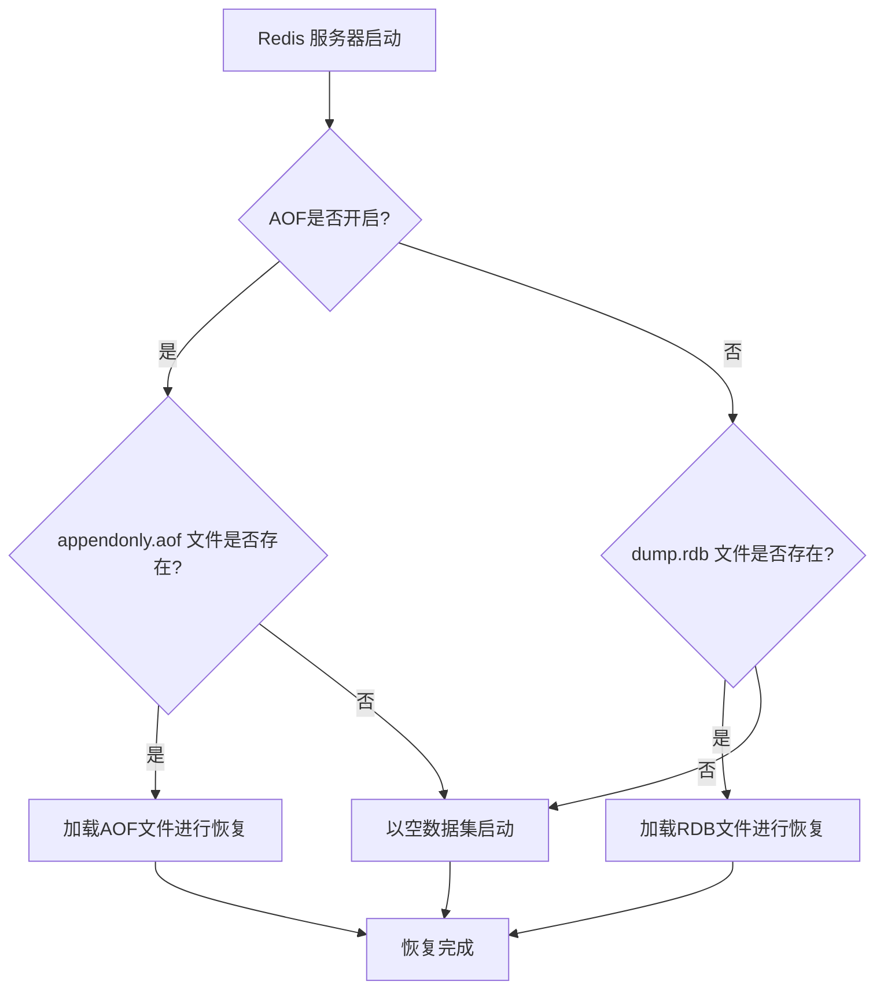

### 2. 手动恢复（从备份中恢复）

在很多灾备场景中，我们需要从一个备份文件（可能来自另一台服务器或过去的某个时间点）来手动恢复数据。步骤如下：

1.  **停止当前的 Redis 服务**：

    - 这是一个至关重要的步骤，必须先停止服务，否则它可能会覆盖你将要拷贝进去的备份文件。
    - 可以使用 `redis-cli shutdown` 命令。

2.  **替换持久化文件**：

    - 将你的备份文件（例如 `dump.rdb.backup` 或 `appendonly.aof.backup`）拷贝到 Redis 的工作目录中（在`redis.conf`中由`dir`配置项指定）。
    - 将文件名重命名为 Redis 期望的默认文件名，即 `dump.rdb` 或 `appendonly.aof`。
    - **注意**：如果你同时有 RDB 和 AOF 的备份，并希望使用 RDB 进行恢复，请确保目标服务器的 AOF 功能是关闭的，或者先删除目标服务器上可能存在的 AOF 文件。

3.  **检查并设置文件权限**：

    - 确保替换后的文件对于运行 Redis 的用户（例如 `redis` 用户）是可读的。

4.  **重启 Redis 服务**：
    - 启动`redis-server`。它会自动检测到你放入的持久化文件，并按照上面第一节描述的自动恢复流程来加载数据。

### 3. 持久化文件损坏时的恢复

在极端情况下，持久化文件本身可能损坏，导致 Redis 启动失败。Redis 为此提供了检查和修复工具。

- **RDB 文件检查**：

  - Redis 自带了`redis-check-rdb`工具。
  - 执行命令 `redis-check-rdb /path/to/your/dump.rdb`。它会检查文件的完整性并报告问题。但它没有修复功能。如果 RDB 文件损坏，通常只能使用更早的备份。

- **AOF 文件检查与修复**：
  - Redis 提供了`redis-check-aof`工具。
  - **检查**：`redis-check-aof /path/to/your/appendonly.aof`。
  - **修复**：`redis-check-aof --fix /path/to/your/appendonly.aof`。
  - 这个修复工具的工作原理是：**从头到尾扫描 AOF 文件，一旦发现格式错误的命令，就会将该命令之后的所有内容截断并丢弃。**
  - 这是一种有损修复，可以保证 Redis 能够启动，但会丢失损坏点之后的所有数据。这通常是作为最后的恢复手段。

### 总结

Redis 的数据恢复机制设计得相当鲁棒和直接：

- **自动化**：在正常启动时，它会自动选择最优的持久化文件进行恢复。
- **AOF 优先**：始终倾向于使用数据更全的 AOF 文件。
- **恢复效率**：混合持久化机制极大地提升了 AOF 的恢复速度。
- **手动可控**：提供了清晰的路径，允许管理员从备份中手动恢复数据。
- **容错工具**：提供了检查和修复工具来应对文件损坏的极端情况。

---

## 主从复制了解吗？

**Redis 主从复制，是指将一台 Redis 服务器（称为 Master，主节点）的数据，实时、异步地复制到其他一台或多台 Redis 服务器（称为 Replica/Slave，从节点）上。** 这构成了一个一主多从的分布式架构，是实现高可用和读写分离的基石。

### 1. 为什么需要主从复制？(作用与价值)

引入主从复制主要是为了解决以下三大问题：

1.  **高可用性 (High Availability)**：

    - 这是最核心的目的。主节点是数据读写的唯一入口，一旦它发生故障宕机，整个服务就不可用了。
    - 通过主从复制，当主节点宕机后，我们可以手动或通过**哨兵(Sentinel)机制**自动地将一个从节点提升（Promote）为新的主节点，从而继续提供服务，极大地缩短了服务中断的时间。

2.  **读写分离/读扩展 (Read Scaling)**：

    - 在读多写少的应用场景中，主节点的写入压力不大，但读取压力可能非常大。
    - 我们可以将所有的写操作都指向主节点，而将大量的读操作分发到多个从节点上去执行。这样，通过增加从节点的数量，就可以线性地扩展系统的读性能，分摊主节点的负载。

3.  **数据备份 (Data Backup)**：
    - 从节点是主节点数据的实时热备份。除了用于高可用切换外，我们还可以在某个从节点上执行持久化操作（如`BGSAVE`），而不会影响到主节点处理客户端请求的性能，从而实现一种相对安全的数据备份策略。

### 2. 主从复制的工作流程是怎样的？

Redis 的主从复制过程可以分为两个主要阶段：**全量同步（Full Synchronization）** 和 **增量同步（Incremental Synchronization）**。

假设我们现在要为一个主节点 Master 添加一个从节点 Slave。

#### 阶段一：全量同步（建立连接与数据快照同步）

这个阶段主要发生在从节点第一次连接到主节点时。

1.  **建立连接**：

    - 从节点启动后，会执行 `replicaof <master_ip> <master_port>` 命令。
    - 从节点会向主节点发送一个 `PSYNC ? -1` 命令，请求进行数据同步。（`?`表示不知道主节点的 run ID，`-1`表示需要所有数据）。

2.  **主节点响应**：

    - 主节点收到`PSYNC`命令后，判断出这是一个全新的从节点，于是执行 `BGSAVE` 命令，在后台生成一个**RDB 快照文件**。
    - 在`BGSAVE`执行期间，主节点会继续接收写命令，但它会将这些新的写命令缓存到一个**复制缓冲区（Replication Buffer）**中。

3.  **数据传输与加载**：

    - 主节点的`BGSAVE`完成后，会将生成的 RDB 文件发送给从节点。
    - 从节点接收到 RDB 文件后，会先**清空自己内存中的所有旧数据**，然后加载这个 RDB 文件，将数据恢复到内存中。这个过程是阻塞的，从节点无法处理其他请求。

4.  **同步增量命令**：
    - 主节点在发送完 RDB 文件后，会接着将**复制缓冲区**中缓存的那些增量写命令发送给从节点。
    - 从节点执行这些增量命令，从而使其数据状态与主节点在完成`BGSAVE`那一刻之后的状态完全一致。

至此，全量同步完成，主从之间进入了持续的增量同步阶段。

#### 阶段二：增量同步（命令传播）

- 全量同步完成后，主从之间会维持一个长连接。
- 之后，主节点每执行一个写命令，都会实时地、异步地将这个命令发送给所有连接着的从节点。
- 从节点接收到命令后，立即在自己的数据库中执行，从而保持与主节点的数据同步。这个过程我们称为**命令传播 (Command Propagation)**。

### 3. 核心机制与概念

#### a. 部分重同步 (Partial Resynchronization)

如果主从之间的连接因为网络抖动等原因短暂断开，然后又重连上了，此时如果还进行全量同步，开销就太大了。为此，Redis 2.8 版本之后引入了部分重同步机制。

- **原理**：主节点内部维护一个**固定大小的、环形的复制积压缓冲区（Replication Backlog）**。这个缓冲区记录了最近一段时间的写命令。每个命令都有一个唯一的**偏移量（offset）**。
- **流程**：
  1.  从节点重连后，会发送 `PSYNC <run_id> <offset>` 命令。`run_id`是它之前连接的主节点的 ID，`offset`是它断开前最后收到的命令的偏移量。
  2.  主节点收到命令后，首先检查`run_id`是否匹配。
  3.  如果匹配，再检查从节点请求的`offset`是否还在**复制积压缓冲区**内。
  4.  如果在，主节点就直接从缓冲区中把从节点缺失的命令发送过去，从而完成同步。这就是**部分重同步**。
  5.  如果`run_id`不匹配，或者`offset`已经太旧（被覆盖了），主节点就会认为无法进行部分重同步，转而执行一次**全量同步**。

#### b. 心跳机制 (Heartbeat)

- 在增量同步阶段，主从之间会互发心跳消息来维持连接和检测状态。
- **主->从**：主节点默认每 10 秒向从节点发送一个 `PING` 命令，检查从节点是否在线。
- **从->主**：从节点默认每 1 秒向主节点发送 `REPLCONF ACK <offset>` 命令，上报自己的复制偏移量，让主节点知道数据同步的进度。

### 4. 优缺点总结

- **优点**：
  - 架构简单，部署方便。
  - 有效实现了高可用、读扩展和数据备份。
- **缺点**：
  - **不保证数据绝对一致**：复制是异步的，主从之间存在短暂的延迟。在主节点宕机，从节点被提升的瞬间，可能会有少量数据丢失。
  - **单点写瓶颈**：所有写操作都必须经过主节点，主节点的写入能力限制了整个系统的写入吞吐量。
  - **全量同步的开销**：在初次连接或无法部分重同步时，全量同步对主从两端的 CPU、内存和网络带宽都会造成一定的压力。

总而言之，主从复制是构建更复杂 Redis 集群（如哨兵模式、Cluster 模式）的基础。理解它的工作原理对于设计和维护一个健壮的 Redis 服务至关重要。

---

## Redis 主从有几种常见的拓扑结构？

Redis 主从复制的拓扑结构非常灵活，可以根据不同的业务需求、可用性等级和成本考量来设计。常见的拓扑结构主要有以下三种：

### 1. 一主一从 (One Master, One Replica)

这是最简单、最基础的主从复制结构。

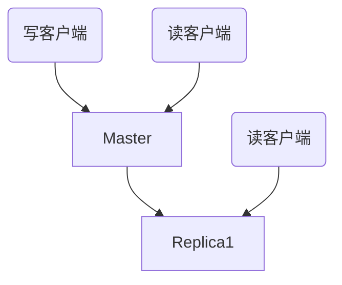

- **结构描述**：

  - 一个主节点 (Master) 负责处理所有的写操作和一部分读操作。
  - 一个从节点 (Replica) 接收主节点的所有数据变更，并可以处理读操作。

- **优点**：

  - **架构简单**：配置和维护都非常直接。
  - **实现备份和高可用基础**：当主节点出现故障时，从节点可以作为数据的热备份。通过手动或哨兵机制，可以将从节点提升为新的主节点，从而实现故障转移，保障了基本的高可用性。
  - **初步读写分离**：可以将一部分读请求分流到从节点，减轻主节点的压力。

- **缺点**：

  - **不具备高可用容错性**：当主节点宕机后，在手动或自动切换完成之前，系统是无法写入的。如果此时从节点也宕机，那么就存在数据丢失的风险（取决于持久化策略）。
  - **写压力无分担**：所有写操作依然集中在主节点，存在单点写入瓶颈。
  - **主节点 RDB 压力**：当需要增加新的从节点时，主节点需要执行`BGSAVE`进行全量同步，这会消耗主节点的资源。

- **适用场景**：
  - 对可用性要求不高的简单应用。
  - 作为其他更复杂拓扑结构的基础单元。
  - 纯粹用于数据备份的场景。

### 2. 一主多从 (One Master, Multiple Replicas)

这是一主一从结构的自然扩展，也是最常用的一种拓扑结构。

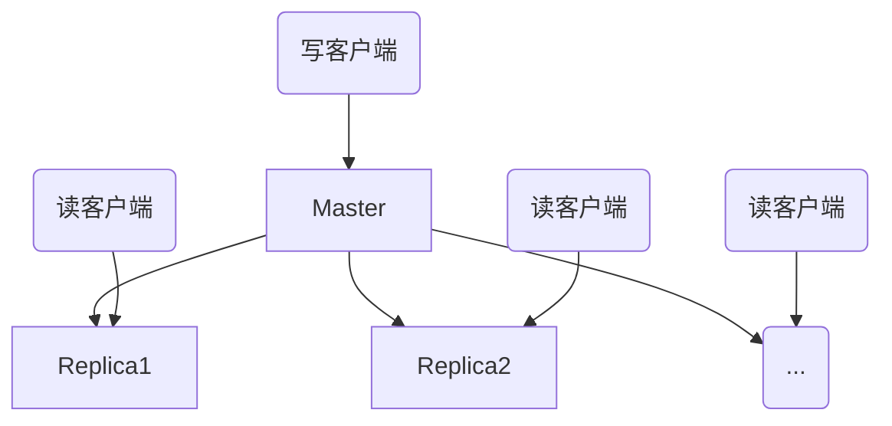

- **结构描述**：

  - 一个主节点处理所有写操作。
  - 多个从节点从同一个主节点复制数据。

- **优点**：

  - **高并发读能力**：通过增加从节点的数量，可以线性地扩展系统的读性能，非常适合读多写少的应用场景。
  - **更高的数据冗余度**：数据被复制了多份，分布在不同的服务器上，提升了数据的安全性和可用性。即使一个从节点宕机，还有其他从节点可以提供服务。

- **缺点**：

  - **主节点复制压力大**：主节点需要维护与所有从节点的连接，并将数据变更广播给所有从节点。当从节点数量非常多时，主节点的网络带宽和 CPU 资源会成为瓶颈。
  - **全量同步开销**：每增加一个从节点，主节点都需要执行一次`BGSAVE`并发送 RDB 文件，这会加剧主节点的压力。
  - **写瓶颈依然存在**：写操作仍然受限于单个主节点的能力。

- **适用场景**：
  - 绝大多数需要**读写分离**和**高可用**的场景。
  - 这是构建**哨兵模式 (Sentinel)** 的标准基础架构。

### 3. 树状主从结构 (Tree-like Structure) / 级联复制

为了解决“一主多从”结构中主节点压力过大的问题，可以引入一个中间层，形成树状的主从拓扑。

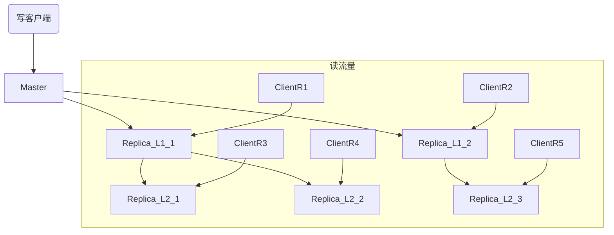

- **结构描述**：

  - 顶层是一个主节点 (Master)。
  - 中间层是一些从节点，它们直接从主节点复制数据。
  - 底层是更多的从节点，它们**不直接从主节点复制**，而是从中间层的从节点复制数据。
  - 这样就形成了一个数据流：`Master -> Replica(L1) -> Replica(L2)`。

- **优点**：

  - **减轻主节点负担**：主节点只需要向少数几个一级从节点同步数据，极大地降低了它的复制压力（网络带宽和 CPU）。
  - **水平扩展更容易**：当需要大规模扩展读节点时，只需要在二级从节点下面继续添加即可，对主节点几乎没有影响。

- **缺点**：

  - **复制延迟增加**：数据从主节点传递到底层从节点，需要经过更多的网络跳数，导致数据同步的延迟会比直接复制更长。底层从节点的数据一致性更差。
  - **架构更复杂**：维护和管理的复杂度增加了。中间层节点的故障会影响到其下的所有子节点，需要更完善的监控和故障转移策略。

- **适用场景**：
  - 需要极大数量从节点来支撑超高读并发的场景。
  - 跨数据中心的数据分发，例如一个中心机房的主节点，同步给其他几个分机房的中间节点，再由中间节点同步给各自机房内的其他节点。

**总结来说，**

- **一主一从**是基础，用于简单场景和备份。
- **一主多从**是标准和最常用的模式，完美契合读写分离和高可用需求，是哨兵架构的基础。
- **树状结构**是针对大规模、超高读并发场景的优化方案，通过牺牲部分一致性来换取主节点的稳定和系统的可扩展性。

---

## Redis 的主从复制原理了解吗？

**Redis 主从复制的根本原理可以概括为：从节点主动与主节点建立连接，并通过全量同步和增量同步两种方式，异步地将主节点的数据变更（写命令）拉取到自身并执行，从而在最终层面保证主从数据的一致性。**

整个过程的核心，是围绕着`PSYNC`这个命令以及两个重要的缓冲区来展开的。

### 1. 核心通信与协商

主从复制的启动和协商都依赖于`PSYNC`命令。

- 当一个从节点启动并配置了主节点地址后（通过`replicaof`命令），它会向主节点发送`PSYNC`命令，尝试进行同步。
- `PSYNC`命令有两种形式：
  1.  **`PSYNC ? -1`**：用于**初次复制**。`?`表示从节点不知道主节点的运行 ID（Run ID），`-1`表示它需要全部数据。
  2.  **`PSYNC <runid> <offset>`**：用于**断线重连**后的部分重同步。`<runid>`是从节点记忆中上一次连接的主节点的 ID，`<offset>`是它已经收到的最后一个命令的偏移量。

主节点根据收到的`PSYNC`命令的形式，来决定接下来是进行**全量同步**还是尝试**部分重同步**。

### 2. 两大同步阶段

#### 阶段一：全量同步 (Full Synchronization)

当从节点是第一次连接主节点，或者断线重连后无法进行部分重同步时，就会触发全量同步。这个过程好比“**新同学报到，老师把以前的全部课堂笔记都复印一份给你**”。

其详细步骤如下：

1.  **从节点发送请求**：从节点发送 `PSYNC ? -1`。
2.  **主节点准备快照**：主节点收到请求后，执行 `BGSAVE` 命令，在后台`fork`一个子进程生成当前内存数据的 RDB 快照文件。
3.  **主节点缓冲命令**：在`BGSAVE`执行期间，主节点会继续处理写命令。但为了保证数据一致性，它会将这期间所有新的写命令缓存到一个专用的**复制缓冲区（Replication Buffer）**中。
4.  **主节点发送快照**：RDB 文件生成后，主节点将其发送给从节点。
5.  **从节点加载快照**：从节点接收到 RDB 文件，会先**清空自己所有旧数据**，然后将 RDB 文件加载到内存中。
6.  **主节点发送缓冲命令**：主节点在发送完 RDB 后，接着将**复制缓冲区**中的所有写命令发送给从节点。
7.  **从节点执行命令**：从节点执行这些写命令，使其数据状态更新到主节点执行`BGSAVE`那一刻之后的状态。

至此，全量同步完成，主从之间的数据达到了一致，之后便进入持续的增量同步阶段。

#### 阶段二：增量同步 (Incremental Synchronization / Command Propagation)

全量同步完成后，主从之间就进入了正常的、持续的同步状态。这个过程好比“**老师在黑板上每写一个新知识点，你就立刻抄写到自己的笔记本上**”。

- 主节点每执行一个会改变数据的写命令，就会**异步地**将这个命令发送给所有连接的从节点。
- 从节点接收到命令后，立即在自己的环境中执行，以保持与主节点的数据同步。

### 3. 断线重连与部分重同步 (Partial Resynchronization)

如果网络发生抖动，主从连接断开，一段时间后又恢复。此时如果再进行一次全量同步，开销太大。为此，Redis 2.8 引入了部分重同步机制。这个过程好比“**上课打盹，醒来后问同桌你漏掉了哪几句话**”。

这个机制的实现依赖于主节点上的一个关键数据结构：

- **复制积压缓冲区 (Replication Backlog)**：
  - 这是一个在主节点上维护的、**固定大小的、环形的**缓冲区。
  - 它会存储主节点最近执行过的写命令以及每个命令对应的**偏移量(offset)**。
  - 当从节点断开时，主节点仍然会将写命令写入这个缓冲区。

部分重同步的流程如下：

1.  **从节点请求重同步**：从节点重连后，发送`PSYNC <runid> <offset>`，带着它记忆中的主节点 ID 和自己的复制偏移量。
2.  **主节点验证**：
    - 主节点首先检查`runid`是否与自己当前的 ID 一致。如果不一致，说明主节点已经重启或发生了变更，必须进行全量同步。
    - 如果`runid`一致，主节点会检查从节点请求的`offset`是否还在**复制积压缓冲区**内。
3.  **决策与执行**：
    - **如果在缓冲区内**：说明从节点断开的时间不长，缺失的数据还在。主节点会直接从积压缓冲区中，将从节点缺失的命令发送过去。这就完成了高效的**部分重同步**。
    - **如果不在缓冲区内**：说明从节点断开太久，缺失的命令已经被新的命令覆盖了。主节点会返回一个`+FULLRESYNC`响应，退化为**全量同步**。

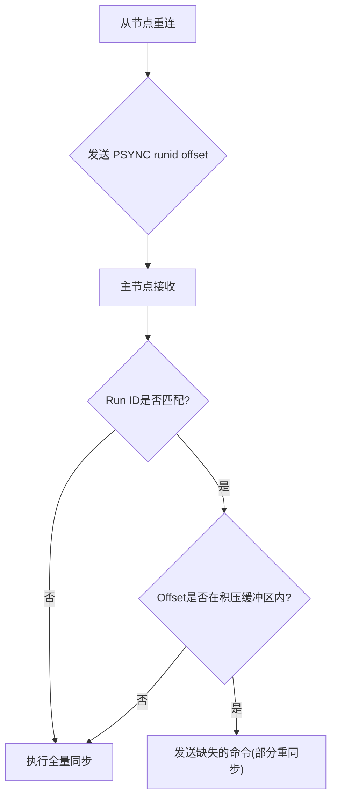

### 4. 心跳机制 (Heartbeat)

在增量同步期间，主从之间会通过心跳来维持连接和检测状态：

- **主->从**：主节点定期向从节点发送`PING`命令，检测从节点活性。
- **从->主**：从节点定期向主节点发送`REPLCONF ACK <offset>`命令，上报自己的复制进度，让主节点知道数据同步的情况。

**总结来说，Redis 主从复制的原理是一个精巧的、以`PSYNC`命令为核心的协商机制，它结合了 RDB 快照的全量复制能力和类似 AOF 的命令传播的增量复制能力，并通过复制积压缓冲区实现了高效的断线重连优化，最终通过心探机制来保证主从状态的实时感知。**

---

## 详细说说全量同步和增量同步？

全量同步和增量同步是 Redis 主从复制的两个核心阶段，理解它们的细节对于掌握复制原理至关重要。

### 全量同步 (Full Synchronization / Full Resynchronization)

**一句话概括：当从节点无法基于现有数据进行追赶时，主节点将自己的全量数据快照一次性发送给从节点，这是一个开销较大、用于“从零开始”或“重置”的初始化过程。**

可以把它比作：一个新员工入职，经理把整个项目的所有历史文档都打包发给他。

#### 1. 触发时机

全量同步主要在以下两种情况下被触发：

1.  **首次连接**：一个从节点第一次连接到主节点，其本地没有任何数据，必须进行全量同步。
2.  **断线重连后无法部分重同步**：从节点与主节点断开连接的时间过长，导致它所缺失的写命令已经被主节点的**复制积压缓冲区 (Replication Backlog)** 覆盖掉了。此时，主节点无法满足其部分同步的请求，只能退化为全量同步。

#### 2. 详细步骤

全量同步是一个精心设计的、多步骤的协作过程：

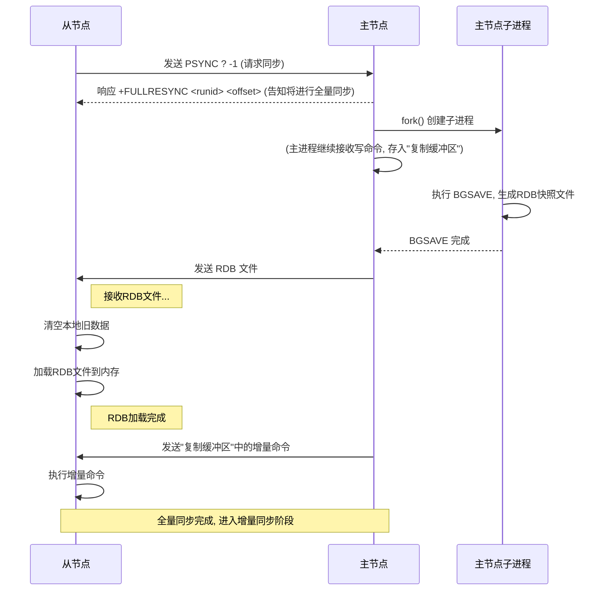

1.  **从节点发起请求**：从节点向主节点发送 `PSYNC ? -1` 命令。
2.  **主节点响应并准备**：主节点收到请求，确定需要进行全量同步。它会：
    - 向从节点返回一个 `+FULLRESYNC <runid> <offset>` 的响应，告知从节点自己的运行 ID 和当前的复制偏移量。
    - 执行 `BGSAVE` 命令，通过 `fork()` 创建一个子进程来生成 RDB 快照。这一步是为了避免阻塞主进程，让主进程可以继续服务客户端的请求。
3.  **主进程缓冲新命令**：在子进程生成 RDB 文件的这段时间里，主进程接收到的所有新的写命令，都会被缓存到一个临时的**复制缓冲区 (Replication Buffer)**中。
4.  **主节点发送 RDB 文件**：子进程完成 RDB 文件的生成后，主进程会将这个 RDB 文件发送给从节点。
5.  **从节点接收并加载**：从节点接收到 RDB 文件后，会**首先清空自己内存中的所有旧数据**，然后开始加载 RDB 文件，将数据恢复到内存中。这个加载过程对于从节点来说是阻塞的。
6.  **主节点发送缓冲的命令**：在发送完 RDB 文件后，主节点会接着将第 3 步中**复制缓冲区**里缓存的所有写命令，发送给从节点。
7.  **从节点追赶进度**：从节点执行完这些从缓冲区发来的命令后，其数据状态就和主节点在某个时间点（即 RDB 生成完成的时间点）之后的状态完全一致了。

至此，全量同步过程结束，主从之间进入了持续的增量同步阶段。

#### 3. 缺点

- **资源开销大**：主节点执行 `BGSAVE` 会消耗 CPU 和内存，`fork`操作在数据量大时可能导致短暂的阻塞。同时，传输 RDB 文件会占用大量的网络带宽。
- **阻塞从节点**：从节点在加载 RDB 文件期间，无法处理任何外部请求。

### 增量同步 (Incremental Synchronization)

**一句话概括：在已建立连接的主从关系中，主节点将自己执行的每一个写命令，实时、异步地发送给从节点，这是一个轻量级的、持续的数据同步过程。**

可以把它比作：员工入职后，每天通过邮件或即时消息接收新的工作任务。

#### 1. 触发时机

- 当一次全量同步成功完成后，主从之间立即进入增量同步阶段。
- 当一次成功的**部分重同步**完成后，也会继续进行增量同步。

#### 2. 详细步骤

增量同步也被称为**命令传播 (Command Propagation)**，过程非常直接：

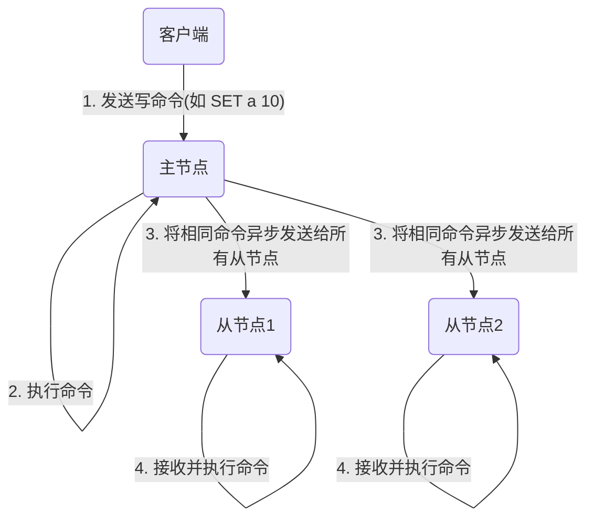

1.  **主节点接收写命令**：客户端向主节点发送一个写命令（如 `SET`, `HSET`, `DEL`等）。
2.  **主节点执行并传播**：主节点在自己的数据库中执行这个命令。执行成功后，它会将**完全相同的命令**放入 AOF 缓冲区（如果开启了 AOF），并同时发送给所有连接的从节点。
3.  **从节点接收并执行**：从节点通过主从之间的长连接接收到这条命令，然后在自己的数据库中执行，从而实现了数据的同步。

#### 3. 关键机制与特点

- **异步性**：命令传播是异步的，主节点发送完命令后不会等待从节点的回复，会立即处理下一个请求。这保证了主节点的高性能，但也导致了主从之间存在数据延迟（Replication Lag）。
- **无缝衔接**：全量同步的最后一步（发送缓冲区的命令）本身就是一次小型的命令传播，保证了两个阶段的无缝切换。
- **心跳维持**：在增量同步期间，主从之间会通过`PING`和`REPLCONF ACK`命令互发心跳，以检测连接状态和同步进度。

### 总结对比

| 特性     | 全量同步 (Full Synchronization)                 | 增量同步 (Incremental Synchronization)  |
| :------- | :---------------------------------------------- | :-------------------------------------- |
| **本质** | 数据快照 (RDB) + 追赶命令                       | 持续的写命令流 (Command Propagation)    |
| **时机** | 首次连接、无法部分重同步时                      | 全量同步/部分重同步完成后，作为常规状态 |
| **开销** | **高** (消耗 CPU、内存、网络带宽)               | **低** (仅传输少量命令数据)             |
| **过程** | `BGSAVE`、传 RDB、加载 RDB、传缓冲命令          | 主节点执行写命令后，异步转发给从节点    |
| **影响** | 主节点`fork`可能短暂阻塞，从节点加载 RDB 时阻塞 | 对主从性能影响小，但存在数据延迟        |

---

## 主从复制存在哪些问题呢？

Redis 主从复制虽然是构建高可用和读写分离架构的基石，但它自身的设计也带来了一些固有的问题和挑战。清楚地认识这些问题，有助于我们设计出更健壮的系统，并理解为什么需要哨兵（Sentinel）和集群（Cluster）这样的高级解决方案。

主从复制存在的主要问题可以归纳为以下几点：

### 1. 数据一致性问题 (短暂的数据不一致)

这是主从复制最核心的一个特性，也是一个“问题”。

- **异步复制**：主从之间的数据同步是**异步**的。主节点在执行完一个写命令后，会将命令发送给从节点，但它不会等待从节点确认收到并执行，而是会立即返回结果给客户端并处理下一个请求。
- **后果**：这导致主从节点之间必然存在一个短暂的**数据延迟 (Replication Lag)**。在这个延迟窗口内，如果客户端去访问从节点，可能会读到旧的数据。
- **极端情况**：如果主节点在执行完一个写命令后，还没来得及把这个命令同步给任何一个从节点就宕机了，那么这个刚刚写入的数据就会**永久丢失**。

**结论**：主从复制只能保证**最终一致性**，无法保证**强一致性**。对于那些对数据一致性要求极高的业务（如支付、金融交易），直接使用主从复制架构需要非常谨慎。

### 2. 故障转移非自动化 (需要人工干预)

主从复制本身只解决了数据备份和读扩展的问题，但并没有解决**自动故障转移 (Automatic Failover)** 的问题。

- **主节点宕机后**：如果主节点宕机，系统将无法再接受任何写操作。虽然我们有从节点作为备份，但 Redis 本身不会自动地从剩下的从节点中选举出一个新的主节点来接替工作。
- **需要人工操作**：必须由运维人员手动介入，选择一个数据最完整的从节点，执行 `REPLICAOF NO ONE` 命令使其成为新的主节点，然后通知其他从节点去复制这个新的主节点，并修改客户端的连接配置。
- **问题**：这个过程是**手动的、复杂的、容易出错的，并且会导致较长的服务中断时间 (RTO)**。

**结论**：纯粹的主从复制架构，其高可用性是“半成品”。为了解决这个问题，Redis 推出了**哨兵 (Sentinel)** 机制。

### 3. 主节点写瓶颈 (无法水平扩展写能力)

主从复制架构在“读”的能力上可以通过增加从节点来水平扩展，但在“写”的能力上却存在天花板。

- **单点写入**：所有的写操作都必须经过唯一的**主节点**。
- **瓶颈**：主节点的写入性能（QPS）、内存容量和网络带宽，共同决定了整个 Redis 系统的写入上限。当业务的写入量超过单个主节点所能承载的极限时，整个系统就会出现瓶颈。

**结论**：主从复制无法解决**写压力**的扩展问题。要解决这个问题，就需要引入**分片 (Sharding)** 的思想，也就是 Redis 官方的**集群 (Cluster)** 方案。

### 4. 全量同步的性能开销

我们在之前的讨论中已经多次提到，全量同步是一个资源密集型操作。

- **主节点压力**：
  - `fork`子进程时，如果内存较大，可能会导致主节点**短暂卡顿 (latency spike)**。
  - `BGSAVE`会消耗 CPU 和磁盘 I/O。
  - 发送 RDB 文件会占用大量的网络带宽。
- **从节点压力**：
  - 接收 RDB 文件占用网络带宽。
  - 清空旧数据、加载 RDB 文件时，从节点会**阻塞**，无法提供服务。

**问题**：在一个不稳定的网络环境中，如果主从频繁断线重连，并反复触发全量同步，会对整个系统造成持续的性能冲击。特别是当一个主节点下挂载了大量从节点时，这个问题会更加严重。

### 5. 复制积压缓冲区 (Replication Backlog) 不足导致的全量同步

为了实现部分重同步，主节点需要一个足够大的复制积压缓冲区。

- **缓冲区大小固定**：这个缓冲区的大小是固定的（默认 1MB）。
- **问题**：如果主从断开的时间内，主节点产生的写命令总量超过了缓冲区的大小，那么最旧的命令就会被覆盖。当从节点重连时，它需要的起始偏移量已经找不到了，就只能被迫进行一次代价高昂的全量同步。
- **场景**：这个问题在“写突发”或网络长时间故障的场景下容易出现。虽然可以通过调整`repl-backlog-size`参数来缓解，但这需要预先对业务的写入模型有准确的评估。

### 总结

| 问题分类               | 具体表现                                             | 解决方案                                                     |
| :--------------------- | :--------------------------------------------------- | :----------------------------------------------------------- |
| **一致性问题**         | 异步复制导致数据延迟，极端情况下数据丢失。           | 接受最终一致性；或使用更高一致性的同步策略（如`WAIT`命令）。 |
| **高可用性问题**       | 主节点宕机后，无法自动进行故障转移。                 | **Redis Sentinel (哨兵)**                                    |
| **写扩展问题**         | 所有写操作都由主节点处理，存在单点写入瓶颈。         | **Redis Cluster (集群)**                                     |
| **性能开销问题**       | 全量同步对主从节点的 CPU、内存、网络造成压力。       | 优化网络、采用树状复制结构、合理配置`repl-backlog-size`。    |
| **部分重同步失效问题** | 复制积压缓冲区过小，导致网络抖动后频繁触发全量同步。 | 调大`repl-backlog-size`配置参数。                            |

总而言之，主从复制是一个强大但并非完美的机制。它为我们展现了构建分布式系统的基本思路，同时也暴露了其中的挑战。正是为了系统性地解决这些问题，才催生了后续的哨兵和集群架构。

---

## Redis 哨兵机制了解吗？

**简单来说，Redis 哨兵是一个专用于监控和管理 Redis 主从复制集群的、独立的、高可用的组件。它的核心使命就是解决主从复制模式下“故障转移非自动化”的问题，从而实现真正意义上的高可用。**

可以把哨兵想象成一个 7x24 小时不间断工作的“智能运维团队”，这个团队负责监控所有 Redis 节点，并在主节点出问题时，自动地、无需人工干预地选举出新的主节点，并让整个系统恢复正常。

### 1. 哨兵的核心职能 (它做什么？)

哨兵系统主要有四大核心职能：

1.  **监控 (Monitoring)**：

    - 哨兵会持续地、不知疲倦地向它所监控的所有 Redis 节点（包括主节点和从节点）发送`PING`命令。
    - 通过节点对`PING`命令的响应来判断其是否处于正常工作状态。

2.  **通知 (Notification)**：

    - 当被监控的某个 Redis 节点出现问题时，哨兵可以通过 API 将这个事件通知给系统管理员或其他应用程序。

3.  **自动故障转移 (Automatic Failover)**：

    - 这是哨兵**最核心、最关键**的功能。
    - 当哨兵集群确认主节点已经宕机后，会自动地在所有从节点中，按照一定的规则，选举出一个新的主节点。
    - 然后，它会命令其余的从节点去复制这个新产生的主节点，并确保旧的主节点在恢复后也会作为从节点加入到新的体系中。

4.  **配置提供者 (Configuration Provider)**：
    - 在故障转移发生后，主节点的地址会发生变化。
    - 客户端在初始化时，不再是直接连接 Redis 主节点，而是连接哨兵集群。
    - 客户端向哨兵询问当前“服务名”（如`mymaster`）对应的主节点地址是什么，哨兵会将最新的、正确的主节点地址返回给客户端。这样，客户端就能动态地感知到主节点的变化。

### 2. 哨兵的架构

哨兵本身也是分布式的。为了避免哨兵自身成为单点，生产环境中**必须部署一个哨兵集群**（通常建议部署 3 个或以上的奇数个哨兵实例），它们共同监控同一组 Redis 主从节点。

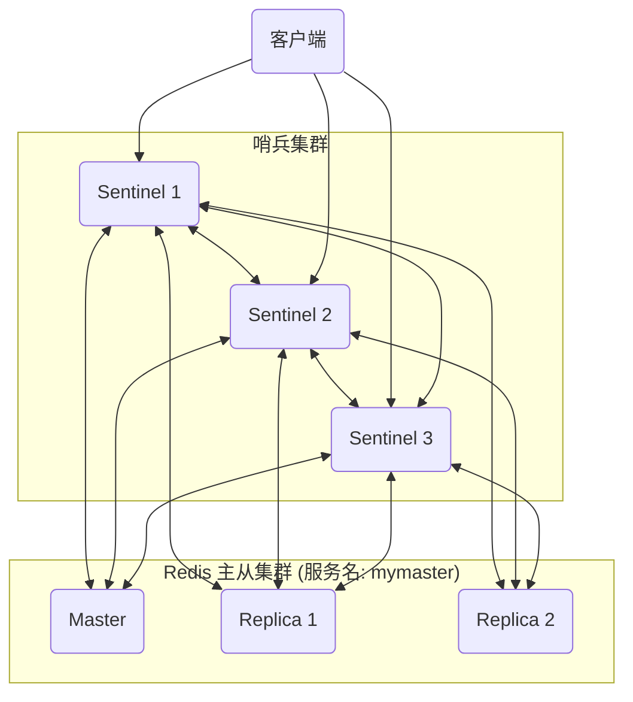

- 哨兵之间会相互监控。
- 所有哨兵都会同时监控所有 Redis 节点。

### 3. 哨兵的工作原理 (如何实现自动故障转移？)

这个过程可以分为三个关键阶段：**故障发现**、**领导者选举**和**故障转移执行**。

#### 阶段一：故障发现 (主观下线与客观下线)

1.  **主观下线 (Subjective Down, SDOWN)**：

    - 每个哨兵实例会独立地、定期地向所有 Redis 节点发送`PING`命令。
    - 如果在配置的`down-after-milliseconds`时间内，某个节点（比如主节点）没有给出有效响应，那么**这个哨兵**就会在自己的视角里，将该节点标记为“主观下线”。
    - 这只是单个哨兵的“个人看法”，可能是因为它自己与主节点的网络不通。

2.  **客观下线 (Objective Down, ODOWN)**：
    - 当一个哨兵将主节点标记为 SDOWN 后，它会向哨兵集群中的其他哨兵发送`SENTINEL is-master-down-by-addr`命令，进行“投票问询”。
    - 其他哨兵会根据自己与主节点的通信情况进行回复。
    - 当发起问询的哨兵收到**超过指定数量（quorum）**的哨兵都同意主节点已经 SDOWN 时，它就会将主节点的状态从“主观下线”升级为“**客观下线**”。
    - **`quorum`** 是一个非常重要的配置参数，它代表了需要多少个哨兵达成共识才能确认主节点真正宕机。例如，在一个 3 节点的哨兵集群中，`quorum`通常设置为 2。这个机制是为了防止误判。

#### 阶段二：领导者选举 (选出执行故障转移的哨兵)

一旦主节点被确认为 ODOWN，所有哨兵就需要协商选出一个“领导者（Leader）”来全权负责接下来的故障转移操作。

- **选举机制**：这个选举过程基于**Raft 算法**。
  - 第一个发现主节点 ODOWN 的哨兵会发起选举，请求其他哨兵投票给自己。
  - 每个哨兵在一个任期（epoch）内只能投一票，并且会投给第一个向它请求的哨兵。
  - 当一个哨兵获得了**大多数（N/2 + 1）**的选票时，它就成功当选为领导者。
  - 如果一轮选举没有成功，会进入下一个任期，重新选举。

#### 阶段三：故障转移执行 (领导者哨兵的操作)

当选的领导者哨兵会开始执行一系列严谨的操作来完成故障转移：

1.  **挑选新的主节点**：领导者哨兵会从所有从节点中，按照一个优先级规则来挑选出最合适的节点作为新的主节点。规则如下：
    a. **优先级筛选**：首先看`replica-priority`配置项，数字越小优先级越高。
    b. **复制偏移量筛选**：如果优先级相同，就选择复制偏移量（offset）最大的那个，因为这意味着它拥有最接近旧主节点的数据。
    c. **运行 ID 筛选**：如果以上两个条件都相同，就选择运行 ID（Run ID）最小的那个。

2.  **执行命令，提升新主**：领导者哨兵向被选中的从节点发送 `REPLICAOF NO ONE` 命令，使其断开与旧主的复制关系，正式提升为新的主节点。

3.  **命令其他从节点跟随新主**：领导者哨兵向剩下的所有从节点发送 `REPLICAOF <new_master_ip> <new_master_port>` 命令，让它们去复制新的主节点。

4.  **“监管”旧主节点**：领导者哨兵会持续监控那个已经宕机的旧主节点。如果它某天恢复了，哨兵会立刻向它发送`REPLICAOF`命令，让它也去复制新的主节点，降级为从节点，从而防止“双主”问题的出现。

### 4. 优缺点总结

- **优点**：
  - **高可用**：解决了主从复制模式下的自动故障转移问题，是官方推荐的高可用方案。
  - **架构清晰**：相对于 Cluster 集群，哨兵模式的架构和运维更简单一些。
- **缺点**：
  - **写瓶颈仍在**：哨兵只解决了高可用问题，并没有解决主节点的写压力问题。整个系统仍然只有一个主节点在处理写请求。
  - **增加了系统复杂性**：需要额外部署和维护一个哨兵集群。
  - **故障转移期间有短暂中断**：从发现故障到完成转移，整个过程会有几十秒到一两分钟的服务中断（写服务不可用）。
  - **数据丢失风险**：由于主从复制是异步的，故障转移时依然可能丢失少量数据。

总而言之，Redis 哨兵是在主从复制基础上实现自动高可用的“标准答案”，它通过一个健壮的分布式协议，确保了在主节点失效时，系统能够快速、自动地恢复服务。

---

## Redis 领导者选举了解吗？

**哨兵领导者选举的根本目的，是在哨兵集群中选出一个唯一的、临时的领导者（Leader），由它来全权负责执行后续的故障转移（Failover）操作。** 这样做是为了避免多个哨兵同时进行故障转移，从而造成命令冲突、状态混乱和资源浪费。

这个选举过程是基于分布式领域经典的**Raft 算法**的一个简化实现，其核心思想是**“先到先得”**和**“少数服从多数”**。

### 1. 选举的触发时机

领导者选举**并不会**随时进行。它只在一个明确的条件下被触发：

**当一个哨兵实例判断主节点进入了“客观下线”（Objective Down, ODOWN）状态时，它就会立即发起一轮领导者选举。**

也就是说，选举是伴随着故障转移的启动而启动的。

### 2. 选举的核心概念

要理解选举过程，需要先了解几个关键概念：

- **配置纪元 (Configuration Epoch)**：

  - 这是一个单调递增的计数器，可以理解为哨兵集群的“版本号”或“任期号”。
  - 每一次故障转移（无论是成功还是失败），都会导致这个纪元号加一。
  - 它的作用是解决冲突。在两个不同纪元的提议面前，纪元号大的永远获胜。

- **投票**：

  - 在选举中，一个哨兵可以向其他哨兵请求投票，也可以给其他哨兵投票。
  - **核心规则**：在一个给定的配置纪元内，每个哨兵只有**一票**，并且会投给**第一个**向它请求投票的哨兵（先到先得原则）。

- **法定人数 (Quorum)**：
  - 在判断客观下线时，需要`quorum`个哨兵同意。
  - 在选举领导者时，一个候选者需要获得**大多数（Majority）**哨兵的投票才能当选。这个“大多数”通常是 `(N/2) + 1`，其中 N 是哨兵总数。例如，3 个哨兵需要 2 票，5 个哨兵需要 3 票。

### 3. 选举的详细步骤

下面我们以一个由 3 个哨兵（S1, S2, S3）组成的集群为例，来描述选举的完整流程：

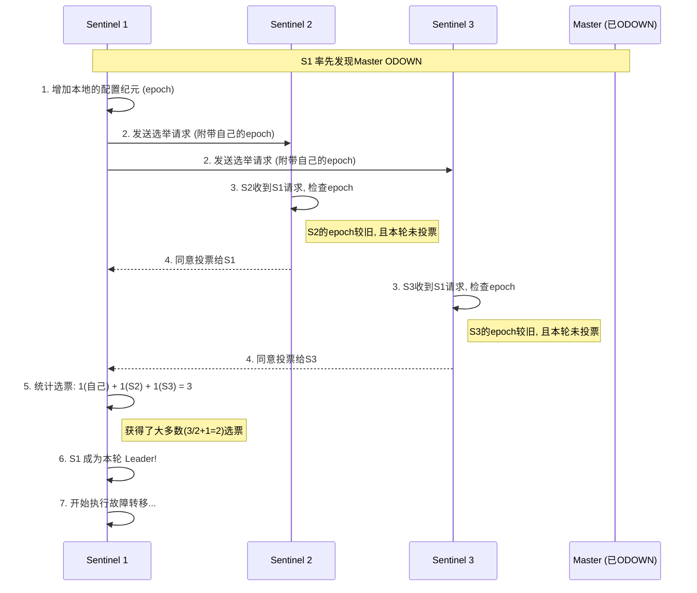

1.  **发起选举**：

    - 假设 S1 最先确认了主节点的 ODOWN 状态。
    - S1 会立即做两件事：
      a. 将自己本地的`current_epoch`（当前纪元号）加一。
      b. 向集群中其他的哨兵（S2, S3）广播一条`SENTINEL is-master-down-by-addr`命令，但这次命令中包含了它自己的`runid`和这个新的`epoch`，这实际上就是一张**拉票请求**。

2.  **其他哨兵投票**：

    - S2 和 S3 收到了来自 S1 的拉票请求。
    - 它们会检查这个请求中的`epoch`。如果这个`epoch`比自己本地记录的`epoch`要新，并且自己在这个`epoch`里还没有投过票，那么它们就会同意投票给 S1。
    - 同意的方式是，将自己本地的`epoch`更新为 S1 带来的新`epoch`，并向 S1 回复一个确认消息。
    - 一旦投了票，在本轮`epoch`中，即使再收到其他哨兵（比如 S2 也同时发起了选举）的拉票请求，S2 和 S3 也不会再投票了。

3.  **领导者确认**：

    - S1 会不断地接收来自其他哨兵的投票回复。
    - 它会把自己的一票也算上。
    - 一旦 S1 发现自己获得的票数**大于等于`quorum`**（判断 ODOWN 的法定人数）**并且**也**大于等于哨兵总数的半数加一（N/2 + 1）**，它就正式宣布自己成为了本轮选举的领导者。

4.  **选举结果同步**：
    - 成为领导者后，S1 会开始执行故障转移。其他非领导者哨兵则会继续等待，并更新自己的状态以确认 S1 为领导者。

### 4. 选举的冲突处理与健壮性

- **如果多个哨兵同时发起选举怎么办？**

  - 这是一个常见情况。比如 S1 和 S2 几乎同时发现 ODOWN，并都发起了拉票请求。
  - 由于网络延迟，可能 S1 的请求先到达 S3，S3 就投票给了 S1；而 S2 的请求先到达它自己，它会投给自己。
  - 最终结果就是，谁的请求更快，覆盖了更多的哨兵，谁就更有可能先凑够大多数选票。
  - 如果在一轮选举中，没有任何一个哨兵获得大多数选票（比如选票被瓜分了），那么这次选举就失败了。

- **选举失败了怎么办？**
  - 选举会有一个超时时间。如果在规定时间内没有选出领导者，本轮选举作废。
  - 之后，所有哨兵会等待一个随机的时间，然后再次将自己的`epoch`加一，发起新一轮的选举。
  - 引入随机等待时间是为了避免所有哨兵又在同一时刻发起选举，导致活锁（Livelock），这是一种退避策略，可以大大增加下一轮选举成功的概率。

### 总结

Redis 哨兵的领导者选举是一个简洁而高效的分布式选举过程：

- **基于 Raft 思想**：借鉴了 Raft 算法中的任期（Epoch）、投票和领导者概念。
- **公平且高效**：通过“先到先得”和“少数服从多数”的原则，能快速地在哨兵集群中达成共识。
- **健壮性**：通过`epoch`解决了冲突问题，通过随机超时和重试机制避免了选举活锁，保证了即使在复杂的网络环境下，最终也总能选出一个领导者来完成故障转移任务。

---

## 新的主节点是怎样被挑选出来的？

当哨兵领导者（Leader）被成功选举出来后，它的首要任务就是从所有健康的从节点（Replicas）中，挑选出一个最合适的节点来接替旧主节点的工作。这个挑选过程不是随机的，而是遵循一套**严格的、按顺序执行的优先级规则**，旨在选出**数据最完整、状态最稳定**的从节点。

这个筛选过程可以分为以下几个步骤，按顺序依次进行比较：

### 筛选第一步：过滤不健康的从节点

首先，领导者哨兵会排除掉所有不满足基本条件的从节点。被排除的节点包括：

1.  **已下线的节点**：那些已经被标记为“主观下线”（SDOWN）或“客观下线”（ODOWN）的从节点。这些节点自身已经出了问题，肯定不能被选为新主。
2.  **网络连接有问题的节点**：在最近一段时间内（由`down-after-milliseconds`配置项定义），未能成功响应哨兵`PING`命令的从节点。虽然它们还没被正式标记为下线，但通信不畅，状态不稳定，也不能被选为新主。

经过这一步过滤，剩下的都是当前看来网络通畅、状态正常的“候选节点”。

### 筛选第二步：按优先级 (`replica-priority`) 排序

接下来，领导者哨兵会对所有候选节点进行排序，排序的**第一个依据**是每个从节点配置文件 (`redis.conf`) 中的 `replica-priority` 参数。

- **规则**：`replica-priority` 是一个整数，**数字越小，优先级越高**。默认值是 100。
- **用途**：这个参数是特意提供给运维人员用来**人为干预选举**的。我们可以根据服务器的硬件配置、地理位置或其他业务策略，为某些从节点设置一个更低的优先级（例如，将配置更好的机器设置为`replica-priority 1`），让它们在选举中更有可能被选中。
- **特殊值**：如果一个从节点的 `replica-priority` 被设置为 `0`，那么这个从节点**永远不会被选为**主节点。这适合于那些只用作数据备份或离线分析，不希望其参与在线业务的节点。

**操作**：领导者哨兵会选择所有候选节点中，`replica-priority` 值最小的那个（或一组）。如果只有一个节点的优先级最低，那么它就直接胜出，挑选过程结束。如果有一组节点的优先级并列最低，则进入下一步筛选。

### 筛选第三步：按复制偏移量 (`offset`) 排序

如果经过第二步后，仍然有多个从节点的优先级相同（例如，所有节点的 `replica-priority` 都是默认的 100），那么领导者哨兵会比较它们的**复制偏移量 (replication offset)**。

- **规则**：**复制偏移量越大的节点，优先级越高。**
- **含义**：复制偏移量代表了这个从节点已经从旧主节点那里成功同步了多少字节的数据。偏移量越大，意味着这个从节点的数据**越新、越完整**。
- **目的**：选择数据最新的节点作为新主，可以**最大程度地减少数据丢失**。这是整个选举策略中保障数据安全的核心环节。

**操作**：领导者哨兵会在优先级相同的节点中，选择复制偏移量最大的那个。如果只有一个节点的偏移量最大，它就胜出，挑选过程结束。如果偏移量依然有并列的情况（虽然概率很小，但可能发生），则进入最后一步。

### 筛选第四步：按运行 ID (`run_id`) 排序

如果经过前三步的严格筛选，竟然还有多个从节点的优先级和复制偏移量都完全相同，那么领导者哨兵会进行最后的比较：**运行 ID (Run ID)**。

- **规则**：**选择运行 ID 字典序最小的那个节点。**
- **含义**：运行 ID 是每个 Redis 实例启动时随机生成的一个 40 位的十六进制字符串。它本身没有特殊的业务含义。
- **目的**：这一步主要是为了在所有条件都完全一样的情况下，提供一个**确定性的选择**，防止选举无法做出最终决定。选择字典序最小的只是一个确保每次都能选出唯一结果的硬性规定。

**操作**：领导者哨兵在剩下的节点中，选择运行 ID 最小的那个，它将最终成为新的主节点。到这一步，必然能选出一个唯一的胜者。

### 总结

新主节点的挑选过程是一个严谨的、层层递进的决策流程：

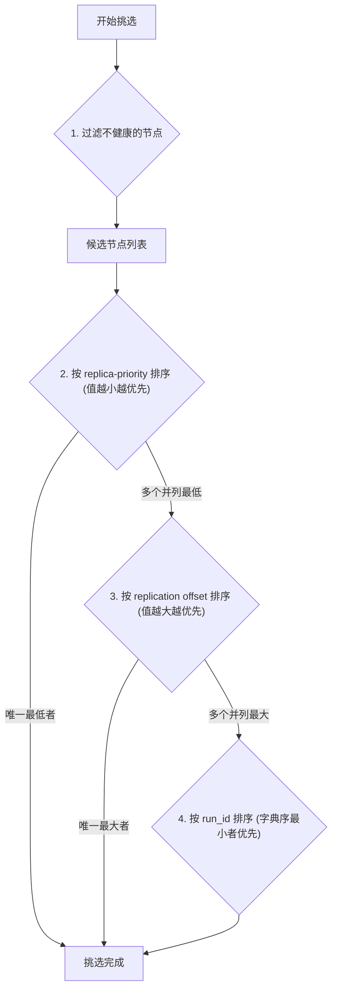

**一句话总结就是：在所有健康的从节点中，首先选择优先级最高的，如果优先级相同，则选择数据最新的，如果数据新旧程度也相同，则选择一个 ID 最小的来打破平局。**

这个策略综合考虑了运维人员的管理意图（优先级）、数据丢失的风险（偏移量）和选举的确定性（运行 ID），确保了自动故障转移过程的健壮和可靠。

---

## Redis 集群了解吗？

Redis 集群（Redis Cluster）是 Redis 官方推出的、用于解决单机 Redis 性能瓶颈的**分布式数据库方案**。

如果说主从复制和哨兵模式解决了**高可用**的问题，那么 Redis 集群则在此基础上，进一步解决了**高并发写**和**海量数据存储**的**可伸缩性（Scalability）**问题。

### 1. 为什么需要 Redis 集群？

主从/哨兵模式虽然实现了高可用，但它有两大天花板：

1.  **写的性能瓶颈**：所有的写操作都必须在唯一的 Master 节点上进行，当写请求的并发量超过这个 Master 节点的处理能力时，整个系统就会出现瓶颈。
2.  **内存容量瓶颈**：所有数据都存储在唯一的 Master 节点上，其内存容量限制了整个 Redis 系统能存储的数据总量。

Redis 集群通过**数据分片（Data Sharding）**的方式，将数据分散到多个主节点上，从而完美地解决了这两个问题。

### 2. Redis 集群的核心原理

Redis 集群的核心思想可以归结为两点：**数据分片**和**去中心化**。

#### a. 数据分片：哈希槽 (Hash Slot)

为了将数据打散到不同的节点上，Redis 集群并没有采用简单的一致性哈希，而是引入了**哈希槽**的概念。

- **槽的数量**：整个集群预设了 **16384** 个哈希槽（编号从 0 到 16383）。
- **分配规则**：每个键（key）在存入时，会根据一个公式计算出它应该属于哪个槽：
  `slot = CRC16(key) % 16384`
- **槽的归属**：集群中的**每一个主节点（Master）**都会负责管理这 16384 个槽的一部分。例如，一个 3 主节点的集群可能这样分配：
  - Node A (Master 1) 负责槽: 0 - 5500
  - Node B (Master 2) 负责槽: 5501 - 11000
  - Node C (Master 3) 负责槽: 11001 - 16383

这样，当一个写请求到来时（例如 `SET mykey "value"`），集群会先计算`mykey`的槽位，然后将这个请求精确地转发到负责该槽位的那个主节点上去执行。

**这就实现了写的横向扩展**：增加一个主节点，并为其分配一部分哈希槽，就可以分担整个系统的写压力和存储压力。

#### b. 架构：去中心化 (Decentralized)

与哨兵模式有一个独立的“裁判”集群不同，Redis 集群是一个**去中心化的、对等的（Peer-to-Peer）**架构。

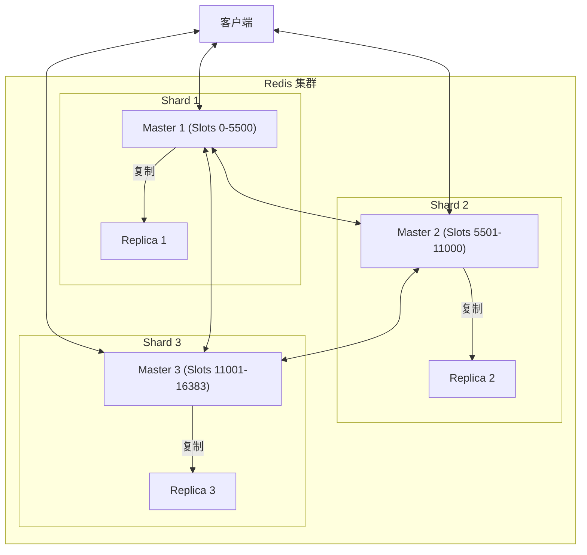

- **没有中心节点**：集群中没有一个像哨兵那样的“总指挥”。所有的节点地位都是平等的。
- **Gossip 协议**：节点之间通过一种称为**Gossip**的协议来交换信息。每个节点都会定期地、随机地向其他节点发送消息，内容包括自己负责的槽位、自己是主是备、集群的健康状态等。通过这种“闲聊”或“八卦”的方式，最终集群中所有节点都会对整个集群的状态达成一致。
- **内置高可用**：集群中的每个主节点都可以有自己的从节点（Replica）。当一个主节点宕机时，它的从节点会**自动发起选举并接替其工作**，这个过程由集群内部机制完成，无需哨兵的参与。

### 3. Redis 集群的工作机制

#### a. 客户端重定向 (MOVED)

客户端可以连接到集群中的**任意一个**节点。当客户端向一个节点发送命令时，该节点会首先计算 key 对应的槽位。

- **如果槽位正好由自己负责**：节点会直接执行命令并返回结果。
- **如果槽位不归自己负责**：节点不会执行命令，而是会向客户端返回一个 **`MOVED`** 错误。这个错误中包含了正确的槽位以及负责该槽位的节点的**IP 和端口**。
  `MOVED 12345 192.168.1.102:6379`
- **智能客户端**：一个设计良好的客户端（如 Jedis, Lettuce）在收到`MOVED`错误后，会**自动重定向**到正确的节点去执行命令。并且，它会**缓存**这份槽位与节点的映射关系。在后续的请求中，客户端会先在本地计算槽位，然后直接连接到正确的节点，从而避免了不必要的网络跳转。

#### b. 自动故障转移 (Failover)

Redis 集群内置了与哨兵类似的故障转移机制。

1.  **故障发现**：通过 Gossip 协议，集群中的节点会相互`PING`/`PONG`。如果一个节点在一定时间内没有响应，其他节点会将其标记为**PFAIL (Possible Fail)**，即“可能下线”。这类似于哨兵的主观下线。
2.  **故障确认**：如果集群中**超过半数**的主节点都将某个主节点标记为 PFAIL，那么这个主节点就会被正式标记为**FAIL**（客观下线）。
3.  **从节点选举**：当一个主节点被标记为 FAIL 后，它旗下的所有从节点会发起一轮选举（基于 Raft 算法）。偏移量最大（数据最新）的那个从节点会赢得选举。
4.  **提升与广播**：赢得选举的从节点会执行`REPLICAOF NO ONE`提升为新的主节点，接管原来主节点的哈希槽，并通过 Gossip 协议将这个变更通知给整个集群。

### 4. 优缺点总结

- **优点**：
  - **高可伸缩性**：可以方便地通过增删主节点来横向扩展系统的写能力和存储容量。
  - **高可用性**：内置了故障发现和自动转移机制，无需哨兵。
  - **去中心化**：架构简洁，没有单一的配置中心或代理层，避免了单点故障。
- **缺点**：
  - **运维复杂**：相比主从/哨兵模式，集群的配置、扩缩容等操作更复杂。
  - **多键操作受限**：这是 Redis 集群最著名的一个限制。对于`MSET`、`MGET`这类跨多个 key 的操作，或者涉及多个 key 的事务和 Lua 脚本，如果这些 key 没有被分配到**同一个哈希槽**，那么操作就会失败。
  - **解决方案 - Hash Tags**：为了支持多键操作，Redis 提供了`hash tags`功能。你可以通过在 key 中使用`{}`来强制多个 key 落入同一个槽。例如`{user1000}:name`和`{user1000}:email`，只有`{}`中的部分会被用来计算哈希槽。
  - **数据倾斜问题**：如果某些 key 成为热点，或者 hash tag 使用不当，可能会导致数据和访问压力集中在少数几个节点上，造成数据倾斜。

总而言之，Redis 集群是通过数据分片和去中心化设计，彻底解决了单机 Redis 的性能和容量瓶颈，是构建大规模、高并发 Redis 服务的官方标准方案。

---

## 请详细说一说 Redis Cluster？

### 一、 核心架构与设计哲学

Redis Cluster 的设计目标非常明确：在保持 Redis 高性能的同时，提供**水平可伸缩性（Horizontal Scalability）**和**高可用性（High Availability）**。它通过两大核心设计来实现这一目标：

#### 1. 数据分片 (Data Sharding) - 哈希槽 (Hash Slot)

这是 Redis Cluster 实现可伸缩性的基石。它并非采用传统的一致性哈希算法，而是引入了“哈希槽”模型。

- **16384 个槽位**：集群预设了固定的 16384 个哈希槽。这个数字是固定的，不会改变。
- **Key 到 Slot 的映射**：每个键（key）都通过`CRC16(key) % 16384`的算法，被唯一地、确定地映射到这 16384 个槽中的一个。
- **Slot 到节点的分配**：集群中的**每个主节点（Master）**负责管理这些槽的一部分。在集群初始化时，这些槽会被平均分配给所有的主节点。例如，一个有 3 个主节点的集群：
  - `Master A` 负责 `Slots 0 - 5500`
  - `Master B` 负责 `Slots 5501 - 11000`
  - `Master C` 负责 `Slots 11001 - 16383`
- **带来的好处**：
  - **写扩展**：写请求会被分散到不同的主节点上，打破了单点写的瓶颈。
  - **内存扩展**：数据被分散存储，使得整个集群的总内存容量可以随着节点的增加而线性增长。
  - **扩/缩容的便利**：增加或移除节点，本质上是进行槽位的重新分配（Resharding），这个过程是可以在线进行的。

#### 2. 去中心化与节点通信 - Gossip 协议

Redis Cluster 是一个**去中心化（Decentralized）**的架构，没有中心协调节点（如 ZooKeeper）或代理层（Proxy）。所有节点都是对等的。

- **节点互联**：集群中的所有节点，无论主从，都会两两之间维持一个 TCP 长连接，形成一个全连接的网络。这个网络被称为**Cluster Bus**，使用独立的端口（通常是客户端端口+10000）。
- **Gossip 协议**：节点之间通过 Gossip 协议来交换信息和维持集群状态的统一。
  - 每个节点都会定期地、随机地向其他几个节点发送`PING`消息。
  - `PING`消息中包含了发送者自身的状态信息（如负责的槽位、IP/Port、主从角色、故障状态等），以及它所知道的集群中其他节点的部分状态信息。
  - 接收到`PING`的节点会回复一个`PONG`消息，其中也包含了它自己的状态信息。
  - 通过这种不断“交换名片”和“传播八卦”的方式，经过一段时间后，集群中所有的节点都会对整个集群的拓扑和状态达成最终一致。这使得集群的元数据（槽位分布、节点状态等）信息被分散存储在每一个节点上。

### 二、 读写流程与客户端交互

客户端与集群的交互非常巧妙，它依赖于节点的重定向机制和客户端的“智能化”。

#### 1. MOVED 重定向（永久性重定向）

这是客户端定位正确节点的核心机制。

1.  客户端可以连接到集群中的**任意一个节点**发起请求，比如`SET mykey value`。
2.  接收到请求的节点会首先计算`key`的槽位：`slot = CRC16('mykey') % 16384`。
3.  节点会查询自己内部维护的槽位映射表，判断这个`slot`是否由自己负责。
    - **情况一：槽位正确**。节点直接执行命令，并将结果返回给客户端。
    - **情况二：槽位错误**。节点**不会执行命令**，而是向客户端返回一个`MOVED`错误，格式为：`MOVED <slot> <correct_node_ip>:<correct_node_port>`。
4.  一个**智能的、集群感知的客户端**（Cluster-aware client）在收到`MOVED`响应后，会做两件事：
    a. **更新本地的槽位映射缓存**：将`slot`与新的`ip:port`对应关系记录下来。
    b. **自动重定向**：将原命令重新发送到`MOVED`指令提示的正确节点上。

通过这个机制，客户端在经过几次`MOVED`重定向后，最终会缓存一份相对完整的槽位映射表，后续的请求就可以直接计算`key`的槽位，然后直接发送到正确的节点，大大提高了效率。

#### 2. ASK 重定向（临时性重定向）

这是一种在**集群进行槽位迁移（Resharding）**时发生的特殊重定向。

- **场景**：当一个槽（例如`slot 100`）正在从`Node A`迁移到`Node B`时：
  - `Node A`上的`slot 100`处于`MIGRATING`（迁出中）状态。
  - `Node B`上的`slot 100`处于`IMPORTING`（导入中）状态。
- **流程**：
  1.  客户端根据旧的映射表，向`Node A`请求一个属于`slot 100`的`key`。
  2.  `Node A`会先在自己的数据库里查找这个`key`。如果找到了，就直接执行。
  3.  如果在`Node A`没找到（可能已经被迁移走了），`Node A`会返回一个`ASK`重定向：`ASK <slot> <new_node_ip>:<new_node_port>`。
- **与 MOVED 的区别**：
  - **目的不同**：`MOVED`表示槽的归属权已经**永久改变**；`ASK`表示槽正在迁移中，这次请求**可能需要去另一个节点尝试一下**。
  - **客户端行为不同**：收到`ASK`后，客户端会先向目标节点发送一个`ASKING`命令，然后再发送实际的命令。这相当于一次“敲门”，告诉目标节点：“我是被 ASK 指令叫过来的，请处理一下这个属于你正在导入的槽的命令”。
  - **缓存影响**：`ASK`是**一次性**的，**不会更新**客户端本地的槽位映射缓存。下次再请求这个槽的`key`时，客户端依然会先去问旧的节点。而`MOVED`会更新缓存。

### 三、 高可用与故障转移

Redis Cluster 内置了强大的高可用机制，完全替代了哨兵的角色。

1.  **主从架构**：集群的每个主节点都可以配置一个或多个从节点（Replica）。它们之间进行着标准的主从复制。
2.  **故障检测**：
    - 节点间通过 Gossip 协议互发`PING`/`PONG`来检测对方是否在线。
    - 如果一个节点在`cluster-node-timeout`时间内没有响应，发送`PING`的节点会将其标记为**PFAIL (Possible FAIL)**，这是一种主观下线。
    - 节点会通过 Gossip 消息将 PFAIL 状态传播出去。当集群中**超过半数的主节点**都认为某个主节点 A 处于 PFAIL 状态时，节点 A 就会被正式标记为**FAIL**。这是一个客观下线的过程，需要多数主节点达成共识。
3.  **自动故障转移**：
    - 一旦一个主节点被标记为 FAIL，它旗下的所有从节点会延迟一小段时间后，发起**选举**。
    - 延迟是为了等待 FAIL 状态在集群中充分传播，并让数据最新的从节点有更大机会胜出。
    - 选举基于 Raft 算法，数据最新（复制偏移量最大）的从节点将赢得选举。
    - 获胜的从节点会执行`REPLICAOF NO ONE`提升为新的主节点，接管旧主的所有哈希槽，并通过 Gossip 协议将这一变更广播给整个集群。整个过程全自动完成。

### 四、 核心限制与解决方案

- **多键操作限制**：这是最主要的限制。对于`MSET`、事务、Lua 脚本等涉及多个 key 的操作，如果这些 key 通过`CRC16`计算后不落在同一个槽内，操作将被拒绝。
  - **解决方案：Hash Tags**。通过在 key 中使用`{}`来人为指定用于计算哈希的部分。例如，`{user1000}:name`和`{user1000}:profile`，计算哈希时都只使用`user1000`这部分，从而保证它们一定会落入同一个槽。
- **数据倾斜**：如果大量 key 拥有相同的 Hash Tag，或者某个 key 成为超级热点，可能会导致数据和访问压力过度集中在某个节点上，违背了分片的初衷。需要业务层面进行合理设计。

### 总结

Redis Cluster 是一个设计精巧、功能完备的分布式系统。它通过**哈希槽**实现了数据的横向扩展，通过**去中心化的 Gossip 协议**和**主从复制**实现了无单点的服务发现和高可用。虽然它对多键操作有限制，但通过**Hash Tags**提供了有效的解决方案。对于需要承载海量数据和高并发写入的场景，Redis Cluster 是官方推荐的首选方案。

---

## 集群中数据如何分区？

Redis 集群的数据分区（或称数据分片，Sharding）是其能够实现水平扩展的核心机制。它采用了一种被称为**哈希槽（Hash Slot）**的方案，而不是简单的一致性哈希。

### 1. 核心概念：哈希槽 (Hash Slot)

Redis 集群没有直接将 key 映射到具体的节点上，而是引入了一个中间层——**哈希槽**。

- **固定数量的槽**：整个 Redis 集群被预先划分成了 **16384** 个哈希槽。这个数字是固定的（2^14），从 0 到 16383。
- **槽是分区的基本单位**：数据分区的最小粒度是槽，而不是 key。一个或多个 key 会归属于同一个槽。

### 2. 分区的第一步：Key 到 Slot 的映射

当需要对一个 key 进行读写操作时，集群需要首先确定这个 key 属于哪个槽。这个映射过程是固定的、确定性的。

- **映射算法**：使用 CRC16 算法计算 key 的校验和，然后对 16384 取模。
  `slot = CRC16(key) % 16384`

- **CRC16 算法**：选择 CRC16 而不是更简单的哈希算法（如 MurmurHash），是因为 CRC16 的实现在各种语言中都非常标准且高效，并且能提供足够好的散列分布，确保 key 能被均匀地分散到不同的槽中。

- **示例**：
  - `SET name "redis"` -> `CRC16("name") % 16384` -> 假设得到 `slot 12182`
  - `SET user:1001 "Alice"` -> `CRC16("user:1001") % 16384` -> 假设得到 `slot 546`

**这个阶段解决了“数据应该去哪个槽”的问题。**

### 3. 分区的第二步：Slot 到 Node 的映射

确定了 key 所属的槽之后，集群还需要知道这个槽由哪个**主节点（Master）**负责。

- **槽的分配**：在集群初始化时，这 16384 个槽会被**平均分配**给集群中所有的主节点。

  - 例如，一个有 3 个主节点的集群，分配情况可能是：
    - **Master A** 负责槽位: `0 - 5500`
    - **Master B** 负责槽位: `5501 - 11000`
    - **Master C** 负责槽位: `11001 - 16383`

- **元数据存储**：这份“槽位-节点”的映射关系，**不是存储在某个中心节点上，而是通过 Gossip 协议分散存储在集群的每一个节点中**。每个节点都保存着一份完整的映射表。

- **流程串联**：
  1.  客户端发起命令：`SET name "redis"`
  2.  客户端或接收请求的节点计算：`CRC16("name") % 16384 = 12182`
  3.  节点查询其内部的映射表，发现`slot 12182`是由**Master C**负责。
  4.  如果当前节点就是 Master C，则直接执行命令。
  5.  如果当前节点不是 Master C，则向客户端返回一个`MOVED`重定向，告知客户端应该去 Master C 执行该命令。

**这个阶段解决了“槽应该去哪个节点处理”的问题。**

### 4. Hash Tags：对分区规则的人为干预

哈希槽方案的一个主要限制是，默认情况下，不同的 key 会被随机地分散到不同的槽，进而分散到不同的节点。这使得需要原子性执行的多键操作（如`MSET`, `SINTER`, 事务, Lua 脚本）无法进行。

为了解决这个问题，Redis 集群提供了一个**Hash Tags**机制。

- **规则**：如果一个 key 中包含了`{...}`这样的花括号，那么在计算 CRC16 时，**只使用花括号内部的子字符串**来进行计算。
- **作用**：这允许用户**强制**将一类相关的 key 映射到同一个哈希槽中。

- **示例**：

  - `MSET {user1000}:name "Alice" {user1000}:age 25`
  - 计算`{user1000}:name`的槽位时，只使用`user1000` -> `CRC16("user1000") % 16384` -> `slot_X`
  - 计算`{user1000}:age`的槽位时，也只使用`user1000` -> `CRC16("user1000") % 16384` -> `slot_X`
  - 由于都使用"user1000"来计算，所以这两个 key 必然会落在同一个哈希槽`slot_X`中，进而被分配到同一个主节点上。这样，`MSET`命令就可以成功执行了。

- **注意**：过度使用或不当使用 Hash Tags 可能会导致**数据倾斜**。如果大量的 key 都使用相同的 tag，会导致这些数据全部集中在一个节点上，违背了数据分片的初衷，造成该节点成为瓶颈。

### 5. 为什么是 16384 个槽？

官方对此的解释是出于几点考虑：

1.  **心跳消息大小**：节点间通过 Gossip 协议交换信息，心跳包中需要携带槽位信息。如果槽位太多（例如 65536），那么描述槽位信息的位图就会很大（65536/8 = 8KB），这会增加心跳消息的体积和网络开销。16384 个槽的位图大小是 16384/8 = 2KB，这是一个比较合理的折衷。
2.  **集群规模**：Redis 集群的作者不建议一个集群的规模超过 1000 个主节点。16384 个槽对于 1000 个节点的集群来说，平均每个节点管理十几个槽，这个粒度已经足够精细，可以很好地实现数据的均匀分布。
3.  **压缩效率**：当一个节点负责的槽位是连续的时，心跳包中对槽位信息的压缩效率会更高。

### 总结

Redis 集群的数据分区策略是一个两步走的过程：

1.  **Key -> Slot**：通过`CRC16(key) % 16384`将任意 key 确定性地映射到一个固定的哈希槽。
2.  **Slot -> Node**：通过集群内部维护的分布式映射表，将哈希槽分配给具体的主节点。

这个方案通过**哈希槽**作为中间层，巧妙地实现了数据的可管理、可迁移，并通过**Hash Tags**机制弥补了多键操作的限制，是整个 Redis Cluster 设计的基石。

---

## 能说说 Redis 集群的原理吗？

Redis 集群的根本原理，是采用**去中心化的、基于数据分片的架构**，通过**Gossip 协议**维护集群状态的一致性，利用**客户端重定向**机制完成请求路由，并内置了**自动故障检测与转移**功能，从而共同实现了一个高可用、高可伸缩的分布式键值数据库。

### 原理支柱一：数据分片与水平扩展 (Sharding)

这是集群实现可伸缩性的核心原理，其基石是**哈希槽 (Hash Slot)** 模型。

1.  **固定槽位分区**：集群预先设定了**16384 个**哈希槽。任何一个 key，都通过`CRC16(key) % 16384`的算法被确定性地映射到唯一一个槽上。
2.  **槽位分配到节点**：这 16384 个槽被分配给集群中所有的**主节点(Master)**。每个主节点负责一部分槽。例如，3 个主节点的集群，每个主节点大约负责 5461 个槽。
3.  **实现扩展**：
    - **写扩展**：由于数据被分散在不同的主节点上，写请求也相应地被分散到了不同的物理服务器，从而打破了单点写的性能瓶颈。
    - **内存扩展**：集群的总数据存储容量约等于所有主节点内存容量之和。
    - **在线扩/缩容**：增加或移除节点，其本质是在线地、安全地将一部分哈希槽从一个节点迁移到另一个节点（这个过程称为 Resharding），整个过程对客户端是基本透明的。

### 原理支柱二：去中心化与状态同步 (Gossip Protocol)

Redis 集群采用去中心化架构，没有“大脑”或“协调者”角色。节点间依靠**Gossip 协议**来“认识”彼此并同步整个集群的状态。

1.  **集群总线 (Cluster Bus)**：所有节点之间都会两两建立 TCP 连接，形成一个全连接的网络。这个通信网络使用一个专门的端口（客户端端口+10000），用于节点间的内部通信。
2.  **Gossip 消息**：节点通过这个总线互发 Gossip 消息，主要有两种：`PING`和`PONG`。
    - **`PING`**：一个节点会定期地、随机地选择几个其他节点发送`PING`消息。这个消息中不仅包含了**发送者自身的状态**（IP、端口、负责的槽位、主从角色、故障状态等），还包含了**它所知道的集群中其他一部分节点的状态**。
    - **`PONG`**：接收方在收到`PING`后，会回复一个`PONG`消息，其中也包含了它自己的状态信息。
3.  **状态传播与趋同**：通过这种不断地“闲聊”和“传播八卦”，一个节点的状态信息（例如一个主节点宕机了）可以在很短的时间内传遍整个集群。经过几轮通信后，所有节点对整个集群的拓扑结构、槽位分布、健康状况等元数据信息，会达到**最终一致**。这份元数据是分散存储在每一个节点上的。

### 原理支柱三：客户端路由 (Redirection)

集群的去中心化架构决定了客户端需要有一种机制来找到存储特定 key 的正确节点。这个机制就是**重定向**。

1.  **智能客户端**：与集群交互的客户端必须是“集群感知”的。它会内部维护一个**槽位 -> 节点地址**的本地映射缓存。
2.  **`MOVED` 重定向**：
    - 客户端可以向任意节点发送请求。如果该节点发现请求的 key 所属的槽不归自己管，它会拒绝执行，并返回一个`MOVED`错误，指明正确的节点地址：`MOVED <slot> <ip>:<port>`。
    - 客户端收到`MOVED`后，会更新自己的本地映射缓存，并将命令**自动重发**到正确的节点。
    - 通过这个机制，客户端可以“学习”并缓存住整个集群的拓扑结构，后续请求就可以在本地计算后直接发往正确节点，避免了不必要的网络跳转。
3.  **`ASK` 重定向**：
    - 这是一种在集群进行**槽位迁移**时的临时重定向。它告诉客户端：“这个 key 现在可能在新的节点上，你去那边**问一下（ASK）**”。
    - 它与`MOVED`的关键区别是，`ASK`是**一次性的**，**不会更新**客户端的本地映射缓存，因为槽位的归属权尚未完全转移。

### 原理支柱四：高可用与故障转移 (Failover)

Redis 集群内置了高可用机制，原理与哨兵类似，但更加整合和自动化。

1.  **主从备份**：每个主节点都可以配置一个或多个从节点，它们之间通过异步复制保持数据同步。
2.  **故障检测**：
    - **主观下线 (PFAIL)**：节点通过 Gossip 协议中的`PING/PONG`来检测邻居的存活。如果一个节点在`cluster-node-timeout`内未响应，就会被标记为`PFAIL`。
    - **客观下线 (FAIL)**：当一个主节点被**超过半数**的其他主节点标记为`PFAIL`时，这个判断就从“主观”上升为“客观”。集群达成了该节点确实已经宕机的共识。
3.  **自动选举与替换**：
    - 一旦一个主节点被确认客观下线，它旗下的从节点会发起一轮选举。
    - 选举的规则很简单：数据最新的（即复制偏移量最大的）从节点将赢得选举。
    - 获胜的从节点会立即将自己提升为新的主节点，接管旧主的所有哈希槽，并立即通过 Gossip 协议将自己的新身份广播给整个集群。
    - 整个故障转移过程是**全自动的**，无需任何外部组件（如哨兵）的干预。

### 总结

Redis 集群的原理是一个精巧的闭环系统：

- **哈希槽**负责将数据**“分出去”**，实现可伸缩性。
- **Gossip 协议**负责让所有节点**“连起来”**，同步状态，实现去中心化。
- **重定向机制**负责将客户端**“指对路”**，完成请求路由。
- **故障转移机制**负责在节点**“倒下后”**，自动找到替代者，实现高可用。

这四大原理支柱协同工作，共同构成了 Redis Cluster 强大、健壮的分布式特性。

---

## 说说 Redis 集群的动态伸缩？

Redis 集群的动态伸缩，指的是在不停止服务（或仅造成短暂、可控影响）的情况下，在线地向集群中增加或移除节点，以调整集群的处理能力和存储容量。这是 Redis 集群作为一个成熟的分布式系统所具备的关键能力。

动态伸缩的核心操作是**哈希槽的重新分片（Resharding）**，即在节点之间进行哈希槽的迁移。

下面将分别详细介绍**扩容（增加节点）**和**缩容（移除节点）**这两个过程的原理和步骤。

### 一、 扩容：向集群中增加新节点

扩容通常分为两步：**1. 将新节点加入集群** 和 **2. 为新节点分配哈希槽**。

#### 步骤 1：将新节点加入集群

假设我们有一个由 3 个主节点（M1, M2, M3）组成的集群，现在要加入一个新的主节点 M4。

1.  **启动新节点**：

    - 首先，在新的服务器上以**集群模式**启动一个 Redis 实例（M4）。此时，它是一个独立的、不包含任何数据、也未被分配任何槽的“孤儿”节点。
    - `redis-server --port 6382 --cluster-enabled yes ...`

2.  **会议（Meeting）**：
    - 使用`redis-cli --cluster add-node`命令，将新节点 M4“介绍”给集群中的任意一个现有节点（比如 M1）。
    - `redis-cli --cluster add-node <new_node_ip>:<new_node_port> <existing_node_ip>:<existing_node_port>`
    - M1 收到命令后，会与 M4 进行握手（Handshake），并通过 Gossip 协议，将 M4 的信息（“我们来了一个新伙计”）传播给集群中的所有其他节点。
    - 很快，整个集群就都知道了 M4 的存在。此时，M4 已经正式成为集群的一员，但它是一个**没有负责任何哈希槽的主节点**，因此还无法处理任何数据请求。

#### 步骤 2：为新节点分配哈希槽（Resharding）

这是扩容的核心环节。我们需要从现有的主节点（M1, M2, M3）身上，迁移一部分哈希槽给新的主节点 M4。

这个过程由`redis-cli`的集群管理工具辅助完成，但了解其底层原理非常重要：

1.  **连接与准备**：

    - 运维人员通过`redis-cli --cluster reshard`命令发起迁移。
    - 工具会询问：
      - 要迁移多少个槽？(e.g., `1000`)
      - 这些槽要迁移到哪个节点？(输入新节点 M4 的 ID)
      - 从哪些源节点迁移？(可以指定一个或多个，或选择`all`从所有主节点平均迁移)

2.  **槽位迁移的内部流程**：
    假设我们要将`slot 100`从源节点 M1 迁移到目标节点 M4。

    a. **设置迁移状态**：

    - 在**目标节点 M4**上，`redis-cli`会向其发送`CLUSTER SETSLOT 100 IMPORTING M1`命令。这告诉 M4：“请准备好，你即将要接收来自 M1 的`slot 100`”。M4 会将该槽标记为**导入中（IMPORTING）**。
    - 在**源节点 M1**上，`redis-cli`会向其发送`CLUSTER SETSLOT 100 MIGRATING M4`命令。这告诉 M1：“你要开始将`slot 100`的数据迁往 M4 了”。M1 会将该槽标记为**迁出中（MIGRATING）**。

    b. **迁移数据**：

    - `redis-cli`会向源节点 M1 发送`CLUSTER GETKEYSINSLOT 100 <count>`命令，分批次地获取属于`slot 100`的所有 key。
    - 对于获取到的每一个 key，`redis-cli`会向 M1 发送一个`MIGRATE M4 0 <timeout> KEYS key1 key2 ...`命令。
    - `MIGRATE`是一个原子性的命令，它会确保 key 从 M1 迁移到 M4 的过程中，客户端的请求会被正确处理（通常是阻塞等待迁移完成）。

    c. **处理迁移期间的请求（ASK 重定向）**：

    - 如果在迁移过程中，一个客户端向 M1 请求一个属于`slot 100`的 key：
    - 如果这个 key**还在 M1**，M1 直接处理。
    - 如果这个 key**已经被迁移到 M4**，M1 会返回一个`ASK`重定向，告诉客户端：“去 M4 问问看”。客户端会临时地去 M4 请求一次。
    - 如果客户端直接向 M4 请求（可能因为缓存错误），因为`slot 100`处于 IMPORTING 状态，M4 只会处理通过`ASKING`命令“敲门”的请求。

    d. **更新槽位归属**：

    - 当`slot 100`的所有 key 都迁移完成后，`redis-cli`会向**集群中的所有节点**（包括 M4 自己）广播一条`CLUSTER SETSLOT 100 NODE M4`命令。
    - 这条命令会清空节点上关于`slot 100`的 MIGRATING 和 IMPORTING 状态，并正式宣布：**`slot 100`现在由 M4 负责**。

3.  **循环与完成**：
    - `redis-cli`会重复上述第 2 步，直到所有计划迁移的槽都完成迁移。至此，扩容操作完成。M4 已经拥有了一部分哈希槽，并开始正常处理数据请求。

### 二、 缩容：从集群中移除节点

缩容的过程与扩容相反，本质上是**先将要下线节点的所有哈希槽迁移走，然后再将其从集群中移除**。

假设我们要下线主节点 M4。

#### 步骤 1：迁移哈希槽

1.  使用`redis-cli --cluster reshard`命令，将 M4 负责的所有哈希槽，迁移到集群中的其他主节点上（例如，平均分配给 M1, M2, M3）。
2.  这个迁移的内部原理与扩容时完全相同，只是源节点和目标节点反过来了。

#### 步骤 2：移除空节点

当 M4 身上的所有哈希槽都迁移干净后，它就变成了一个不负责任何槽的空闲主节点。此时，可以将其安全地从集群中移除。

1.  使用`redis-cli --cluster del-node`命令，将 M4 从集群中移除。
2.  `redis-cli --cluster del-node <node_to_remove_ip>:<port> <node_to_remove_id>`
3.  集群中的任意一个节点收到该命令后，会通过 Gossip 协议广播 M4“已经离开”的消息，最终所有节点都会将 M4 从自己的节点列表中移除。
4.  此时，可以安全地关闭 M4 的 Redis 进程。

### 总结

Redis 集群的动态伸缩是一个设计精良、流程严谨的过程：

- **核心是槽位迁移 (Resharding)**：无论是扩容还是缩容，关键都是在节点间移动哈希槽的所有权和数据。
- **在线进行**：整个伸缩过程是可以在线完成的，对业务的影响被控制在最小。
- **`ASK`重定向是关键**：在槽位迁移期间，`ASK`重定向机制保证了客户端的请求能够被正确路由，确保了服务的连续性。
- **工具辅助**：虽然底层命令复杂，但 Redis 提供了强大的`redis-cli`集群管理工具，使得运维人员可以相对轻松地完成这些操作。

---

## 什么是缓存击穿？

**缓存击穿（Cache Breakdown / Hotspot Invalidated）**，特指在高并发场景下，一个**热点 Key**（即被频繁访问的数据）在某一瞬间**正好过期失效**，导致大量原本应该命中缓存的请求，在同一时刻全部“穿透”了缓存层，直接打向了后端的数据库。这就像在大坝上凿开了一个小孔，瞬时的高压水流（并发请求）全部从此涌出，可能导致数据库瞬间压力过大而崩溃。

### 缓存击穿的核心特征

要构成缓存击穿，必须同时满足三个条件：

1.  **高并发访问**：有大量的请求在短时间内同时涌入。
2.  **访问热点数据**：这些请求访问的是同一个、非常热门的 Key。
3.  **缓存正好失效**：在这个精确的时刻，这个热点 Key 的缓存过期了，或者被某种策略淘汰了。

我们可以用一个时序图来清晰地展示这个过程：

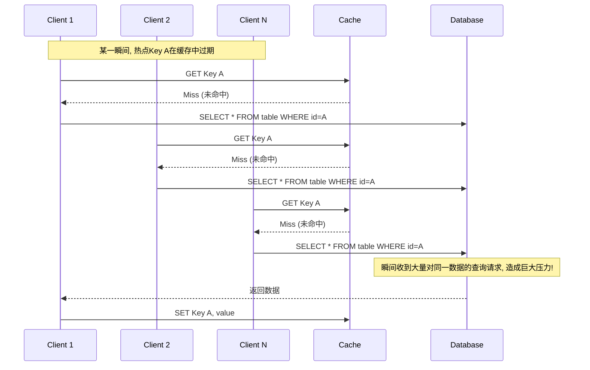

如图所示，多个客户端的请求在缓存层未命中后，形成了对数据库的“并发攻击”。

### 解决方案

针对缓存击穿问题，主要有两种主流的解决方案，它们的思路和取舍不同。

#### 方案一：互斥锁（Mutex Lock）/ 分布式锁

这是最经典、最直接的解决方案，思路是**“只让一个请求去重建缓存”**。

- **原理**：当一个请求发现缓存未命中时，它不会立刻去查询数据库，而是先尝试获取一个与该 Key 关联的**互斥锁**。

  - **获取锁成功**：这个请求获得了“重建缓存”的唯一权限。它会去查询数据库，将数据写入缓存，最后再释放锁。
  - **获取锁失败**：其他后来的请求如果获取锁失败，说明已经有“先锋”在重建缓存了。这些请求不会去冲击数据库，而是会进入一个等待状态（比如休眠一小段时间后重试），或者直接返回一个“系统繁忙”的提示。

- **流程图**：

  ```mermaid
  graph TD
      A[请求到达] --> B{查询缓存};
      B -- 命中 --> C[返回缓存数据];
      B -- 未命中 --> D{尝试获取锁};
      D -- 成功 --> E[查询数据库];
      E --> F[将数据写入缓存];
      F --> G[释放锁];
      G --> H[返回数据];
      D -- 失败 --> I[休眠后重试/或直接返回];
      I --> B;
  ```

- **优点**：
  - **强一致性**：保证了数据的强一致性，只有一个线程去更新，不会有并发问题。
  - **效果显著**：能有效防止大量请求同时冲击数据库。
- **缺点**：
  - **性能损耗**：引入了锁机制，会导致部分线程阻塞等待，降低了系统的吞吐量。
  - **实现复杂**：需要引入分布式锁（如基于 Redis 的 SETNX 或 Redisson），需要考虑锁的超时、死锁等问题。

#### 方案二：逻辑过期（Logical Expiration）

这是一种更优雅、对用户更友好的解决方案，思路是**“不让热点 Key 真正过期”**。

- **原理**：我们不再使用 Redis 自带的`EXPIRE`过期策略，而是在缓存的 Value 中，额外存储一个**逻辑上的过期时间戳**。
  - 例如，缓存的值是一个 JSON 对象：`{"data": "...", "expireAt": 1678886400}`。
- **工作流程**：

  1.  当一个请求发现缓存命中时，它会检查 Value 中的`expireAt`时间戳。
  2.  **如果未过期**：直接返回`data`部分。
  3.  **如果已逻辑过期**：
      a. 它**不会删除缓存**，而是立即**将这份旧的（stale）数据返回**给客户端，保证了用户请求的快速响应。
      b. 同时，它会尝试获取一个**轻量级的锁**，或者通过其他异步机制（如线程池、消息队列），去启动一个后台任务来**异步地重建缓存**。获取锁成功的那个线程负责去数据库拉取新数据，并更新缓存中的`data`和新的`expireAt`。

- **优点**：
  - **高可用性**：几乎没有线程阻塞，用户请求的响应时间非常快，因为大部分情况下都可以立即返回（即使是旧数据）。
  - **避免了“惊群效应”**：只有一个后台线程在工作，对数据库的保护效果非常好。
- **缺点**：
  - **数据不一致**：在缓存重建的短暂窗口期内，客户端获取到的是旧数据。这需要业务场景能够容忍这种短暂的不一致。
  - **实现更复杂**：需要改造缓存的数据结构，并引入额外的线程或组件来处理异步更新。

### 与“缓存穿透”和“缓存雪崩”的对比

为了加深理解，我们必须将缓存击穿与另外两个常见的缓存问题区分开：

| 问题名称                   | 核心成因                             | 现象描述                                     | 解决方案侧重                                |
| :------------------------- | :----------------------------------- | :------------------------------------------- | :------------------------------------------ |
| **缓存击穿 (Breakdown)**   | **单个热点 Key**在同一时刻过期       | 大量并发请求**同一个 Key**，全部打到数据库上 | **防止单个热点 Key 的并发重建**（如加锁）   |
| **缓存穿透 (Penetration)** | 请求一个**根本不存在**的 Key         | 请求在缓存和数据库中都找不到，每次都查库     | **过滤无效请求**（如布隆过滤器、缓存空值）  |
| **缓存雪崩 (Avalanche)**   | **大量不同的 Key**在同一时刻集中过期 | 大量并发请求**不同的 Key**，都打到数据库上   | **让 Key 的过期时间均匀分布**（如加随机值） |

### 总结

总而言之，**缓存击穿是针对单个热点 Key 在高并发下过期失效的问题**。它的核心解决方案是想办法**避免大量请求在同一时间点去并发地重建这个热点 Key 的缓存**。选择互斥锁方案，得到的是强一致性但牺牲了部分性能；选择逻辑过期方案，得到的是高可用性但需要接受短暂的数据不一致。在实际应用中，需要根据业务场景对一致性和性能的要求来做出权衡。

---

## 能说说布隆过滤器吗？

布隆过滤器（Bloom Filter）是一个非常巧妙且实用的数据结构，尤其在处理海量数据和性能优化方面。

**一句话概括：布隆过滤器是一个极其节省空间的、概率性的数据结构，它专门用来判断一个元素“一定不存在”或者“可能存在”于一个集合中。**

它的核心价值在于，可以用极小的内存来“摘要”一个巨大的数据集，并提供高效的成员资格查询。

### 1. 它要解决什么核心问题？

布隆过滤器最经典的应用场景，就是解决我们之前讨论过的**“缓存穿透”**问题。

- **缓存穿透回顾**：恶意用户或异常程序，不断请求一个在缓存和数据库中都**根本不存在**的数据（例如，ID 为-1 的商品）。这会导致每一次请求都绕过缓存，直接打到数据库上，造成数据库压力。
- **布隆过滤器的作用**：我们可以在缓存层之前，设置一个布隆过滤器。这个过滤器中存储了数据库中**所有合法数据**的“摘要”（比如所有商品 ID）。当一个请求进来时：
  1.  先去布隆过滤器查询这个 ID。
  2.  如果布隆过滤器判断“**一定不存在**”，则直接拒绝请求，根本不会去查缓存和数据库。
  3.  如果布隆过滤器判断“**可能存在**”，才放行请求去查询缓存。

这样，就用极小的成本过滤掉了绝大多数的恶意查询。

### 2. 它的工作原理是什么？

布隆过滤器的内部结构非常简单，主要由两部分构成：

1.  **一个很长的二进制位数组（Bit Array）**：例如，一个长度为 `m` 的数组，所有位初始都为 0。
2.  **K 个不同的哈希函数**：这些哈希函数可以将任意输入，均匀地映射到 `0` 到 `m-1` 的范围内。

#### a. 添加元素 (add)

当我们想向布隆过滤器中添加一个元素时（例如，在系统启动时，将所有合法的商品 ID 加入过滤器）：

1.  取一个元素，比如 `"apple"`。
2.  将 `"apple"` 分别输入到 `K` 个哈希函数中，得到 `K` 个不同的哈希值（即数组下标）。
3.  将位数组中，这 `K` 个下标对应的位，全部置为 `1`。

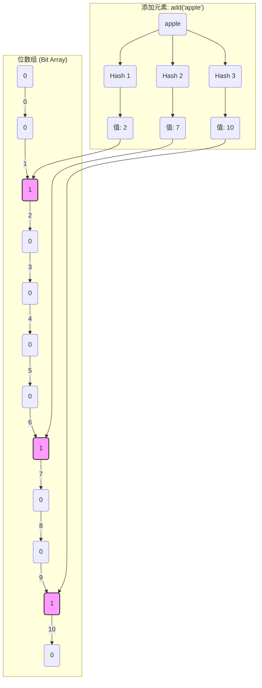

#### b. 查询元素 (might_contain)

当我们想判断一个元素是否存在时：

1.  取要查询的元素，比如 `"banana"`。
2.  将 `"banana"` 也输入到**相同的 `K` 个哈希函数**中，得到 `K` 个哈希值。
3.  检查位数组中，这 `K` 个下标对应的位。
    - **如果这 K 个位中，有任何一位是 `0`**，那么我们可以 **100% 确定**，这个元素**一定不存在**于集合中。因为如果它存在过，这些位一定都被置为 1 了。
    - **如果这 K 个位，恰好全部都是 `1`**，那么我们只能判断，这个元素**可能存在**。

### 3. 核心特性：误报率 (False Positive Rate)

这是布隆过滤器最关键的特性，也是它“概率性”的体现。

- **没有“漏报”（False Negative）**：如果一个元素确实在集合里，布隆过滤器去查询，**绝对不会**说它不存在。
- **存在“误报”（False Positive）**：如果一个元素**不在**集合里，布隆过滤器去查询，**有很小的概率**会说它存在。
  - **为什么会误报？** 因为一个元素要映射的 K 个位，可能之前已经被其他不同的元素给“恰好”全部置为 1 了。这就是哈希冲突的体现。

**误报率是可以控制的**。它主要受三个因素影响：

- 位数组大小 `m`
- 哈希函数数量 `k`
- 集合中元素的数量 `n`

在`n`固定的情况下，`m` 越大（占用空间越多），`k` 越优（通常有一个最佳值），误报率就越低。我们可以根据业务对误报率的容忍度，来计算出最优的 `m` 和 `k` 的值。

### 4. 优缺点总结

- **优点**：
  - **空间效率极高**：相比于用 HashMap 等存储原始元素，布隆过滤器不存储元素本身，只存储“摘要”信息，因此内存占用极小。
  - **时间效率极高**：插入和查询的时间复杂度都是`O(k)`，`k`通常是一个很小的常数，所以速度飞快。
  - **保密性好**：不存储原始数据，无法反推出原始元素是什么。
- **缺点**：
  - **存在误报率**：无法做到 100%精确判断。
  - **无法删除元素**：标准的布隆过滤器不支持删除操作。因为将一个位从 1 改回 0，可能会影响到其他元素。如果需要删除，需要使用其变种，如计数布隆过滤器（Counting Bloom Filter），但会占用更多空间。

### 5. 更多应用场景

除了解决缓存穿透，布隆过滤器还有很多应用：

- **网页爬虫**：判断一个 URL 是否已经被爬取过，避免重复爬取。
- **垃圾邮件过滤**：判断一个发件人地址是否在黑名单中。
- **大型分布式数据库**（如 Google Bigtable, Cassandra）：在访问磁盘前，先通过布隆过滤器快速判断一个 key 是否可能存在于某个 SSTable 文件中，避免了大量的无效磁盘 I/O。
- **推荐系统**：过滤掉那些已经给用户推荐过的物品。

总而言之，布隆过滤器是一种典型的**用“概率”和“少量内存”换取“极高性能”**的数据结构，非常适合用于海量数据场景下的“去重”和“排非”任务。

---

## 如何保证缓存和数据库的数据⼀致性？

保证缓存与数据库的数据一致性，是分布式系统中一个非常经典、也是极具挑战性的问题。这个问题没有一劳永逸的“银弹”方案，任何一种策略都是在**一致性、性能和可用性**三者之间做的权衡。

### 核心矛盾：双写操作的非原子性

问题的根源在于，一次业务操作需要同时修改两个存储介质：**缓存**和**数据库**。这两个写操作**无法被一个原子事务**包裹，因此无论谁先谁后，在中间都可能出现异常，导致数据不一致。

例如，一次更新操作：
`UPDATE users SET age = 26 WHERE id = 1;`

我们需要同时更新数据库和缓存。这就引出了一个核心的抉择：**是先更新数据库，还是先更新缓存？** 以及 **我们是更新缓存，还是删除缓存？**

### 方案一：先更新缓存，再更新数据库

这是一个**强烈不推荐**的、错误的做法。

- **流程**：`写请求 -> 更新缓存成功 -> 更新数据库`
- **问题**：
  1.  **数据库更新失败**：如果更新缓存成功，但更新数据库失败（例如数据库宕机或网络问题），那么缓存中将是**脏数据**，而数据库中是旧数据，数据将永久不一致。
  2.  **并发写问题**：
      - 线程 A 更新缓存：`age=26`
      - 线程 B 更新缓存：`age=27`
      - 线程 B 更新数据库：`age=27`
      - 线程 A 更新数据库：`age=26`
        最终，缓存中是`age=27`，而数据库中是`age=26`，数据不一致。

**结论：这个方案问题太多，直接弃用。**

### 方案二：先更新数据库，再更新缓存

这个方案比上一个略好，但依然存在问题。

- **流程**：`写请求 -> 更新数据库成功 -> 更新缓存`
- **问题**：
  1.  **缓存更新失败**：如果数据库更新成功，但更新缓存失败，数据库是新数据，缓存是旧数据，数据不一致。
  2.  **并发写问题（线程安全问题）**：
      - 线程 A 更新数据库：`age=26`
      - 线程 B 更新数据库：`age=27`
      - 线程 B 更新缓存：`age=27`
      - 线程 A 更新缓存：`age=26` (由于网络延迟等原因，后到达)
        最终，数据库中是`age=27`，而缓存中是`age=26`，数据不一致。

**结论：这个方案虽然看似直观，但在高并发下会因为写请求的顺序错乱导致不一致，也不推荐。**

### 方案三：Cache-Aside Pattern (旁路缓存模式) - 删除缓存

这是业界**最常用、最经典**的设计模式。它的核心思想是：**写操作只操作数据库，然后从缓存中删除（或使其失效）对应的 Key。读操作则在缓存未命中时，从数据库加载并写回缓存。**

#### 写操作流程 (Write)

1.  **先更新数据库**
2.  **再删除缓存**

#### 读操作流程 (Read)

1.  从缓存读取数据。
2.  如果命中，直接返回。
3.  如果未命中（Miss）：
    a. 从数据库查询数据。
    b. 将查询到的数据写入缓存。
    c. 返回数据。

#### 为什么是“删除”而不是“更新”缓存？

- **懒加载思想**：只有当数据真正被需要（即被读取）时，才去加载它。如果每次更新数据库都去更新缓存，而这个缓存 Key 可能之后很长一段时间都无人访问，那么这次更新就是一次无效的写操作，浪费了性能。这被称为**懒加载（Lazy Loading）**。
- **操作简单**：删除操作比更新操作更轻量，且通常不会失败。
- **避免复杂计算**：有时缓存的数据是经过复杂计算或关联查询得出的，更新缓存的成本很高。删除它，让下次读取时去重新计算和加载，可以把复杂的计算压力分散到读请求上。

#### Cache-Aside Pattern 的一致性问题与优化

这个模式在理论上依然存在一个极小概率的不一致场景：

1.  **线程 A**更新数据，它**更新了数据库**。
2.  **线程 B**此时来读数据，它发现**缓存是空的**（或旧的），于是去**查询数据库**，查到了线程 A 更新前的**旧值**。
3.  **线程 A**执行了**删除缓存**的操作。
4.  **线程 B**将它查到的**旧值写入了缓存**。

最终，数据库是新值，而缓存是旧值，造成了不一致。

**这种情况发生的条件极其苛刻**：必须是写操作（更新 DB+删除 Cache）的速度，比读操作（读 Cache Miss+读 DB+写 Cache）还要快，并且在写操作的两个步骤之间，恰好插入了一个读操作。这在实际中非常罕见，因为数据库的写通常比读要慢。

**因此，Cache-Aside Pattern 被认为是一种“最终一致性”的、在性能和一致性之间做出了极佳平衡的方案。对于绝大多数业务场景，它的可靠性已经足够高。**

### 方案四：追求更高一致性的方案

对于金融等对一致性要求极高的场景，上述方案可能还不够。可以采用更复杂的方案来保证更强的一致性。

#### 1. 延时双删 (先删缓存 -> 更新数据库 -> 延迟再删一次缓存)

这是对 Cache-Aside 模式的一个优化变种，旨在解决上述极小概率的不一致问题。

- **流程**：

  1.  **写请求来时，先删除缓存**。
  2.  **再更新数据库**。
  3.  **休眠一段时间**（例如几百毫秒，这个时间要大于一次读业务的平均耗时）。
  4.  **再次删除缓存**。

- **原理**：第二次删除是为了兜底。即使在步骤 1 和 2 之间，有其他读线程将旧值写入了缓存，这次延迟的删除操作也能确保这个脏数据被最终清除。

- **缺点**：引入了休眠，降低了写请求的吞吐量。延迟时间的确定也很困难。

#### 2. 订阅数据库变更日志 (Binlog)

这是目前被认为最优雅、一致性最高的方案之一，实现了业务代码与缓存维护的解耦。

- **流程**：

  1.  应用程序的写操作**只负责更新数据库**。
  2.  我们部署一个**独立的订阅服务**（例如使用 Canal、Debezium 等工具），这个服务会伪装成一个 MySQL 的从库，去**订阅数据库的 binlog（二进制日志）**。
  3.  当数据库发生任何数据变更（INSERT, UPDATE, DELETE）时，binlog 中都会有记录。
  4.  订阅服务获取到这些变更事件后，会解析它们，然后去**异步地、精确地更新或删除缓存**。

- **优点**：
  - **高可靠性**：数据库的 binlog 是可靠的，保证了变更事件不会丢失。
  - **业务解耦**：应用程序无需关心任何缓存操作，代码更简洁。
  - **最终强一致**：只要 binlog 不丢，缓存最终一定会和数据库保持一致。
- **缺点**：
  - **架构复杂**：需要引入和维护额外的中间件（如 Canal, Kafka, Flink 等），增加了系统的复杂度和运维成本。
  - **有延迟**：从数据库变更到缓存更新，中间存在一定的延迟。

### 总结

| 方案名称                     | 核心操作流程                                                | 一致性保证                   | 优点                             | 缺点                               | 推荐度               |
| :--------------------------- | :---------------------------------------------------------- | :--------------------------- | :------------------------------- | :--------------------------------- | :------------------- |
| **先更新缓存，再更新数据库** | `Update Cache -> Update DB`                                 | 差，问题多                   | 无                               | 严重的数据不一致风险               | **禁止使用**         |
| **先更新数据库，再更新缓存** | `Update DB -> Update Cache`                                 | 较差                         | 直观                             | 高并发下有线程安全问题             | **不推荐**           |
| **旁路缓存 (Cache-Aside)**   | `Update DB -> Delete Cache`                                 | **最终一致性**               | **经典、可靠、性能好、实现简单** | 极低概率下存在不一致               | **强烈推荐**         |
| **延时双删**                 | `Delete Cache -> Update DB -> Sleep -> Delete Cache`        | 相对更强的一致性             | 能解决旁路缓存的理论不一致问题   | 写吞吐量下降，延迟时间难确定       | 谨慎使用             |
| **订阅 Binlog**              | `Update DB` (业务) + `Binlog -> Update/Delete Cache` (异步) | **最终一致性**（趋近强一致） | **优雅、解耦、可靠**             | **架构复杂，有技术门槛，存在延迟** | 金融等高要求场景推荐 |

**在面试中，最标准的回答是推荐“旁路缓存模式”，并能清晰地阐述其读写流程、为什么是删除而不是更新，以及它存在的小概率不一致问题。如果能进一步提出订阅 Binlog 的方案作为更优解，则能体现出更广的技术视野和架构能力。**

---

## 如何保证本地缓存和分布式缓存的一致？

当我们为了极致的性能而引入**二级缓存（L1: 本地缓存 + L2: 分布式缓存）**架构时，保证这两层缓存之间的数据一致性就成了一个新的挑战。

问题的根源在于：**当数据发生变更时，我们更新了数据库和分布式缓存（Redis），但运行在其他服务器上的应用实例无法感知到这个变化，导致它们各自的本地缓存（如 Caffeine, Guava Cache, ConcurrentHashMap）中存储的还是旧的、脏的数据。**

要解决这个问题，核心思路是：**当一个节点上的数据发生变更并更新了分布式缓存后，必须有一种机制来通知所有其他节点，让它们也去清理自己对应的本地缓存。**

### 方案一：设置较短的过期时间（TTL）

这是一种最简单、最被动的策略。

- **原理**：为本地缓存设置一个非常短的过期时间，例如 1 秒或几百毫秒。这样，即使数据不一致，这个不一致的窗口期也被人为地限制在了一个很短的时间内。
- **优点**：
  - **实现极其简单**：只需在构建本地缓存时配置一个`expireAfterWrite`即可。
  - **无任何外部依赖**：不需要引入额外的组件。
- **缺点**：
  - **一致性保证弱**：它不是真正的实时一致，只是将不一致的风险窗口缩短了。在对一致性要求高的场景下不可接受。
  - **缓存效率低**：本地缓存的过期时间很短，意味着缓存的命中率会大大降低。请求会频繁地穿透本地缓存去访问 Redis，削弱了本地缓存的性能优势。

**结论：这是一种“偷懒”的方案，只适用于对一致性要求极低，且能容忍本地缓存命中率不高的场景。**

### 方案二：利用消息队列（MQ）进行异步通知

这是目前业界最常用、最可靠的解决方案。

- **原理**：将缓存的变更操作，抽象成一个“消息”，通过消息队列（如 Kafka, RocketMQ, RabbitMQ）广播给所有订阅了该消息的应用实例。

- **详细流程**：

  1.  **写请求到达**：应用实例 A 接收到一个写请求（例如，更新商品价格）。
  2.  **执行写操作**：实例 A 执行标准的“旁路缓存”模式：
      a. 更新数据库。
      b. 删除分布式缓存（Redis）中的对应 Key。
  3.  **发送失效消息**：在删除 Redis 缓存后，实例 A 向一个特定的 MQ 主题（Topic，例如`cache.invalidate.topic`）发送一条消息。消息内容通常是需要被失效的缓存 Key 的名称，例如 `{"key": "product:1001"}`。
  4.  **所有实例订阅与消费**：集群中**所有的应用实例**（包括 A、B、C...）都订阅了这个主题。
  5.  **清理本地缓存**：当每个实例接收到这条消息后，它们会解析出 Key 的名称，然后在**各自的本地缓存**中执行删除操作。

- **流程图**：

  ```mermaid
  sequenceDiagram
      participant Client
      participant App A
      participant DB
      participant Redis
      participant MQ
      participant App B

      Client->>App A: 写请求 (更新product:1001)
      App A->>DB: UPDATE ...
      App A->>Redis: DEL product:1001
      App A->>MQ: PUBLISH "product:1001" 到Topic

      MQ-->>App A: 消费消息
      App A->>App A: 清理本地缓存[product:1001]

      MQ-->>App B: 消费消息
      App B->>App B: 清理本地缓存[product:1001]
  ```

- **优点**：
  - **高可靠性**：专业的 MQ 提供了消息持久化和可靠投递的保证，确保失效通知不会丢失。
  - **实时性高**：消息的传递通常是毫秒级的，可以实现准实时的最终一致性。
  - **业务解耦**：缓存管理逻辑与业务逻辑分离，应用实例之间无需直接通信。
- **缺点**：
  - **架构复杂化**：需要引入并维护一个外部的 MQ 组件，增加了系统的复杂度和运维成本。

### 方案三：使用 Redis 的发布/订阅（Pub/Sub）功能

这可以看作是方案二的一个轻量级实现，它利用 Redis 自身提供的 Pub/Sub 功能来代替重量级的 MQ。

- **原理**：与方案二完全相同，只是将消息的发布和订阅方从专业的 MQ 换成了 Redis。
- **流程**：

  1.  实例 A 更新 DB，删除 Redis 缓存。
  2.  实例 A 使用`PUBLISH`命令向一个指定的 Channel（例如`cache-invalidation-channel`）发布要失效的 Key。
  3.  所有实例都使用`SUBSCRIBE`命令订阅这个 Channel。
  4.  所有实例收到消息后，在本地缓存中删除对应的 Key。

- **优点**：
  - **实现简单**：无需引入新的外部组件，如果系统中已经在使用 Redis，这个方案的成本很低。
- **缺点**：
  - **可靠性问题**：这是此方案最大的短板。Redis 的 Pub/Sub 是“**发后即忘（fire and forget）**”的。如果一个订阅者在发布消息的瞬间恰好断线或重启，它将**永久地丢失**这条消息，导致其本地缓存无法被清理，数据不一致。它没有 MQ 那样的重试或持久化机制。
  - **对 Redis 连接的占用**：`SUBSCRIBE`命令是阻塞的，需要为每个应用实例单独启动一个线程来专门处理订阅，这会额外占用一个 Redis 连接。

**结论：此方案适用于对一致性要求不是特别严苛，且希望尽量简化架构的场景。**

### 总结与方案对比

| 方案名称             | 核心原理                             | 可靠性 | 实时性 | 复杂度 | 适用场景                                     |
| :------------------- | :----------------------------------- | :----- | :----- | :----- | :------------------------------------------- |
| **短过期时间 (TTL)** | 被动等待本地缓存自动过期             | 低     | 差     | 极低   | 对一致性要求极低，能容忍缓存命中率低。       |
| **消息队列 (MQ)**    | 通过专业 MQ 广播失效消息             | **高** | **高** | 高     | **生产环境推荐**，尤其对一致性要求高的场景。 |
| **Redis Pub/Sub**    | 通过 Redis 自身 Pub/Sub 广播失效消息 | 中     | 高     | 低     | 中小型项目，或对可靠性要求不高的场景。       |

**在面试中，能够清晰地阐述这三种方案，并重点分析消息队列方案的流程和优缺点，同时指出 Redis Pub/Sub 方案在可靠性上的关键缺陷，将充分展示您在分布式系统设计方面的深度和广度。最终的选择，总是围绕着业务对一致性、成本和复杂度的综合考量。**

---

## 什么是热 Key？

**热 Key（Hot Key），也称为热点 Key，指的是在短时间内被高并发、集中访问的某个特定的 Key。** 这个 Key 可能是 Redis 中的一个键，也可能是数据库中的某一行数据。

当一个 Key 成为热 Key 时，它会承载远超其他普通 Key 的访问压力。如果系统没有对热 Key 进行特殊处理，这种瞬时、巨大的流量可能会导致一系列问题，甚至引发服务雪崩。

### 热 Key 问题的成因与识别

#### 1. 成因

热 Key 的产生通常源于业务逻辑中的某些突发事件或集中的用户行为：

- **突发的热点事件**：
  - **新闻事件**：某个明星的突发新闻，其相关信息（如人物介绍、相关文章）的 Key 会成为热 Key。
  - **社交媒体热榜**：微博热搜、知乎热榜上的第一名，其对应的 ID 或内容 Key 会成为热 Key。
- **爆款商品或秒杀活动**：
  - 电商平台上的某个爆款商品，其商品详情页的 Key 会被大量用户同时访问。
  - 在秒杀活动开始的瞬间，该秒杀商品的库存 Key 会被海量请求并发读写。
- **流量集中的大 V 或网红**：
  - 一个拥有千万粉丝的网红发布了一条动态，其用户信息 Key、动态内容 Key 会被其粉丝集中访问。
- **不合理的系统设计**：
  - 将一些基础配置或常用数据用一个固定的 Key 存储，导致所有请求都访问这个 Key。

#### 2. 如何识别热 Key？

要解决热 Key 问题，首先得能发现它们。识别热 Key 的方法主要有两类：

- **预估与预判**：

  - **业务驱动**：根据即将进行的运营活动（如秒杀、双十一大促）、热门事件等，提前预估哪些 Key 可能会成为热点，并提前进行缓存预热和保护。
  - **经验判断**：根据历史数据和业务经验，判断出系统中的哪些数据类型或 ID 段天生就容易成为热点。

- **实时监控与统计**：
  - **客户端统计**：在应用的客户端（例如 Java 应用中的 Redis 客户端库）层面进行 Key 的访问统计，并将访问频率高的 Key 上报到中心系统。
  - **代理层统计**：如果使用了像 Twemproxy 或 Codis 这样的 Redis 代理，可以在代理层进行流量统计和分析。
  - **服务端分析（Redis 自带）**：
    - **`MONITOR` 命令**：可以实时地抓取 Redis 服务器接收到的所有命令。通过分析这些命令流，可以统计出各个 Key 的访问频率。**注意：`MONITOR`命令对性能影响很大，严禁在生产环境长时间使用，只适合短时间的采样和调试。**
    - **`HOTKEYS` 特性（Redis 4.0+）**：Redis 4.0 版本后，在`redis-cli`中提供了一个`--hotkeys`选项。它会基于`OBJECT FREQ`命令，在客户端进行一个不干扰服务端的、近似的、准实时的热点 Key 探测。这是一个非常实用的工具。
  - **开源解决方案**：一些公司开源了热点 Key 探测的解决方案，例如美团的`Nimble`，它们通常通过对 Redis 协议进行抓包分析来实现。

### 热 Key 带来的问题

如果不对热 Key 进行处理，它就像一个流量放大器，将压力集中在单一的点上，可能导致：

1.  **缓存层瓶颈**：

    - **带宽打满**：大量的请求访问同一个 Key，可能导致 Redis 服务器的网卡带宽被打满。
    - **CPU 瓶颈**：如果热 Key 的数据结构比较复杂（如大的 Hash 或 ZSet），频繁的访问和操作会消耗大量的 CPU 资源。
    - 在 Redis Cluster 中，由于一个 Key 只能落在一个固定的节点上，热 Key 会导致**数据和访问倾斜**，该节点会成为整个集群的性能瓶颈，而其他节点却很空闲。

2.  **缓存击穿**：
    - 这是热 Key 最直接、最危险的问题。一旦这个热点 Key 在缓存中过期，海量的并发请求会瞬间穿透缓存，直接打向后端的数据库，极有可能导致数据库崩溃，进而引发整个系统的雪崩。

### 热 Key 问题的解决方案

解决热 Key 问题的核心思路是：**将集中在单一 Key 上的巨大压力，进行分散和卸载。**

#### 1. 服务端缓存（本地缓存）

这是最直接、最高效的解决方案。

- **原理**：在应用的**服务端实例内部**，使用本地缓存（如 Java 的 Caffeine、Guava Cache，或 Go 的 sync.Map）来缓存热点 Key 的数据。
- **流程**：当一个请求需要访问热 Key 时，它会先查询本地缓存。由于本地缓存是内存访问，没有任何网络开销，其 QPS 可以达到数十万甚至上百万，远高于 Redis。
- **效果**：绝大多数对热 Key 的读请求都会在本地缓存层被拦截和消化，只有在本地缓存未命中时，才需要去访问 Redis。这极大地减轻了 Redis 的压力。
- **挑战**：需要解决本地缓存与分布式缓存的数据一致性问题（我们上一个问题讨论过，通常使用 MQ 或 Redis Pub/Sub 来广播失效消息）。

#### 2. Key 的拆分与打散

如果热 Key 的 Value 本身不是一个原子性的数据（例如一个包含很多字段的 Hash，或者一个很长的 List），可以将其拆分。

- **原理**：将一个大的热点 Key，拆分成多个小的 Key，并将它们分散存储。
- **示例**：一个热门商品的详情页，其 Key 是`product:1001`，Value 是一个大的 JSON。我们可以将其拆分为：
  - `product:1001:base` (基础信息)
  - `product:1001:desc` (描述信息)
  - `product:1001:images` (图片列表)
  - `product:1001:specs` (规格参数)
  - 前端或应用层在请求时，可以并行地获取这些小 Key，然后在本地组装。这样，访问压力就被分散到了多个 Key 上。

#### 3. 读写分离架构下的副本扩展

如果使用的是主从复制架构，可以通过增加从节点（Replica）来分摊读压力。

- **原理**：将对热 Key 的读请求，通过负载均衡策略（如轮询、随机），均匀地分发到多个从节点上。
- **效果**：虽然 Key 还是同一个，但处理请求的物理节点变多了，从而分摊了单个 Redis 实例的压力。
- **局限**：只对读请求有效，写请求依然集中在主节点。

#### 4. 针对缓存击穿的特殊保护

除了上述分散压力的方案，还必须配合针对缓存击穿的保护措施：

- **逻辑过期**：不给热 Key 设置物理过期时间，而是在 Value 中存储一个逻辑过期时间。当发现逻辑过期后，不删除缓存，而是立即返回旧数据，并异步启动一个线程去更新缓存。这是应对热 Key 击穿的最佳实践之一。
- **互斥锁**：在发现缓存失效时，通过分布式锁确保只有一个线程去回源数据库，其他线程等待。

### 总结

热 Key 问题是高并发系统中的一个典型挑战。它的解决思路是一个组合拳：

1.  **发现**：通过预估和实时监控来识别热点。
2.  **卸载**：通过**本地缓存**将绝大部分读请求直接消化掉。
3.  **分散**：通过**拆分 Key**或**增加副本**来将压力分散到多个 Key 或多个节点。
4.  **保护**：通过**逻辑过期**或**互斥锁**来防止缓存击穿的发生。

在实际应用中，通常会结合使用这些策略，构建一个多层次的、纵深的防御体系来应对热 Key 问题。

---

## 怎么处理热 Key 呢？

处理热 Key 问题，不是依靠单一的技术，而是一套系统的、多层次的组合策略。其核心思想可以概括为：**“识别、分散、卸载、保护”**。

我可以将解决方案，从**事前、事中、事后**三个维度来进行详细阐述，这样更有条理。

### 一、 事前：预测与预防

在热 Key 问题发生之前，主动进行预测和准备，是成本最低、效果最好的方式。

#### 1. 业务预估与缓存预热

- **操作**：根据即将到来的运营活动（如秒杀、新品发布、热门话题），或者通过历史数据分析，**提前识别**出哪些 Key 极有可能成为热点。
- **措施**：在活动开始前，通过一个后台任务，主动将这些可预见的热点 Key 的数据加载到缓存中（包括分布式缓存和各实例的本地缓存），并可以设置一个较长的、甚至永不过期的策略（配合逻辑过期使用）。这个过程称为**缓存预热（Cache Warm-up）**。
- **目的**：避免在流量洪峰到来的第一秒，缓存是空的，导致所有请求都打向数据库。

#### 2. 合理的 Key 设计与拆分

- **操作**：在系统设计阶段，就避免使用过于集中的、固定的 Key。对于那些可能成为热点的、结构化的数据，应该进行**垂直拆分**。
- **示例**：一个热门商品对象`product:1001`，不要将其所有信息（基础属性、描述、图片、规格）序列化成一个巨大的 JSON 存入单个 Key。而应该拆分成：
  - `product:1001:base`
  - `product:1001:spec`
  - `product:1001:images`
  - 应用层在需要时，可以并行或按需获取这些部分数据。
- **目的**：将对单个大 Key 的访问压力，天然地分散到多个小 Key 上。

### 二、 事中：实时处理与压力分摊

当热 Key 已经产生并带来巨大流量时，我们需要有实时的应对策略来分摊和消化压力。

#### 1. 服务端本地缓存（多级缓存）

这是**应对热 Key 问题的核心武器**，效果最显著。

- **架构**：在标准的“客户端 -> Redis”架构之间，加入一层应用服务端的本地缓存（L1 Cache）。可以使用如 Caffeine, Guava Cache 等高性能的本地缓存库。
- **流程**：
  1.  请求到达应用服务器。
  2.  **先查询本地缓存**。如果命中，直接返回。本地缓存是纯内存操作，无网络开销，QPS 极高（可达百万级），能轻松应对极高的并发读。
  3.  如果本地缓存未命中，再查询分布式缓存（Redis）。
  4.  如果 Redis 命中，将数据写回本地缓存，然后返回。
  5.  如果 Redis 也未命中，则回源数据库，查到数据后，依次写入 Redis 和本地缓存，再返回。
- **目的**：用每个应用实例自己的内存，来**“扛住”和“消化”**绝大部分对热 Key 的读请求，从根本上保护了后端的 Redis。
- **关键**：必须配合一套**缓存一致性方案**（如 MQ 消息、Redis Pub/Sub）来广播失效通知，确保在一个节点更新数据后，其他节点的本地缓存也能被及时清理。

#### 2. 增加副本与读写分离

- **操作**：在 Redis 主从架构中，当监控到读热点时，可以临时增加更多的从节点（Replica）。
- **措施**：在应用层或代理层，配合负载均衡策略（如轮询），将对热 Key 的读请求**分发到多个从节点**上。
- **目的**：将读压力从单个 Redis 实例，分散到多个物理节点上，提升整个缓存层的读吞吐能力。

#### 3. 针对缓存击穿的保护机制

当热 Key 恰好过期时，必须有机制防止流量穿透到数据库。

- **互斥锁/分布式锁**：

  - **原理**：发现缓存未命中时，通过分布式锁（如 Redisson）确保只有一个线程能去回源数据库并重建缓存。其他线程则等待或快速失败。
  - **优点**：强一致性，实现简单直观。
  - **缺点**：引入锁会降低吞吐量，存在死锁风险。

- **逻辑过期（永不过期 + 异步续期）**：
  - **原理**：不给热 Key 设置物理 TTL。在缓存的 Value 中封装一个逻辑过期时间。当请求发现数据已逻辑过期时：
    a. **立即返回旧数据**，保证用户请求的可用性。
    b. **异步地**派一个线程去重建缓存，更新数据和新的逻辑过期时间。
  - **优点**：高可用，几乎无阻塞，用户体验好。
  - **缺点**：存在短暂的数据不一致窗口，实现相对复杂。

**在热 Key 场景下，逻辑过期通常是比互斥锁更优的选择，因为它避免了大量线程的阻塞等待。**

### 三、 事后：监控与复盘

热 Key 的处理也需要一个闭环。

#### 1. 实时监控与报警

- **操作**：建立一套完善的监控系统，能够实时地探测热 Key 的产生。可以使用`redis-cli --hotkeys`，或开源的热 Key 发现系统（如美团 Nimble），或在代理层（如 Codis）进行统计。
- **措施**：一旦发现某个 Key 的访问量在短时间内激增并超过阈值，立即触发报警，通知运维和开发人员，并可以联动一些自动化处理脚本（如自动将其加入本地缓存的白名单）。

#### 2. 复盘与优化

- **操作**：对于每次出现的热 Key 问题，都需要进行事后复盘。
- **分析**：这个热 Key 为什么会产生？是业务逻辑问题还是突发事件？当前的解决方案是否有效？是否可以优化 Key 的设计或缓存策略来避免下次再出现？

---

## 怎么处理大 Key 呢？

**大 Key，通常指的是其 Value 占用的存储空间过大的 Key。** 这个“大”没有一个绝对的标准，通常根据业务场景和运维经验来判断，例如：

- 一个 String 类型的 Value，大小超过 10KB。
- 一个 Hash, List, Set 或 ZSet 类型的 Value，其成员（元素）数量过多（例如超过 5000 个），或者成员的总大小过大。

处理大 Key 问题的核心思路与热 Key 类似，也是**“识别、拆分、清理、预防”**。

### 一、 大 Key 带来的危害

大 Key 的存在，就像系统中的“定时炸弹”，平时可能相安无日志，但在某些特定操作下会引发严重问题：

1.  **性能下降与阻塞**：

    - **网络阻塞**：一次性读取或写入一个巨大的 Value，会占用大量的网络带宽，降低 Redis 实例的 QPS，并可能导致网络延迟增加，影响其他业务的正常请求。
    - **命令阻塞**：对大 Key 进行某些操作（如`HGETALL`, `LRANGE`全量获取, `DEL`删除）时，Redis 需要遍历或分配大量内存，这个过程是单线程的，可能会阻塞主线程长达数秒，导致其他所有客户端请求被延迟处理，引发“雪崩”效应。
    - **CPU 消耗**：对大 Key 进行序列化/反序列化会消耗更多的 CPU 资源。

2.  **内存分配不均与驱逐风险**：

    - 在 Redis Cluster 中，大 Key 会导致**数据倾斜**，某个节点的内存使用率会远高于其他节点，成为存储瓶颈。
    - 当 Redis 内存达到上限需要进行数据驱逐（Eviction）时，删除一个大 Key 可能会导致可用内存瞬间大幅增加，但这个删除操作本身可能就是一次阻塞。如果驱逐策略不够优化，可能还会引发连锁反应。

3.  **主从复制与恢复问题**：
    - **复制延迟**：在主从复制中，如果主节点上出现一个大 Key 的写操作，这个操作的同步可能会导致主从之间产生较大的延迟。
    - **AOF/RDB 风险**：`BGSAVE`时，`fork`一个拥有大 Key 的父进程会消耗更多内存和时间。AOF 重写时，处理一个大 Key 也可能导致缓冲区溢出。

### 二、 如何识别大 Key？

在处理之前，必须先找到它们。

1.  **`redis-cli --bigkeys`**：

    - 这是 Redis 官方客户端提供的一个非常实用的工具。它会以非阻塞的方式，使用`SCAN`命令对整个数据库进行采样扫描，然后找出每种数据类型中“最大”的那个 Key（按元素数量或字节大小）。
    - **优点**：方便快捷，对线上服务影响小。
    - **缺点**：它只给出每种类型最大的那个，无法找出所有的大 Key。

2.  **`MEMORY USAGE key` 命令**：

    - 可以精确地计算出某个 Key 在内存中的占用空间（字节数）。可以结合业务代码或脚本，对可疑的 Key 进行检查。

3.  **自定义扫描脚本**：

    - 可以编写脚本（如 Python、Lua），利用`SCAN`命令遍历所有 Key，然后根据 Key 的类型，使用`STRLEN`, `LLEN`, `HLEN`, `SCARD`, `ZCARD`等命令来判断其大小。对于 String 类型，`STRLEN`是最佳选择；对于集合类型，需要注意，成员数量多不一定代表占用空间大，反之亦然。需要综合判断。

4.  **开源监控工具**：
    - 一些第三方的 Redis 监控平台或开源工具（如 aze's redis-rdb-tools）可以离线分析 RDB 文件，从而找出所有的大 Key 及其详细信息，这种方式最彻底且对线上服务无任何影响。

### 三、 如何处理和优化大 Key？

处理大 Key 的核心思想就是**“拆”**。

#### 1. 拆分 (Splitting)

这是解决大 Key 问题的**根本方法**。将一个大的集合类型，拆分成多个小的 Key。

- **针对大的 Hash**：

  - **原始模型**：`hset user:1001 field1 v1 field2 v2 ... field5000 v5000`
  - **拆分方案**：可以将一个大 Hash，按照字段进行分组，拆分成多个小 Hash。例如，按 100 个字段一组进行拆分。
    `user:1001:group1` (包含 field1-100)
    `user:1001:group2` (包含 field101-200)
    ...
    在业务代码中，通过`HMGET`或`MGET`（如果拆成了 String）来获取所需数据。

- **针对大的 List/Set/ZSet**：
  - **原始模型**：一个用户的粉丝列表 `followers:user:1001`，可能有数百万个粉丝 ID。
  - **拆分方案**：可以进行“分段存储”。
    `followers:user:1001:0` (存储第 1-5000 个粉丝)
    `followers:user:1001:1` (存储第 5001-10000 个粉丝)
    ...
    在业务代码中，通过轮询或计算来确定要操作哪个 Key，并通过`MGET`或`Pipeline`来批量获取多个分段的数据。

#### 2. 命令优化与替代

在无法立即进行数据结构改造的情况下，可以通过优化命令的使用来规避风险。

- **禁止使用`HGETALL`**：对于大 Hash，绝不使用`HGETALL`。应使用`HSCAN`来进行分批次的、非阻塞的遍历。
- **禁止一次性获取全量集合**：对于大的 List/Set/ZSet，不要使用`LRANGE 0 -1`, `SMEMBERS`, `ZRANGE 0 -1`。应使用`LSCAN`, `SSCAN`, `ZSCAN`来进行迭代，或者使用`LRANGE`进行分页获取。
- **使用非阻塞删除**：对于确定要删除的大 Key，不要直接使用`DEL`。应使用**`UNLINK`**命令（Redis 4.0+）。`UNLINK`只会立即在 keyspace 中将 Key 删除（一个快速的指针操作），而将真正的内存回收操作交给一个后台线程异步执行，从而避免了阻塞主线程。

#### 3. 异步清理

对于已经存在的大 Key，如果需要清理，可以编写一个后台任务，使用`SCAN` + `UNLINK`的方式，逐步、安全地进行删除。

### 四、 如何预防大 Key？

防患于未然总是最好的策略。

1.  **代码规范与审查**：在开发阶段，就应该建立明确的代码规范，对写入 Redis 的数据大小和集合元素的数量进行限制和预警。在代码审查（Code Review）时，要特别关注可能产生大 Key 的业务逻辑。
2.  **设置合理的过期时间**：为所有 Key（尤其是那些可能动态增长的 Key）设置合理的过期时间，防止数据无限增长，成为“沉睡”的大 Key。
3.  **定期监控与巡检**：将大 Key 的监控纳入常规的运维体系中，定期使用工具扫描和分析，及时发现并处理潜在的大 Key 问题。

### 总结

处理大 Key 问题，是一个集**开发规范、运维监控和数据结构优化**于一体的系统性工作。

- **核心思想**：将一个集中的大对象，**拆分**成多个离散的小对象。
- **紧急预案**：通过优化命令（如使用`SCAN`系列和`UNLINK`）来避免直接操作大 Key 引发的阻塞。
- **长效机制**：建立从开发到运维的全流程预防和监控体系。

---

## 缓存预热怎么做呢？

缓存预热（Cache Warm-up）是一个主动的数据加载过程，旨在系统启动或流量洪峰到来之前，提前将可预见的热点数据加载到缓存中。这样做可以极大地提升系统在初始阶段的性能，并有效防止因“冷启动”而导致的缓存穿透问题。

缓存预热的核心思路是：**在用户请求到达之前，由一个后台任务或脚本，模拟用户的读取行为，主动从数据源（如数据库）获取数据，并将其写入缓存。**

### 1. 为什么需要缓存预热？

在一个没有预热的系统中，当服务刚刚启动或发布上线时，缓存（无论是 Redis 还是本地缓存）是空的。此时如果流量突然涌入，将会发生以下情况：

- **大量的缓存未命中（Cache Miss）**：所有请求都会穿透缓存层，直接打到后端的数据库上。
- **数据库压力剧增**：数据库在短时间内需要处理远超其常规负载的查询请求，可能导致响应变慢、CPU 飙升，甚至宕机。
- **用户体验差**：用户在系统启动初期的请求响应时间会非常长。
- **雪崩风险**：如果系统依赖多个下游服务，数据库的崩溃可能会引发一系列的连锁反应，导致整个系统雪崩。

**缓存预热正是为了解决这种“冷启动”问题，通过提前填充缓存，让系统在“起跑”时就处于一个“热”状态。**

### 2. 预热哪些数据？(数据源的确定)

不是所有数据都需要预热，盲目地全量预热既不现实也无必要。我们需要精确地识别出那些**即将被大量访问的热点数据**。数据源的确定通常有以下几种方式：

1.  **基于业务逻辑的静态配置**：

    - **描述**：对于一些业务上非常明确、相对固定的热点数据，可以直接在配置文件或代码中硬编码。
    - **示例**：
      - 首页的配置信息、商品分类目录。
      - 权限系统中的角色与权限对应关系。
      - 一些基础数据字典。

2.  **基于运营活动的预估**：

    - **描述**：根据即将进行的市场推广、秒杀、热门推荐等活动，提前预估出会被集中访问的数据。
    - **示例**：
      - “双十一”活动开始前，预热所有参与活动的商品详情、库存信息。
      - 某个明星即将官宣新闻，提前预热其个人资料、相关作品的 Key。

3.  **基于历史访问日志的统计分析**：
    - **描述**：这是最常用、最智能的方式。通过分析和统计上一周期（例如过去一天或一小时）的系统访问日志或缓存访问日志，找出访问频率最高（Top N）的那些 Key。
    - **工具**：可以使用 ELK（Elasticsearch, Logstash, Kibana）日志分析平台，或者离线计算任务（如 MapReduce, Spark）来完成这个统计工作。

### 3. 如何实现缓存预热？

缓存预热的实现通常是一个后台的、自动化的任务。主要有以下几种实现方式：

#### 方式一：编写预热脚本

这是最直接、最简单的方式。

- **流程**：
  1.  编写一个独立的脚本（如 Shell, Python, Java 应用）。
  2.  脚本启动后，首先从上述的数据源（配置文件、数据库、日志分析结果）获取需要预热的 Key 列表。
  3.  遍历这个 Key 列表。对于每一个 Key：
      a. 调用与线上业务相同的逻辑，去数据库或其他数据源查询对应的数据。
      b. 将查询到的数据写入到缓存（Redis）中。
- **触发时机**：
  - **项目启动时**：可以将脚本的执行，作为应用发布流程的一个环节。应用启动后，立即执行预热脚本。
  - **定时执行**：通过定时任务（如 Cron Job）在每天的低峰期（如凌晨）执行，以更新和补充热点数据。

#### 方式二：利用 Canal 等工具订阅 Binlog

这是一种更高级、更实时的预热（或称“近实时同步”）方式。

- **原理**：通过 Canal 等工具订阅 MySQL 的 binlog，可以捕获到数据库的所有数据变更。我们可以利用这个机制来反向填充缓存。
- **流程**：
  - 当一个热点数据（例如，一个商品的价格）在数据库中被修改时，Canal 会捕获到这个变更。
  - 一个后台服务消费这个变更消息，并主动去更新 Redis 中的缓存。
  - **这种方式不仅可以用于预热，更是一种保持缓存与数据库一致性的强大机制。**

#### 方式三：在系统启动时自动加载

- **原理**：利用一些框架提供的启动加载机制，如 Spring 的`ApplicationListener`或`@PostConstruct`注解。
- **流程**：
  1.  在 Spring 应用启动完成后，触发一个事件监听器或初始化方法。
  2.  在这个方法内部，编写预热逻辑，从数据库加载热点数据并写入缓存。
- **优点**：与应用生命周期绑定，自动化程度高。
- **缺点**：会**拖慢应用的启动速度**。如果预热的数据量很大，可能会导致应用启动时间过长。

### 预热过程中的注意事项

- **避免并发冲突**：如果预热任务与正常的业务请求同时发生，需要考虑并发写入缓存可能带来的问题。可以采用一些锁机制或原子操作来保证数据写入的正确性。
- **数据量控制**：预热的数据量不宜过大，否则会给数据库和缓存服务器带来瞬时压力。需要分批、适度地进行。
- **分布式部署**：如果应用是分布式部署的，预热任务也应该是分布式的，或者由一个中心化的任务调度平台来统一管理，避免多个实例重复预热相同的数据。
- **本地缓存预热**：如果系统使用了二级缓存（Redis + 本地缓存），在预热 Redis 的同时，也可以考虑通过广播消息的方式，触发所有应用实例去预热它们各自的本地缓存。

### 总结

缓存预热是一种**主动防御**的缓存策略，它通过**提前加载可预见的热点数据**来解决系统的冷启动问题。

- **做什么**：将热点数据提前写入缓存。
- **怎么做**：通过**脚本定时执行**或在**项目启动时加载**。
- **数据来源**：通过**静态配置**、**运营预估**或**日志分析**来确定。

一个设计良好的缓存预热机制，是保障高并发系统稳定性和高性能的重要一环。

---

## 无底洞问题听说过吗？如何解决？

“无底洞问题”是我非常熟悉的一个概念，它描述了在分布式缓存架构中，因不恰当的扩容方式而导致系统性能不升反降的一种经典现象。

**简单来说，无底洞问题指的是：在采用了水平分片（Sharding）的缓存集群中，无论如何增加缓存服务器（节点）的数量，缓存的命中率不仅没有提升，反而可能下降，从而导致整个系统的性能瓶 apu 反常地变差。**

这就像往一个无底洞里投入资源，却得不到任何回报，甚至情况变得更糟。

### 一、 无底洞问题是如何产生的？

这个问题的根源在于**缓存分片算法**与**集群扩容**之间的冲突。

让我们以一个常见的、**错误的**缓存架构为例来说明：

- **架构**：一个由 `N` 台 Redis 服务器组成的缓存集群。
- **分片算法**：采用简单的**取模哈希算法**来决定一个 key 应该存储在哪台服务器上。
  `server_index = hash(key) % N` (N 是服务器的数量)

**现在，我们来分析扩容时会发生什么：**

1.  **初始状态**：假设我们有 `N=3` 台服务器。一个 key `"mykey"`，`hash("mykey") % 3 = 1`，所以它被存放在了**第 1 台**服务器上。

2.  **扩容**：为了提升性能，我们增加了一台服务器，现在集群规模变为 `N=4`。

3.  **问题出现**：当客户端再次请求 key `"mykey"` 时，它会重新计算存储位置：`hash("mykey") % 4 = X`。这个 `X` 的值有很大概率**不再是 1**。
    - 客户端会去新的服务器 `X` 上查找，结果必然是**缓存未命中（Cache Miss）**。
    - 客户端只好去查询数据库，然后将数据写入到服务器 `X` 中。

**结论**：仅仅是增加了一台服务器，就导致**几乎所有**的缓存都瞬间失效了！因为对于任意一个 key，当 `N` 变为 `N+1` 后，`hash(key) % N` 的结果大概率会发生改变。

**这就是无底洞现象**：

- **缓存命中率雪崩**：扩容后，绝大部分请求都无法命中缓存。
- **数据库压力剧增**：所有未命中的请求都穿透到了后端的数据库，可能导致数据库崩溃。
- **恶性循环**：为了缓解数据库压力，我们可能想继续增加缓存服务器，但这只会让情况变得更糟，因为每一次扩容都会导致一次大规模的缓存失效。

### 二、 如何解决无底洞问题？

解决无底洞问题的核心，在于采用**能够平滑支持节点动态增删的分片算法**。这些算法能够保证在增加或减少节点时，只会影响到一小部分数据的映射关系，而不会导致全局性的缓存失效。

主要有两种主流的解决方案：

#### 方案一：一致性哈希算法 (Consistent Hashing)

这是解决该问题的最经典、最著名的算法。

- **原理**：

  1.  **构造哈希环**：它不再是简单地对服务器数量取模，而是将整个哈希值的空间（例如 `0` 到 `2^32 - 1`）想象成一个闭合的圆环。
  2.  **节点映射**：将每一台缓存服务器（通过其 IP 或主机名计算哈希值），也映射到这个环上的一个点。
  3.  **Key 的存储定位**：当一个 key 需要存储时，计算它的哈希值，也得到环上的一个点。然后，从这个点开始**顺时针**行走，遇到的**第一个服务器节点**，就是这个 key 应该存储的地方。

- **扩容时的表现**：

  - 当增加一台新服务器（例如在`Node A`和`Node B`之间增加了`Node C`）时，只有那些原本应该存储在`Node B`上、但其位置恰好在新节点`Node C`和`Node B`之间的一小部分 key，其映射关系会从`Node B`变更为`Node C`。
  - 而其他所有 key（存储在`Node A`和其他节点上的）的映射关系**完全不受影响**。

- **虚拟节点（Virtual Nodes）**：

  - 为了解决物理节点在环上分布不均可能导致的“数据倾斜”问题，一致性哈希还引入了**虚拟节点**的概念。
  - 即一台物理服务器，可以对应环上的多个虚拟节点。这样，即使物理节点很少，也能通过大量的虚拟节点，让数据更均匀地分布。

- **优点**：极大地减少了因扩容或缩容带来的缓存失效范围，保证了命中率的稳定。
- **缺点**：实现相对复杂，且在增删节点时，仍然会有一部分数据需要迁移。

#### 方案二：Redis Cluster 的哈希槽方案

这是 Redis 官方集群采用的、更为先进和易于管理的方案。

- **原理回顾**：

  - 集群预设了固定的**16384 个哈希槽**。
  - 每个 key 通过`CRC16(key) % 16384`被确定性地映射到一个槽。
  - 每个**主节点**负责管理一部分槽。

- **扩容时的表现**：

  1.  增加一个新节点（`Node D`）。
  2.  新节点加入集群时，它不负责任何槽。
  3.  运维人员通过管理命令，从现有的节点（例如`Node A`, `Node B`, `Node C`）中，**手动地、在线地**将一部分哈希槽**迁移**给新节点`Node D`。
  4.  这个迁移过程是**逐槽、逐 key**进行的，对线上服务的影响被控制在最小。在迁移期间，通过`ASK`和`MOVED`重定向机制来保证客户端请求的正确路由。

- **与一致性哈希的对比**：
  - **解耦**：哈希槽方案将“数据到分区的映射”(`key -> slot`)和“分区到节点的映射”(`slot -> node`)这两个步骤**解耦**了。而一致性哈希是直接将`key`映射到`node`。
  - **运维更友好**：哈希槽的迁移是可控、可管理的，运维人员可以精确地控制迁移哪些槽、迁移多少，便于精细化管理。而一致性哈希的数据迁移是算法驱动的，相对“黑盒”。

### 总结

| 问题                               | 无底洞问题                                                                           |
| :--------------------------------- | :----------------------------------------------------------------------------------- |
| **核心成因**                       | 使用**简单的取模哈希**进行分片，导致节点数变化时，几乎所有缓存都失效。               |
| **解决方案**                       | 采用**能平滑扩容的分片算法**。                                                       |
| **方案一：一致性哈希**             | 通过**哈希环**实现，增删节点时，只影响顺时针方向的下一个节点，局部失效。             |
| **方案二：哈希槽 (Redis Cluster)** | 通过**槽**作为中间层，增删节点时，通过**在线迁移槽位**来重新平衡数据，影响范围可控。 |

在现代的分布式缓存设计中，**简单取模哈希算法已经被完全废弃**。面试中，能够清晰地解释无底洞问题的成因，并详细阐述一致性哈希或 Redis Cluster 哈希槽的解决方案，是衡量一个工程师分布式系统认知水平的重要标准。

---

## Redis 报内存不足怎么处理？

当 Redis 报告内存不足（通常是客户端收到`OOM command not allowed when used memory > 'maxmemory'`错误），这是一个非常紧急且严重的线上问题，必须立刻处理。

### 第一阶段：紧急排查与分析 (1-5 分钟内完成)

当警报响起，首要任务是快速定位问题的严重程度和根本原因。

1.  **连接服务器并获取核心信息**：

    - 立即登录到 Redis 服务器，执行 `redis-cli`。
    - 执行 `INFO memory` 命令。这是最重要的诊断命令，我会重点关注以下几个指标：
      - `used_memory_human`: 当前已使用的内存总量。
      - `maxmemory_human`: 配置文件中设置的最大内存限制。对比这两者，可以确认是否真的达到了上限。
      - `mem_fragmentation_ratio`: 内存碎片率。这个值非常关键：
        - **如果 > 1.5**：说明内存碎片非常严重。Redis 需要比数据本身更多的物理内存来存储，可能是大量的小 key 删除和更新导致的。
        - **如果 < 1**：说明操作系统正在进行**内存交换（Swapping）**，物理内存已经不足，开始使用磁盘作为虚拟内存。这对 Redis 来说是**致命的**，性能会急剧下降，必须立刻处理。
      - `evicted_keys`: 被驱逐的 key 的数量。如果这个值在持续快速增长，说明内存压力极大，Redis 正在疯狂地根据淘汰策略删除数据。

2.  **快速发现大 Key**：
    - 执行 `redis-cli --bigkeys` 命令。这个命令会以非阻塞的方式对数据库进行采样，快速找出可能存在的“大 Key”，它们通常是内存消耗的主要元凶。

通过以上两步，我可以在几分钟内对当前 Redis 的内存状况有一个清晰的、数据驱动的判断。

### 第二阶段：短期应急处理 (立即执行，恢复服务)

分析完成后，需要立即采取措施缓解压力，让服务先恢复。

1.  **调整内存淘汰策略 (Eviction Policy)**：

    - 检查`maxmemory-policy`的设置。如果它被设置为`noeviction`（默认值），那么 Redis 在内存满时会直接拒绝所有写命令，这是导致 OOM 错误的直接原因。
    - **立即修改策略**：根据业务场景，将其修改为合适的淘汰策略。
      - `volatile-lru`: (最常用) 在设置了过期时间的 key 中，淘汰最近最少使用的。
      - `allkeys-lru`: 在所有 key 中，淘汰最近最少使用的。
      - `volatile-ttl`: 在设置了过期时间的 key 中，淘汰即将过期的。
    - **操作命令**：`CONFIG SET maxmemory-policy allkeys-lru`

2.  **临时增加 `maxmemory`**：

    - 如果服务器上还有空闲的物理内存，可以临时调大`maxmemory`的限制，为后续的优化争取时间。
    - **操作命令**：`CONFIG SET maxmemory 2GB` (将上限临时调到 2GB)

3.  **手动清理部分数据**：
    - 如果通过`--bigkeys`或业务日志，已经定位到了一些可以被安全删除的大 Key 或过期数据，可以手动进行清理。
    - **强烈推荐使用`UNLINK`命令**来删除大 Key，因为它会异步回收内存，不会阻塞主线程。`DEL`一个大 Key 可能会导致服务卡顿。
    - **操作命令**：`UNLINK a_very_big_key`

### 第三阶段：中长期优化与根治 (问题缓解后进行)

应急处理只是治标，要治本必须进行更深入的优化。

1.  **数据结构优化与大 Key 拆分**：

    - **分析大 Key**：对找到的大 Key 进行分析，为什么会这么大？
    - **进行拆分**：这是解决大 Key 的根本方法。将一个大的集合（Hash, List, Set, ZSet）拆分成多个小的 Key。
      - 例如，一个有 10 万个粉丝的列表 `followers:user123`，可以拆分为`followers:user123:0`, `followers:user123:1`, ... 每页存储 5000 个。
    - **优化数据编码**：利用 Redis 底层的`ziplist`和`intset`等紧凑存储结构。确保你的集合元素数量和大小在`*-max-ziplist-entries`和`*-max-ziplist-value`配置的阈值内，可以极大地节省内存。

2.  **设置合理的过期时间 (TTL)**：

    - **检查并修复**：排查代码，确保所有非永久性的数据都设置了合理的过期时间。这是防止内存泄漏、数据无限增长的最有效手段。
    - **统一规范**：将“为 Key 设置 TTL”作为团队的开发规范强制执行。

3.  **处理内存碎片**：
    - 如果`mem_fragmentation_ratio`过高，说明内存碎片严重。
    - **安全的重启**：解决内存碎片最根本、最有效的方式是进行一次安全重启（例如通过主从切换的方式），由操作系统重新进行内存分配和整理。

### 第四阶段：架构层面的调整

如果上述优化都做了，内存依然紧张，说明单个 Redis 实例的承载能力已经达到了极限，需要从架构层面进行调整。

1.  **垂直扩展 (Vertical Scaling)**：

    - 最简单粗暴的方法：**加内存**。给服务器升级更大的内存。
    - **缺点**：成本高，且单机的物理上限始终存在。

2.  **水平扩展 (Horizontal Scaling)**：
    - **读写分离**：如果读压力大，可以增加从节点来分摊读请求，但这并不能解决主节点的内存瓶颈。
    - **引入 Redis 集群 (Redis Cluster)**：这是解决内存容量瓶颈的**最终方案**。通过引入 Redis Cluster，将数据**分片（Sharding）**到多个节点上。每个节点只存储一部分数据（一部分哈希槽），从而使得整个集群的总内存容量可以随着节点的增加而线性增长。

### 总结

| 处理阶段         | 核心思路         | 关键操作                                                          |
| :--------------- | :--------------- | :---------------------------------------------------------------- |
| **紧急排查分析** | 快速诊断问题根源 | `INFO memory`, `redis-cli --bigkeys`                              |
| **短期应急处理** | 快速恢复服务     | 修改`maxmemory-policy`、临时调大`maxmemory`、使用`UNLINK`手动清理 |
| **中期优化根治** | 提升内存使用效率 | **拆分大 Key**、优化数据结构、为所有 Key 设置 TTL、处理内存碎片   |
| **长期架构调整** | 打破单机容量瓶颈 | **引入 Redis Cluster 进行数据分片**，或垂直扩展加内存             |

---

## Redis key 过期策略有哪些？

好的 Redis 的 Key 过期策略是一个设计得非常精妙的机制，它并非采用单一的简单策略，而是通过一个组合拳，在**CPU 性能、内存使用和删除实时性**之间取得了巧妙的平衡。

总的来说，Redis 主要使用了两种策略来删除过期的 Key：**惰性删除（Lazy Deletion）** 和 **定期删除（Periodic Deletion）**。

### 策略一：惰性删除 (Passive / Lazy Deletion)

这是 Redis 的**兜底策略**，也是一种“被动”的删除方式。

- **工作原理**：惰性删除并不会主动去监控和删除过期的 Key。而是在客户端**尝试访问一个 Key 时**（例如执行`GET`, `HGET`等命令），Redis 会首先检查这个 Key 是否设置了过期时间，以及这个时间是否已经到达。

  - **如果已过期**：Redis 会立即将这个 Key 从内存中删除，然后向客户端返回一个`nil`（未命中），就好像这个 Key 从来不存在一样。
  - **如果未过期**：则正常执行命令并返回结果。

- **优点**：

  - **CPU 友好**：非常节省 CPU 资源。删除操作只发生在 Key 被访问的时刻，对于那些设置了过期但之后再也没被访问过的 Key，Redis 不会浪费任何 CPU 时间去处理它们。

- **缺点**：
  - **内存不友好（可能导致内存泄漏）**：如果一个 Key 设置了过期时间，但之后再也没有被任何客户端访问过，那么它将永远不会被惰性删除策略所触及，会像“僵尸”一样一直占据着内存空间，造成事实上的内存泄漏。

**结论：仅靠惰性删除是远远不够的，它必须有一个“主动”的策略来作为补充。**

### 策略二：定期删除 (Active / Periodic Deletion)

为了弥补惰性删除的不足，Redis 引入了主动的、定期的删除机制。

- **工作原理**：Redis 内部维护了一个定时任务（默认每秒执行 10 次，即`hz=10`），这个任务并**不是去遍历所有的 Key**（因为那样太消耗性能了），而是执行一个**带有启发式算法的、智能的采样过程**：

  1.  **随机采样**：任务会从设置了过期时间的 Key 集合中（`expires`字典），随机抽取一部分 Key 进行检查（默认是 20 个）。
  2.  **删除过期**：检查这些被抽样到的 Key，如果发现已过期，就立即删除。
  3.  **智能循环**：如果在一轮抽样中，被删除的 Key 的比例超过了某个阈值（例如 25%），那么 Redis 会认为当前过期的 Key 还很多，**它会立即、不间断地再进行一轮新的抽样和删除**，直到被删除的 Key 的比例下降到阈值以下，或者达到了一个最大的执行时间限制（为了避免阻塞主线程），才会暂停。

- **优点**：

  - **有效限制内存浪费**：通过定期、主动地清理，可以有效地回收那些“被遗忘”的过期 Key 所占用的内存，极大地缓解了惰性删除的内存泄漏问题。
  - **CPU 可控**：通过限制每轮的执行时长和采用采样的方式，将 CPU 的消耗控制在一个合理的、可接受的范围内。

- **缺点**：
  - **删除不“绝对”及时**：由于是采样删除，一个 Key 过期后，不一定能被立即抽中并删除。两次采样之间可能存在一个时间窗口，导致部分 Key 的实际删除时间会晚于其理论过期时间。
  - **内存压力大时有延迟**：如果同一时间内有大量 Key 集中过期，定期删除任务的压力会很大，可能会导致部分 Key 的清理出现明显延迟。

### Redis 的最终选择：组合策略

Redis 最终采用的是 **惰性删除 + 定期删除** 这两种策略的黄金组合。

- **惰性删除**作为兜底，确保了任何被访问到的过期 Key 都会被立即清理，保证了业务逻辑的正确性。
- **定期删除**作为主动巡检，通过合理的采样和频率，持续地、以较小的性能代价回收绝大部分无人访问的过期 Key，防止了大规模的内存泄漏。

这两种策略相辅相-成，共同构成了 Redis 高效、稳健的过期键删除机制。

### 对持久化和主从复制的影响

理解过期策略时，还需要了解它对其他核心功能的影响：

- **RDB 持久化**：执行`BGSAVE`生成 RDB 快照时，程序会**忽略**所有已经过期的 Key，不会将它们写入 RDB 文件。
- **AOF 持久化**：
  - 当一个 Key 被上述任一策略删除时，Redis 会向 AOF 文件中追加一条`DEL`命令，以保证从 AOF 文件恢复时数据的一致性。
  - 在进行 AOF 重写时，程序同样会忽略所有已过期的 Key，不会将它们写入到新的 AOF 文件中。
- **主从复制**：
  - 为了保证主从数据的一致性，从节点**不会**自己根据时间来删除过期的 Key。
  - 当主节点（Master）上的一个 Key 过期并被删除时，主节点会向所有从节点（Replica）**显式地发送一个`DEL`命令**。从节点接收并执行这个`DEL`命令，从而完成过期 Key 的同步删除。这样做可以避免因主从服务器时钟不一致等问题导致的数据不一致。

---

## Redis 有哪些内存淘汰策略？

内存淘汰策略是 Redis 在内存管理方面的一个核心机制。

当 Redis 的已用内存（`used_memory`）达到配置文件中设置的最大内存限制（`maxmemory`）时，如果此时再有新的写命令进来（例如`SET`, `LPUSH`等），Redis 就必须“腾出”一些空间来存放新数据。**内存淘汰策略，就是决定在这种情况下，应该选择哪些 Key 来删除的规则。**

这个策略由`redis.conf`中的`maxmemory-policy`参数来控制。Redis 提供了 8 种不同的淘汰策略，我们可以根据其特性将其分为三大类。

### 第一类：不进行任何淘汰 (默认策略)

#### 1. `noeviction`

- **描述**：这是 Redis 的**默认策略**。当内存达到上限时，它**不会删除任何 Key**。对于所有会导致内存增加的写命令，Redis 会直接返回一个**OOM (Out Of Memory) 错误**。而读命令则可以继续正常执行。
- **适用场景**：
  - 适用于那些**数据不能被丢失**的场景。开发人员需要对内存使用情况有精确的掌控，并通过监控和手动清理来管理内存。
  - 通常用于主数据库，或者需要保证数据完整性的关键缓存。

### 第二类：针对设置了过期时间(TTL)的 Key 进行淘汰

这类策略只会从那些**设置了`EXPIRE`或`PEXPIRE`过期时间**的 Key 中进行选择。

#### 2. `volatile-lru` (Least Recently Used)

- **描述**：在设置了过期时间的 Key 中，淘汰**最近最少使用**的那个。这是**最常用**的策略之一。
- **原理**：Redis 为每个 Key 维护了一个最后访问时间戳。此策略会挑选出时间戳最旧的那个 Key 进行删除。
- **适用场景**：适用于那些数据具有明显“冷热”区分，且可以被淘汰的数据都设置了过期时间的场景。例如，缓存用户会话信息、热点文章等。

#### 3. `volatile-lfu` (Least Frequently Used) - (Redis 4.0+)

- **描述**：在设置了过期时间的 Key 中，淘汰**在过去一段时间内使用频率最低**的那个。
- **原理**：与 LRU 不同，LFU 不仅看最后访问时间，更关注一个 Key 被访问的“次数”。它认为，一个刚刚被访问过但历史上很少被访问的 Key，其价值不如一个最近没被访问但历史上经常被访问的 Key。
- **适用场景**：适用于那些你认为“访问频率”比“访问新旧”更能反映数据价值的场景。例如，一些长期存在但持续被访问的基础数据。

#### 4. `volatile-random`

- **描述**：在设置了过期时间的 Key 中，**随机**选择一个进行淘汰。
- **适用场景**：适用于所有 Key 的访问概率都差不多的场景，或者对数据淘汰的精确性要求不高的场景。因为随机选择的开销最小。

#### 5. `volatile-ttl`

- **描述**：在设置了过期时间的 Key 中，挑选**剩余生存时间（Time To Live, TTL）最短**的那个，即最快要过期的那个 Key，进行淘汰。
- **适用场景**：适用于那些你希望尽快清理掉即将过期数据的场景，可以被看作是一种更主动的过期清理。

### 第三类：针对所有 Key 进行淘汰

这类策略的考察范围是数据库中的**所有 Key**，无论它们是否设置了过期时间。

#### 6. `allkeys-lru`

- **描述**：在**所有**的 Key 中，淘汰**最近最少使用**的那个。这个策略将整个 Redis 当做一个纯粹的缓存来使用。
- **适用场景**：适用于那些所有数据都可以被淘汰，且数据的访问模式符合“热点数据会被频繁访问”的场景。这是当你不确定使用哪种策略时的一个很好的通用选择。

#### 7. `allkeys-lfu` (Redis 4.0+)

- **描述**：在**所有**的 Key 中，淘汰**在过去一段时间内使用频率最低**的那个。
- **适用场景**：与`volatile-lfu`类似，但考察范围扩大到了所有 Key。适用于你认为访问频率是衡量所有数据价值的唯一标准。

#### 8. `allkeys-random`

- **描述**：在**所有**的 Key 中，**随机**选择一个进行淘汰。
- **适用场景**：如果你希望所有 Key 被淘汰的概率都完全一样，这个策略很合适。例如，用于负载均衡或随机抽样的场景。

### 如何选择？

选择哪种策略，完全取决于你的**业务场景**和**数据特性**。

- **如果你的应用数据有明显的冷热区分，且可以淘汰的数据都设置了过期时间** -> **`volatile-lru`** 是一个非常好的选择（最常用）。
- **如果你希望 Redis 作为一个纯粹的缓存，所有数据都可以被淘汰** -> **`allkeys-lru`** 是一个安全且通用的选择。
- **如果你更关心数据的访问频次而不是新旧程度** -> 考虑使用 Redis 4.0+的 **`volatile-lfu`** 或 **`allkeys-lfu`**。
- **如果你不确定，或者数据访问模式很平均** -> `allkeys-lru` 通常比随机策略表现更好。
- **如果你的数据绝对不能丢失** -> 坚持使用 **`noeviction`**，并做好监控和手动管理。

**面试中，能够清晰地分类并解释`noeviction`, `volatile-lru`, `allkeys-lru`这三种最核心、最常用的策略，并能说明 LRU 和 LFU 的区别，就已经是一个非常优秀的回答了。**

---

## LRU 和 LFU 的区别是什么？

LRU 和 LFU 是两种最著名、最经典的缓存淘汰算法，它们都用于在缓存空间不足时，决定应该删除哪些数据。它们的核心区别在于衡量数据“价值”的**维度不同**。

**一句话概括：**

- **LRU (Least Recently Used)**: 关注的是数据**“最近一次被使用的时间”**。它认为，最久没有被访问的数据，在将来也最不可能被访问。
- **LFU (Least Frequently Used)**: 关注的是数据**“在过去一段时间内被使用的频率”**。它认为，访问次数最少的数据，是价值最低的数据。

### 一、 LRU (最近最少使用)

#### 1. 核心思想

LRU 的核心思想是**“如果数据最近被访问过，那么将来被访问的几率也更高”**。这基于计算机科学中一个重要的原理——**时间局部性（Temporal Locality）**。

- **生动比喻**：可以把 LRU 想象成一个图书馆的书架。当一本书被借阅后，管理员会把它放到书架最显眼、最容易拿到的地方。如果书架满了，需要淘汰一本书时，管理员会选择那本在书架最深处、积灰最久、也就是最长时间没人看的书。

#### 2. 工作机制与示例

LRU 通常通过一个类似**双向链表+哈希表**的数据结构来实现。

- 当一个数据被访问时，它会被移动到链表的头部。
- 当需要淘汰数据时，总是淘汰链表尾部的那个数据。

**示例**（假设缓存大小为 3）：

1.  依次访问 `A`, `B`, `C`
    - 缓存状态: `[C, B, A]` (C 是最近访问)
2.  再次访问 `B`
    - 缓存状态: `[B, C, A]` (B 被移动到头部)
3.  访问 `D`，缓存已满，需要淘汰
    - 淘汰链表尾部的 `A`
    - 缓存状态: `[D, B, C]`

#### 3. 核心弱点：缓存污染 (Cache Pollution)

LRU 最大的问题在于，它无法很好地应对**偶然的、批量的扫描式访问**。

- **场景**：假设你的缓存中都是高价值的热点数据（如 A, B, C）。突然，一个后台任务需要批量处理一批冷数据（如 X, Y, Z）。
- **过程**：任务访问了 X, Y, Z。根据 LRU 的规则，X, Y, Z 会成为最新访问的数据，而被移动到链表头部。而原本的热点数据 A, B, C 则被依次挤到了队尾并被淘汰。
- **后果**：这个偶然的批量操作，污染了整个缓存，导致真正有价值的热点数据被清除了。

### 二、 LFU (最不经常使用)

#### 1. 核心思想

LFU 的核心思想是**“如果数据在过去一段时间被访问了很多次，那么它就是高价值的热点数据”**。它更看重长期的“历史访问频率”。

- **生动比喻**：可以把 LFU 想象成一个视频网站的热榜。一个视频即使昨天没人看，但只要它在过去一个月内的总播放量最高，它就会一直排在热榜上。当需要从热榜上撤下一个视频时，会选择那个总播放量最低的。

#### 2. 工作机制与示例

LFU 需要为每个缓存项维护一个**访问计数器**。

- 当一个数据被访问时，其计数器加一。
- 当需要淘汰数据时，总是淘汰计数器值最小的那个数据。如果计数值相同，通常会再结合 LRU，淘汰计数值相同的数据中最早被访问的那个。

**示例**（假设缓存大小为 3）：

1.  依次访问 `A, A, B, C, B, A`
    - 缓存状态及计数: `A(3), B(2), C(1)`
2.  访问 `D`，缓存已满，需要淘汰
    - 淘汰计数值最小的 `C`
    - 缓存状态及计数: `A(3), B(2), D(1)`

#### 3. 核心优势与弱点

- **优势**：LFU 完美地解决了 LRU 的**缓存污染**问题。即使有大量冷数据偶然被访问一次，它们的计数值也只有 1，很难淘汰掉那些计数值很高的长期热点数据。
- **弱点**：
  1.  **实现复杂，开销更大**：需要为每个 Key 维护一个计数器，并可能需要维护一个按频率排序的结构，内存和 CPU 开销都比 LRU 大。
  2.  **“历史数据”问题**：对于某些 Key，如果它们在历史上是热点，计数值很高，但之后热度下降，不再被访问。它们可能会在很长一段时间内“霸占”缓存，而无法被及时淘汰，导致新的、可能即将成为热点的数据无法进入缓存。

### 三、 Redis 中的实现 (近似算法)

需要特别指出的是，Redis 为了追求极致性能，并没有采用传统数据结构（如双向链表）去实现一个**精确的**LRU 或 LFU。而是采用了一种**近似的、基于采样的**算法。

- **近似 LRU**：Redis 为每个 Key 维护了一个 24 位的`lru`字段，记录了其最后一次被访问的**服务器时钟**。当需要淘汰时，Redis 会**随机采样**一部分 Key（数量由`maxmemory-samples`配置），然后淘汰掉这些采样 Key 中`lru`字段值最小（即最久远）的那个。
- **近似 LFU**：Redis 4.0 引入了 LFU。它巧妙地复用了同一个 24 位的`lru`字段。其中 16 位用于存储上次访问的时间（分钟级），另外 8 位用于存储一个**对数增长的访问计数器**。这个计数器只会增长，但会随着时间的推移而“衰减”。这样既节省了空间，又解决了 LFU 的“历史数据”问题。

### 总结对比

| 特性维度     | LRU (最近最少使用)                 | LFU (最不经常使用)                             |
| :----------- | :--------------------------------- | :--------------------------------------------- |
| **核心指标** | **时间**：最后一次访问的新旧       | **频率**：历史累计的访问次数                   |
| **关注点**   | 时间局部性，“新”就是热             | 访问频率，“多”就是热                           |
| **最大优点** | 实现简单，开销小，能应对大多数场景 | 能有效防止缓存污染，保护长期热点               |
| **最大缺点** | 容易被偶然的批量访问污染缓存       | 实现复杂，开销大；可能被历史高频数据“霸占”缓存 |
| **适合场景** | 大多数通用缓存场景                 | 需要保护长期热点，能容忍更高复杂度的场景       |

**在面试中，能够清晰地区分两者的核心思想，通过举例说明其工作方式，并点出各自最主要的优缺点，最后如果能提及 Redis 中是采用“近似实现”而非“精确实现”，将是一个非常全面和深入的回答。**

---

## Redis 发生阻塞了怎么解决？

Redis 发生阻塞是一个非常严重的线上问题，它意味着 Redis 的主线程被某个耗时操作卡住了，无法响应其他客户端的请求，会导致大面积的服务超时和延迟。

### 一、 现象感知：如何判断 Redis 被阻塞了？

当 Redis 阻塞时，我们会观察到一系列的连锁反应：

1.  **应用层表现**：大量调用 Redis 的业务接口出现**请求超时**或**响应时间急剧增加**。
2.  **监控系统报警**：
    - **Redis 响应延迟（Latency）**监控图表上出现一个或多个**突然的、尖锐的峰值**。
    - Redis 的 QPS（每秒查询率）图表上出现一个**突然的、断崖式的下跌**。
3.  **客户端表现**：在 Redis 客户端执行命令，长时间没有响应。

### 二、 快速定位：找出阻塞的“元凶”

一旦确认 Redis 被阻塞，首要任务是找出是什么操作导致了阻塞。

#### 1. 使用`latency`系列命令

Redis 提供了强大的内建延迟诊断工具，这是定位问题的首选。

- **`latency latest`**：

  - **作用**：查看最近发生的、延迟超过阈值的事件及其持续时间。这是**最快定位阻塞原因**的命令。
  - **输出示例**：`1) 1) "command" 2) (integer) 1678886400 3) (integer) 2500 4) (integer) 2800`
  - **解读**：这表示在时间戳`1678886400`，有一个`command`类型的事件（即执行命令），它持续了`2500`毫秒（2.5 秒），期间的最大延迟是`2800`毫 olisian。这就告诉我们，在那个时间点，有一个命令执行了 2.5 秒，导致了阻塞。

- **`latency history command`**：

  - **作用**：查看`command`事件的历史延迟记录。可以帮助我们看到阻塞是否是周期性发生的。

- **`latency doctor`**：
  - **作用**：这是 Redis 的“智能诊断医生”。它会自动分析延迟数据，并给出人性化的诊断报告和建议。例如，它可能会直接告诉你：“`KEYS`命令导致了延迟，考虑使用`SCAN`替代”。

#### 2. 分析慢查询日志 (Slow Log)

如果阻塞是由一个慢命令引起的，慢查询日志会记录下这个“罪证”。

- **配置**：需要提前在`redis.conf`中开启慢查询日志，并设置一个合理的阈值。
  - `slowlog-log-slower-than 10000` (记录执行时间超过 10000 微秒，即 10 毫秒的命令)
  - `slowlog-max-len 128` (最多保留 128 条日志)
- **查看**：
  - `slowlog get [count]`：获取慢查询日志。
  - **日志内容**：会详细记录慢命令的内容、执行时长、执行时间等。

### 三、 根因分析与解决方案

定位到具体的阻塞原因后，就可以对症下药了。Redis 阻塞的原因主要可以归为几大类：

#### 1. 不合理的、耗时的命令 (Intrinsic Latency)

这是**最常见**的阻塞原因。

- **根因**：在生产环境使用了**O(N)或更高时间复杂度**的命令，并且操作的对象 N 非常大。

  - **`KEYS *`**：遍历整个数据库，是头号杀手。**严禁使用**。
  - **`HGETALL`, `SMEMBERS`, `LRANGE 0 -1`**：操作一个包含数万、数十万成员的大 Key，一次性返回所有数据，会导致严重的网络和处理阻塞。
  - **`FLUSHALL`, `FLUSHDB`**：清空数据库，数据量大时极其耗时。
  - **集合的聚合运算**：`SINTER`, `SUNION`, `SDIFF`等，如果操作的集合非常大，计算开销会很大。

- **解决方案**：
  - **禁用危险命令**：通过`rename-command`将这些危险命令重命名为一个随机字符串，从根本上禁止它们的使用。
  - **使用`SCAN`系列替代**：对于遍历需求，必须使用`HSCAN`, `SSCAN`, `ZSCAN`来进行分批次的、非阻塞的迭代。
  - **分页获取**：对于`LRANGE`等，采用分页获取的方式，每次只取一小部分数据。
  - **将计算操作放到客户端**：对于集合运算，可以考虑将数据拉到客户端，在应用内存中进行计算，避免阻塞 Redis。

#### 2. 大 Key 的删除操作

- **根因**：使用`DEL`命令删除一个包含大量元素的大 Key。Redis 需要回收这个 Key 占用的所有内存，这个过程是同步的，会阻塞主线程。
- **解决方案**：
  - **使用`UNLINK`命令（Redis 4.0+）**：这是解决此问题的**标准方案**。`UNLINK`会立即在逻辑上删除 Key，然后将真正的内存回收工作交给一个后台线程异步执行，不会阻塞主线程。

#### 3. AOF 持久化与磁盘 I/O

- **根因**：当 AOF 的`appendfsync`策略设置为`always`时，每个写命令都会触发一次磁盘同步（`fsync`），如果此时磁盘 I/O 繁忙或性能差，`fsync`操作会被阻塞，进而阻塞 Redis 主线程。
- **解决方案**：
  - **使用`everysec`策略**：这是生产环境的推荐配置。它会通过一个后台线程每秒执行一次`fsync`，既保证了较高的数据安全性，又避免了直接阻塞主线程。
  - **优化磁盘性能**：使用高性能的 SSD 硬盘。

#### 4. `fork`操作的阻塞

- **根因**：当执行`BGSAVE`（RDB 持久化）或`BGREWRITEAOF`（AOF 重写）时，Redis 需要`fork()`一个子进程。`fork`操作需要拷贝父进程的内存页表。如果 Redis 实例的内存非常大（例如几十 GB），这个拷贝过程可能会消耗数百毫秒甚至数秒，期间父进程（即主线程）是被阻塞的。
- **解决方案**：
  - **控制实例内存**：保持 Redis 实例的内存不要过大，单个实例建议在 10-20GB 以内。
  - **启用 Transparent Huge Pages (THP) 的潜在问题**：在 Linux 系统上，如果开启了 THP，`fork`的耗时可能会大大增加。通常建议**关闭 THP** (`echo never > /sys/kernel/mm/transparent_hugepage/enabled`)。
  - **优化`fork`时机**：在业务低峰期执行 RDB 和 AOF 重写。

#### 5. 内存交换（Swapping）

- **根因**：操作系统物理内存不足，将部分 Redis 的内存数据交换到了磁盘（Swap 空间）上。当 Redis 需要访问这部分被换出的数据时，需要从磁盘上读取，这是一个极慢的 I/O 操作，会导致严重的阻塞。
- **诊断**：通过`INFO memory`中的`mem_fragmentation_ratio < 1`可以快速判断。
- **解决方案**：
  - **这是最紧急、最危险的情况，必须立即处理。**
  - **增加物理内存**或**降低 Redis 的`maxmemory`**，确保 Redis 的数据永远不会被交换到磁盘。
  - **调整`vm.swappiness`**：在 Linux 中，将这个内核参数调低（例如调为 1），降低操作系统使用 Swap 的倾向。

### 总结

处理 Redis 阻塞问题，是一个系统性的诊断和优化过程：

1.  **快速定位**：使用`latency`系列命令和`slowlog`找出阻塞源。
2.  **命令层面**：禁用危险命令，使用`SCAN`替代遍历，使用`UNLINK`替代`DEL`大 Key。
3.  **持久化层面**：使用`everysec`的 AOF 策略。
4.  **系统层面**：控制实例内存，关闭 THP 以优化`fork`，坚决避免内存交换的发生。

---

## Redis 如何实现异步消息队列？

使用 Redis 来实现异步消息队列是一个非常常见的、轻量级的解决方案。相比于专业的、重量级的消息队列（MQ）产品（如 Kafka, RocketMQ），Redis 的实现更简单、延迟更低，非常适合于那些对消息可靠性要求不是特别严苛，但对性能和实时性要求很高的场景。

Redis 实现异步消息队列，其技术方案经历了一个演进的过程。我可以从**“简单实现（List）”、“带可靠性的实现（List 的阻塞读）”、“发布订阅模式”**，一直到**“专业级的实现（Stream）”**这几个层面来详细阐述。

### 方案一：基于 List 的简单队列（LPUSH + RPOP）

这是最基础、最容易想到的实现方式，利用了 List 数据结构的“先进先出”（FIFO）特性。

- **生产者 (Producer)**：
  - 使用 `LPUSH queue_name message` 命令，将消息从列表的**左侧（头部）**推入队列。
- **消费者 (Consumer)**：
  - 使用 `RPOP queue_name` 命令，从列表的**右侧（尾部）**拉取并删除一个消息。
- **流程图**：
  ```mermaid
  graph TD
      Producer -- "LPUSH my_queue 'task1'" --> Redis_List
      Producer -- "LPUSH my_queue 'task2'" --> Redis_List
      Redis_List -- "RPOP my_queue" --> Consumer
  ```
- **优点**：
  - 实现极其简单，命令直观。
  - 支持多个生产者和多个消费者。
- **缺点**：
  - **需要轮询，CPU 空转**：如果队列为空，消费者执行`RPOP`会立即返回`nil`。为了能及时处理新消息，消费者必须编写一个死循环，不断地去轮询 Redis，这会造成大量的 CPU 空转和无效的网络请求。
  - **没有消息确认机制**：`RPOP`后消息就从队列中删除了。如果消费者在处理消息的过程中发生故障，这条消息就**永久丢失**了。

### 方案二：基于 List 的阻塞式队列（LPUSH + BRPOP）

为了解决方案一中 CPU 空转的问题，Redis 提供了 List 的阻塞读命令。

- **生产者 (Producer)**：
  - 与方案一相同，使用 `LPUSH`。
- **消费者 (Consumer)**：
  - 使用 `BRPOP queue_name timeout` 命令。
  - **工作机制**：如果队列中有消息，`BRPOP`会像`RPOP`一样立即返回消息。但如果队列是空的，客户端的连接**不会立即返回**，而是会被**阻塞**住，直到：
    a. 队列中有了新消息。
    b. 超时时间`timeout`到达（`timeout`设为 0 表示永久阻塞）。
- **优点**：
  - **避免了 CPU 空转**：通过阻塞机制，实现了高效的事件通知，只有在有消息时才会唤醒消费者，极大地降低了 CPU 消耗。
- **缺点**：
  - **消息丢失问题依然存在**：`BRPOP`同样是在取出消息的同时就将其删除，无法保证消费者能成功处理消息。

### 方案三：发布/订阅模式（Pub/Sub）

这是一种与 List 完全不同的消息模型，它实现的是**一对多的消息广播**。

- **发布者 (Publisher)**：
  - 使用 `PUBLISH channel_name message` 命令向一个指定的频道（Channel）发布消息。它不关心谁在听。
- **订阅者 (Subscriber)**：
  - 使用 `SUBSCRIBE channel_name` 命令订阅一个或多个频道。
- **流程**：当发布者向一个频道发布消息后，所有订阅了该频道的客户端都会**同时收到**这条消息。
- **优点**：
  - 实现了一对多的广播模式，适用于需要将一个事件通知给多个监听者的场景（如实时聊天、状态更新通知）。
- **缺点**：
  - **不可靠，是“发后即忘”的**：Pub/Sub**没有任何形式的持久化**。如果消息发布时，某个订阅者不在线，那么它将**永远收不到**这条消息。它也不支持消息的确认和重试。
  - **不是典型的消息队列**：它无法实现生产者-消费者模式下的负载均衡（一个消息只能被一个消费者处理）。

**结论：Pub/Sub 适合用于实时、不可靠的消息广播，但不适合用作需要持久化和可靠投递的异步任务队列。**

### 方案四：基于 Stream 的专业级队列（Redis 5.0+）

为了解决上述所有方案的不足，Redis 在 5.0 版本中正式推出了一个全新的、功能强大的数据结构——**Stream**。它几乎包含了专业消息队列所应具备的所有核心特性。

- **数据结构**：Stream 是一个**可持久化的、支持多播的、有序的日志（Append-only Log）**。

  - 每个消息都有一个唯一的、单调递增的 ID（通常是 `时间戳-序列号`）。
  - 支持按 ID 范围或时间范围进行查询。

- **生产者 (Producer)**：

  - 使用 `XADD stream_name * field1 value1 ...` 命令向流的末尾追加一条消息。`*`表示由 Redis 自动生成 ID。

- **消费者 (Consumer)**：Stream 提供了两种消费模式。

  1.  **独立消费**：

      - 类似 List 的`RPOP`，但可以从任意 ID 开始读取。使用`XREAD`命令。

  2.  **消费组 (Consumer Group) - 核心特性**：
      - 这是 Stream 最强大的地方，它实现了类似 Kafka 的消费模型。
      - **创建消费组**：`XGROUP CREATE stream_name group_name $`
      - **组内消费**：
        - 一个消费组可以包含多个消费者。
        - 组内的消费者使用 `XREADGROUP GROUP group_name consumer_name STREAMS stream_name >` 命令来**竞争性地**消费流中的消息。`>`表示只读取从未被投递给该组的新消息。
        - Redis 会确保流中的**同一条消息，只会被投递给组内的某一个消费者**，从而实现了负载均衡。
      - **消息确认 (ACK)**：
        - 消息被投递后，会进入一个**待处理列表 (Pending Entries List, PEL)**。
        - 消费者处理完消息后，必须使用 `XACK stream_name group_name message_id` 命令向 Redis 发送一个确认回执（ACK）。
        - 只有收到 ACK 后，Redis 才会将该消息从 PEL 中移除，标志着它被成功消费了。
      - **故障转移**：如果一个消费者长时间没有 ACK 某条消息（可能已宕机），其他消费者可以通过`XPENDING`和`XCLAIM`命令来**认领**这条超时的消息，进行重新处理，保证了消息不会丢失。

- **优点**：

  - **消息持久化**：Stream 的数据是持久存储的。
  - **高可靠性**：支持消费组、消息确认（ACK）和失败重传，保证了消息“At-Least-Once”（至少被消费一次）的语义。
  - **负载均衡与多播**：支持消费组实现负载均衡，也支持多个消费组订阅同一个 Stream 实现多播。
  - **功能强大**：支持按时间/ID 范围查询，支持阻塞读取。

- **缺点**：
  - 实现上比 List 要复杂一些，需要理解消费组、PEL、ACK 等一系列新概念。

### 总结与选择

| 方案名称            | 核心命令                       | 优点                            | 缺点                           | 适用场景                                           |
| :------------------ | :----------------------------- | :------------------------------ | :----------------------------- | :------------------------------------------------- |
| **List (简单队列)** | `LPUSH` / `RPOP`               | 实现简单                        | CPU 空转，无 ACK，消息可能丢失 | 最简单的异步任务，能容忍消息丢失的场景。           |
| **List (阻塞队列)** | `LPUSH` / `BRPOP`              | **避免 CPU 空转**               | 无 ACK，消息可能丢失           | 大多数轻量级的异步任务，对可靠性要求不高。         |
| **Pub/Sub**         | `PUBLISH` / `SUBSCRIBE`        | **一对多广播**                  | **无持久化，不可靠**           | 实时消息广播，如聊天、状态同步。                   |
| **Stream**          | `XADD` / `XREADGROUP` / `XACK` | **持久化、高可靠、消费组、ACK** | 实现相对复杂                   | **生产环境推荐**，需要可靠消息队列的绝大多数场景。 |

**在面试中，能够清晰地阐述从 List 到 Stream 的演进过程，并重点说明 Stream 是如何通过消费组和 ACK 机制来解决可靠性问题的，将充分展示您对 Redis 技术深度和广度的掌握。**

---

## Redis 如何实现延时消息队列？

使用 Redis 实现延时消息队列，是一个非常有价值且常见的应用场景。它主要用于处理那些 **“希望在未来的某个特定时间点才被消费”** 的任务，例如：

- 用户下单后，30 分钟内未支付，自动取消订单。
- 创建了一个定时任务，希望在明天早上 8 点给用户发送提醒。
- 外卖订单送达后，24 小时后自动好评。

要实现这个功能，核心思路是：**将消息的“执行时间”作为排序的依据，然后通过一个轮询机制，不断地检查是否有消息到达了其执行时间。**

Redis 中，能够完美契合这个“按分数排序”需求的数据结构，就是**有序集合（Sorted Set / ZSet）**。

### 基于 ZSet 的实现方案

这是实现延时队列最主流、最高效的方案。

#### 1. 核心数据结构

- 我们使用一个**ZSet**来作为延时队列的存储。
  - **Key**: `delay_queue` (队列的名称)
  - **Value (Member)**: `message_content` (消息的内容，例如订单 ID、任务详情的 JSON 字符串等)
  - **Score**: `execution_time` (消息的期望执行时间戳，例如 `System.currentTimeMillis() + 30 * 60 * 1000`)

#### 2. 工作流程

##### a. 生产者 (Producer) - 投递延时消息

当需要投递一个延时消息时，生产者执行以下操作：

1.  计算出消息的**未来执行时间戳** `execution_time`。
2.  使用 `ZADD` 命令将消息和其执行时间戳存入 ZSet 中。
    `ZADD delay_queue <execution_time> <message_content>`

例如，要让一个订单`order:1001`在 30 分钟后过期：

```
# 当前时间戳是 1678880000000
# 30分钟后的时间戳是 1678880000000 + 1800000 = 1678881800000
ZADD delay_queue 1678881800000 "order:1001"
```

##### b. 消费者 (Consumer) - 轮询与处理

消费者不再是简单地`POP`消息，而是需要一个**独立的、后台运行的轮询线程**来不断地“扫描”ZSet。

这个轮询线程的逻辑如下：

1.  **无限循环**：线程进入一个`while(true)`循环。
2.  **查询到期任务**：在每一轮循环中，它使用 `ZRANGEBYSCORE` 命令，去查询 ZSet 中所有**分数（执行时间）小于或等于当前时间戳**的消息。这代表了所有已经到期、需要被立即处理的任务。
    `ZRANGEBYSCORE delay_queue 0 <current_timestamp> LIMIT 0 1`
    - 这里使用`LIMIT 0 1`是为了每次只获取一个任务，避免多个消费者同时处理同一个任务。
3.  **处理任务**：
    - **如果查询结果不为空**，说明有到期的任务。
    - 这时，需要立刻使用 `ZREM` 命令，尝试从 ZSet 中**原子性地删除**这个任务。
      `ZREM delay_queue <message_content>`
    - `ZREM`会返回 1 或 0。如果返回 1，表示**删除成功**，说明当前消费者“抢”到了这个任务的处理权。它就可以安全地去执行后续的业务逻辑（如取消订单、发送通知等）。如果返回 0，说明这个任务已经被其他并发的消费者抢先处理了，当前线程就什么都不做，直接进入下一轮循环。
    - **如果查询结果为空**，说明当前没有任何到期的任务。此时，为了避免 CPU 空转，消费者线程应该**休眠一小段时间**（例如 1 秒或几百毫秒），然后再进入下一轮循环。

#### 3. 流程图

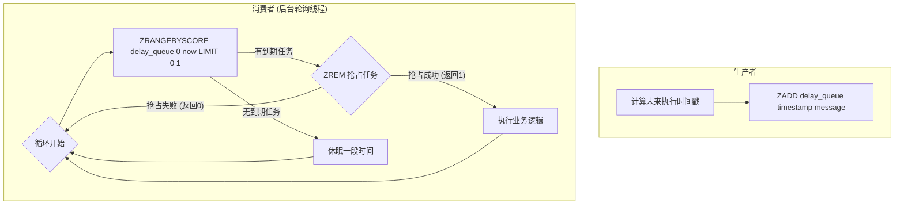

### 方案的优缺点与优化

#### 优点

- **实现简单高效**：ZSet 的`ZRANGEBYSCORE`和`ZREM`命令的时间复杂度都是`O(logN + M)`（N 是集合大小，M 是返回/删除数量），性能非常高。
- **精确到毫秒**：Score 是双精度浮点数，可以支持毫秒级的时间戳，延迟精度高。
- **可扩展性好**：可以轻松支持多个生产者和多个消费者（通过`ZREM`的原子性来实现任务的争抢）。

#### 缺点

- **消费者轮询的空转问题**：虽然加入了休眠，但消费者仍然需要不断地轮询 Redis，这会带来一定的 CPU 和网络开销。当队列长时间为空时，这些轮询就是无效的。
- **任务可靠性**：如果消费者在`ZREM`成功后，执行业务逻辑的过程中宕机，那么这个任务就**永久丢失**了，因为它已经从队列中被删除了。

#### 优化与改进

1.  **解决任务可靠性问题**：

    - 可以引入一个“备份队列”或“处理中队列”（例如另一个 ZSet 或 List）。
    - 当消费者抢占到任务后，不是立即执行，而是先将任务从`delay_queue`中移除，并原子性地添加到`processing_queue`中。
    - 当业务逻辑处理完成后，再从`processing_queue`中删除该任务。
    - 同时，需要有一个独立的“巡检”线程，定期检查`processing_queue`中那些停留时间过长的任务（说明处理它们的消费者可能已经宕机），并将它们重新放回`delay_queue`中，实现任务的**超时重试**。这实际上就是借鉴了 Redis Stream 中 PEL（Pending Entries List）的思想。

2.  **集成专业工具**：
    - 如果业务场景对延迟队列的功能要求非常高（例如需要严格的 ACK、失败重试、死信队列等），可以考虑使用一些基于 Redis ZSet 封装好的、成熟的开源延迟队列库，例如**Redisson**中就提供了`RDelayedQueue`。这些库已经帮我们处理好了上述的可靠性和并发问题，可以直接使用。

### 总结

**使用 Redis 的 ZSet 是实现延时消息队列最经典、最高效的方案。**

- **核心原理**：利用 ZSet 的 Score 来存储消息的**执行时间戳**，然后通过一个后台线程**轮询**`ZRANGEBYSCORE`来获取到期的任务，并使用`ZREM`的原子性来保证并发消费的唯一性。
- **关键挑战**：在于**消费者轮询的开销**和**任务处理的可靠性保证**。
- **解决方案**：通过引入备份队列实现可靠性，或直接使用成熟的开源库（如 Redisson）来简化开发。

---

## Redis 支持事务吗？

关于 Redis 是否支持事务，答案是 **“支持，但并非我们传统意义上关系型数据库（如 MySQL）那种严格的 ACID 事务”**。

Redis 的事务是一种**将多个命令打包，然后一次性、按顺序地执行**的机制。它通过`MULTI`、`EXEC`、`DISCARD`和`WATCH`这四个命令来协同完成。

### 一、 Redis 事务的实现方式与命令

一个典型的 Redis 事务包含三个阶段：

1.  **开启事务 (MULTI)**：

    - 客户端发送`MULTI`命令，告诉 Redis 服务器：“接下来的命令，请不要立即执行，而是把它们先存放到一个队列里”。
    - Redis 服务器在收到`MULTI`后，会返回`OK`，并开始进入事务模式。

2.  **命令入队**：

    - 在`MULTI`之后，客户端发送的所有命令（如`SET`, `INCR`, `SADD`等）都不会被立即执行。
    - Redis 会将这些命令依次存入一个**事务队列**中。每次命令入队成功，服务器都会返回`QUEUED`。
    - **语法检查**：在这个阶段，如果客户端发送了一个语法错误的命令（例如命令名写错了，或者参数数量不对），Redis 会立即向客户端返回一个错误，并且整个事务会被取消。

3.  **执行事务 (EXEC) 或 取消事务 (DISCARD)**：
    - **`EXEC`**：当所有需要执行的命令都入队后，客户端发送`EXEC`命令。Redis 服务器会**原子性地、按顺序地**执行事务队列中的所有命令，然后将所有命令的执行结果，按照入队的顺序，一次性地返回给客户端。
    - **`DISCARD`**：如果在`EXEC`之前，客户端希望取消这个事务，可以发送`DISCARD`命令。Redis 会清空事务队列，并退出事务模式。

**示例：**

```
> MULTI
OK
> SET user:1001:balance 100
QUEUED
> DECRBY user:1001:balance 10
QUEUED
> EXEC
1) OK
2) (integer) 90
```

### 二、 Redis 事务的核心特性（与 ACID 的对比）

理解 Redis 事务的关键，在于理解它保证了什么，以及它**不保证**什么。我们通常用 ACID 模型来衡量事务。

#### 1. Redis 事务保证的特性

- **原子性 (Atomicity) - 部分保证**：

  - Redis 的原子性指的是“**执行的原子性**”。一旦客户端发送了`EXEC`命令，Redis 会一次性地执行队列中的所有命令，这个执行过程是**不会被其他客户端的命令打断的**。从“开始执行到全部执行完毕”这个过程是原子的。
  - **但是**，Redis 事务**不提供回滚（Rollback）功能**。如果在`EXEC`执行期间，某个命令发生了**运行时错误**（例如，对一个字符串类型的 Key 执行`INCR`操作），这个命令会执行失败，但**之前已经成功执行的命令不会被回滚，后续的命令也会继续被执行**。

- **一致性 (Consistency)**：

  - Redis 事务可以保证数据的一致性。如果一个事务在执行前，数据库是处于一致状态的，那么在事务执行后，数据库也应该处于一致状态。
  - 这主要得益于 Redis 的错误检查机制：
    - **入队时错误**：语法错误会导致整个事务被取消，不会执行任何命令，保证了一致性。
    - **运行时错误**：虽然 Redis 不会回滚，但它会将错误信息返回给客户端，由调用方来决定如何处理这些不一致的状态。

- **隔离性 (Isolation)**：

  - 由于 Redis 是**单线程**处理命令的，并且事务在`EXEC`后是连续执行、不会被打断的，所以 Redis 事务天然就具有**最高的隔离级别——可串行化（Serializable）**。在事务执行期间，绝不会有其他客户端的命令插入进来。

- **持久性 (Durability)**：
  - Redis 事务的持久性与 Redis 自身的持久化策略（RDB/AOF）直接相关。
  - 如果 Redis 没有开启任何持久化，那么事务的持久性就无从谈起。
  - 如果开启了持久化（例如 AOF 的`everysec`策略），那么事务在`EXEC`执行完毕后，其结果会被写入 AOF 缓冲区，并在一秒内同步到磁盘，从而具备了持久性。

#### 2. Redis 事务不保证的特性 - **回滚**

这是 Redis 事务与关系型数据库事务最大的区别。Redis 的作者 Antirez 认为，命令的运行时错误通常是由**编程错误**（例如数据类型不匹配）导致的，这类错误应该在开发和测试阶段就被发现和修复，而不是依赖数据库的事务回滚机制来处理。不提供回滚，可以使 Redis 的设计更简单、性能更高。

### 三、 Redis 事务的局限性与`WATCH`命令

单纯的`MULTI`/`EXEC`事务有一个巨大的局限性：它只能保证在`EXEC`执行时不被打断，但**无法解决在`MULTI`和`EXEC`之间，被监控的 Key 被其他客户端修改的问题**。

**示例（竞态条件）**：

1.  客户端 A 想给`balance`减 10，它先`GET balance`得到 100。
2.  客户端 B 也想给`balance`减 10，它也`GET balance`得到 100。
3.  客户端 A 执行`MULTI`, `SET balance 90`, `EXEC`。
4.  客户端 B 执行`MULTI`, `SET balance 90`, `EXEC`。
    最终结果是`balance`为 90，而不是期望的 80。

为了解决这个问题，Redis 提供了`WATCH`命令，从而实现了**乐观锁（Optimistic Locking）**或**CAS（Check-And-Set）**机制。

- **`WATCH`命令**：
  - 在`MULTI`之前，客户端可以先执行 `WATCH key1 [key2 ...]` 来监视一个或多个 Key。
- **工作机制**：
  1.  客户端 A 执行 `WATCH balance`。
  2.  从客户端 A 执行`WATCH`开始，到它执行`EXEC`之前，如果**有任何其他客户端修改了`balance`这个 Key**，那么当客户端 A 执行`EXEC`时，它的整个事务就会**失败**。
  3.  `EXEC`会返回一个`nil`，表示事务未被执行。
- **客户端策略**：当客户端发现事务执行失败后，通常会进行**重试**（重新`WATCH`，获取新值，再进行计算和`MULTI/EXEC`）。

**使用`WATCH`的事务流程：**

```
> WATCH balance
OK
> balance_val = GET balance
> MULTI
OK
> SET balance (balance_val - 10)
QUEUED
> EXEC
(nil)  // 如果在WATCH和EXEC之间balance被修改了, 这里会返回nil
```

### 总结

- Redis**支持事务**，但它是一种**打包命令、原子执行**的机制，与 ACID 事务有显著区别。
- 它保证了**执行的原子性、隔离性、一致性**（在一定程度上），持久性则依赖于 Redis 的持久化配置。
- 它**最大的特点是不支持回滚**。
- 单独的`MULTI/EXEC`无法解决并发冲突（竞态条件）。必须配合`WATCH`命令，以**乐观锁**的方式来实现一个完整的、安全的事务。

---

## 有 Lua 脚本操作 Redis 的经验吗？

在我看来，熟练使用 Lua 脚本是 Redis 高级应用的一个重要标志。它不仅能解决一些棘手的问题，还能在很大程度上提升应用的性能和简洁性。

### 一、 为什么需要 Lua 脚本？（核心价值）

引入 Lua 脚本主要是为了解决两大核心问题：

1.  **保证操作的原子性**：

    - **问题**：Redis 的单个命令是原子的，但很多业务逻辑需要**多个命令组合**才能完成。例如，“判断一个 Key 是否存在，如果存在则更新它”这个逻辑，如果用`EXISTS`和`SET`两个命令来完成，在分布式高并发环境下，就可能存在竞态条件（在`EXISTS`和`SET`之间，Key 可能被其他客户端修改）。
    - **Redis 事务的局限**：虽然 Redis 的`MULTI/EXEC`事务可以打包命令，但它缺乏逻辑判断能力（如 if/else）。`WATCH`可以实现乐观锁，但如果并发冲突严重，会导致大量的重试，性能不佳。
    - **Lua 脚本的优势**：Redis 会**原子性地执行整个 Lua 脚本**。在脚本执行期间，不会有任何其他客户端的命令插入进来。我们可以在一个脚本内完成“读-改-写”等一系列包含复杂逻辑的操作，从而在根本上杜绝了竞态条件。

2.  **减少网络开销，提升性能**：
    - **问题**：对于一个需要多次与 Redis 交互的复杂操作，客户端与服务器之间会有多次网络往返（Round-Trip Time, RTT）。网络延迟是影响性能的主要因素。
    - **Lua 脚本的优势**：可以将原本需要 N 次网络请求才能完成的操作，封装在一个 Lua 脚本中，然后**一次性地发送给 Redis 执行**。这极大地减少了网络开销，显著提升了应用的性能。

### 二、 Lua 脚本的工作原理

当我们在 Redis 中执行 Lua 脚本时，其内部工作流程如下：

1.  **发送脚本**：客户端通过`EVAL`或`EVALSHA`命令将 Lua 脚本发送给 Redis 服务器。
2.  **原子性执行**：Redis 服务器会获取一个**Lua 解释器**，并将整个脚本作为一个不可分割的单元来执行。在执行期间，Redis 主线程会阻塞，不会处理任何其他请求，从而保证了原子性。
3.  **与 Redis 交互**：在 Lua 脚本内部，可以通过`redis.call()`或`redis.pcall()`这两个函数来调用任意的 Redis 命令。
    - `redis.call()`：如果调用的 Redis 命令执行出错，它会中断整个 Lua 脚本的执行，并返回错误。
    - `redis.pcall()`：类似于`try-catch`，即使调用的 Redis 命令出错，它也会捕获错误并继续执行脚本的后续部分。
4.  **返回结果**：脚本执行完毕后，会将结果返回给客户端。

#### `EVAL` vs `EVALSHA`

- **`EVAL "lua script" numkeys key [key ...] arg [arg ...]`**

  - 每次执行时，都需要将完整的 Lua 脚本字符串发送给 Redis，这会占用额外的网络带宽。

- **`SCRIPT LOAD "lua script"` -> `script_sha1`**
- **`EVALSHA script_sha1 numkeys key [key ...] arg [arg ...]`**
  - **最佳实践**：为了优化性能，我们应该先使用`SCRIPT LOAD`命令将 Lua 脚本预加载到 Redis 的**脚本缓存**中，该命令会返回一个脚本的 SHA1 校验和。
  - 之后，我们就可以通过`EVALSHA`命令，只发送这个很短的 SHA1 哈希值来执行对应的脚本。
  - 如果服务器因为重启等原因，脚本缓存中没有这个 SHA1 对应的脚本，`EVALSHA`会返回一个`NOSCRIPT`错误。此时，客户端需要捕获这个错误，然后退化为使用`EVAL`重新发送一次完整的脚本。

### 三、 我的实践经验（应用场景）

在我的项目中，我主要在以下几个场景中深度使用了 Lua 脚本：

#### 1. 实现复杂的原子性操作 - 以“库存扣减”为例

- **场景**：在高并发的秒杀场景中，扣减商品库存。需要判断库存是否足够，如果足够则扣减，否则返回失败。
- **非原子操作的风险**：
  1.  `GET stock` -> 得到库存为 1
  2.  `GET stock` -> (另一个线程)也得到库存为 1
  3.  `SET stock 0` -> (线程 1)扣减成功
  4.  `SET stock -1` -> (线程 2)也扣减成功，导致**超卖**。
- **Lua 脚本解决方案**：

  ```lua
  -- KEYS[1]: 库存的Key, e.g., "stock:product:1001"
  -- ARGV[1]: 本次要扣减的数量, e.g., 1

  local stock = redis.call('GET', KEYS[1])
  if not stock or tonumber(stock) < tonumber(ARGV[1]) then
      return 0 -- 库存不足或Key不存在，返回0代表失败
  end

  local new_stock = redis.call('DECRBY', KEYS[1], ARGV[1])
  return 1 -- 返回1代表成功
  ```

  这个脚本将“读-判断-写”三个步骤原子化，彻底解决了超卖问题。

#### 2. 实现分布式限流 - 令牌桶算法

- **场景**：需要对某个 API 接口进行平滑的限流，例如每秒允许 10 个请求。
- **Lua 脚本解决方案**：可以用一个 Hash 来存储令牌桶的信息（上次添加令牌的时间、当前令牌数等），然后用一个 Lua 脚本原子性地完成“计算并添加新令牌 -> 判断令牌是否足够 -> 消耗令牌”这一系列复杂逻辑。这比使用简单的`INCR`+`EXPIRE`限流器效果更平滑。

#### 3. 实现分布式锁的原子性释放

- **场景**：在释放分布式锁时，需要先判断锁的持有者是不是自己，如果是，才执行`DEL`操作，以防误删他人的锁。
- **Lua 脚本解决方案**：

  ```lua
  -- KEYS[1]: 锁的Key
  -- ARGV[1]: 当前线程的唯一ID（锁的value）

  if redis.call('GET', KEYS[1]) == ARGV[1] then
      return redis.call('DEL', KEYS[1])
  else
      return 0
  end
  ```

  这个脚本将“判断”和“删除”两个操作绑定在一起，保证了锁释放的安全性。很多成熟的分布式锁库（如 Redisson）的底层实现就是基于此。

### 四、 使用时的注意事项

- **避免在脚本中包含慢速逻辑**：由于脚本执行会阻塞 Redis，**严禁**在脚本中放入执行时间过长的、复杂的计算逻辑。Lua 脚本应该只用来编排 Redis 命令，将计算尽可能地放在客户端。
- **注意 Key 和 Arg 的传递**：所有需要操作的 Key，都必须通过`KEYS`数组来传递；所有参数，都必须通过`ARGV`数组来传递。这样做是为了让 Redis 在执行前能对 Key 进行分析（例如在 Cluster 模式下，判断所有 Key 是否在同一个 slot）。
- **脚本要保持无状态**：Lua 脚本不应该依赖任何全局变量或上一次执行的状态，要保证其幂等性和可重入性。
- **脚本超时控制**：Redis 有`lua-time-limit`配置项（默认 5 秒），用于防止因 Lua 脚本死循环或执行时间过长而导致 Redis 永久阻塞。如果脚本执行超时，可以被`SCRIPT KILL`命令终止（如果脚本未进行过写操作），或者只能通过`SHUTDOWN NOSAVE`来强制关闭服务器。

### 总结

总而言之，Lua 脚本是 Redis 提供的一个强大“武器”。它通过将多个操作打包成一个原子性的、在服务端执行的单元，完美地解决了**原子性保证**和**网络性能优化**这两大痛点。在我看来，善用 Lua 脚本是区分 Redis 普通使用者和高级使用者的一个重要分水岭。

---

## Redis 的管道 Pipeline 了解吗？

**简单来说，Pipeline 是一种客户端技术，它允许客户端将多个 Redis 命令一次性地打包发送给服务器，然后一次性地接收所有命令的响应。** 它的核心价值在于**显著地减少网络往返时间（Round-Trip Time, RTT）**，从而极大地提升应用的吞吐量（QPS）。

### 一、 为什么需要 Pipeline？（解决了什么问题）

要理解 Pipeline 的价值，我们首先要看常规的命令执行方式存在什么问题。

#### 1. 常规执行方式（同步阻塞）

在一个典型的“一问一答”模式中，客户端每执行一个命令，都需要经历以下步骤：

1.  客户端发送命令到服务器（`send`）。
2.  命令在网络中传输。
3.  Redis 服务器接收并执行命令。
4.  响应在网络中传输。
5.  客户端接收响应（`read`）。

**这个过程是同步阻塞的**。客户端在发送完一个命令后，必须等待服务器的响应回来，才能继续发送下一个命令。

- **性能瓶颈**：Redis 命令本身的执行速度是微秒级的（内存操作），而一次网络往返（RTT）的耗时通常是毫秒级的，甚至在跨地域网络中会更长。这意味着，客户端绝大部分的时间都浪费在了**等待网络传输**上。

- **示例**：假设执行一个命令本身耗时 10 微秒，而网络 RTT 是 1 毫秒（1000 微秒）。那么执行 100 个命令，总耗时大约是 `100 * (10us + 1000us) ≈ 100ms`。其中，真正用于计算的时间只有 `100 * 10us = 1ms`，而网络等待时间高达 `100 * 1ms = 100ms`。

#### 2. Pipeline 的解决方案

Pipeline 打破了这种“一问一答”的模式，变成了一种“批量问，批量答”的模式。

- **工作流程**：

  1.  客户端进入 Pipeline 模式。
  2.  客户端连续地将多个命令（例如 100 个`SET`命令）发送到操作系统的发送缓冲区，但**并不立即等待响应**。
  3.  当所有命令都发送完毕后，客户端执行一个“同步/刷新”操作（例如调用`sync()`或`exec()`方法），将缓冲区中的所有命令一次性地发送到 Redis 服务器。
  4.  Redis 服务器接收到这一批命令后，会**按顺序**执行它们。
  5.  Redis 服务器将所有命令的执行结果，**按顺序**打包，一次性地返回给客户端。
  6.  客户端一次性地接收所有响应。

- **性能提升**：我们再来计算一下使用 Pipeline 执行 100 个命令的耗时。
  - 总耗时 ≈ `1次网络RTT` + `100个命令的执行时间`
  - `1ms + 100 * 10us = 1ms + 1ms = 2ms`
  - 相比于常规方式的**100ms**，性能提升了**50 倍**！

**Pipeline 的核心原理就是：通过打包 N 个命令，将原本需要 N 次网络 RTT 的开销，降低到了只需要 1 次。**

### 二、 Pipeline 与 Redis 事务（MULTI/EXEC）的区别

Pipeline 在形式上与 Redis 事务非常相似，都是打包一批命令，但它们在本质上是完全不同的东西：

| 特性维度     | Pipeline (管道)                                                                                              | Transaction (MULTI/EXEC 事务)                                                        |
| :----------- | :----------------------------------------------------------------------------------------------------------- | :----------------------------------------------------------------------------------- |
| **关注点**   | **性能优化**，减少网络 RTT                                                                                   | **原子性保证**，确保一组命令在执行时不被打断                                         |
| **实现层面** | **客户端技术**，是客户端对命令的打包和发送方式                                                               | **服务端技术**，是 Redis 服务器的一种命令执行模式                                    |
| **原子性**   | **不保证原子性**。服务器是逐条接收并执行命令的（只是客户端打包发送），在命令之间可能会穿插其他客户端的命令。 | **保证原子性**。`EXEC`后，队列中的所有命令会连续执行，期间不会有其他命令插入。       |
| **执行方式** | 命令被发送到服务器后，可能会被**立即执行**（取决于 TCP 包的组合情况），客户端只是延迟接收响应。              | 命令在`EXEC`之前，**绝对不会被执行**，只是被放入队列中。                             |
| **支持性**   | 所有 Redis 命令都支持                                                                                        | 部分命令（如`WATCH`）在事务中有特殊含义，有些命令（如`SUBSCRIBE`）不能在事务中使用。 |

**简单总结**：Pipeline 是“客户端攒了一堆命令，一次性发出去”，它关心的是**通信效率**；事务是“告诉服务器我要开始一个原子操作，你先别执行，等我发完`EXEC`再一起做”，它关心的是**执行的原子性**。

**两者可以一起使用吗？可以。** 可以在一个 Pipeline 中包含`MULTI`和`EXEC`命令，这样既能享受到 Pipeline 带来的网络性能提升，又能获得事务的原子性保证。

### 三、 Pipeline 的实践注意事项

1.  **并非命令越多越好**：

    - Pipeline 打包的命令数量不是越多越好。一次打包的命令过多，一方面会增加客户端的内存消耗，另一方面，如果数据量过大，单个 TCP 包无法容纳，可能会被拆分成多个包发送，导致网络传输时间增加。同时，服务器处理大量命令也需要时间。
    - 需要根据业务场景和网络状况，通过压测找到一个最佳的“批次大小”（batch size），通常在几十到几百之间。

2.  **非原子性**：

    - 必须清楚地认识到，Pipeline 本身不具备原子性。如果业务逻辑要求一组命令必须作为一个整体执行，不可分割，那么必须配合使用`MULTI/EXEC`事务。

3.  **对客户端内存的占用**：
    - 客户端在调用 Pipeline 发送命令后，需要将这些命令和未来的响应在内存中进行缓存。如果批次过大，会对客户端的内存造成一定压力。

### 总结

Redis Pipeline 是一种非常重要的、基于客户端的性能优化技术。它通过**批量打包命令**的方式，将多次网络往返的开销压缩为一次，从而极大地提升了应用的吞吐量。它与事务（MULTI/EXEC）是两个不同维度的概念，一个关注**通信性能**，一个关注**执行原子性**。在需要进行大量、连续的 Redis 写或读操作时（例如批量导入数据、批量查询），使用 Pipeline 是标准且高效的最佳实践。

---

## Redis 能实现分布式锁吗？

**分布式锁的核心目的，是在分布式系统环境下，当多个独立的进程或线程需要访问同一个共享资源时，能够像本地多线程编程中的`synchronized`或`Lock`一样，确保在同一时刻，只有一个客户端能够持有锁并访问该资源。**

Redis 之所以能成为实现分布式锁的流行选择，主要得益于它具备以下几个关键特性：

1.  **高性能**：加锁和解锁操作都是在内存中完成，速度极快，延迟低。
2.  **原子性命令**：Redis 提供了像`SETNX`这样的原子性操作，这是实现锁的基础。
3.  **单线程模型**：天然避免了在 Redis 服务端内部的竞态条件。
4.  **高可用性**：通过哨兵或集群模式，可以保证锁服务本身的高可用。

### 一、 一个合格的分布式锁应具备哪些特性？

在讨论如何实现之前，我们先明确一个好的分布式锁应该满足哪些条件：

1.  **互斥性 (Mutual Exclusion)**：在任何时刻，只有一个客户端能持有锁。这是最基本的要求。
2.  **防死锁 (Deadlock Prevention)**：即使持有锁的客户端因为崩溃或网络问题而未能正常释放锁，锁也必须最终能够被释放，以避免其他客户端永远无法获取锁。通常通过**超时机制**来保证。
3.  **容错性 (Fault Tolerance)**：锁服务本身应该是高可用的。部分 Redis 节点宕机不应影响锁的正常工作。
4.  **可重入性 (Re-entrancy)**：同一个线程/进程可以多次获取同一个锁，而不会造成死锁。

### 二、 Redis 分布式锁的实现演进

实现一个生产可用的 Redis 分布式锁，其方案是逐步演进、不断完善的。

#### 版本一：最基础的实现 - `SETNX`

- **加锁**：`SETNX lock_key 1`
  - `SETNX` (SET if Not eXists) 是一个原子命令。当`lock_key`不存在时，它会设置`lock_key`的值为 1，并返回 1（表示加锁成功）。如果`lock_key`已存在，它什么都不做，并返回 0（表示加锁失败）。
- **解锁**：`DEL lock_key`
- **问题**：这个版本有一个**致命缺陷**。如果一个客户端加锁成功后，在执行业务逻辑或解锁前**崩溃**了，`DEL`命令将永远不会被执行，这个锁就**永远无法被释放**，造成了**死锁**。

#### 版本二：加入超时 - `SETNX` + `EXPIRE`

为了解决死锁问题，我们为锁引入一个超时时间。

- **加锁**：
  1.  `SETNX lock_key 1`
  2.  `EXPIRE lock_key 30` (设置 30 秒后自动过期)
- **解锁**：`DEL lock_key`
- **问题**：`SETNX`和`EXPIRE`是**两个独立的命令，它们不是原子的**。如果在执行完`SETNX`后，客户端还没来得及执行`EXPIRE`就崩溃了，死锁问题依然存在。

#### 版本三：原子性的加锁与超时 - `SET`命令的扩展

Redis 2.6.12 版本之后，`SET`命令得到了增强，可以原子性地完成`SETNX` + `EXPIRE`的功能。这是实现分布式锁的**标准指令**。

- **加锁**：`SET lock_key <unique_value> NX PX 30000`
  - `lock_key`: 锁的名称。
  - `<unique_value>`: 必须是一个**唯一的、随机生成的值**，例如 UUID。这个值用来标识锁的持有者。
  - `NX`: 等同于`SETNX`，只有当`lock_key`不存在时才设置。
  - `PX 30000`: 等同于`EXPIRE`，设置锁的过期时间为 30000 毫秒（30 秒）。
- **解锁**：这时解锁就不能简单地`DEL`了，因为可能会误删他人的锁（例如，客户端 A 的锁超时自动释放了，客户端 B 获取了锁，此时客户端 A 又从崩溃中恢复，执行了`DEL`，就把 B 的锁给删了）。

  - **安全的解锁方式**：需要使用**Lua 脚本**来保证“判断”和“删除”的原子性。

    ```lua
    -- KEYS[1]: lock_key
    -- ARGV[1]: unique_value (客户端A的唯一ID)

    if redis.call('GET', KEYS[1]) == ARGV[1] then
        return redis.call('DEL', KEYS[1])
    else
        return 0
    end
    ```

- **评价**：这个版本已经解决了**互斥性**、**防死锁**和**避免误删**的问题，是**单机 Redis**环境下最常用、最可靠的分布式锁实现。

### 三、 更高级的考量：锁的续期与红锁

#### 1. 锁的续期（看门狗机制）

- **问题**：在版本三中，如果一个业务的执行时间超过了锁的超时时间（例如，锁设置了 30 秒超时，但业务执行了 40 秒），锁会被自动释放，此时其他客户端就可以获取到锁，导致多个客户端同时执行临界区代码，破坏了互斥性。
- **解决方案**：**锁续期 (Lock Renewal)**，也常被称为“**看门狗 (Watchdog)**”机制。
  - **原理**：当一个客户端获取锁成功后，它会**在后台启动一个定时任务（守护线程）**。这个任务会定期地（例如每隔 10 秒）检查锁是否存在且持有者是自己。如果是，就**重新执行`EXPIRE`命令**，为锁“续命”，延长其超时时间。
  - 当业务执行完毕，客户端主动释放锁时，这个后台的续期任务也随之停止。
  - **实现**：自己实现比较复杂，通常会使用成熟的客户端库，例如 Java 中的**Redisson**，它已经内置了完善的看门狗机制。

#### 2. Redlock (红锁) - 应对主从切换的高可用锁

- **问题**：在 Redis 主从或哨兵模式下，如果客户端 A 在 Master 节点上获取了锁，但这个锁的`SET`命令**还没来得及同步到 Slave 节点**，此时 Master 宕机了。哨兵会将一个 Slave 提升为新的 Master，但这个新的 Master 上并没有锁的信息。此时，客户端 B 就可以在新 Master 上成功获取同一个锁，导致两个客户端同时持有锁，破坏了互斥性。
- **解决方案：Redlock (红锁)**
  - 这是 Redis 的作者 Antirez 提出的一个在分布式环境下实现高可用锁的算法。
  - **原理**：假设有 5 个完全独立的 Redis Master 节点。
    1.  客户端尝试在**所有 5 个**节点上，依次获取锁（使用版本三的`SET`命令，但超时时间要设置得短一些）。
    2.  如果客户端能够**在超过半数（例如 3 个）**的节点上成功获取到锁，并且总耗时小于锁的有效时间，那么就认为客户端**加锁成功**。
    3.  **解锁**时，客户端需要向**所有 5 个**节点发送解锁命令（Lua 脚本）。
  - **评价**：Redlock 通过在多个独立的实例上“投票”的方式，极大地降低了因单点故障（包括主从切换）导致锁失效的概率。但它也受到了很多争议，因为它实现复杂、依赖多个实例、对时钟同步有要求，且在某些极端情况下（如网络分区和 GC 暂停）依然可能存在问题。

### 总结

- **是的，Redis 可以实现分布式锁**，并且是主流方案。
- 一个**生产可用的、基于单机 Redis 的分布式锁**，其标准实现是：
  - **加锁**：使用 `SET key unique_value NX PX timeout` 命令。
  - **解锁**：使用 **Lua 脚本**，保证“判断持有者”和“删除”的原子性。
- 为了应对**业务执行时间超长**的问题，需要引入**锁续期（看门狗）**机制，这通常由成熟的客户端库（如 Redisson）提供。
- 为了应对**主从切换时的数据不一致**问题，可以采用更复杂的**Redlock（红锁）**算法，但这在实践中需要谨慎评估其成本和收益。

---

## Redis 都有哪些底层数据结构？

我们通常说的 Redis 数据类型（如 String, List, Hash, Set, ZSet）是它**对外暴露**的逻辑结构。而这些逻辑结构，其**内部**是由一种或多种更基础的数据结构来支撑的。Redis 会根据存储内容的大小和数量，智能地选择最优的底层数据结构，以在性能和空间效率之间取得最佳平衡。

Redis 的底层数据结构主要有以下几种：

### 1. SDS (Simple Dynamic String) - 简单动态字符串

SDS 是 Redis 用来代替 C 语言原生字符串（以`\0`结尾的字符数组）的自定义实现。所有 Redis 中的字符串值（包括 Key 和 String 类型的值）都是用 SDS 来表示的。

- **结构**：一个 SDS 值通常包含三个部分：

  - `len`: 当前字符串的实际长度。
  - `free`: 未使用的空闲空间长度。
  - `buf[]`: 存储字符串内容的字符数组。

- **相比 C 字符串的优点**：
  - **O(1)时间复杂度获取字符串长度**：直接读取`len`属性即可，而 C 字符串需要遍历整个字符串。
  - **杜绝缓冲区溢出**：在修改 SDS 时，会先检查`free`空间是否足够，如果不够，会自动进行扩容，避免了 C 字符串常见的溢出风险。
  - **空间预分配与惰性释放（减少内存重分配次数）**：
    - **预分配**：当 SDS 增长时，程序不仅会分配所必需的空间，还会额外分配一些未使用的空间（`free`）。这样，下次再对字符串进行小幅追加时，就无需重新分配内存。
    - **惰性释放**：当 SDS 缩短时，程序并不会立即回收多出来的空间，而是更新`free`属性，以备将来再次使用。
  - **二进制安全**：SDS 的`buf`数组可以存储任意二进制数据（包括`\0`字符），因为它完全依赖`len`属性来判断字符串的结束，而不是`\0`。

**支撑的数据类型**：`String`，以及所有数据类型中的 Key 和 Value 中的字符串部分。

### 2. LinkedList (双端链表)

这是一个标准的双向链表实现。

- **结构**：每个链表节点（`listNode`）都包含指向前一个节点和后一个节点的指针，以及一个指向实际值的指针。链表本身（`list`）则包含头指针、尾指针和链表长度等信息。
- **优点**：
  - 在链表两端进行`Push`和`Pop`操作的时间复杂度是**O(1)**。
  - 插入和删除节点非常高效，只需修改前后节点的指针。
- **缺点**：
  - 内存开销大：每个节点除了存储数据，还需要额外的指针空间。
  - 无法高效地按索引访问：访问一个中间节点的时间复杂度是**O(N)**。

**支撑的数据类型**：主要用于早期的`List`类型。在 Redis 3.2 之后，`List`的底层实现被`Quicklist`所取代。现在，它主要在一些内部机制中使用，如发布订阅、客户端状态等。

### 3. HashTable (哈希表 / 字典)

Redis 的哈希表实现与 Java 中的 HashMap 类似，也是通过“数组 + 链表（拉链法）”的方式来解决哈希冲突。

- **核心特性 - 渐进式 Rehash**：
  - 当哈希表需要扩容或缩容时（即`rehash`），如果一次性将所有数据从旧表迁移到新表，对于一个包含数百万个 Key 的哈希表来说，会造成明显的阻塞。
  - Redis 采用了**渐进式 Rehash**的策略。它会同时保留新旧两个哈希表，并在后续的每一次对该哈希表的增、删、改、查操作中，**“顺便”**将旧表中的一小部分数据迁移到新表中。同时，Redis 还有一个定时任务，也会在 CPU 空闲时进行少量的迁移工作。
  - 通过这种“化整为零”的方式，将巨大的迁移成本分摊到了大量的日常操作中，避免了单次长时间的阻塞。

**支撑的数据类型**：`Hash`, `Set`。当`Hash`或`Set`中的元素数量较多时，就会从`ziplist`或`intset`升级为`hashtable`。Redis 的顶层结构（存储所有 Key-Value 的那个大字典）本身也是一个哈希表。

### 4. Ziplist (压缩列表)

Ziplist 是为了极度节省内存而设计的一种**紧凑的、连续的内存块**。它将一系列数据项（可以是小整数或短字符串）编码后，串行地存放在一起。

- **结构**：一个`ziplist`通常由`zlbytes`（总字节数）、`zltail`（尾节点偏移量）、`zllen`（节点数量）、一系列的**entry（节点）**和`zlend`（结束标记）组成。每个`entry`包含了前一个`entry`的长度、编码信息和实际内容。
- **优点**：
  - **内存利用率极高**：因为它是一块连续的内存，完全没有指针开销，非常节省空间。
- **缺点**：
  - **查询和修改效率低**：由于没有索引，查询一个元素需要从头或尾开始遍历。
  - **连锁更新风险**：如果在`ziplist`的中间插入或删除了一个元素，可能会导致其后面所有元素的“前一节点长度”字段都需要被更新，这个连锁反应在最坏情况下时间复杂度是**O(N^2)**。

**支撑的数据类型**：在元素数量较少、且元素都是小整数或短字符串时，用作`List`, `Hash`, `Set`, `ZSet`的底层实现。一旦超过阈值，就会自动转换为更高效的数据结构（如`linkedlist`/`quicklist`, `hashtable`, `skiplist`）。

### 5. Intset (整数集合)

当一个`Set`中的所有元素都是**整数**，并且元素的数量不多时，Redis 会使用`intset`来存储。

- **结构**：`intset`的底层是一个**有序的、不重复的**整数数组。它会根据存储的整数大小，自动选择合适的整数类型（`int16_t`, `int32_t`, `int64_t`）。
- **优点**：
  - **内存高效**：因为是连续的数组，且没有冗余信息。
  - **查询高效**：由于数组是有序的，可以使用**二分查找**，时间复杂度是**O(logN)**。
- **升级（Upgrade）**：当向一个`intset`中插入一个需要更大类型才能存储的新整数时（例如，在一个全是`int16_t`的集合中插入一个`int32_t`的数），`intset`会自动进行“升级”，将整个数组的所有元素都转换成更大的类型。

**支撑的数据类型**：`Set`。

### 6. Skiplist (跳跃表)

Skiplist 是 Redis 中一个非常重要且高效的数据结构，主要用于实现`ZSet`（有序集合）。

- **结构**：可以看作是一种**多层的、带有“快速通道”的有序链表**。
  - 最底层（Level 1）是一个标准的有序链表，包含了所有的元素。
  - 在其上，有多个“稀疏”的层（Level 2, Level 3, ...）。每一层都是下一层的一个子集。上层的节点通过指针指向下一层的同一个节点。
- **工作原理**：在查找一个元素时，会先从最高层开始查找。如果当前节点的下一个节点比目标小，就继续前进；如果比目标大，就从当前节点“下沉”到下一层，继续查找。
- **优点**：
  - **高效的查找、插入和删除**：通过这种“跳跃式”的查找，其平均时间复杂度可以达到**O(logN)**，性能媲美平衡树（如红黑树）。
  - **实现相对简单**：相比于复杂的平衡树，跳跃表的实现和维护要简单得多。
  - **支持范围查询**：可以高效地进行范围查找。

**支撑的数据类型**：`ZSet`。一个 ZSet 内部通常由一个`hashtable`和一个`skiplist`共同组成，`hashtable`用于 O(1)地查找成员的分数，`skiplist`用于按分数进行排序和范围查询。

### 7. Quicklist (快速列表) (Redis 3.2+)

Quicklist 是`ziplist`和`linkedlist`的混合体，是当前`List`类型的标准底层实现。

- **结构**：一个`quicklist`就是一个双向链表，但它的**每个节点**（`quicklistNode`）存储的不再是一个单一的值，而是一个**ziplist**。
- **优点**：
  - **兼顾了空间和时间效率**：它结合了`ziplist`节省空间和`linkedlist`快速两端插入的优点。对于一个很长的列表，它避免了单个巨大的`ziplist`可能带来的连锁更新问题，也避免了`linkedlist`过多的指针开销。
- **可配置的压缩深度**：可以通过`list-compress-depth`参数配置`quicklist`两端有多少个节点不被压缩，以进一步提升两端操作的性能。

**支撑的数据类型**：`List`。

### 总结

| 底层数据结构   | 核心特性                                             | 主要支撑的 Redis 类型                    |
| :------------- | :--------------------------------------------------- | :--------------------------------------- |
| **SDS**        | O(1)长度获取, 动态扩容, 二进制安全                   | `String`, 所有 Key/Value 中的字符串      |
| **LinkedList** | 双向链表, O(1)两端操作                               | `List` (早期), 内部机制                  |
| **HashTable**  | 拉链法, **渐进式 Rehash**                            | `Hash`, `Set`, Redis 顶层 Key-Value 字典 |
| **Ziplist**    | **内存紧凑**, 连续存储, 增删慢, 可能有连锁更新       | `List`, `Hash`, `Set`, `ZSet` (元素少时) |
| **Intset**     | **有序整数数组**, 二分查找, 自动升级                 | `Set` (全为整数时)                       |
| **Skiplist**   | **多层有序链表**, **O(logN)查询/增删**, 支持范围查询 | `ZSet`                                   |
| **Quicklist**  | **LinkedList + Ziplist**, 空间和时间的折中           | `List` (Redis 3.2+)                      |

理解这些底层数据结构以及 Redis 是如何根据场景智能地选择它们，是深入掌握 Redis、进行性能优化和解决问题的关键。

---

## Redis 为什么不用 C 语言的原生字符串？

Redis 之所以选择从零开始，设计并实现了自己的字符串类型——**SDS (Simple Dynamic String，简单动态字符串)**，来全面替代 C 语言原生的字符串（以`\0`结尾的字符数组），是出于对**性能、安全性和功能完备性**的综合考虑。

C 语言的原生字符串虽然简单，但存在几个关键的缺陷，这些缺陷对于像 Redis 这样的高性能键值数据库来说是难以接受的。

### 缺陷一：获取字符串长度的性能问题

- **C 语言字符串**：
  - 它没有一个独立的字段来记录自身的长度。
  - 要获取一个 C 字符串的长度，必须从头开始遍历，直到遇到结尾的空字符`\0`为止。这个操作的时间复杂度是 **O(N)**，其中 N 是字符串的长度。
- **SDS 的解决方案**：
  - SDS 的结构中包含一个`len`字段，它明确地记录了当前字符串的实际长度。
  - 要获取 SDS 的长度，只需直接读取`len`属性即可。这个操作的时间复杂度是 **O(1)**。
  - 对于 Redis 这样一个需要频繁操作字符串（例如拼接、截取）的系统来说，能够以 O(1)的效率获取长度，极大地提升了整体性能。

### 缺陷二：缓冲区溢出（Buffer Overflow）的风险

- **C 语言字符串**：
  - C 语言自身不提供任何自动的边界检查。
  - 当使用像`strcat()`这样的函数来拼接两个字符串时，如果目标字符数组的空间不足以容纳拼接后的结果，就会发生**缓冲区溢出**。这不仅会导致数据被意外截断或破坏，更严重的是，它是一个重大的安全漏洞，可能被利用来执行恶意代码。
- **SDS 的解决方案**：
  - SDS 的 API 在对字符串进行任何修改之前，都会**先检查其内部的空间是否足够**。
  - 它会利用结构中的`free`字段（记录了剩余空闲空间的大小）和`len`字段来判断。
  - 如果空间不足，SDS 会自动地、安全地进行**扩容**，分配一块更大的内存空间，然后再执行修改操作。
  - 通过这种方式，SDS**从根本上杜绝了缓冲区溢出**的风险，大大增强了 Redis 的健壮性和安全性。

### 缺陷三：频繁修改带来的内存重分配（Reallocation）开销

- **C 语言字符串**：
  - 每次对 C 字符串进行增长（如`strcat`）或缩短（如`strcpy`一个更短的字符串）操作时，程序都可能需要**重新分配内存**。
  - 增长时，需要分配一块更大的新内存，拷贝旧内容，再追加新内容。
  - 缩短时，为了节省空间，也可能需要分配一块更小的新内存，再拷贝内容。
  - 在 Redis 这样写操作频繁的场景下，频繁的内存重分配会严重影响性能。
- **SDS 的解决方案 - 空间预分配与惰性释放**：
  - **空间预分配 (Space Pre-allocation)**：当 SDS 的 API 对字符串进行增长操作时，如果需要扩容，它并不会“刚刚好”地分配所需空间。而是会**额外分配一些未使用的空间**（更新`free`字段）。
    - 如果修改后 SDS 的长度小于 1MB，那么`free`的大小会和`len`相同（即总空间加倍）。
    - 如果修改后 SDS 的长度大于等于 1MB，那么`free`会额外增加固定的 1MB 空间。
    - 通过这种预分配策略，可以确保在后续的多次小幅追加操作中，都**无需再次进行内存重分配**。
  - **惰性空间释放 (Lazy Space Freeing)**：当对 SDS 进行缩短操作时，程序**并不会立即释放**那些不再使用的字节。而是简单地更新`len`字段，并将多出来的字节数记录到`free`字段中。这些“空闲”的空间可以被将来可能的增长操作所利用，同样避免了内存重分配。

### 缺陷四：二进制安全问题

- **C 语言字符串**：
  - 由于 C 字符串以`\0`作为结尾标记，所以它**不能包含`\0`字符**在字符串的中间。
  - 这使得 C 字符串只能用来存储文本数据，无法安全地存储像图片、音频、序列化对象等可能包含任意字节的**二进制数据**。
- **SDS 的解决方案**：
  - SDS 是**二进制安全 (Binary-safe)** 的。
  - 它完全依赖其`len`属性来判断字符串的结束，而与`buf`数组中存储的内容无关。
  - 因此，SDS 的`buf`数组可以包含任意数量的`\0`字符或任何其他字节值。
  - 这使得 Redis 不仅能存文本，还能灵活地存储各种复杂的二进制数据，极大地扩展了其应用场景。

### 总结

| 特性维度         | C 语言原生字符串                         | Redis SDS (简单动态字符串)                               |
| :--------------- | :--------------------------------------- | :------------------------------------------------------- |
| **长度获取**     | **O(N)** - 遍历                          | **O(1)** - 直接读`len`字段                               |
| **安全性**       | **有缓冲区溢出风险**                     | **杜绝溢出** - API 自动检查并扩容                        |
| **内存分配效率** | **频繁重分配** - 每次修改都可能`realloc` | **高效** - 通过**空间预分配**和**惰性释放**来优化        |
| **数据类型支持** | **非二进制安全** - 不能包含`\0`          | **二进制安全** - 可以存储任意字节数据                    |
| **API 兼容性**   | 标准 C 库                                | 遵循 C 字符串的惯例（以`\0`结尾），可以复用部分 C 库函数 |

**综上所述，Redis 选择不用 C 语言原生字符串，而自行设计 SDS，是一个深思熟虑的、以性能和安全为导向的工程决策。SDS 通过牺牲少量额外的内存空间（用于存储`len`和`free`），换来了在各种操作场景下显著的性能提升、更高的安全性和更强的功能性，这对于构建一个高性能、高可靠的数据库系统是至关重要的。**

---

## 你研究过 Redis 的字典源码吗？

Redis 的字典（哈希表）实现是其高性能的关键所在，它并非一个简单的哈希表示例，而是一个经过精心设计的、为了应对高并发和大规模数据而优化的工程杰作。其最核心、最值得称道的设计就是**渐进式 Rehash（Incremental Re-hashing）**。

### 一、 核心数据结构

Redis 的字典由三个关键的结构体定义：

1.  **`dict` (字典)**：这是最外层的结构，代表了整个字典。

    ```c
    typedef struct dict {
        dictType *type;     // 指向一个包含自定义函数指针的结构，使得字典可以存储不同类型的键值
        void *privdata;     // 私有数据，供type中的函数使用
        dictht ht[2];       // 两个哈希表，ht[0]是主哈希表，ht[1]仅在rehash时使用
        long rehashidx;     // rehash的进度索引。如果为-1，表示当前没有在进行rehash
        // ... 其他字段
    } dict;
    ```

    - **`ht[2]`是关键**：一个字典内部包含两个哈希表（`dictht`），这是实现渐进式 Rehash 的基础。平时只使用`ht[0]`，当需要扩容或缩容时，`ht[1]`才会登场。
    - **`rehashidx`**：这是一个“状态标记”，用来记录 rehash 的进度。

2.  **`dictht` (哈希表)**：这是实际存储数据的哈希表结构。

    ```c
    typedef struct dictht {
        dictEntry **table;  // 哈希表数组，数组的每个元素都是一个指向dictEntry的指针
        unsigned long size;     // 哈希表的大小 (必须是2的n次幂)
        unsigned long sizemask; // 哈希表大小掩码，等于size-1，用于快速计算索引
        unsigned long used;     // 哈希表中已有的节点数量
    } dictht;
    ```

    - **`table`**：这是一个指针数组，数组的每个槽（bucket）存放的是一个指向`dictEntry`链表头部的指针。
    - **`sizemask`**：用于通过位运算`hash & sizemask`来快速计算索引，替代了较慢的取模运算`hash % size`。

3.  **`dictEntry` (哈希表节点)**：这是存储实际键值对的单元。
    ```c
    typedef struct dictEntry {
        void *key;          // 键
        union {             // 值，可以是一个指针、一个有/无符号整数或一个双精度浮点数
            void *val;
            uint64_t u64;
            int64_t s64;
            double d;
        } v;
        struct dictEntry *next; // 指向下一个哈希冲突的节点，形成链表（拉链法）
    } dictEntry;
    ```
    - **`next`指针**：清楚地表明了 Redis 解决哈希冲突的方式是**链地址法（Chaining）**。

### 二、 渐进式 Rehash 的原理与实现

这是 Redis 字典设计的精髓所在，旨在**避免因一次性全量 Rehash 而导致的长时间服务阻塞**。

#### 1. 为什么需要 Rehash？

当哈希表中的元素过多（负载因子过高），会导致哈希冲突增多，链表变长，查询效率从 O(1)退化到 O(N)。当元素过少（负载因子过低），又会浪费内存。因此需要动态地扩容和缩容。

- **扩容触发条件**：
  - 负载因子 `(used / size)` >= 1，且没有正在执行`BGSAVE`或`BGREWRITEAOF`等后台任务。
  - 负载因子 `(used / size)` >= 5（此时会强制扩容，忽略后台任务）。
- **缩容触发条件**：
  - 负载因子 `(used / size)` < 0.1。

#### 2. “渐进式”是如何工作的？

当触发 Rehash 时，Redis 并不会一次性将`ht[0]`的所有数据都迁移到`ht[1]`。而是将这个巨大的迁移任务，**分摊**到后续的每一次对该字典的操作中。

1.  **准备阶段**：

    - 为`ht[1]`分配空间。如果是扩容，`ht[1]`的大小通常是`ht[0].used`的两倍以上最接近的 2 的 N 次幂；如果是缩容，则是`ht[0].used`以上最接近的 2 的 N 次幂。
    - 将`dict->rehashidx`的值从`-1`设置为`0`，表示 Rehash 正式开始。

2.  **Rehash 进行中**：

    - **查询、删除、更新操作**：在 Rehash 期间，所有这类操作都需要在**两个哈希表**上进行。程序会先在`ht[0]`中查找，如果找不到，再去`ht[1]`中查找。
    - **新增操作**：所有新添加的键值对，一律被直接添加到**`ht[1]`**中。这保证了`ht[0]`的元素数量只会减少，不会增加，为最终完成 Rehash 提供了保障。
    - **“顺手”迁移数据**：在执行上述任何一次增删改查操作时，程序都会**“顺便”**将`ht[0]`中`rehashidx`所指向的那个 bucket（桶）里的所有节点，全部迁移到`ht[1]`中。迁移完成后，将`rehashidx`加一。

3.  **主动迁移**：

    - 为了防止一个字典在 Rehash 期间长时间没有被访问，导致 Rehash 过程停滞，Redis 还有一个**定时任务**（在`serverCron`中）。
    - 这个定时任务会每秒执行 10 次（默认配置），每次会花费 1 毫秒的时间，主动地、一小批一小批地将数据从`ht[0]`迁移到`ht[1]`，直到 Rehash 完成。

4.  **完成阶段**：
    - 当`ht[0]`的所有数据都被迁移到`ht[1]`后（即`rehashidx`的值等于`ht[0].size`），Rehash 过程结束。
    - 此时，会释放`ht[0]`的内存空间，将`ht[1]`设置为`ht[0]`，并创建一个新的空的`ht[1]`备用。
    - 最后，将`rehashidx`重置为`-1`。

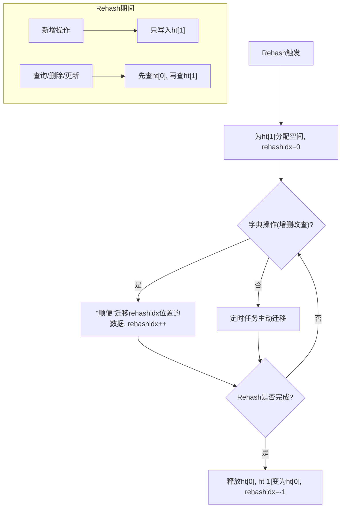

### 三、 其他设计要点

- **哈希算法**：Redis 早期使用`djb`，后来主要使用**`MurmurHash2`**。这是一种非加密型哈希函数，以其极高的计算性能和优秀的散列分布性（雪崩效应）而著称，非常适合用于构建哈希表。
- **字典的通用性 (`dictType`)**：通过`dictType`结构体，Redis 的字典实现是高度抽象和通用的。它可以存储任何类型的键和值，只需要为该类型提供一组特定的操作函数（如哈希函数、比较函数、析构函数等）。这使得同一套字典代码可以被用在 Redis 的各个地方（顶层数据库、Hash 类型、ZSet 类型等）。

### 总结

Redis 的字典源码是一个工程上的杰作。它并没有发明全新的数据结构，而是将经典的哈希表，通过**渐进式 Rehash**这一核心创新，完美地适配了 Redis 单线程、高性能、不能被长时间阻塞的严苛要求。理解了渐进式 Rehash，就理解了 Redis 字典设计的灵魂。它是在**性能、内存和实时响应性**之间做出的一个堪称典范的权衡。

---

## 假如 Redis 里面有 1 亿个 key，其中有 10w 个 key 是以某个固定的已知的前缀开头的，如何将它们全部找出来？

首先，最直观的解决方案是使用 Redis 的 `KEYS` 命令。

### **方法一：`KEYS` 命令 (不推荐在生产环境使用)**

`KEYS` 命令可以接受一个 `glob` 风格的通配符，所以要找出所有以特定前缀开头的 key，我可以使用如下命令：

```
KEYS an_known_prefix:*
```

**这个方法的优点是简单直接。但是，我绝不会在生产环境中，尤其是有 1 亿个 key 的大规模数据库中，使用这个命令。**

原因是 `KEYS` 命令是一个阻塞操作，它的时间复杂度是 O(N)，其中 N 是数据库中 key 的总数。 这意味着在执行期间，Redis 会遍历所有的 key，并阻塞其他所有客户端的请求。 在一个拥有 1 亿个 key 的实例上，这个操作可能会持续很长时间，导致 Redis 实例在几秒甚至更长的时间内无响应，这对于要求高可用和高性能的线上服务来说是灾难性的。

### **方法二：`SCAN` 命令 (生产环境推荐方案)**

为了解决 `KEYS` 命令的阻塞问题，Redis 2.8.0 版本之后引入了 `SCAN` 命令。 这是我推荐的、更安全、更适合生产环境的方案。

`SCAN` 命令通过一个基于游标的迭代器来工作，它允许我们分批次地遍历键空间。 这就避免了长时间阻塞 Redis 服务。

具体的实现步骤如下：

1.  **初始调用**：从游标 `0` 开始，并使用 `MATCH` 参数来指定我们的 key 前缀，同时可以加上 `COUNT` 参数来建议每次迭代返回的元素数量。

    ```
    SCAN 0 MATCH an_known_prefix:* COUNT 1000
    ```

2.  **迭代**：`SCAN` 命令的返回值是一个包含两部分的数组：

    - 第一个值是下一次迭代要使用的新游标。
    - 第二个值是本次迭代匹配到的 key 列表。

    我会持续执行 `SCAN` 命令，将上一次返回的新游标作为下一次调用的参数，直到返回的游标为 `0`，这表示整个遍历过程已经完成。

3.  **处理结果**：在客户端，我会将每次迭代返回的 key 列表收集起来，最终就得到了所有符合条件的 key。

**`SCAN` 命令的优势：**

- **非阻塞性**：`SCAN` 命令的每次调用只会占用服务器很短的时间，然后就将控制权交还，从而不会对 Redis 的性能造成显著影响。
- **增量迭代**：它将一个庞大的查找任务分解成了多个小任务，非常适合处理大规模数据集。

**需要注意的几点：**

- `COUNT` 参数只是一个提示，Redis 并不保证每次都返回精确数量的 key。
- 在一次完整的迭代过程中，如果数据库中的 key 发生了变化（增加、删除或修改），返回的 key 集合可能会包含重复项，或者漏掉一些 key。因此，需要在客户端应用程序中进行去重处理。

### **方法三：维护一个索引 (更高性能的特定场景方案)**

如果这个“查找特定前缀的 key”是一个非常频繁的操作，并且对性能要求极高，我还会考虑一种更主动的方案：在写入数据时，额外维护一个集合（Set）作为索引。

具体做法是：

1.  **写入/更新**：每当创建一个带有 `an_known_prefix:` 前缀的 key 时，除了写入这个 key-value 对，还把这个 key 的名字添加到一个固定的 `Set` 中。例如，可以把所有这些 key 的名字都存放在一个名为 `index:an_known_prefix` 的集合里。
2.  **查找**：当需要找出所有这些 key 时，我只需要执行 `SMEMBERS index:an_known_prefix` 命令。这个命令可以非常高效地返回集合中的所有成员。
3.  **删除**：当删除一个带有该前缀的 key 时，需要额外一步，就是从对应的索引 `Set` 中也将这个 key 的名字移除。

**这个方法的优缺点：**

- **优点**：查找速度极快，时间复杂度是 O(N)，其中 N 是符合条件的 key 的数量，而不是整个数据库的 key 数量。这避免了对全库的扫描。
- **缺点**：
  - 需要侵入业务代码，在写入和删除时增加额外的操作。
  - 会占用额外的内存来存储索引。
  - 需要维护数据的一致性，确保索引和实际的 key 能够对应上。

### **总结**

- **我会首选并强烈推荐使用 `SCAN` 命令**。因为它可以在不阻塞 Redis 服务的前提下，安全、可靠地找出所有符合条件的 key，是生产环境下的最佳实践。
- 我清楚地知道 **`KEYS` 命令存在严重的性能风险**，并会极力避免在生产环境中使用它，除非是在系统维护、流量极低的特定窗口期进行调试。
- 如果这是一个核心业务场景，并且对查询性能有极致要求，我还会提出**通过维护一个额外的 Set 作为索引**的架构设计方案，以实现最高效的查询。

---

## Redis 在秒杀场景下可以扮演什么角色？

在秒杀这个极高并发的场景下，系统的瓶颈往往在于后端数据库。因为数据库需要进行磁盘 I/O，并且处理复杂的事务，其并发处理能力通常在几百到几千 QPS（每秒查询率）。而秒杀开始的瞬间，并发请求可能达到几万、几十万甚至更高。如果这些请求直接冲击数据库，会瞬间导致数据库宕机，整个系统瘫痪。

因此，Redis 在这个场景下扮演了至关重要的角色，主要体现在以下几个方面，我将其概括为：**“先锋”、“裁判”和“缓冲带”**。

### **1. “先锋”：承载瞬时读写洪流，保护后端数据库**

秒杀的核心是“快”，这要求对库存的读取和扣减操作必须在内存中完成，以达到极高的读写性能。

- **事前数据预热**：在秒杀开始前，我们会将秒杀商品的库存信息提前加载到 Redis 中。例如，使用一个 `HASH` 结构来存储商品信息，其中一个字段是库存量。
  ```
  # 预热商品10086的信息，库存100件
  HSET seckill:product:10086 stock 100 name "某某手机"
  ```
- **内存中完成库存校验与扣减**：当秒杀开始，所有关于库存的读写请求都直接访问 Redis。Redis 的 QPS 可以轻松达到数万甚至十万级别，完全有能力承受住这波瞬时流量。这就像一个先锋部队，将用户的请求洪流挡在最前面，从而完美地保护了后方脆弱的数据库。

### **2. “裁判”：利用原子操作，确保公平并防止超卖**

秒杀的另一个核心问题是“正确”，即不能卖出超过库存数量的商品（超卖）。在极高并发下，常规的“读库存-判断-写库存”操作会因为并发冲突（Race Condition）而导致数据不一致。

Redis 的原子性操作是解决这个问题的关键。

- **库存扣减的原子性**：我会使用 `DECRBY` 命令来进行库存扣减。

  ```
  DECRBY seckill:product:10086 1
  ```

  Redis 的命令是单线程执行的，这意味着每个命令都是原子操作。当多个请求同时到达时，Redis 会将它们排队，一个一个地执行 `DECRBY`，从而保证了库存扣减的绝对原子性，从根本上杜绝了超卖问题。

- **利用 Lua 脚本实现更复杂的原子操作**：在更复杂的场景下，比如“先判断库存是否大于 0，然后再扣减”，我会使用 Lua 脚本。因为 `DECRBY` 即使减到负数也会执行，我们需要先判断。将多个命令封装在 Lua 脚本中，可以让 Redis 将整个脚本作为一个原子单位来执行，保证了“判断+扣减”这个组合操作的原子性。

  ```lua
  -- Lua 脚本示例
  local stock = redis.call('hget', KEYS[1], 'stock')
  if tonumber(stock) > 0 then
      redis.call('hincrby', KEYS[1], 'stock', -1)
      return 1
  else
      return 0
  end
  ```

- **用户限购资格判断**：为了防止一个用户抢到多个商品，我们可以利用 `SET` 数据结构的特性。当一个用户抢购成功后，将其 `userId` 添加到一个 `Set` 中。
  ```
  SADD seckill:success:users <userId>
  ```
  `SADD` 命令在添加成功时返回 1，如果元素已存在则返回 0。这是一个原子操作，可以非常高效地判断用户是否已经抢购过，实现了“一人一单”的业务需求。

### **3. “缓冲带”：实现流量削峰，从容处理订单**

即使用户在 Redis 中抢购成功，我们也不能立即将这成千上万的订单创建请求直接发给后端的订单服务和数据库。后端服务的处理能力是有限的。

这时，Redis 可以扮演一个“缓冲带”或“消息队列”的角色，实现流量的削峰填谷。

- **构建一个消息队列**：对于所有在 Redis 层面抢购成功的请求，我们不直接调用订单服务，而是将请求信息（如 `userId` 和 `productId`）`LPUSH` 到一个 `LIST` 结构中。
  ```
  LPUSH seckill:order:queue '{"userId": "12345", "productId": "10086"}'
  ```
- **后端服务异步消费**：另外，我们有一个或多个后端的订单处理服务，它们会以自己能承受的速度，通过 `RPOP` 命令从这个 list 中拉取请求信息，然后从容不迫地创建订单、调用支付接口等。

这样一来，前端瞬时的、巨大的请求洪峰，就被 Redis 这个缓冲带平滑地过渡给了后端服务，确保了整个系统的稳定和可用性。

### **总结**

总结一下，Redis 在秒杀场景中扮演了三个不可或缺的角色：

1.  **先锋**：通过内存数据库的高性能读写，承载了秒杀开始瞬间的流量洪峰，保护了后端系统。
2.  **裁判**：利用其单线程特性和原子操作（如 `DECRBY`, Lua 脚本, `SADD`），在极高并发下保证了库存扣减和用户限购的准确性，防止了超卖。
3.  **缓冲带**：通过 `LIST` 作为异步消息队列，对抢购成功的流量进行削峰填谷，使得后端订单服务可以根据自身能力平稳处理，避免了系统被压垮。

可以说，没有 Redis 这样高性能、支持原子操作的内存数据库，现代互联网架构中的秒杀场景是几乎无法实现的。

---

## 客户端宕机后 Redis 服务端如何感知到？

服务器能否及时感知到客户端宕机，对于释放连接资源、避免死锁、保证系统稳定性至关重要。

Redis 服务端主要是通过两种机制，结合客户端的配合，来感知和处理宕机的客户端的：**服务器的周期性超时检测** 和 **TCP 层面的 Keepalive 机制**。

### **1. 主要机制：Redis 的客户端`timeout`配置 (应用层)**

这是 Redis 自身最核心的机制。在 `redis.conf` 配置文件中，有一个 `timeout` 参数，默认值是 `0`。

```
# Close the connection after a client is idle for N seconds (0 to disable)
timeout 0
```

- **工作原理**：这个参数的含义是，如果一个客户端在指定的秒数内没有任何交互（即处于空闲状态），服务器就会主动关闭这个连接。Redis 服务器内部有一个周期性的任务（在 `serverCron` 函数中执行），它会遍历所有的客户端连接，检查每个客户端的最后一次活动时间。如果 `(当前时间 - 最后活动时间) > timeout`，服务器就会判定该客户端为“空闲超时”，然后关闭连接，并回收相关资源。

- **场景分析**：

  - **默认情况 (`timeout 0`)**：默认情况下，这个功能是禁用的。这意味着，只要 TCP 连接不断开，即使客户端进程已经崩溃，Redis 服务器也不会主动断开连接，这个连接会一直存在，成为一个“僵尸连接”。这在客户端数量很多的情况下，可能会耗尽服务器的连接资源。
  - **设置为非零值 (例如 `timeout 300`)**：如果我们设置为 300 秒，那么任何一个客户端连接如果空闲超过 5 分钟，就会被服务器主动断开。这对于很多应用场景来说是一种非常好的保护机制，可以自动清理那些因为客户端异常退出（比如进程崩溃、机器掉电）而未能正常关闭的连接。

- **客户端的配合（心跳机制）**：当 `timeout` 设置为非零值时，对于那些需要长时间保持连接但可能不会频繁操作的客户端（比如一个连接池里的备用连接），客户端本身需要实现**心跳机制**。客户端需要定期（比如每隔 `N` 秒，`N` 小于服务器的 `timeout`值）向服务器发送一个简单的命令，如 `PING`。当服务器收到 `PING` 命令后，就会更新这个客户端的“最后活动时间”，从而避免被服务器判定为空闲而断开。现在主流的 Redis 客户端库，在其连接池的实现中，通常都内置了这种连接保活（Keepalive）或连接有效性检查的逻辑。

### **2. 辅助机制：TCP Keepalive (TCP 层)**

这是从操作系统网络层面提供的一种检测机制，Redis 也支持开启和配置它。

在 `redis.conf` 中，有 `tcp-keepalive` 配置项：

```
# A good value for this parameter is 300 seconds.
tcp-keepalive 300
```

- **工作原理**：TCP Keepalive 独立于 Redis 的应用层协议。它是由 TCP 协议栈自身实现的。当这个选项被开启后，如果一个连接在一段时间内（由 `tcp-keepalive` 的值决定，例如 300 秒）没有任何数据交互，操作系统内核就会主动发送一个“探测报文”到对端。

  - 如果对端正常响应，那么连接被认为是存活的。
  - 如果对端没有响应（比如客户端主机已经崩溃或网络不通），内核会尝试几次重发探测。若最终都没有收到响应，内核就会通知应用程序（在这里是 Redis 服务器）该连接已经断开。Redis 随后就会关闭这个连接。

- **与 Redis `timeout` 的区别**：
  - **层面不同**：`timeout` 是 Redis 应用层面的空闲检测，而 `tcp-keepalive` 是 TCP 传输层面的连接存活性检测。
  - **检测对象不同**：`timeout` 检测的是“应用是否活跃”（有没有发命令），而 `tcp-keepalive` 检测的是“TCP 连接是否还物理存在”。
  - **效果**：`tcp-keepalive` 能够捕获一些 `timeout` 无法感知的场景。例如，客户端主机突然断电或系统崩溃，此时客户端无法发送任何 `FIN` 包来正常关闭连接。在这种情况下，`timeout` 机制可能需要等很久才会触发（如果客户端崩溃前正在活跃），而 `tcp-keepalive` 机制可以更早地通过底层的探测发现连接已经失效。

### **特殊情况：阻塞命令**

需要特别指出的是，如果一个客户端正在执行阻塞命令（如 `BLPOP`, `BRPOP`, `XREAD BLOCK` 等），Redis 的 `timeout` 空闲超时是不会生效的。因为这个客户端虽然没有发送新命令，但它并不是“空闲”状态，而是在等待服务器的响应。对于这类客户端，它们的超时是由阻塞命令自身的 `timeout` 参数来控制的。

### **总结**

面试官您好，我将我的理解总结如下：

Redis 服务端感知客户端宕机主要依赖于两个层面的机制：

1.  **核心是应用层的 `timeout` 配置**：它通过检测客户端的“空闲时间”来主动关闭长时间不活动的连接，这是一种非常有效的资源回收手段，但需要客户端配合心跳机制来避免正常连接被误杀。
2.  **其次是 TCP 层的 `tcp-keepalive` 机制**：它作为一种兜底保障，能够从底层网络层面检测到连接是否物理存活，特别擅长处理客户端主机崩溃、网络中断等硬性故障。

在生产环境中，一个健壮的配置方案通常是 **同时配置一个合理的 Redis `timeout` 值和开启 `tcp-keepalive`**，再结合客户端连接池的心跳实现，从而构建一个全方位的、稳固的连接管理体系。
