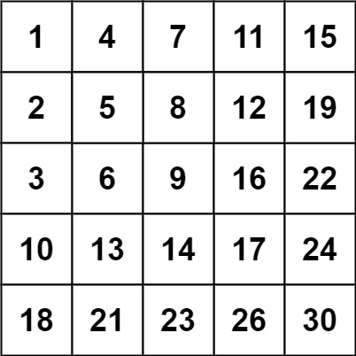

[官网链接](https://leetcode.cn/problems/search-a-2d-matrix-ii/) \| 难度: 中等

## 问题描述: 

编写一个高效的算法来搜索 `*m* x *n*` 矩阵 `matrix` 中的一个目标值 `target` 。该矩阵具有以下特性: 

- 每行的元素从左到右升序排列。
- 每列的元素从上到下升序排列。

**示例 1:**


```
输入: matrix = [[1,4,7,11,15],[2,5,8,12,19],[3,6,9,16,22],[10,13,14,17,24],[18,21,23,26,30]], target = 5
输出: true
```

**示例 2:**



```
输入: matrix = [[1,4,7,11,15],[2,5,8,12,19],[3,6,9,16,22],[10,13,14,17,24],[18,21,23,26,30]], target = 20
输出: false
```


## 解题思路: 


## Java代码: 

