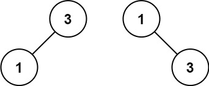

[官网链接](https://leetcode.cn/problems/convert-sorted-array-to-binary-search-tree/) \| 难度: 简单

## 问题描述: 

给你一个整数数组 `nums` ，其中元素已经按 **升序** 排列，请你将其转换为一棵 平衡 二叉搜索树。

**示例 1:**


```
输入: nums = [-10,-3,0,5,9]
输出: [0,-3,9,-10,null,5]
解释: [0,-10,5,null,-3,null,9] 也将被视为正确答案: 
```


**示例 2:**



```
输入: nums = [1,3]
输出: [3,1]
解释: [1,null,3] 和 [3,1] 都是高度平衡二叉搜索树。
```

**提示: `nums` 按 **严格递增** 顺序排列**

## 解题思路: 


## Java代码: 
