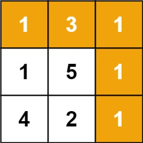

[官网链接](https://leetcode.cn/problems/minimum-path-sum/) \| 难度: 中等

## 问题描述: 

给定一个包含非负整数的 `*m* x *n*` 网格 `grid` ，请找出一条从左上角到右下角的路径，使得路径上的数字总和为最小。

**说明:** 每次只能向下或者向右移动一步。

**示例 1:**



```java
输入: grid = [[1,3,1],[1,5,1],[4,2,1]]
输出: 7
解释: 因为路径 1→3→1→1→1 的总和最小。
```

**示例 2:**

```java
输入: grid = [[1,2,3],[4,5,6]]
输出: 12
```

## 解题思路: 


## Java代码: 
